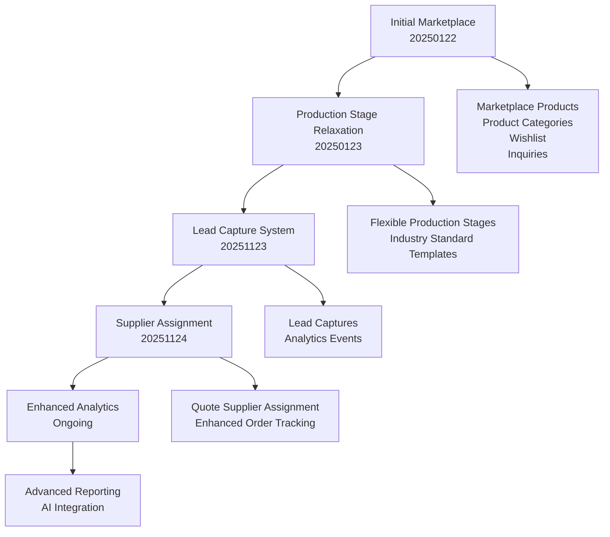
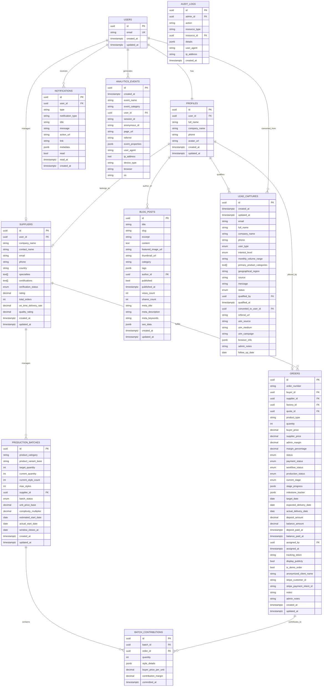

# Database Schema Documentation

<cite>
**Referenced Files in This Document**
- [20250122000000_create_marketplace_system.sql](file://supabase/migrations/20250122000000_create_marketplace_system.sql)
- [20251123052149_create_lead_capture_system.sql](file://supabase/migrations/20251123052149_create_lead_capture_system.sql)
- [20250123000000_relax_production_stages.sql](file://supabase/migrations/20250123000000_relax_production_stages.sql)
- [add_supplier_to_quotes.sql](file://supabase/migrations/add_supplier_to_quotes.sql)
- [database.ts](file://src/types/database.ts)
- [supabaseHelpers.ts](file://src/lib/supabaseHelpers.ts)
- [types.ts](file://src/integrations/supabase/types.ts)
- [client.ts](file://src/integrations/supabase/client.ts)
</cite>

## Table of Contents
1. [Introduction](#introduction)
2. [Schema Evolution Overview](#schema-evolution-overview)
3. [Core Entity Relationships](#core-entity-relationships)
4. [Key Tables Documentation](#key-tables-documentation)
5. [Enumerated Types and Constraints](#enumerated-types-and-constraints)
6. [Type Safety Implementation](#type-safety-implementation)
7. [Row Level Security Policies](#row-level-security-policies)
8. [Performance Considerations](#performance-considerations)
9. [Data Access Patterns](#data-access-patterns)
10. [Migration History](#migration-history)

## Introduction

The Sleek Apparels database schema represents a comprehensive B2B marketplace platform built on PostgreSQL with Supabase. The schema evolved from a basic marketplace system to a sophisticated production tracking platform with lead capture capabilities. It supports multiple user roles (buyers, suppliers, factories, admins) and implements robust security through Row Level Security (RLS) policies.

The database architecture follows a modular design with clear separation of concerns across marketplace operations, production tracking, content management, and administrative functions. All tables are designed with type safety in mind, leveraging TypeScript interfaces for frontend consistency and PostgreSQL's native type system for backend reliability.

## Schema Evolution Overview

The database schema underwent significant evolution from its initial marketplace-focused design to a comprehensive production management system:



**Diagram sources**
- [20250122000000_create_marketplace_system.sql](file://supabase/migrations/20250122000000_create_marketplace_system.sql#L1-L532)
- [20250123000000_relax_production_stages.sql](file://supabase/migrations/20250123000000_relax_production_stages.sql#L1-L42)
- [20251123052149_create_lead_capture_system.sql](file://supabase/migrations/20251123052149_create_lead_capture_system.sql#L1-L188)
- [add_supplier_to_quotes.sql](file://supabase/migrations/add_supplier_to_quotes.sql#L1-L28)

**Section sources**
- [20250122000000_create_marketplace_system.sql](file://supabase/migrations/20250122000000_create_marketplace_system.sql#L1-L532)
- [20250123000000_relax_production_stages.sql](file://supabase/migrations/20250123000000_relax_production_stages.sql#L1-L42)
- [20251123052149_create_lead_capture_system.sql](file://supabase/migrations/20251123052149_create_lead_capture_system.sql#L1-L188)
- [add_supplier_to_quotes.sql](file://supabase/migrations/add_supplier_to_quotes.sql#L1-L28)

## Core Entity Relationships

The database schema implements a comprehensive entity relationship model supporting the platform's multi-role architecture:



**Diagram sources**
- [20250122000000_create_marketplace_system.sql](file://supabase/migrations/20250122000000_create_marketplace_system.sql#L42-L118)
- [20251123052149_create_lead_capture_system.sql](file://supabase/migrations/20251123052149_create_lead_capture_system.sql#L5-L43)
- [database.ts](file://src/types/database.ts#L460-L579)

## Key Tables Documentation

### Users and Profiles

The `profiles` table serves as the foundational user information table, extending the Supabase auth system with additional business-specific attributes.

**Table Structure:**
- **Primary Key:** `id` (UUID)
- **Foreign Key:** `user_id` (UUID) referencing auth.users
- **Core Fields:** `full_name`, `company_name`, `phone`, `avatar_url`
- **Timestamps:** `created_at`, `updated_at`

**Relationships:**
- One-to-one relationship with auth.users
- Many-to-many through user_roles for role assignments
- Bidirectional relationships with suppliers, orders, and blog posts

**Section sources**
- [20250122000000_create_marketplace_system.sql](file://supabase/migrations/20250122000000_create_marketplace_system.sql#L42-L118)
- [database.ts](file://src/types/database.ts#L459-L469)

### Suppliers

The suppliers table manages manufacturing partners with comprehensive capability and performance tracking.

**Table Structure:**
- **Primary Key:** `id` (UUID)
- **Foreign Key:** `user_id` (UUID) for user association
- **Business Information:** `company_name`, `contact_name`, `email`, `phone`, `country`
- **Capabilities:** `specialties` (text array), `certifications` (text array)
- **Performance Metrics:** `rating`, `total_orders`, `on_time_delivery_rate`, `quality_rating`
- **Verification:** `verification_status` with enum values

**Key Features:**
- Supplier categorization through specialties
- Capability tracking with min/max order quantities
- Performance monitoring with delivery and quality ratings
- Verification workflow support

**Section sources**
- [20250122000000_create_marketplace_system.sql](file://supabase/migrations/20250122000000_create_marketplace_system.sql#L42-L118)
- [database.ts](file://src/types/database.ts#L502-L520)

### Orders

The orders table represents the core transactional entity, tracking the complete lifecycle from quote to delivery.

**Table Structure:**
- **Primary Key:** `id` (UUID)
- **Unique Identifier:** `order_number`
- **Participants:** `buyer_id`, `supplier_id`, `factory_id`
- **Product Details:** `product_type`, `quantity`, pricing (`buyer_price`, `supplier_price`)
- **Status Tracking:** `status`, `payment_status`, `workflow_status`, `production_status`
- **Production Pipeline:** `current_stage`, `stage_progress`, `milestone_tracker`
- **Timeline:** `target_date`, `expected_delivery_date`, `actual_delivery_date`
- **Financials:** `deposit_amount`, `balance_amount`, payment timestamps
- **Administrative:** `assigned_by`, `assigned_at`, `tracking_token`

**Production Workflow States:**
- **Workflow Status:** quote_requested → quote_provided → quote_accepted → assigned_to_supplier → in_production → quality_check → shipped → delivered → completed
- **Production Stage:** yarn_received → knitting → linking → washing_finishing → final_qc → packing → ready_to_ship
- **Payment Status:** pending → partial → paid → overdue

**Section sources**
- [20250122000000_create_marketplace_system.sql](file://supabase/migrations/20250122000000_create_marketplace_system.sql#L42-L118)
- [database.ts](file://src/types/database.ts#L399-L438)

### Production Batches

The production batches table manages group production runs across multiple orders.

**Table Structure:**
- **Primary Key:** `id` (UUID)
- **Product Information:** `product_category`, `product_variant_base`
- **Quantity Management:** `target_quantity`, `current_quantity`, `current_style_count`, `max_styles`
- **Supplier Association:** `supplier_id` (UUID)
- **Status:** `batch_status` with values filling → confirmed → in_production → completed → cancelled
- **Pricing:** `unit_price_base`, `complexity_multiplier`
- **Timeline:** `estimated_start_date`, `actual_start_date`, `window_closes_at`

**Relationships:**
- Many-to-many with orders through batch_contributions
- One-to-many with batch_contributions
- Supplier capacity management

**Section sources**
- [20250122000000_create_marketplace_system.sql](file://supabase/migrations/20250122000000_create_marketplace_system.sql#L42-L118)
- [database.ts](file://src/types/database.ts#L440-L457)

### Notifications

The notifications system provides real-time communication tracking.

**Table Structure:**
- **Primary Key:** `id` (UUID)
- **Recipient:** `user_id` (UUID)
- **Content:** `title`, `message`, `type`, `notification_type`
- **Actionable Elements:** `action_url`, `link`, `metadata` (JSONB)
- **State:** `read` (boolean), `read_at` timestamp
- **Timestamp:** `created_at`

**Notification Types:**
- Order updates
- Production stage changes
- Quote approvals/rejections
- System alerts
- Administrative notifications

**Section sources**
- [20250122000000_create_marketplace_system.sql](file://supabase/migrations/20250122000000_create_marketplace_system.sql#L42-L118)
- [database.ts](file://src/types/database.ts#L339-L352)

### Blog Posts

The blog system supports content management for marketing and educational purposes.

**Table Structure:**
- **Primary Key:** `id` (UUID)
- **Content:** `title`, `slug`, `excerpt`, `content`, `featured_image_url`, `thumbnail_url`
- **Organization:** `category`, `tags` (JSONB)
- **Authorship:** `author_id` (UUID)
- **Publication:** `published`, `published_at`
- **Analytics:** `views_count`, `shares_count`
- **SEO:** `meta_title`, `meta_description`, `meta_keywords`, `seo_data` (JSONB)
- **Timestamps:** `created_at`, `updated_at`

**Section sources**
- [20250122000000_create_marketplace_system.sql](file://supabase/migrations/20250122000000_create_marketplace_system.sql#L42-L118)
- [database.ts](file://src/types/database.ts#L115-L136)

### Audit Logs

The audit logging system tracks administrative actions for compliance and monitoring.

**Table Structure:**
- **Primary Key:** `id` (UUID)
- **Actor:** `admin_id` (UUID)
- **Action:** `action` (text), `resource_type` (text), `resource_id` (UUID)
- **Details:** `details` (JSONB)
- **Technical:** `user_agent`, `ip_address`
- **Timestamp:** `created_at`

**Section sources**
- [20250122000000_create_marketplace_system.sql](file://supabase/migrations/20250122000000_create_marketplace_system.sql#L42-L118)
- [database.ts](file://src/types/database.ts#L33-L43)

### Lead Captures

The lead capture system collects prospect information for marketing and AI training.

**Table Structure:**
- **Primary Key:** `id` (UUID)
- **Contact Information:** `email` (unique), `full_name`, `company_name`, `phone`
- **Qualification:** `user_type` (enum), `interest_level` (enum), `monthly_volume_range`
- **Preferences:** `primary_product_categories` (text array), `geographical_region`
- **Source Tracking:** `source`, `referral_url`, `utm_source`, `utm_medium`, `utm_campaign`
- **Status:** `status` (enum), `qualified_by` (UUID), `qualified_at`, `converted_to_user_id` (UUID)
- **Metadata:** `browser_info` (JSONB), `admin_notes`, `follow_up_date`
- **Timestamps:** `created_at`, `updated_at`

**Section sources**
- [20251123052149_create_lead_capture_system.sql](file://supabase/migrations/20251123052149_create_lead_capture_system.sql#L5-L43)

### Analytics Events

The analytics system tracks user interactions and system events.

**Table Structure:**
- **Primary Key:** `id` (UUID)
- **Event Details:** `event_name`, `event_category`
- **User Identification:** `user_id` (UUID), `session_id`, `anonymous_id`
- **Context:** `page_url`, `referrer`, `event_properties` (JSONB)
- **Technical:** `user_agent`, `ip_address` (INET), `device_type`, `browser`, `os`
- **Timestamp:** `created_at`

**Section sources**
- [20251123052149_create_lead_capture_system.sql](file://supabase/migrations/20251123052149_create_lead_capture_system.sql#L53-L77)

## Enumerated Types and Constraints

### Production Stage Enumeration

The production stages represent the manufacturing pipeline with flexible naming:

```typescript
type ProductionStage = 
  | 'yarn_received'
  | 'knitting'
  | 'linking'
  | 'washing_finishing'
  | 'final_qc'
  | 'packing'
  | 'ready_to_ship';
```

**Migration Impact:**
- Original enum constraint removed in favor of text field
- Industry-standard stage names added to production_stage_templates
- Existing orders reset to 'Order Confirmation' stage

### Verification Status

```typescript
type VerificationStatus = 'pending' | 'verified' | 'rejected';
```

### Order Workflow Status

```typescript
type OrderWorkflowStatus = 
  | 'quote_requested'
  | 'quote_provided'
  | 'quote_accepted'
  | 'assigned_to_supplier'
  | 'in_production'
  | 'quality_check'
  | 'shipped'
  | 'delivered'
  | 'completed';
```

### Batch Status

```typescript
type BatchStatus = 'filling' | 'confirmed' | 'in_production' | 'completed' | 'cancelled';
```

### Lead Status

```typescript
type LeadStatus = 'new' | 'contacted' | 'qualified' | 'proposal' | 'negotiation' | 'closed_won' | 'closed_lost';
```

### Payment Status

```typescript
type PaymentStatus = 'pending' | 'partial' | 'paid' | 'overdue';
```

**Section sources**
- [20250123000000_relax_production_stages.sql](file://supabase/migrations/20250123000000_relax_production_stages.sql#L12-L41)
- [database.ts](file://src/types/database.ts#L19-L30)

## Type Safety Implementation

### TypeScript Interface System

The database schema implements comprehensive type safety through TypeScript interfaces that mirror PostgreSQL table structures:

```typescript
// Core table interfaces
export interface Order {
  id: string;
  order_number: string;
  buyer_id: string;
  supplier_id: string | null;
  factory_id: string | null;
  quote_id: string | null;
  product_type: string;
  quantity: number;
  buyer_price: number | null;
  supplier_price: number | null;
  admin_margin: number | null;
  margin_percentage: number | null;
  status: string;
  payment_status: PaymentStatus;
  workflow_status: OrderWorkflowStatus;
  production_status: string;
  current_stage: ProductionStage;
  stage_progress: Record<string, number>;
  milestone_tracker: Record<string, any>;
  target_date: string | null;
  expected_delivery_date: string | null;
  actual_delivery_date: string | null;
  deposit_amount: number | null;
  balance_amount: number | null;
  deposit_paid_at: string | null;
  balance_paid_at: string | null;
  assigned_by: string | null;
  assigned_at: string | null;
  tracking_token: string | null;
  display_publicly: boolean;
  is_demo_order: boolean;
  anonymized_client_name: string | null;
  stripe_customer_id: string | null;
  stripe_payment_intent_id: string | null;
  notes: string | null;
  admin_notes: string | null;
  created_at: string;
  updated_at: string;
}

// Utility types for database operations
export type InsertData<T> = Partial<Omit<T, 'id'>> & {
  id?: string;
};

export type UpdateData<T> = Partial<Omit<T, 'id' | 'created_at'>>;
```

### Supabase Client Integration

The type safety extends to the Supabase client through generated types:

```typescript
// Generated type system
export type Database = {
  public: {
    Tables: {
      orders: {
        Row: Order;
        Insert: InsertData<Order>;
        Update: UpdateData<Order>;
      };
      // ... other table types
    };
  };
};
```

### Helper Functions

TypeScript helper functions provide type-safe database operations:

```typescript
// Type-safe query builder
export const queryTable = <T>(tableName: string): any => {
  return (supabase as any).from(tableName) as any;
};

// Order-specific helpers with proper typing
export const orderHelpers = {
  async getById(orderId: string) {
    const { data, error } = await supabase
      .from('orders')
      .select('*')
      .eq('id', orderId)
      .maybeSingle();
    return { data: data as Order | null, error };
  },
  // ... other typed helpers
};
```

**Section sources**
- [database.ts](file://src/types/database.ts#L1-L579)
- [supabaseHelpers.ts](file://src/lib/supabaseHelpers.ts#L1-L376)
- [types.ts](file://src/integrations/supabase/types.ts#L1-L200)

## Row Level Security Policies

The database implements comprehensive RLS policies to ensure data isolation and security:

### Marketplace Products Policies

```sql
-- Anyone can view approved products
CREATE POLICY "Anyone can view approved products" ON marketplace_products
  FOR SELECT USING (status = 'approved');

-- Suppliers can view their own products  
CREATE POLICY "Suppliers can view their own products" ON marketplace_products
  FOR SELECT USING (
    supplier_id IN (
      SELECT id FROM suppliers WHERE user_id = auth.uid()
    )
  );

-- Suppliers can create products
CREATE POLICY "Suppliers can create products" ON marketplace_products
  FOR INSERT WITH CHECK (
    supplier_id IN (
      SELECT id FROM suppliers WHERE user_id = auth.uid() AND can_list_products = true
    )
  );

-- Admins can view all products
CREATE POLICY "Admins can view all products" ON marketplace_products
  FOR SELECT USING (
    EXISTS (
      SELECT 1 FROM user_roles 
      WHERE user_id = auth.uid() AND role = 'admin'
    )
  );
```

### Product Inquiries Policies

```sql
-- Buyers can create inquiries
CREATE POLICY "Buyers can create inquiries" ON product_inquiries
  FOR INSERT WITH CHECK (buyer_id = auth.uid());

-- Buyers can view their own inquiries
CREATE POLICY "Buyers can view their own inquiries" ON product_inquiries
  FOR SELECT USING (buyer_id = auth.uid());

-- Suppliers can view inquiries for their products
CREATE POLICY "Suppliers can view inquiries for their products" ON product_inquiries
  FOR SELECT USING (
    product_id IN (
      SELECT id FROM marketplace_products 
      WHERE supplier_id IN (
        SELECT id FROM suppliers WHERE user_id = auth.uid()
      )
    )
  );
```

### Lead Capture Policies

```sql
-- Public can submit lead capture form
CREATE POLICY "Anyone can submit lead capture form"
  ON public.lead_captures
  FOR INSERT
  TO public
  WITH CHECK (true);

-- Admins can view all lead captures
CREATE POLICY "Admins can view all lead captures"
  ON public.lead_captures
  FOR SELECT
  TO authenticated
  USING (
    EXISTS (
      SELECT 1 FROM public.user_roles
      WHERE user_roles.user_id = auth.uid()
      AND user_roles.role = 'admin'
    )
  );
```

### Analytics Events Policies

```sql
-- Anyone can insert analytics events
CREATE POLICY "Anyone can insert analytics events"
  ON public.analytics_events
  FOR INSERT
  TO public
  WITH CHECK (true);

-- Admins can view all analytics events
CREATE POLICY "Admins can view all analytics events"
  ON public.analytics_events
  FOR SELECT
  TO authenticated
  USING (
    EXISTS (
      SELECT 1 FROM public.user_roles
      WHERE user_roles.user_id = auth.uid()
      AND user_roles.role = 'admin'
    )
  );
```

**Section sources**
- [20250122000000_create_marketplace_system.sql](file://supabase/migrations/20250122000000_create_marketplace_system.sql#L248-L328)
- [20251123052149_create_lead_capture_system.sql](file://supabase/migrations/20251123052149_create_lead_capture_system.sql#L86-L126)

## Performance Considerations

### Index Strategy

The schema implements comprehensive indexing for optimal query performance:

**Marketplace Products Indexes:**
- `idx_marketplace_products_supplier` (supplier_id)
- `idx_marketplace_products_status` (status)
- `idx_marketplace_products_category` (category)
- `idx_marketplace_products_approved` (status, approval_date DESC) WHERE status = 'approved'
- `idx_marketplace_products_featured` (is_featured, featured_until) WHERE is_featured = true
- `idx_marketplace_products_price` (final_price)
- `idx_marketplace_products_search` (GIN index for full-text search)

**Lead Capture Indexes:**
- `idx_lead_captures_email` (email)
- `idx_lead_captures_status` (status)
- `idx_lead_captures_user_type` (user_type)
- `idx_lead_captures_created_at` (created_at DESC)
- `idx_lead_captures_converted_to` (converted_to_user_id)

**Analytics Events Indexes:**
- `idx_analytics_events_event_name` (event_name)
- `idx_analytics_events_user_id` (user_id)
- `idx_analytics_events_created_at` (created_at DESC)
- `idx_analytics_events_category` (event_category)

### Query Optimization Patterns

**Efficient Product Search:**
```sql
-- Full-text search with ranking
SELECT 
  mp.id,
  mp.title,
  mp.description,
  mp.category,
  mp.final_price,
  ts_rank(
    to_tsvector('english', mp.title || ' ' || COALESCE(mp.description, '')),
    plainto_tsquery('english', search_query)
  ) as relevance
FROM marketplace_products mp
WHERE mp.status = 'approved'
  AND to_tsvector('english', mp.title || ' ' || COALESCE(mp.description, '')) @@ plainto_tsquery('english', search_query)
ORDER BY relevance DESC, mp.created_at DESC
LIMIT 20;
```

**Supplier Performance Aggregation:**
```sql
-- Efficient supplier rating calculation
CREATE OR REPLACE FUNCTION calculate_supplier_approval_rating(supplier_uuid UUID)
RETURNS DECIMAL AS $$
DECLARE
  total_submitted INTEGER;
  total_approved INTEGER;
  rating DECIMAL;
BEGIN
  SELECT COUNT(*) INTO total_submitted
  FROM marketplace_products
  WHERE supplier_id = supplier_uuid 
  AND status IN ('approved', 'rejected');
  
  IF total_submitted = 0 THEN
    RETURN 0;
  END IF;
  
  SELECT COUNT(*) INTO total_approved
  FROM marketplace_products
  WHERE supplier_id = supplier_uuid 
  AND status = 'approved';
  
  rating := (total_approved::DECIMAL / total_submitted::DECIMAL) * 100;
  
  UPDATE suppliers 
  SET approval_rating = rating 
  WHERE id = supplier_uuid;
  
  RETURN rating;
END;
$$ LANGUAGE plpgsql;
```

### Storage Considerations

**JSONB Fields for Flexibility:**
- `specifications` in marketplace_products
- `quote_data` in ai_quotes
- `event_properties` in analytics_events
- `seo_data` in blog_posts

**Array Fields for Scalability:**
- `subcategories` in suppliers
- `images` in marketplace_products
- `photos` in order_updates
- `tags` in blog_posts

**Section sources**
- [20250122000000_create_marketplace_system.sql](file://supabase/migrations/20250122000000_create_marketplace_system.sql#L120-L128)
- [20251123052149_create_lead_capture_system.sql](file://supabase/migrations/20251123052149_create_lead_capture_system.sql#L45-L51)

## Data Access Patterns

### CRUD Operations Pattern

The application implements standardized CRUD patterns through TypeScript helper functions:

```typescript
// Generic type-safe query builder
export const queryTable = <T>(tableName: string): any => {
  return (supabase as any).from(tableName) as any;
};

// Order retrieval with relationships
export const orderHelpers = {
  async getWithRelations(orderId: string) {
    const { data, error } = await supabase
      .from('orders')
      .select(`
        *,
        supplier:suppliers(*),
        order_documents(*),
        order_messages(*),
        order_updates(*)
      `)
      .eq('id', orderId)
      .maybeSingle();
    return { data: data as any as OrderWithRelations | null, error };
  }
};
```

### Transaction Patterns

**Order Creation Workflow:**
```typescript
// 1. Create order
const { data: order, error: orderError } = await supabase
  .from('orders')
  .insert({
    order_number: generateOrderNumber(),
    buyer_id: userId,
    product_type: productType,
    quantity: quantity,
    status: 'quote_requested',
    workflow_status: 'quote_requested',
    created_at: new Date().toISOString()
  })
  .select()
  .single();

// 2. Create associated records
const { error: updateError } = await supabase
  .from('orders')
  .update({ 
    workflow_status: 'quote_provided',
    updated_at: new Date().toISOString()
  })
  .eq('id', order.id);
```

### Batch Operations

**Production Batch Management:**
```typescript
// Add order to batch
const { data: contribution, error } = await supabase
  .from('batch_contributions')
  .insert({
    batch_id: batchId,
    order_id: orderId,
    quantity: orderQuantity,
    style_details: styleDetails,
    buyer_price_per_unit: pricePerUnit,
    committed_at: new Date().toISOString()
  });
```

### Real-time Data Patterns

**Subscription Patterns:**
```typescript
// Real-time order updates
const subscription = supabase
  .channel('orders')
  .on('postgres_changes', 
    { event: '*', schema: 'public', table: 'orders' },
    (payload) => {
      console.log('Order change:', payload);
      // Update UI state
    }
  )
  .subscribe();
```

**Section sources**
- [supabaseHelpers.ts](file://src/lib/supabaseHelpers.ts#L26-L376)

## Migration History

### Initial Marketplace System (2025-01-22)

The foundation migration established the core marketplace infrastructure:

**Key Changes:**
- Created marketplace_products table with comprehensive product catalog
- Established product categories and subcategories
- Implemented product approval workflow
- Added product inquiries and wishlist functionality
- Created product analytics tracking
- Implemented Row Level Security policies

**Tables Created:**
- marketplace_products
- product_categories
- product_inquiries
- product_wishlist
- product_approval_log
- product_analytics

### Production Stage Relaxation (2025-01-23)

Relaxed production stage constraints to support industry-standard terminology:

**Key Changes:**
- Changed production_stage enum to text field
- Added industry-standard production stage templates
- Updated existing orders to new stage naming convention
- Removed dependency on enum constraints

**Tables Modified:**
- orders (current_stage column type change)
- order_updates (stage column type change)
- qc_checks (stage column type change)
- production_stage_templates (seeded with industry stages)

### Lead Capture System (2025-11-23)

Added comprehensive lead capture and analytics infrastructure:

**Key Changes:**
- Created lead_captures table for prospect management
- Added analytics_events table for user behavior tracking
- Implemented lead qualification workflow
- Added UTM tracking and referral analytics
- Enhanced privacy controls with RLS policies

**Tables Created:**
- lead_captures
- analytics_events

### Supplier Assignment Enhancement (2025-11-24)

Extended quote functionality with supplier assignment capabilities:

**Key Changes:**
- Added supplier_id, assigned_at, and assigned_by columns to quotes table
- Enhanced quote status tracking
- Improved supplier quote management
- Added indexes for efficient supplier quote lookups

**Tables Modified:**
- quotes (added supplier assignment columns)

**Section sources**
- [20250122000000_create_marketplace_system.sql](file://supabase/migrations/20250122000000_create_marketplace_system.sql#L1-L532)
- [20250123000000_relax_production_stages.sql](file://supabase/migrations/20250123000000_relax_production_stages.sql#L1-L42)
- [20251123052149_create_lead_capture_system.sql](file://supabase/migrations/20251123052149_create_lead_capture_system.sql#L1-L188)
- [add_supplier_to_quotes.sql](file://supabase/migrations/add_supplier_to_quotes.sql#L1-L28)