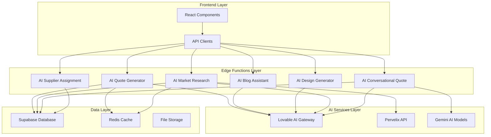
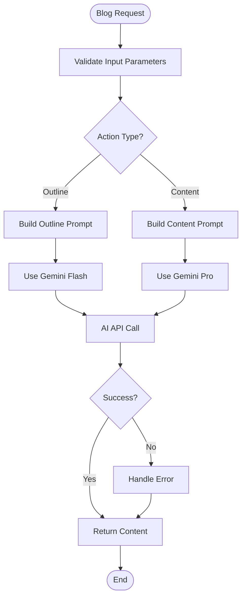
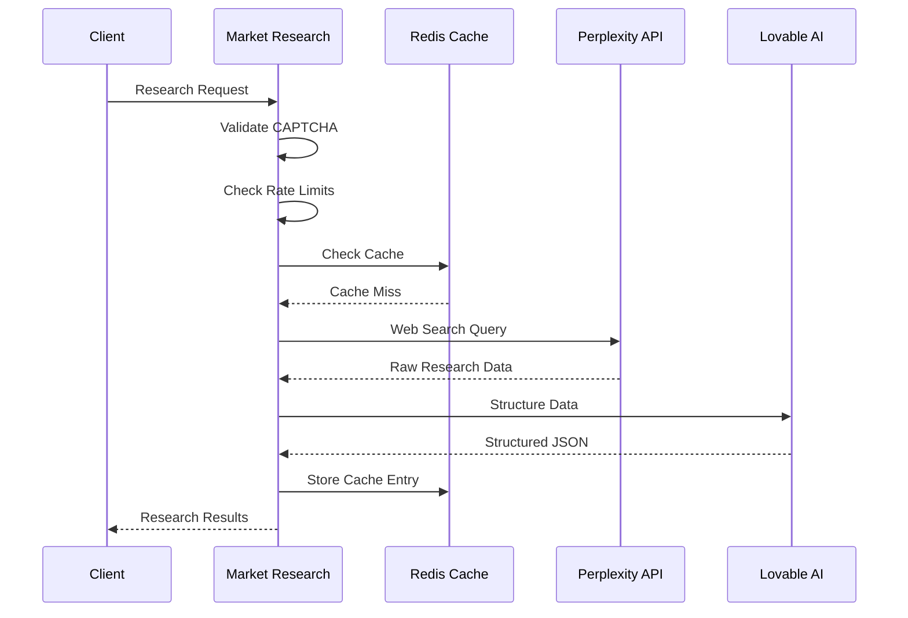
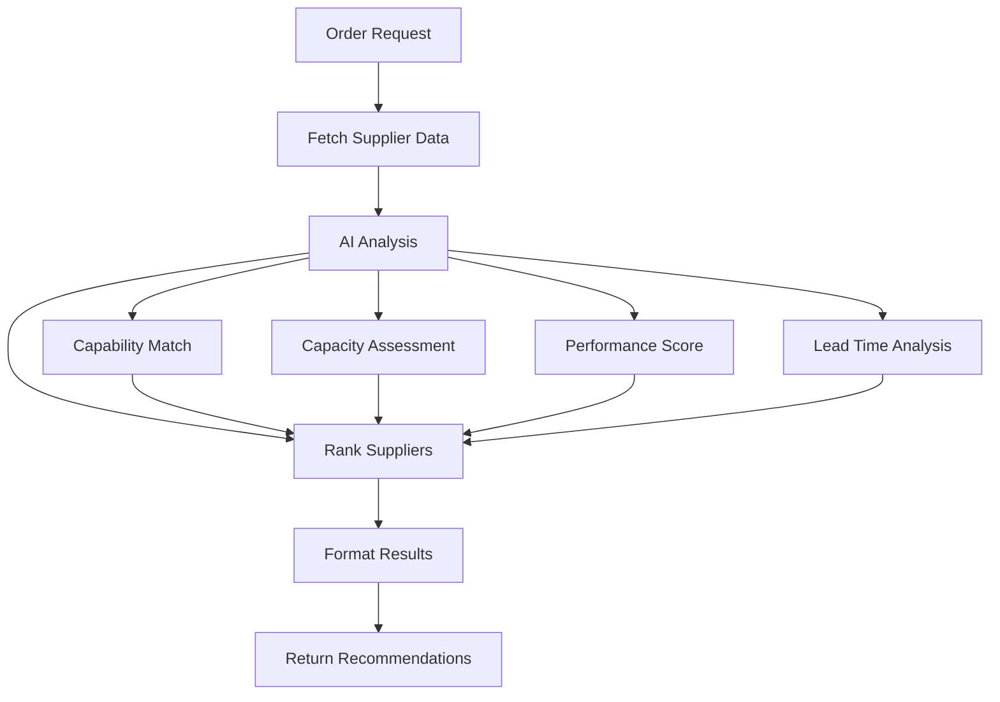
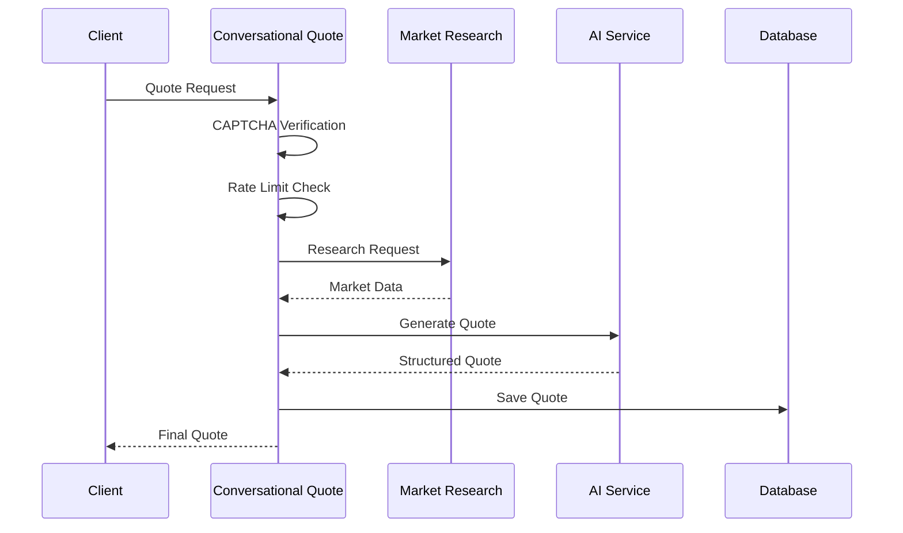
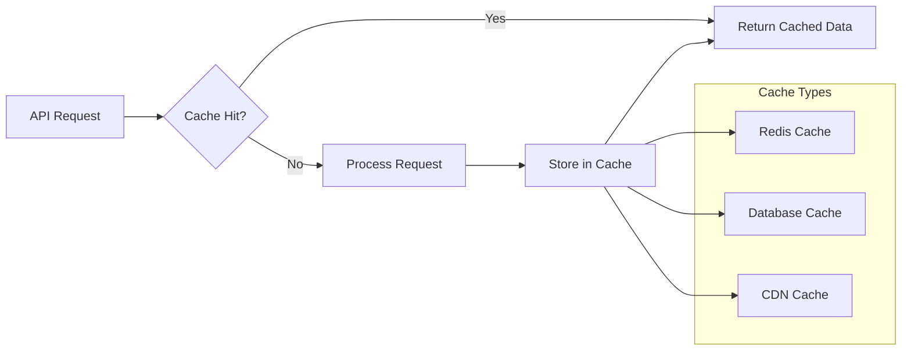

# AI Services

<cite>
**Referenced Files in This Document**
- [AIQuoteGenerator.tsx](file://src/components/AIQuoteGenerator.tsx)
- [ConversationalQuoteBuilder.tsx](file://src/components/quote/ConversationalQuoteBuilder.tsx)
- [ai-quote-generator/index.ts](file://supabase/functions/ai-quote-generator/index.ts)
- [ai-blog-assistant/index.ts](file://supabase/functions/ai-blog-assistant/index.ts)
- [ai-design-generator/index.ts](file://supabase/functions/ai-design-generator/index.ts)
- [ai-market-research/index.ts](file://supabase/functions/ai-market-research/index.ts)
- [ai-supplier-assignment/index.ts](file://supabase/functions/ai-supplier-assignment/index.ts)
- [ai-conversational-quote/index.ts](file://supabase/functions/ai-conversational-quote/index.ts)
- [aiQuote.ts](file://src/lib/api/aiQuote.ts)
- [logger.ts](file://supabase/functions/_shared/logger.ts)
- [bangladeshManufacturing.ts](file://src/lib/bangladeshManufacturing.ts)
</cite>

## Table of Contents
1. [Introduction](#introduction)
2. [Architecture Overview](#architecture-overview)
3. [AI Quote Generator](#ai-quote-generator)
4. [AI Blog Assistant](#ai-blog-assistant)
5. [AI Design Generator](#ai-design-generator)
6. [AI Market Research](#ai-market-research)
7. [AI Supplier Assignment](#ai-supplier-assignment)
8. [AI Conversational Quote](#ai-conversational-quote)
9. [Integration Patterns](#integration-patterns)
10. [Security & Authentication](#security--authentication)
11. [Performance & Caching](#performance--caching)
12. [Error Handling](#error-handling)
13. [Monitoring & Logging](#monitoring--logging)
14. [Best Practices](#best-practices)

## Introduction

The Sleek Apparels platform leverages AI-powered services to deliver intelligent automation across the entire manufacturing ecosystem. These services provide instant pricing, content generation, visual asset creation, competitive market insights, smart supplier matching, and natural language quote building capabilities. Built on a robust architecture using Supabase Edge Functions and Lovable AI Gateway, these services enable seamless integration between frontend React components and backend AI processing.

The AI services are designed with enterprise-grade security, comprehensive error handling, rate limiting, and performance optimization. They integrate seamlessly with the platform's production tracking system, enabling real-time decision-making and automated workflows.

## Architecture Overview

The AI services architecture follows a serverless edge computing pattern with the following key components:



**Diagram sources**
- [AIQuoteGenerator.tsx](file://src/components/AIQuoteGenerator.tsx#L1-L50)
- [ai-quote-generator/index.ts](file://supabase/functions/ai-quote-generator/index.ts#L1-L50)
- [ai-blog-assistant/index.ts](file://supabase/functions/ai-blog-assistant/index.ts#L1-L30)

**Section sources**
- [AIQuoteGenerator.tsx](file://src/components/AIQuoteGenerator.tsx#L1-L100)
- [ai-quote-generator/index.ts](file://supabase/functions/ai-quote-generator/index.ts#L1-L100)

## AI Quote Generator

The AI Quote Generator provides instant pricing and production timelines powered by AI analysis of manufacturing data and market conditions.

### Endpoint Specification

**Endpoint:** `POST /functions/v1/ai-quote-generator`

**Request Schema:**
```typescript
interface QuoteRequest {
  productType: string;
  quantity: number;
  complexityLevel?: 'simple' | 'medium' | 'complex';
  fabricType?: string;
  additionalRequirements?: string;
  customerEmail: string;
  customerName?: string;
  targetDate?: string;
  sessionId?: string;
  files?: Array<{
    name: string;
    type: string;
    data: string;
  }>;
}
```

**Response Schema:**
```typescript
interface QuoteResponse {
  success: boolean;
  quote: {
    id: string;
    total_price: number;
    estimated_delivery_days: number;
    quote_data: {
      breakdown: {
        baseUnitPrice: number;
        complexityFactor: number;
        volumeDiscount: number;
        finalUnitPrice: number;
        totalPrice: number;
      };
      timeline: {
        samplingDays: number;
        productionDays: number;
        bufferDays: number;
        totalDays: number;
        estimatedDeliveryDate: string;
      };
      moqRange: {
        min: number;
        max: number;
        requested: number;
      };
    };
    ai_suggestions: string;
  };
  timeline: Array<{
    stage: string;
    days: number;
    startDate: string;
    endDate: string;
  }>;
  aiInsights: string;
}
```

### Implementation Details

The AI Quote Generator combines multiple data sources to provide accurate pricing:

1. **Product Configuration Database**: Retrieves base pricing and manufacturing parameters
2. **Volume Discount Engine**: Applies tiered discounts based on quantity
3. **Complexity Multipliers**: Adjusts pricing based on product complexity
4. **AI Analysis**: Processes uploaded design files and provides optimization suggestions

### Rate Limiting Strategy

The service implements tiered rate limiting:

- **IP-based**: 15 quotes per IP per day
- **Authenticated users**: 20 quotes per day  
- **Anonymous sessions**: 3 quotes per session per day

### Error Handling

Comprehensive error handling covers:
- Validation errors with specific field feedback
- AI API timeouts with graceful degradation
- Database connectivity issues with retry logic
- File processing failures with alternative workflows

**Section sources**
- [ai-quote-generator/index.ts](file://supabase/functions/ai-quote-generator/index.ts#L1-L807)
- [AIQuoteGenerator.tsx](file://src/components/AIQuoteGenerator.tsx#L1-L200)

## AI Blog Assistant

The AI Blog Assistant generates comprehensive content for the apparel manufacturing industry, including outlines and full articles.

### Endpoint Specification

**Endpoint:** `POST /functions/v1/ai-blog-assistant`

**Request Schema:**
```typescript
interface BlogRequest {
  action: 'generate_outline' | 'write_content';
  topic: string;
  outline?: string;
}
```

**Response Schema:**
```typescript
interface BlogResponse {
  success: boolean;
  content: string;
  error?: string;
}
```

### Supported Actions

1. **generate_outline**: Creates comprehensive blog post outlines
2. **write_content**: Generates full articles from provided outlines

### AI Model Selection

- **Outline Generation**: Uses `google/gemini-2.5-flash` for fast processing
- **Content Writing**: Uses `google/gemini-2.5-pro` for longer, more complex content

### Content Generation Pipeline



**Diagram sources**
- [ai-blog-assistant/index.ts](file://supabase/functions/ai-blog-assistant/index.ts#L15-L84)

**Section sources**
- [ai-blog-assistant/index.ts](file://supabase/functions/ai-blog-assistant/index.ts#L1-L84)

## AI Design Generator

The AI Design Generator creates high-quality, print-ready designs for apparel manufacturing.

### Endpoint Specification

**Endpoint:** `POST /functions/v1/ai-design-generator`

**Request Schema:**
```typescript
interface DesignRequest {
  prompt: string;
  stylePreferences?: string[];
  colorPalette?: string[];
  complexity?: 'low' | 'medium' | 'high';
}
```

**Response Schema:**
```typescript
interface DesignResponse {
  pattern: {
    imageUrl: string;
    prompt: string;
    stylePreferences: string[];
    colorPalette: string[];
    complexity: string;
  };
  error?: string;
}
```

### Design Generation Process

The service processes design requests through a sophisticated pipeline:

1. **Prompt Enhancement**: Adds manufacturing-specific guidelines
2. **Style Analysis**: Incorporates user preferences and color schemes
3. **AI Generation**: Uses specialized image generation model
4. **Quality Verification**: Ensures print-ready resolution

### Model Configuration

Uses `google/gemini-2.5-flash-image-preview` for design generation with:
- High-resolution output (ultra-high quality)
- Commercial print preparation
- Vector-friendly formats
- Manufacturing optimization

**Section sources**
- [ai-design-generator/index.ts](file://supabase/functions/ai-design-generator/index.ts#L1-L121)

## AI Market Research

The AI Market Research service provides real-time market pricing data and competitive analysis for apparel manufacturing.

### Endpoint Specification

**Endpoint:** `POST /functions/v1/ai-market-research`

**Request Schema:**
```typescript
interface ResearchRequest {
  productType: string;
  quantity: number;
  fabricType?: string;
  complexity?: string;
  additionalRequirements?: string;
  captchaToken?: string;
}
```

**Response Schema:**
```typescript
interface ResearchResponse {
  success: boolean;
  cached: boolean;
  research: {
    averageUnitCost: number;
    materialCostPerUnit: number;
    leadTimeDays: number;
    markupPercentage: number;
    comparableProducts: Array<{
      name: string;
      price: number;
      source: string;
    }>;
    sources: string[];
    confidenceScore: number;
  };
  sources: string[];
  confidence_score: number;
  cache_id?: string;
}
```

### Research Pipeline



**Diagram sources**
- [ai-market-research/index.ts](file://supabase/functions/ai-market-research/index.ts#L150-L250)

### Caching Strategy

- **24-hour TTL**: Research data cached for 24 hours
- **Quantity-based**: Different caches for different quantity ranges
- **Product Category**: Separate caches per product type
- **Confidence Scoring**: Automatic cache invalidation based on confidence scores

### Data Sources

1. **Perplexity AI**: Comprehensive web search for current market data
2. **Bangladesh Manufacturers**: Local pricing benchmarks
3. **Industry Reports**: Historical pricing trends
4. **Competitor Analysis**: Comparable product pricing

**Section sources**
- [ai-market-research/index.ts](file://supabase/functions/ai-market-research/index.ts#L1-L335)

## AI Supplier Assignment

The AI Supplier Assignment service matches manufacturing orders with optimal suppliers based on capabilities and requirements.

### Endpoint Specification

**Endpoint:** `POST /functions/v1/ai-supplier-assignment`

**Request Schema:**
```typescript
interface AssignmentRequest {
  order_id?: string;
  product_type: string;
  quantity: number;
  requirements?: string;
}
```

**Response Schema:**
```typescript
interface AssignmentResponse {
  success: boolean;
  recommendations: Array<{
    supplier_id: string;
    rank: number;
    confidence_score: number;
    reasoning: string;
    supplier_name?: string;
    supplier_details?: any;
  }>;
}
```

### Matching Algorithm

The service uses a sophisticated matching algorithm:

1. **Capability Analysis**: Matches product type specializations
2. **Capacity Evaluation**: Considers monthly production capacity
3. **Performance Scoring**: Analyzes historical performance
4. **Lead Time Optimization**: Minimizes delivery timelines
5. **Cost Efficiency**: Balances price and quality

### AI-Powered Recommendations



**Diagram sources**
- [ai-supplier-assignment/index.ts](file://supabase/functions/ai-supplier-assignment/index.ts#L35-L100)

**Section sources**
- [ai-supplier-assignment/index.ts](file://supabase/functions/ai-supplier-assignment/index.ts#L1-L134)

## AI Conversational Quote

The AI Conversational Quote service provides interactive, natural language quote generation with market research integration.

### Endpoint Specification

**Endpoint:** `POST /functions/v1/ai-conversational-quote`

**Request Schema:**
```typescript
interface ConversationalRequest {
  productType: string;
  quantity: number;
  fabricType?: string;
  complexity?: string;
  additionalRequirements?: string;
  customerEmail: string;
  customerName?: string;
  country?: string;
  phoneNumber?: string;
  sessionId?: string;
  marketResearchId?: string;
  captchaToken?: string;
}
```

**Response Schema:**
```typescript
interface ConversationalResponse {
  success: boolean;
  quote: {
    id: string;
    unitPrice: number;
    totalPrice: number;
    estimatedDeliveryDays: number;
    confidenceScore: number;
    priceBreakdown: {
      materials: number;
      labor: number;
      overhead: number;
      margin: number;
    };
    priceJustification: string;
    comparableProducts: Array<{
      name: string;
      price: number;
      supplier: string;
    }>;
    suggestions: string;
  };
}
```

### Conversational Flow

The service implements a sophisticated conversational flow:

1. **CAPTCHA Verification**: Security validation
2. **Rate Limiting**: Prevents abuse
3. **Market Research**: Gathers current pricing data
4. **AI Analysis**: Generates comprehensive quote
5. **Database Storage**: Persists quote for future reference

### Quote Generation Process



**Diagram sources**
- [ai-conversational-quote/index.ts](file://supabase/functions/ai-conversational-quote/index.ts#L150-L250)

**Section sources**
- [ai-conversational-quote/index.ts](file://supabase/functions/ai-conversational-quote/index.ts#L1-L385)
- [ConversationalQuoteBuilder.tsx](file://src/components/quote/ConversationalQuoteBuilder.tsx#L1-L100)

## Integration Patterns

### Frontend Integration

The AI services integrate with React components through standardized API patterns:

```typescript
// Example: AI Quote Generation
const generateAIQuote = async (request: AIQuoteRequest): Promise<AIQuoteResponse> => {
  const { data, error } = await supabase.functions.invoke('ai-quote-generator', {
    body: request
  });
  
  if (error) throw error;
  return data;
};
```

### Retry Logic Implementation

All AI services implement comprehensive retry logic:

```typescript
// Exponential backoff with maximum retries
const maxRetries = 3;
for (let attempt = 0; attempt < maxRetries; attempt++) {
  try {
    const response = await fetch(endpoint, { body: JSON.stringify(request) });
    if (response.ok) return response.json();
  } catch (error) {
    if (attempt < maxRetries - 1) {
      await new Promise(resolve => setTimeout(resolve, Math.pow(2, attempt) * 1000));
    }
  }
}
```

### Error Boundary Integration

Components wrap AI service calls with error boundaries:

```typescript
try {
  const result = await generateAIQuote(request);
  setQuoteResult(result);
} catch (error) {
  setError(error);
  // Show user-friendly error message
}
```

**Section sources**
- [aiQuote.ts](file://src/lib/api/aiQuote.ts#L1-L100)
- [AIQuoteGenerator.tsx](file://src/components/AIQuoteGenerator.tsx#L150-L250)

## Security & Authentication

### JWT Verification

All AI services implement JWT-based authentication:

```typescript
// Extract JWT from Authorization header
const authHeader = req.headers.get('Authorization');
let userId: string | null = null;

if (authHeader) {
  try {
    const token = authHeader.replace('Bearer ', '');
    const { data: { user } } = await supabaseClient.auth.getUser(token);
    userId = user?.id || null;
  } catch (error) {
    // Handle invalid token
  }
}
```

### Origin Validation

Services implement strict origin validation:

```typescript
const allowedOrigins = [
  'https://sleekapparels.com',
  'https://www.sleekapparels.com',
  'http://localhost:5173'
];

const origin = req.headers.get('origin');
if (!allowedOrigins.includes(origin)) {
  return new Response('Unauthorized', { status: 403 });
}
```

### CAPTCHA Protection

All AI services require CAPTCHA verification:

```typescript
// Verify Google reCAPTCHA
const recaptchaResponse = await fetch('https://www.google.com/recaptcha/api/siteverify', {
  method: 'POST',
  body: `secret=${RECAPTCHA_SECRET_KEY}&response=${captchaToken}`
});
```

### Rate Limiting

Tiered rate limiting prevents abuse:

- **IP-based**: 15 requests per day
- **User-based**: 20 requests per day (authenticated)
- **Session-based**: 3 requests per day (anonymous)

**Section sources**
- [ai-quote-generator/index.ts](file://supabase/functions/ai-quote-generator/index.ts#L130-L200)
- [ai-market-research/index.ts](file://supabase/functions/ai-market-research/index.ts#L70-L110)

## Performance & Caching

### AI Inference Latency Management

The system handles AI inference latency through several strategies:

1. **Timeout Management**: 25-second AI API timeout with 30-second overall timeout
2. **Fallback Mechanisms**: Graceful degradation when AI services are unavailable
3. **Progress Indicators**: User feedback during long-running operations
4. **Caching**: Strategic caching of frequently accessed data

### Caching Strategies



### Performance Optimization

1. **Async Processing**: Non-blocking AI API calls
2. **Connection Pooling**: Efficient database connections
3. **Compression**: Gzip compression for API responses
4. **CDN Integration**: Static asset delivery optimization

**Section sources**
- [ai-quote-generator/index.ts](file://supabase/functions/ai-quote-generator/index.ts#L590-L650)
- [ai-market-research/index.ts](file://supabase/functions/ai-market-research/index.ts#L120-L150)

## Error Handling

### Comprehensive Error Categories

The AI services implement structured error handling:

1. **Validation Errors**: Input parameter validation failures
2. **Rate Limit Errors**: Exceeded quota limitations
3. **AI Service Errors**: External AI API failures
4. **Database Errors**: Data persistence issues
5. **Network Errors**: Connectivity problems

### Error Response Format

```typescript
interface ErrorResponse {
  error: string;
  code: string;
  message: string;
  requestId: string;
  retryable?: boolean;
  retryAfter?: number;
}
```

### Retry Logic Implementation

```typescript
// Exponential backoff with jitter
const retryWithBackoff = async (fn: Function, maxRetries: number = 3) => {
  for (let i = 0; i < maxRetries; i++) {
    try {
      return await fn();
    } catch (error) {
      if (i === maxRetries - 1) throw error;
      
      const delay = Math.min(1000 * Math.pow(2, i), 10000);
      await new Promise(resolve => setTimeout(resolve, delay + Math.random() * 1000));
    }
  }
};
```

### Error Recovery Strategies

1. **Graceful Degradation**: Fallback to cached data when AI fails
2. **User Feedback**: Clear error messages with suggested actions
3. **Logging**: Comprehensive error logging for debugging
4. **Monitoring**: Real-time error tracking and alerting

**Section sources**
- [ai-quote-generator/index.ts](file://supabase/functions/ai-quote-generator/index.ts#L748-L807)
- [ai-conversational-quote/index.ts](file://supabase/functions/ai-conversational-quote/index.ts#L371-L385)

## Monitoring & Logging

### Structured Logging System

The platform implements comprehensive logging with PII sanitization:

```typescript
class Logger {
  private context: string;
  
  info(message: string, data?: LogData): void {
    const sanitizedData = sanitizeLogData(data);
    console.log(JSON.stringify({
      level: 'INFO',
      timestamp: getTimestamp(),
      context: this.context,
      message,
      ...sanitizedData
    }));
  }
  
  error(message: string, error?: any, data?: LogData): void {
    const sanitizedData = sanitizeLogData(data);
    console.error(JSON.stringify({
      level: 'ERROR',
      timestamp: getTimestamp(),
      context: this.context,
      message,
      error: error?.message || error,
      stack: error?.stack,
      ...sanitizedData
    }));
  }
}
```

### PII Sanitization

The logging system automatically sanitizes sensitive data:

- **Emails**: `john.doe@example.com` → `joh***@example.com`
- **Phone Numbers**: `+8801234567890` → `+880****90`
- **Order IDs**: `550e8400-e29b-41d4-a716-446655440000` → `550e8400-****`

### Monitoring Metrics

Key monitoring metrics include:

1. **Request Volume**: API call frequency by service
2. **Response Times**: Average and percentile response times
3. **Error Rates**: Failure rates by error type
4. **AI Usage**: Token consumption and costs
5. **Cache Hit Rates**: Cache effectiveness metrics

### Alerting Configuration

- **High Error Rates**: >5% error rate for 5 minutes
- **Service Unavailability**: >10% downtime in 15 minutes
- **AI Rate Limits**: Approaching API limits
- **Performance Degradation**: Response times >2 seconds

**Section sources**
- [logger.ts](file://supabase/functions/_shared/logger.ts#L1-L173)

## Best Practices

### Development Guidelines

1. **Environment Separation**: Use separate environments for development, staging, and production
2. **API Key Management**: Secure storage and rotation of AI service keys
3. **Testing Strategy**: Comprehensive unit and integration testing
4. **Documentation**: Maintain up-to-date API documentation
5. **Versioning**: Semantic versioning for API changes

### Production Considerations

1. **Resource Optimization**: Monitor and optimize resource usage
2. **Scalability Planning**: Plan for increased load during peak periods
3. **Disaster Recovery**: Implement backup and recovery procedures
4. **Security Audits**: Regular security assessments and penetration testing
5. **Performance Tuning**: Continuous optimization based on monitoring data

### Maintenance Procedures

1. **Regular Updates**: Keep AI models and dependencies updated
2. **Cache Management**: Implement cache invalidation strategies
3. **Error Analysis**: Regular review of error logs and patterns
4. **Performance Reviews**: Quarterly performance optimization reviews
5. **Capacity Planning**: Forecast and plan for growth

### Integration Testing

```typescript
// Example integration test pattern
describe('AI Quote Generator', () => {
  it('should handle valid requests', async () => {
    const response = await generateAIQuote(validRequest);
    expect(response.success).toBe(true);
    expect(response.quote.total_price).toBeGreaterThan(0);
  });
  
  it('should handle rate limiting', async () => {
    // Test rate limiting behavior
  });
  
  it('should handle AI failures gracefully', async () => {
    // Mock AI service failure
  });
});
```

The AI services provide a robust foundation for intelligent automation across the Sleek Apparels platform, enabling seamless integration between human users and AI-driven decision-making systems. Through careful attention to security, performance, and reliability, these services deliver exceptional value to both customers and internal operations.