# Analytics & Tracking

<cite>
**Referenced Files in This Document**   
- [analytics.ts](file://src/lib/analytics.ts)
- [analyticsTracking.ts](file://src/lib/analyticsTracking.ts)
- [useProductAnalytics.ts](file://src/hooks/useProductAnalytics.ts)
- [track-product-interaction/index.ts](file://supabase/functions/track-product-interaction/index.ts)
- [track-social-share/index.ts](file://supabase/functions/track-social-share/index.ts)
- [log-ai-cost/index.ts](file://supabase/functions/log-ai-cost/index.ts)
- [log-audit-action/index.ts](file://supabase/functions/log-audit-action/index.ts)
- [auditLog.ts](file://src/lib/auditLog.ts)
- [analytics-service/index.ts](file://supabase/functions/analytics-service/index.ts)
- [product_interactions.sql](file://supabase/migrations/20251117015024_d47b7ef9-be84-43eb-9ec4-b93c55d353e8.sql)
- [social_shares.sql](file://supabase/migrations/20251121004548_412ae5d9-7426-4e57-a6d0-4e35e860ef95.sql)
- [ai_cost_tracking.sql](file://supabase/migrations/20251121004736_fddceea9-b0a0-472e-a19e-b918c065f4ec.sql)
- [admin_audit_logs.sql](file://supabase/migrations/20251121014007_e1ea3a7e-b3b2-4082-a10a-c5eff6b1135b.sql)
</cite>

## Table of Contents
1. [Introduction](#introduction)
2. [Core Analytics Components](#core-analytics-components)
3. [Event Schema Design](#event-schema-design)
4. [Batch Processing and Data Flow](#batch-processing-and-data-flow)
5. [Frontend Integration](#frontend-integration)
6. [External Platform Integration](#external-platform-integration)
7. [GDPR Compliance and Data Privacy](#gdpr-compliance-and-data-privacy)
8. [Data Retention Policies](#data-retention-policies)
9. [Debugging and Monitoring](#debugging-and-monitoring)
10. [Performance Optimization](#performance-optimization)
11. [Conclusion](#conclusion)

## Introduction
The analytics and tracking system in Sleek Apparels captures comprehensive user behavior and system events across the platform. This documentation details the architecture and implementation of key analytics functions including analytics-service for central processing, track-product-interaction for product engagement monitoring, track-social-share for social media metrics, log-ai-cost for AI usage expense tracking, and log-audit-action for security auditing. The system integrates with frontend analytics hooks and external platforms while maintaining GDPR compliance through data anonymization techniques.

**Section sources**
- [analytics.ts](file://src/lib/analytics.ts#L1-L183)
- [analyticsTracking.ts](file://src/lib/analyticsTracking.ts#L1-L149)

## Core Analytics Components

### analytics-service
The analytics-service serves as the central analytics processor, handling business intelligence requests through AI-powered analysis. It receives data for order insights and quality analysis, processes it through external AI services, and returns actionable insights. The service implements rate limiting and payment validation to ensure responsible AI usage.

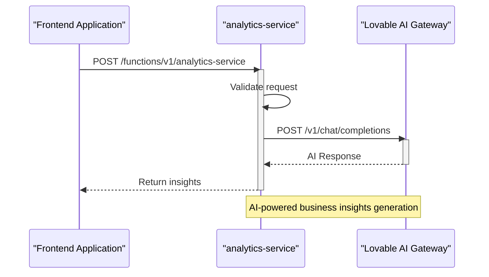

**Diagram sources**
- [analytics-service/index.ts](file://supabase/functions/analytics-service/index.ts#L1-L220)

### track-product-interaction
This function tracks user interactions with products, capturing engagement metrics such as hover, quick view, wishlist additions, color swatch selections, design clicks, quote requests, and view details actions. It implements deduplication for hover events within the same session and uses fire-and-forget insertion for optimal performance.

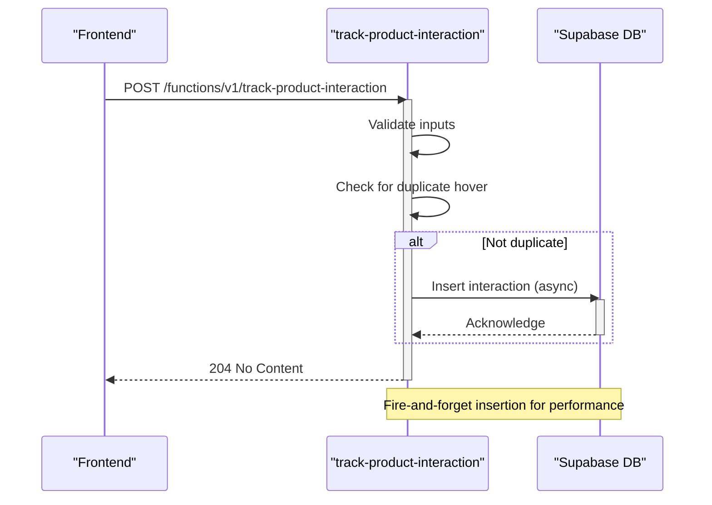

**Diagram sources**
- [track-product-interaction/index.ts](file://supabase/functions/track-product-interaction/index.ts#L1-L136)
- [useProductAnalytics.ts](file://src/hooks/useProductAnalytics.ts#L1-L115)

### track-social-share
This function tracks social media sharing of blog content across platforms including LinkedIn, Facebook, Twitter, and WhatsApp. It implements rate limiting (10 shares per IP per hour) to prevent abuse and updates both the share record and blog post share count atomically.

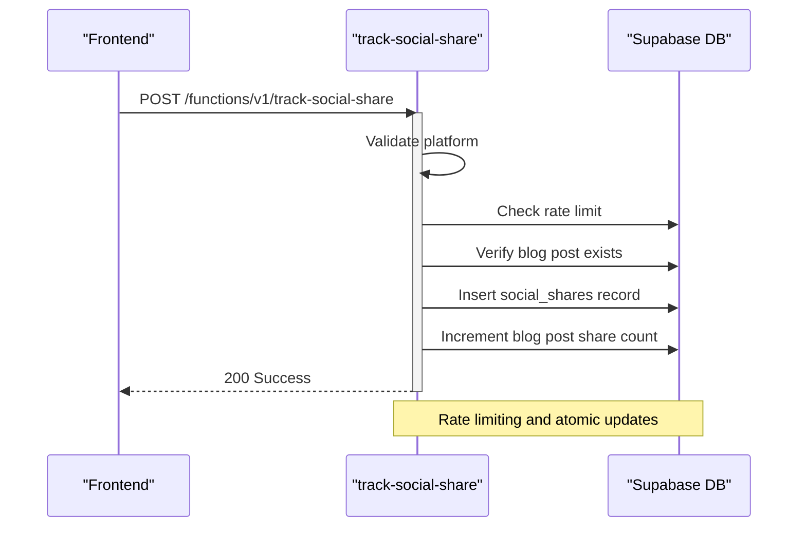

**Diagram sources**
- [track-social-share/index.ts](file://supabase/functions/track-social-share/index.ts#L1-L129)

### log-ai-cost
This function tracks AI usage expenses by logging token consumption and calculating estimated costs based on model-specific pricing. It monitors hourly costs and triggers alerts for unusual spending patterns, helping maintain budget control for AI operations.

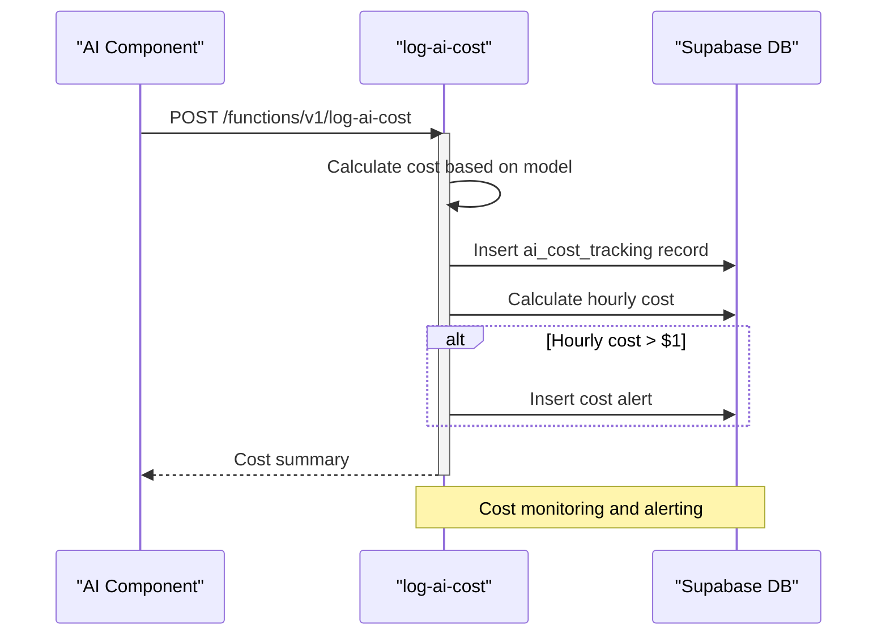

**Diagram sources**
- [log-ai-cost/index.ts](file://supabase/functions/log-ai-cost/index.ts#L1-L96)

### log-audit-action
This security-critical function logs administrative actions with server-side user validation. It captures IP address and user agent information, ensuring that only authenticated admins can perform audit logging and preventing unauthorized access to sensitive operations.

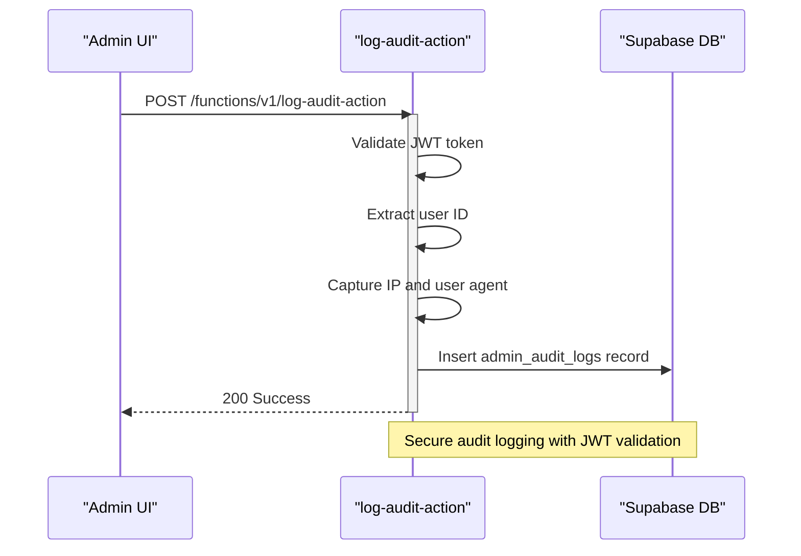

**Diagram sources**
- [log-audit-action/index.ts](file://supabase/functions/log-audit-action/index.ts#L1-L97)
- [auditLog.ts](file://src/lib/auditLog.ts#L1-L89)

**Section sources**
- [analytics-service/index.ts](file://supabase/functions/analytics-service/index.ts#L1-L220)
- [track-product-interaction/index.ts](file://supabase/functions/track-product-interaction/index.ts#L1-L136)
- [track-social-share/index.ts](file://supabase/functions/track-social-share/index.ts#L1-L129)
- [log-ai-cost/index.ts](file://supabase/functions/log-ai-cost/index.ts#L1-L96)
- [log-audit-action/index.ts](file://supabase/functions/log-audit-action/index.ts#L1-L97)

## Event Schema Design

### Product Interaction Schema
The product interaction tracking system captures detailed engagement metrics with a comprehensive schema that supports both individual interactions and aggregated analytics.

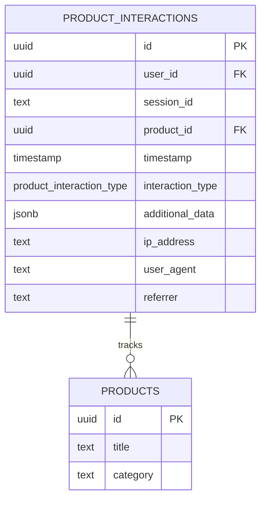

**Diagram sources**
- [track-product-interaction/index.ts](file://supabase/functions/track-product-interaction/index.ts#L9-L26)
- [product_interactions.sql](file://supabase/migrations/20251117015024_d47b7ef9-be84-43eb-9ec4-b93c55d353e8.sql#L14-L26)

### Social Share Schema
The social sharing system tracks content dissemination across platforms with a schema designed for analytics and rate limiting.

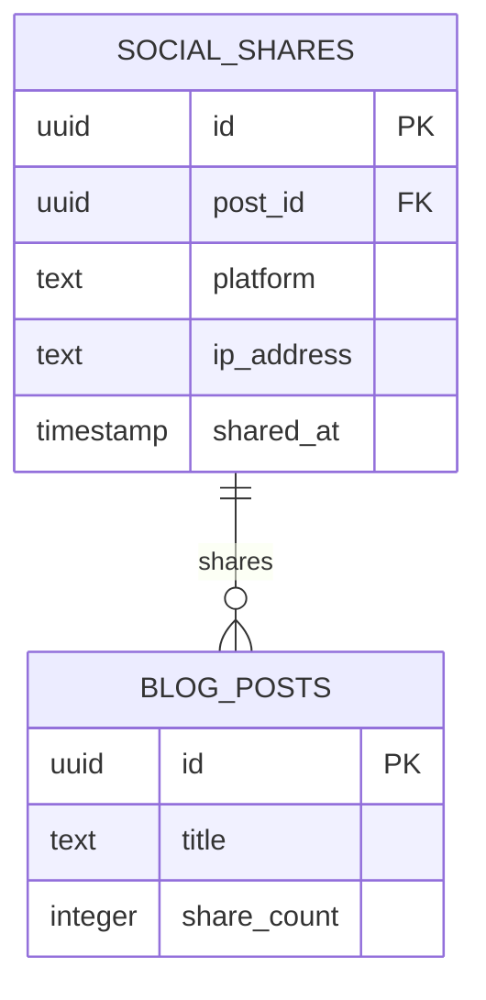

**Diagram sources**
- [track-social-share/index.ts](file://supabase/functions/track-social-share/index.ts#L9-L10)
- [social_shares.sql](file://supabase/migrations/20251121004548_412ae5d9-7426-4e57-a6d0-4e35e860ef95.sql)

### AI Cost Tracking Schema
The AI cost tracking system monitors usage expenses with detailed token consumption metrics.

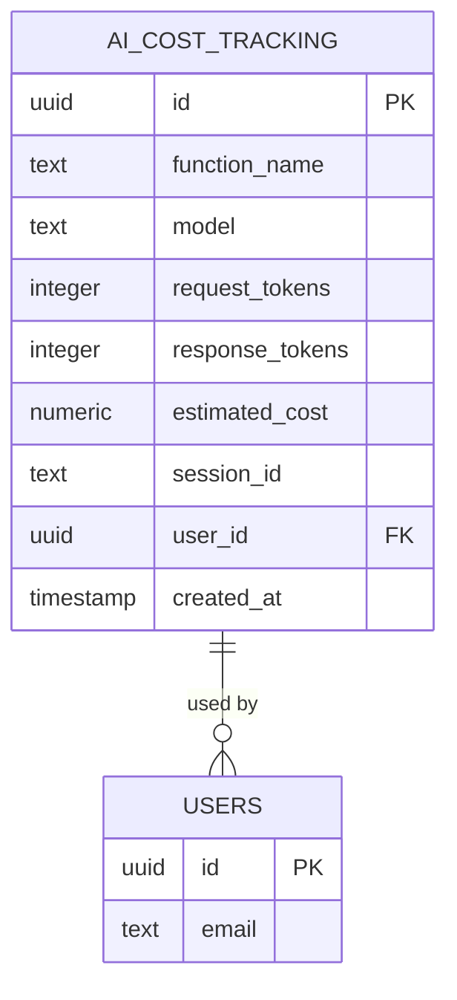

**Diagram sources**
- [log-ai-cost/index.ts](file://supabase/functions/log-ai-cost/index.ts#L9-L15)
- [ai_cost_tracking.sql](file://supabase/migrations/20251121004736_fddceea9-b0a0-472e-a19e-b918c065f4ec.sql)

### Audit Log Schema
The security auditing system maintains a comprehensive record of administrative actions.

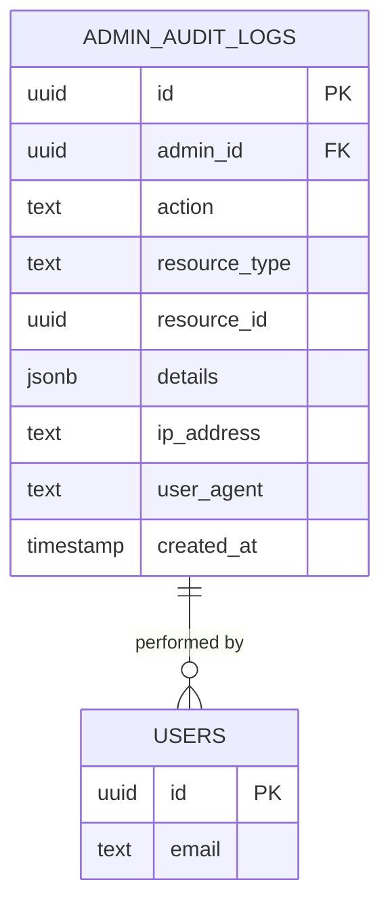

**Diagram sources**
- [log-audit-action/index.ts](file://supabase/functions/log-audit-action/index.ts#L8-L14)
- [admin_audit_logs.sql](file://supabase/migrations/20251121014007_e1ea3a7e-b3b2-4082-a10a-c5eff6b1135b.sql)

**Section sources**
- [product_interactions.sql](file://supabase/migrations/20251117015024_d47b7ef9-be84-43eb-9ec4-b93c55d353e8.sql#L14-L26)
- [social_shares.sql](file://supabase/migrations/20251121004548_412ae5d9-7426-4e57-a6d0-4e35e860ef95.sql)
- [ai_cost_tracking.sql](file://supabase/migrations/20251121004736_fddceea9-b0a0-472e-a19e-b918c065f4ec.sql)
- [admin_audit_logs.sql](file://supabase/migrations/20251121014007_e1ea3a7e-b3b2-4082-a10a-c5eff6b1135b.sql)

## Batch Processing and Data Flow

### Data Flow Architecture
The analytics system follows a multi-layered data flow architecture that ensures reliable tracking while maintaining optimal performance.

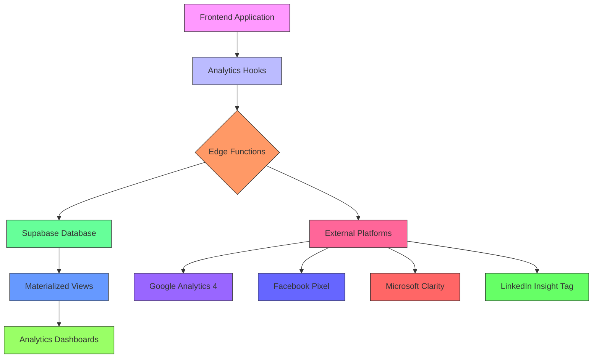

**Diagram sources**
- [analytics.ts](file://src/lib/analytics.ts#L1-L183)
- [analyticsTracking.ts](file://src/lib/analyticsTracking.ts#L1-L149)
- [track-product-interaction/index.ts](file://supabase/functions/track-product-interaction/index.ts#L1-L136)

### Materialized Views for Aggregation
The system uses materialized views to provide pre-aggregated analytics data for efficient querying.

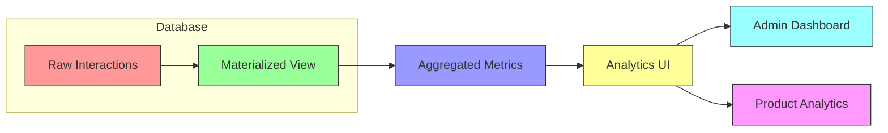

**Diagram sources**
- [product_interactions.sql](file://supabase/migrations/20251117015024_d47b7ef9-be84-43eb-9ec4-b93c55d353e8.sql#L58-L76)

**Section sources**
- [product_interactions.sql](file://supabase/migrations/20251117015024_d47b7ef9-be84-43eb-9ec4-b93c55d353e8.sql#L58-L76)

## Frontend Integration

### useProductAnalytics Hook
The useProductAnalytics hook provides a clean interface for tracking product interactions from React components.

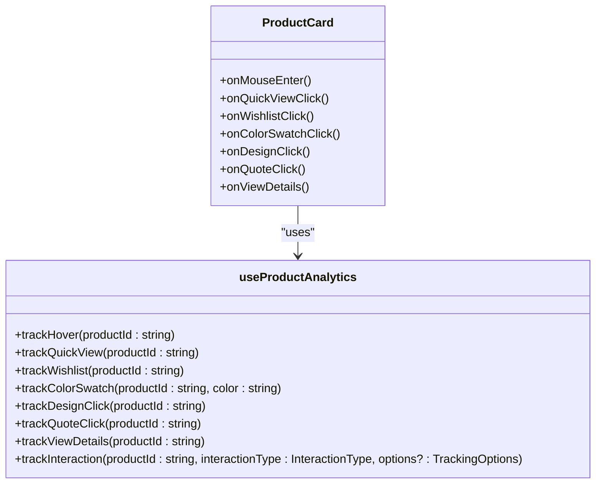

**Diagram sources**
- [useProductAnalytics.ts](file://src/hooks/useProductAnalytics.ts#L1-L115)
- [ProductCard.tsx](file://src/components/products/ProductCard.tsx)

### useNotifications Hook
The useNotifications hook integrates with the analytics system to track user engagement with notifications.

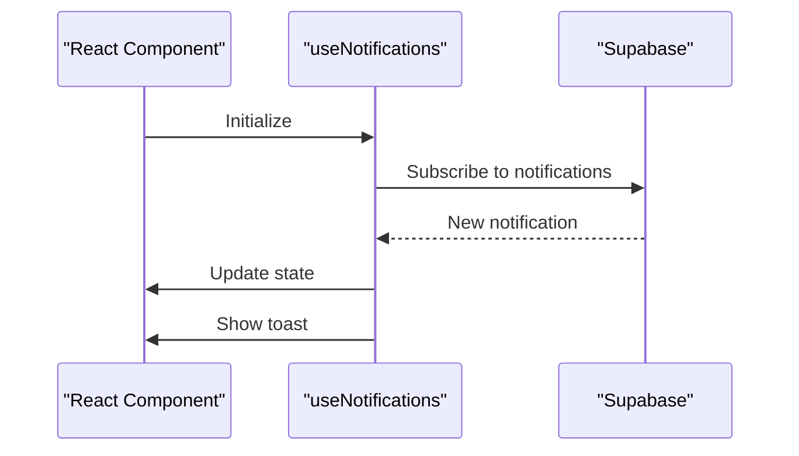

**Diagram sources**
- [useNotifications.ts](file://src/hooks/useNotifications.ts#L1-L106)

**Section sources**
- [useProductAnalytics.ts](file://src/hooks/useProductAnalytics.ts#L1-L115)
- [useNotifications.ts](file://src/hooks/useNotifications.ts#L1-L106)

## External Platform Integration

### Multi-Platform Tracking
The analytics system integrates with multiple external platforms to provide comprehensive tracking.

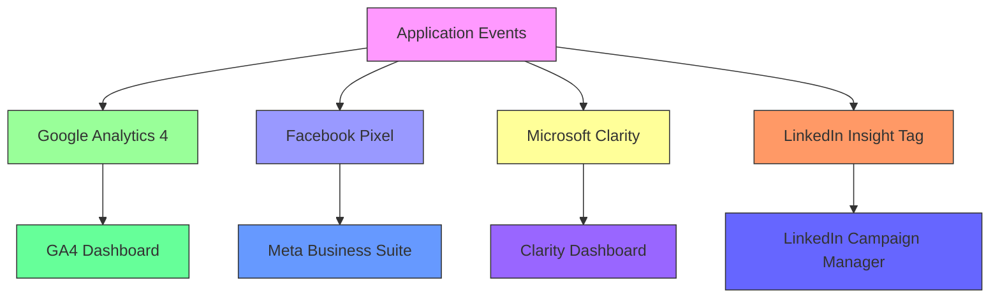

**Diagram sources**
- [analytics.ts](file://src/lib/analytics.ts#L1-L183)

### Configuration Constants
External platform integration is configured through constants in the analytics module.

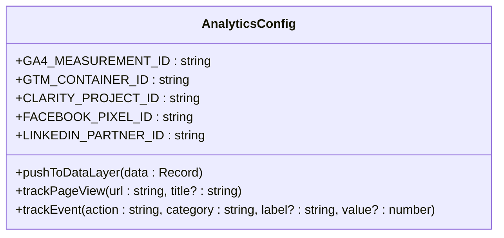

**Diagram sources**
- [analytics.ts](file://src/lib/analytics.ts#L1-L183)

**Section sources**
- [analytics.ts](file://src/lib/analytics.ts#L1-L183)

## GDPR Compliance and Data Privacy

### Data Anonymization Techniques
The system implements several data anonymization techniques to ensure GDPR compliance.

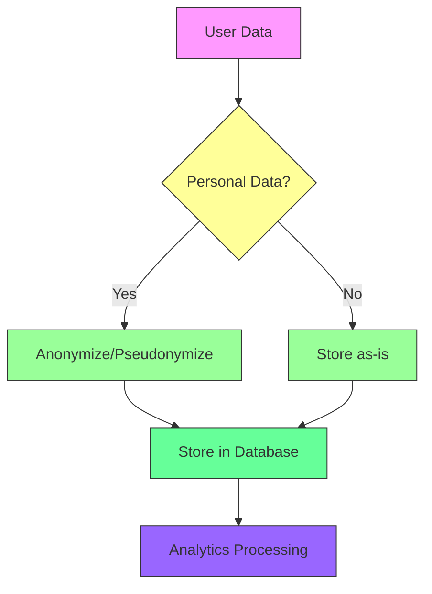

**Diagram sources**
- [analyticsTracking.ts](file://src/lib/analyticsTracking.ts#L20-L50)
- [track-product-interaction/index.ts](file://supabase/functions/track-product-interaction/index.ts#L73-L85)

### Privacy by Design
The analytics system follows privacy-by-design principles with minimal data collection.

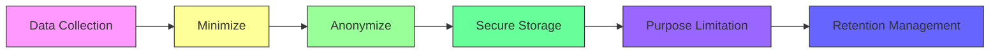

**Diagram sources**
- [analyticsTracking.ts](file://src/lib/analyticsTracking.ts#L20-L50)
- [track-product-interaction/index.ts](file://supabase/functions/track-product-interaction/index.ts#L67-L102)

**Section sources**
- [analyticsTracking.ts](file://src/lib/analyticsTracking.ts#L20-L50)
- [track-product-interaction/index.ts](file://supabase/functions/track-product-interaction/index.ts#L67-L102)

## Data Retention Policies

### Retention Periods
The system implements specific retention periods for different types of analytics data.

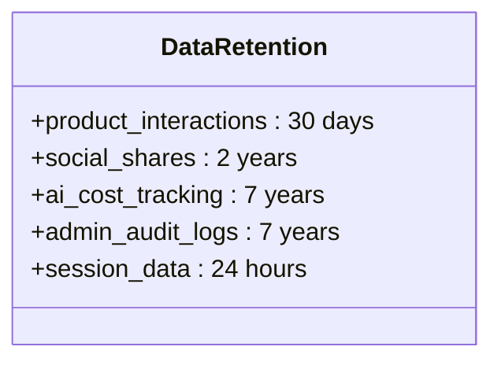

**Diagram sources**
- [product_interactions.sql](file://supabase/migrations/20251117015024_d47b7ef9-be84-43eb-9ec4-b93c55d353e8.sql#L75)
- [ai_cost_tracking.sql](file://supabase/migrations/20251121004736_fddceea9-b0a0-472e-a19e-b918c065f4ec.sql)
- [admin_audit_logs.sql](file://supabase/migrations/20251121014007_e1ea3a7e-b3b2-4082-a10a-c5eff6b1135b.sql)

### Automated Cleanup
The system includes automated cleanup processes for expired data.

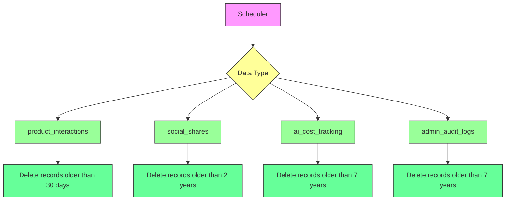

**Diagram sources**
- [product_interactions.sql](file://supabase/migrations/20251117015024_d47b7ef9-be84-43eb-9ec4-b93c55d353e8.sql#L75)
- [ai_cost_tracking.sql](file://supabase/migrations/20251121004736_fddceea9-b0a0-472e-a19e-b918c065f4ec.sql)
- [admin_audit_logs.sql](file://supabase/migrations/20251121014007_e1ea3a7e-b3b2-4082-a10a-c5eff6b1135b.sql)

**Section sources**
- [product_interactions.sql](file://supabase/migrations/20251117015024_d47b7ef9-be84-43eb-9ec4-b93c55d353e8.sql#L75)
- [ai_cost_tracking.sql](file://supabase/migrations/20251121004736_fddceea9-b0a0-472e-a19e-b918c065f4ec.sql)
- [admin_audit_logs.sql](file://supabase/migrations/20251121014007_e1ea3a7e-b3b2-4082-a10a-c5eff6b1135b.sql)

## Debugging and Monitoring

### Browser Developer Tools
The analytics system provides debugging capabilities through browser developer tools.

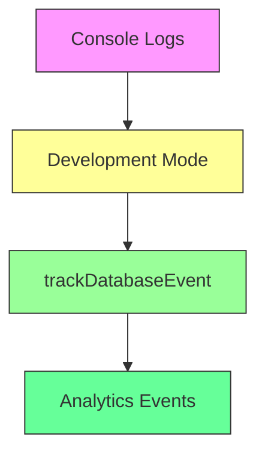

**Diagram sources**
- [analyticsTracking.ts](file://src/lib/analyticsTracking.ts#L62-L64)

### Error Handling
The system implements robust error handling to ensure tracking failures don't impact user experience.

```mermaid
flowchart TD
A[Track Event] --> B{Success?}
B --> |Yes| C[Complete]
B --> |No| D[Log Error]
D --> E[Continue Execution]
style A fill:#f9f,stroke:#333
style B fill:#ff9,stroke:#333
style C fill:#9f9,stroke:#333
style D fill:#f96,stroke:#333
style E fill:#6f9,stroke:#333
```

**Diagram sources**
- [useProductAnalytics.ts](file://src/hooks/useProductAnalytics.ts#L60-L63)
- [analyticsTracking.ts](file://src/lib/analyticsTracking.ts#L57-L67)

**Section sources**
- [analyticsTracking.ts](file://src/lib/analyticsTracking.ts#L62-L64)
- [useProductAnalytics.ts](file://src/hooks/useProductAnalytics.ts#L60-L63)

## Performance Optimization

### Debouncing and Queuing
The analytics system implements performance optimizations to minimize impact on user experience.

```mermaid
flowchart TD
A[User Interaction] --> B{Debounce Required?}
B --> |Yes| C[Wait for cooldown]
B --> |No| D[Immediate Track]
C --> E[Batch Process]
E --> F[Send to Server]
D --> F
F --> G[Fire-and-Forget]
style A fill:#f9f,stroke:#333
style B fill:#ff9,stroke:#333
style C fill:#f96,stroke:#333
style D fill:#9f9,stroke:#333
style E fill:#6f9,stroke:#333
style F fill:#66f,stroke:#333
style G fill:#69f,stroke:#333
```

**Diagram sources**
- [useProductAnalytics.ts](file://src/hooks/useProductAnalytics.ts#L40-L47)
- [track-product-interaction/index.ts](file://supabase/functions/track-product-interaction/index.ts#L118-L127)

### Asynchronous Processing
The system uses asynchronous processing to ensure tracking doesn't block the main thread.

```mermaid
flowchart TD
A[User Action] --> B[Queue Event]
B --> C[Return Immediately]
C --> D[Background Processing]
D --> E[Send to Server]
E --> F[Handle Response]
style A fill:#f9f,stroke:#333
style B fill:#ff9,stroke:#333
style C fill:#9f9,stroke:#333
style D fill:#6f9,stroke:#333
style E fill:#66f,stroke:#333
style F fill:#69f,stroke:#333
```

**Diagram sources**
- [track-product-interaction/index.ts](file://supabase/functions/track-product-interaction/index.ts#L118-L127)
- [useProductAnalytics.ts](file://src/hooks/useProductAnalytics.ts#L49-L57)

**Section sources**
- [useProductAnalytics.ts](file://src/hooks/useProductAnalytics.ts#L40-L47)
- [track-product-interaction/index.ts](file://supabase/functions/track-product-interaction/index.ts#L118-L127)

## Conclusion
The analytics and tracking system in Sleek Apparels provides comprehensive monitoring of user behavior and system events through a robust architecture of edge functions, database tracking, and external platform integration. The system balances detailed analytics collection with GDPR compliance through data anonymization and retention policies, while maintaining optimal performance through debouncing, queuing, and asynchronous processing. This documentation provides a complete overview of the system's components, data flow, and implementation details.