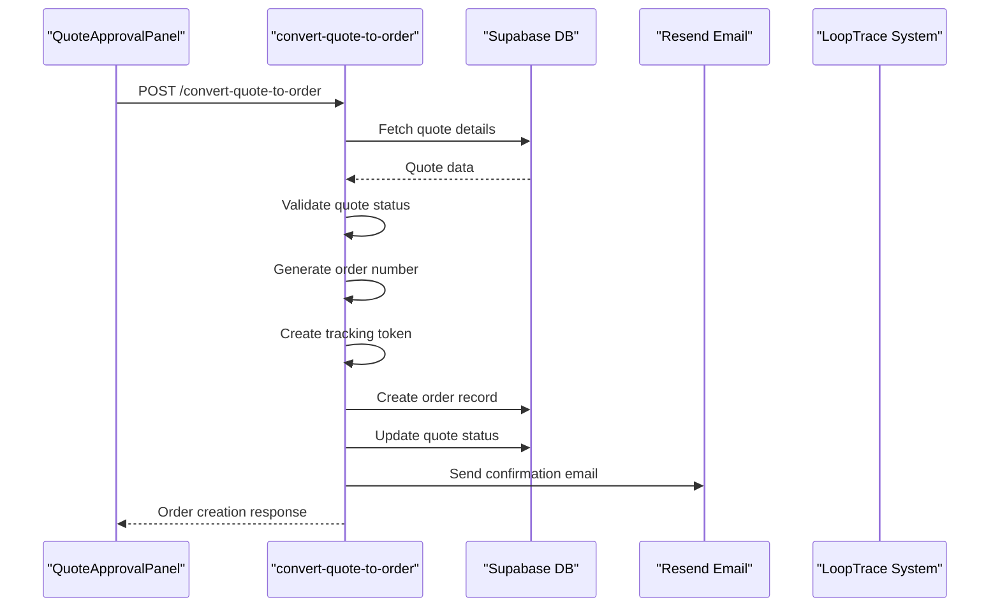
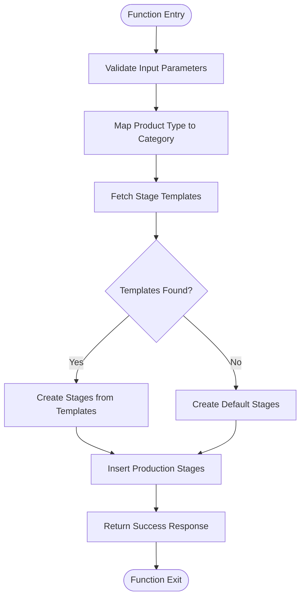
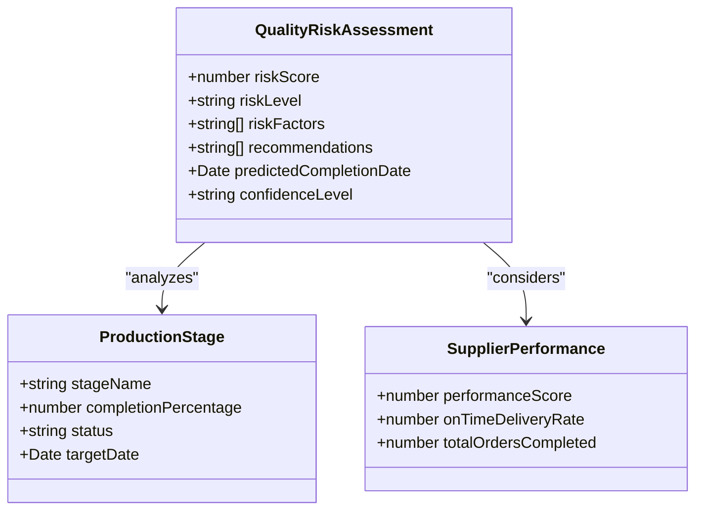
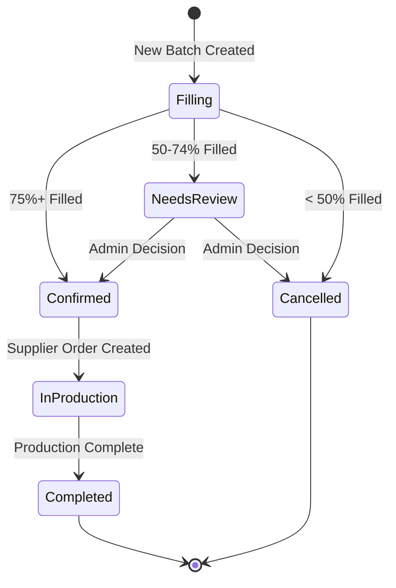
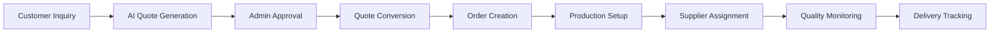
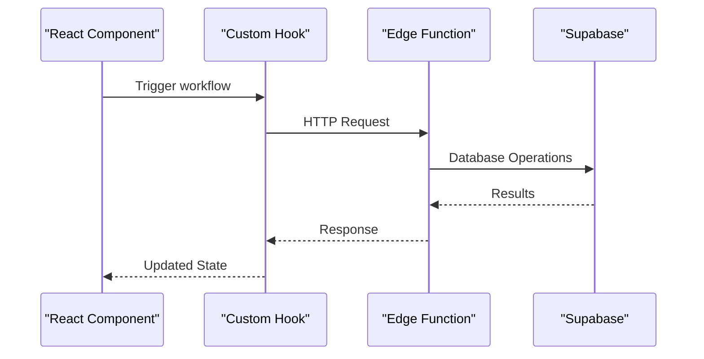
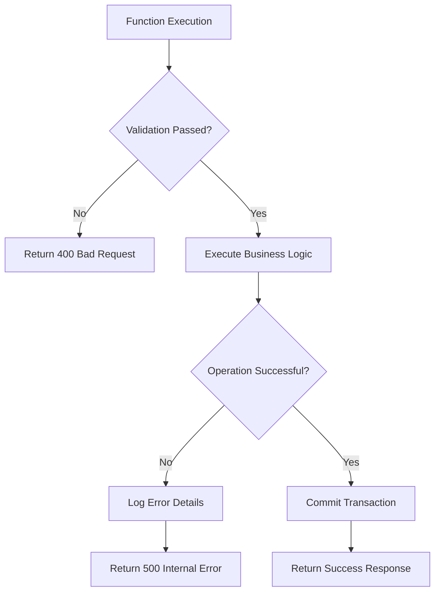

# Business Logic Functions Documentation

<cite>
**Referenced Files in This Document**
- [QuoteApprovalPanel.tsx](file://src/components/admin/QuoteApprovalPanel.tsx)
- [ProductionStageManager.tsx](file://src/components/supplier/ProductionStageManager.tsx)
- [convert-quote-to-order/index.ts](file://supabase/functions/convert-quote-to-order/index.ts)
- [initialize-production-stages/index.ts](file://supabase/functions/initialize-production-stages/index.ts)
- [predict-quality-risks/index.ts](file://supabase/functions/predict-quality-risks/index.ts)
- [auto-confirm-supplier/index.ts](file://supabase/functions/auto-confirm-supplier/index.ts)
- [batch-processor/index.ts](file://supabase/functions/batch-processor/index.ts)
- [execute-automation-rules/index.ts](file://supabase/functions/execute-automation-rules/index.ts)
- [parse-quote-description/index.ts](file://supabase/functions/parse-quote-description/index.ts)
- [order.ts](file://src/types/order.ts)
- [database.ts](file://src/types/database.ts)
- [useOrderManagement.ts](file://src/hooks/useOrderManagement.ts)
- [useQuotes.ts](file://src/hooks/useQuotes.ts)
</cite>

## Table of Contents
1. [Introduction](#introduction)
2. [Core Business Logic Functions](#core-business-logic-functions)
3. [Workflow Orchestration](#workflow-orchestration)
4. [Data Validation and Transaction Handling](#data-validation-and-transaction-handling)
5. [Event-Driven Interactions](#event-driven-interactions)
6. [State Management and Transitions](#state-management-and-transitions)
7. [Error Handling and Recovery](#error-handling-and-recovery)
8. [Performance and Idempotency](#performance-and-idempotency)
9. [Integration Patterns](#integration-patterns)
10. [Security Considerations](#security-considerations)

## Introduction

The Sleek Apparels platform orchestrates complex manufacturing workflows through a suite of specialized business logic functions. These functions transform customer inquiries into production orders, manage supplier relationships, predict quality outcomes, and automate routine administrative tasks. The system employs event-driven architecture with robust validation, transaction safety, and comprehensive error recovery mechanisms.

## Core Business Logic Functions

### convert-quote-to-order

The `convert-quote-to-order` function serves as the primary workflow orchestrator, transforming approved AI-generated quotes into production-ready orders with LoopTrace™ tracking capabilities.

**Diagram sources**
- [convert-quote-to-order/index.ts](file://supabase/functions/convert-quote-to-order/index.ts#L16-L223)
- [QuoteApprovalPanel.tsx](file://src/components/admin/QuoteApprovalPanel.tsx#L62-L115)

**HTTP Method**: POST  
**Input Validation**: Zod-like patterns using TypeScript interfaces  
**Database Transactions**: Atomic operations with rollback capability  
**Event Triggers**: Email notifications, status updates, tracking initialization

**Section sources**
- [convert-quote-to-order/index.ts](file://supabase/functions/convert-quote-to-order/index.ts#L16-L223)

### initialize-production-stages

The `initialize-production-stages` function establishes standardized production workflows based on product categories, enabling automated stage creation and supplier coordination.

**Diagram sources**
- [initialize-production-stages/index.ts](file://supabase/functions/initialize-production-stages/index.ts#L9-L133)

**HTTP Method**: POST  
**Input Validation**: Product type mapping with fallback defaults  
**Database Operations**: Template-based stage creation with category-specific logic  
**Integration Points**: Production stage templates, supplier order relationships

**Section sources**
- [initialize-production-stages/index.ts](file://supabase/functions/initialize-production-stages/index.ts#L9-L133)

### predict-quality-risks

The `predict-quality-risks` function employs AI-powered analysis to forecast potential quality issues in production, enabling proactive risk mitigation strategies.

**Diagram sources**
- [predict-quality-risks/index.ts](file://supabase/functions/predict-quality-risks/index.ts#L14-L131)

**HTTP Method**: POST  
**AI Integration**: Lovable AI gateway with Gemini 2.5 Flash  
**Data Sources**: Production stage progress, supplier performance metrics  
**Output Format**: Structured risk assessment with actionable recommendations

**Section sources**
- [predict-quality-risks/index.ts](file://supabase/functions/predict-quality-risks/index.ts#L14-L131)

### auto-confirm-supplier

The `auto-confirm-supplier` function automates supplier account verification through secure OTP-based confirmation, preventing unauthorized access while maintaining user experience.

**HTTP Method**: POST  
**Security Features**: Rate limiting, token expiration, IP-based restrictions  
**Validation**: Email format validation, token verification, user existence checks  
**Transaction Safety**: Atomic operations with verification tracking

**Section sources**
- [auto-confirm-supplier/index.ts](file://supabase/functions/auto-confirm-supplier/index.ts#L9-L148)

### batch-processor

The `batch-processor` handles sophisticated inventory management through automated batch orchestration and order processing, optimizing supplier capacity utilization.

**Diagram sources**
- [batch-processor/index.ts](file://supabase/functions/batch-processor/index.ts#L85-L192)

**Job Types**: Orchestration (batch management), Process Order (individual processing)  
**Business Logic**: Fill percentage thresholds, supplier compatibility matching  
**Integration**: Pricing calculator, supplier order creation, order status updates

**Section sources**
- [batch-processor/index.ts](file://supabase/functions/batch-processor/index.ts#L56-L377)

### execute-automation-rules

The `execute-automation-rules` function manages dynamic workflow automation through configurable rule engines, enabling adaptive business process management.

**HTTP Method**: POST  
**Authentication**: Admin role verification  
**Rule Engine**: Configurable conditions and actions  
**Action Types**: Email notifications, status updates, supplier assignments  
**Logging**: Comprehensive audit trail for compliance

**Section sources**
- [execute-automation-rules/index.ts](file://supabase/functions/execute-automation-rules/index.ts#L25-L193)

### parse-quote-description

The `parse-quote-description` function extracts structured information from natural language customer descriptions using AI-powered natural language processing.

**HTTP Method**: POST  
**AI Integration**: Lovable AI with structured JSON output  
**Parsing Rules**: Product type classification, quantity extraction, material identification  
**Output Format**: Structured data with confidence scoring

**Section sources**
- [parse-quote-description/index.ts](file://supabase/functions/parse-quote-description/index.ts#L8-L127)

## Workflow Orchestration

### Quote to Order Pipeline

The transformation from quote to order involves multiple coordinated steps with strict validation and error handling:

**Diagram sources**
- [QuoteApprovalPanel.tsx](file://src/components/admin/QuoteApprovalPanel.tsx#L62-L115)
- [convert-quote-to-order/index.ts](file://supabase/functions/convert-quote-to-order/index.ts#L35-L151)

### Production Stage Management

Supplier-facing production tracking follows a standardized progression with real-time updates:

**Section sources**
- [ProductionStageManager.tsx](file://src/components/supplier/ProductionStageManager.tsx#L38-L124)

## Data Validation and Transaction Handling

### Input Validation Patterns

Each function implements comprehensive input validation using TypeScript interfaces and runtime checks:

| Function | Validation Type | Key Checks |
|----------|----------------|------------|
| convert-quote-to-order | Request body | Quote ID presence, status validation |
| initialize-production-stages | JSON payload | Product category mapping, template availability |
| predict-quality-risks | Parameter validation | Supplier order existence, stage data completeness |
| auto-confirm-supplier | Security validation | Email format, token verification, rate limiting |
| batch-processor | Job type validation | Orchestration vs. order processing, parameter consistency |
| execute-automation-rules | Authentication | Admin role verification, rule activation status |
| parse-quote-description | Content validation | Description length, AI service availability |

### Database Transaction Safety

All functions employ atomic operations with comprehensive rollback mechanisms:

**Section sources**
- [convert-quote-to-order/index.ts](file://supabase/functions/convert-quote-to-order/index.ts#L103-L151)
- [batch-processor/index.ts](file://supabase/functions/batch-processor/index.ts#L112-L133)

## Event-Driven Interactions

### Frontend Integration Points

The business logic functions integrate seamlessly with React components through well-defined APIs:

**Diagram sources**
- [QuoteApprovalPanel.tsx](file://src/components/admin/QuoteApprovalPanel.tsx#L62-L115)
- [ProductionStageManager.tsx](file://src/components/supplier/ProductionStageManager.tsx#L85-L124)

### Event Triggers and Notifications

The system generates events for various workflow milestones:

**Section sources**
- [convert-quote-to-order/index.ts](file://supabase/functions/convert-quote-to-order/index.ts#L152-L189)

## State Management and Transitions

### Order Lifecycle States

The system tracks comprehensive state transitions throughout the order lifecycle:

| Workflow Status | Description | Trigger Conditions |
|----------------|-------------|-------------------|
| quote_requested | Initial inquiry | Customer submission |
| quote_provided | AI-generated quote | Quote generation completion |
| quote_accepted | Admin approval | Quote approval confirmation |
| assigned_to_supplier | Supplier assignment | Supplier selection |
| in_production | Active manufacturing | Production stage initiation |
| quality_check | Inspection phase | Production completion |
| shipped | Outbound logistics | Shipping confirmation |
| delivered | Customer receipt | Delivery tracking |
| completed | Final closure | Payment completion |

**Section sources**
- [database.ts](file://src/types/database.ts#L8-L17)

### Production Stage Progression

Supplier-facing stage management follows standardized progression:

**Section sources**
- [ProductionStageManager.tsx](file://src/components/supplier/ProductionStageManager.tsx#L85-L124)

## Error Handling and Recovery

### Comprehensive Error Management

Each function implements layered error handling with appropriate responses:

### Recovery Mechanisms

The system implements multiple recovery strategies:

**Section sources**
- [convert-quote-to-order/index.ts](file://supabase/functions/convert-quote-to-order/index.ts#L205-L223)
- [batch-processor/index.ts](file://supabase/functions/batch-processor/index.ts#L75-L82)

## Performance and Idempotency

### Idempotency Considerations

Critical operations implement idempotency to ensure safe retry behavior:

**Section sources**
- [auto-confirm-supplier/index.ts](file://supabase/functions/auto-confirm-supplier/index.ts#L125-L129)

### Performance Optimization

Functions are optimized for high-throughput scenarios:

**Section sources**
- [batch-processor/index.ts](file://supabase/functions/batch-processor/index.ts#L85-L192)

## Integration Patterns

### External Service Integration

The system integrates with multiple external services:

| Service | Purpose | Authentication | Rate Limits |
|---------|---------|----------------|-------------|
| Resend Email | Order confirmations | API key | Per-user limits |
| Lovable AI | Quality predictions | Bearer token | Concurrent requests |
| Stripe | Payment processing | Secret key | Transaction limits |

**Section sources**
- [convert-quote-to-order/index.ts](file://supabase/functions/convert-quote-to-order/index.ts#L152-L189)
- [predict-quality-risks/index.ts](file://supabase/functions/predict-quality-risks/index.ts#L63-L108)

### Database Integration

Supabase provides seamless database integration with type-safe operations:

**Section sources**
- [useOrderManagement.ts](file://src/hooks/useOrderManagement.ts#L11-L44)
- [useQuotes.ts](file://src/hooks/useQuotes.ts#L55-L78)

## Security Considerations

### Authentication and Authorization

All functions implement robust security measures:

**Section sources**
- [execute-automation-rules/index.ts](file://supabase/functions/execute-automation-rules/index.ts#L36-L67)
- [auto-confirm-supplier/index.ts](file://supabase/functions/auto-confirm-supplier/index.ts#L50-L85)

### Data Protection

Sensitive data handling includes:

**Section sources**
- [auto-confirm-supplier/index.ts](file://supabase/functions/auto-confirm-supplier/index.ts#L125-L129)