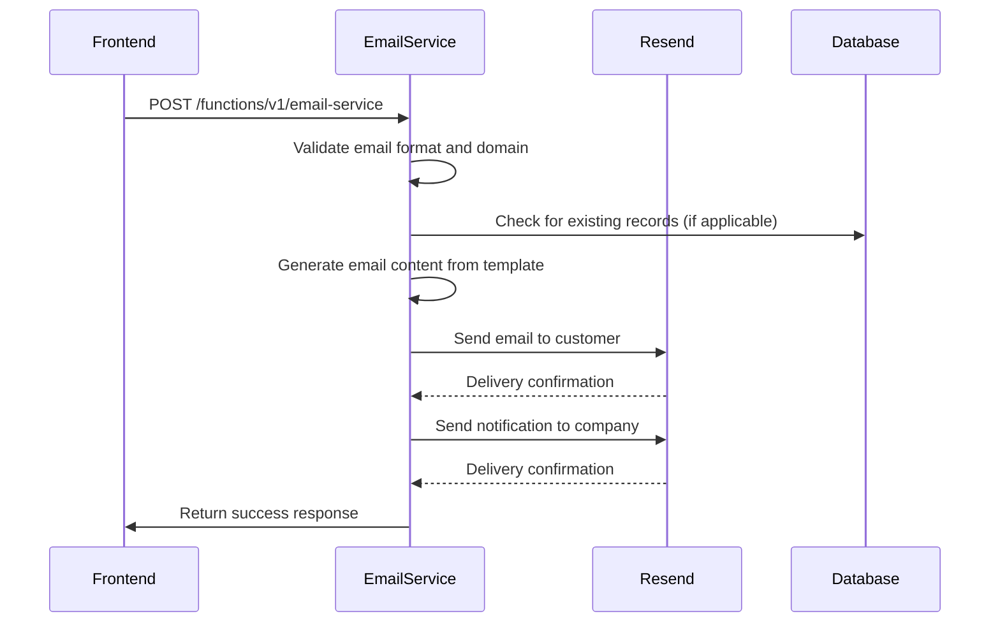
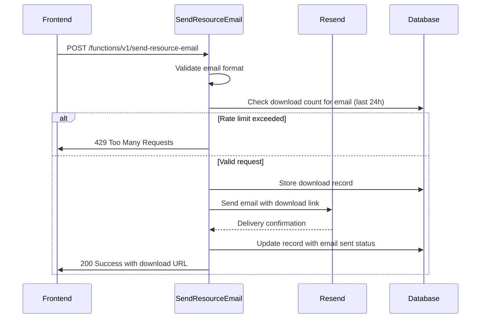
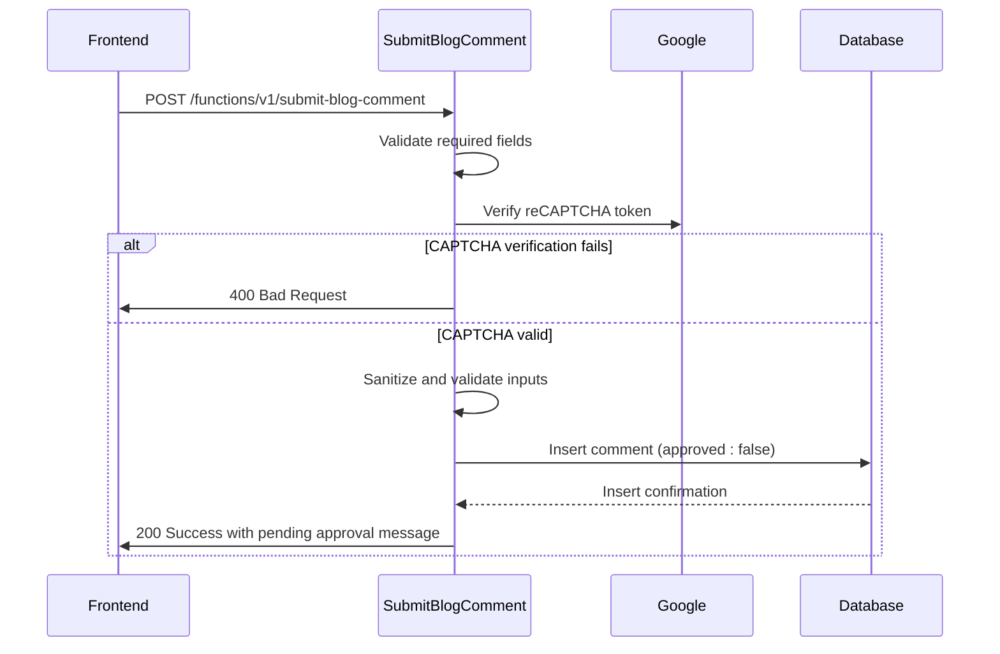
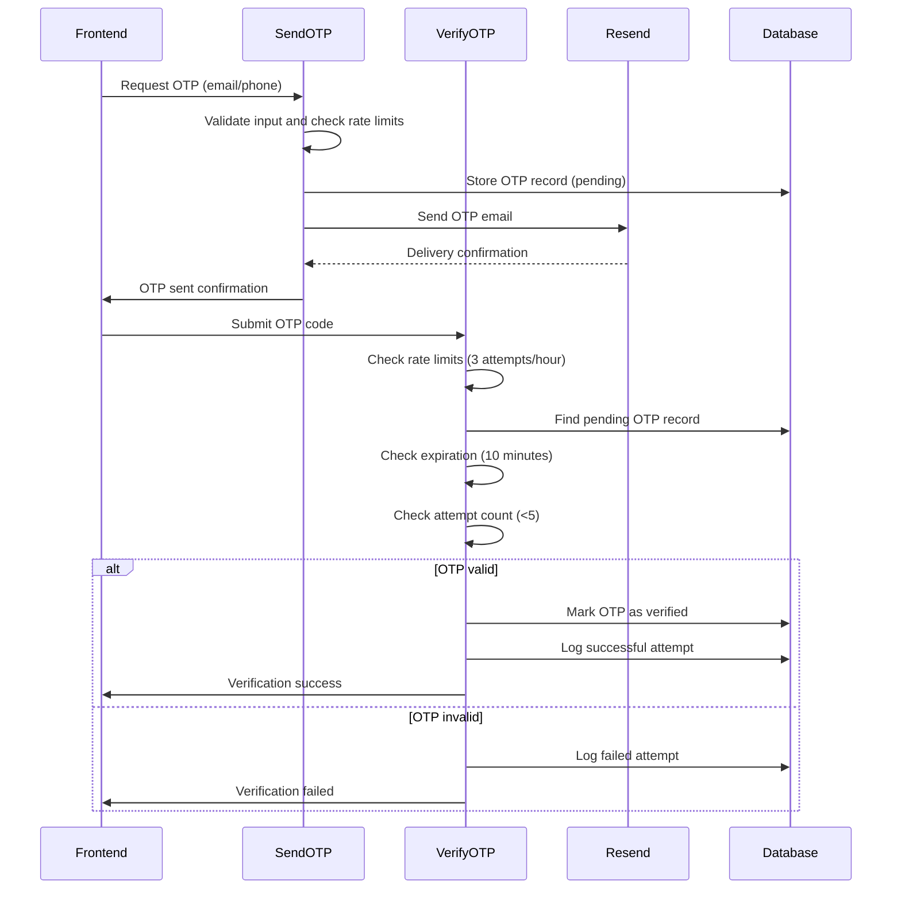
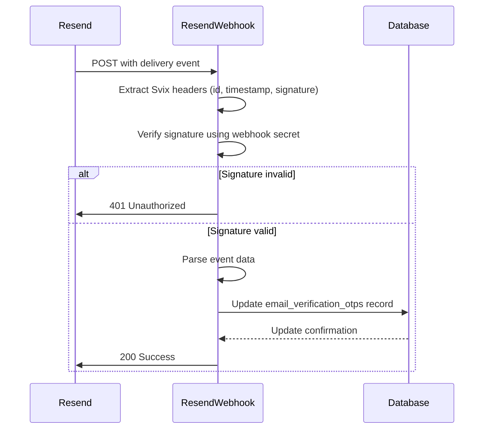
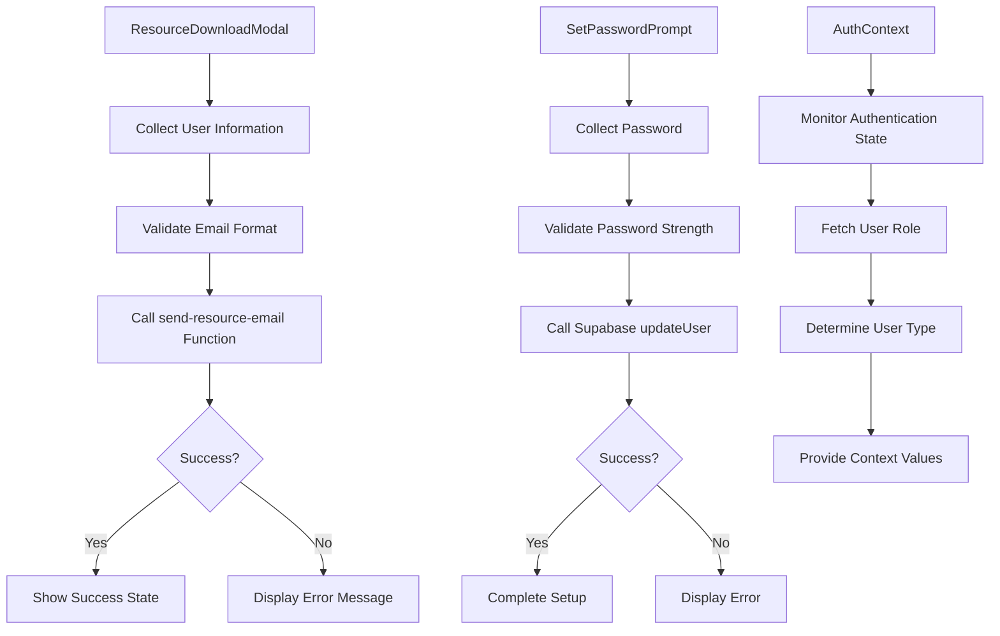
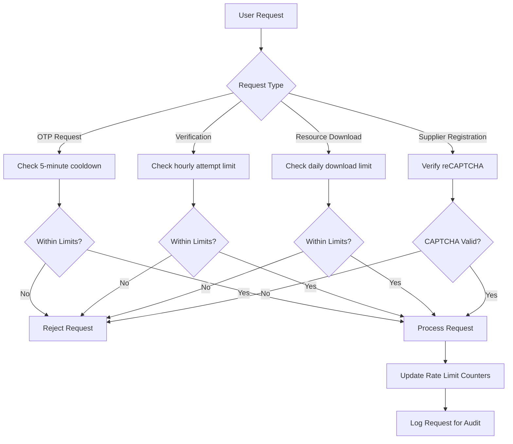
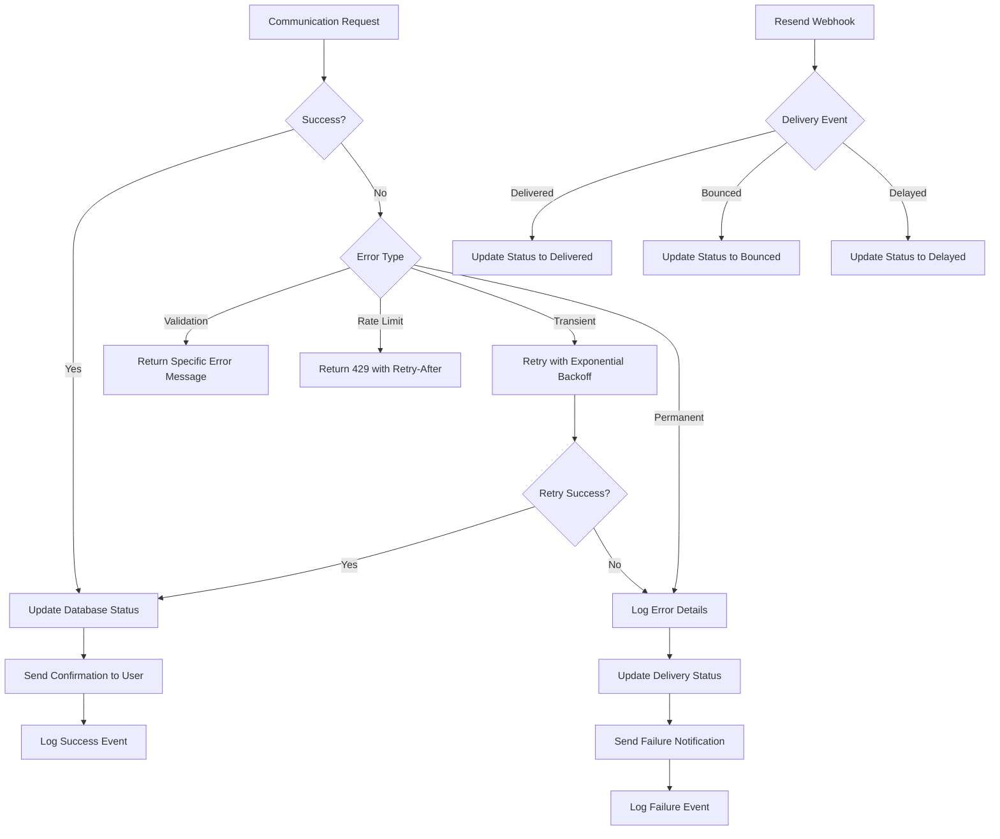

# Communication

<cite>
**Referenced Files in This Document**   
- [email-service/index.ts](file://supabase/functions/email-service/index.ts)
- [send-resource-email/index.ts](file://supabase/functions/send-resource-email/index.ts)
- [submit-blog-comment/index.ts](file://supabase/functions/submit-blog-comment/index.ts)
- [send-otp/index.ts](file://supabase/functions/send-otp/index.ts)
- [verify-otp/index.ts](file://supabase/functions/verify-otp/index.ts)
- [resend-webhook/index.ts](file://supabase/functions/resend-webhook/index.ts)
- [ResourceDownloadModal.tsx](file://src/components/ResourceDownloadModal.tsx)
- [SetPasswordPrompt.tsx](file://src/components/SetPasswordPrompt.tsx)
- [AuthContext.tsx](file://src/contexts/AuthContext.tsx)
</cite>

## Table of Contents
1. [Introduction](#introduction)
2. [Email Service for Transactional Emails](#email-service-for-transactional-emails)
3. [Send Resource Email for Marketing Materials](#send-resource-email-for-marketing-materials)
4. [Submit Blog Comment for User Engagement](#submit-blog-comment-for-user-engagement)
5. [Send OTP and Verify OTP for Two-Factor Authentication](#send-otp-and-verify-otp-for-two-factor-authentication)
6. [Resend Webhook for Third-Party Integrations](#resend-webhook-for-third-party-integrations)
7. [Frontend Integration Components](#frontend-integration-components)
8. [Rate Limiting and Abuse Prevention](#rate-limiting-and-abuse-prevention)
9. [Security Considerations](#security-considerations)
10. [Error Handling and Delivery Guarantees](#error-handling-and-delivery-guarantees)

## Introduction
This document provides comprehensive documentation for the communication functions that enable user interaction and system notifications in the Sleek Apparels platform. The system includes multiple communication channels including transactional emails, marketing materials, user engagement features, two-factor authentication, and third-party integrations. These functions are designed to facilitate seamless interaction between users, suppliers, and administrators while maintaining security, preventing abuse, and ensuring reliable delivery.

The communication system is built on a serverless architecture using Supabase Edge Functions, which handle various communication workflows. The system integrates with the Resend email service for reliable email delivery and implements comprehensive security measures including rate limiting, input validation, and anti-abuse mechanisms. Frontend components provide user interfaces for interacting with these communication functions, while the AuthContext provides user context for personalization.

**Section sources**
- [email-service/index.ts](file://supabase/functions/email-service/index.ts)
- [send-resource-email/index.ts](file://supabase/functions/send-resource-email/index.ts)
- [submit-blog-comment/index.ts](file://supabase/functions/submit-blog-comment/index.ts)

## Email Service for Transactional Emails

The email-service function handles transactional emails for various business processes including quote requests, lead follow-ups, and supplier status notifications. This function serves as the central hub for sending automated emails based on user actions and system events.

The service supports three primary email types:
- **Quote notifications**: Sent when a user requests a manufacturing quote, containing detailed pricing and product information
- **Lead follow-up emails**: Marketing emails sent to potential customers who have requested quotes, with different templates based on engagement strategy
- **Supplier status notifications**: Emails sent to suppliers regarding their application status (approved, rejected, or suspended)

Email templates are defined within the function with rich HTML formatting and responsive design. The service implements comprehensive email validation to prevent invalid addresses and block disposable email domains. Each email type has specific validation rules and data requirements to ensure accurate information delivery.

The function uses the Resend email service for delivery and implements retry logic for transient failures. It also validates recipient emails against a list of disposable domains to prevent abuse. The service follows a two-email pattern for quote requests: one to the customer with their quote details and another to the company with a notification to follow up within 24 hours.



**Diagram sources**
- [email-service/index.ts](file://supabase/functions/email-service/index.ts)

**Section sources**
- [email-service/index.ts](file://supabase/functions/email-service/index.ts)

## Send Resource Email for Marketing Materials

The send-resource-email function handles the distribution of marketing materials such as the Custom Apparel Buyer's Guide and Material Comparison Chart. This function implements a complete workflow for resource download management, including rate limiting, download tracking, and personalized email delivery.

The service supports two resource types:
- **Buyers Guide**: A comprehensive 25-page guide about manufacturing custom apparel
- **Material Chart**: A comparison chart of different fabric types and their properties

The function implements a strict rate limiting policy of three downloads per email address per day to prevent abuse. Before sending the email, it validates the email address format and checks against a list of disposable email domains. It also stores a record of each download attempt in the database, including IP address and user agent for audit purposes.

When a valid request is received, the function generates a personalized email with a direct download link to the requested resource. The email includes marketing content promoting the company's services and encouraging further engagement. After successful email delivery, the function updates the download record to indicate that the email was sent.



**Diagram sources**
- [send-resource-email/index.ts](file://supabase/functions/send-resource-email/index.ts)

**Section sources**
- [send-resource-email/index.ts](file://supabase/functions/send-resource-email/index.ts)
- [ResourceDownloadModal.tsx](file://src/components/ResourceDownloadModal.tsx)

## Submit Blog Comment for User Engagement

The submit-blog-comment function handles user-submitted comments on blog posts, implementing a moderation workflow that requires administrative approval before comments are published. This function provides a secure interface for user engagement while preventing spam and abusive content.

The process begins with comprehensive validation of required fields (post ID, author name, author email, and content). The function implements reCAPTCHA verification to prevent automated bot submissions, requiring a valid captcha token from the frontend. This adds a significant barrier against spam while maintaining accessibility for legitimate users.

After passing the reCAPTCHA check, the function sanitizes all input data to prevent injection attacks and trims content to appropriate length limits (5,000 characters for content, 100 for name, 255 for email). It validates the email format using a regular expression before proceeding.

Comments are stored in the database with a default "approved: false" status, meaning they require manual approval by an administrator before appearing on the website. This moderation system ensures content quality and brand safety. The function also supports optional user authentication, linking comments to registered users when available.



**Diagram sources**
- [submit-blog-comment/index.ts](file://supabase/functions/submit-blog-comment/index.ts)

**Section sources**
- [submit-blog-comment/index.ts](file://supabase/functions/submit-blog-comment/index.ts)

## Send OTP and Verify OTP for Two-Factor Authentication

The two-factor authentication system consists of two complementary functions: send-otp and verify-otp. Together, they provide a secure mechanism for email and phone verification across various use cases including quote requests, supplier registration, and account recovery.

### Send OTP Function
The send-otp function generates and delivers one-time passcodes via email or phone. It supports three OTP types:
- **Phone verification**: For phone number validation
- **Email-quote**: For verifying email addresses during quote requests
- **Email-supplier**: For supplier registration verification

The function implements multiple security measures:
- Comprehensive email validation with disposable domain blocking
- reCAPTCHA verification for supplier registration to prevent bot abuse
- Rate limiting of one OTP request per email or phone number every 5 minutes
- Daily limit of 3 quote requests per email address

When sending email OTPs, the function uses retry logic with exponential backoff to handle transient delivery failures. It stores delivery status and error information for monitoring and troubleshooting. The OTPs are valid for 10 minutes and are automatically expired after this period.

### Verify OTP Function
The verify-otp function validates one-time passcodes submitted by users. It implements a sophisticated rate limiting system through the check_otp_rate_limit RPC function, allowing only 3 verification attempts per identifier (email or phone) per hour.

Additional security features include:
- Maximum of 5 attempts per OTP code before it becomes invalid
- Automatic logging of all verification attempts (successful and failed)
- Real-time rate limit enforcement to prevent brute force attacks
- Session-based authentication for phone verification

For email-quote verification, the function also tracks daily quote limits and returns this information in the response to help frontend components display appropriate messaging.



**Diagram sources**
- [send-otp/index.ts](file://supabase/functions/send-otp/index.ts)
- [verify-otp/index.ts](file://supabase/functions/verify-otp/index.ts)

**Section sources**
- [send-otp/index.ts](file://supabase/functions/send-otp/index.ts)
- [verify-otp/index.ts](file://supabase/functions/verify-otp/index.ts)
- [SetPasswordPrompt.tsx](file://src/components/SetPasswordPrompt.tsx)

## Resend Webhook for Third-Party Integrations

The resend-webhook function receives delivery event notifications from the Resend email service and updates the application's database accordingly. This integration provides delivery guarantees and enables monitoring of email delivery status.

The webhook is secured using Svix signature verification, which ensures that incoming requests are genuinely from Resend and have not been tampered with. The function validates the signature using a shared secret (RESEND_WEBHOOK_SECRET) and rejects requests with invalid signatures.

The function handles three types of delivery events:
- **email.delivered**: Indicates successful delivery to the recipient's mail server
- **email.bounced**: Indicates the email was rejected by the recipient's mail server
- **email.delivery_delayed**: Indicates temporary delivery issues

When an event is received, the function updates the corresponding record in the email_verification_otps table, setting the delivery_status field to reflect the current status (delivered, bounced, or delayed) and storing any error information. This allows the application to track email delivery in real-time and take appropriate actions based on delivery outcomes.

The webhook integration is critical for maintaining delivery guarantees, as it provides confirmation that emails have been successfully delivered to the recipient's mail server. This information can be used for analytics, troubleshooting delivery issues, and improving email deliverability over time.



**Diagram sources**
- [resend-webhook/index.ts](file://supabase/functions/resend-webhook/index.ts)

**Section sources**
- [resend-webhook/index.ts](file://supabase/functions/resend-webhook/index.ts)

## Frontend Integration Components

The communication system integrates with several frontend components that provide user interfaces for interacting with the communication functions. These components handle form validation, API calls, and user feedback.

### ResourceDownloadModal
This component provides a modal interface for users to request marketing resources. It collects the user's email, full name, and company name, then invokes the send-resource-email function. The component implements client-side validation for email format and displays appropriate error messages for rate limiting or disposable email rejection. After successful submission, it shows a success state with instructions to check the inbox.

### SetPasswordPrompt
This component is used during account setup to collect a secure password from users. It integrates with the OTP verification system by requiring users to verify their email via OTP before setting a password. The component implements password strength validation with requirements for uppercase letters, lowercase letters, numbers, and a minimum length of 8 characters.

### AuthContext
The AuthContext provides user authentication state and role information throughout the application. It determines the user type (buyer, supplier, or admin) based on their role and provides convenience properties like isAdmin, isSupplier, and isBuyer. This context is used by various components to personalize content and control access to features.



**Diagram sources**
- [ResourceDownloadModal.tsx](file://src/components/ResourceDownloadModal.tsx)
- [SetPasswordPrompt.tsx](file://src/components/SetPasswordPrompt.tsx)
- [AuthContext.tsx](file://src/contexts/AuthContext.tsx)

**Section sources**
- [ResourceDownloadModal.tsx](file://src/components/ResourceDownloadModal.tsx)
- [SetPasswordPrompt.tsx](file://src/components/SetPasswordPrompt.tsx)
- [AuthContext.tsx](file://src/contexts/AuthContext.tsx)

## Rate Limiting and Abuse Prevention

The communication system implements multiple layers of rate limiting and abuse prevention to protect against spam, brute force attacks, and service abuse.

### Email and OTP Rate Limiting
The system employs several rate limiting mechanisms:
- **Per-request rate limiting**: One OTP request per email or phone number every 5 minutes
- **Hourly verification attempts**: Maximum of 3 verification attempts per identifier per hour
- **Daily quote limit**: Maximum of 3 quote requests per email address per day
- **Resource download limit**: Maximum of 3 downloads per email address per day

These limits are enforced at both the application level and through database constraints. The verify-otp function uses the check_otp_rate_limit RPC function to enforce hourly attempt limits, while the send-otp function implements per-request limits by checking recent OTP records.

### Input Validation and Sanitization
All communication functions implement comprehensive input validation:
- Email format validation using regular expressions
- Blocking of disposable email domains
- Input sanitization to prevent header injection attacks
- Length constraints for all text fields
- Content-type validation for file uploads

The email-service and send-resource-email functions both validate email addresses against a list of known disposable domains to prevent abuse through temporary email services.

### Bot Protection
The system uses reCAPTCHA to protect against automated bot submissions:
- Supplier registration requires reCAPTCHA verification
- Blog comment submission requires reCAPTCHA verification
- The reCAPTCHA score threshold is set to 0.5 to balance security and usability

### Database-Level Protections
The database schema includes several security measures:
- Removal of public access to OTP tables
- OTP operations restricted to edge functions using service role keys
- Logging of all OTP attempts for audit and analysis
- Rate limit tracking in dedicated tables



**Section sources**
- [send-otp/index.ts](file://supabase/functions/send-otp/index.ts)
- [verify-otp/index.ts](file://supabase/functions/verify-otp/index.ts)
- [send-resource-email/index.ts](file://supabase/functions/send-resource-email/index.ts)
- [submit-blog-comment/index.ts](file://supabase/functions/submit-blog-comment/index.ts)

## Security Considerations

The communication system implements comprehensive security measures to protect user data, prevent abuse, and ensure the integrity of communication workflows.

### OTP Security
The two-factor authentication system includes multiple security features:
- **OTP Expiration**: All OTPs expire after 10 minutes to prevent replay attacks
- **Single-Use**: OTPs are marked as verified after successful use and cannot be reused
- **Attempt Limiting**: Maximum of 5 attempts per OTP code before it becomes invalid
- **Rate Limiting**: 3 verification attempts per identifier per hour to prevent brute force attacks
- **Secure Storage**: OTPs are stored in the database with no public access policies

The system prevents replay attacks by marking OTPs as verified upon successful validation and checking the verified status before accepting any code. This ensures that each OTP can only be used once, even if intercepted.

### Email Security
The email system implements several security measures:
- **Header Injection Prevention**: Email addresses are sanitized to remove carriage returns and line feeds
- **Disposable Domain Blocking**: Known temporary email services are blocked to prevent abuse
- **Content Security**: HTML emails use inline styles only, avoiding external resources that could be used for tracking
- **Secure Links**: All links in emails use HTTPS and point to trusted domains

### Data Protection
User data is protected through multiple mechanisms:
- **Minimal Data Collection**: Only essential information is collected for each communication type
- **Secure Storage**: Sensitive data is stored in Supabase with row-level security
- **Audit Logging**: All communication events are logged for security monitoring
- **IP Tracking**: Request IP addresses are recorded for abuse investigation

### Anti-Abuse Measures
The system includes several anti-abuse features:
- **reCAPTCHA Integration**: Protects against automated bot submissions
- **Rate Limiting**: Prevents excessive usage of communication features
- **Behavior Monitoring**: Suspicious patterns are logged for administrator review
- **Content Filtering**: User-submitted content is sanitized and moderated

```mermaid
flowchart TD
A[Security Threats] --> B[Replay Attacks]
A --> C[Brute Force]
A --> D[Spam/Bots]
A --> E[Data Leakage]
B --> F[OTP Expiration (10 min)]
B --> G[Single-Use Tokens]
B --> H[Verified Flag Check]
C --> I[3 Attempts/Hour Limit]
C --> J[5 Attempts/OTP Limit]
C --> K[5-Minute Cooldown]
D --> L[reCAPTCHA Verification]
D --> M[Disposable Email Blocking]
D --> N[Rate Limiting]
E --> O[Header Injection Prevention]
E --> P[Minimal Data Collection]
E --> Q[Secure Storage]
```

**Section sources**
- [send-otp/index.ts](file://supabase/functions/send-otp/index.ts)
- [verify-otp/index.ts](file://supabase/functions/verify-otp/index.ts)
- [email-service/index.ts](file://supabase/functions/email-service/index.ts)
- [send-resource-email/index.ts](file://supabase/functions/send-resource-email/index.ts)

## Error Handling and Delivery Guarantees

The communication system implements robust error handling and delivery guarantee mechanisms to ensure reliable operation and provide meaningful feedback to users.

### Error Handling Strategies
Each communication function implements comprehensive error handling:

**Email Delivery Errors**
- **Transient failures**: Implement retry logic with exponential backoff
- **Permanent failures**: Log error details and update delivery status
- **Rate limiting**: Return appropriate HTTP status codes (429) with retry information
- **Validation errors**: Provide specific error messages for user correction

The send-otp function includes a sophisticated retry mechanism for email delivery, attempting up to three times with increasing delays between attempts. This handles temporary issues with the email service while avoiding excessive load.

### Delivery Guarantees
The system provides delivery guarantees through multiple mechanisms:

**Resend Webhook Integration**
- Real-time delivery status updates
- Automatic status synchronization with the application database
- Detailed error information for bounced emails
- Delivery delay notifications for troubleshooting

**Database Tracking**
- All email requests are stored in the database with status tracking
- Delivery status is updated based on webhook events
- Failed deliveries are logged with error details for analysis
- Success rates are monitored for deliverability optimization

### User Feedback
The system provides clear feedback to users through:
- **Specific error messages**: Instead of generic errors, users receive actionable feedback
- **Rate limit information**: Users are informed of retry timelines
- **Success confirmation**: Users receive confirmation when actions are completed
- **Fallback options**: Alternative contact methods are provided when automated systems fail

### Monitoring and Logging
Comprehensive logging is implemented throughout the system:
- **Structured logging**: All functions use a consistent logging format
- **Error categorization**: Different error types are logged with appropriate severity
- **Performance monitoring**: Function execution times are tracked
- **Delivery analytics**: Email open and click rates are monitored

The system uses a combination of function-level logging and database auditing to provide complete visibility into communication workflows. This enables rapid troubleshooting of issues and continuous improvement of delivery reliability.



**Section sources**
- [email-service/index.ts](file://supabase/functions/email-service/index.ts)
- [send-otp/index.ts](file://supabase/functions/send-otp/index.ts)
- [resend-webhook/index.ts](file://supabase/functions/resend-webhook/index.ts)
- [send-resource-email/index.ts](file://supabase/functions/send-resource-email/index.ts)