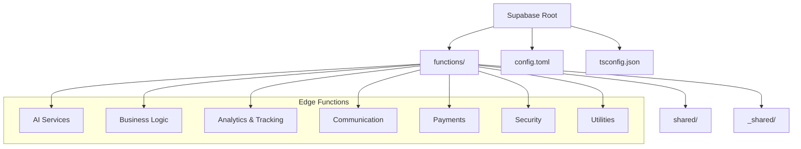
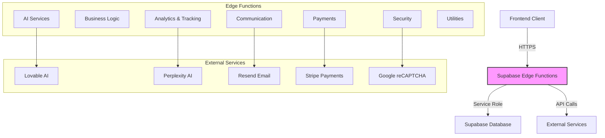
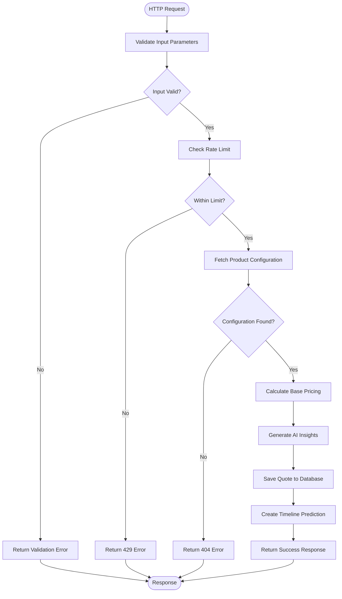
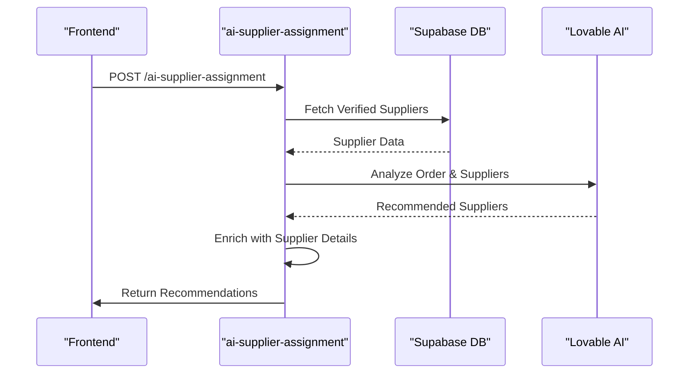
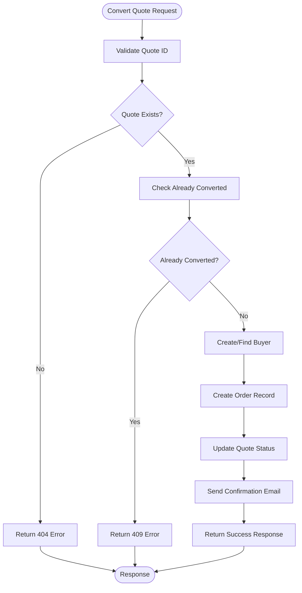
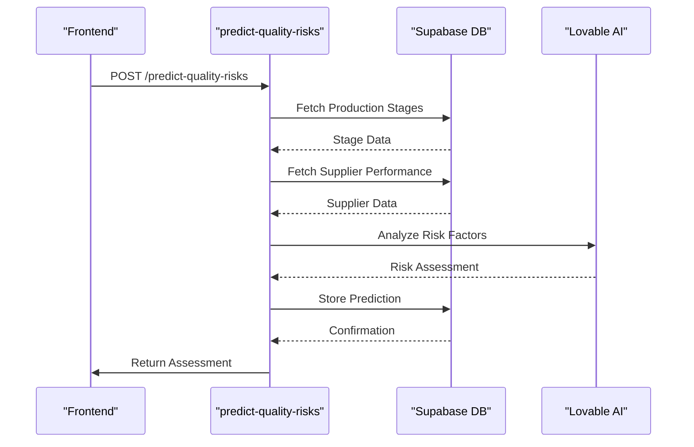
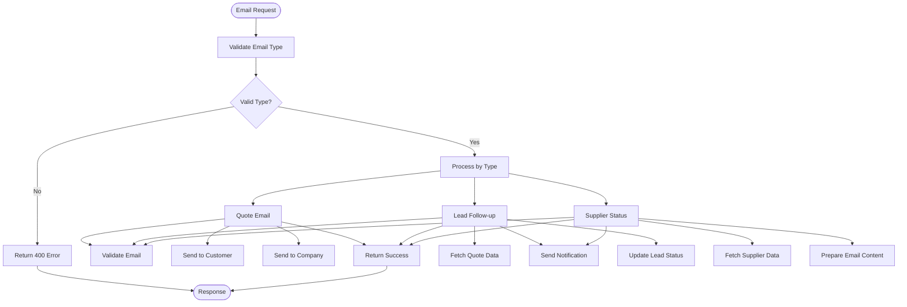
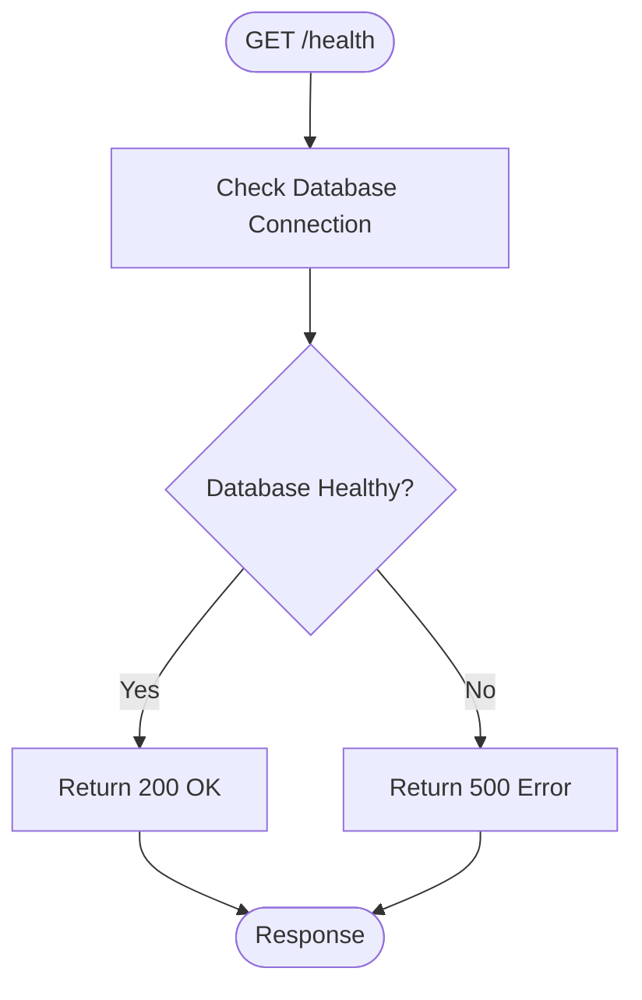
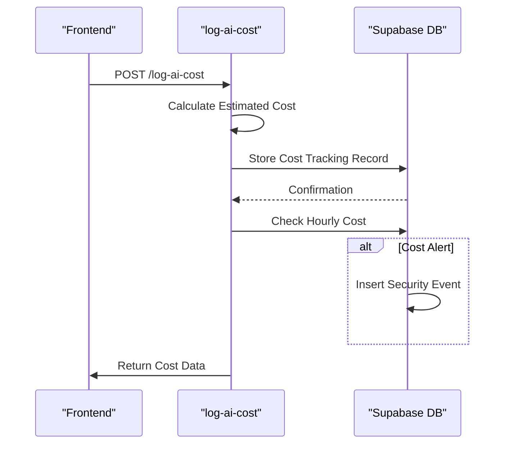
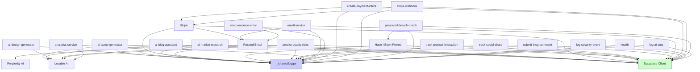

# Edge Functions

<cite>
**Referenced Files in This Document**   
- [ai-quote-generator/index.ts](file://supabase/functions/ai-quote-generator/index.ts)
- [ai-blog-assistant/index.ts](file://supabase/functions/ai-blog-assistant/index.ts)
- [ai-design-generator/index.ts](file://supabase/functions/ai-design-generator/index.ts)
- [ai-market-research/index.ts](file://supabase/functions/ai-market-research/index.ts)
- [ai-supplier-assignment/index.ts](file://supabase/functions/ai-supplier-assignment/index.ts)
- [convert-quote-to-order/index.ts](file://supabase/functions/convert-quote-to-order/index.ts)
- [initialize-production-stages/index.ts](file://supabase/functions/initialize-production-stages/index.ts)
- [predict-quality-risks/index.ts](file://supabase/functions/predict-quality-risks/index.ts)
- [track-product-interaction/index.ts](file://supabase/functions/track-product-interaction/index.ts)
- [track-social-share/index.ts](file://supabase/functions/track-social-share/index.ts)
- [analytics-service/index.ts](file://supabase/functions/analytics-service/index.ts)
- [email-service/index.ts](file://supabase/functions/email-service/index.ts)
- [send-resource-email/index.ts](file://supabase/functions/send-resource-email/index.ts)
- [submit-blog-comment/index.ts](file://supabase/functions/submit-blog-comment/index.ts)
- [create-payment-intent/index.ts](file://supabase/functions/create-payment-intent/index.ts)
- [stripe-webhook/index.ts](file://supabase/functions/stripe-webhook/index.ts)
- [password-breach-check/index.ts](file://supabase/functions/password-breach-check/index.ts)
- [log-security-event/index.ts](file://supabase/functions/log-security-event/index.ts)
- [health/index.ts](file://supabase/functions/health/index.ts)
- [log-ai-cost/index.ts](file://supabase/functions/log-ai-cost/index.ts)
- [config.toml](file://supabase/config.toml)
- [tsconfig.json](file://supabase/functions/tsconfig.json)
- [deno.d.ts](file://supabase/functions/deno.d.ts)
- [_shared/logger.ts](file://supabase/functions/_shared/logger.ts)
- [shared/securityLogger.ts](file://supabase/functions/shared/securityLogger.ts)
</cite>

## Table of Contents
1. [Introduction](#introduction)
2. [Project Structure](#project-structure)
3. [Core Components](#core-components)
4. [Architecture Overview](#architecture-overview)
5. [Detailed Component Analysis](#detailed-component-analysis)
6. [Dependency Analysis](#dependency-analysis)
7. [Performance Considerations](#performance-considerations)
8. [Troubleshooting Guide](#troubleshooting-guide)
9. [Conclusion](#conclusion)

## Introduction
This document provides comprehensive documentation for the 43 Supabase Edge Functions that power the backend logic of the Sleek Apparels application. The functions are organized into distinct domains including AI Services, Business Logic, Analytics & Tracking, Communication, Payments, Security, and Utilities. Each function is designed to handle specific backend operations with robust error handling, authentication requirements, and input/output validation. The documentation details each function's purpose, HTTP endpoint, authentication requirements based on config.toml verify_jwt settings, input/output schemas, and error handling patterns. Special attention is given to the shared logging infrastructure using _shared/logger.ts and shared/securityLogger.ts, TypeScript configuration (tsconfig.json), and Deno runtime setup.

## Project Structure
The Edge Functions are organized in a modular structure within the supabase/functions directory, with each function having its own subdirectory containing an index.ts file. Shared utilities are organized in _shared and shared directories for logger and security-related functionality respectively. The configuration is managed through config.toml which controls JWT verification settings for each function, while TypeScript configuration is centralized in tsconfig.json.



**Diagram sources**
- [config.toml](file://supabase/config.toml)
- [tsconfig.json](file://supabase/functions/tsconfig.json)

**Section sources**
- [config.toml](file://supabase/config.toml)
- [tsconfig.json](file://supabase/functions/tsconfig.json)

## Core Components
The core components of the Edge Functions architecture include the AI-powered services for quote generation, design assistance, and market research; business logic functions for order conversion and production stage initialization; analytics functions for tracking user interactions; communication services for email delivery; payment processing with Stripe integration; security functions for password breach detection; and utility functions for health monitoring and AI cost logging. The shared logging infrastructure ensures consistent logging practices across all functions with PII sanitization.

**Section sources**
- [ai-quote-generator/index.ts](file://supabase/functions/ai-quote-generator/index.ts)
- [convert-quote-to-order/index.ts](file://supabase/functions/convert-quote-to-order/index.ts)
- [analytics-service/index.ts](file://supabase/functions/analytics-service/index.ts)
- [email-service/index.ts](file://supabase/functions/email-service/index.ts)
- [create-payment-intent/index.ts](file://supabase/functions/create-payment-intent/index.ts)
- [password-breach-check/index.ts](file://supabase/functions/password-breach-check/index.ts)
- [health/index.ts](file://supabase/functions/health/index.ts)

## Architecture Overview
The Edge Functions architecture is built on Supabase's Deno runtime environment, leveraging TypeScript for type safety and structured development. Functions are organized by domain and communicate with the Supabase database using service role keys for elevated privileges when needed. The architecture implements a consistent pattern of CORS handling, input validation, error handling, and structured logging across all functions. Authentication requirements are centrally configured in config.toml using the verify_jwt setting, allowing fine-grained control over which functions require JWT authentication.



**Diagram sources**
- [config.toml](file://supabase/config.toml)
- [tsconfig.json](file://supabase/functions/tsconfig.json)
- [deno.d.ts](file://supabase/functions/deno.d.ts)

## Detailed Component Analysis

### AI Services Analysis
The AI Services domain includes functions that leverage artificial intelligence to enhance various aspects of the manufacturing and customer experience. These functions use external AI providers like Lovable AI and Perplexity to generate quotes, assist with blog content, create designs, conduct market research, and assign suppliers intelligently.

#### AI Quote Generator
The ai-quote-generator function creates manufacturing quotes based on product specifications, quantity, and complexity. It implements tiered rate limiting based on authentication status and includes comprehensive input validation.



**Diagram sources**
- [ai-quote-generator/index.ts](file://supabase/functions/ai-quote-generator/index.ts)

**Section sources**
- [ai-quote-generator/index.ts](file://supabase/functions/ai-quote-generator/index.ts)

#### AI Blog Assistant
The ai-blog-assistant function generates blog content using AI, helping with content creation for marketing and informational purposes.

**Section sources**
- [ai-blog-assistant/index.ts](file://supabase/functions/ai-blog-assistant/index.ts)

#### AI Design Generator
The ai-design-generator function creates apparel designs based on user prompts, style preferences, and color palettes, returning high-quality images suitable for garment printing.

**Section sources**
- [ai-design-generator/index.ts](file://supabase/functions/ai-design-generator/index.ts)

#### AI Market Research
The ai-market-research function conducts market research by querying external AI services to gather pricing data, material costs, and industry benchmarks for manufacturing quotes.

```mermaid
sequenceDiagram
participant Client as "Frontend"
participant Function as "ai-market-research"
participant Supabase as "Supabase DB"
participant Perplexity as "Perplexity API"
Client->>Function : POST /ai-market-research
Function->>Function : Validate reCAPTCHA
alt CAPTCHA Failed
Function->>Client : 400 Bad Request
return
end
Function->>Supabase : Check Rate Limit
alt Rate Limited
Function->>Client : 429 Too Many Requests
return
end
Function->>Supabase : Check Cache
alt Cache Hit
Supabase-->>Function : Cached Research Data
Function->>Client : Return Cached Data
return
end
Function->>Perplexity : Query Market Data
Perplexity-->>Function : Research Results
Function->>Supabase : Store in Cache
Supabase-->>Function : Confirmation
Function->>Client : Return Research Data
```

**Diagram sources**
- [ai-market-research/index.ts](file://supabase/functions/ai-market-research/index.ts)

**Section sources**
- [ai-market-research/index.ts](file://supabase/functions/ai-market-research/index.ts)

#### AI Supplier Assignment
The ai-supplier-assignment function uses AI to match manufacturing orders with optimal suppliers based on specialization, capacity, performance score, and lead time.



**Diagram sources**
- [ai-supplier-assignment/index.ts](file://supabase/functions/ai-supplier-assignment/index.ts)

**Section sources**
- [ai-supplier-assignment/index.ts](file://supabase/functions/ai-supplier-assignment/index.ts)

### Business Logic Analysis
The Business Logic functions handle core operations that transform quotes into orders, initialize production workflows, and predict quality risks in manufacturing processes.

#### Convert Quote to Order
The convert-quote-to-order function transforms a quote into a formal order, creating the necessary database records and sending confirmation emails.



**Diagram sources**
- [convert-quote-to-order/index.ts](file://supabase/functions/convert-quote-to-order/index.ts)

**Section sources**
- [convert-quote-to-order/index.ts](file://supabase/functions/convert-quote-to-order/index.ts)

#### Initialize Production Stages
The initialize-production-stages function sets up the production workflow for a new order by creating the necessary stages with appropriate timelines and dependencies.

**Section sources**
- [initialize-production-stages/index.ts](file://supabase/functions/initialize-production-stages/index.ts)

#### Predict Quality Risks
The predict-quality-risks function analyzes production data and supplier performance to identify potential quality issues before they occur.



**Diagram sources**
- [predict-quality-risks/index.ts](file://supabase/functions/predict-quality-risks/index.ts)

**Section sources**
- [predict-quality-risks/index.ts](file://supabase/functions/predict-quality-risks/index.ts)

### Analytics & Tracking Analysis
The Analytics & Tracking functions monitor user interactions with products and content, providing valuable insights for business decisions.

#### Track Product Interaction
The track-product-interaction function records user engagement with products, including views, clicks, and other interactions.

**Section sources**
- [track-product-interaction/index.ts](file://supabase/functions/track-product-interaction/index.ts)

#### Track Social Share
The track-social-share function monitors when users share products on social media platforms.

**Section sources**
- [track-social-share/index.ts](file://supabase/functions/track-social-share/index.ts)

#### Analytics Service
The analytics-service function provides AI-powered insights on order progress and quality control data.

```mermaid
sequenceDiagram
participant Client as "Frontend"
participant Function as "analytics-service"
participant Lovable as "Lovable AI"
Client->>Function : POST /analytics-service
Function->>Function : Parse Request
alt Invalid Analysis Type
Function->>Client : 400 Bad Request
return
end
alt Order Insights
Function->>Lovable : Request Order Insights
Lovable-->>Function : Insights JSON
Function->>Client : Return Insights
return
end
alt Quality Analysis
Function->>Lovable : Request Quality Analysis
Lovable-->>Function : Analysis JSON
Function->>Client : Return Analysis
return
end
```

**Diagram sources**
- [analytics-service/index.ts](file://supabase/functions/analytics-service/index.ts)

**Section sources**
- [analytics-service/index.ts](file://supabase/functions/analytics-service/index.ts)

### Communication Analysis
The Communication functions handle email delivery for various business purposes, including quote confirmations, lead follow-ups, and supplier notifications.

#### Email Service
The email-service function serves as a centralized email delivery system with multiple templates for different use cases.



**Diagram sources**
- [email-service/index.ts](file://supabase/functions/email-service/index.ts)

**Section sources**
- [email-service/index.ts](file://supabase/functions/email-service/index.ts)

#### Send Resource Email
The send-resource-email function delivers marketing materials and resources to interested customers.

**Section sources**
- [send-resource-email/index.ts](file://supabase/functions/send-resource-email/index.ts)

#### Submit Blog Comment
The submit-blog-comment function handles user comments on blog posts, with moderation capabilities.

**Section sources**
- [submit-blog-comment/index.ts](file://supabase/functions/submit-blog-comment/index.ts)

### Payments Analysis
The Payments functions handle financial transactions, including payment intent creation and webhook processing for Stripe.

#### Create Payment Intent
The create-payment-intent function creates a payment intent with Stripe for secure transaction processing.

**Section sources**
- [create-payment-intent/index.ts](file://supabase/functions/create-payment-intent/index.ts)

#### Stripe Webhook
The stripe-webhook function processes incoming webhooks from Stripe to update order statuses based on payment events.

**Section sources**
- [stripe-webhook/index.ts](file://supabase/functions/stripe-webhook/index.ts)

### Security Analysis
The Security functions protect user data and system integrity through password breach detection and security event logging.

#### Password Breach Check
The password-breach-check function verifies if user passwords have been exposed in known data breaches.

**Section sources**
- [password-breach-check/index.ts](file://supabase/functions/password-breach-check/index.ts)

#### Log Security Event
The log-security-event function records security-related events for monitoring and analysis.

**Section sources**
- [log-security-event/index.ts](file://supabase/functions/log-security-event/index.ts)

### Utilities Analysis
The Utility functions provide essential services for system monitoring, logging, and maintenance.

#### Health
The health function provides a simple endpoint to check the operational status of the Edge Functions environment.



**Diagram sources**
- [health/index.ts](file://supabase/functions/health/index.ts)

**Section sources**
- [health/index.ts](file://supabase/functions/health/index.ts)

#### Log AI Cost
The log-ai-cost function tracks the cost of AI operations, providing financial monitoring and alerting for excessive usage.



**Diagram sources**
- [log-ai-cost/index.ts](file://supabase/functions/log-ai-cost/index.ts)

**Section sources**
- [log-ai-cost/index.ts](file://supabase/functions/log-ai-cost/index.ts)

## Dependency Analysis
The Edge Functions have a well-defined dependency structure with minimal circular dependencies. Most functions depend on the Supabase client for database operations, while AI functions depend on external AI services. The shared logging utilities are used across all functions, creating a dependency on the _shared and shared directories.



**Diagram sources**
- [config.toml](file://supabase/config.toml)
- [tsconfig.json](file://supabase/functions/tsconfig.json)
- [deno.d.ts](file://supabase/functions/deno.d.ts)

**Section sources**
- [config.toml](file://supabase/config.toml)
- [tsconfig.json](file://supabase/functions/tsconfig.json)
- [deno.d.ts](file://supabase/functions/deno.d.ts)

## Performance Considerations
The Edge Functions are designed with performance in mind, implementing caching strategies, rate limiting, and efficient database queries. The AI functions include timeout handling and fallback mechanisms to ensure responsiveness. The shared logger provides structured logging with PII sanitization to maintain performance while ensuring security. Functions that interact with external APIs implement proper error handling and retry mechanisms to handle transient failures.

**Section sources**
- [ai-quote-generator/index.ts](file://supabase/functions/ai-quote-generator/index.ts)
- [ai-market-research/index.ts](file://supabase/functions/ai-market-research/index.ts)
- [analytics-service/index.ts](file://supabase/functions/analytics-service/index.ts)
- [email-service/index.ts](file://supabase/functions/email-service/index.ts)

## Troubleshooting Guide
When troubleshooting Edge Functions, consider the following common issues and solutions:

1. **Authentication Errors**: Check the verify_jwt setting in config.toml and ensure proper JWT tokens are being sent in the Authorization header.

2. **Rate Limiting**: Functions implement rate limiting based on IP, session, or user ID. Check the X-RateLimit headers in responses and implement appropriate retry logic with exponential backoff.

3. **AI Service Failures**: External AI services may experience outages or rate limiting. Implement fallback mechanisms and monitor error codes (429 for rate limits, 402 for payment required).

4. **Database Connection Issues**: Ensure SUPABASE_URL and SUPABASE_SERVICE_ROLE_KEY environment variables are properly configured.

5. **CORS Issues**: All functions include CORS headers, but ensure the origin is allowed in the function code for security reasons.

6. **Input Validation Errors**: Use the provided Zod schemas to validate input data before sending requests to Edge Functions.

7. **Email Delivery Problems**: Verify RESEND_API_KEY is configured and check email templates for proper formatting.

8. **Payment Processing Issues**: Ensure Stripe API keys are properly configured and webhook endpoints are verified.

**Section sources**
- [ai-quote-generator/index.ts](file://supabase/functions/ai-quote-generator/index.ts)
- [email-service/index.ts](file://supabase/functions/email-service/index.ts)
- [create-payment-intent/index.ts](file://supabase/functions/create-payment-intent/index.ts)
- [health/index.ts](file://supabase/functions/health/index.ts)

## Conclusion
The 43 Supabase Edge Functions provide a comprehensive backend solution for the Sleek Apparels application, covering AI services, business logic, analytics, communication, payments, security, and utilities. The architecture is well-structured with consistent patterns for error handling, logging, and authentication. The functions leverage external AI services to enhance capabilities while maintaining robust security and performance characteristics. The shared logging infrastructure ensures consistent monitoring and debugging capabilities across all functions. This documentation provides a complete reference for understanding, using, and maintaining the Edge Functions ecosystem.