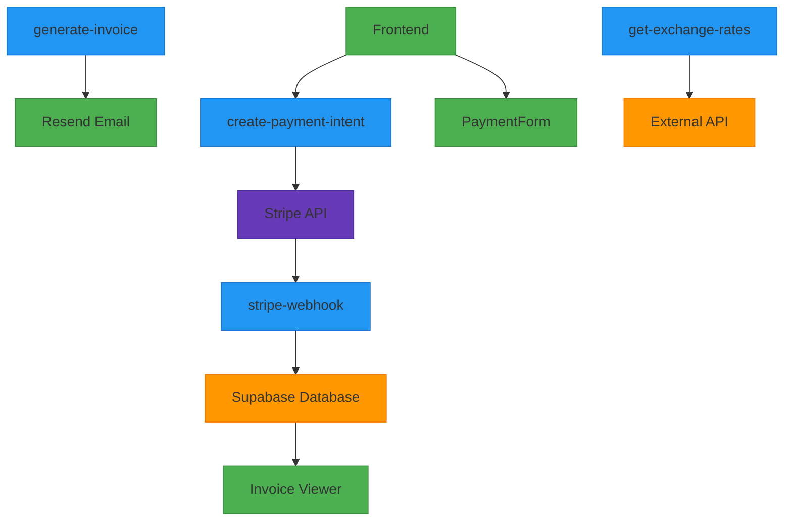
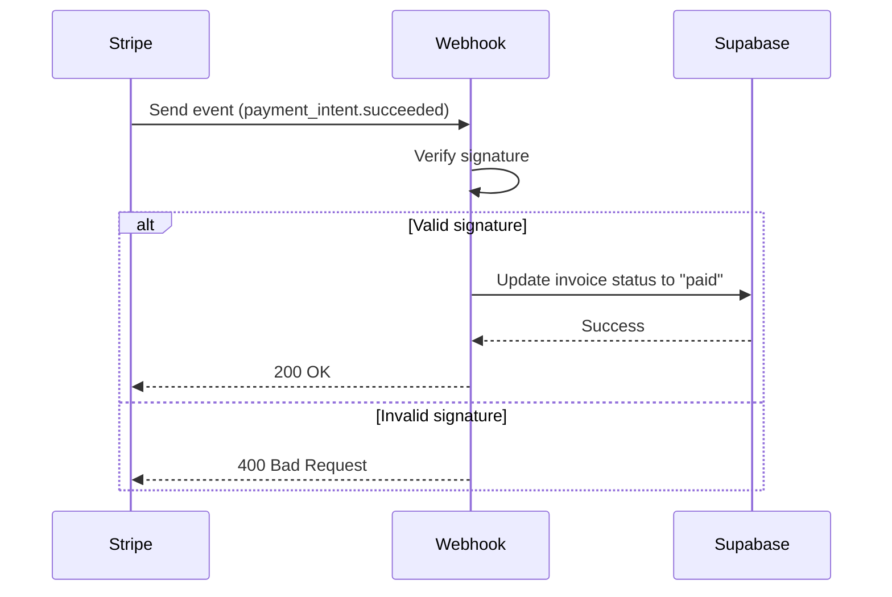
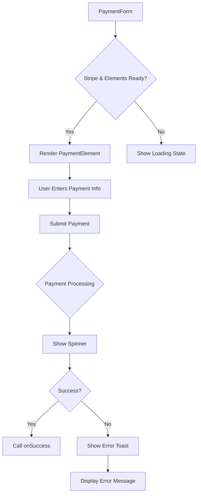
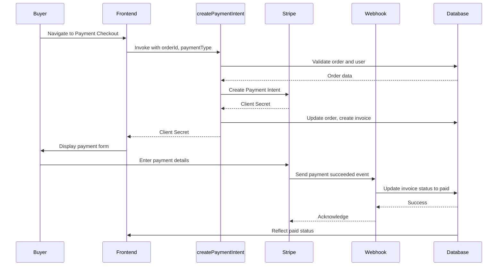

# Payments

<cite>
**Referenced Files in This Document**   
- [PaymentCheckout.tsx](file://src/pages/PaymentCheckout.tsx)
- [PaymentForm.tsx](file://src/components/payment/PaymentForm.tsx)
- [usePayment.ts](file://src/hooks/usePayment.ts)
- [create-payment-intent/index.ts](file://supabase/functions/create-payment-intent/index.ts)
- [stripe-webhook/index.ts](file://supabase/functions/stripe-webhook/index.ts)
- [generate-invoice/index.ts](file://supabase/functions/generate-invoice/index.ts)
- [InvoiceViewer.tsx](file://src/components/payment/InvoiceViewer.tsx)
- [get-exchange-rates/index.ts](file://supabase/functions/get-exchange-rates/index.ts)
- [order.ts](file://src/types/order.ts)
- [20251115150759_remix_migration_from_pg_dump.sql](file://supabase/migrations/20251115150759_remix_migration_from_pg_dump.sql)
</cite>

## Table of Contents
1. [Introduction](#introduction)
2. [Payment Processing Architecture](#payment-processing-architecture)
3. [Core Payment Functions](#core-payment-functions)
4. [Frontend Integration](#frontend-integration)
5. [Security and Compliance](#security-and-compliance)
6. [Payment Lifecycle](#payment-lifecycle)
7. [Reconciliation and Invoicing](#reconciliation-and-invoicing)
8. [Error Handling](#error-handling)
9. [Currency and Tax Considerations](#currency-and-tax-considerations)
10. [Conclusion](#conclusion)

## Introduction

The payment processing system in the Sleek Apparels platform handles financial transactions through a secure, PCI-compliant integration with Stripe. The system supports multiple payment types including deposits, balance payments, and full payments for orders. It includes robust mechanisms for payment initiation, status updates via webhooks, invoice generation, and reconciliation between payment intents and orders. The architecture ensures secure handling of financial data while providing a seamless experience for buyers and suppliers.

**Section sources**
- [PaymentCheckout.tsx](file://src/pages/PaymentCheckout.tsx#L1-L174)
- [create-payment-intent/index.ts](file://supabase/functions/create-payment-intent/index.ts#L1-L288)

## Payment Processing Architecture

The payment system follows a serverless architecture with Supabase functions handling backend logic and React components managing the frontend experience. The core components include:

- **create-payment-intent**: Creates Stripe payment intents and validates order integrity
- **stripe-webhook**: Receives and processes payment status updates from Stripe
- **generate-invoice**: Creates and sends professional invoices using AI-generated HTML
- **get-exchange-rates**: Manages currency conversion rates for international transactions

The system uses Supabase as the primary database and authentication provider, with Stripe handling all payment processing. All sensitive operations are protected by authentication and authorization checks.

**Diagram sources**
- [create-payment-intent/index.ts](file://supabase/functions/create-payment-intent/index.ts#L1-L288)
- [stripe-webhook/index.ts](file://supabase/functions/stripe-webhook/index.ts#L1-L114)
- [generate-invoice/index.ts](file://supabase/functions/generate-invoice/index.ts#L1-L243)

**Section sources**
- [create-payment-intent/index.ts](file://supabase/functions/create-payment-intent/index.ts#L1-L288)
- [stripe-webhook/index.ts](file://supabase/functions/stripe-webhook/index.ts#L1-L114)

## Core Payment Functions

### create-payment-intent

The `create-payment-intent` function initiates payment processing by creating a Stripe payment intent. It performs several critical validations:

- Authenticates the user and verifies they are either the order buyer or an admin
- Validates the order exists and is in a valid state for payment
- Ensures the order price matches the original quote within a 0.5% tolerance
- Detects if the order was recently modified before payment (potential tampering)
- Prevents duplicate payments for already paid orders
- Enforces minimum payment amount of $1.00

The function supports three payment types:
- **deposit**: 30% of order total
- **balance**: 70% of order total
- **full**: 100% of order total

Upon successful validation, it creates a Stripe customer if one doesn't exist, creates the payment intent, updates the order with the payment intent ID, and creates a pending invoice record.

**Section sources**
- [create-payment-intent/index.ts](file://supabase/functions/create-payment-intent/index.ts#L1-L288)

### stripe-webhook

The `stripe-webhook` function receives and processes payment status updates from Stripe. It implements critical security measures:

- Verifies webhook signatures using the Stripe webhook secret
- Handles `payment_intent.succeeded` events by updating invoice status to "paid"
- Handles `payment_intent.payment_failed` events by updating invoice status to "failed"
- Uses the service role key for database operations to bypass row-level security

The function ensures that payment status changes in Stripe are accurately reflected in the application's database, maintaining data consistency across systems.

**Diagram sources**
- [stripe-webhook/index.ts](file://supabase/functions/stripe-webhook/index.ts#L1-L114)

**Section sources**
- [stripe-webhook/index.ts](file://supabase/functions/stripe-webhook/index.ts#L1-L114)

### generate-invoice

The `generate-invoice` function creates professional billing documents using AI-generated HTML. Key features include:

- Authenticates the user and verifies they are either the order buyer or an admin
- Fetches order and buyer details from the database
- Uses Lovable AI to generate professional invoice HTML with proper styling
- Stores the invoice HTML in Supabase storage
- Sends the invoice via email using Resend
- Updates the invoice record with the public URL

The function ensures that invoices contain all necessary information including invoice number, dates, payment terms, order details, and company contact information.

**Section sources**
- [generate-invoice/index.ts](file://supabase/functions/generate-invoice/index.ts#L1-L243)

## Frontend Integration

### PaymentCheckout.tsx

The `PaymentCheckout` component provides the user interface for completing payments. It:

- Fetches order details and creates a payment intent on load
- Displays order summary including total, deposit, and remaining balance
- Integrates with Stripe Elements to securely collect payment information
- Handles payment success with toast notifications and navigation
- Manages loading states and error conditions

The component uses React Router for navigation and Supabase for data fetching, ensuring a seamless user experience.

**Section sources**
- [PaymentCheckout.tsx](file://src/pages/PaymentCheckout.tsx#L1-L174)

### PaymentForm.tsx

The `PaymentForm` component renders the Stripe payment element and handles the payment submission. It:

- Displays payment type and amount
- Integrates with Stripe Elements for secure card input
- Handles form submission and payment confirmation
- Manages processing states and error feedback
- Provides success callbacks for parent components

The component ensures PCI compliance by never handling raw card data, which is processed directly by Stripe.

**Diagram sources**
- [PaymentForm.tsx](file://src/components/payment/PaymentForm.tsx#L1-L94)

**Section sources**
- [PaymentForm.tsx](file://src/components/payment/PaymentForm.tsx#L1-L94)

## Security and Compliance

The payment system implements multiple layers of security to ensure PCI compliance and protect financial data:

### Authentication and Authorization
- All functions require authentication via the Authorization header
- Users must be either the order buyer or an admin to perform payment operations
- Admin role verification prevents unauthorized access

### Data Validation
- Order price is validated against the original quote with 0.5% tolerance
- Minimum payment amount of $1.00 prevents microtransaction attacks
- Order modification detection alerts on recent changes before payment

### Secure Data Handling
- Card details are never stored or accessed by the application
- Stripe customer and payment intent IDs are used for reference
- All sensitive operations use Supabase service role keys

### Webhook Security
- Stripe webhook signatures are verified using the webhook secret
- Only specific event types are processed
- Error handling prevents information disclosure

**Section sources**
- [create-payment-intent/index.ts](file://supabase/functions/create-payment-intent/index.ts#L1-L288)
- [stripe-webhook/index.ts](file://supabase/functions/stripe-webhook/index.ts#L1-L114)
- [generate-invoice/index.ts](file://supabase/functions/generate-invoice/index.ts#L1-L243)

## Payment Lifecycle

The payment lifecycle follows a structured flow from initiation to completion:

**Diagram sources**
- [PaymentCheckout.tsx](file://src/pages/PaymentCheckout.tsx#L1-L174)
- [create-payment-intent/index.ts](file://supabase/functions/create-payment-intent/index.ts#L1-L288)
- [stripe-webhook/index.ts](file://supabase/functions/stripe-webhook/index.ts#L1-L114)

**Section sources**
- [PaymentCheckout.tsx](file://src/pages/PaymentCheckout.tsx#L1-L174)
- [create-payment-intent/index.ts](file://supabase/functions/create-payment-intent/index.ts#L1-L288)

## Reconciliation and Invoicing

### Database Schema

The system uses two primary tables for payment tracking:

**invoices table:**
- `id`: Primary key
- `invoice_number`: Unique invoice identifier
- `order_id`: Foreign key to orders table
- `amount`: Payment amount
- `payment_type`: deposit, balance, or full
- `status`: pending, paid, cancelled, or refunded
- `stripe_payment_intent_id`: Reference to Stripe payment intent
- `due_date`: Payment due date
- `paid_at`: Timestamp when payment was received

**orders table:**
- `stripe_payment_intent_id`: Reference to Stripe payment intent
- `stripe_customer_id`: Reference to Stripe customer
- `deposit_amount`: Amount of deposit paid
- `balance_amount`: Amount of balance paid
- `payment_status`: Current payment status

The schema includes constraints to ensure data integrity:
- `invoices_payment_type_check`: Restricts payment_type to valid values
- `invoices_status_check`: Restricts status to valid values
- Unique constraint on invoice_number

**Section sources**
- [20251115150759_remix_migration_from_pg_dump.sql](file://supabase/migrations/20251115150759_remix_migration_from_pg_dump.sql#L1144-L1162)

### Invoice Management

The `InvoiceViewer` component displays invoice details to users:
- Shows invoice number, amount, payment type, and status
- Displays issue and due dates
- Shows paid date if applicable
- Provides download functionality

The component uses status-based badge coloring for quick visual identification of invoice status.

**Section sources**
- [InvoiceViewer.tsx](file://src/components/payment/InvoiceViewer.tsx#L1-L97)

## Error Handling

The system implements comprehensive error handling at multiple levels:

### Client-Side Error Handling
- Toast notifications for payment failures
- Clear error messages for authentication and validation issues
- Loading states to prevent duplicate submissions
- Graceful degradation when Stripe is not configured

### Server-Side Error Handling
- Detailed logging with structured data
- Input validation with descriptive error messages
- Transaction rollback on failure
- Rate limiting and abuse prevention

### Common Error Scenarios
- **Authentication required**: User not logged in
- **Invalid authentication**: Invalid or expired token
- **Unauthorized access**: User not buyer or admin
- **Order not found**: Invalid order ID
- **Order already paid**: Prevents duplicate payments
- **Payment amount too low**: Enforces minimum amount
- **Price mismatch**: Detects quote-order discrepancies
- **Invalid signature**: Failed webhook verification

**Section sources**
- [create-payment-intent/index.ts](file://supabase/functions/create-payment-intent/index.ts#L1-L288)
- [stripe-webhook/index.ts](file://supabase/functions/stripe-webhook/index.ts#L1-L114)
- [usePayment.ts](file://src/hooks/usePayment.ts#L1-L68)

## Currency and Tax Considerations

### Exchange Rate Management

The `get-exchange-rates` function handles currency conversion:
- Caches rates for 24 hours to reduce API calls
- Supports multiple currencies (USD, EUR, CAD, AUD, GBP, BDT)
- Uses exchangerate-api.com as the data source
- Falls back to demo mode if API key is missing

The function implements a cache-first strategy, checking the database for valid cached rates before making external API calls.

**Section sources**
- [get-exchange-rates/index.ts](file://supabase/functions/get-exchange-rates/index.ts#L1-L88)

### Tax Considerations

While the current implementation focuses on USD transactions, the system is designed to accommodate tax calculations through:
- Flexible invoice generation that can include tax line items
- Support for different payment types that could represent tax components
- Metadata fields that can store tax-related information

Future enhancements could integrate with tax calculation services to automatically compute sales tax, VAT, or GST based on jurisdiction.

## Conclusion

The payment processing system in the Sleek Apparels platform provides a secure, reliable, and user-friendly experience for handling financial transactions. By leveraging Stripe's PCI-compliant infrastructure and implementing robust validation and security measures, the system ensures the integrity of payment data while providing flexibility for different payment scenarios. The integration between frontend components and serverless functions creates a seamless flow from payment initiation to completion, with comprehensive logging and error handling for operational visibility. The system's design supports future enhancements including subscription management, refund processing, and expanded currency and tax support.