# Security

<cite>
**Referenced Files in This Document**   
- [password-breach-check/index.ts](file://supabase/functions/password-breach-check/index.ts)
- [log-security-event/index.ts](file://supabase/functions/log-security-event/index.ts)
- [admin-check/index.ts](file://supabase/functions/admin-check/index.ts)
- [bootstrap-admin/index.ts](file://supabase/functions/bootstrap-admin/index.ts)
- [shared/securityLogger.ts](file://supabase/functions/shared/securityLogger.ts)
- [AuthContext.tsx](file://src/contexts/AuthContext.tsx)
- [RoleBasedRoute.tsx](file://src/components/routes/RoleBasedRoute.tsx)
- [ChangePasswordDialog.tsx](file://src/components/ChangePasswordDialog.tsx)
- [SecurityMonitoringDashboard.tsx](file://src/components/admin/SecurityMonitoringDashboard.tsx)
- [AdminAuditLogs.tsx](file://src/pages/AdminAuditLogs.tsx)
- [auditLog.ts](file://src/lib/auditLog.ts)
- [securityLogger.ts](file://supabase/functions/shared/securityLogger.ts)
</cite>

## Table of Contents
1. [Introduction](#introduction)
2. [Core Security Functions](#core-security-functions)
3. [Authentication and Authorization](#authentication-and-authorization)
4. [Threat Models and Vulnerability Mitigation](#threat-models-and-vulnerability-mitigation)
5. [Audit Trail and Incident Response](#audit-trail-and-incident-response)
6. [Security Monitoring and Administration](#security-monitoring-and-administration)
7. [Conclusion](#conclusion)

## Introduction

The SleekApp platform implements a comprehensive security framework to protect user data, prevent unauthorized access, and maintain system integrity. This document details the security functions that safeguard the application, including password validation against known breaches, logging of suspicious activities, role verification, initial administrator setup, and the shared security infrastructure. The security architecture integrates with Supabase Auth for identity management, implements rate limiting to prevent brute force attacks, and generates comprehensive audit trails for compliance and monitoring purposes.

The security model follows the principle of defense in depth, with multiple layers of protection including client-side validation, server-side verification, database-level policies, and real-time monitoring. The system is designed to protect against common vulnerabilities outlined in the OWASP Top 10 while maintaining a seamless user experience.

**Section sources**
- [password-breach-check/index.ts](file://supabase/functions/password-breach-check/index.ts)
- [log-security-event/index.ts](file://supabase/functions/log-security-event/index.ts)
- [admin-check/index.ts](file://supabase/functions/admin-check/index.ts)

## Core Security Functions

### Password Breach Check

The `password-breach-check` function validates user passwords against known data breaches using the Have I Been Pwned (HIBP) k-anonymity API. This serverless function runs on Deno Edge and implements a privacy-preserving approach that never transmits the full password to external services.

The implementation uses SHA-1 hashing to create a password fingerprint, then queries the HIBP API with only the first five characters of the hash. The service returns a list of hash suffixes that match the prefix, which are then compared locally to determine if the password has been exposed in any known breaches. This approach ensures that neither the application nor the HIBP service ever has access to the complete password hash.

The function includes comprehensive origin validation to prevent unauthorized access, allowing requests only from trusted domains including the production site, development environments, and approved preview platforms. In the event that the HIBP service is unavailable, the function fails closed to maintain security.

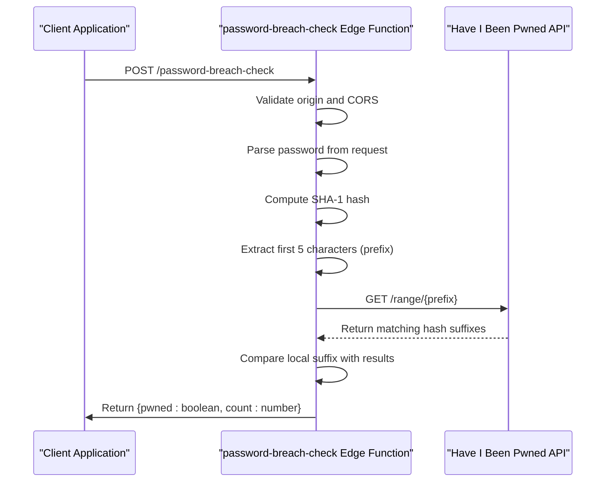

**Diagram sources**
- [password-breach-check/index.ts](file://supabase/functions/password-breach-check/index.ts)

**Section sources**
- [password-breach-check/index.ts](file://supabase/functions/password-breach-check/index.ts)
- [ChangePasswordDialog.tsx](file://src/components/ChangePasswordDialog.tsx)

### Log Security Event

The `log-security-event` function captures and records suspicious activities and security-related events in the system. This function serves as a centralized logging mechanism that writes to the `security_events` table in the database.

When invoked, the function extracts relevant information from the request, including the event type, severity level, source, details, user ID, and session ID. It automatically captures the client's IP address from the `x-forwarded-for` or `x-real-ip` headers and the user agent string from the request headers. This contextual information is crucial for forensic analysis and incident response.

The function implements proper error handling and logging, ensuring that security events are recorded even in failure scenarios. It uses the Supabase service role key for database access, which provides elevated privileges necessary for writing to the security events table.

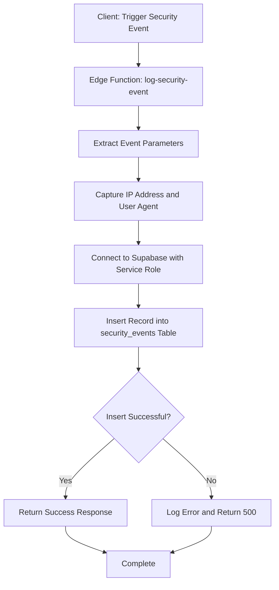

**Diagram sources**
- [log-security-event/index.ts](file://supabase/functions/log-security-event/index.ts)

**Section sources**
- [log-security-event/index.ts](file://supabase/functions/log-security-event/index.ts)
- [securityLogger.ts](file://supabase/functions/shared/securityLogger.ts)

### Admin Check

The `admin-check` function verifies whether an authenticated user has administrative privileges. This function is used by client applications to determine if the current user should have access to administrative interfaces and functionality.

The implementation follows a secure authentication flow: it first validates the presence of an Authorization header, then uses the Supabase client to retrieve the current user's information. Once the user is identified, the function queries the `user_roles` table to check if the user has been assigned the 'admin' role. The function returns a simple boolean response indicating admin status.

This function uses the Supabase anonymous key for authentication, which allows it to validate JWT tokens without elevated privileges. The role check is performed directly against the database, ensuring that the authorization decision is based on the authoritative source of truth.

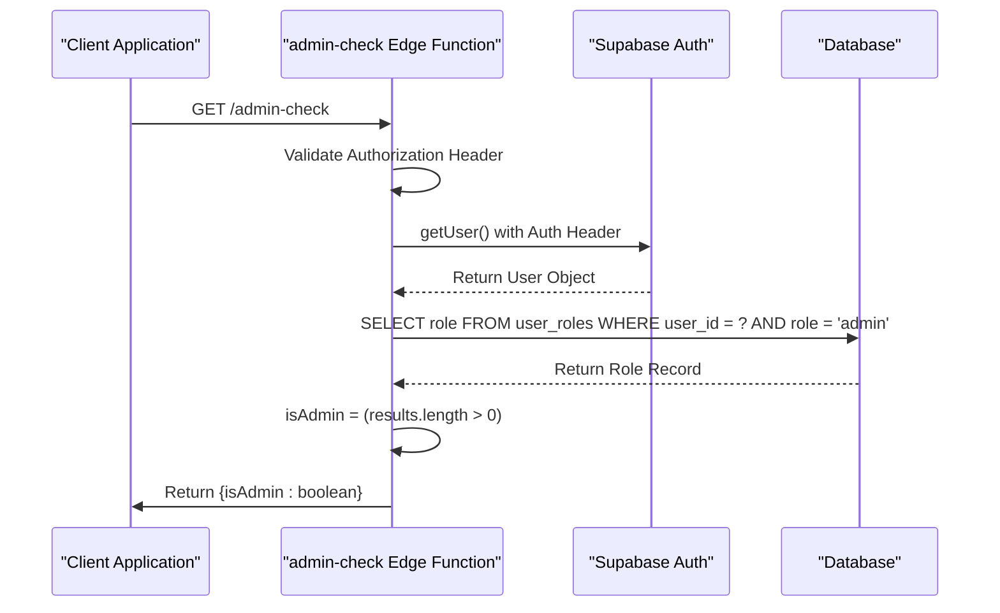

**Diagram sources**
- [admin-check/index.ts](file://supabase/functions/admin-check/index.ts)

**Section sources**
- [admin-check/index.ts](file://supabase/functions/admin-check/index.ts)
- [AuthContext.tsx](file://src/contexts/AuthContext.tsx)

### Bootstrap Admin

The `bootstrap-admin` function enables the initial setup of an administrator account in a new deployment. This critical function includes multiple security controls to prevent unauthorized privilege escalation.

The process requires two pieces of information: the email address of the user to be promoted and a bootstrap token. The function implements rate limiting to prevent brute force attacks, allowing only three attempts per IP address per hour. It uses a constant-time string comparison to validate the bootstrap token, preventing timing attacks that could be used to guess the token value.

Before proceeding, the function checks if an admin already exists in the system. If an admin is found, the bootstrap process is disabled for security reasons, preventing privilege escalation even if the token is compromised. Once all checks pass, the function assigns the 'admin' role to the specified user by inserting a record into the `user_roles` table.

All bootstrap attempts are logged in the `bootstrap_attempts` table, creating an audit trail of both successful and failed attempts. This provides visibility into potential security threats and helps detect brute force attacks.

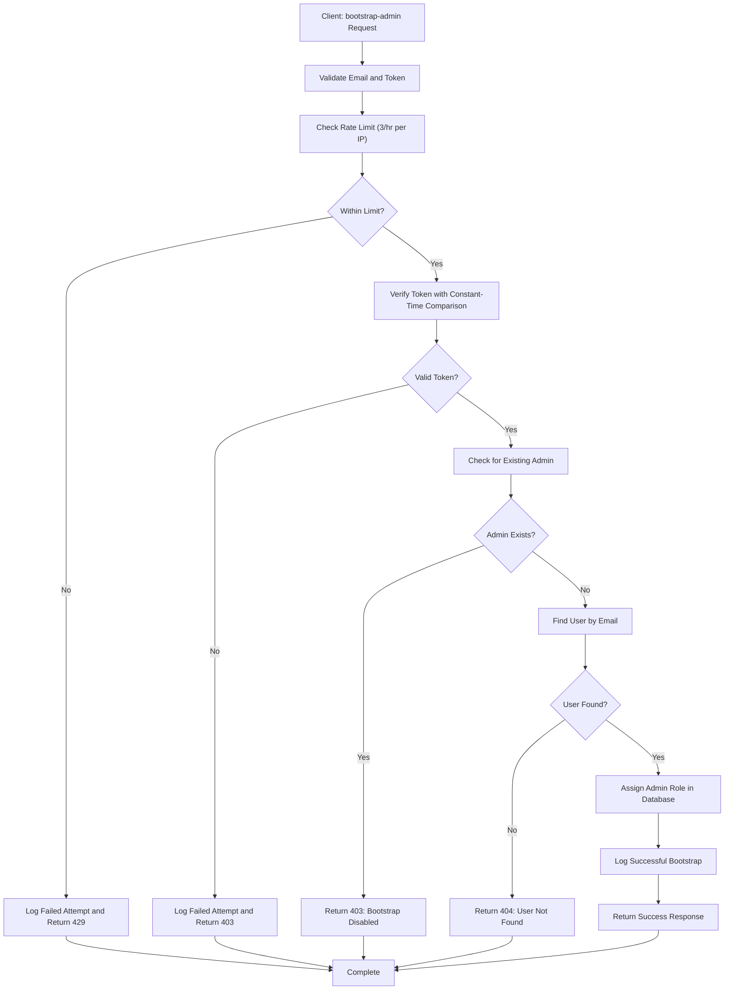

**Diagram sources**
- [bootstrap-admin/index.ts](file://supabase/functions/bootstrap-admin/index.ts)

**Section sources**
- [bootstrap-admin/index.ts](file://supabase/functions/bootstrap-admin/index.ts)

### Shared Security Logger

The `securityLogger.ts` module provides shared utilities for logging security events and tracking AI service costs across edge functions. This shared code ensures consistent logging practices throughout the application.

The `logSecurityEvent` function encapsulates the logic for recording security-related events, accepting parameters such as event type, severity, source, and optional details. It automatically captures the client's IP address and user agent from the request headers, ensuring that all security events include contextual information for investigation.

The module also includes cost tracking functionality for AI services, which logs usage of AI models and calculates estimated costs based on token consumption. This serves both financial monitoring and security purposes, as unusual spikes in AI usage could indicate abuse or compromise.

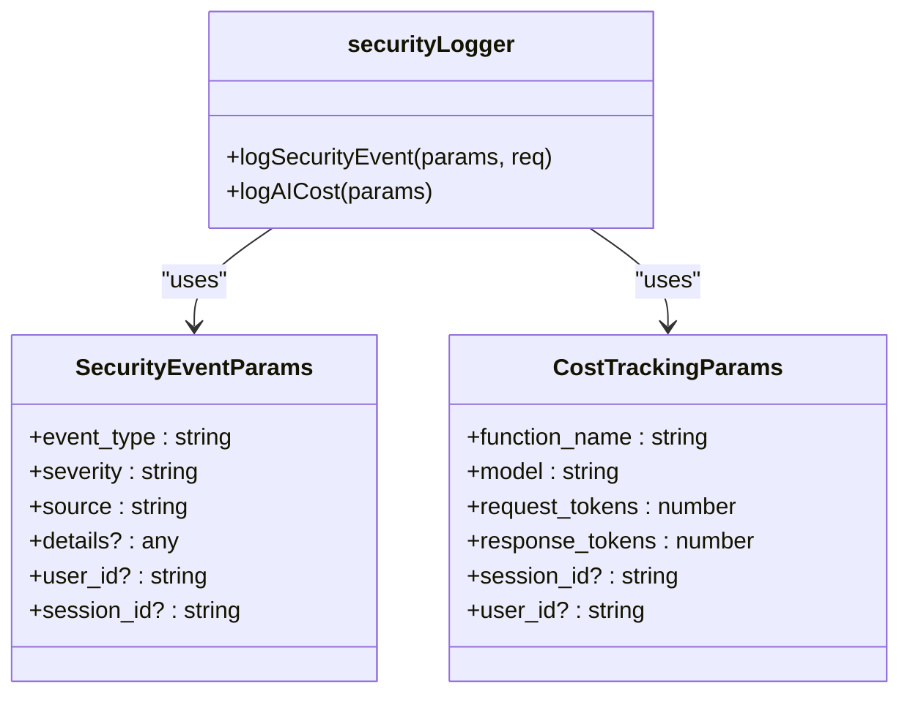

**Diagram sources**
- [shared/securityLogger.ts](file://supabase/functions/shared/securityLogger.ts)

**Section sources**
- [shared/securityLogger.ts](file://supabase/functions/shared/securityLogger.ts)

## Authentication and Authorization

### Integration with Supabase Auth

The application leverages Supabase Auth for identity management, implementing a robust authentication system that supports email/password login and session management. The integration is designed with security as a primary concern, following best practices for token handling and session validation.

The `AuthContext.tsx` component provides a React context that manages the user's authentication state, including their profile, session, role, and permissions. It listens for authentication state changes from Supabase and updates the context accordingly, ensuring that the application's security state remains synchronized with the authentication provider.

When a user logs in, Supabase returns a JWT (JSON Web Token) that contains the user's identity and session information. This token is stored securely by the Supabase client and automatically included in subsequent requests to protected resources. The context component validates the token and extracts the user's role from the database, enabling role-based access control throughout the application.

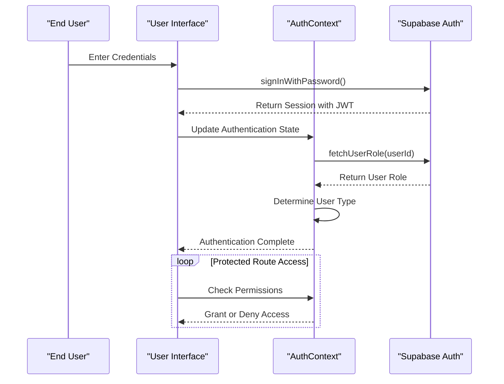

**Diagram sources**
- [AuthContext.tsx](file://src/contexts/AuthContext.tsx)

**Section sources**
- [AuthContext.tsx](file://src/contexts/AuthContext.tsx)
- [password-breach-check/index.ts](file://supabase/functions/password-breach-check/index.ts)

### Role-Based Access Control

The `RoleBasedRoute.tsx` component implements fine-grained access control based on user roles and types. This higher-order component wraps protected routes and ensures that only authorized users can access them.

The component supports two authorization models: role-based and user-type-based. Role-based authorization checks for specific roles such as 'admin', 'supplier', or 'buyer', while user-type authorization checks broader categories like 'admin', 'supplier', or 'buyer'. Routes can require either or both types of authorization, providing flexible access control policies.

When a user attempts to access a protected route, the component first checks if the user is authenticated. If not, it redirects to the authentication page. For authenticated users, it evaluates their role and user type against the route's requirements. If the user is not authorized, they are redirected to a specified fallback route or shown a fallback UI component.

The implementation includes a loading state to handle the asynchronous nature of authentication state retrieval, displaying a spinner while the user's authentication status is being determined.

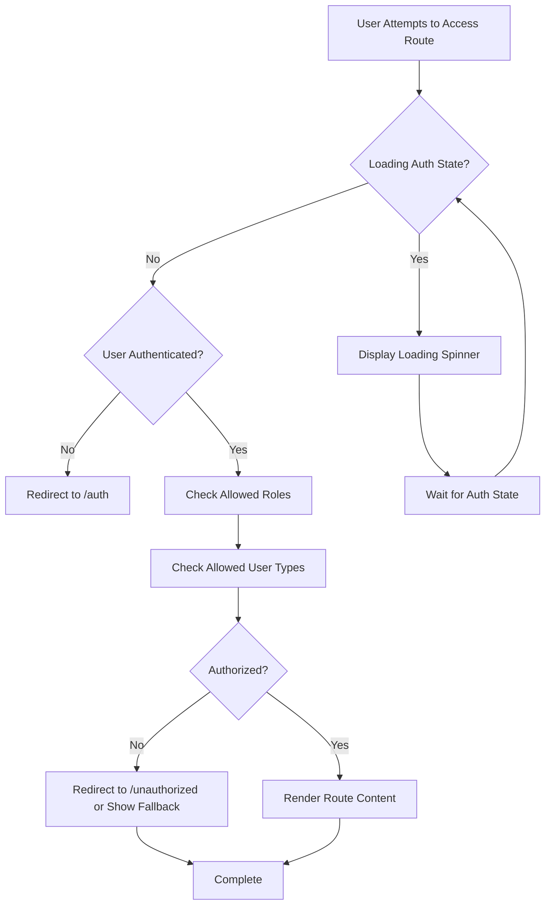

**Diagram sources**
- [RoleBasedRoute.tsx](file://src/components/routes/RoleBasedRoute.tsx)

**Section sources**
- [RoleBasedRoute.tsx](file://src/components/routes/RoleBasedRoute.tsx)
- [AuthContext.tsx](file://src/contexts/AuthContext.tsx)

### JWT Validation and Claim Checking

The security architecture implements strict JWT validation and claim checking to prevent unauthorized access. All edge functions that require authentication validate the JWT token provided in the Authorization header before processing the request.

The validation process includes checking the token's signature, expiration, and issuer to ensure it is valid and has not been tampered with. Functions that require specific privileges, such as the `admin-check` function, extract claims from the token to determine the user's identity and verify their permissions against the database.

This approach follows the principle of least privilege, where each function only grants access based on the minimum necessary claims. The system avoids relying solely on client-provided data for authorization decisions, instead verifying critical claims server-side against the authoritative data source.

## Threat Models and Vulnerability Mitigation

### OWASP Top 10 Protection

The application implements comprehensive protections against the OWASP Top 10 vulnerabilities:

**A01:2021-Broken Access Control**: The system enforces strict access control through role-based routing, database policies, and function-level authorization checks. The `RoleBasedRoute` component prevents unauthorized access to protected routes, while Supabase Row Level Security (RLS) policies restrict database access at the row level.

**A02:2021-Cryptographic Failures**: Passwords are never stored in plaintext and are validated against breach databases before acceptance. The system uses HTTPS for all communications, and sensitive data is encrypted at rest in the database.

**A03:2021-Injection**: All database queries use parameterized statements or Supabase's query builder, preventing SQL injection attacks. User input is validated and sanitized before processing.

**A04:2021-Insecure Design**: The security architecture follows secure design principles, including defense in depth, least privilege, and fail-safe defaults. Security controls are integrated throughout the application layers.

**A05:2021-Security Misconfiguration**: The system uses secure default configurations, with public access removed from sensitive tables and functions. Security headers are properly configured, and unnecessary services are disabled.

**A06:2021-Vulnerable and Outdated Components**: Dependencies are regularly updated, and the application uses modern, well-maintained libraries for security-critical functions.

**A07:2021-Identification and Authentication Failures**: The system implements strong password policies, breach detection, rate limiting, and multi-factor authentication options to protect against credential stuffing and brute force attacks.

**A08:2021-Software and Data Integrity Failures**: The application uses signed JWT tokens for session management and validates data integrity through cryptographic hashes where appropriate.

**A09:2021-Security Logging and Monitoring**: Comprehensive logging captures security events, authentication attempts, and administrative actions, enabling detection of suspicious activities.

**A10:2021-Server-Side Request Forgery (SSRF)**: Edge functions validate and sanitize URLs when making external requests, and network access is restricted to approved endpoints.

### Rate Limiting Implementation

The application implements rate limiting at multiple levels to prevent abuse and denial-of-service attacks:

**Bootstrap Admin Rate Limiting**: The `bootstrap-admin` function limits attempts to three per IP address per hour, preventing brute force attacks against the bootstrap token.

**OTP Rate Limiting**: The system implements rate limits on OTP (One-Time Password) requests to prevent abuse of the verification system. The `send-otp` function checks recent OTP requests before sending a new code.

**AI Service Rate Limiting**: Various AI-powered features have rate limits to prevent excessive usage and associated costs. The `ai_quote_rate_limits`, `conversation_rate_limits`, and other rate limit tables track usage by user, IP, or session.

**Database-Level Policies**: Supabase RLS policies enforce rate limiting rules at the database level, ensuring that rate limit checks cannot be bypassed by direct database access.

The rate limiting system is designed to be transparent to legitimate users while effectively blocking abusive behavior. Exceeded rate limits return appropriate HTTP status codes (429 Too Many Requests) with clear error messages.

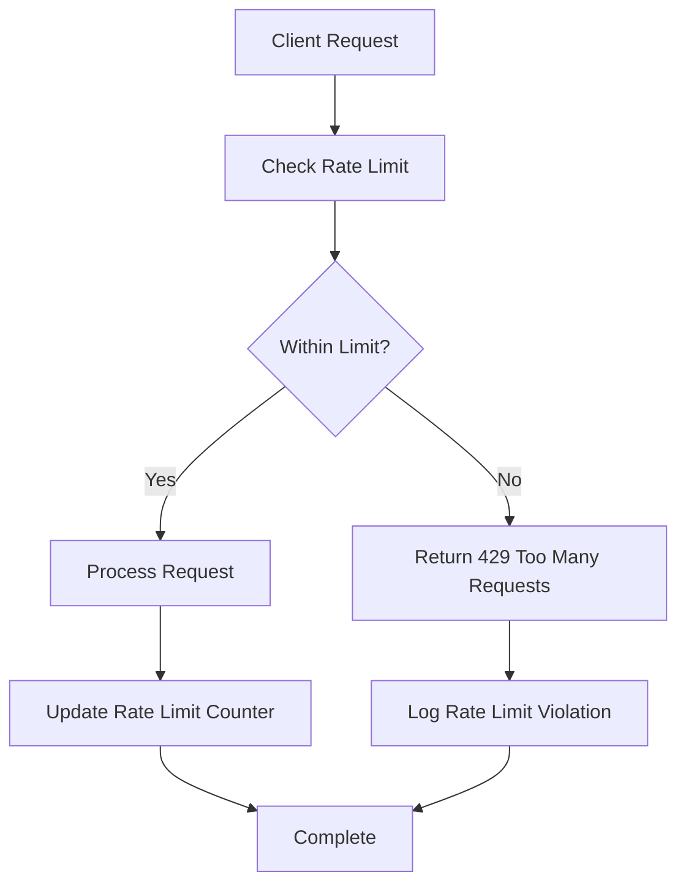

**Section sources**
- [bootstrap-admin/index.ts](file://supabase/functions/bootstrap-admin/index.ts)
- [send-otp/index.ts](file://supabase/functions/send-otp/index.ts)
- [20251127091524_dd83810a-55c9-494a-8878-c84278881cc9.sql](file://supabase/migrations/20251127091524_dd83810a-55c9-494a-8878-c84278881cc9.sql)

### Encryption Practices

The application follows industry-standard encryption practices to protect user data:

**Data in Transit**: All communications use HTTPS with modern TLS protocols, ensuring that data is encrypted between the client and server.

**Data at Rest**: Sensitive data in the database is encrypted at rest by the underlying database infrastructure. Supabase manages encryption keys and ensures compliance with security standards.

**Password Handling**: Passwords are never stored in the application. When users change passwords, the `ChangePasswordDialog` component first verifies the current password, then checks the new password against breach databases before allowing the change.

**Token Security**: JWT tokens are signed and include expiration times to limit their validity period. The tokens are stored securely by the Supabase client and automatically refreshed when necessary.

## Audit Trail and Incident Response

### Audit Trail Generation

The system generates comprehensive audit trails for administrative actions and security events:

**Administrative Actions**: The `log-audit-action` function records all administrative activities in the `admin_audit_logs` table. Each log entry includes the admin ID, action performed, resource type and ID, details of the change, IP address, and user agent.

**Security Events**: The `log-security-event` function captures suspicious activities in the `security_events` table, including the event type, severity, source, details, user ID, session ID, IP address, and user agent.

**Client-Side Logging**: The `auditLog.ts` library provides client-side functions for logging administrative actions, though it acknowledges the limitation of not being able to reliably capture the true client IP address from the browser.

The audit trail system follows the principle of immutability, where log entries cannot be modified or deleted once created. This ensures the integrity of the audit data and provides a reliable record for compliance and investigation purposes.

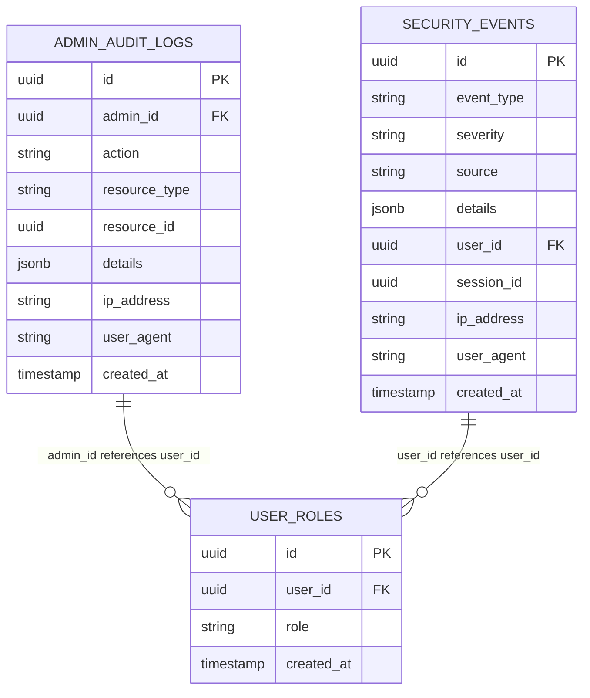

**Diagram sources**
- [log-audit-action/index.ts](file://supabase/functions/log-audit-action/index.ts)
- [log-security-event/index.ts](file://supabase/functions/log-security-event/index.ts)
- [auditLog.ts](file://src/lib/auditLog.ts)

**Section sources**
- [log-audit-action/index.ts](file://supabase/functions/log-audit-action/index.ts)
- [AdminAuditLogs.tsx](file://src/pages/AdminAuditLogs.tsx)

### Incident Response Procedures

The system includes automated incident response procedures for detecting and responding to security threats:

**Real-Time Monitoring**: The `SecurityMonitoringDashboard` component displays real-time security events and AI costs, with toast notifications for critical and high-severity events.

**Automated Alerts**: The dashboard subscribes to real-time updates from the `security_events` table, triggering visual and auditory alerts when high-severity events occur.

**Rate Limit Enforcement**: When rate limits are exceeded, the system automatically blocks further attempts and logs the violation for investigation.

**Account Lockout**: After multiple failed authentication attempts, accounts are temporarily locked to prevent brute force attacks.

**Security Event Types**: The system recognizes various security event types including:
- `captcha_failure`: Failed CAPTCHA verification
- `rate_limit_violation`: Exceeded rate limit thresholds
- `suspicious_pattern`: Detected anomalous behavior patterns
- `cost_alert`: Unusually high AI service costs

The incident response system is designed to contain threats quickly while providing security administrators with the information needed to investigate and remediate issues.

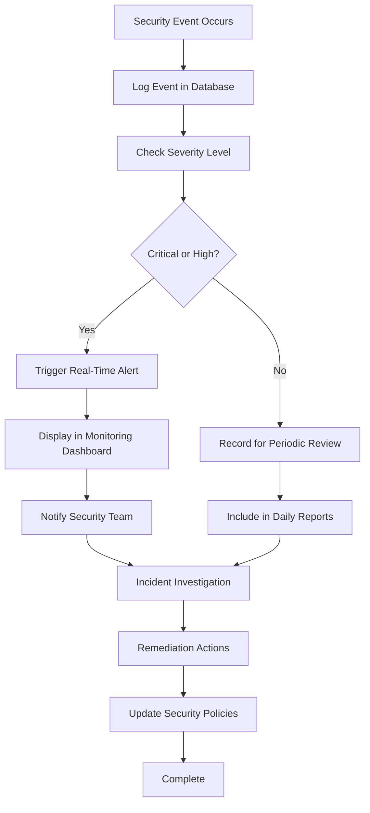

**Section sources**
- [SecurityMonitoringDashboard.tsx](file://src/components/admin/SecurityMonitoringDashboard.tsx)
- [log-security-event/index.ts](file://supabase/functions/log-security-event/index.ts)

## Security Monitoring and Administration

### Security Monitoring Dashboard

The `SecurityMonitoringDashboard` provides administrators with a comprehensive view of the system's security posture. The dashboard displays real-time security events, AI service costs, and historical trends to help identify potential threats.

Key features include:
- Real-time display of recent security events with severity indicators
- Summary cards showing critical events, high-priority alerts, and daily AI costs
- Historical data visualization for identifying trends and patterns
- Real-time subscriptions to new security events via Supabase's real-time capabilities

The dashboard uses Supabase's real-time channels to receive immediate notifications of new security events, ensuring that administrators are alerted to potential threats as they occur. Critical and high-severity events trigger toast notifications for immediate attention.

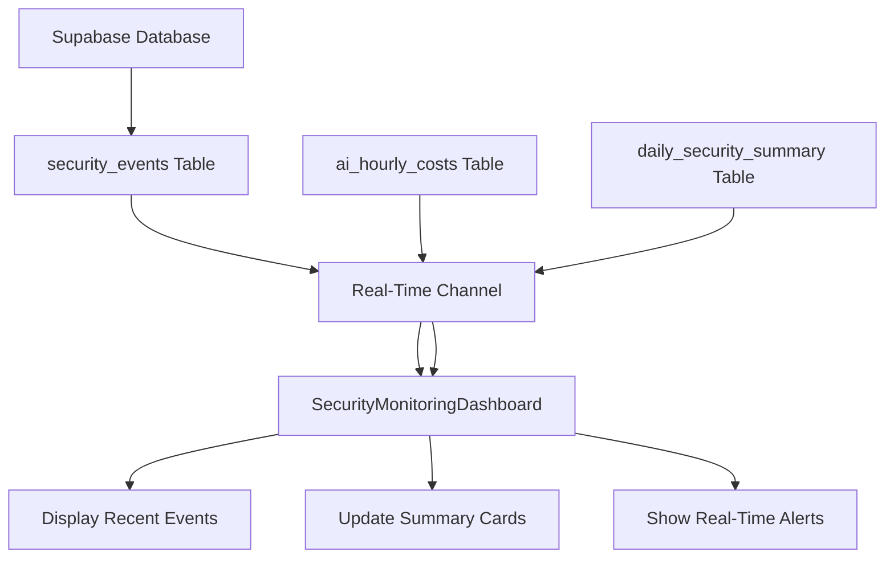

**Diagram sources**
- [SecurityMonitoringDashboard.tsx](file://src/components/admin/SecurityMonitoringDashboard.tsx)

**Section sources**
- [SecurityMonitoringDashboard.tsx](file://src/components/admin/SecurityMonitoringDashboard.tsx)
- [log-security-event/index.ts](file://supabase/functions/log-security-event/index.ts)

### Administrative Audit Logs

The `AdminAuditLogs` page provides a detailed view of all administrative actions taken within the system. This interface allows administrators to review the history of changes made to the platform, ensuring accountability and transparency.

The audit log displays:
- The specific action performed (create, update, delete, publish, etc.)
- The resource type and ID affected
- Details of the change when available
- The administrator who performed the action
- The timestamp of the action
- The IP address and user agent of the administrator

This comprehensive audit trail supports compliance requirements and enables forensic analysis in the event of a security incident. The logs are immutable and cannot be modified or deleted by administrators, ensuring their integrity.

**Section sources**
- [AdminAuditLogs.tsx](file://src/pages/AdminAuditLogs.tsx)
- [auditLog.ts](file://src/lib/auditLog.ts)

## Conclusion

The SleekApp platform implements a robust, multi-layered security architecture that protects user data and system integrity. By combining client-side validation with server-side verification, database-level policies, and real-time monitoring, the system provides comprehensive protection against a wide range of threats.

Key security features include password breach detection, role-based access control, comprehensive audit logging, and real-time security monitoring. The integration with Supabase Auth provides a solid foundation for identity management, while custom edge functions extend this foundation with application-specific security controls.

The system follows security best practices including defense in depth, least privilege, and fail-safe defaults. Automated incident response procedures help detect and contain threats quickly, while comprehensive audit trails ensure accountability and support compliance requirements.

Ongoing security improvements are guided by regular reviews and adherence to standards such as the OWASP Top 10. The security model is designed to evolve with emerging threats, ensuring that the platform remains secure as it grows and changes.