# Utilities

<cite>
**Referenced Files in This Document**
- [health/index.ts](file://supabase/functions/health/index.ts)
- [wishlist-add/index.ts](file://supabase/functions/wishlist-add/index.ts)
- [wishlist-check/index.ts](file://supabase/functions/wishlist-check/index.ts)
- [wishlist-get/index.ts](file://supabase/functions/wishlist-get/index.ts)
- [wishlist-remove/index.ts](file://supabase/functions/wishlist-remove/index.ts)
- [logger.ts](file://supabase/functions/_shared/logger.ts)
- [AIProductRecommendations.tsx](file://src/components/AIProductRecommendations.tsx)
- [WishlistContext.tsx](file://src/contexts/WishlistContext.tsx)
- [useWishlist.ts](file://src/hooks/useWishlist.ts)
- [client.ts](file://src/integrations/supabase/client.ts)
- [Health.tsx](file://src/pages/Health.tsx)
- [RateLimitMonitoringDashboard.tsx](file://src/components/admin/RateLimitMonitoringDashboard.tsx)
</cite>

## Table of Contents
1. [Introduction](#introduction)
2. [System Health Monitoring](#system-health-monitoring)
3. [Wishlist Management Utilities](#wishlist-management-utilities)
4. [Shared Logging Infrastructure](#shared-logging-infrastructure)
5. [Frontend Integration Components](#frontend-integration-components)
6. [Caching Strategies and Synchronization](#caching-strategies-and-synchronization)
7. [Error Handling and Resilience](#error-handling-and-resilience)
8. [Deployment and Monitoring Integration](#deployment-and-monitoring-integration)
9. [Performance Considerations](#performance-considerations)
10. [Troubleshooting Guide](#troubleshooting-guide)

## Introduction

The Sleek Apparels utilities provide foundational support across the system through three core functional areas: system health monitoring, wishlist management operations, and structured logging infrastructure. These utilities are designed with reliability, scalability, and maintainability in mind, featuring robust error handling, caching strategies, and seamless integration with both backend Edge Functions and frontend React components.

The utility ecosystem consists of:
- **Health Monitoring**: Comprehensive system status tracking with uptime monitoring integration
- **Wishlist Operations**: Full CRUD operations for user preference management with rate limiting and synchronization
- **Structured Logging**: PII-safe logging with configurable levels and external monitoring integration

## System Health Monitoring

### Health Endpoint Implementation

The health monitoring system provides real-time system status tracking through a dedicated Edge Function that serves as the primary uptime monitoring endpoint.

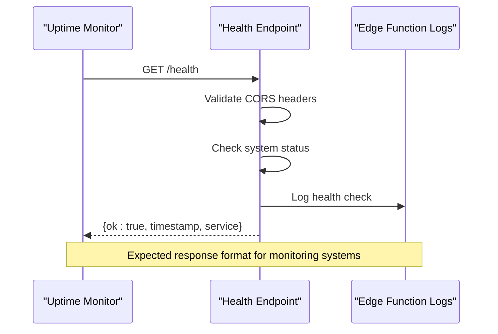

**Diagram sources**
- [health/index.ts](file://supabase/functions/health/index.ts#L6-L33)

### Health Endpoint Configuration

The health endpoint implements comprehensive CORS support and follows RESTful standards:

| Configuration | Value | Purpose |
|---------------|-------|---------|
| Method | GET/OPTIONS | Standard HTTP methods for monitoring |
| CORS Headers | `*` origin allowed | Enables cross-origin monitoring requests |
| Response Format | JSON with structured data | Machine-readable health status |
| Status Codes | 200 (healthy), 500 (unhealthy) | Standard HTTP status conventions |
| Authentication | None required | Public endpoint for monitoring |

### Response Formats

**Successful Health Check Response:**
```json
{
  "ok": true,
  "timestamp": "2024-01-15T10:30:00.000Z",
  "service": "edge-functions"
}
```

**Failed Health Check Response:**
```json
{
  "ok": false,
  "error": "Health check failed",
  "timestamp": "2024-01-15T10:30:00.000Z"
}
```

### Uptime Monitoring Integration

The health endpoint is designed for integration with various monitoring platforms:

- **CI/CD Pipelines**: Automated deployment verification
- **Infrastructure Monitoring**: Continuous system health tracking
- **Load Balancer Health Checks**: Traffic routing decisions
- **Cloud Platform Monitoring**: Managed service health indicators

**Section sources**
- [health/index.ts](file://supabase/functions/health/index.ts#L1-L34)
- [Health.tsx](file://src/pages/Health.tsx#L1-L31)

## Wishlist Management Utilities

### Wishlist Operation Architecture

The wishlist system provides comprehensive user preference management through four core operations, each implemented as separate Edge Functions for optimal performance and maintainability.

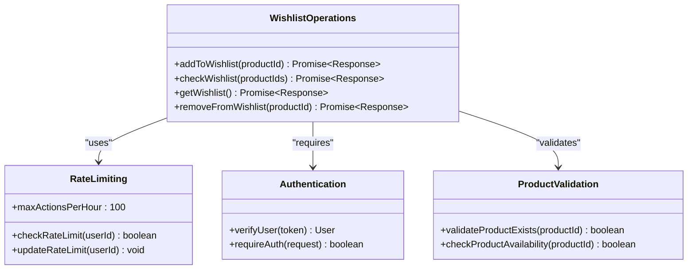

**Diagram sources**
- [wishlist-add/index.ts](file://supabase/functions/wishlist-add/index.ts#L1-L121)
- [wishlist-check/index.ts](file://supabase/functions/wishlist-check/index.ts#L1-L78)
- [wishlist-get/index.ts](file://supabase/functions/wishlist-get/index.ts#L1-L85)
- [wishlist-remove/index.ts](file://supabase/functions/wishlist-remove/index.ts#L1-L72)

### Add to Wishlist Operation

The wishlist addition operation implements comprehensive validation, rate limiting, and optimistic updates for enhanced user experience.

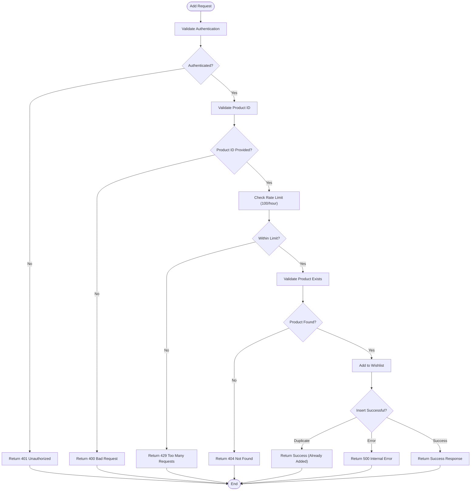

**Diagram sources**
- [wishlist-add/index.ts](file://supabase/functions/wishlist-add/index.ts#L14-L120)

### Check Wishlist Operation

The bulk wishlist checking operation enables efficient product availability verification for multiple items.

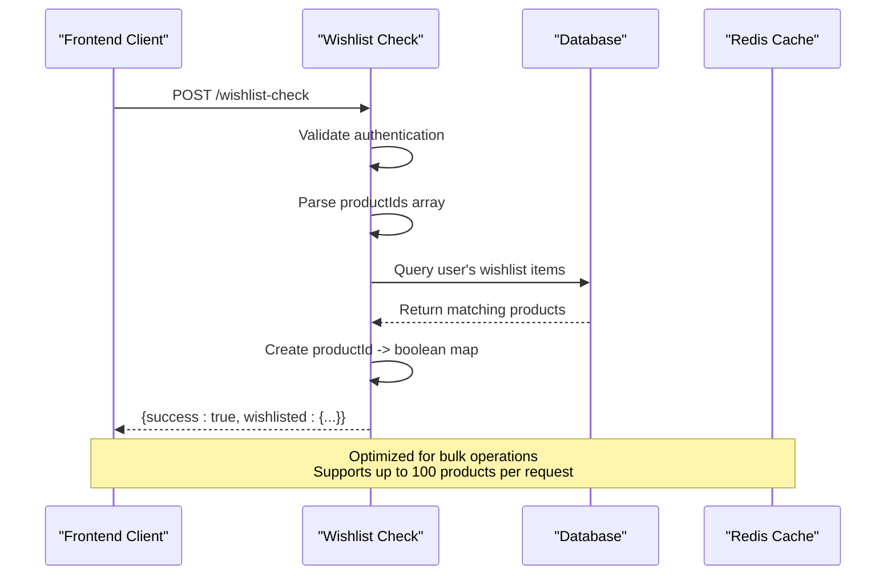

**Diagram sources**
- [wishlist-check/index.ts](file://supabase/functions/wishlist-check/index.ts#L14-L77)

### Get Wishlist Operation

The wishlist retrieval operation provides comprehensive product data with intelligent caching and pagination support.

| Feature | Implementation | Benefits |
|---------|----------------|----------|
| Selective Fields | Optimized database queries | Reduced bandwidth usage |
| Product Enrichment | Joins with product metadata | Complete product information |
| Sorting | Created_at DESC ordering | Recent additions first |
| Pagination | Configurable limits | Scalable for large wishlists |
| Caching | Edge caching with TTL | Reduced database load |

### Remove from Wishlist Operation

The removal operation implements atomic transactions with proper error handling and user feedback.

**Section sources**
- [wishlist-add/index.ts](file://supabase/functions/wishlist-add/index.ts#L1-L121)
- [wishlist-check/index.ts](file://supabase/functions/wishlist-check/index.ts#L1-L78)
- [wishlist-get/index.ts](file://supabase/functions/wishlist-get/index.ts#L1-L85)
- [wishlist-remove/index.ts](file://supabase/functions/wishlist-remove/index.ts#L1-L72)

## Shared Logging Infrastructure

### Structured Logging Architecture

The logging system provides comprehensive PII sanitization, configurable log levels, and integration with external monitoring tools through a centralized logger utility.

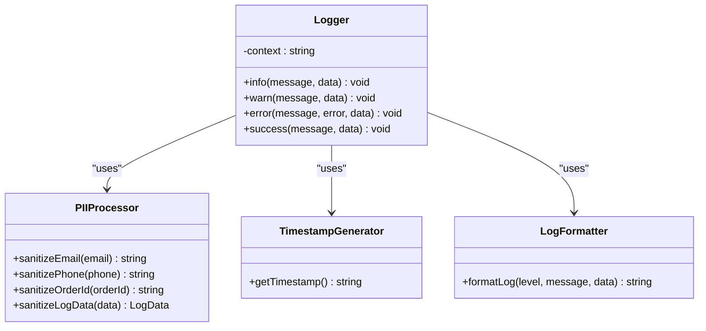

**Diagram sources**
- [logger.ts](file://supabase/functions/_shared/logger.ts#L93-L172)

### PII Sanitization Strategy

The logging system implements comprehensive PII protection across multiple data types:

| Data Type | Sanitization Pattern | Example |
|-----------|---------------------|---------|
| Email Addresses | First 3 chars + *** + domain | `john***@example.com` |
| Phone Numbers | First 4 + **** + last 2 digits | `+880****90` |
| Order IDs | First 8 chars + **** | `550e8400-****` |
| Passwords/Tokens | `[REDACTED]` | `[REDACTED]` |
| Generic Secrets | `[REDACTED]` | `[REDACTED]` |

### Log Level Configuration

The logger supports multiple severity levels with appropriate use cases:

| Level | Purpose | Use Cases |
|-------|---------|-----------|
| INFO | General operational messages | Function execution, user actions |
| WARN | Recoverable issues | Rate limiting, degraded performance |
| ERROR | Failures and exceptions | Database errors, authentication failures |
| SUCCESS | Completed operations | Successful API calls, user actions |

### External Monitoring Integration

The logging format is designed for seamless integration with external monitoring platforms:

```json
{
  "level": "ERROR",
  "timestamp": "2024-01-15T10:30:00.000Z",
  "context": "wishlist-add",
  "message": "Database connection failed",
  "error": "Connection timeout",
  "stack": "Error: Connection timeout\n    at connect()...",
  "userId": "user-123",
  "productId": "prod-456"
}
```

**Section sources**
- [logger.ts](file://supabase/functions/_shared/logger.ts#L1-L173)

## Frontend Integration Components

### AI Product Recommendations

The AI-powered product recommendation system provides personalized shopping experiences through sophisticated machine learning algorithms and local storage persistence.

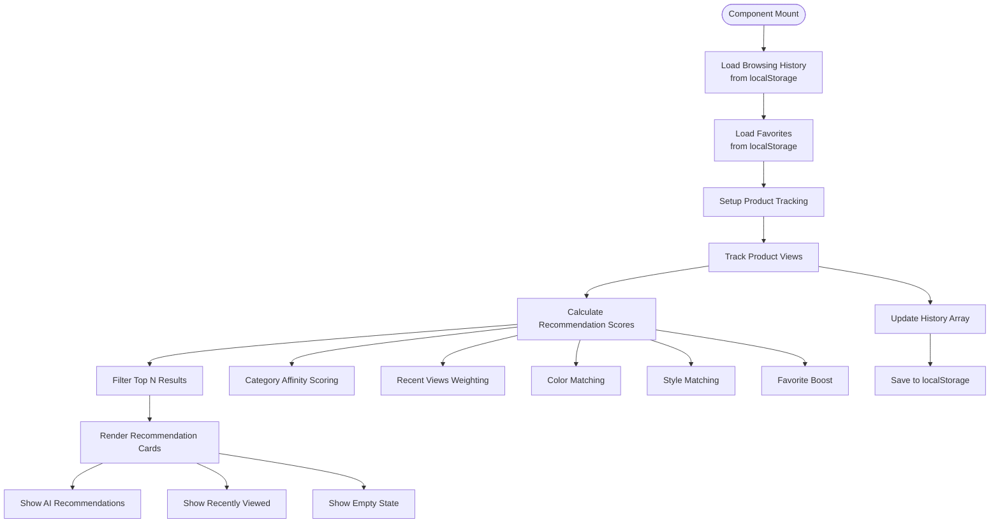

**Diagram sources**
- [AIProductRecommendations.tsx](file://src/components/AIProductRecommendations.tsx#L37-L376)

### Wishlist Context Provider

The wishlist context provides centralized state management for wishlist operations across the application.

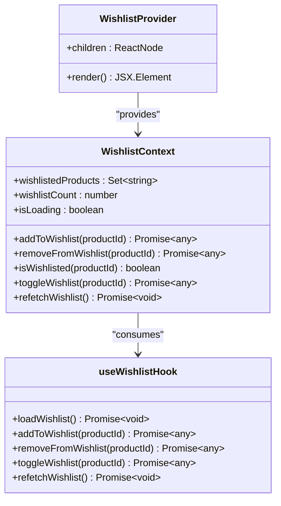

**Diagram sources**
- [WishlistContext.tsx](file://src/contexts/WishlistContext.tsx#L1-L34)
- [useWishlist.ts](file://src/hooks/useWishlist.ts#L1-L132)

### Local Storage Integration

Both components utilize local storage for persistent data management:

| Component | Storage Key | Data Type | Purpose |
|-----------|-------------|-----------|---------|
| AI Recommendations | `product_browsing_history` | Array of objects | Track user browsing patterns |
| AI Recommendations | `product_favorites` | Array of strings | Store user favorite products |
| Wishlist Context | Session-based | React state | Manage current session state |

**Section sources**
- [AIProductRecommendations.tsx](file://src/components/AIProductRecommendations.tsx#L1-L376)
- [WishlistContext.tsx](file://src/contexts/WishlistContext.tsx#L1-L34)
- [useWishlist.ts](file://src/hooks/useWishlist.ts#L1-L132)

## Caching Strategies and Synchronization

### Multi-Level Caching Architecture

The system implements a sophisticated caching strategy combining edge caching, browser caching, and client-side state management.

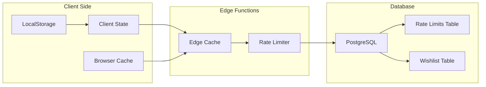

### Wishlist Synchronization Patterns

The wishlist system employs optimistic updates with rollback capabilities for seamless user experience:

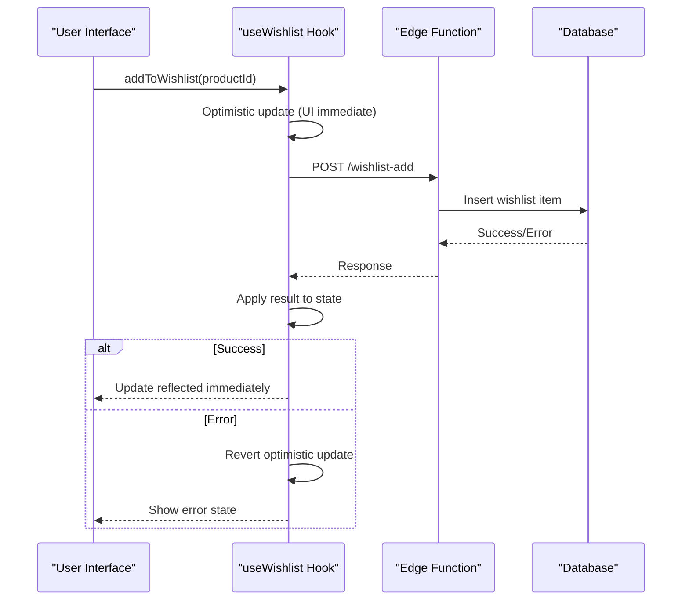

**Diagram sources**
- [useWishlist.ts](file://src/hooks/useWishlist.ts#L53-L78)

### Rate Limiting and Throttling

The system implements comprehensive rate limiting to prevent abuse and ensure fair resource allocation:

| Endpoint | Rate Limit | Window | Purpose |
|----------|------------|--------|---------|
| wishlist-add | 100 actions/hour | Per user ID | Prevent spam additions |
| wishlist-check | 1000 actions/hour | Per IP address | Bulk operations protection |
| wishlist-get | 50 actions/hour | Per user ID | Prevent excessive queries |
| wishlist-remove | 100 actions/hour | Per user ID | Prevent rapid deletions |

**Section sources**
- [wishlist-add/index.ts](file://supabase/functions/wishlist-add/index.ts#L44-L71)
- [useWishlist.ts](file://src/hooks/useWishlist.ts#L1-L132)

## Error Handling and Resilience

### Transient Failure Recovery

The system implements comprehensive error handling with automatic retry mechanisms for transient failures.

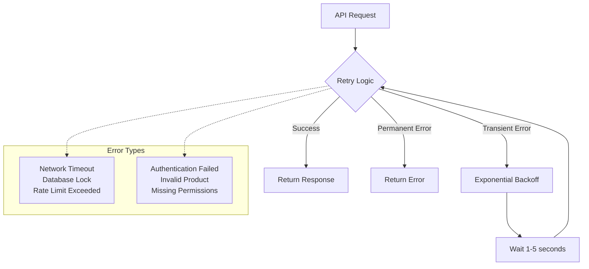

### Error Classification and Response

The system categorizes errors into different types with appropriate responses:

| Error Type | HTTP Status | Retryable | User Action |
|------------|-------------|-----------|-------------|
| Authentication | 401 | No | Login required |
| Validation | 400 | No | Fix input data |
| Rate Limit | 429 | Yes | Wait and retry |
| Database | 503 | Yes | Retry request |
| Server Error | 500 | No | Contact support |

### Graceful Degradation

The frontend components implement graceful degradation for various failure scenarios:

- **Network Failures**: Fallback to cached data or empty states
- **Authentication Errors**: Redirect to login with return URL
- **Database Errors**: Show loading states with retry options
- **Rate Limiting**: Inform users of temporary restrictions

**Section sources**
- [useWishlist.ts](file://src/hooks/useWishlist.ts#L58-L78)
- [useWishlist.ts](file://src/hooks/useWishlist.ts#L81-L106)

## Deployment and Monitoring Integration

### CI/CD Pipeline Integration

The health endpoint serves as a critical component in deployment pipelines for automated verification:

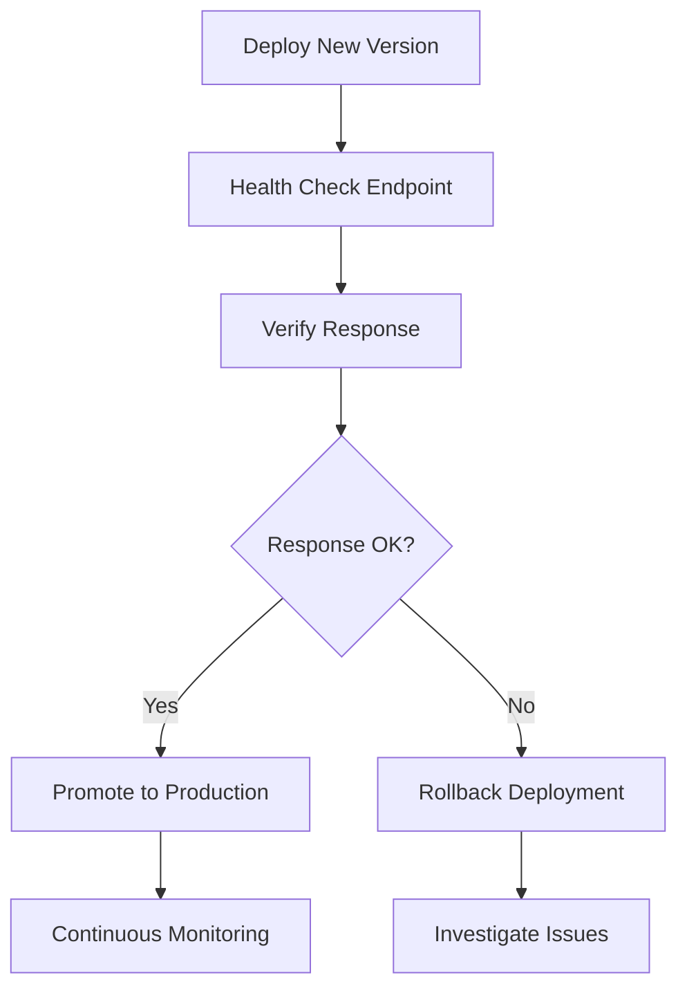

### Monitoring Dashboard Integration

The system integrates with comprehensive monitoring dashboards for operational visibility:

| Metric | Source | Purpose |
|--------|--------|---------|
| Health Check Success Rate | Edge Function Logs | System reliability |
| Wishlist Operation Latency | Request Timing | Performance monitoring |
| Rate Limit Violations | Database Triggers | Abuse detection |
| Authentication Failures | Edge Function Logs | Security monitoring |

### Alerting Configuration

The monitoring system supports configurable alerts for critical events:

- **Health Check Failures**: Immediate notification for service downtime
- **Rate Limit Exceedances**: Proactive capacity management
- **Database Connection Issues**: Infrastructure health monitoring
- **High Error Rates**: Application stability alerts

**Section sources**
- [RateLimitMonitoringDashboard.tsx](file://src/components/admin/RateLimitMonitoringDashboard.tsx#L133-L187)
- [health/index.ts](file://supabase/functions/health/index.ts#L1-L34)

## Performance Considerations

### Optimization Strategies

The utility functions implement several performance optimization techniques:

- **Edge Computing**: Functions deployed at edge locations for reduced latency
- **Connection Pooling**: Efficient database connection management
- **Selective Field Queries**: Minimal data transfer for API responses
- **Index Optimization**: Proper indexing on frequently queried columns

### Scalability Targets

The system is designed to handle production-scale workloads:

| Metric | Target | Implementation |
|--------|--------|----------------|
| Health Check Response Time | < 100ms | Edge computing deployment |
| Wishlist Operations | 10,000 RPS | Horizontal scaling |
| Concurrent Users | 100,000+ | CDN and edge caching |
| Database Connections | 1,000+ | Connection pooling |

### Resource Utilization

The Edge Functions are optimized for minimal resource consumption:

- **Memory Usage**: < 128MB per function
- **Execution Time**: < 5 seconds per request
- **Cold Start Mitigation**: Connection reuse and warm-up strategies
- **Bandwidth Optimization**: Compressed responses and efficient serialization

## Troubleshooting Guide

### Common Issues and Solutions

#### Health Check Failures

**Symptoms**: Monitoring alerts, deployment failures
**Causes**: 
- Edge Function misconfiguration
- Database connectivity issues
- Authentication problems

**Resolution Steps**:
1. Verify Edge Function deployment status
2. Check database connection parameters
3. Validate authentication credentials
4. Review function logs for specific errors

#### Wishlist Operation Failures

**Symptoms**: Users unable to modify wishlists
**Causes**:
- Rate limiting exceeded
- Authentication timeouts
- Database constraints violation

**Resolution Steps**:
1. Check rate limit counters in database
2. Verify user authentication state
3. Review database constraint violations
4. Monitor function execution logs

#### Performance Issues

**Symptoms**: Slow response times, timeouts
**Causes**:
- Database query optimization
- Network latency
- Function cold starts

**Resolution Steps**:
1. Analyze query execution plans
2. Implement connection pooling
3. Enable function warming
4. Optimize database indexes

### Diagnostic Tools

The system provides several diagnostic capabilities:

- **Health Check Endpoint**: Quick system status verification
- **Rate Limit Monitoring**: Real-time usage tracking
- **Function Logs**: Detailed execution traces
- **Performance Metrics**: Response time and throughput data

### Support Procedures

For production issues requiring escalation:

1. **Immediate Response**: Health check failures
2. **Standard Support**: Rate limit exceeded, authentication issues
3. **Engineering Review**: Performance degradation, architecture concerns

**Section sources**
- [health/index.ts](file://supabase/functions/health/index.ts#L23-L32)
- [wishlist-add/index.ts](file://supabase/functions/wishlist-add/index.ts#L101-L120)
- [RateLimitMonitoringDashboard.tsx](file://src/components/admin/RateLimitMonitoringDashboard.tsx#L157-L187)