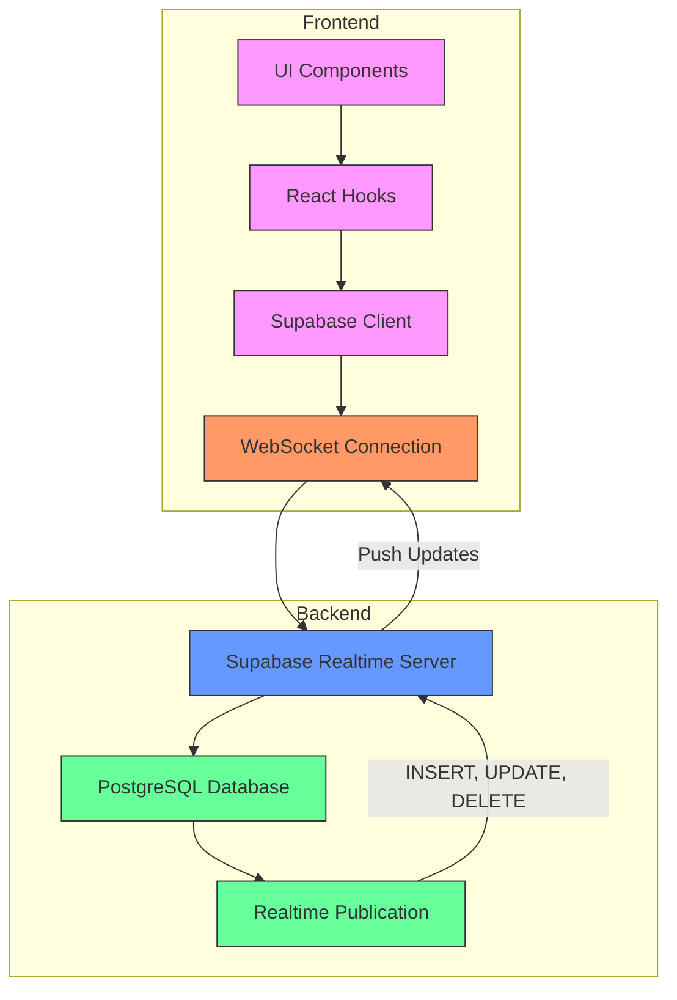
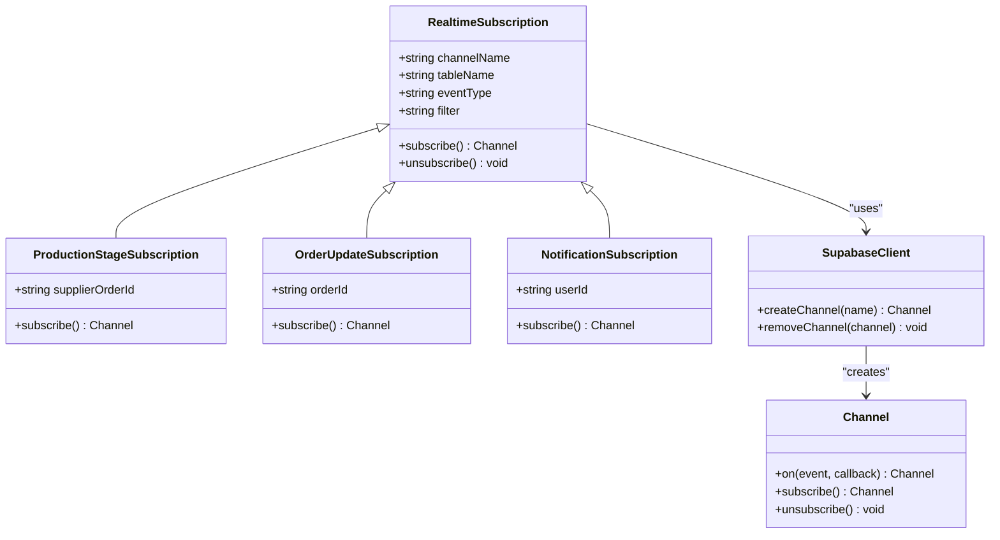
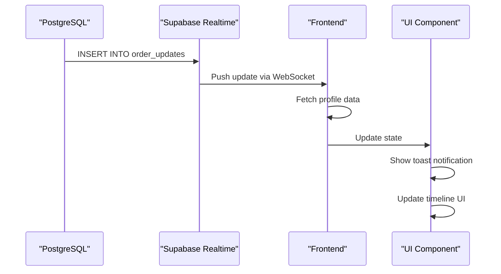
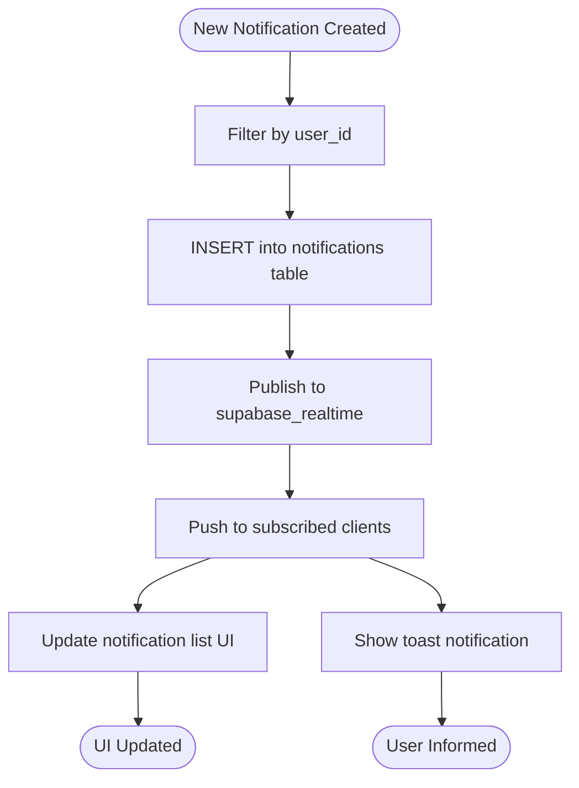
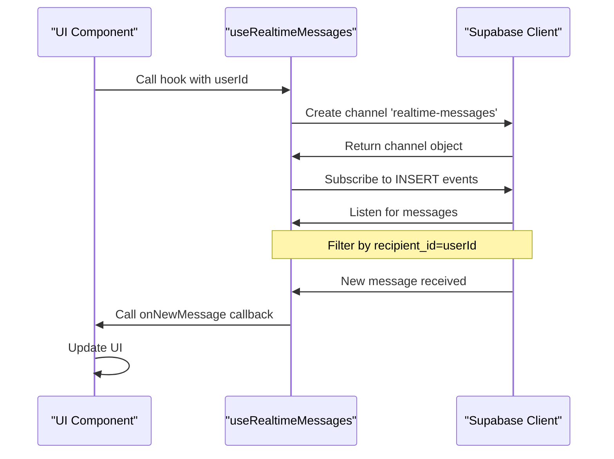
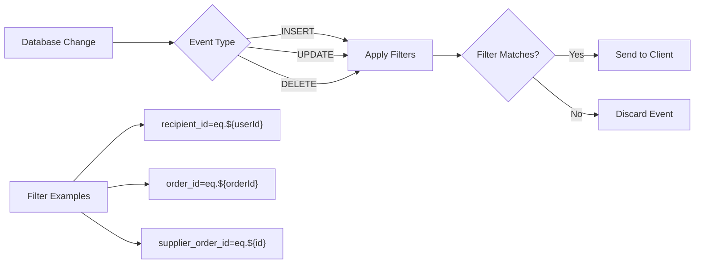
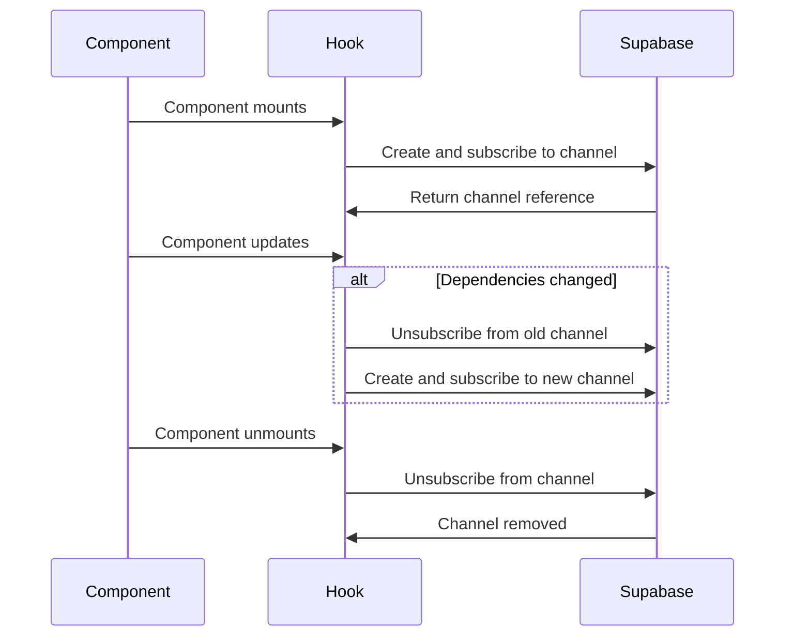
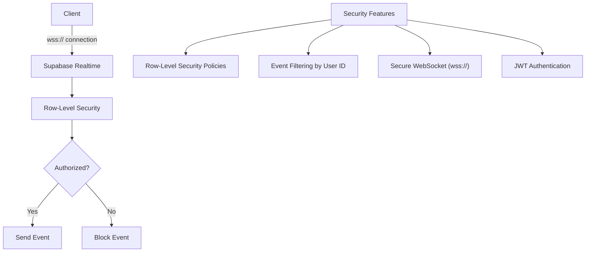
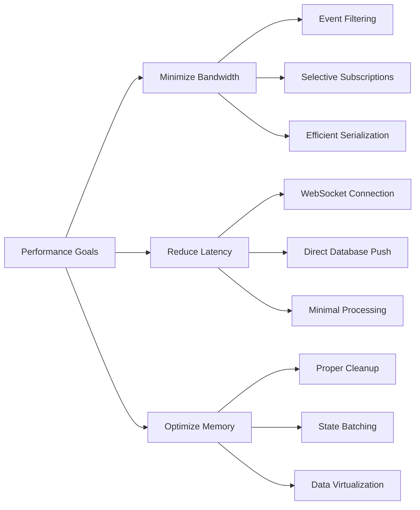
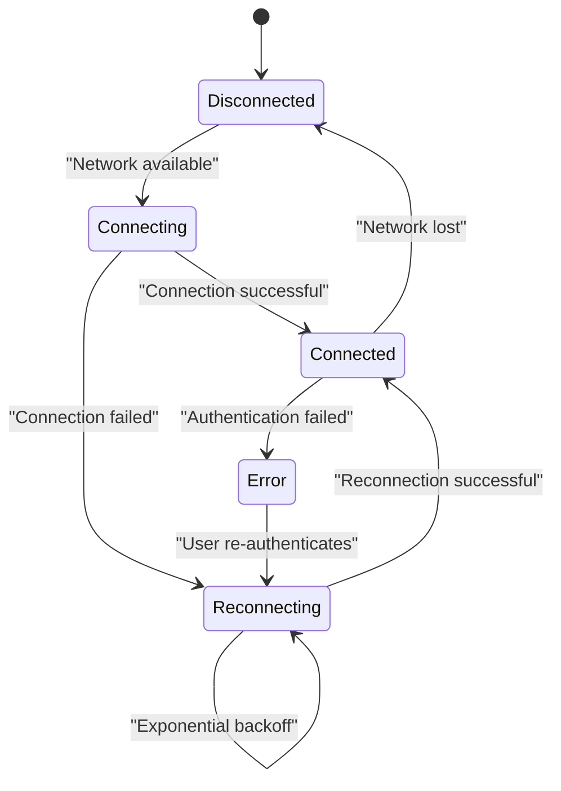

# Realtime Subscriptions

<cite>
**Referenced Files in This Document**   
- [useRealtimeMessages.ts](file://src/hooks/useRealtimeMessages.ts)
- [ProductionStageTimeline.tsx](file://src/components/production/ProductionStageTimeline.tsx)
- [NotificationCenter.tsx](file://src/components/NotificationCenter.tsx)
- [client.ts](file://src/integrations/supabase/client.ts)
- [supabaseHelpers.ts](file://src/lib/supabaseHelpers.ts)
- [database.ts](file://src/types/database.ts)
- [ProductionUpdatesFeed.tsx](file://src/components/ProductionUpdatesFeed.tsx)
- [useNotifications.ts](file://src/hooks/useNotifications.ts)
</cite>

## Table of Contents
1. [Introduction](#introduction)
2. [Realtime Architecture Overview](#realtime-architecture-overview)
3. [Core Subscription Patterns](#core-subscription-patterns)
4. [Critical Workflow Implementations](#critical-workflow-implementations)
5. [Custom Hook Integration](#custom-hook-integration)
6. [Channel and Event Filtering](#channel-and-event-filtering)
7. [Subscription Lifecycle Management](#subscription-lifecycle-management)
8. [Security Considerations](#security-considerations)
9. [Performance Optimization](#performance-optimization)
10. [Error Recovery and Reconnection](#error-recovery-and-reconnection)

## Introduction

The realtime subscription system in sleekapp-v100 enables seamless data synchronization between frontend and backend using Supabase's realtime capabilities. This architecture ensures that users receive immediate updates for critical production workflows, order status changes, and notifications without requiring manual page refreshes. The system is built on Supabase's PostgreSQL-backed realtime engine, which provides reliable, low-latency updates through WebSockets.

The implementation focuses on three primary use cases: production stage updates, order status changes, and notification delivery. Each of these workflows follows a consistent pattern of channel subscription, event filtering, and state management, while incorporating specific optimizations for their respective domains. The system leverages Supabase's row-level security policies to ensure data privacy and implements comprehensive error handling for network resilience.

**Section sources**
- [client.ts](file://src/integrations/supabase/client.ts#L1-L20)
- [database.ts](file://src/types/database.ts#L1-L579)

## Realtime Architecture Overview

The realtime architecture in sleekapp-v100 is built on Supabase's realtime engine, which establishes persistent WebSocket connections between the client and database. This enables bidirectional communication for immediate data synchronization. The architecture follows a publish-subscribe pattern where database changes are published to channels, and frontend components subscribe to relevant channels to receive updates.



**Diagram sources**
- [client.ts](file://src/integrations/supabase/client.ts#L1-L20)
- [supabaseHelpers.ts](file://src/lib/supabaseHelpers.ts#L1-L376)

**Section sources**
- [client.ts](file://src/integrations/supabase/client.ts#L1-L20)
- [supabaseHelpers.ts](file://src/lib/supabaseHelpers.ts#L1-L376)

## Core Subscription Patterns

The system implements several core subscription patterns for different data types and use cases. These patterns follow a consistent structure while incorporating specific optimizations for their respective domains.

### Production Stage Updates

Production stage updates are implemented through subscriptions to the `production_stages` table. The system enables realtime for this table by setting `REPLICA IDENTITY FULL` and adding it to the `supabase_realtime` publication. Components subscribe to changes filtered by `supplier_order_id`, allowing factories to receive updates specific to their assigned orders.

### Order Status Changes

Order status changes are tracked through the `order_updates` table, which is also enabled for realtime. The system uses event filtering to distinguish between INSERT and UPDATE operations, providing different user experiences for new updates versus modified ones. The filtering is implemented at the database level to minimize bandwidth usage.

### Notification Delivery

Notification delivery uses a dedicated `notifications` channel that subscribes to INSERT events on the `notifications` table. When a new notification is created, it is immediately pushed to the subscribed user's client, where it triggers both UI updates and toast notifications.



**Diagram sources**
- [ProductionUpdatesFeed.tsx](file://src/components/ProductionUpdatesFeed.tsx#L1-L240)
- [useRealtimeMessages.ts](file://src/hooks/useRealtimeMessages.ts#L1-L61)
- [NotificationCenter.tsx](file://src/components/NotificationCenter.tsx#L1-L173)

**Section sources**
- [ProductionUpdatesFeed.tsx](file://src/components/ProductionUpdatesFeed.tsx#L1-L240)
- [useRealtimeMessages.ts](file://src/hooks/useRealtimeMessages.ts#L1-L61)
- [NotificationCenter.tsx](file://src/components/NotificationCenter.tsx#L1-L173)

## Critical Workflow Implementations

### Production Stage Updates

The production stage update workflow is implemented in the `ProductionUpdatesFeed` component, which subscribes to changes in the `order_updates` table. The subscription uses a filter based on `order_id` to ensure that only relevant updates are received. When a new update is received, the system fetches the associated profile data and displays a toast notification with the stage name and completion percentage.



**Diagram sources**
- [ProductionUpdatesFeed.tsx](file://src/components/ProductionUpdatesFeed.tsx#L50-L131)
- [ProductionStageTimeline.tsx](file://src/components/production/ProductionStageTimeline.tsx#L1-L147)

**Section sources**
- [ProductionUpdatesFeed.tsx](file://src/components/ProductionUpdatesFeed.tsx#L1-L240)
- [ProductionStageTimeline.tsx](file://src/components/production/ProductionStageTimeline.tsx#L1-L147)

### Order Status Changes

Order status changes are implemented through direct subscriptions to the `production_stages` table. The `LoopTraceOrderTracking` component sets up a subscription that listens to all events (INSERT, UPDATE, DELETE) on production stages filtered by `supplier_order_id`. This allows buyers to track the progress of their orders in real-time, with immediate updates when stages are created or modified.

### Notification Delivery

The notification delivery system is implemented in the `NotificationCenter` component, which maintains a subscription to the `notifications` table. When a new notification is inserted, it is immediately added to the user's notification list and an unread count is incremented. The system also implements a toast notification for high-priority updates, ensuring users are aware of important changes even when not actively viewing the notification center.



**Diagram sources**
- [NotificationCenter.tsx](file://src/components/NotificationCenter.tsx#L42-L62)
- [useNotifications.ts](file://src/hooks/useNotifications.ts#L37-L58)

**Section sources**
- [NotificationCenter.tsx](file://src/components/NotificationCenter.tsx#L1-L173)
- [useNotifications.ts](file://src/hooks/useNotifications.ts#L1-L106)

## Custom Hook Integration

The `useRealtimeMessages` custom hook provides a reusable interface for subscribing to realtime message updates. This hook encapsulates the complexity of setting up and managing Supabase realtime channels, making it easy for components to integrate realtime functionality.



The hook follows React's best practices for custom hooks, using the `useEffect` hook to manage the subscription lifecycle. It automatically subscribes when the `userId` is available and unsubscribes when the component unmounts or when the `userId` changes. The hook also supports an optional `onNewMessage` callback, allowing components to respond to incoming messages.

**Diagram sources**
- [useRealtimeMessages.ts](file://src/hooks/useRealtimeMessages.ts#L17-L61)
- [ProductionStageTimeline.tsx](file://src/components/production/ProductionStageTimeline.tsx#L22-L147)

**Section sources**
- [useRealtimeMessages.ts](file://src/hooks/useRealtimeMessages.ts#L1-L61)
- [ProductionStageTimeline.tsx](file://src/components/production/ProductionStageTimeline.tsx#L1-L147)

## Channel and Event Filtering

The system implements sophisticated channel and event filtering strategies to minimize bandwidth usage and improve performance. These filters are applied at the database level through Supabase's realtime subscription API.

### Channel Naming Strategy

The system uses descriptive channel names that indicate their purpose:
- `realtime-messages` for direct messages
- `notifications` for user notifications
- `order-updates-changes` for order updates
- `production-stages-changes` for production stage updates

This naming convention makes it easy to identify the purpose of each channel and helps with debugging and monitoring.

### Event Filtering

Event filtering is implemented using Supabase's filter syntax, which allows specifying conditions that must be met for events to be delivered to the client. The system uses several filtering patterns:



The filtering reduces bandwidth usage by ensuring that only relevant events are transmitted to each client. For example, a user will only receive messages where they are the recipient, and a factory will only receive updates for their specific orders.

**Diagram sources**
- [useRealtimeMessages.ts](file://src/hooks/useRealtimeMessages.ts#L31-L32)
- [ProductionUpdatesFeed.tsx](file://src/components/ProductionUpdatesFeed.tsx#L63-L64)
- [NotificationCenter.tsx](file://src/components/NotificationCenter.tsx#L51-L52)

**Section sources**
- [useRealtimeMessages.ts](file://src/hooks/useRealtimeMessages.ts#L1-L61)
- [ProductionUpdatesFeed.tsx](file://src/components/ProductionUpdatesFeed.tsx#L1-L240)
- [NotificationCenter.tsx](file://src/components/NotificationCenter.tsx#L1-L173)

## Subscription Lifecycle Management

The system implements robust subscription lifecycle management to ensure proper resource cleanup and prevent memory leaks. Each subscription is tied to the component lifecycle using React's `useEffect` hook.

### Subscription Creation

Subscriptions are created within `useEffect` hooks, ensuring they are established when the component mounts. The effect dependencies include the relevant identifiers (user ID, order ID, etc.) so that subscriptions are automatically recreated when these values change.

### Subscription Cleanup

All subscriptions include cleanup functions that unsubscribe from the channel when the component unmounts or when dependencies change. This prevents memory leaks and ensures that stale subscriptions do not consume server resources.



The cleanup is implemented using the return function from `useEffect`, which is called when the component unmounts or when the effect dependencies change. This ensures that subscriptions are properly cleaned up in all scenarios.

**Diagram sources**
- [useRealtimeMessages.ts](file://src/hooks/useRealtimeMessages.ts#L55-L57)
- [ProductionUpdatesFeed.tsx](file://src/components/ProductionUpdatesFeed.tsx#L127-L130)
- [NotificationCenter.tsx](file://src/components/NotificationCenter.tsx#L59-L61)

**Section sources**
- [useRealtimeMessages.ts](file://src/hooks/useRealtimeMessages.ts#L1-L61)
- [ProductionUpdatesFeed.tsx](file://src/components/ProductionUpdatesFeed.tsx#L1-L240)
- [NotificationCenter.tsx](file://src/components/NotificationCenter.tsx#L1-L173)

## Security Considerations

The realtime subscription system incorporates several security measures to protect user data and prevent unauthorized access.

### Row-Level Security

The system leverages Supabase's row-level security (RLS) policies to ensure that users can only access data they are authorized to see. These policies are defined at the database level and enforced for all realtime subscriptions.

For example, the `messages` table has an RLS policy that requires the current user to be either the sender or recipient:
```sql
CREATE POLICY "Users can read their messages"
  ON messages FOR SELECT
  USING (auth.uid() = sender_id OR auth.uid() = recipient_id);
```

### Subscription Authorization

Subscription authorization is implemented through event filtering, which ensures that clients only receive events for data they are permitted to access. The filtering is done at the database level, preventing unauthorized data from being transmitted over the network.

### Secure Channel Management

The system uses secure WebSocket connections (wss://) for all realtime communication, ensuring that data is encrypted in transit. The Supabase client automatically handles the secure connection setup using the project's API keys.



**Diagram sources**
- [useRealtimeMessages.ts](file://src/hooks/useRealtimeMessages.ts#L31-L32)
- [supabaseHelpers.ts](file://src/lib/supabaseHelpers.ts#L1-L376)
- [database.ts](file://src/types/database.ts#L1-L579)

**Section sources**
- [useRealtimeMessages.ts](file://src/hooks/useRealtimeMessages.ts#L1-L61)
- [supabaseHelpers.ts](file://src/lib/supabaseHelpers.ts#L1-L376)
- [database.ts](file://src/types/database.ts#L1-L579)

## Performance Optimization

The system implements several performance optimizations to handle high-frequency updates and manage memory efficiently.

### Bandwidth Optimization

The system minimizes bandwidth usage through:
- Event filtering at the database level
- Selective subscription to specific event types
- Efficient data serialization

### Memory Management

Memory management is handled through proper subscription cleanup and state management:
- All subscriptions are unsubscribed when components unmount
- State updates are batched to minimize re-renders
- Large datasets are paginated or virtualized



The system also implements debouncing for high-frequency updates and uses React's memoization techniques to prevent unnecessary re-renders when the subscription state changes.

**Diagram sources**
- [ProductionUpdatesFeed.tsx](file://src/components/ProductionUpdatesFeed.tsx#L46-L131)
- [useRealtimeMessages.ts](file://src/hooks/useRealtimeMessages.ts#L20-L58)
- [NotificationCenter.tsx](file://src/components/NotificationCenter.tsx#L22-L62)

**Section sources**
- [ProductionUpdatesFeed.tsx](file://src/components/ProductionUpdatesFeed.tsx#L1-L240)
- [useRealtimeMessages.ts](file://src/hooks/useRealtimeMessages.ts#L1-L61)
- [NotificationCenter.tsx](file://src/components/NotificationCenter.tsx#L1-L173)

## Error Recovery and Reconnection

The system implements robust error recovery and reconnection logic to handle network interruptions and server issues.

### Automatic Reconnection

Supabase's realtime client automatically attempts to reconnect when the WebSocket connection is lost. The reconnection follows an exponential backoff strategy to prevent overwhelming the server.

### Error Handling

The system implements comprehensive error handling for subscription failures:
- Network errors trigger automatic reconnection attempts
- Authentication errors prompt user re-authentication
- Server errors are logged and reported to monitoring systems



The system also implements local state preservation during reconnection, ensuring that user interface state is maintained even when the realtime connection is temporarily lost.

**Diagram sources**
- [client.ts](file://src/integrations/supabase/client.ts#L14-L20)
- [useRealtimeMessages.ts](file://src/hooks/useRealtimeMessages.ts#L20-L58)
- [ProductionUpdatesFeed.tsx](file://src/components/ProductionUpdatesFeed.tsx#L46-L131)

**Section sources**
- [client.ts](file://src/integrations/supabase/client.ts#L1-L20)
- [useRealtimeMessages.ts](file://src/hooks/useRealtimeMessages.ts#L1-L61)
- [ProductionUpdatesFeed.tsx](file://src/components/ProductionUpdatesFeed.tsx#L1-L240)