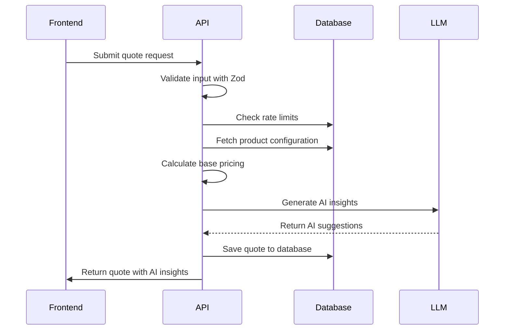
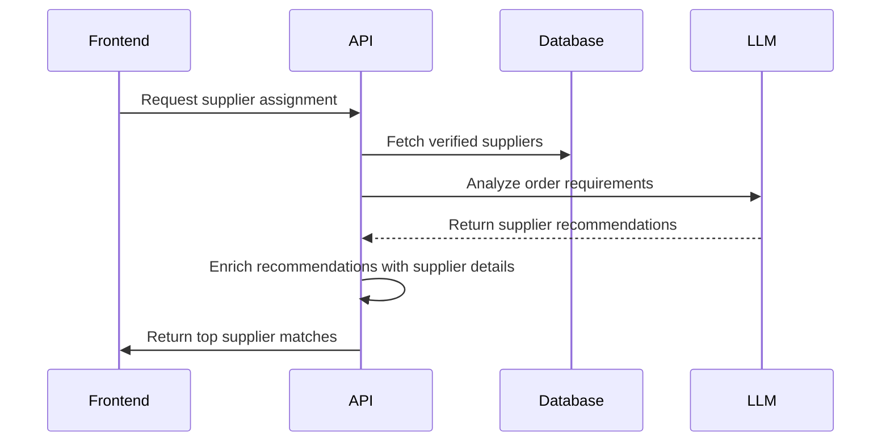
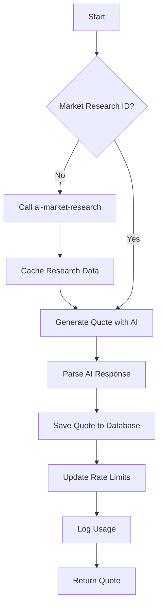
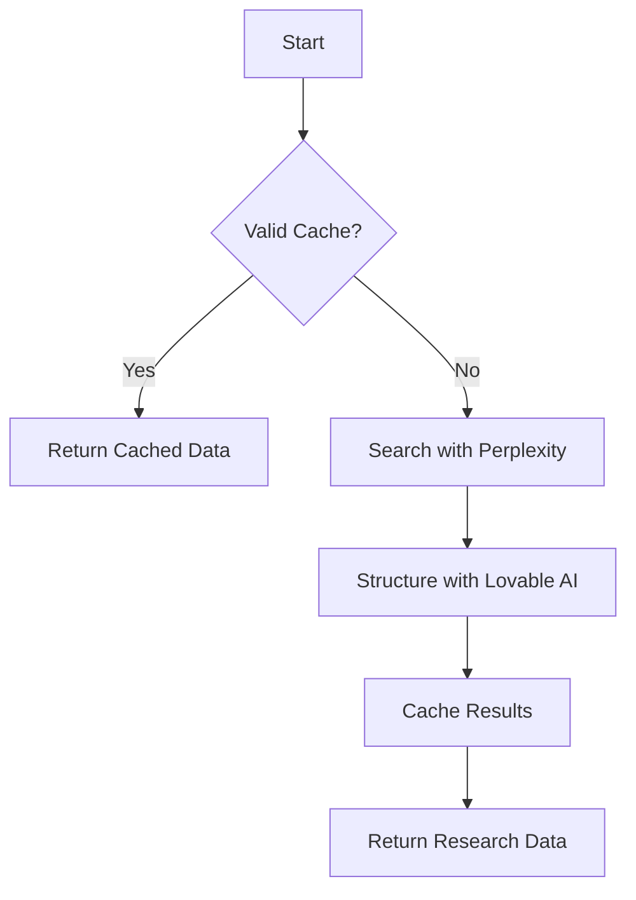
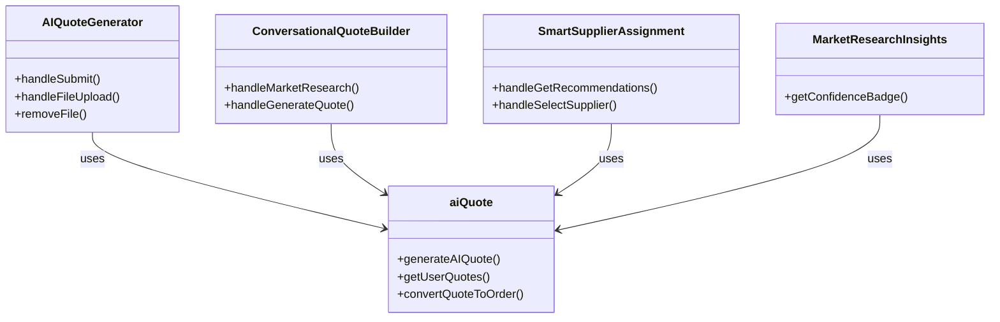
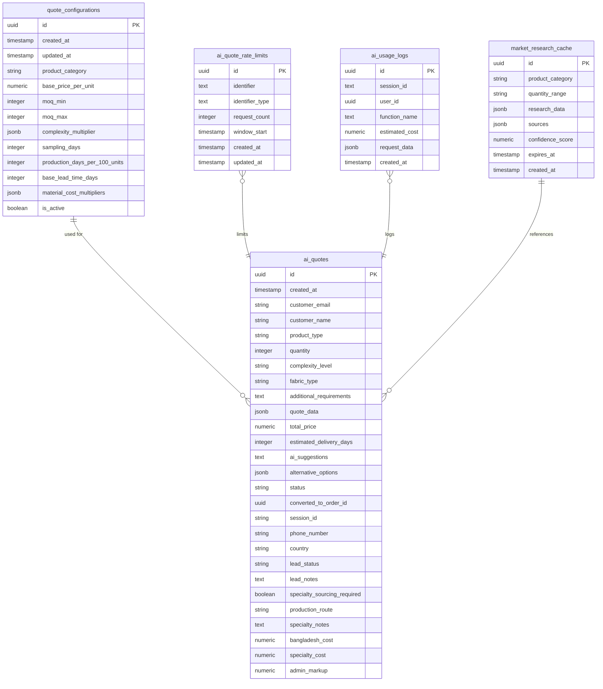
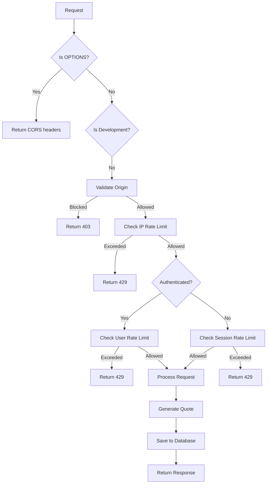
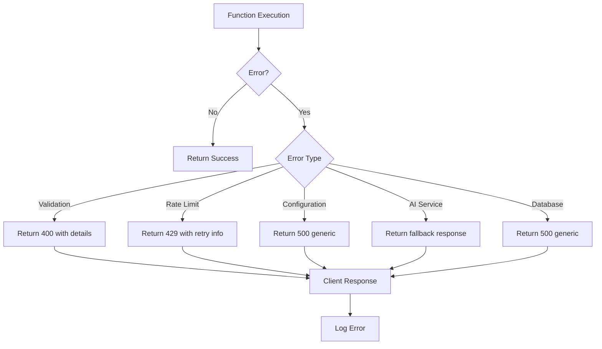

# AI-Powered Functions

<cite>
**Referenced Files in This Document**   
- [ai-quote-generator/index.ts](file://supabase/functions/ai-quote-generator/index.ts)
- [ai-supplier-assignment/index.ts](file://supabase/functions/ai-supplier-assignment/index.ts)
- [ai-conversational-quote/index.ts](file://supabase/functions/ai-conversational-quote/index.ts)
- [ai-market-research/index.ts](file://supabase/functions/ai-market-research/index.ts)
- [AIQuoteGenerator.tsx](file://src/components/AIQuoteGenerator.tsx)
- [ConversationalQuoteBuilder.tsx](file://src/components/quote/ConversationalQuoteBuilder.tsx)
- [SmartSupplierAssignment.tsx](file://src/components/admin/SmartSupplierAssignment.tsx)
- [MarketResearchInsights.tsx](file://src/components/quote/MarketResearchInsights.tsx)
- [aiQuote.ts](file://src/lib/api/aiQuote.ts)
- [BASE_MIGRATION_SAFE.sql](file://supabase/BASE_MIGRATION_SAFE.sql)
</cite>

## Table of Contents
1. [Introduction](#introduction)
2. [Core AI Functions](#core-ai-functions)
3. [ai-quote-generator Implementation](#ai-quote-generator-implementation)
4. [ai-supplier-assignment Implementation](#ai-supplier-assignment-implementation)
5. [ai-conversational-quote Implementation](#ai-conversational-quote-implementation)
6. [ai-market-research Implementation](#ai-market-research-implementation)
7. [Frontend Integration](#frontend-integration)
8. [Data Storage and Caching](#data-storage-and-caching)
9. [Rate Limiting and Security](#rate-limiting-and-security)
10. [Error Handling and Monitoring](#error-handling-and-monitoring)
11. [Testing and Optimization](#testing-and-optimization)

## Introduction
The sleekapp-v100 platform features a sophisticated suite of AI-powered serverless functions that streamline the apparel manufacturing quotation and supplier assignment process. These functions leverage advanced language models, market data analysis, and intelligent algorithms to provide accurate pricing, optimal supplier recommendations, and comprehensive market intelligence. The system is designed to handle natural language product descriptions, generate intelligent pricing based on market conditions, and recommend the best suppliers based on capability matching. This documentation provides a comprehensive overview of the implementation details, integration patterns, and operational considerations for these AI functions.

## Core AI Functions
The AI ecosystem in sleekapp-v100 consists of four primary serverless functions that work together to provide a comprehensive quoting and supplier management solution:

1. **ai-quote-generator**: Processes natural language product descriptions and generates intelligent pricing using market data and manufacturing cost calculations
2. **ai-supplier-assignment**: Uses capability matching algorithms to recommend optimal suppliers based on order requirements and supplier capabilities
3. **ai-conversational-quote**: Facilitates step-by-step quote building through a conversational interface, gathering requirements incrementally
4. **ai-market-research**: Conducts competitive intelligence gathering by analyzing current market prices and trends

These functions are implemented as serverless Deno functions in Supabase, allowing for scalable execution and seamless integration with the platform's database and authentication systems. The functions are designed to work independently but can be chained together to create a comprehensive workflow for quote generation and supplier assignment.

**Section sources**
- [ai-quote-generator/index.ts](file://supabase/functions/ai-quote-generator/index.ts)
- [ai-supplier-assignment/index.ts](file://supabase/functions/ai-supplier-assignment/index.ts)
- [ai-conversational-quote/index.ts](file://supabase/functions/ai-conversational-quote/index.ts)
- [ai-market-research/index.ts](file://supabase/functions/ai-market-research/index.ts)

## ai-quote-generator Implementation
The ai-quote-generator function processes natural language product descriptions and generates intelligent pricing using market data and manufacturing cost calculations. The implementation follows a structured approach that combines rule-based pricing with AI-powered insights.

The function begins with comprehensive input validation using Zod schema validation to ensure all required fields are present and properly formatted. The validation schema requires a product type, quantity (minimum 50 units), and customer email, with optional fields for complexity level, fabric type, and additional requirements.

**Diagram sources **
- [ai-quote-generator/index.ts](file://supabase/functions/ai-quote-generator/index.ts)
- [AIQuoteGenerator.tsx](file://src/components/AIQuoteGenerator.tsx)

The pricing calculation follows a multi-step process:
1. Fetch the active configuration for the product type from the quote_configurations table
2. Calculate the base unit price based on the product category and complexity level
3. Apply volume discounts based on the requested quantity
4. Calculate the production timeline based on sampling days and production days per 100 units

The function integrates with the Lovable AI service (using Google's Gemini models) to generate professional manufacturing recommendations. When design files are uploaded, the system uses the more powerful Gemini 2.5 Pro model for visual analysis; otherwise, it uses the faster Gemini 2.5 Flash model for text-based analysis.

The AI prompt engineering is carefully crafted to provide context about Bangladesh manufacturing standards, including MOQ requirements, base costs for different product types, and lead times. The prompt also includes specific instructions for the AI to provide actionable recommendations in a structured format.

**Section sources**
- [ai-quote-generator/index.ts](file://supabase/functions/ai-quote-generator/index.ts)
- [AIQuoteGenerator.tsx](file://src/components/AIQuoteGenerator.tsx)
- [aiQuote.ts](file://src/lib/api/aiQuote.ts)

## ai-supplier-assignment Implementation
The ai-supplier-assignment function uses capability matching algorithms to recommend optimal suppliers based on order requirements and supplier capabilities. The implementation leverages AI to analyze supplier profiles and match them with order requirements.

The function begins by fetching all verified and active suppliers from the database, including their specializations, monthly capacity, performance score, and lead time. This data is then presented to the Lovable AI service with a structured prompt that asks the AI to recommend the top three suppliers based on specialization match, capacity, performance score, lead time, and overall fit.

**Diagram sources **
- [ai-supplier-assignment/index.ts](file://supabase/functions/ai-supplier-assignment/index.ts)
- [SmartSupplierAssignment.tsx](file://src/components/admin/SmartSupplierAssignment.tsx)

The AI integration uses function calling to ensure structured output. The function defines a "recommend_suppliers" function with a specific schema that requires supplier_id, rank, confidence_score, and reasoning for each recommendation. This ensures consistent output that can be easily parsed and displayed in the frontend.

The frontend component (SmartSupplierAssignment) provides an intuitive interface for administrators to view AI-generated supplier recommendations. Each recommendation displays the supplier name, confidence score, and AI reasoning, along with key metrics like monthly capacity, performance score, and lead time. Administrators can then select a supplier to assign to the order.

The implementation includes error handling for cases where the AI service is unavailable, falling back to a default response that informs the user of the temporary issue while maintaining system functionality.

**Section sources**
- [ai-supplier-assignment/index.ts](file://supabase/functions/ai-supplier-assignment/index.ts)
- [SmartSupplierAssignment.tsx](file://src/components/admin/SmartSupplierAssignment.tsx)

## ai-conversational-quote Implementation
The ai-conversational-quote function facilitates step-by-step quote building through a conversational interface, gathering requirements incrementally. This implementation provides a guided experience that helps users provide all necessary information for an accurate quote.

The function follows a multi-step process:
1. Validate input and check rate limits
2. If no market research ID is provided, call the ai-market-research function to gather current market data
3. Use the Lovable AI service to generate a comprehensive quote based on the market research and customer requirements
4. Save the quote to the database and return it to the frontend

**Diagram sources **
- [ai-conversational-quote/index.ts](file://supabase/functions/ai-conversational-quote/index.ts)
- [ConversationalQuoteBuilder.tsx](file://src/components/quote/ConversationalQuoteBuilder.tsx)

The AI prompt is specifically designed to return valid JSON with a predefined structure, including unit price, total price, estimated delivery days, price breakdown, confidence score, price justification, comparable products, and suggestions. The function includes robust parsing logic to handle cases where the AI response includes markdown code blocks or other formatting.

The frontend implementation (ConversationalQuoteBuilder) provides a three-step wizard interface:
1. Product details collection
2. Market research results display with contact information collection
3. Final quote display with interactive elements

This step-by-step approach reduces cognitive load on the user and ensures all necessary information is collected for an accurate quote.

**Section sources**
- [ai-conversational-quote/index.ts](file://supabase/functions/ai-conversational-quote/index.ts)
- [ConversationalQuoteBuilder.tsx](file://src/components/quote/ConversationalQuoteBuilder.tsx)

## ai-market-research Implementation
The ai-market-research function conducts competitive intelligence gathering by analyzing current market prices and trends. This implementation combines web search capabilities with AI-powered data structuring to provide accurate market insights.

The function follows a caching-first approach to optimize performance and reduce costs:
1. Check for cached research data based on product category and quantity range
2. If cached data is available and not expired, return it immediately
3. If no valid cache entry exists, perform a web search using the Perplexity API
4. Use the Lovable AI service to structure the research data into a consistent JSON format
5. Cache the results for 24 hours

**Diagram sources **
- [ai-market-research/index.ts](file://supabase/functions/ai-market-research/index.ts)
- [MarketResearchInsights.tsx](file://src/components/quote/MarketResearchInsights.tsx)

The Perplexity search query is carefully constructed to include specific product details, quantity, fabric type, complexity, and additional requirements. The system prompt instructs the AI to provide detailed, factual pricing data with sources and to cite specific sources and dates.

The Lovable AI service is then used to parse the research content into a structured JSON format with fields for average unit cost, material cost per unit, lead time days, markup percentage, comparable products, sources, and confidence score. This structured data is then cached in the market_research_cache table for future use.

The frontend component (MarketResearchInsights) displays the research data in an attractive card format with key metrics, comparable products, and data sources. The confidence score is visually represented with color-coded badges to help users assess the reliability of the data.

**Section sources**
- [ai-market-research/index.ts](file://supabase/functions/ai-market-research/index.ts)
- [MarketResearchInsights.tsx](file://src/components/quote/MarketResearchInsights.tsx)

## Frontend Integration
The AI functions are integrated with the frontend through a combination of Supabase client functions and custom API wrappers. The integration follows a clean separation of concerns, with dedicated components for each AI functionality.

The primary integration point is the aiQuote.ts API module, which provides a clean interface for generating AI quotes. This module handles session management, error handling, and response parsing, abstracting the complexity of the underlying serverless functions.

**Diagram sources **
- [AIQuoteGenerator.tsx](file://src/components/AIQuoteGenerator.tsx)
- [ConversationalQuoteBuilder.tsx](file://src/components/quote/ConversationalQuoteBuilder.tsx)
- [SmartSupplierAssignment.tsx](file://src/components/admin/SmartSupplierAssignment.tsx)
- [MarketResearchInsights.tsx](file://src/components/quote/MarketResearchInsights.tsx)
- [aiQuote.ts](file://src/lib/api/aiQuote.ts)

The AIQuoteGenerator component provides a comprehensive form for submitting quote requests, including support for file uploads (images and PDFs) that are converted to base64 for transmission to the AI service. The component includes client-side validation using Zod to provide immediate feedback to users.

The ConversationalQuoteBuilder implements a step-by-step wizard that guides users through the quote generation process, starting with product details, then displaying market research results, and finally showing the generated quote. This approach reduces user friction and ensures all necessary information is collected.

All components use the Supabase toast system to provide user feedback on success and error conditions, with appropriate messaging for different scenarios.

**Section sources**
- [AIQuoteGenerator.tsx](file://src/components/AIQuoteGenerator.tsx)
- [ConversationalQuoteBuilder.tsx](file://src/components/quote/ConversationalQuoteBuilder.tsx)
- [SmartSupplierAssignment.tsx](file://src/components/admin/SmartSupplierAssignment.tsx)
- [MarketResearchInsights.tsx](file://src/components/quote/MarketResearchInsights.tsx)
- [aiQuote.ts](file://src/lib/api/aiQuote.ts)

## Data Storage and Caching
The AI functions leverage Supabase's PostgreSQL database for persistent storage and caching of AI-generated results. The database schema includes specialized tables for AI usage tracking, rate limiting, and research caching.

The quote_configurations table stores product-specific pricing rules, including base price per unit, MOQ ranges, complexity multipliers, and production timelines. This table is used by the ai-quote-generator function to calculate base pricing before applying AI-powered adjustments.

**Diagram sources **
- [BASE_MIGRATION_SAFE.sql](file://supabase/BASE_MIGRATION_SAFE.sql)

The ai_quotes table stores all generated quotes, including the calculated pricing, timeline, and AI-generated suggestions. The table includes fields for both structured data (in JSONB format) and plain text AI insights.

The ai_quote_rate_limits table implements rate limiting at multiple levels: by IP address, by user account, and by anonymous session. This tiered approach allows authenticated users higher limits while preventing abuse from anonymous users.

The ai_usage_logs table tracks AI usage for cost optimization and monitoring purposes. Each log entry includes the function name, estimated cost, and request data, enabling detailed analysis of AI service usage patterns.

The market_research_cache table implements a time-based caching strategy with a 24-hour expiration period. Research data is cached based on product category and quantity range to maximize cache hit rates while maintaining data freshness.

**Section sources**
- [BASE_MIGRATION_SAFE.sql](file://supabase/BASE_MIGRATION_SAFE.sql)
- [ai-quote-generator/index.ts](file://supabase/functions/ai-quote-generator/index.ts)
- [ai-market-research/index.ts](file://supabase/functions/ai-market-research/index.ts)

## Rate Limiting and Security
The AI functions implement comprehensive rate limiting and security measures to protect against abuse and ensure fair usage. The rate limiting strategy is tiered, with different limits for different types of users and identifiers.

The system implements three levels of rate limiting:
1. IP-based limiting: 15 quotes per IP per day
2. Session-based limiting: 3 quotes per day for anonymous users
3. User-based limiting: 20 quotes per day for authenticated users

**Diagram sources **
- [ai-quote-generator/index.ts](file://supabase/functions/ai-quote-generator/index.ts)

The security implementation includes origin validation to prevent unauthorized domains from accessing the AI functions. The system checks both the Origin and Referer headers against a whitelist of allowed domains, including the production site, localhost for development, and common hosting platforms.

The functions validate environment variables at startup and return generic error messages to clients while logging specific error codes for debugging. This approach prevents information disclosure while maintaining debuggability.

Input validation is performed using Zod schemas on both the frontend and backend to ensure data integrity and prevent injection attacks. The backend validation is comprehensive, with specific error messages for different validation failures.

The system uses Supabase's service role key for database operations, bypassing Row Level Security to ensure the functions can access the necessary data. This is secured by the function's authentication requirements and rate limiting.

**Section sources**
- [ai-quote-generator/index.ts](file://supabase/functions/ai-quote-generator/index.ts)
- [AIQuoteGenerator.tsx](file://src/components/AIQuoteGenerator.tsx)

## Error Handling and Monitoring
The AI functions implement robust error handling and monitoring to ensure reliability and provide insights into system performance. The error handling strategy follows a fail-open approach for non-critical failures while maintaining security for critical operations.

The functions use structured error responses with consistent formats that include error messages, error codes, and request IDs for debugging. Client-facing error messages are generic to prevent information disclosure, while detailed error information is logged server-side.

**Diagram sources **
- [ai-quote-generator/index.ts](file://supabase/functions/ai-quote-generator/index.ts)
- [ai-supplier-assignment/index.ts](file://supabase/functions/ai-supplier-assignment/index.ts)

The monitoring implementation includes:
1. AI usage logging with estimated costs and request data
2. Comprehensive server-side logging with request IDs for tracing
3. Health check endpoints for monitoring function availability
4. Structured error logging with context

The ai_usage_logs table tracks the cost of AI service usage, enabling cost optimization analysis. Each log entry includes the function name, estimated cost, and request data, allowing for detailed analysis of usage patterns and cost drivers.

The functions include health check endpoints that verify database connectivity, allowing monitoring systems to detect issues before they affect users. The health check returns a simple status response that can be easily integrated with monitoring tools.

Client-side error handling is implemented using the Supabase toast system, providing user-friendly feedback for different error scenarios. Validation errors display specific field-level messages, while system errors show generic messages with support contact information.

**Section sources**
- [ai-quote-generator/index.ts](file://supabase/functions/ai-quote-generator/index.ts)
- [ai-supplier-assignment/index.ts](file://supabase/functions/ai-supplier-assignment/index.ts)
- [ai-conversational-quote/index.ts](file://supabase/functions/ai-conversational-quote/index.ts)
- [AIQuoteGenerator.tsx](file://src/components/AIQuoteGenerator.tsx)

## Testing and Optimization
The AI functions are designed with testing and optimization in mind, incorporating strategies for cost reduction, performance improvement, and reliability.

The system implements several optimization techniques:
1. Caching of market research data to reduce AI service calls
2. Tiered rate limiting to prevent abuse while allowing fair usage
3. Selective model usage (Gemini Flash for text, Gemini Pro for images)
4. Input sanitization to reduce prompt length and processing time

For testing, the system can be tested with mock responses by:
1. Temporarily modifying the AI service URL to point to a mock server
2. Using the fallback responses in the error handling code
3. Testing with invalid API keys to trigger the fail-open behavior
4. Using the health check endpoint to verify basic functionality

Performance monitoring is facilitated by the ai_usage_logs table, which tracks the cost and frequency of AI service usage. This data can be analyzed to identify optimization opportunities and track the impact of performance improvements.

The functions are designed to be resilient to external service failures, with appropriate fallback responses and error handling. This ensures that temporary issues with the AI services do not completely disrupt the user experience.

**Section sources**
- [ai-quote-generator/index.ts](file://supabase/functions/ai-quote-generator/index.ts)
- [ai-market-research/index.ts](file://supabase/functions/ai-market-research/index.ts)
- [ai_usage_logs](file://supabase/BASE_MIGRATION_SAFE.sql#L807-L815)