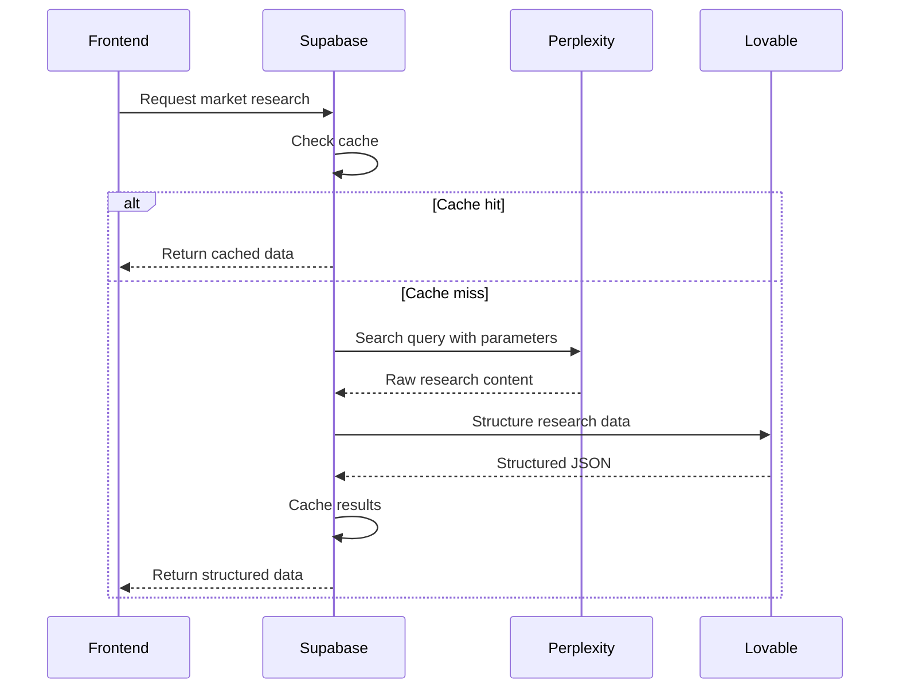
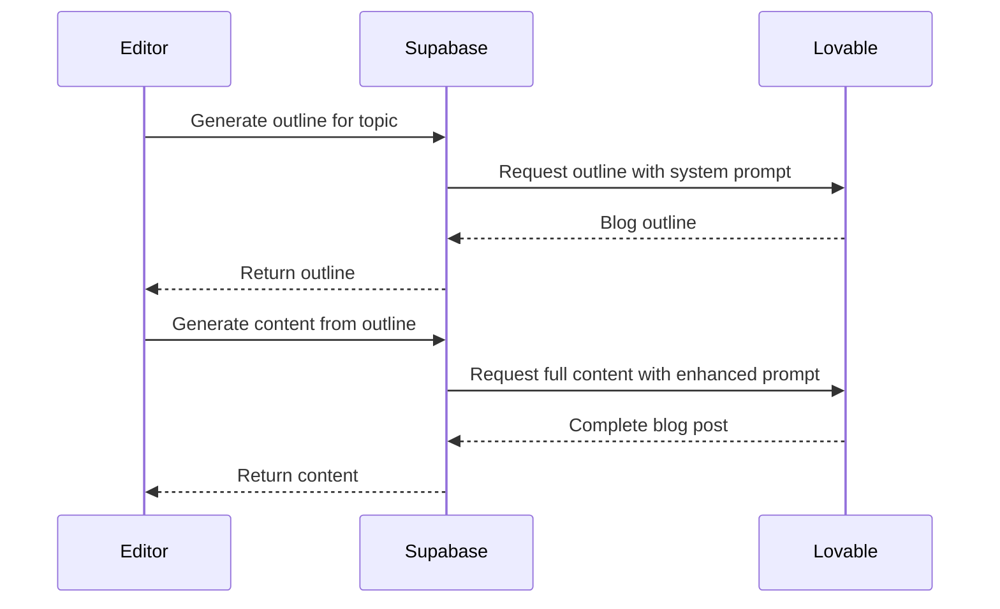
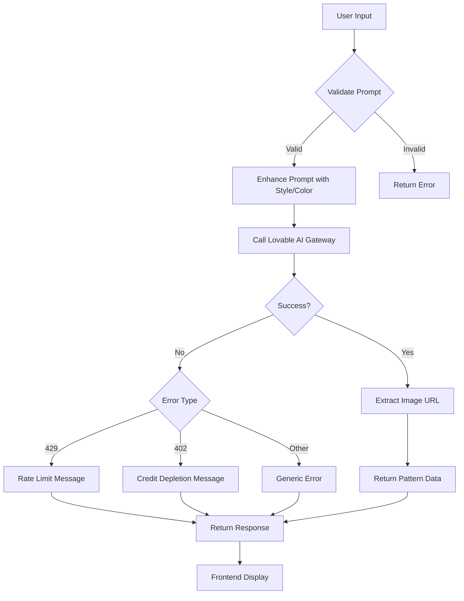
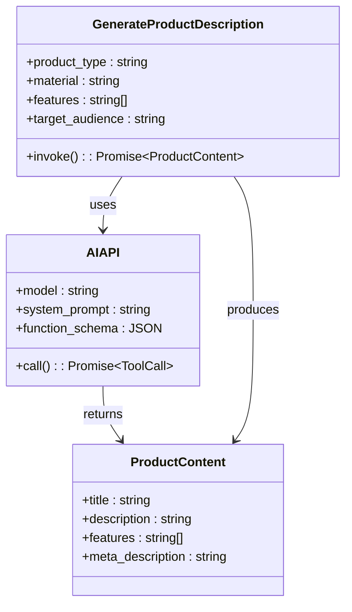
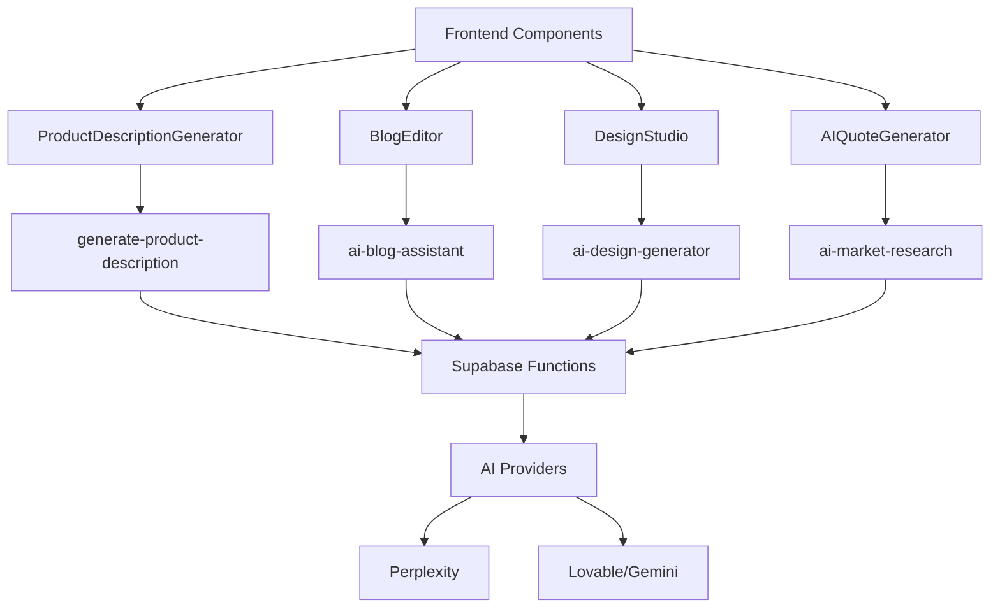
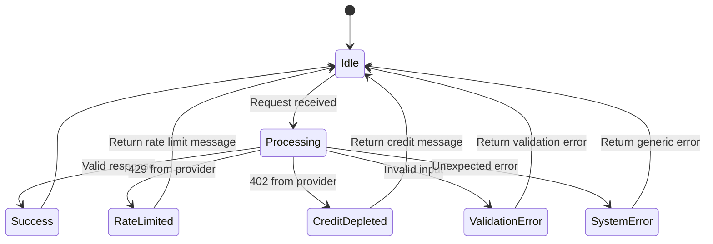
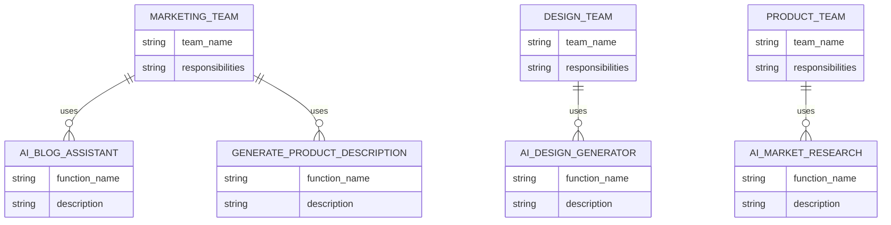

# Auxiliary AI Tools

<cite>
**Referenced Files in This Document**   
- [ai-market-research/index.ts](file://supabase/functions/ai-market-research/index.ts)
- [ai-blog-assistant/index.ts](file://supabase/functions/ai-blog-assistant/index.ts)
- [ai-design-generator/index.ts](file://supabase/functions/ai-design-generator/index.ts)
- [generate-product-description/index.ts](file://supabase/functions/generate-product-description/index.ts)
- [ProductDescriptionGenerator.tsx](file://src/components/admin/ProductDescriptionGenerator.tsx)
- [BlogEditor.tsx](file://src/components/blog/BlogEditor.tsx)
- [DesignStudio.tsx](file://src/pages/DesignStudio.tsx)
- [MarketResearchInsights.tsx](file://src/components/quote/MarketResearchInsights.tsx)
- [AIQuoteGenerator.tsx](file://src/components/AIQuoteGenerator.tsx)
- [RateLimitMonitoringDashboard.tsx](file://src/components/admin/RateLimitMonitoringDashboard.tsx)
</cite>

## Table of Contents
1. [Introduction](#introduction)
2. [AI Market Research](#ai-market-research)
3. [AI Blog Assistant](#ai-blog-assistant)
4. [AI Design Generator](#ai-design-generator)
5. [Generate Product Description](#generate-product-description)
6. [Frontend Integration](#frontend-integration)
7. [Error Handling and Rate Limiting](#error-handling-and-rate-limiting)
8. [Integration Points](#integration-points)
9. [Best Practices](#best-practices)
10. [Conclusion](#conclusion)

## Introduction
This document provides comprehensive documentation for the auxiliary AI tools that enhance productivity across the Sleek Apparels platform. These tools leverage advanced AI capabilities to streamline market research, content creation, design generation, and product description generation. The system integrates with various components across marketing, design, and product teams, providing intelligent automation while maintaining robust error handling and rate limiting strategies.

**Section sources**
- [ai-market-research/index.ts](file://supabase/functions/ai-market-research/index.ts)
- [ai-blog-assistant/index.ts](file://supabase/functions/ai-blog-assistant/index.ts)

## AI Market Research
The ai-market-research tool gathers competitive intelligence by analyzing market trends, pricing benchmarks, and production costs. It uses Perplexity AI to perform web searches for current manufacturing costs in Bangladesh, then structures the data using Lovable AI.

The tool implements a sophisticated caching mechanism to optimize API usage and costs. Research data is cached based on product category and quantity range (0-100, 101-500, 501-1000, 1000+), with a 24-hour validity period. This reduces redundant API calls and associated costs.

The implementation includes rate limiting at 10 requests per hour per IP address, preventing abuse while allowing legitimate usage. The system logs usage and estimated costs for monitoring and optimization.

**Diagram sources**
- [ai-market-research/index.ts](file://supabase/functions/ai-market-research/index.ts)

**Section sources**
- [ai-market-research/index.ts](file://supabase/functions/ai-market-research/index.ts)
- [MarketResearchInsights.tsx](file://src/components/quote/MarketResearchInsights.tsx)

## AI Blog Assistant
The ai-blog-assistant generates SEO-optimized blog content and outlines using structured prompts and Gemini integration. It follows a two-phase workflow: first generating an outline, then creating full content based on that outline.

The tool uses different Gemini models for different tasks: gemini-2.5-flash for outline generation and gemini-2.5-pro for full content creation, optimizing both performance and cost. The system accepts actions for "generate_outline" and "write_content", allowing for a progressive content creation workflow.

The implementation includes comprehensive error handling and logging, ensuring reliability even when AI services experience issues.

**Diagram sources**
- [ai-blog-assistant/index.ts](file://supabase/functions/ai-blog-assistant/index.ts)

**Section sources**
- [ai-blog-assistant/index.ts](file://supabase/functions/ai-blog-assistant/index.ts)
- [BlogEditor.tsx](file://src/components/blog/BlogEditor.tsx)

## AI Design Generator
The ai-design-generator creates print-ready garment designs from text prompts, integrating seamlessly with the Design Studio UI. Users can provide style preferences and color palettes to guide the design generation process.

The tool enhances user prompts with additional context about print readiness, screen printing suitability, and commercial quality requirements. It uses the gemini-2.5-flash-image-preview model through the Lovable AI Gateway to generate high-quality images.

The implementation includes validation for prompt quality (minimum 10 characters) and handles various error conditions, including rate limiting (429) and credit depletion (402). The system returns structured pattern data including the generated image URL and user preferences.

**Diagram sources**
- [ai-design-generator/index.ts](file://supabase/functions/ai-design-generator/index.ts)

**Section sources**
- [ai-design-generator/index.ts](file://supabase/functions/ai-design-generator/index.ts)
- [DesignStudio.tsx](file://src/pages/DesignStudio.tsx)

## Generate Product Description
The generate-product-description function produces compelling product titles, features, and meta descriptions using function calling to ensure structured output. It leverages Gemini's function calling capability to guarantee consistent, parseable responses.

The tool accepts parameters for product type, material, features, and target audience, then generates four structured components: product title, full description, feature bullet points, and meta description. The system uses a function schema to enforce the required structure, making the output reliable for downstream processing.

The implementation includes fallback mechanisms to handle parsing errors, ensuring that even if JSON parsing fails, the system can still provide useful content.

**Diagram sources**
- [generate-product-description/index.ts](file://supabase/functions/generate-product-description/index.ts)

**Section sources**
- [generate-product-description/index.ts](file://supabase/functions/generate-product-description/index.ts)
- [ProductDescriptionGenerator.tsx](file://src/components/admin/ProductDescriptionGenerator.tsx)

## Frontend Integration
The AI tools are integrated into various frontend components, providing seamless user experiences across the platform. Each tool follows a consistent pattern of invocation, loading states, and result presentation.

The ProductDescriptionGenerator component allows marketing teams to generate SEO-optimized product descriptions with a simple form interface. The BlogEditor integrates AI assistance directly into the content creation workflow, with dedicated buttons for outline generation and content writing.

The DesignStudio page provides a comprehensive design environment where users can generate AI designs, add text overlays, or upload their own images, all within a unified interface.

**Diagram sources**
- [ProductDescriptionGenerator.tsx](file://src/components/admin/ProductDescriptionGenerator.tsx)
- [BlogEditor.tsx](file://src/components/blog/BlogEditor.tsx)
- [DesignStudio.tsx](file://src/pages/DesignStudio.tsx)

**Section sources**
- [ProductDescriptionGenerator.tsx](file://src/components/admin/ProductDescriptionGenerator.tsx)
- [BlogEditor.tsx](file://src/components/blog/BlogEditor.tsx)
- [DesignStudio.tsx](file://src/pages/DesignStudio.tsx)

## Error Handling and Rate Limiting
The AI tools implement comprehensive error handling and rate limiting strategies to ensure system reliability and prevent abuse. Each function includes try-catch blocks to handle unexpected errors gracefully, returning appropriate HTTP status codes and user-friendly messages.

Rate limiting is implemented at multiple levels. The ai-market-research function limits requests to 10 per hour per IP address, while the ai-design-generator handles rate limit responses from the AI provider (429 status). The system also monitors credit availability (402 status) to prevent service disruption.

A dedicated RateLimitMonitoringDashboard provides real-time visibility into usage patterns across all rate-limited endpoints, helping administrators identify potential abuse or performance issues.

**Diagram sources**
- [ai-market-research/index.ts](file://supabase/functions/ai-market-research/index.ts)
- [ai-design-generator/index.ts](file://supabase/functions/ai-design-generator/index.ts)
- [RateLimitMonitoringDashboard.tsx](file://src/components/admin/RateLimitMonitoringDashboard.tsx)

**Section sources**
- [ai-market-research/index.ts](file://supabase/functions/ai-market-research/index.ts)
- [ai-design-generator/index.ts](file://supabase/functions/ai-design-generator/index.ts)
- [RateLimitMonitoringDashboard.tsx](file://src/components/admin/RateLimitMonitoringDashboard.tsx)

## Integration Points
The auxiliary AI tools integrate with multiple teams across the organization, enhancing productivity and consistency in their workflows.

For marketing teams, the ai-blog-assistant and generate-product-description tools streamline content creation, ensuring SEO optimization and brand consistency. The tools reduce the time required to create high-quality content while maintaining professional standards.

Design teams benefit from the ai-design-generator, which accelerates the creation of print-ready garment designs. The integration with the Design Studio UI allows designers to quickly generate concepts and iterate on designs.

Product teams leverage the ai-market-research tool to gather competitive intelligence and pricing benchmarks, informing product strategy and pricing decisions. The caching mechanism ensures quick access to market data while controlling costs.

**Diagram sources**
- [ai-blog-assistant/index.ts](file://supabase/functions/ai-blog-assistant/index.ts)
- [generate-product-description/index.ts](file://supabase/functions/generate-product-description/index.ts)
- [ai-design-generator/index.ts](file://supabase/functions/ai-design-generator/index.ts)
- [ai-market-research/index.ts](file://supabase/functions/ai-market-research/index.ts)

**Section sources**
- [ai-blog-assistant/index.ts](file://supabase/functions/ai-blog-assistant/index.ts)
- [generate-product-description/index.ts](file://supabase/functions/generate-product-description/index.ts)
- [ai-design-generator/index.ts](file://supabase/functions/ai-design-generator/index.ts)
- [ai-market-research/index.ts](file://supabase/functions/ai-market-research/index.ts)

## Best Practices
Effective use of the auxiliary AI tools requires adherence to several best practices for prompt engineering and content validation.

For prompt engineering, provide specific, detailed inputs with clear parameters. Include context about the target audience, desired tone, and specific requirements. For design generation, specify style preferences and color palettes to guide the AI toward desired outcomes.

Always validate AI-generated content before publication. While the tools produce high-quality outputs, human review ensures brand consistency, accuracy, and appropriateness. Use the structured outputs as starting points for refinement rather than final products.

Monitor usage patterns and costs regularly. The caching mechanisms in ai-market-research significantly reduce costs for frequently requested information. Be mindful of rate limits and plan workflows accordingly to avoid service disruption.

Implement content validation workflows that check for SEO optimization, brand voice consistency, and factual accuracy. Use the AI tools to accelerate content creation, but maintain human oversight for quality control.

**Section sources**
- [ai-blog-assistant/index.ts](file://supabase/functions/ai-blog-assistant/index.ts)
- [generate-product-description/index.ts](file://supabase/functions/generate-product-description/index.ts)
- [ai-design-generator/index.ts](file://supabase/functions/ai-design-generator/index.ts)

## Conclusion
The auxiliary AI tools in the Sleek Apparels platform represent a comprehensive suite of productivity enhancers that leverage advanced AI capabilities to streamline critical business processes. From market research and content creation to design generation and product description, these tools provide significant value across marketing, design, and product teams.

The architecture demonstrates thoughtful design with effective caching, robust error handling, and appropriate rate limiting. The integration with frontend components provides intuitive user experiences while maintaining technical reliability.

By following best practices for prompt engineering and content validation, teams can maximize the benefits of these tools while maintaining high standards of quality and consistency. The system represents a sophisticated implementation of AI augmentation in a manufacturing and e-commerce context.

[No sources needed since this section summarizes without analyzing specific files]