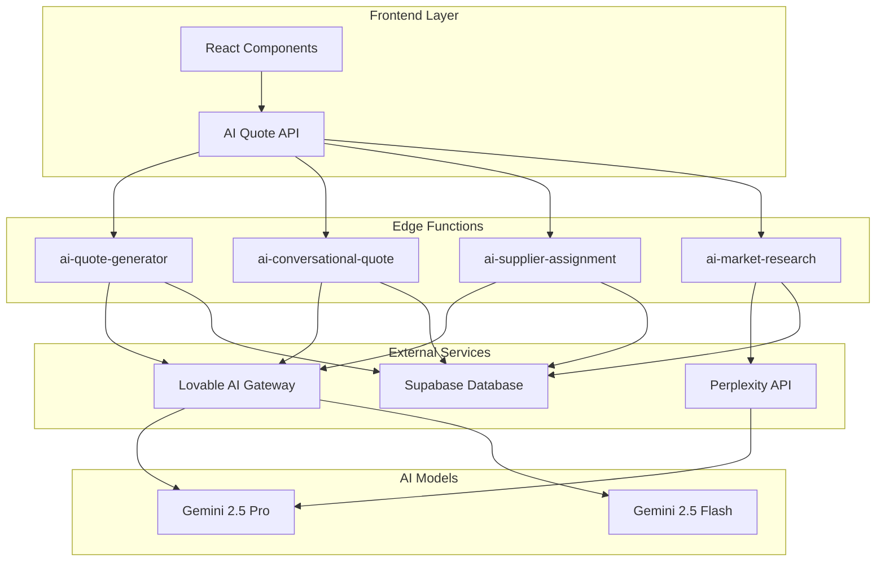
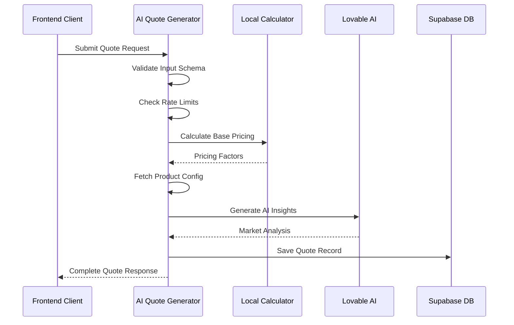
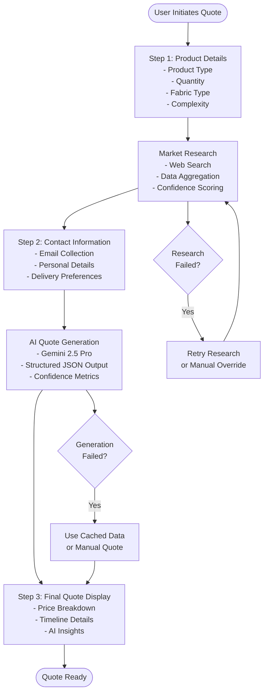
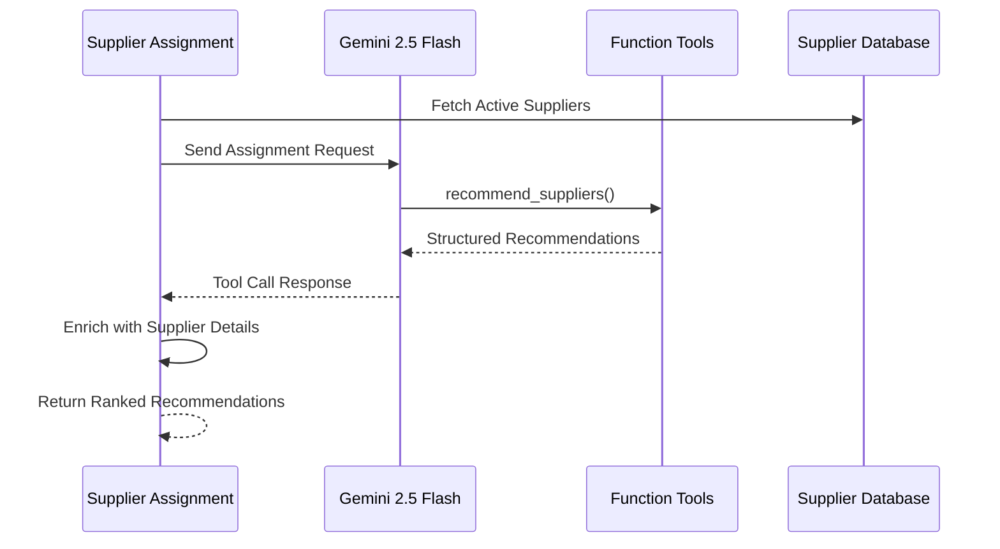
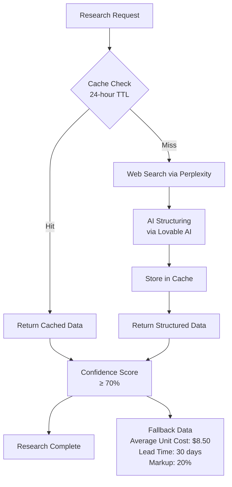

# Core AI Services

<cite>
**Referenced Files in This Document**
- [supabase/functions/ai-quote-generator/index.ts](file://supabase/functions/ai-quote-generator/index.ts)
- [supabase/functions/ai-conversational-quote/index.ts](file://supabase/functions/ai-conversational-quote/index.ts)
- [supabase/functions/ai-supplier-assignment/index.ts](file://supabase/functions/ai-supplier-assignment/index.ts)
- [supabase/functions/ai-market-research/index.ts](file://supabase/functions/ai-market-research/index.ts)
- [src/components/AIQuoteGenerator.tsx](file://src/components/AIQuoteGenerator.tsx)
- [src/components/quote/ConversationalQuoteBuilder.tsx](file://src/components/quote/ConversationalQuoteBuilder.tsx)
- [src/lib/api/aiQuote.ts](file://src/lib/api/aiQuote.ts)
- [src/lib/bangladeshManufacturing.ts](file://src/lib/bangladeshManufacturing.ts)
- [supabase/functions/_shared/logger.ts](file://supabase/functions/_shared/logger.ts)
- [src/test/mocks/supabase.ts](file://src/test/mocks/supabase.ts)
</cite>

## Table of Contents
1. [Introduction](#introduction)
2. [Architecture Overview](#architecture-overview)
3. [AI Quote Generator](#ai-quote-generator)
4. [Conversational Quote Builder](#conversational-quote-builder)
5. [Supplier Assignment System](#supplier-assignment-system)
6. [Market Research Engine](#market-research-engine)
7. [Integration Patterns](#integration-patterns)
8. [Security and Rate Limiting](#security-and-rate-limiting)
9. [Error Handling and Monitoring](#error-handling-and-monitoring)
10. [Testing and Development](#testing-and-development)
11. [Performance Optimization](#performance-optimization)
12. [Conclusion](#conclusion)

## Introduction

The sleekapp-v100 platform leverages sophisticated AI services to transform traditional garment manufacturing quote generation into an intelligent, automated process. These core AI services work together to provide instant, accurate pricing estimates, guided conversational quote building, and optimal supplier matching powered by advanced language models and machine learning algorithms.

The AI ecosystem consists of four primary components:
- **AI Quote Generator**: Intelligent pricing engine that ingests natural language product descriptions and generates market-aware quotes
- **Conversational Quote Builder**: Step-by-step guided quote building using Gemini 2.5 Pro with structured JSON output parsing
- **Supplier Assignment System**: Function-calling AI that analyzes supplier capabilities and recommends optimal manufacturing partners
- **Market Research Engine**: Automated research aggregation with caching and confidence scoring

## Architecture Overview

The AI services follow a serverless architecture pattern with Supabase Edge Functions as the backend infrastructure. Each service operates independently while sharing common patterns for security, rate limiting, and monitoring.



**Diagram sources**
- [supabase/functions/ai-quote-generator/index.ts](file://supabase/functions/ai-quote-generator/index.ts#L1-L50)
- [supabase/functions/ai-conversational-quote/index.ts](file://supabase/functions/ai-conversational-quote/index.ts#L1-L50)
- [supabase/functions/ai-supplier-assignment/index.ts](file://supabase/functions/ai-supplier-assignment/index.ts#L1-L50)

**Section sources**
- [supabase/functions/ai-quote-generator/index.ts](file://supabase/functions/ai-quote-generator/index.ts#L1-L100)
- [supabase/functions/ai-conversational-quote/index.ts](file://supabase/functions/ai-conversational-quote/index.ts#L1-L100)

## AI Quote Generator

The AI Quote Generator serves as the cornerstone of the pricing intelligence system, combining structured manufacturing data with AI-driven insights to deliver comprehensive quotes.

### Core Architecture

The generator implements a multi-layered approach that validates inputs, calculates base pricing using local algorithms, and enriches results with AI-generated insights.



**Diagram sources**
- [supabase/functions/ai-quote-generator/index.ts](file://supabase/functions/ai-quote-generator/index.ts#L253-L350)
- [src/lib/bangladeshManufacturing.ts](file://src/lib/bangladeshManufacturing.ts#L102-L186)

### Prompt Engineering and AI Integration

The AI Quote Generator employs sophisticated prompt engineering techniques to leverage Gemini 2.5 Pro's capabilities effectively. The system dynamically selects between different models based on input complexity.

#### Model Selection Strategy

The system intelligently chooses between AI models based on content complexity:
- **Gemini 2.5 Flash**: Used for text-only quotes requiring fast response times
- **Gemini 2.5 Pro**: Deployed when analyzing uploaded design files for enhanced visual understanding

#### Prompt Structure and Validation

The system implements comprehensive input sanitization and validation:

```typescript
// Input sanitization for AI prompts
function sanitizeForPrompt(input: string): string {
  return input
    .replace(/\n{3,}/g, '\n\n')
    .replace(/[^\w\s.,!?-]/g, '')
    .slice(0, 500);
}
```

#### Structured Output Parsing

The AI responses undergo rigorous parsing to extract structured data:

```typescript
// AI response parsing with fallback handling
try {
  const content = aiData.choices[0].message.content;
  const jsonMatch = content.match(/```json\s*([\s\S]*?)\s*```/) || 
                   content.match(/```\s*([\s\S]*?)\s*```/);
  const jsonString = jsonMatch ? jsonMatch[1] : content;
  aiSuggestions = JSON.parse(jsonString);
} catch (parseError) {
  aiSuggestions = 'AI analysis temporarily unavailable. Using standard recommendations.';
}
```

**Section sources**
- [supabase/functions/ai-quote-generator/index.ts](file://supabase/functions/ai-quote-generator/index.ts#L123-L130)
- [supabase/functions/ai-quote-generator/index.ts](file://supabase/functions/ai-quote-generator/index.ts#L586-L625)

## Conversational Quote Builder

The Conversational Quote Builder provides an interactive, step-by-step quote generation experience that guides users through the quoting process while maintaining context and building trust.

### Conversational Flow Architecture

The system implements a three-step conversational flow that progressively gathers information and builds confidence in the final quote.



**Diagram sources**
- [src/components/quote/ConversationalQuoteBuilder.tsx](file://src/components/quote/ConversationalQuoteBuilder.tsx#L43-L165)

### Structured JSON Output Integration

The conversational system relies on structured JSON output parsing to maintain consistency and reliability:

```typescript
// Expected JSON structure from Gemini 2.5 Pro
const quotePrompt = `You are an expert apparel manufacturing quote generator...
Return ONLY valid JSON with this structure:
{
  "unitPrice": number,
  "totalPrice": number,
  "estimatedDeliveryDays": number,
  "confidenceScore": number,
  "priceBreakdown": {
    "materials": number,
    "labor": number,
    "overhead": number,
    "margin": number
  },
  "priceJustification": "string (2-3 sentences)",
  "comparableProducts": [
    {"name": "string", "price": number, "supplier": "string"}
  ],
  "suggestions": "string (helpful tips for the buyer)"
}`;
```

### Rate Limiting and User Experience

The system implements sophisticated rate limiting to balance user experience with cost control:

- **IP-based limiting**: 5 requests per hour for anonymous users
- **Email-based limiting**: 10 requests per day for registered users
- **Progressive disclosure**: Users receive clear feedback about remaining quota

**Section sources**
- [supabase/functions/ai-conversational-quote/index.ts](file://supabase/functions/ai-conversational-quote/index.ts#L136-L225)
- [src/components/quote/ConversationalQuoteBuilder.tsx](file://src/components/quote/ConversationalQuoteBuilder.tsx#L43-L165)

## Supplier Assignment System

The Supplier Assignment System represents a sophisticated implementation of function-calling AI that analyzes supplier capabilities and recommends optimal manufacturing partners.

### Function Calling Architecture

The system leverages Gemini 2.5 Flash's function-calling capabilities to structure AI responses for programmatic consumption:



**Diagram sources**
- [supabase/functions/ai-supplier-assignment/index.ts](file://supabase/functions/ai-supplier-assignment/index.ts#L59-L111)

### Supplier Evaluation Criteria

The system evaluates suppliers across multiple dimensions to provide comprehensive recommendations:

#### Capability Analysis
- **Specialization Match**: Alignment between supplier expertise and product requirements
- **Monthly Capacity**: Availability to meet quantity demands
- **Performance Score**: Historical quality and reliability metrics (0-100 scale)
- **Lead Time**: Manufacturing and shipping timelines

#### Recommendation Algorithm

The function-calling system produces structured recommendations with confidence scores:

```typescript
// Function definition for supplier recommendations
const toolDefinition = {
  type: "function",
  function: {
    name: "recommend_suppliers",
    description: "Recommend top suppliers for an order",
    parameters: {
      type: "object",
      properties: {
        recommendations: {
          type: "array",
          items: {
            type: "object",
            properties: {
              supplier_id: { type: "string" },
              rank: { type: "number" },
              confidence_score: { type: "number", description: "0-100" },
              reasoning: { type: "string" }
            }
          }
        }
      }
    }
  }
};
```

### Ranking and Confidence Scoring

The system assigns confidence scores based on multiple factors:
- **Capability Fit**: How well supplier capabilities match requirements
- **Historical Performance**: Past order success rates and quality metrics
- **Capacity Availability**: Current workload and lead time predictions
- **Geographic Proximity**: Shipping logistics and customs considerations

**Section sources**
- [supabase/functions/ai-supplier-assignment/index.ts](file://supabase/functions/ai-supplier-assignment/index.ts#L38-L111)

## Market Research Engine

The Market Research Engine serves as the foundation for all AI-powered pricing decisions, aggregating real-time market data with sophisticated caching and confidence scoring mechanisms.

### Research Pipeline Architecture

The system implements a multi-stage research pipeline that balances speed, accuracy, and cost efficiency:



**Diagram sources**
- [supabase/functions/ai-market-research/index.ts](file://supabase/functions/ai-market-research/index.ts#L64-L236)

### Caching Strategy

The research system implements intelligent caching to optimize performance and reduce costs:

#### Quantitative Segmentation
- **0-100 units**: Basic caching for small orders
- **101-500 units**: Medium-sized order caching
- **501-1000 units**: Large order caching
- **1000+ units**: Enterprise-level caching

#### Cache Expiration and Invalidation
- **24-hour TTL**: Automatic cache expiration
- **Product Category**: Hierarchical cache organization
- **Quantity Range**: Granular cache targeting

### Data Aggregation and Structuring

The system transforms unstructured web search results into structured, actionable data:

```typescript
// Structured research data format
const researchStructure = {
  averageUnitCost: 8.5,
  materialCostPerUnit: 3.2,
  leadTimeDays: 30,
  markupPercentage: 20,
  comparableProducts: [
    { name: "Basic T-Shirt", price: 7.8, source: "Bangladesh Manufacturer" },
    { name: "Premium Polo", price: 12.5, source: "Local Supplier" }
  ],
  sources: ["https://example.com/research"],
  confidenceScore: 85
};
```

### Confidence Scoring Mechanism

The system implements a sophisticated confidence scoring mechanism:

- **Source Quality**: Academic vs. commercial sources
- **Recency**: Data freshness and timeliness
- **Consistency**: Cross-reference validation
- **Completeness**: Coverage of required metrics

**Section sources**
- [supabase/functions/ai-market-research/index.ts](file://supabase/functions/ai-market-research/index.ts#L58-L236)

## Integration Patterns

The AI services integrate seamlessly with the frontend through standardized APIs and consistent error handling patterns.

### Supabase Functions Integration

All AI services leverage Supabase Functions for deployment and management:

```typescript
// Standard function invocation pattern
const { data, error } = await supabase.functions.invoke('function-name', {
  body: { /* request parameters */ }
});
```

### API Response Standardization

The system maintains consistent response formats across all AI services:

```typescript
// Standard success response format
interface ApiResponse<T> {
  success: boolean;
  data?: T;
  error?: string;
  requestId?: string;
}

// Example: AI Quote Response
interface AIQuoteResponse {
  success: boolean;
  quote: {
    id: string;
    total_price: number;
    estimated_delivery_days: number;
    quote_data: any;
    ai_suggestions: string;
  };
  timeline: Array<{
    stage: string;
    days: number;
    startDate: string;
    endDate: string;
  }>;
  aiInsights: string;
}
```

### Error Handling Patterns

The system implements comprehensive error handling with graceful degradation:

```typescript
// Error handling with fallback mechanisms
try {
  const result = await generateAIQuote(request);
  return result;
} catch (error) {
  console.error('AI quote generation failed:', error);
  // Fallback to cached data or manual quote
  return await generateManualQuote(request);
}
```

**Section sources**
- [src/lib/api/aiQuote.ts](file://src/lib/api/aiQuote.ts#L46-L81)
- [src/components/AIQuoteGenerator.tsx](file://src/components/AIQuoteGenerator.tsx#L124-L195)

## Security and Rate Limiting

The AI services implement multiple layers of security and rate limiting to protect against abuse while maintaining excellent user experience.

### Origin Validation and CORS

The system implements strict origin validation for production environments:

```typescript
// Origin validation for security
const allowedOrigins = [
  'https://sleekapparels.com',
  'https://www.sleekapparels.com',
  'http://localhost:5173',
  'http://localhost:3000'
];

if (!isDevelopment && origin) {
  const isAllowedOrigin = allowedOrigins.some(allowed => {
    const allowedDomain = allowed.replace(/^https?:\/\//, '');
    return originHostname === allowedDomain || 
           originHostname.endsWith('.' + allowedDomain);
  });
  
  if (!isAllowedOrigin) {
    return new Response('Unauthorized origin', { status: 403 });
  }
}
```

### Multi-Level Rate Limiting

The system implements tiered rate limiting based on user authentication status:

#### IP-Based Rate Limiting
- **Anonymous users**: 15 requests per day
- **Authenticated users**: 20 requests per day
- **Session-based**: 3 requests per day per session

#### Email-Based Rate Limiting
- **Registered users**: 10 requests per day
- **Verified emails**: Higher limits with priority access

#### Function-Specific Limits
- **AI Quote Generator**: Daily limits with session tracking
- **Conversational Quote**: Hourly and daily limits
- **Market Research**: Hourly limits with caching

### Data Protection and Privacy

The system implements comprehensive data protection measures:

```typescript
// PII sanitization for logging
function sanitizeEmail(email: string): string {
  const [local, domain] = email.split('@');
  const sanitizedLocal = local.length > 3 
    ? local.substring(0, 3) + '***' 
    : '***';
  return `${sanitizedLocal}@${domain}`;
}
```

**Section sources**
- [supabase/functions/ai-quote-generator/index.ts](file://supabase/functions/ai-quote-generator/index.ts#L140-L202)
- [supabase/functions/_shared/logger.ts](file://supabase/functions/_shared/logger.ts#L14-L26)

## Error Handling and Monitoring

The AI services implement comprehensive error handling and monitoring to ensure reliability and facilitate debugging.

### Structured Logging System

The system uses a centralized logging framework with automatic PII sanitization:

```typescript
// Structured logging with automatic sanitization
const logger = createLogger('ai-quote-generator');

logger.info('Quote request processed successfully', {
  sessionId: 'abc123',
  productId: 'tshirt-basic',
  quantity: 100,
  userId: 'user123' // Automatically sanitized
});
```

### Error Recovery Strategies

The system implements multiple error recovery strategies:

#### AI Service Failures
- **Graceful Degradation**: Fallback to cached data or manual calculations
- **Retry Logic**: Automatic retry with exponential backoff
- **User Feedback**: Clear messaging about temporary service issues

#### Database Connectivity Issues
- **Connection Pooling**: Efficient database connection management
- **Transaction Rollback**: Atomic operations with rollback capability
- **Health Checks**: Periodic database connectivity verification

#### External API Failures
- **Circuit Breaker Pattern**: Automatic failure detection and response
- **Timeout Management**: Configurable timeouts for external services
- **Fallback Responses**: Predefined responses for service outages

### Performance Monitoring

The system tracks key performance metrics:

```typescript
// Performance tracking
const performanceMetrics = {
  responseTime: Date.now() - startTime,
  aiCost: estimatedCost,
  cacheHitRate: cacheHits / (cacheHits + cacheMisses),
  errorRate: errors / totalRequests
};
```

**Section sources**
- [supabase/functions/_shared/logger.ts](file://supabase/functions/_shared/logger.ts#L100-L173)
- [supabase/functions/ai-quote-generator/index.ts](file://supabase/functions/ai-quote-generator/index.ts#L618-L624)

## Testing and Development

The AI services include comprehensive testing frameworks and development tools to ensure reliability and facilitate maintenance.

### Mock Infrastructure

The system provides comprehensive mocking infrastructure for unit testing:

```typescript
// Supabase mock implementation
export const mockSupabaseFunctions = {
  invoke: vi.fn()
};

// Test setup with mocks
describe('AI Quote Generation', () => {
  beforeEach(() => {
    vi.clearAllMocks();
    mockSupabaseFunctions.invoke.mockResolvedValue({
      data: { success: true, quote: mockQuote }
    });
  });
});
```

### Diagnostic Tools

The system includes built-in diagnostic tools for troubleshooting:

```typescript
// Comprehensive diagnostic testing
export const testAIQuoteGeneration = async (): Promise<DiagnosticResult> => {
  try {
    const request: AIQuoteRequest = {
      productType: 't-shirt',
      quantity: 100,
      customerEmail: 'test@example.com'
    };
    
    const result = await generateAIQuote(request);
    return {
      status: 'success',
      message: 'AI quote generation working',
      details: { quoteId: result.quote.id }
    };
  } catch (error) {
    return {
      status: 'error',
      message: 'AI quote generation failed',
      details: error
    };
  }
};
```

### Development Workflow

The system supports iterative development with hot reloading and comprehensive testing:

- **Hot Module Replacement**: Rapid development iteration
- **TypeScript Validation**: Compile-time type checking
- **Unit Test Coverage**: Comprehensive test suites
- **Integration Testing**: End-to-end functionality testing

**Section sources**
- [src/test/mocks/supabase.ts](file://src/test/mocks/supabase.ts#L15-L37)
- [src/lib/diagnostics.ts](file://src/lib/diagnostics.ts#L122-L160)

## Performance Optimization

The AI services implement multiple optimization strategies to minimize costs, maximize performance, and ensure scalability.

### Cost Optimization Strategies

#### AI Model Selection
- **Model Efficiency**: Choose appropriate models based on complexity requirements
- **Token Management**: Optimize prompt length and response size
- **Batch Processing**: Group similar requests for efficiency

#### Caching Mechanisms
- **Intelligent Caching**: Cache based on product type and quantity ranges
- **Cache Invalidation**: Automatic cache clearing with data updates
- **Cache Warming**: Pre-populate caches for frequently requested data

#### Rate Limiting Optimization
- **Tiered Limits**: Different limits based on user authentication
- **Predictive Scaling**: Anticipate demand spikes
- **Resource Allocation**: Dynamic resource allocation based on load

### Performance Monitoring

The system tracks key performance indicators:

```typescript
// Performance metrics tracking
interface PerformanceMetrics {
  responseTime: number;
  aiCost: number;
  cacheHitRate: number;
  errorRate: number;
  throughput: number;
}

// Cost optimization tracking
const costMetrics = {
  estimatedCost: 0.05, // Per request
  totalCost: 0,
  requestsProcessed: 0,
  optimizationSavings: 0
};
```

### Scalability Considerations

The system is designed for horizontal scaling:

- **Stateless Design**: Each function instance is independent
- **Database Scaling**: Read replicas and connection pooling
- **CDN Integration**: Static asset delivery optimization
- **Auto-scaling**: Automatic resource scaling based on demand

**Section sources**
- [supabase/functions/ai-quote-generator/index.ts](file://supabase/functions/ai-quote-generator/index.ts#L615-L616)
- [supabase/functions/ai-market-research/index.ts](file://supabase/functions/ai-market-research/index.ts#L248-L251)

## Conclusion

The sleekapp-v100 AI services represent a sophisticated implementation of modern AI-powered quote generation systems. By combining structured manufacturing data with advanced language models, the platform delivers intelligent, accurate, and cost-effective solutions for garment manufacturing quotes.

### Key Achievements

- **Intelligent Pricing**: AI-driven insights combined with local manufacturing expertise
- **User Experience**: Guided conversational flows that build trust and confidence
- **Scalability**: Serverless architecture with intelligent caching and rate limiting
- **Reliability**: Comprehensive error handling with graceful degradation
- **Security**: Multi-layered security with origin validation and data protection

### Future Enhancements

The system provides a solid foundation for future enhancements:

- **Advanced Analytics**: Machine learning models for predictive pricing
- **Personalization**: User-specific recommendation systems
- **Integration**: Expanded API integrations with supply chain systems
- **Optimization**: Continuous improvement of AI models and prompting strategies

The AI services demonstrate how modern cloud-native architectures can leverage AI to transform traditional business processes into intelligent, automated systems that deliver superior value to customers while maintaining operational excellence.