# Authentication and User Management Functions

<cite>
**Referenced Files in This Document**
- [supabase/functions/send-otp/index.ts](file://supabase/functions/send-otp/index.ts)
- [supabase/functions/verify-otp/index.ts](file://supabase/functions/verify-otp/index.ts)
- [supabase/functions/bootstrap-admin/index.ts](file://supabase/functions/bootstrap-admin/index.ts)
- [supabase/functions/admin-check/index.ts](file://supabase/functions/admin-check/index.ts)
- [src/hooks/useAdminAuth.ts](file://src/hooks/useAdminAuth.ts)
- [supabase/functions/_shared/logger.ts](file://supabase/functions/_shared/logger.ts)
- [src/lib/supabaseHelpers.ts](file://src/lib/supabaseHelpers.ts)
- [src/pages/Auth.tsx](file://src/pages/Auth.tsx)
- [src/lib/firebase/auth.ts](file://src/lib/firebase/auth.ts)
- [src/hooks/useFirebaseAuth.tsx](file://src/hooks/useFirebaseAuth.tsx)
- [supabase/migrations/20251115150759_remix_migration_from_pg_dump.sql](file://supabase/migrations/20251115150759_remix_migration_from_pg_dump.sql)
- [supabase/migrations/20251119140029_887f03c6-bdb2-46d4-ac7b-4b4868f9a169.sql](file://supabase/migrations/20251119140029_887f03c6-bdb2-46d4-ac7b-4b4868f9a169.sql)
- [supabase/BASE_MIGRATION_SAFE.sql](file://supabase/BASE_MIGRATION_SAFE.sql)
</cite>

## Table of Contents
1. [Introduction](#introduction)
2. [Authentication Architecture Overview](#authentication-architecture-overview)
3. [OTP Verification System](#otp-verification-system)
4. [Admin Management Functions](#admin-management-functions)
5. [Integration with Authentication Providers](#integration-with-authentication-providers)
6. [Security Implementation](#security-implementation)
7. [Rate Limiting and Protection](#rate-limiting-and-protection)
8. [Session Management](#session-management)
9. [Troubleshooting Guide](#troubleshooting-guide)
10. [Best Practices](#best-practices)

## Introduction

SleekApparels implements a comprehensive authentication and user management system built on Supabase Edge Functions and Firebase Auth. The system provides robust phone and email verification capabilities, admin role management, and seamless integration with multiple authentication providers. This documentation covers the implementation details of core authentication functions including OTP generation and verification, admin bootstrap processes, and security measures.

The authentication system supports multiple user types (buyers, suppliers, admins) with role-based access control, comprehensive rate limiting, and protection against common attack vectors including brute force attacks and SMS/email injection.

## Authentication Architecture Overview

The authentication system follows a multi-layered architecture combining edge functions, database triggers, and external authentication providers:

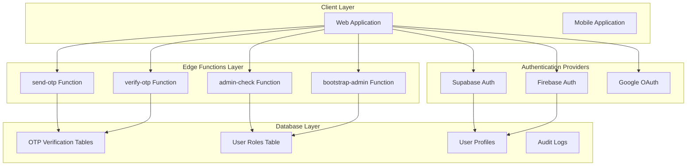

**Diagram sources**
- [supabase/functions/send-otp/index.ts](file://supabase/functions/send-otp/index.ts#L1-L50)
- [supabase/functions/verify-otp/index.ts](file://supabase/functions/verify-otp/index.ts#L1-L50)
- [supabase/functions/admin-check/index.ts](file://supabase/functions/admin-check/index.ts#L1-L30)

**Section sources**
- [supabase/functions/send-otp/index.ts](file://supabase/functions/send-otp/index.ts#L1-L100)
- [supabase/functions/verify-otp/index.ts](file://supabase/functions/verify-otp/index.ts#L1-L100)

## OTP Verification System

### Send OTP Function

The `send-otp` function handles both phone and email verification with comprehensive validation and rate limiting:

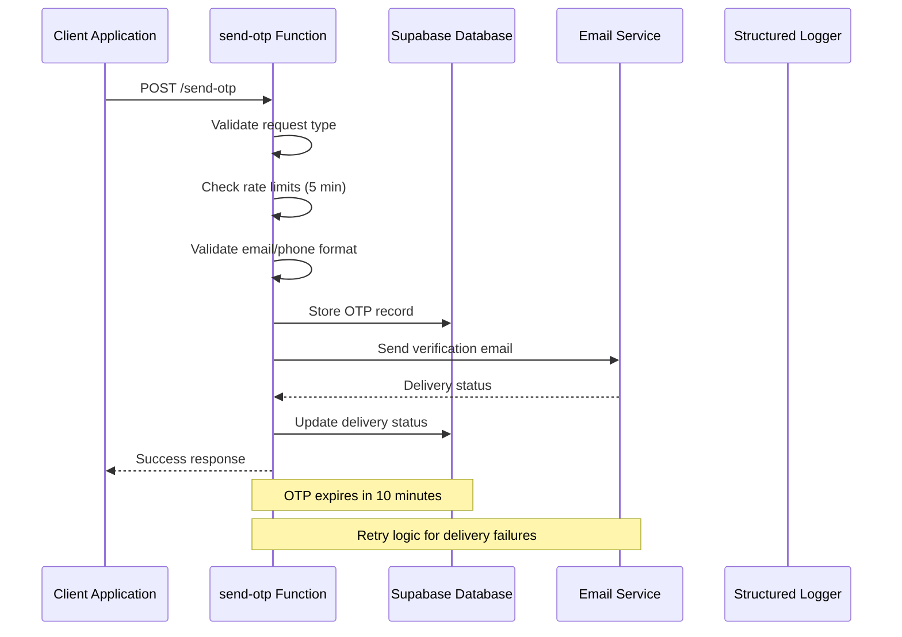

**Diagram sources**
- [supabase/functions/send-otp/index.ts](file://supabase/functions/send-otp/index.ts#L131-L489)

#### Key Features:

1. **Multi-Type Verification**: Supports phone, email-quote, and email-supplier OTP types
2. **Comprehensive Validation**: Email format validation with disposable domain blocking
3. **Rate Limiting**: 5-minute cooldown for phone OTPs, 5-minute cooldown for email OTPs
4. **Delivery Tracking**: Email delivery status monitoring with Resend integration
5. **Retry Logic**: Automatic retry mechanism for transient delivery failures

#### Implementation Details:

- **Phone OTP Generation**: 6-digit numeric codes with 10-minute expiration
- **Email OTP Generation**: 6-digit numeric codes with 10-minute expiration
- **Disposable Email Blocking**: Prevents abuse using temporary email services
- **CAPTCHA Integration**: ReCAPTCHA verification for supplier registrations

**Section sources**
- [supabase/functions/send-otp/index.ts](file://supabase/functions/send-otp/index.ts#L131-L489)

### Verify OTP Function

The `verify-otp` function provides robust verification with multiple security layers:

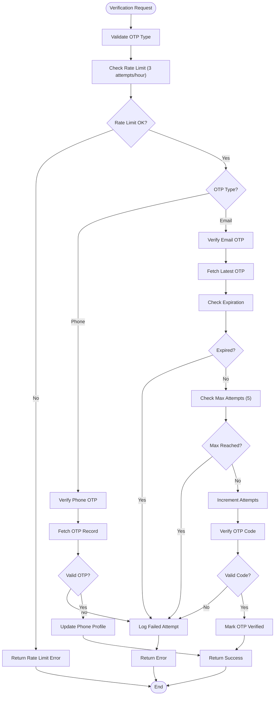

**Diagram sources**
- [supabase/functions/verify-otp/index.ts](file://supabase/functions/verify-otp/index.ts#L26-L356)

#### Security Features:

1. **Rate Limiting**: 3 attempts per hour for all OTP types
2. **Attempt Monitoring**: Tracks individual OTP record attempts (max 5)
3. **Expiration Checking**: Validates OTP freshness (10-minute window)
4. **Logging**: Comprehensive audit trail for security monitoring
5. **Timing Attack Protection**: Constant-time comparisons for OTP validation

**Section sources**
- [supabase/functions/verify-otp/index.ts](file://supabase/functions/verify-otp/index.ts#L26-L356)

## Admin Management Functions

### Bootstrap Admin Function

The `bootstrap-admin` function securely creates initial admin accounts with strict security controls:

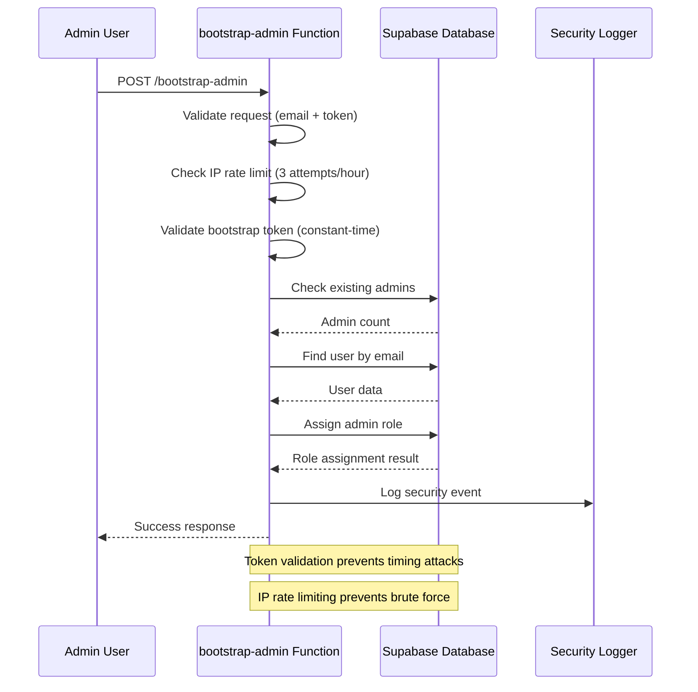

**Diagram sources**
- [supabase/functions/bootstrap-admin/index.ts](file://supabase/functions/bootstrap-admin/index.ts#L8-L178)

#### Security Measures:

1. **Constant-Time Token Validation**: Prevents timing attack vulnerabilities
2. **IP Rate Limiting**: 3 attempts per hour per IP address
3. **Token-Based Access**: Requires secure bootstrap token
4. **Admin Existence Check**: Prevents multiple admin assignments
5. **Comprehensive Logging**: Security event tracking for audits

**Section sources**
- [supabase/functions/bootstrap-admin/index.ts](file://supabase/functions/bootstrap-admin/index.ts#L8-L178)

### Admin Check Function

The `admin-check` function provides role-based access verification:

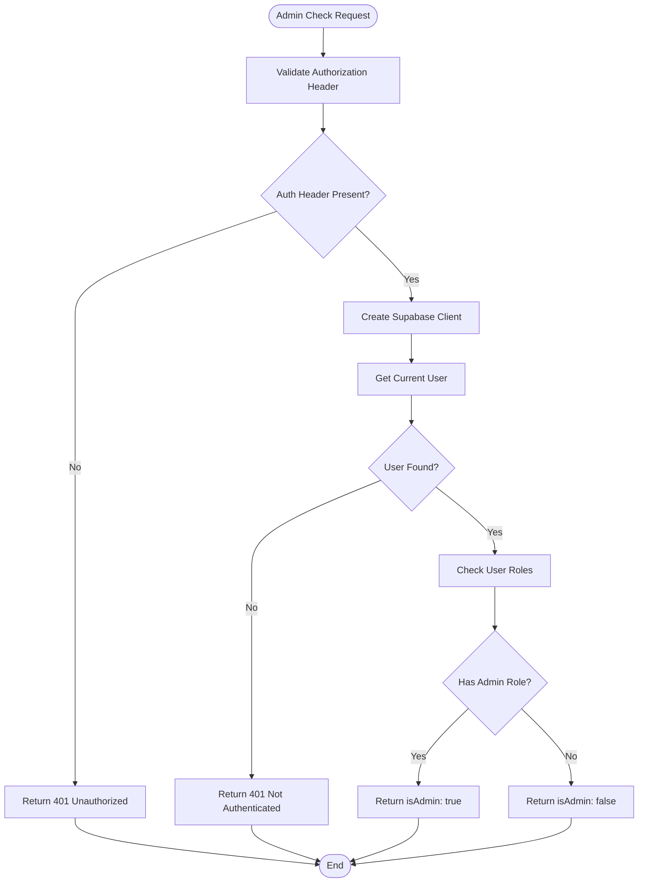

**Diagram sources**
- [supabase/functions/admin-check/index.ts](file://supabase/functions/admin-check/index.ts#L8-L74)

#### Implementation Details:

- **Server-Side Validation**: Uses edge function for secure role checking
- **Token-Based Authentication**: Validates JWT tokens from client requests
- **Role Enumeration**: Checks for 'admin' role in user_roles table
- **CORS Support**: Handles cross-origin requests securely

**Section sources**
- [supabase/functions/admin-check/index.ts](file://supabase/functions/admin-check/index.ts#L8-L74)

### Admin Authentication Hook

The React hook provides client-side admin authentication management:

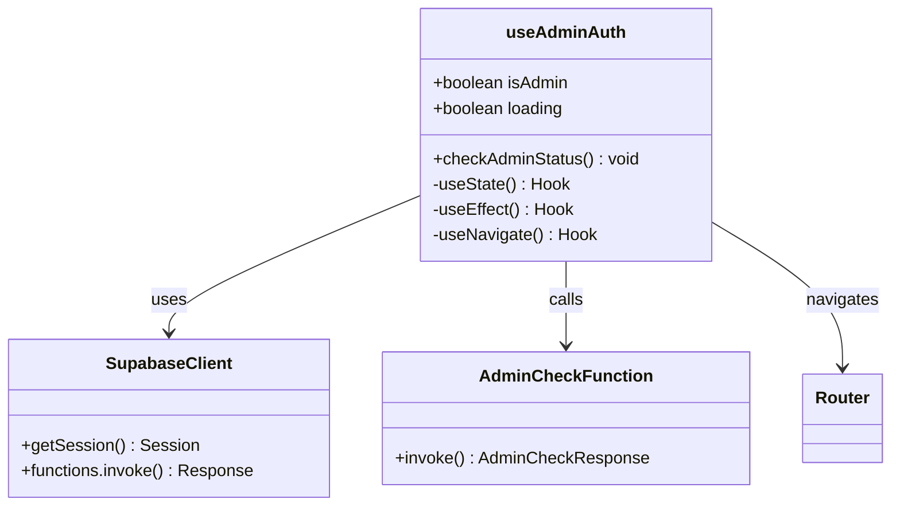

**Diagram sources**
- [src/hooks/useAdminAuth.ts](file://src/hooks/useAdminAuth.ts#L5-L47)

**Section sources**
- [src/hooks/useAdminAuth.ts](file://src/hooks/useAdminAuth.ts#L5-L47)

## Integration with Authentication Providers

### Supabase Auth Integration

The system integrates with Supabase Auth for primary authentication:

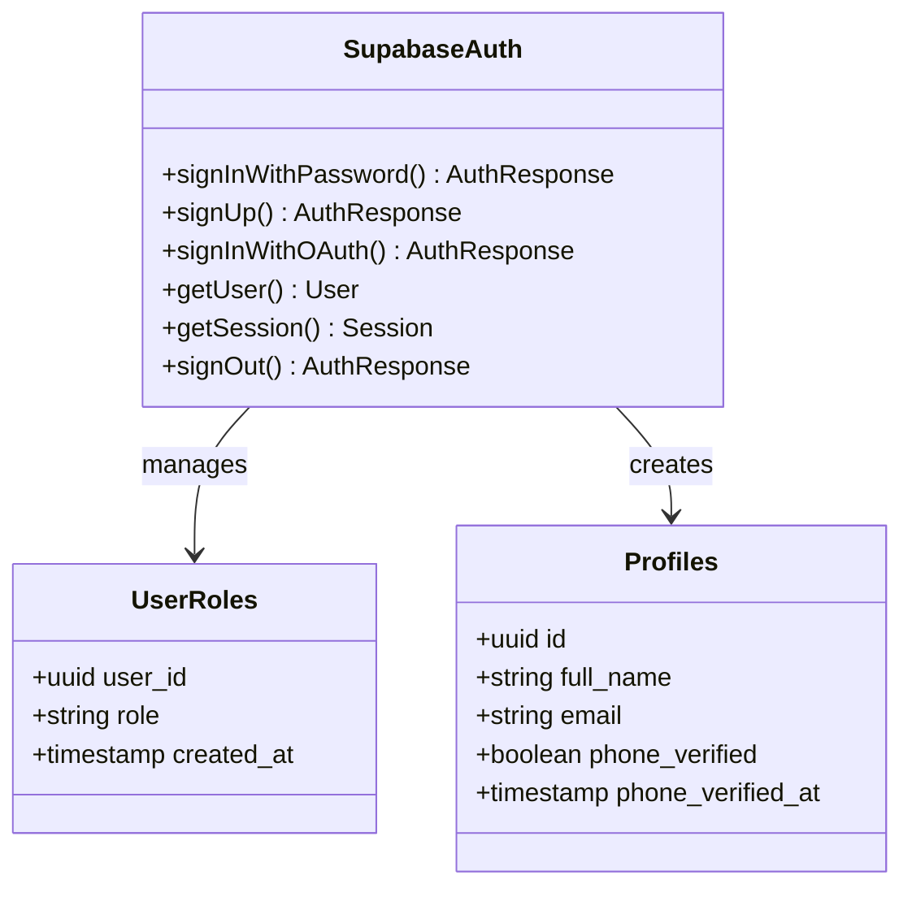

**Diagram sources**
- [src/pages/Auth.tsx](file://src/pages/Auth.tsx#L403-L460)

### Firebase Auth Integration

Firebase Auth provides alternative authentication with additional features:

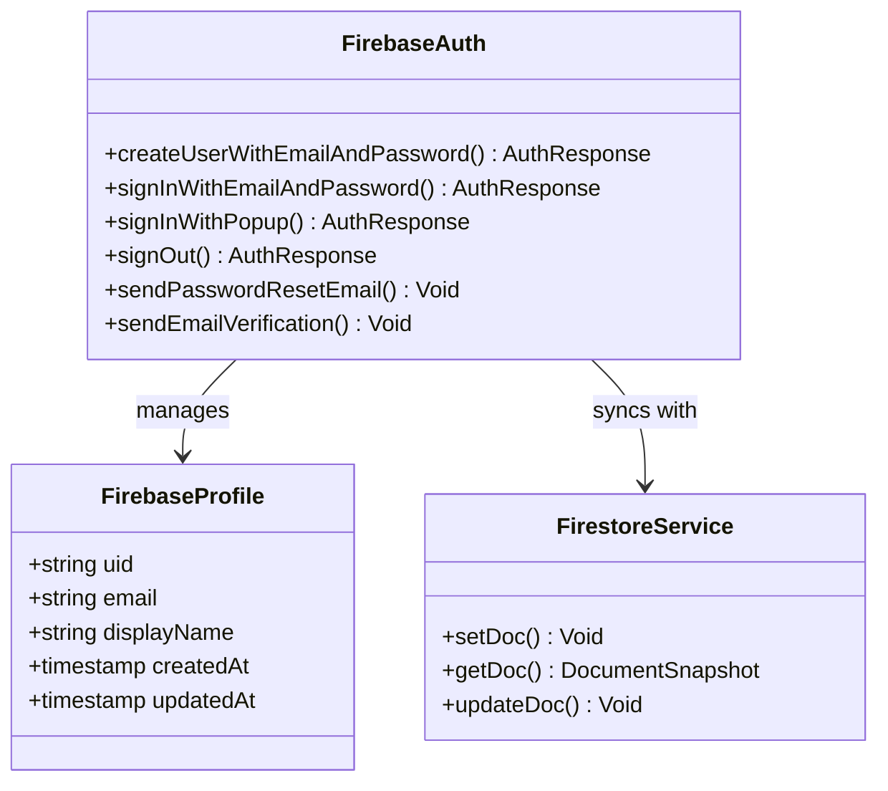

**Diagram sources**
- [src/lib/firebase/auth.ts](file://src/lib/firebase/auth.ts#L17-L146)

**Section sources**
- [src/pages/Auth.tsx](file://src/pages/Auth.tsx#L403-L460)
- [src/lib/firebase/auth.ts](file://src/lib/firebase/auth.ts#L17-L146)

## Security Implementation

### Structured Logging System

The system implements comprehensive logging with PII sanitization:

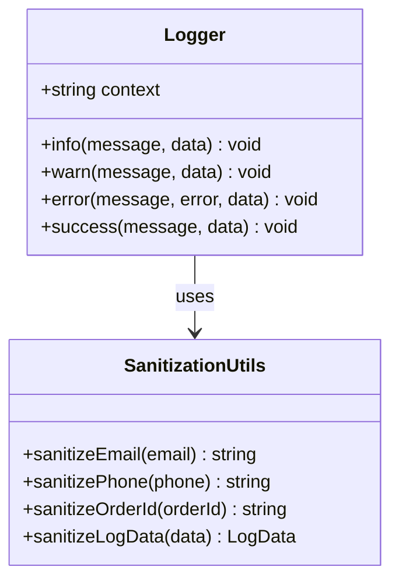

**Diagram sources**
- [supabase/functions/_shared/logger.ts](file://supabase/functions/_shared/logger.ts#L1-L173)

#### Security Features:

1. **PII Sanitization**: Automatic redaction of sensitive data in logs
2. **Structured Logging**: JSON-formatted logs for easy parsing
3. **Context Tracking**: Function-specific logging contexts
4. **Level-based Logging**: INFO, WARN, ERROR, SUCCESS categorization

**Section sources**
- [supabase/functions/_shared/logger.ts](file://supabase/functions/_shared/logger.ts#L1-L173)

### Email Injection Prevention

Multiple layers protect against email header injection attacks:

1. **Input Sanitization**: Removal of newline characters and excessive whitespace
2. **Format Validation**: Strict regex validation for email formats
3. **Domain Blacklisting**: Block disposable email domains
4. **Length Constraints**: Enforce reasonable character limits

### Token Storage Security

Secure token handling mechanisms:

1. **Constant-Time Comparisons**: Prevent timing attack vulnerabilities
2. **Environment Variable Storage**: Secure token storage in environment variables
3. **Automatic Rotation**: Regular token rotation for bootstrap functions
4. **Scope Limitation**: Tokens limited to specific administrative functions

## Rate Limiting and Protection

### OTP Rate Limiting

The system implements comprehensive rate limiting across multiple dimensions:

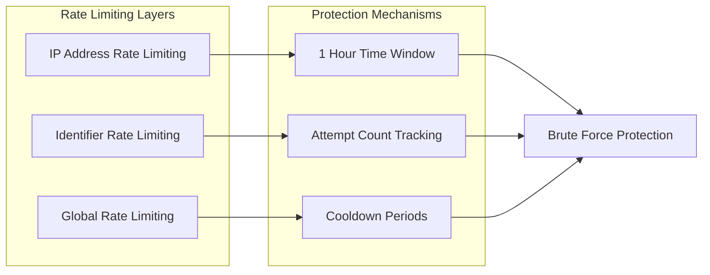

**Diagram sources**
- [supabase/functions/verify-otp/index.ts](file://supabase/functions/verify-otp/index.ts#L67-L88)

#### Rate Limiting Policies:

1. **OTP Verification Attempts**: 3 attempts per hour per identifier
2. **Individual OTP Attempts**: 5 attempts per OTP record
3. **Phone OTP Requests**: 5-minute cooldown period
4. **Email OTP Requests**: 5-minute cooldown period
5. **Bootstrap Admin**: 3 attempts per hour per IP address

**Section sources**
- [supabase/functions/verify-otp/index.ts](file://supabase/functions/verify-otp/index.ts#L67-L88)

### Database-Level Protections

PostgreSQL stored procedures provide additional security:

1. **Stored Procedures**: `check_otp_rate_limit()` and `log_otp_attempt()`
2. **Security Definer**: Functions execute with elevated privileges
3. **Parameter Validation**: Input sanitization within database functions
4. **Audit Trails**: Comprehensive logging of all authentication events

**Section sources**
- [supabase/BASE_MIGRATION_SAFE.sql](file://supabase/BASE_MIGRATION_SAFE.sql#L225-L270)

## Session Management

### JWT Token Management

The system uses JWT tokens for stateless authentication:

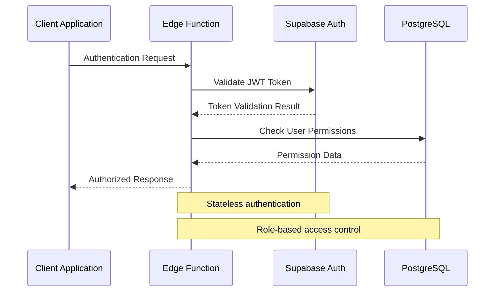

### Session Persistence

1. **Browser Sessions**: JWT tokens stored in HTTP-only cookies
2. **Mobile Sessions**: Secure token storage in device memory
3. **Auto-Refresh**: Token refresh mechanisms for long sessions
4. **Logout Handling**: Complete session termination across devices

## Troubleshooting Guide

### Common Issues and Solutions

#### OTP Verification Failures

**Issue**: OTP verification fails with "Invalid or expired code"
**Causes**:
- Code expired (more than 10 minutes old)
- Maximum attempts reached (5 attempts per OTP)
- Incorrect code entered

**Solutions**:
1. Request a new OTP code
2. Check for typos in the entered code
3. Verify system time synchronization

#### Rate Limiting Errors

**Issue**: "Too many verification attempts" error
**Causes**:
- Exceeded 3 attempts per hour
- Reached maximum attempts for specific OTP

**Solutions**:
1. Wait for rate limit to reset (1 hour)
2. Request new OTP after reaching attempt limit
3. Check for automated verification attempts

#### Email Delivery Issues

**Issue**: Verification emails not received
**Causes**:
- Email blocked by spam filters
- Disposable email domain detected
- SMTP service failures

**Solutions**:
1. Check spam/junk folders
2. Use a different email address
3. Contact support for delivery issues

#### Bootstrap Admin Failures

**Issue**: Bootstrap admin function returns "Invalid token"
**Causes**:
- Incorrect bootstrap token
- Token expired or rotated
- Multiple admin accounts exist

**Solutions**:
1. Verify bootstrap token configuration
2. Check if admin account already exists
3. Contact system administrator

### Debugging Tools

1. **Console Logging**: Enable detailed logging for development
2. **Database Queries**: Monitor OTP tables for verification attempts
3. **Network Inspection**: Check API responses and error codes
4. **Authentication Events**: Review audit logs for security events

**Section sources**
- [supabase/functions/send-otp/index.ts](file://supabase/functions/send-otp/index.ts#L480-L489)
- [supabase/functions/verify-otp/index.ts](file://supabase/functions/verify-otp/index.ts#L348-L356)

## Best Practices

### Security Best Practices

1. **Environment Variables**: Store all secrets in environment variables
2. **HTTPS Only**: Require HTTPS for all authentication endpoints
3. **Input Validation**: Validate all user inputs server-side
4. **Logging**: Implement comprehensive audit logging
5. **Monitoring**: Set up alerts for suspicious authentication activity

### Performance Best Practices

1. **Caching**: Cache frequently accessed user data
2. **Connection Pooling**: Use connection pooling for database access
3. **Async Processing**: Handle long-running operations asynchronously
4. **CDN Integration**: Serve static assets through CDN
5. **Compression**: Enable compression for API responses

### Development Best Practices

1. **Type Safety**: Use TypeScript for type-safe development
2. **Testing**: Implement comprehensive unit and integration tests
3. **Documentation**: Maintain up-to-date API documentation
4. **Versioning**: Version APIs for backward compatibility
5. **Monitoring**: Implement application performance monitoring

### User Experience Best Practices

1. **Clear Messaging**: Provide clear error messages and instructions
2. **Loading States**: Show appropriate loading indicators
3. **Error Recovery**: Help users recover from authentication errors
4. **Accessibility**: Ensure authentication forms are accessible
5. **Mobile Optimization**: Optimize for mobile device usage