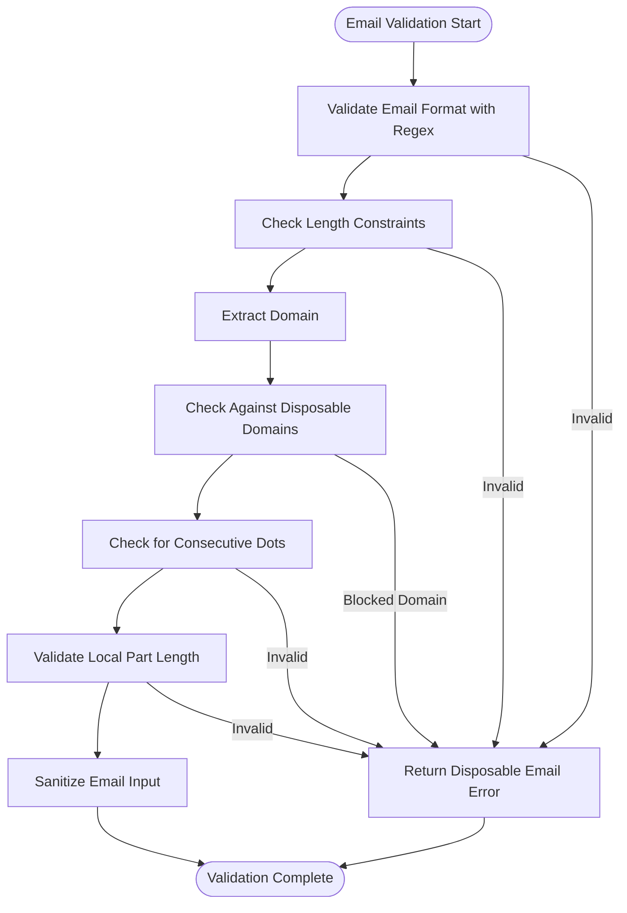
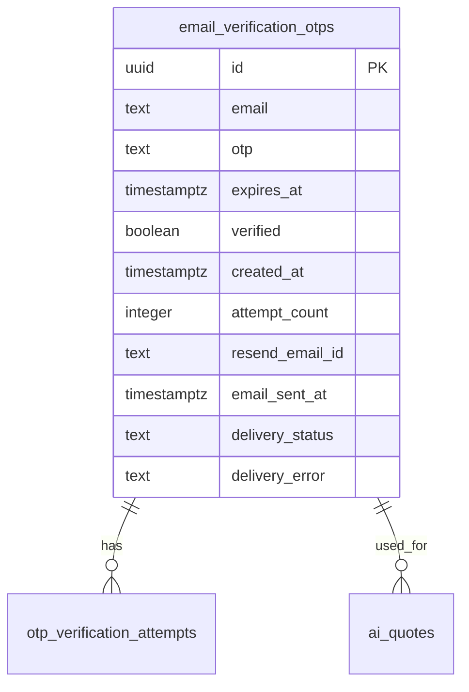
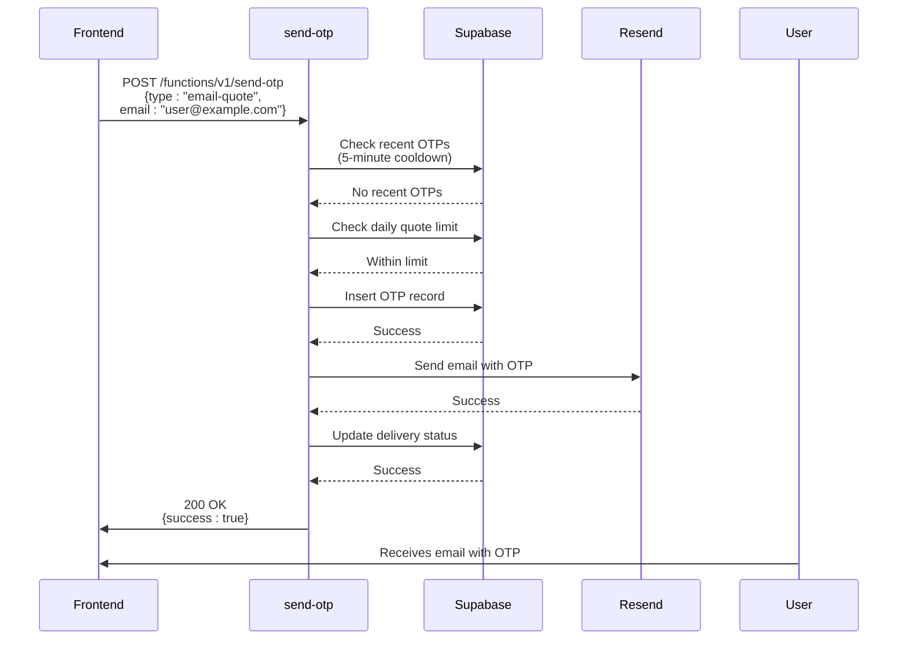
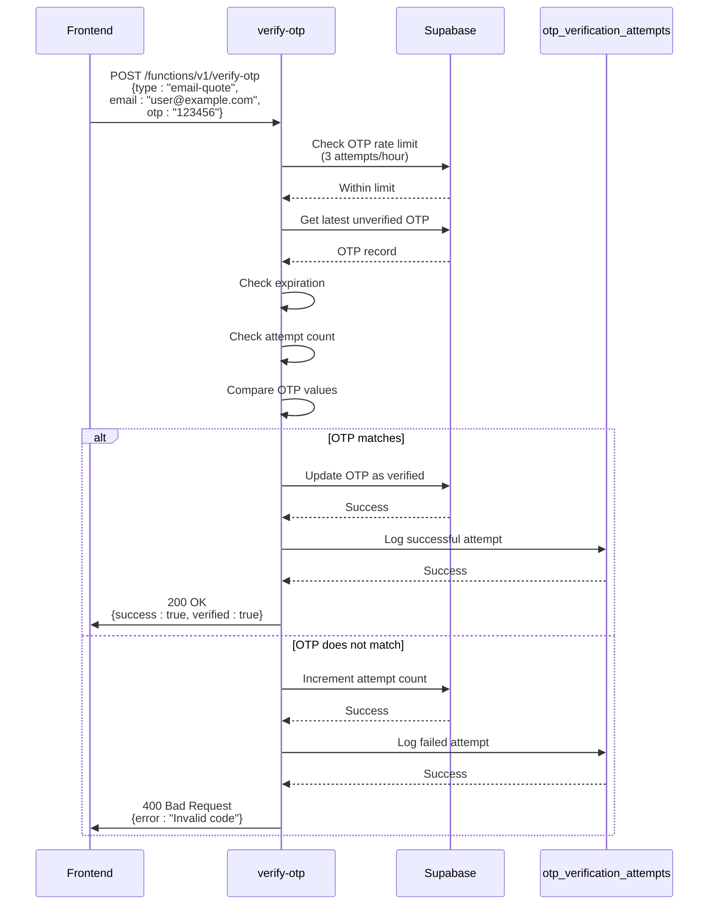
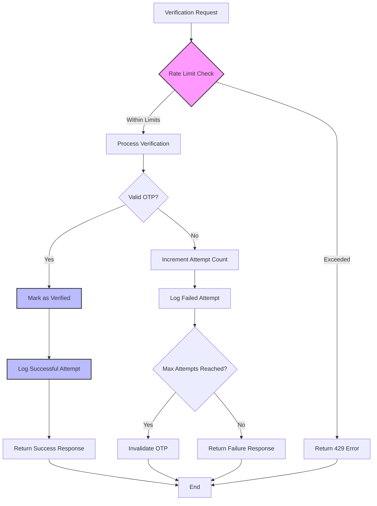
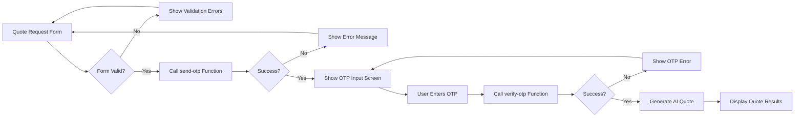
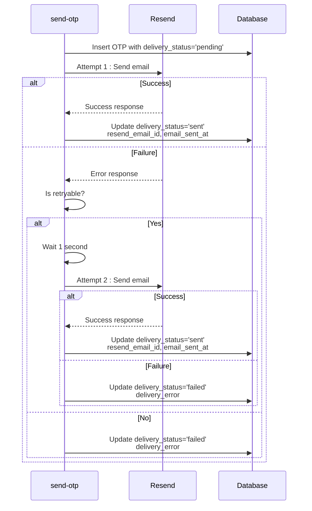

# Email Verification

<cite>
**Referenced Files in This Document**   
- [send-otp/index.ts](file://supabase/functions/send-otp/index.ts)
- [verify-otp/index.ts](file://supabase/functions/verify-otp/index.ts)
- [AIQuoteGeneratorWithOTP.tsx](file://src/components/AIQuoteGeneratorWithOTP.tsx)
- [BecomeSupplier.tsx](file://src/pages/BecomeSupplier.tsx)
- [TABLES_ONLY.sql](file://supabase/TABLES_ONLY.sql)
- [COMPLETE_SETUP.sql](file://supabase/COMPLETE_SETUP.sql)
- [20251119140029_887f03c6-bdb2-46d4-ac7b-4b4868f9a169.sql](file://supabase/migrations/20251119140029_887f03c6-bdb2-46d4-ac7b-4b4868f9a169.sql)
</cite>

## Table of Contents
1. [Introduction](#introduction)
2. [Email Validation Process](#email-validation-process)
3. [OTP Generation and Storage](#otp-generation-and-storage)
4. [Send OTP Function Implementation](#send-otp-function-implementation)
5. [Verify OTP Function Implementation](#verify-otp-function-implementation)
6. [Rate Limiting and Security](#rate-limiting-and-security)
7. [Frontend Integration](#frontend-integration)
8. [Delivery Tracking and Retry Logic](#delivery-tracking-and-retry-logic)
9. [Troubleshooting Guide](#troubleshooting-guide)

## Introduction
The email verification system in sleekapp-v100 provides a secure and reliable method for verifying user emails across different contexts, primarily for quote requests and supplier registration. The system implements a robust two-factor verification process using one-time passwords (OTPs) delivered via email. This documentation details the implementation of the send-otp and verify-otp functions, covering the comprehensive email validation process, OTP generation and storage, delivery mechanisms, and security considerations.

**Section sources**
- [send-otp/index.ts](file://supabase/functions/send-otp/index.ts#L1-L489)
- [verify-otp/index.ts](file://supabase/functions/verify-otp/index.ts#L1-L356)

## Email Validation Process
The email verification system implements a comprehensive validation process to ensure email addresses are properly formatted and from legitimate domains. The validation process includes multiple layers of checks to prevent abuse and ensure data quality.

The system uses a comprehensive regular expression pattern to validate email format, checking for proper structure including local part, domain, and top-level domain. The regex pattern `^[a-zA-Z0-9]([a-zA-Z0-9._+-]{0,63}[a-zA-Z0-9])?@[a-zA-Z0-9]([a-zA-Z0-9-]{0,61}[a-zA-Z0-9])?(\.[a-zA-Z0-9]([a-zA-Z0-9-]{0,61}[a-zA-Z0-9])?)*\.[a-zA-Z]{2,}$` ensures emails follow RFC standards while preventing common formatting issues.

Additional validation checks include:
- Length constraints (5-254 characters)
- Local part length (maximum 64 characters)
- Prevention of consecutive dots
- Disposable email domain blocking

The system maintains a blocklist of known disposable email domains including tempmail.com, throwaway.email, 10minutemail.com, guerrillamail.com, mailinator.com, maildrop.cc, trashmail.com, yopmail.com, temp-mail.org, fakeinbox.com, sharklasers.com, and getnada.com. This prevents users from using temporary email services that could be used for abuse.

To prevent header injection attacks, the system sanitizes email input by removing carriage return and newline characters and converting to lowercase. This security measure protects against email header injection vulnerabilities that could be exploited to send unauthorized emails.

**Diagram sources**
- [send-otp/index.ts](file://supabase/functions/send-otp/index.ts#L16-L23)
- [send-otp/index.ts](file://supabase/functions/send-otp/index.ts#L51-L93)
- [send-otp/index.ts](file://supabase/functions/send-otp/index.ts#L47-L49)

**Section sources**
- [send-otp/index.ts](file://supabase/functions/send-otp/index.ts#L16-L93)

## OTP Generation and Storage
The system generates 6-digit numeric OTPs using cryptographically secure random number generation. The OTPs are stored in the email_verification_otps database table with comprehensive metadata for security, tracking, and auditing purposes.

The OTP generation process uses `Math.floor(100000 + Math.random() * 900000).toString()` to create a 6-digit code that is easy for users to enter while providing sufficient entropy to prevent guessing attacks. Each OTP is associated with an expiration time of 10 minutes from creation, after which it becomes invalid and cannot be used for verification.

The email_verification_otps table structure includes the following columns:
- id: UUID primary key
- email: Verified email address (text)
- otp: 6-digit verification code (text)
- expires_at: Timestamp when OTP expires (timestamptz)
- verified: Boolean flag indicating if OTP has been successfully verified (boolean)
- created_at: Timestamp when OTP was created (timestamptz)
- attempt_count: Number of verification attempts (integer)
- resend_email_id: Resend API email ID for delivery tracking (text)
- email_sent_at: Timestamp when email was successfully sent (timestamptz)
- delivery_status: Current delivery status (text with check constraint)
- delivery_error: Error message if delivery failed (text)

The delivery_status column has a check constraint limiting values to 'pending', 'sent', 'failed', 'bounced', or 'delivered', enabling precise tracking of email delivery status. Indexes are created on delivery_status and resend_email_id columns to optimize queries for delivery monitoring and webhook processing.

**Diagram sources**
- [TABLES_ONLY.sql](file://supabase/TABLES_ONLY.sql#L308-L321)
- [COMPLETE_SETUP.sql](file://supabase/COMPLETE_SETUP.sql#L6685-L6689)
- [20251119140029_887f03c6-bdb2-46d4-ac7b-4b4868f9a169.sql](file://supabase/migrations/20251119140029_887f03c6-bdb2-46d4-ac7b-4b4868f9a169.sql#L1-L6)

**Section sources**
- [send-otp/index.ts](file://supabase/functions/send-otp/index.ts#L345-L346)
- [TABLES_ONLY.sql](file://supabase/TABLES_ONLY.sql#L308-L321)

## Send OTP Function Implementation
The send-otp function handles the generation and delivery of one-time passwords for email verification across different contexts. The function is implemented as a Supabase Edge Function and supports two primary use cases: email-quote for quote requests and email-supplier for supplier registration.

The function implements a 5-minute cooldown period between OTP requests for the same email address. This rate limiting prevents abuse and excessive email sending. When a user requests an OTP, the system checks for any recent OTPs created within the last 5 minutes. If found, the function returns a 429 Too Many Requests response with a retryAfter value of 300 seconds.

For quote requests (type: email-quote), the system enforces a daily limit of 3 quotes per email address. This limit is checked by counting the number of successfully verified OTPs for the email address created on the current day. If the limit is reached, the function returns a 429 response with a specific error code 'DAILY_LIMIT_REACHED'.

For supplier registration (type: email-supplier), the system performs additional validation by checking if a supplier with the provided email already exists in the database. If a duplicate is found, the function returns a 400 Bad Request response to prevent multiple accounts with the same email.

The function integrates with reCAPTCHA for supplier registration to prevent automated bot attacks. When a captchaToken is provided, the function verifies it with Google's reCAPTCHA service using the RECAPTCHA_SECRET_KEY environment variable. If verification fails, the function returns a 400 response.

Email delivery is handled through the Resend API with retry logic for transient failures. The system implements a retry mechanism with exponential backoff for rate limit, timeout, or service unavailable errors. The sendEmailWithRetry function attempts delivery up to 2 times with increasing delays between attempts.

**Diagram sources**
- [send-otp/index.ts](file://supabase/functions/send-otp/index.ts#L297-L315)
- [send-otp/index.ts](file://supabase/functions/send-otp/index.ts#L316-L342)
- [send-otp/index.ts](file://supabase/functions/send-otp/index.ts#L282-L295)
- [send-otp/index.ts](file://supabase/functions/send-otp/index.ts#L154-L188)
- [send-otp/index.ts](file://supabase/functions/send-otp/index.ts#L404-L410)

**Section sources**
- [send-otp/index.ts](file://supabase/functions/send-otp/index.ts#L144-L458)

## Verify OTP Function Implementation
The verify-otp function handles the validation of one-time passwords submitted by users. The function verifies the provided OTP against the stored value in the database and returns appropriate responses based on the verification result.

The verification process includes multiple security checks to prevent abuse and ensure data integrity. When a verification request is received, the system first checks the rate limit of 3 attempts per hour using the check_otp_rate_limit RPC function. This rate limiting prevents brute force attacks on OTP codes.

The function retrieves the most recent unverified OTP record for the provided email address, ordered by creation date. If no valid OTP record is found, the function returns an error indicating no pending verification code. The system then checks if the OTP has expired by comparing the current time with the expires_at timestamp. Expired OTPs cannot be used for verification.

A maximum of 5 verification attempts per OTP is enforced through the attempt_count field in the database. If a user exceeds this limit, the OTP becomes invalid and they must request a new code. Each verification attempt, successful or failed, is logged in the otp_verification_attempts table for auditing and security monitoring.

For successful verifications, the function updates the OTP record to mark it as verified and logs the successful attempt. In the case of quote requests, the function also returns additional data about the user's daily quote usage, including quotesUsedToday and quotesRemaining, to inform the frontend of their quota status.

**Diagram sources**
- [verify-otp/index.ts](file://supabase/functions/verify-otp/index.ts#L67-L87)
- [verify-otp/index.ts](file://supabase/functions/verify-otp/index.ts#L197-L243)
- [verify-otp/index.ts](file://supabase/functions/verify-otp/index.ts#L245-L263)
- [verify-otp/index.ts](file://supabase/functions/verify-otp/index.ts#L270-L288)
- [verify-otp/index.ts](file://supabase/functions/verify-otp/index.ts#L290-L314)

**Section sources**
- [verify-otp/index.ts](file://supabase/functions/verify-otp/index.ts#L27-L347)

## Rate Limiting and Security
The email verification system implements multiple layers of rate limiting and security measures to prevent abuse, protect user data, and ensure system reliability. These measures are critical for maintaining the integrity of the verification process and preventing automated attacks.

The primary rate limiting mechanism enforces a limit of 3 verification attempts per hour per identifier (email or phone). This is implemented through the check_otp_rate_limit RPC function, which counts the number of otp_verification_attempts in the last hour for the given identifier. The function returns a JSON object with allowed status, attempts_used, max_attempts, and attempts_remaining values to inform the client of their rate limit status.

In addition to verification attempt limiting, the system implements request frequency limiting:
- 5-minute cooldown between OTP requests for the same email
- Daily limit of 3 quotes per email address
- Maximum of 5 verification attempts per OTP code

All OTP verification attempts are logged in the otp_verification_attempts table, which records the identifier, identifier_type, success status, IP address, and timestamp. This comprehensive logging enables monitoring for suspicious activity and provides an audit trail for security investigations.

The system uses different Supabase API keys based on the verification type for enhanced security. Phone verification uses the anonymous key, while email verification uses the service role key with higher privileges. This principle of least privilege minimizes the potential impact of any security breach.

**Diagram sources**
- [verify-otp/index.ts](file://supabase/functions/verify-otp/index.ts#L67-L87)
- [verify-otp/index.ts](file://supabase/functions/verify-otp/index.ts#L112-L117)
- [verify-otp/index.ts](file://supabase/functions/verify-otp/index.ts#L245-L263)
- [TABLES_ONLY.sql](file://supabase/TABLES_ONLY.sql#L487-L495)
- [verify-otp/index.ts](file://supabase/functions/verify-otp/index.ts#L44-L46)

**Section sources**
- [verify-otp/index.ts](file://supabase/functions/verify-otp/index.ts#L67-L87)
- [verify-otp/index.ts](file://supabase/functions/verify-otp/index.ts#L112-L117)
- [TABLES_ONLY.sql](file://supabase/TABLES_ONLY.sql#L487-L495)

## Frontend Integration
The email verification system is integrated into the frontend application through dedicated components that handle the user interface and interaction with the backend functions. The primary integration points are the AIQuoteGeneratorWithOTP component for quote requests and the BecomeSupplier page for supplier registration.

The AIQuoteGeneratorWithOTP component implements a multi-step verification process:
1. User fills out the quote request form with their email and other details
2. On form submission, the component calls the send-otp function with type 'email-quote'
3. The user is presented with an OTP input screen to enter the 6-digit code
4. Upon OTP submission, the component calls the verify-otp function
5. After successful verification, the AI quote is generated and displayed

The component handles various states including form input, OTP verification, loading, and result display. It provides appropriate feedback to users through toast notifications for success and error conditions. The component also implements error handling for common issues like invalid OTPs, rate limiting, and network errors.

For supplier registration, the BecomeSupplier page collects supplier information including contact email. While the current implementation doesn't show the OTP flow, it would integrate with the send-otp function using type 'email-supplier' and include reCAPTCHA verification to prevent automated submissions.

**Diagram sources**
- [AIQuoteGeneratorWithOTP.tsx](file://src/components/AIQuoteGeneratorWithOTP.tsx#L175-L237)
- [AIQuoteGeneratorWithOTP.tsx](file://src/components/AIQuoteGeneratorWithOTP.tsx#L239-L345)
- [BecomeSupplier.tsx](file://src/pages/BecomeSupplier.tsx#L108-L179)

**Section sources**
- [AIQuoteGeneratorWithOTP.tsx](file://src/components/AIQuoteGeneratorWithOTP.tsx#L175-L345)
- [BecomeSupplier.tsx](file://src/pages/BecomeSupplier.tsx#L108-L179)

## Delivery Tracking and Retry Logic
The email verification system implements comprehensive delivery tracking and retry logic to ensure reliable OTP delivery and provide visibility into email delivery status. This functionality is critical for maintaining a positive user experience and diagnosing delivery issues.

The system tracks email delivery status through several fields in the email_verification_otps table:
- delivery_status: Current status with values 'pending', 'sent', 'failed', 'bounced', or 'delivered'
- resend_email_id: Unique identifier from Resend API for tracking
- email_sent_at: Timestamp when email was successfully sent
- delivery_error: Error message if delivery failed

When an OTP email is sent, the system initializes the record with delivery_status 'pending'. Upon successful delivery through the Resend API, the system updates the record with delivery_status 'sent', the resend_email_id, and email_sent_at timestamp. If delivery fails, the system updates the record with delivery_status 'failed' and stores the error message in delivery_error.

The system implements retry logic for transient delivery failures. The sendEmailWithRetry function attempts delivery up to 2 times for retryable errors including rate_limit, timeout, service_unavailable, and temporarily unavailable. The function uses exponential backoff with delays of 1 second and 2 seconds between retry attempts.

Indexes are created on delivery_status and resend_email_id columns to optimize queries for monitoring delivery performance and processing webhook events from the email service. The idx_email_verification_delivery_status index enables efficient querying of emails by delivery status and creation time, while the idx_email_verification_resend_id index allows quick lookups by Resend email ID for webhook processing.

**Diagram sources**
- [send-otp/index.ts](file://supabase/functions/send-otp/index.ts#L97-L127)
- [send-otp/index.ts](file://supabase/functions/send-otp/index.ts#L350-L358)
- [send-otp/index.ts](file://supabase/functions/send-otp/index.ts#L412-L432)
- [send-otp/index.ts](file://supabase/functions/send-otp/index.ts#L462-L471)
- [COMPLETE_SETUP.sql](file://supabase/COMPLETE_SETUP.sql#L6691-L6698)

**Section sources**
- [send-otp/index.ts](file://supabase/functions/send-otp/index.ts#L97-L127)
- [send-otp/index.ts](file://supabase/functions/send-otp/index.ts#L350-L358)
- [COMPLETE_SETUP.sql](file://supabase/COMPLETE_SETUP.sql#L6691-L6698)

## Troubleshooting Guide
This section provides guidance for diagnosing and resolving common issues with the email verification system, including email delivery failures, rate limiting problems, disposable email blocking, and CAPTCHA verification issues.

### Email Delivery Failures
When users report not receiving OTP emails, follow these troubleshooting steps:

1. **Check delivery_status in email_verification_otps table**:
   - pending: Email not yet sent (system issue)
   - sent: Email successfully sent (check spam folder)
   - failed: Delivery failed (check delivery_error field)
   - bounced: Email address invalid (verify email format)

2. **Verify Resend API configuration**:
   - Ensure RESEND_API_KEY is properly set in environment variables
   - Check Resend dashboard for API usage and error logs
   - Verify sender email address is properly configured

3. **Review error messages**:
   - "Failed to send verification email": General delivery failure
   - "Service temporarily unavailable": Transient issue, retry logic should handle
   - Specific error in delivery_error field: Address the specific issue

4. **Test with different email providers**:
   - Some corporate email systems may block transactional emails
   - Test with Gmail, Outlook, and Yahoo to identify provider-specific issues

### Rate Limiting Issues
When users encounter rate limiting errors, verify the following:

1. **5-minute cooldown between requests**:
   - Users must wait 5 minutes between OTP requests
   - Check recentOTPs query in send-otp function
   - Verify fiveMinutesAgo calculation is correct

2. **3 attempts per hour verification limit**:
   - Check check_otp_rate_limit RPC function
   - Verify otp_verification_attempts table has correct entries
   - Confirm time window is 1 hour and max attempts is 3

3. **5 attempts per OTP limit**:
   - Verify attempt_count is properly incremented
   - Check that OTP is invalidated after 5 failed attempts

4. **Daily quote limit of 3 per email**:
   - Verify count query in send-otp function
   - Check that verified OTPs are counted
   - Confirm date filtering uses correct timezone

### Disposable Email Blocking
When legitimate emails are incorrectly blocked as disposable:

1. **Review DISPOSABLE_DOMAINS list**:
   - Check if the domain is incorrectly included
   - Consider adding false positive domains to allowlist

2. **Verify domain extraction logic**:
   - Ensure email.split('@')[1] correctly extracts domain
   - Test with various email formats

3. **Check case sensitivity**:
   - Domain comparison should be case-insensitive
   - Verify email is converted to lowercase before comparison

4. **Consider temporary bypass for testing**:
   - Comment out disposable domain check during development
   - Re-enable before production deployment

### CAPTCHA Verification Problems
For issues with reCAPTCHA verification in supplier registration:

1. **Verify environment configuration**:
   - Ensure RECAPTCHA_SECRET_KEY is set in environment variables
   - Check that the key matches the site configuration

2. **Test CAPTCHA endpoint**:
   - Verify the Google reCAPTCHA API endpoint is accessible
   - Check for network connectivity issues

3. **Review error codes**:
   - invalid-input-secret: Secret key is incorrect
   - invalid-input-response: Response token is invalid
   - missing-input-secret: Secret key not provided
   - missing-input-response: Response token not provided

4. **Check frontend integration**:
   - Ensure captchaToken is properly passed from frontend
   - Verify the token is not expired (valid for 2 minutes)

**Section sources**
- [send-otp/index.ts](file://supabase/functions/send-otp/index.ts#L412-L432)
- [send-otp/index.ts](file://supabase/functions/send-otp/index.ts#L307-L314)
- [verify-otp/index.ts](file://supabase/functions/verify-otp/index.ts#L77-L87)
- [send-otp/index.ts](file://supabase/functions/send-otp/index.ts#L78-L80)
- [send-otp/index.ts](file://supabase/functions/send-otp/index.ts#L172-L178)