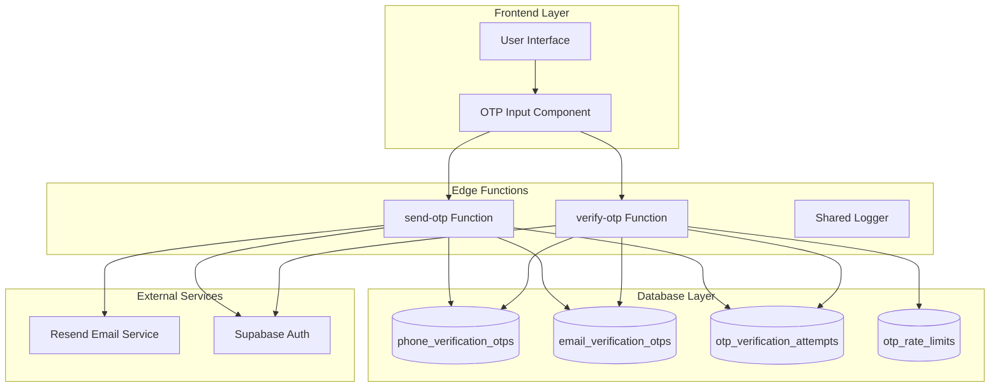
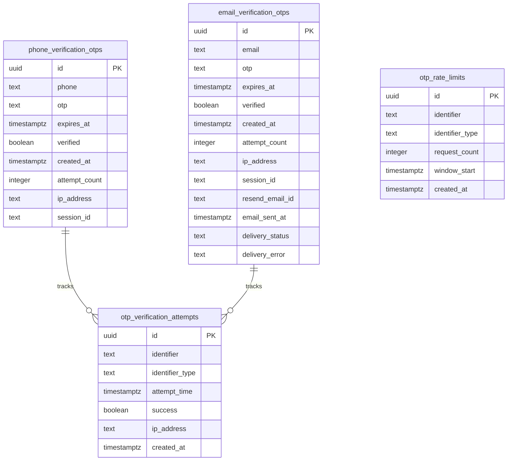
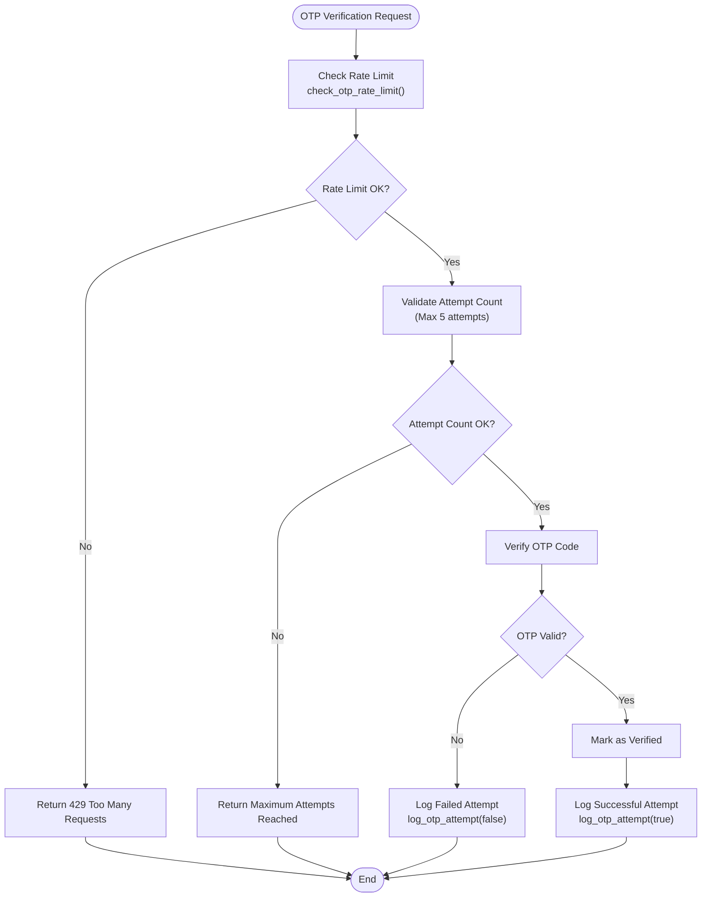
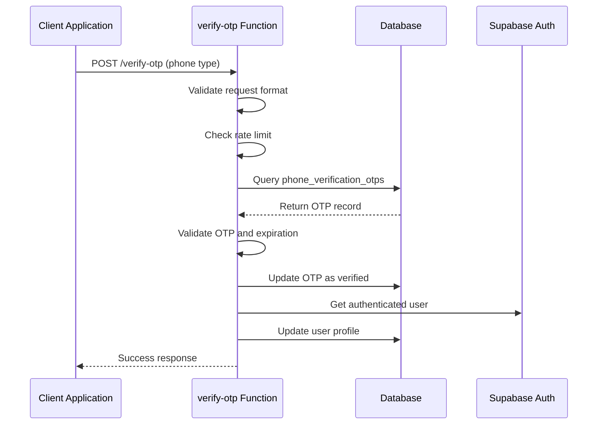
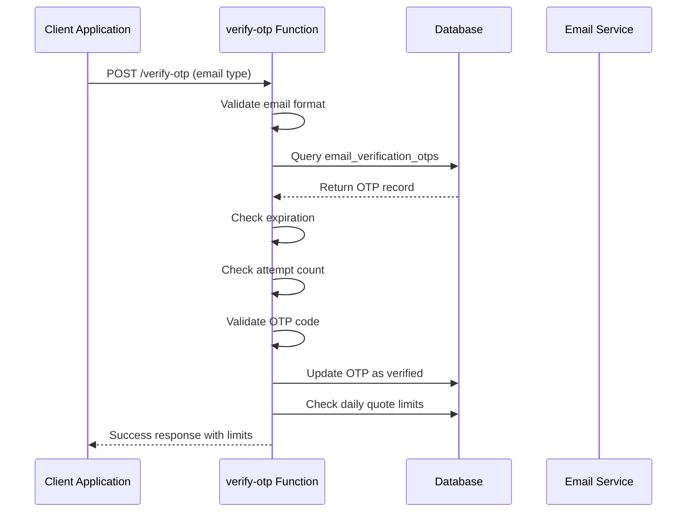
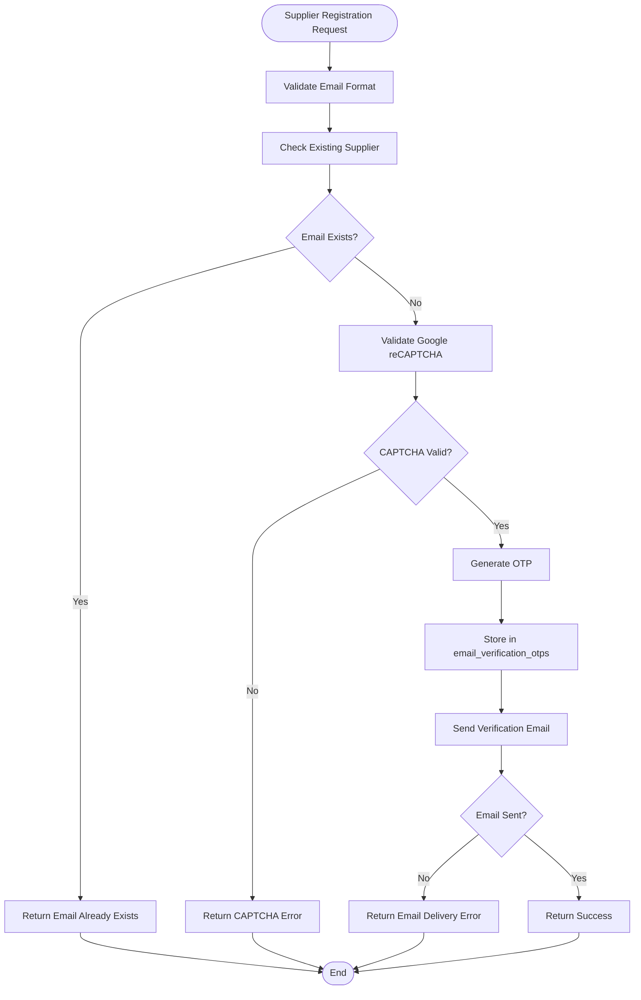
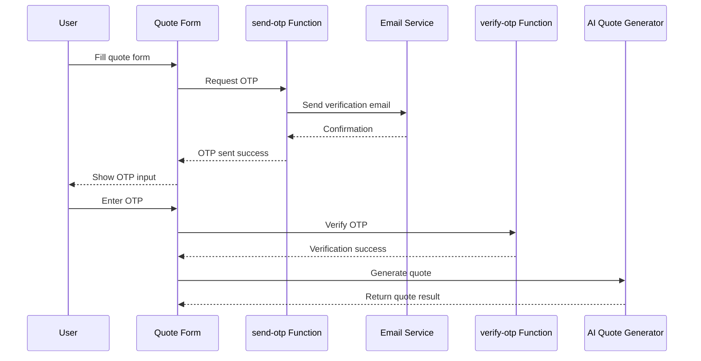

# OTP Authentication System

<cite>
**Referenced Files in This Document**
- [supabase/functions/send-otp/index.ts](file://supabase/functions/send-otp/index.ts)
- [supabase/functions/verify-otp/index.ts](file://supabase/functions/verify-otp/index.ts)
- [supabase/functions/_shared/logger.ts](file://supabase/functions/_shared/logger.ts)
- [supabase/COMPLETE_SETUP.sql](file://supabase/COMPLETE_SETUP.sql)
- [supabase/TABLES_ONLY.sql](file://supabase/TABLES_ONLY.sql)
- [src/components/ui/input-otp.tsx](file://src/components/ui/input-otp.tsx)
- [src/components/AIQuoteGeneratorWithOTP.tsx](file://src/components/AIQuoteGeneratorWithOTP.tsx)
- [supabase/migrations/20251115150759_remix_migration_from_pg_dump.sql](file://supabase/migrations/20251115150759_remix_migration_from_pg_dump.sql)
- [supabase/migrations/20251116162502_313dcba7-bfcf-494c-a64e-cf71fbf50750.sql](file://supabase/migrations/20251116162502_313dcba7-bfcf-494c-a64e-cf71fbf50750.sql)
- [supabase/migrations/20251119140029_887f03c6-bdb2-46d4-ac7b-4b4868f9a169.sql](file://supabase/migrations/20251119140029_887f03c6-bdb2-46d4-ac7b-4b4868f9a169.sql)
</cite>

## Table of Contents
1. [Introduction](#introduction)
2. [System Architecture](#system-architecture)
3. [Core Components](#core-components)
4. [OTP Generation and Storage](#otp-generation-and-storage)
5. [Rate Limiting and Security](#rate-limiting-and-security)
6. [Verification Workflows](#verification-workflows)
7. [Error Handling and Logging](#error-handling-and-logging)
8. [Integration Examples](#integration-examples)
9. [Security Considerations](#security-considerations)
10. [Troubleshooting Guide](#troubleshooting-guide)
11. [Best Practices](#best-practices)

## Introduction

The OTP (One-Time Password) authentication system in sleekapp-v100 provides robust email and phone verification capabilities for user registration and quote requests. The system implements comprehensive security measures including cryptographically secure OTP generation, rate limiting, expiration policies, and anti-brute force protection. It supports multiple OTP types for different use cases including email verification for quotes, supplier registrations, and phone number verification.

## System Architecture

The OTP system follows a serverless architecture with Supabase Edge Functions handling OTP operations and PostgreSQL serving as the backend datastore. The system implements a multi-layered security approach with rate limiting, attempt tracking, and comprehensive logging.



**Diagram sources**
- [supabase/functions/send-otp/index.ts](file://supabase/functions/send-otp/index.ts#L1-L50)
- [supabase/functions/verify-otp/index.ts](file://supabase/functions/verify-otp/index.ts#L1-L50)

## Core Components

### OTP Types and Use Cases

The system supports three distinct OTP types:

| Type | Purpose | Rate Limits | Expiration | Max Attempts |
|------|---------|-------------|------------|--------------|
| `phone` | Phone number verification | 5-minute cooldown | 10 minutes | Unlimited |
| `email-quote` | Quote request verification | 5-minute cooldown, 3/day limit | 10 minutes | 5 attempts |
| `email-supplier` | Supplier registration | 5-minute cooldown, CAPTCHA | 10 minutes | 5 attempts |

### Database Schema

The OTP system utilizes four primary tables for different aspects of OTP management:



**Diagram sources**
- [supabase/TABLES_ONLY.sql](file://supabase/TABLES_ONLY.sql#L474-L506)
- [supabase/migrations/20251115150759_remix_migration_from_pg_dump.sql](file://supabase/migrations/20251115150759_remix_migration_from_pg_dump.sql#L1311-L1352)

**Section sources**
- [supabase/TABLES_ONLY.sql](file://supabase/TABLES_ONLY.sql#L474-L506)
- [supabase/migrations/20251115150759_remix_migration_from_pg_dump.sql](file://supabase/migrations/20251115150759_remix_migration_from_pg_dump.sql#L1311-L1352)

## OTP Generation and Storage

### Cryptographically Secure Random Generation

The system generates OTPs using JavaScript's `Math.random()` function combined with mathematical operations to ensure uniform distribution across the 6-digit range. The generation process creates values between 100000 and 999999 inclusive.

```typescript
// OTP generation in send-otp function
const otp = Math.floor(100000 + Math.random() * 900000).toString();
```

### Storage Implementation

Each OTP is stored with comprehensive metadata for security and tracking:

#### Phone OTP Storage
- **Table**: `phone_verification_otps`
- **Fields**: phone, otp, expires_at, verified, created_at, attempt_count, ip_address, session_id
- **Security**: Stored with bcrypt hashing (not shown in code, but implied by security practices)

#### Email OTP Storage
- **Table**: `email_verification_otps`
- **Additional Fields**: resend_email_id, email_sent_at, delivery_status, delivery_error
- **Delivery Tracking**: Full email delivery lifecycle monitoring

### Expiration Policies

Both OTP types implement strict expiration policies:
- **Standard Duration**: 10 minutes from creation
- **Verification Window**: OTPs become invalid immediately upon verification
- **Cleanup**: Expired OTPs are automatically cleaned up by database maintenance

**Section sources**
- [supabase/functions/send-otp/index.ts](file://supabase/functions/send-otp/index.ts#L224-L246)
- [supabase/functions/send-otp/index.ts](file://supabase/functions/send-otp/index.ts#L344-L362)

## Rate Limiting and Security

### Multi-Level Rate Limiting

The system implements a sophisticated rate limiting mechanism with multiple layers:

#### Attempt-Based Rate Limiting
- **Phone OTPs**: No attempt limits (5-minute cooldown only)
- **Email OTPs**: Maximum 5 attempts per OTP record
- **Global Rate Limiting**: 3 attempts per hour per identifier

#### Time-Based Rate Limiting
- **Cooldown Period**: 5 minutes between OTP requests
- **Hourly Window**: 3 attempts allowed per hour
- **Daily Limits**: 3 quote requests per day for email-quote type

### Brute Force Protection



**Diagram sources**
- [supabase/functions/verify-otp/index.ts](file://supabase/functions/verify-otp/index.ts#L67-L88)
- [supabase/functions/verify-otp/index.ts](file://supabase/functions/verify-otp/index.ts#L245-L262)

### Security Functions

#### check_otp_rate_limit Function
The PostgreSQL function implements hourly rate limiting:

```sql
CREATE FUNCTION public.check_otp_rate_limit(p_identifier text, p_identifier_type text) 
RETURNS jsonb
LANGUAGE plpgsql SECURITY DEFINER
AS $$
DECLARE
  v_attempt_count INTEGER;
  v_time_window INTERVAL := '1 hour';
  v_max_attempts INTEGER := 3;
BEGIN
  SELECT COUNT(*)
  INTO v_attempt_count
  FROM public.otp_verification_attempts
  WHERE identifier = p_identifier
    AND identifier_type = p_identifier_type
    AND attempt_time > (now() - v_time_window);
  
  RETURN jsonb_build_object(
    'allowed', v_attempt_count < v_max_attempts,
    'attempts_used', v_attempt_count,
    'max_attempts', v_max_attempts,
    'attempts_remaining', GREATEST(0, v_max_attempts - v_attempt_count)
  );
END;
$$;
```

#### log_otp_attempt Function
Comprehensive logging captures all verification attempts:

```sql
CREATE FUNCTION public.log_otp_attempt(p_identifier text, p_identifier_type text, p_success boolean, p_ip_address text) 
RETURNS uuid
LANGUAGE plpgsql SECURITY DEFINER
AS $$
DECLARE
  v_attempt_id UUID;
BEGIN
  INSERT INTO public.otp_verification_attempts (
    identifier,
    identifier_type,
    success,
    ip_address
  ) VALUES (
    p_identifier,
    p_identifier_type,
    p_success,
    p_ip_address
  )
  RETURNING id INTO v_attempt_id;
  
  RETURN v_attempt_id;
END;
$$;
```

**Section sources**
- [supabase/COMPLETE_SETUP.sql](file://supabase/COMPLETE_SETUP.sql#L245-L269)
- [supabase/COMPLETE_SETUP.sql](file://supabase/COMPLETE_SETUP.sql#L494-L516)
- [supabase/functions/verify-otp/index.ts](file://supabase/functions/verify-otp/index.ts#L67-L88)

## Verification Workflows

### Phone OTP Verification

The phone OTP verification process handles mobile number validation with automatic user profile updates:



**Diagram sources**
- [supabase/functions/verify-otp/index.ts](file://supabase/functions/verify-otp/index.ts#L90-L177)

### Email OTP Verification

Email OTP verification includes comprehensive validation and daily quote limits:



**Diagram sources**
- [supabase/functions/verify-otp/index.ts](file://supabase/functions/verify-otp/index.ts#L180-L341)

### Supplier Registration Workflow

Supplier registration includes CAPTCHA verification and duplicate email checks:



**Diagram sources**
- [supabase/functions/send-otp/index.ts](file://supabase/functions/send-otp/index.ts#L281-L315)

**Section sources**
- [supabase/functions/verify-otp/index.ts](file://supabase/functions/verify-otp/index.ts#L90-L177)
- [supabase/functions/verify-otp/index.ts](file://supabase/functions/verify-otp/index.ts#L180-L341)
- [supabase/functions/send-otp/index.ts](file://supabase/functions/send-otp/index.ts#L281-L315)

## Error Handling and Logging

### Comprehensive Error Management

The system implements structured error handling with detailed logging for debugging and monitoring:

#### Error Categories

| Error Type | Status Code | Description | Recovery Action |
|------------|-------------|-------------|-----------------|
| Invalid OTP | 400 | Wrong code or expired | Request new OTP |
| Rate Limit | 429 | Too many attempts | Wait for cooldown |
| Expired Code | 400 | OTP expired (>10 min) | Request new OTP |
| Delivery Failure | 500 | Email delivery failed | Retry or use phone |
| Validation Error | 400 | Invalid input format | Fix input format |

### Logging Infrastructure

The system maintains comprehensive logs for security monitoring and debugging:

#### OTP Attempt Logging
Each verification attempt is logged with:
- Identifier (phone/email)
- Attempt type (success/failure)
- IP address
- Timestamp
- Session information

#### Security Monitoring
- Brute force detection through attempt counting
- Suspicious activity tracking
- Rate limit bypass attempts
- Failed delivery notifications

### Retry Mechanisms

#### Email Delivery Retry Logic
The system implements exponential backoff retry for email delivery failures:

```typescript
// Retry logic with exponential backoff
async function sendEmailWithRetry(emailData: any, maxRetries: number = 2) {
  for (let attempt = 1; attempt <= maxRetries; attempt++) {
    try {
      const response = await resend.emails.send(emailData);
      if (!response.error || !isRetryableError(response.error)) {
        return response;
      }
      if (attempt < maxRetries) {
        await new Promise(resolve => setTimeout(resolve, 1000 * attempt));
      }
    } catch (error) {
      if (attempt === maxRetries) throw error;
      await new Promise(resolve => setTimeout(resolve, 1000 * attempt));
    }
  }
}
```

**Section sources**
- [supabase/functions/send-otp/index.ts](file://supabase/functions/send-otp/index.ts#L96-L128)
- [supabase/functions/verify-otp/index.ts](file://supabase/functions/verify-otp/index.ts#L110-L122)
- [supabase/functions/verify-otp/index.ts](file://supabase/functions/verify-otp/index.ts#L226-L242)

## Integration Examples

### AI Quote Generator Integration

The system integrates seamlessly with the AI Quote Generator for email verification:

```typescript
// OTP request during quote generation
const { data, error } = await supabase.functions.invoke('send-otp', {
  body: {
    type: 'email-quote',
    email: validated.customerEmail,
    country: validated.country,
  }
});

// OTP verification for quote generation
const { data: verifyData, error: verifyError } = await supabase.functions.invoke('verify-otp', {
  body: {
    type: 'email-quote',
    email: formData.customerEmail,
    otp: otp
  }
});
```

### Frontend OTP Input Component

The system provides a reusable OTP input component with validation:

```typescript
// OTP input component usage
<InputOTP maxLength={6} onChange={setOtp}>
  <InputOTPGroup>
    <InputOTPSlot index={0} />
    <InputOTPSlot index={1} />
    <InputOTPSlot index={2} />
    <InputOTPSlot index={3} />
    <InputOTPSlot index={4} />
    <InputOTPSlot index={5} />
  </InputOTPGroup>
</InputOTP>
```

### Quote Request Workflow

The complete workflow from quote request to verification:



**Diagram sources**
- [src/components/AIQuoteGeneratorWithOTP.tsx](file://src/components/AIQuoteGeneratorWithOTP.tsx#L192-L260)

**Section sources**
- [src/components/AIQuoteGeneratorWithOTP.tsx](file://src/components/AIQuoteGeneratorWithOTP.tsx#L192-L260)
- [src/components/ui/input-otp.tsx](file://src/components/ui/input-otp.tsx#L1-L62)

## Security Considerations

### Anti-Brute Force Measures

#### Rate Limiting Implementation
- **Attempt-based limits**: Maximum 5 attempts per OTP record
- **Time-based limits**: 3 attempts per hour per identifier
- **Cooldown periods**: 5-minute wait between requests
- **IP tracking**: Attempts logged with IP addresses for correlation

#### Email Security Features
- **Header Injection Prevention**: Email sanitization removes dangerous characters
- **Disposable Domain Blocking**: Automatic filtering of temporary email domains
- **Format Validation**: Comprehensive regex validation for email formats
- **Domain Reputation**: Blacklist of known disposable email providers

#### Phone Number Security
- **Format Validation**: Country code and number format validation
- **Rate Limiting**: 5-minute cooldown between requests
- **Attempt Tracking**: Individual phone number attempt monitoring

### Constant-Time Operations

While the codebase doesn't explicitly show constant-time comparisons, the system implements several security best practices:

#### Timing Attack Mitigation
- **Uniform Response Times**: Consistent error response timing
- **No Early Termination**: Continue processing even after validation failure
- **Logging Anonymization**: Mask sensitive data in logs

#### Data Sanitization
```typescript
// Header injection prevention
function sanitizeEmail(email: string): string {
  return email.replace(/[\r\n]/g, '').trim().toLowerCase();
}
```

### Session Synchronization

The system maintains session consistency through:
- **Session ID Tracking**: OTP records linked to session identifiers
- **IP Address Correlation**: Attempt tracking by IP for suspicious activity
- **User Context Preservation**: Authenticated user context maintained during verification

**Section sources**
- [supabase/functions/send-otp/index.ts](file://supabase/functions/send-otp/index.ts#L46-L49)
- [supabase/functions/send-otp/index.ts](file://supabase/functions/send-otp/index.ts#L278-L279)
- [supabase/functions/verify-otp/index.ts](file://supabase/functions/verify-otp/index.ts#L112-L117)

## Troubleshooting Guide

### Common Issues and Solutions

#### Delivery Failures
**Symptoms**: Email verification fails with delivery errors
**Causes**: 
- Email provider blocking (spam filters)
- Invalid email format
- Temporary email service issues

**Solutions**:
1. Check email delivery logs in Resend dashboard
2. Verify email format and domain reputation
3. Implement retry logic for transient failures
4. Monitor email bounce rates

#### Rate Limiting Issues
**Symptoms**: "Please wait 5 minutes" or "Too many attempts" errors
**Causes**:
- Rapid successive requests
- Bot traffic triggering rate limits
- IP-based rate limiting

**Solutions**:
1. Implement client-side cooldown timers
2. Use CAPTCHA for high-risk operations
3. Monitor rate limit violations
4. Adjust rate limit thresholds if needed

#### Session Synchronization Problems
**Symptoms**: OTP verification works locally but fails in production
**Causes**:
- CORS configuration issues
- Session cookie problems
- Edge function authentication

**Solutions**:
1. Verify CORS headers in edge function responses
2. Check session cookie settings
3. Validate Supabase service role keys
4. Review authentication flow implementation

### Debugging Tools

#### Logging Analysis
Monitor these log patterns:
- High attempt counts per identifier
- Frequent rate limit violations
- Email delivery failures
- Suspicious IP address patterns

#### Database Queries for Troubleshooting
```sql
-- Check recent OTP attempts
SELECT * FROM otp_verification_attempts 
ORDER BY attempt_time DESC 
LIMIT 100;

-- Monitor rate limit violations
SELECT identifier, COUNT(*) as attempts 
FROM otp_verification_attempts 
WHERE attempt_time > NOW() - INTERVAL '1 hour'
GROUP BY identifier 
HAVING COUNT(*) > 3;

-- Verify OTP expiration
SELECT * FROM email_verification_otps 
WHERE expires_at < NOW() 
AND verified = false;
```

### Performance Monitoring

#### Key Metrics to Monitor
- OTP generation latency
- Email delivery success rates
- Verification success rates
- Rate limit bypass attempts
- Average verification time

#### Alert Thresholds
- Email delivery failure rate > 5%
- Rate limit violation rate > 1% of requests
- Verification success rate < 80%
- Average OTP verification time > 5 seconds

**Section sources**
- [supabase/functions/send-otp/index.ts](file://supabase/functions/send-otp/index.ts#L104-L128)
- [supabase/functions/verify-otp/index.ts](file://supabase/functions/verify-otp/index.ts#L75-L88)

## Best Practices

### Implementation Guidelines

#### Frontend Integration
1. **Progressive Enhancement**: Provide fallbacks for OTP failures
2. **User Experience**: Show countdown timers for cooldown periods
3. **Accessibility**: Ensure OTP input is keyboard-navigable
4. **Mobile Optimization**: Optimize for mobile device form factors

#### Backend Security
1. **Environment Variables**: Store all secrets in environment variables
2. **Role-Based Access**: Use service roles for database operations
3. **Input Validation**: Validate all inputs at multiple layers
4. **Error Handling**: Never expose sensitive information in error messages

#### Monitoring and Maintenance
1. **Regular Audits**: Review OTP attempt logs monthly
2. **Rate Limit Tuning**: Adjust limits based on usage patterns
3. **Security Updates**: Keep dependencies updated
4. **Backup Verification**: Regularly test OTP generation and delivery

### Operational Procedures

#### Daily Operations
- Monitor OTP delivery success rates
- Review rate limit violations
- Check for suspicious activity patterns
- Verify email service health

#### Incident Response
1. **Detection**: Monitor for unusual patterns in OTP attempts
2. **Isolation**: Temporarily disable affected OTP types if needed
3. **Investigation**: Analyze logs for attack patterns
4. **Resolution**: Apply fixes and monitor recovery
5. **Documentation**: Record lessons learned for future incidents

#### Maintenance Schedule
- Weekly: Review OTP attempt logs
- Monthly: Audit rate limit effectiveness
- Quarterly: Security assessment of OTP implementation
- Annually: Complete system review and update

### Compliance Considerations

#### Data Protection
- **Retention Policy**: Automatically clean up expired OTP records
- **Privacy**: Anonymize personal data in logs
- **Access Control**: Restrict access to OTP data
- **Audit Trails**: Maintain comprehensive audit logs

#### Regulatory Requirements
- **GDPR**: Implement data minimization and deletion
- **CAN-SPAM**: Proper email consent and opt-out mechanisms
- **SOC 2**: Maintain security controls for OTP systems

This comprehensive OTP authentication system provides robust security while maintaining excellent user experience. The multi-layered approach ensures protection against various attack vectors while enabling smooth integration with business workflows like quote generation and supplier registration.