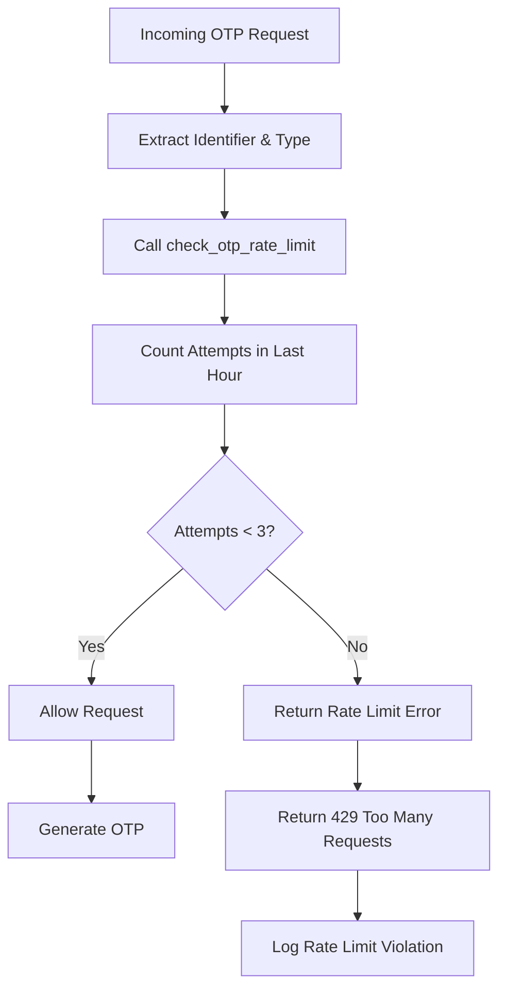
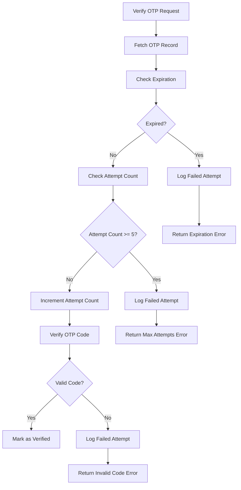
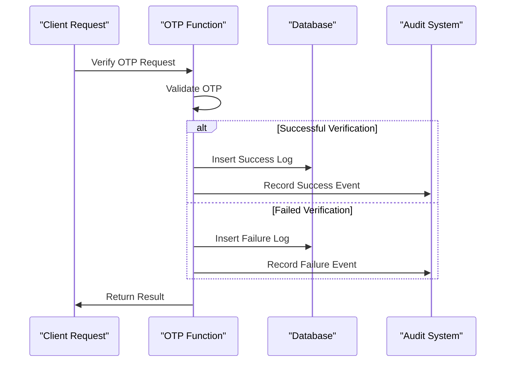
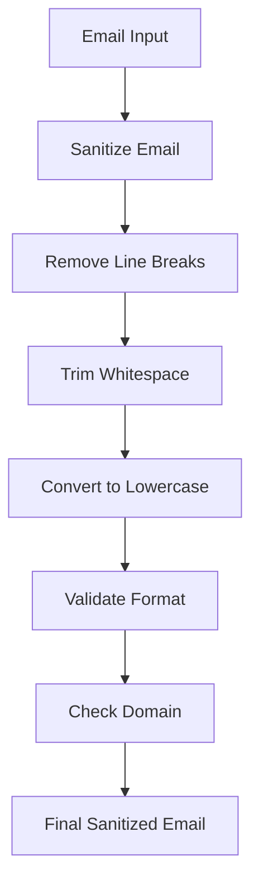

# OTP Security Mechanisms

<cite>
**Referenced Files in This Document**
- [send-otp/index.ts](file://supabase/functions/send-otp/index.ts)
- [verify-otp/index.ts](file://supabase/functions/verify-otp/index.ts)
- [email-service/index.ts](file://supabase/functions/email-service/index.ts)
- [password-breach-check/index.ts](file://supabase/functions/password-breach-check/index.ts)
- [bootstrap-admin/index.ts](file://supabase/functions/bootstrap-admin/index.ts)
- [COMPLETE_SETUP.sql](file://supabase/COMPLETE_SETUP.sql)
- [TABLES_ONLY.sql](file://supabase/TABLES_ONLY.sql)
- [JoinSupplier.tsx](file://src/pages/JoinSupplier.tsx)
- [ai-quote-generator/index.ts](file://supabase/functions/ai-quote-generator/index.ts)
- [ai-conversational-quote/index.ts](file://supabase/functions/ai-conversational-quote/index.ts)
</cite>

## Table of Contents
1. [Introduction](#introduction)
2. [Rate Limiting Implementation](#rate-limiting-implementation)
3. [Brute Force Protection](#brute-force-protection)
4. [Secure Logging System](#secure-logging-system)
5. [Database Schema](#database-schema)
6. [Additional Security Measures](#additional-security-measures)
7. [Error Handling and Response Codes](#error-handling-and-response-codes)
8. [Troubleshooting Guide](#troubleshooting-guide)
9. [Best Practices](#best-practices)
10. [Conclusion](#conclusion)

## Introduction

The sleekapp-v100 OTP (One-Time Password) security system implements comprehensive protection mechanisms to prevent abuse while maintaining user convenience. The system employs multiple layers of security including rate limiting, brute force protection, secure logging, and various anti-abuse measures to ensure the integrity of the verification process.

The OTP system supports three verification types: phone verification, email quote requests, and supplier registrations, each with tailored security measures appropriate for their specific use cases.

## Rate Limiting Implementation

### check_otp_rate_limit Function

The core rate limiting mechanism is implemented through the `check_otp_rate_limit` PostgreSQL function, which enforces a maximum of 3 verification attempts per hour per identifier (phone or email).

**Diagram sources**
- [verify-otp/index.ts](file://supabase/functions/verify-otp/index.ts#L67-L88)
- [COMPLETE_SETUP.sql](file://supabase/COMPLETE_SETUP.sql#L245-L270)

#### Function Implementation Details

The rate limiting function tracks attempts using the `otp_verification_attempts` table and implements the following logic:

- **Time Window**: 1-hour sliding window
- **Maximum Attempts**: 3 attempts per identifier per hour
- **Identifier Types**: Supports both phone and email identifiers
- **Response Format**: Returns JSONB with attempt statistics

**Section sources**
- [verify-otp/index.ts](file://supabase/functions/verify-otp/index.ts#L67-L88)
- [COMPLETE_SETUP.sql](file://supabase/COMPLETE_SETUP.sql#L245-L270)

### Phone OTP Rate Limiting

Phone verification implements additional rate limiting to prevent SMS spam:

- **Cooldown Period**: 5 minutes between consecutive requests
- **Implementation**: Checks for recent OTPs within the 5-minute window
- **Response**: Returns 429 status with retry-after information

**Section sources**
- [send-otp/index.ts](file://supabase/functions/send-otp/index.ts#L205-L222)

### Email OTP Rate Limiting

Email verification includes separate rate limiting mechanisms:

- **General Email Requests**: 5-minute cooldown between requests
- **Quote Requests**: Daily limit of 3 quotes per email address
- **Supplier Registration**: CAPTCHA verification for bot protection

**Section sources**
- [send-otp/index.ts](file://supabase/functions/send-otp/index.ts#L297-L341)

## Brute Force Protection

### Attempt Limits per OTP Record

Each OTP record implements a strict attempt limit to prevent brute force attacks:

**Diagram sources**
- [verify-otp/index.ts](file://supabase/functions/verify-otp/index.ts#L226-L262)

#### OTP Expiration Control

- **Expiration Duration**: 10 minutes from creation
- **Verification Window**: OTPs can only be verified within the expiration period
- **Automatic Cleanup**: Expired OTPs are automatically cleaned up by the system

#### Maximum Attempts Per OTP

- **Limit**: 5 attempts per OTP record
- **Enforcement**: Each failed verification increments the attempt counter
- **Protection**: Once limit is reached, the OTP becomes permanently invalid

**Section sources**
- [verify-otp/index.ts](file://supabase/functions/verify-otp/index.ts#L226-L262)

### Cooldown Between Code Requests

The system implements intelligent cooldown mechanisms:

- **Phone OTPs**: 5-minute cooldown between requests
- **Email OTPs**: 5-minute cooldown between requests
- **Implementation**: Prevents rapid-fire attack attempts

**Section sources**
- [send-otp/index.ts](file://supabase/functions/send-otp/index.ts#L205-L222)
- [send-otp/index.ts](file://supabase/functions/send-otp/index.ts#L297-L314)

## Secure Logging System

### log_otp_attempt Function

The OTP verification system maintains comprehensive audit logs through the `log_otp_attempt` function, recording all verification attempts for security monitoring and compliance.

**Diagram sources**
- [verify-otp/index.ts](file://supabase/functions/verify-otp/index.ts#L111-L117)
- [verify-otp/index.ts](file://supabase/functions/verify-otp/index.ts#L229-L234)
- [verify-otp/index.ts](file://supabase/functions/verify-otp/index.ts#L300-L313)

#### Logging Fields

The audit system records the following information for each attempt:

- **Identifier**: Phone number or email address
- **Identifier Type**: Phone or email
- **Success Status**: Boolean indicating verification outcome
- **IP Address**: Client IP address for correlation
- **Timestamp**: Attempt time for temporal analysis
- **Attempt ID**: Unique identifier for audit correlation

#### Audit Trail Benefits

- **Security Monitoring**: Tracks suspicious patterns and attack attempts
- **Compliance**: Maintains required audit trails for regulatory compliance
- **Forensics**: Enables investigation of security incidents
- **Rate Limiting**: Provides data for adaptive security measures

**Section sources**
- [verify-otp/index.ts](file://supabase/functions/verify-otp/index.ts#L111-L117)
- [verify-otp/index.ts](file://supabase/functions/verify-otp/index.ts#L229-L234)
- [verify-otp/index.ts](file://supabase/functions/verify-otp/index.ts#L300-L313)

## Database Schema

### Core OTP Tables

The OTP system utilizes several specialized tables designed for security and performance:

#### phone_verification_otps Table

| Column | Type | Constraints | Purpose |
|--------|------|-------------|---------|
| id | UUID | PRIMARY KEY | Unique identifier |
| phone | TEXT | NOT NULL | Target phone number |
| otp | TEXT | NOT NULL | Generated verification code |
| expires_at | TIMESTAMP WITH TIME ZONE | NOT NULL | Expiration timestamp |
| verified | BOOLEAN | DEFAULT false | Verification status |
| created_at | TIMESTAMP WITH TIME ZONE | DEFAULT now() | Creation timestamp |
| attempt_count | INTEGER | DEFAULT 0 | Failed attempt counter |
| ip_address | TEXT | NULLABLE | Client IP address |
| session_id | TEXT | NULLABLE | Session correlation |

#### email_verification_otps Table

| Column | Type | Constraints | Purpose |
|--------|------|-------------|---------|
| id | UUID | PRIMARY KEY | Unique identifier |
| email | TEXT | NOT NULL | Target email address |
| otp | TEXT | NOT NULL | Generated verification code |
| expires_at | TIMESTAMP WITH TIME ZONE | NOT NULL | Expiration timestamp |
| verified | BOOLEAN | DEFAULT false | Verification status |
| created_at | TIMESTAMP WITH TIME ZONE | DEFAULT now() | Creation timestamp |
| attempt_count | INTEGER | DEFAULT 0 | Failed attempt counter |
| delivery_status | TEXT | DEFAULT 'pending' | Email delivery status |
| resend_email_id | TEXT | NULLABLE | Resend API email ID |
| email_sent_at | TIMESTAMP WITH TIME ZONE | NULLABLE | Delivery timestamp |
| delivery_error | TEXT | NULLABLE | Error details |

#### otp_verification_attempts Table

| Column | Type | Constraints | Purpose |
|--------|------|-------------|---------|
| id | UUID | PRIMARY KEY | Unique attempt identifier |
| identifier | TEXT | NOT NULL | Target identifier |
| identifier_type | TEXT | NOT NULL | Phone or email |
| attempt_time | TIMESTAMP WITH TIME ZONE | DEFAULT now() | Attempt timestamp |
| success | BOOLEAN | DEFAULT false | Verification result |
| ip_address | TEXT | NULLABLE | Client IP address |
| created_at | TIMESTAMP WITH TIME ZONE | DEFAULT now() | Audit timestamp |

**Section sources**
- [TABLES_ONLY.sql](file://supabase/TABLES_ONLY.sql#L487-L506)
- [TABLES_ONLY.sql](file://supabase/TABLES_ONLY.sql#L474-L495)

### Indexes and Performance

The database schema includes strategic indexes for optimal performance:

- **Delivery Status Index**: `idx_email_verification_delivery_status` for email delivery monitoring
- **Resend ID Index**: `idx_email_verification_resend_id` for webhook processing
- **Attempt Tracking**: Composite indexes on attempt logging tables

**Section sources**
- [COMPLETE_SETUP.sql](file://supabase/COMPLETE_SETUP.sql#L6683-L6705)

## Additional Security Measures

### Header Injection Prevention

The system implements comprehensive email header injection prevention:

**Diagram sources**
- [send-otp/index.ts](file://supabase/functions/send-otp/index.ts#L47-L49)

#### Sanitization Process

- **Character Removal**: Strips `\r` and `\n` characters
- **Whitespace Handling**: Trims leading/trailing spaces
- **Case Normalization**: Converts to lowercase for consistency
- **Format Validation**: Ensures RFC-compliant email format

**Section sources**
- [send-otp/index.ts](file://supabase/functions/send-otp/index.ts#L47-L49)

### Disposable Email Domain Blocking

The system maintains a comprehensive blacklist of disposable email domains:

#### Blocked Domains List

- tempmail.com, throwaway.email, 10minutemail.com, guerrillamail.com
- mailinator.com, maildrop.cc, trashmail.com, yopmail.com
- temp-mail.org, fakeinbox.com, sharklasers.com, getnada.com

#### Validation Process

- **Domain Extraction**: Parses email to extract domain portion
- **Blacklist Matching**: Compares against blocked domain list
- **Error Reporting**: Provides clear error messages for blocked domains

**Section sources**
- [send-otp/index.ts](file://supabase/functions/send-otp/index.ts#L18-L23)
- [email-service/index.ts](file://supabase/functions/email-service/index.ts#L15-L20)

### reCAPTCHA Integration

Supplier registration includes Google reCAPTCHA v3 for bot protection:

#### Implementation Details

- **CAPTCHA Verification**: Validates token with Google's servers
- **Score Threshold**: Configurable threshold for automated detection
- **Error Handling**: Graceful degradation when CAPTCHA fails
- **Logging**: Records verification attempts and failures

**Section sources**
- [send-otp/index.ts](file://supabase/functions/send-otp/index.ts#L154-L187)
- [JoinSupplier.tsx](file://src/pages/JoinSupplier.tsx#L127-L147)

### Email Delivery Tracking

Advanced email delivery tracking provides enhanced reliability:

#### Delivery Status Monitoring

- **Pending**: Initial state after email generation
- **Sent**: Successfully delivered via Resend API
- **Failed**: Delivery errors with detailed error messages
- **Bounced**: Email returned undeliverable
- **Delivered**: Confirmed delivery (via Resend webhooks)

#### Error Recovery

- **Retry Logic**: Automatic retry for transient failures
- **Exponential Backoff**: Implements exponential delay between retries
- **Fallback Handling**: Graceful degradation for persistent failures

**Section sources**
- [send-otp/index.ts](file://supabase/functions/send-otp/index.ts#L104-L129)
- [send-otp/index.ts](file://supabase/functions/send-otp/index.ts#L403-L478)

## Error Handling and Response Codes

### Standard HTTP Response Codes

The OTP system implements comprehensive error handling with appropriate HTTP status codes:

#### Rate Limiting Responses

- **429 Too Many Requests**: Returned when rate limits are exceeded
- **Custom Headers**: Includes `retry-after` header with cooldown duration
- **Descriptive Messages**: Clear error messages explaining the limitation

#### Verification Errors

- **400 Bad Request**: Invalid OTP format or expired codes
- **401 Unauthorized**: Authentication failures
- **404 Not Found**: Non-existent OTP records
- **500 Internal Server Error**: System failures

#### Security Responses

- **403 Forbidden**: Origin validation failures
- **400 Bad Request**: Malformed requests or validation failures

**Section sources**
- [verify-otp/index.ts](file://supabase/functions/verify-otp/index.ts#L78-L87)
- [send-otp/index.ts](file://supabase/functions/send-otp/index.ts#L215-L221)

### Information Leakage Prevention

The system implements careful error message handling to prevent information leakage:

#### Error Message Strategy

- **Generic Messages**: Vague error descriptions to prevent enumeration
- **Specific Logging**: Detailed logs for administrators without exposing to users
- **Consistent Responses**: Standardized error formats across all endpoints

#### Security Considerations

- **Timing Attacks**: Constant-time comparisons for tokens
- **Error Timing**: Consistent response times regardless of error type
- **Log Sanitization**: Removes sensitive data from log entries

**Section sources**
- [password-breach-check/index.ts](file://supabase/functions/password-breach-check/index.ts#L71-L94)
- [ai-quote-generator/index.ts](file://supabase/functions/ai-quote-generator/index.ts#L188-L194)

## Troubleshooting Guide

### Common Issues and Solutions

#### Rate Limit Exceeded

**Symptoms**: Users receive 429 errors when requesting OTPs
**Causes**: 
- Exceeded hourly attempt limits
- Rapid successive requests
- Bot-like behavior detection

**Solutions**:
- Implement client-side exponential backoff
- Increase rate limit thresholds for legitimate users
- Review user behavior patterns for potential abuse

#### OTP Verification Failures

**Symptoms**: Valid OTPs rejected with "Invalid or expired" messages
**Causes**:
- Attempt count exceeded (5 attempts)
- OTP expired (10 minutes)
- Database synchronization delays

**Solutions**:
- Verify attempt count before rejection
- Check system clock synchronization
- Monitor database performance

#### Email Delivery Issues

**Symptoms**: OTP emails not received despite successful API responses
**Causes**:
- Disposable domain blocking
- Email provider filtering
- Network connectivity issues

**Solutions**:
- Verify email domain whitelist
- Check spam filters
- Implement delivery status monitoring

#### CAPTCHA Verification Failures

**Symptoms**: Supplier registration blocked with CAPTCHA errors
**Causes**:
- Missing or invalid reCAPTCHA secret key
- Network connectivity to Google's servers
- Suspicious user behavior triggering CAPTCHA

**Solutions**:
- Verify reCAPTCHA configuration
- Implement fallback verification methods
- Monitor CAPTCHA success rates

**Section sources**
- [send-otp/index.ts](file://supabase/functions/send-otp/index.ts#L154-L187)
- [verify-otp/index.ts](file://supabase/functions/verify-otp/index.ts#L226-L262)

### Monitoring and Alerting

#### Key Metrics to Monitor

- **Rate Limit Violations**: Number of 429 responses
- **OTP Verification Success Rate**: Percentage of successful verifications
- **Email Delivery Success Rate**: Percentage of delivered emails
- **Attempt Distribution**: Analysis of attempt patterns
- **Error Rates**: Breakdown of different error types

#### Alerting Thresholds

- **Rate Limit Exceedances**: Immediate alerts for repeated violations
- **High Error Rates**: Automated notifications for increased error rates
- **Suspicious Patterns**: Behavioral analysis for potential attacks
- **System Health**: Database and external service availability

## Best Practices

### Implementation Guidelines

#### Secure OTP Generation

- **Randomness**: Use cryptographically secure random number generators
- **Length**: Maintain minimum 6-digit OTP length
- **Characters**: Use alphanumeric characters for better entropy
- **Uniqueness**: Ensure OTP uniqueness within the validity period

#### Storage Security

- **Encryption**: Encrypt sensitive data at rest
- **Retention**: Implement automatic cleanup of expired OTPs
- **Access Control**: Restrict database access to service accounts only
- **Audit Trails**: Maintain comprehensive logging for security reviews

#### Client-Side Considerations

- **Timeout Handling**: Implement proper timeout management
- **User Experience**: Provide clear error messages without revealing system internals
- **Retry Logic**: Implement exponential backoff for failed requests
- **Progress Indication**: Show loading states during OTP processing

### Operational Security

#### Regular Maintenance

- **Log Rotation**: Implement automated log rotation and archival
- **Database Cleanup**: Regular cleanup of expired OTP records
- **Performance Monitoring**: Monitor query performance and optimize indexes
- **Security Audits**: Regular security reviews of OTP implementation

#### Incident Response

- **Detection**: Implement real-time monitoring for suspicious patterns
- **Containment**: Isolate affected systems during security incidents
- **Recovery**: Establish procedures for system restoration
- **Lessons Learned**: Conduct post-incident reviews for improvement

## Conclusion

The sleekapp-v100 OTP security system provides robust protection against various attack vectors while maintaining usability for legitimate users. Through comprehensive rate limiting, brute force protection, secure logging, and multiple layers of validation, the system effectively mitigates common security threats.

Key strengths of the implementation include:

- **Multi-layered Protection**: Combines rate limiting, attempt limits, and behavioral analysis
- **Comprehensive Logging**: Maintains detailed audit trails for security monitoring
- **Flexible Configuration**: Allows adjustment of security parameters based on operational needs
- **Robust Error Handling**: Provides clear error messages while preventing information leakage
- **Performance Optimization**: Uses indexes and caching to maintain system responsiveness

The system's modular design allows for easy extension and adaptation to changing security requirements, making it suitable for production environments requiring high security standards.

Future enhancements could include machine learning-based anomaly detection, adaptive rate limiting based on user behavior, and enhanced multi-factor authentication capabilities to further strengthen the security posture.