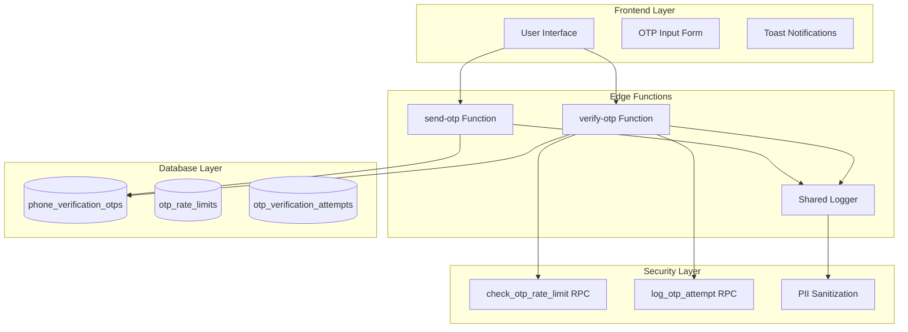
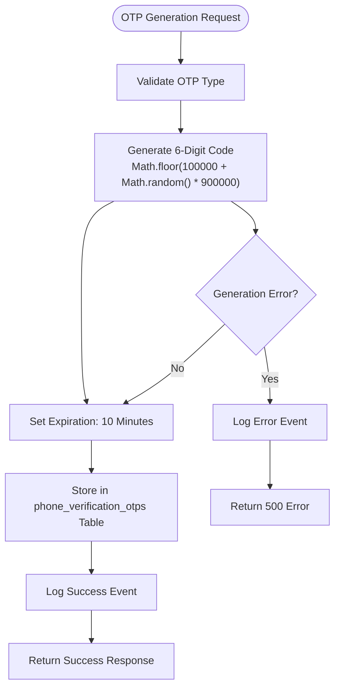
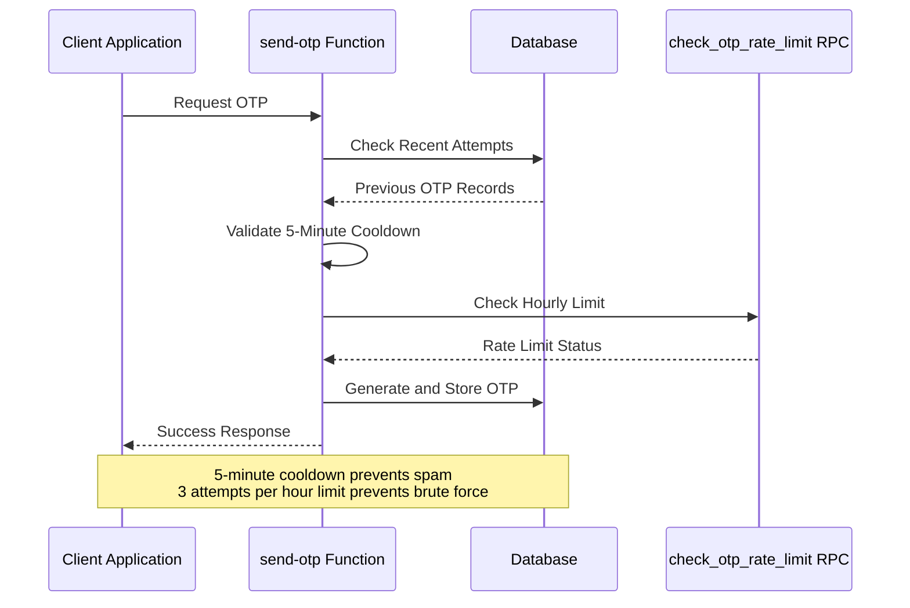
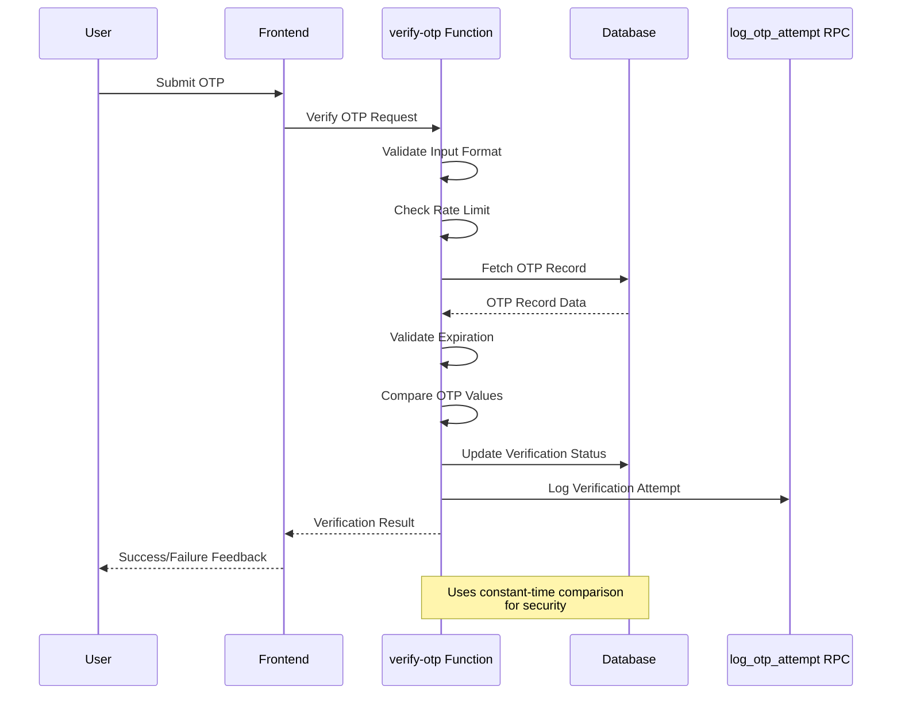
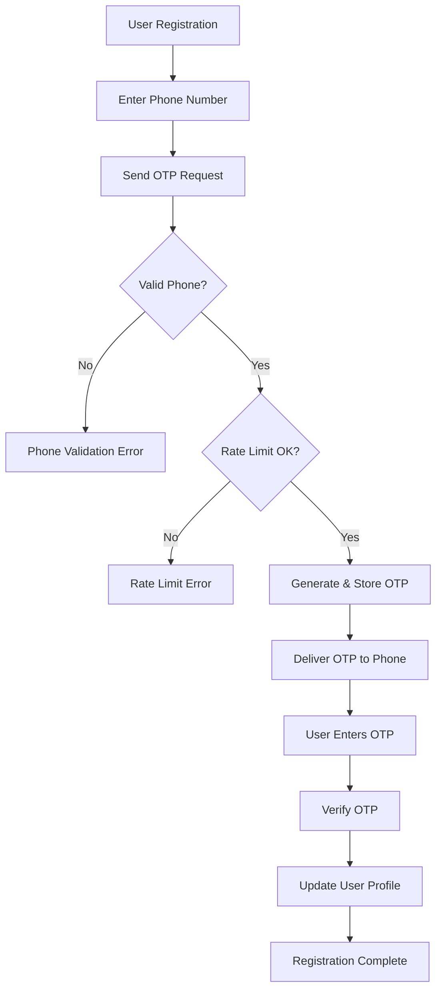

# Phone Verification System

<cite>
**Referenced Files in This Document**
- [send-otp/index.ts](file://supabase/functions/send-otp/index.ts)
- [verify-otp/index.ts](file://supabase/functions/verify-otp/index.ts)
- [logger.ts](file://supabase/functions/_shared/logger.ts)
- [input-otp.tsx](file://src/components/ui/input-otp.tsx)
- [Auth.tsx](file://src/pages/Auth.tsx)
- [AIQuoteGeneratorWithOTP.tsx](file://src/components/AIQuoteGeneratorWithOTP.tsx)
- [TABLES_ONLY.sql](file://supabase/TABLES_ONLY.sql)
- [check_otp_rate_limit.sql](file://supabase/CHECK_OTP_RATE_LIMIT.sql)
- [log_otp_attempt.sql](file://supabase/LOG_OTP_ATTEMPT.sql)
</cite>

## Table of Contents
1. [Introduction](#introduction)
2. [System Architecture](#system-architecture)
3. [OTP Generation and Storage](#otp-generation-and-storage)
4. [Rate Limiting and Security](#rate-limiting-and-security)
5. [Verification Workflow](#verification-workflow)
6. [Integration Patterns](#integration-patterns)
7. [Error Handling and Status Codes](#error-handling-and-status-codes)
8. [Security Considerations](#security-considerations)
9. [Troubleshooting Guide](#troubleshooting-guide)
10. [Best Practices](#best-practices)

## Introduction

The phone verification system in sleekapp-v100 provides robust two-factor authentication capabilities for phone-based user verification. This system implements comprehensive security measures including rate limiting, time-based expiration, and constant-time comparison principles to protect against brute force attacks and ensure reliable user authentication.

The system supports multiple verification scenarios including user registration, quote requests, and supplier onboarding, with specialized workflows for each use case. It integrates seamlessly with Supabase's edge functions architecture and provides real-time feedback for user experience optimization.

## System Architecture

The phone verification system consists of several interconnected components that work together to provide secure and reliable OTP (One-Time Password) functionality.

**Diagram sources**
- [send-otp/index.ts](file://supabase/functions/send-otp/index.ts#L1-L489)
- [verify-otp/index.ts](file://supabase/functions/verify-otp/index.ts#L1-L356)
- [logger.ts](file://supabase/functions/_shared/logger.ts#L1-L173)

**Section sources**
- [send-otp/index.ts](file://supabase/functions/send-otp/index.ts#L1-L50)
- [verify-otp/index.ts](file://supabase/functions/verify-otp/index.ts#L1-L50)

## OTP Generation and Storage

### OTP Generation Process

The system generates 6-digit numeric codes using JavaScript's `Math.random()` function combined with mathematical transformations to ensure uniform distribution across the valid OTP range.

**Diagram sources**
- [send-otp/index.ts](file://supabase/functions/send-otp/index.ts#L224-L249)

### Database Storage Structure

The OTP data is stored in the `phone_verification_otps` table with comprehensive tracking capabilities:

| Column | Type | Purpose | Constraints |
|--------|------|---------|-------------|
| `id` | UUID | Unique identifier | Primary Key |
| `phone` | TEXT | Target phone number | Not Null |
| `otp` | TEXT | Generated verification code | Not Null |
| `expires_at` | TIMESTAMPTZ | Code expiration time | Not Null |
| `verified` | BOOLEAN | Verification status | Default: false |
| `created_at` | TIMESTAMPTZ | Record creation time | Default: now() |
| `attempt_count` | INTEGER | Number of verification attempts | Default: 0 |
| `ip_address` | TEXT | Client IP address | Nullable |
| `session_id` | TEXT | Session identifier | Nullable |

**Section sources**
- [send-otp/index.ts](file://supabase/functions/send-otp/index.ts#L229-L236)
- [TABLES_ONLY.sql](file://supabase/TABLES_ONLY.sql#L496-L506)

## Rate Limiting and Security

### Multi-Level Rate Limiting

The system implements sophisticated rate limiting mechanisms to prevent abuse and protect against brute force attacks.

**Diagram sources**
- [send-otp/index.ts](file://supabase/functions/send-otp/index.ts#L205-L222)
- [verify-otp/index.ts](file://supabase/functions/verify-otp/index.ts#L67-L88)

### Rate Limiting Implementation Details

#### 5-Minute Cooldown Period
- **Purpose**: Prevents SMS spam and excessive API calls
- **Implementation**: Checks for existing unexpired OTPs within the last 5 minutes
- **Response**: Returns HTTP 429 with retry-after header when limit exceeded

#### 3 Attempts Per Hour (Verification Level)
- **Purpose**: Protects against brute force attacks during verification
- **Implementation**: Uses PostgreSQL stored procedure `check_otp_rate_limit`
- **Parameters**: `p_identifier`, `p_identifier_type`
- **Response**: Returns rate limit status in JSON format

#### 5 Attempts Per OTP Record (Verification Level)
- **Purpose**: Limits individual OTP attack surface
- **Implementation**: Tracks attempt count per OTP record
- **Response**: Returns remaining attempts in error response

**Section sources**
- [send-otp/index.ts](file://supabase/functions/send-otp/index.ts#L205-L222)
- [verify-otp/index.ts](file://supabase/functions/verify-otp/index.ts#L67-L88)
- [verify-otp/index.ts](file://supabase/functions/verify-otp/index.ts#L245-L262)

## Verification Workflow

### Phone OTP Verification Process

The verification workflow implements strict validation and security checks to ensure only legitimate OTPs are accepted.

**Diagram sources**
- [verify-otp/index.ts](file://supabase/functions/verify-otp/index.ts#L90-L147)

### Verification Steps

1. **Input Validation**: Validates OTP format (6-digit numeric)
2. **Rate Limit Check**: Verifies attempt count within hourly window
3. **OTP Retrieval**: Fetches latest unverified OTP for the identifier
4. **Expiration Check**: Validates code hasn't expired (> 10 minutes)
5. **Attempt Limit Check**: Ensures attempts < 5 per OTP record
6. **OTP Comparison**: Compares submitted code with stored value
7. **Status Update**: Marks OTP as verified in database
8. **User Profile Update**: Updates user profile with verified phone
9. **Logging**: Records verification attempt for audit trails

**Section sources**
- [verify-otp/index.ts](file://supabase/functions/verify-otp/index.ts#L90-L147)

## Integration Patterns

### User Registration Workflow

The phone verification system integrates seamlessly with user registration flows to ensure account security.

**Diagram sources**
- [Auth.tsx](file://src/pages/Auth.tsx#L86-L132)

### Quote Request Integration

For quote requests, the system provides a seamless verification experience that maintains user privacy and security.

**Section sources**
- [AIQuoteGeneratorWithOTP.tsx](file://src/components/AIQuoteGeneratorWithOTP.tsx#L197-L331)
- [Auth.tsx](file://src/pages/Auth.tsx#L86-L132)

## Error Handling and Status Codes

### HTTP Status Code Reference

| Status Code | Scenario | Response Format | Recovery Action |
|-------------|----------|-----------------|-----------------|
| 400 | Invalid input format | `{ error: "message" }` | Fix input validation |
| 400 | Expired verification code | `{ error: "Expired", verified: false }` | Request new OTP |
| 400 | Invalid verification code | `{ error: "Invalid", verified: false }` | Try again |
| 400 | Maximum attempts reached | `{ error: "Max attempts", verified: false }` | Request new OTP |
| 429 | Rate limit exceeded | `{ error: "Rate limited", retryAfter: 300 }` | Wait before retry |
| 500 | Internal server error | `{ error: "Server error" }` | Retry request |

### Error Categories

#### Input Validation Errors
- **Invalid OTP format**: Non-6-digit numeric input
- **Missing phone/email**: Required field not provided
- **Invalid phone format**: Malformed phone number

#### Rate Limiting Errors
- **Cooldown violation**: Too many requests within 5 minutes
- **Hourly limit exceeded**: More than 3 attempts in 1 hour
- **OTP attempt limit**: More than 5 attempts per OTP record

#### Verification Errors
- **Expired codes**: OTP older than 10 minutes
- **Invalid codes**: Wrong OTP value
- **Already verified**: Attempting to reuse verified OTP

**Section sources**
- [send-otp/index.ts](file://supabase/functions/send-otp/index.ts#L196-L222)
- [verify-otp/index.ts](file://supabase/functions/verify-otp/index.ts#L110-L122)

## Security Considerations

### Protection Against Brute Force Attacks

The system implements multiple layers of defense against brute force attacks:

#### Constant-Time Comparison
- **Implementation**: Uses direct string comparison without timing variations
- **Purpose**: Prevents timing attack vulnerabilities
- **Location**: OTP comparison in verification workflow

#### Progressive Rate Limiting
- **Level 1**: 5-minute cooldown between OTP requests
- **Level 2**: 3 attempts per hour per identifier
- **Level 3**: 5 attempts per OTP record
- **Purpose**: Gradually increases difficulty for attackers

#### IP Address Tracking
- **Collection**: Logs client IP addresses for each attempt
- **Storage**: Securely stores IP addresses for audit purposes
- **Privacy**: Implements PII sanitization for logging

#### Session Binding
- **Implementation**: Links OTP records to session IDs
- **Purpose**: Prevents cross-session replay attacks
- **Scope**: Available for phone verification only

**Section sources**
- [verify-otp/index.ts](file://supabase/functions/verify-otp/index.ts#L110-L122)
- [verify-otp/index.ts](file://supabase/functions/verify-otp/index.ts#L245-L262)

### Logging and Audit Trails

The system maintains comprehensive audit trails for security monitoring and compliance:

#### OTP Attempt Logging
- **RPC Function**: `log_otp_attempt`
- **Parameters**: Identifier, identifier type, success status, IP address
- **Retention**: Automatic cleanup based on retention policies
- **Purpose**: Security monitoring and forensic analysis

#### PII Sanitization
- **Email Sanitization**: Shows first 3 characters and domain
- **Phone Sanitization**: Shows first 4 digits and last 2 digits
- **Order ID Sanitization**: Shows first 8 characters
- **Purpose**: Maintains privacy while enabling debugging

**Section sources**
- [logger.ts](file://supabase/functions/_shared/logger.ts#L1-L173)
- [verify-otp/index.ts](file://supabase/functions/verify-otp/index.ts#L112-L154)

## Troubleshooting Guide

### Common Issues and Solutions

#### Delivery Failures
**Symptoms**: OTP not received on phone
**Causes**: 
- Network connectivity issues
- Phone number format problems
- SMS provider outages
- Rate limiting blocking requests

**Solutions**:
1. Verify phone number format (international format recommended)
2. Check network connectivity
3. Wait for rate limit cooldown (5 minutes)
4. Contact support if issue persists

#### Rate Limiting Issues
**Symptoms**: HTTP 429 responses
**Causes**:
- Too many requests within 5 minutes
- Excessive verification attempts
- Multiple concurrent sessions

**Solutions**:
1. Wait for cooldown period (5 minutes)
2. Reduce verification attempts
3. Use different identifier for testing
4. Check for concurrent session issues

#### Verification Failures
**Symptoms**: Invalid or expired codes
**Causes**:
- Typing errors in OTP entry
- Delayed delivery causing expiration
- Attempt limit exhaustion
- System clock synchronization issues

**Solutions**:
1. Double-check OTP entry accuracy
2. Request new OTP if expired
3. Reset attempt counter by requesting new OTP
4. Verify system clock synchronization

#### Session Synchronization Problems
**Symptoms**: Verification works locally but fails in production
**Causes**:
- Session ID mismatch
- Authentication token expiration
- CORS configuration issues

**Solutions**:
1. Verify authentication headers
2. Check session persistence
3. Review CORS configuration
4. Validate authentication tokens

**Section sources**
- [send-otp/index.ts](file://supabase/functions/send-otp/index.ts#L196-L222)
- [verify-otp/index.ts](file://supabase/functions/verify-otp/index.ts#L110-L122)

## Best Practices

### Implementation Guidelines

#### Frontend Integration
1. **Input Validation**: Validate phone numbers before sending OTP requests
2. **User Experience**: Provide clear feedback for rate limits and errors
3. **Timeout Handling**: Implement automatic timeout for OTP entry
4. **Accessibility**: Ensure OTP input is accessible to all users

#### Backend Security
1. **Environment Variables**: Securely store API keys and secrets
2. **Error Handling**: Log errors securely without exposing sensitive data
3. **Rate Limiting**: Implement additional application-level rate limiting
4. **Monitoring**: Set up alerts for unusual verification patterns

#### Database Optimization
1. **Indexing**: Ensure proper indexing on frequently queried columns
2. **Cleanup**: Implement automated cleanup for expired OTP records
3. **Backup**: Regular backups of verification attempt logs
4. **Monitoring**: Monitor database performance and query patterns

#### Testing Strategies
1. **Unit Tests**: Test individual function components
2. **Integration Tests**: Test complete verification workflows
3. **Security Tests**: Test rate limiting and brute force protection
4. **Load Tests**: Test system under high load conditions

### Production Considerations

#### Monitoring and Alerting
- **Success Rates**: Monitor OTP delivery and verification success rates
- **Error Patterns**: Track common error types and patterns
- **Rate Limiting**: Monitor rate limit violations and patterns
- **Performance**: Track response times and system performance

#### Maintenance Procedures
- **Database Cleanup**: Regular cleanup of expired OTP records
- **Log Rotation**: Implement log rotation for audit trails
- **Security Reviews**: Regular security audits and vulnerability assessments
- **Documentation**: Keep documentation updated with system changes

#### Scalability Planning
- **Horizontal Scaling**: Plan for increased verification volume
- **Database Scaling**: Optimize database for high concurrent access
- **CDN Integration**: Consider CDN for static assets
- **Caching Strategies**: Implement caching for frequently accessed data