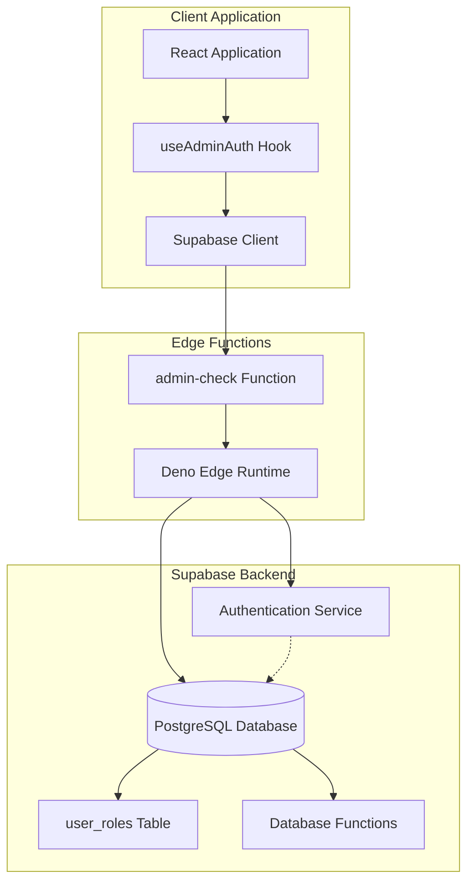
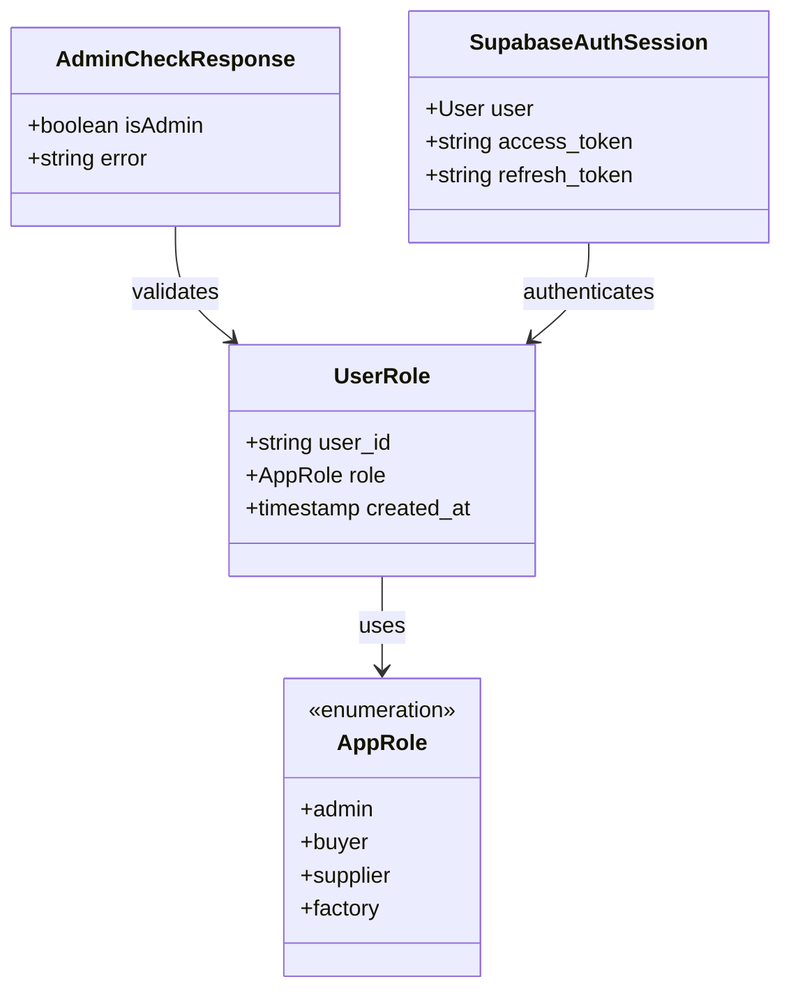
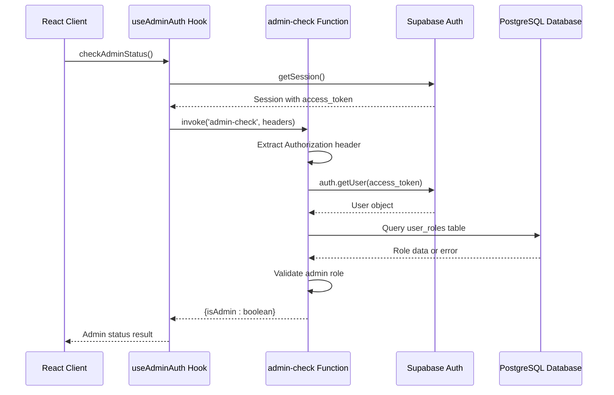
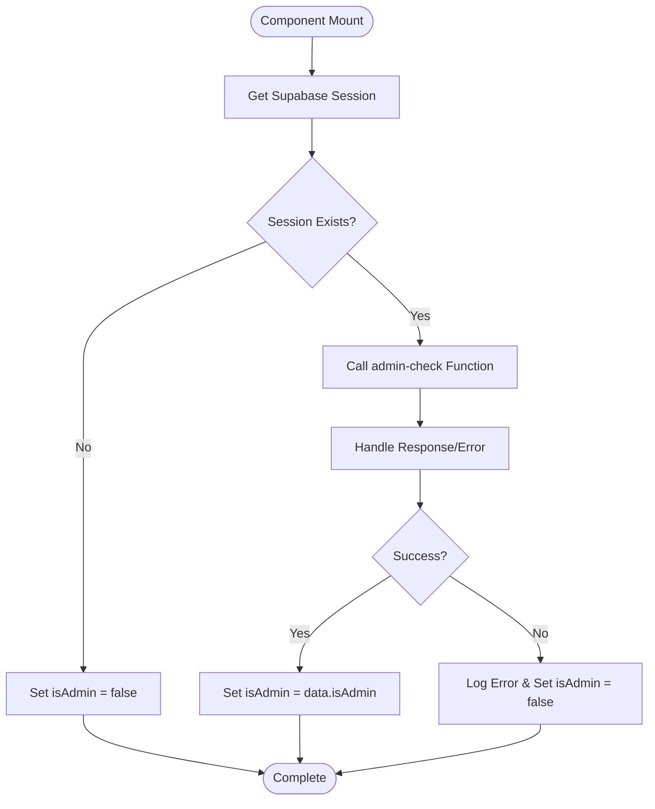
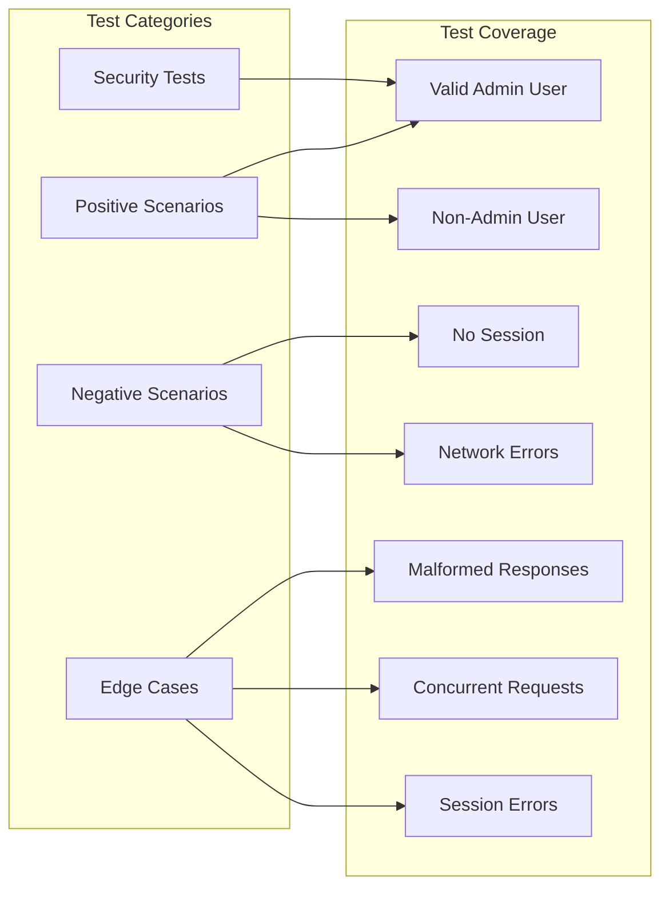

# Role-Based Access Verification System

<cite>
**Referenced Files in This Document**
- [src/hooks/useAdminAuth.ts](file://src/hooks/useAdminAuth.ts)
- [supabase/functions/admin-check/index.ts](file://supabase/functions/admin-check/index.ts)
- [src/lib/supabaseHelpers.ts](file://src/lib/supabaseHelpers.ts)
- [src/types/database.ts](file://src/types/database.ts)
- [src/pages/AdminAnalytics.tsx](file://src/pages/AdminAnalytics.tsx)
- [src/hooks/__tests__/useAdminAuth.test.ts](file://src/hooks/__tests__/useAdminAuth.test.ts)
- [src/components/SmartDashboardRouter.tsx](file://src/components/SmartDashboardRouter.tsx)
- [src/integrations/supabase/client.ts](file://src/integrations/supabase/client.ts)
- [supabase/migrations/20251115150759_remix_migration_from_pg_dump.sql](file://supabase/migrations/20251115150759_remix_migration_from_pg_dump.sql)
- [supabase/BASE_MIGRATION_SAFE.sql](file://supabase/BASE_MIGRATION_SAFE.sql)
</cite>

## Table of Contents
1. [Introduction](#introduction)
2. [System Architecture](#system-architecture)
3. [Core Components](#core-components)
4. [Admin Check Function Implementation](#admin-check-function-implementation)
5. [Integration with Authentication Flow](#integration-with-authentication-flow)
6. [Security Considerations](#security-considerations)
7. [Testing and Validation](#testing-and-validation)
8. [Troubleshooting Guide](#troubleshooting-guide)
9. [Best Practices](#best-practices)
10. [Extending the System](#extending-the-system)

## Introduction

The sleekapp-v100 role-based access verification system provides a robust, secure mechanism for determining administrative privileges within the application. Built on Supabase's authentication framework with edge functions, this system ensures that only authorized administrators can access sensitive dashboard functionalities while maintaining strict server-side validation to prevent client-side tampering.

The system operates on a multi-layered approach combining JWT token verification, server-side role validation, and comprehensive error handling to create a secure and reliable access control mechanism.

## System Architecture

The role-based access verification system follows a distributed architecture pattern with clear separation of concerns:



**Diagram sources**
- [src/hooks/useAdminAuth.ts](file://src/hooks/useAdminAuth.ts#L1-L47)
- [supabase/functions/admin-check/index.ts](file://supabase/functions/admin-check/index.ts#L1-L74)

## Core Components

### Role Management Types

The system defines a comprehensive set of roles through TypeScript interfaces:



**Diagram sources**
- [src/types/database.ts](file://src/types/database.ts#L5-L6)
- [src/lib/supabaseHelpers.ts](file://src/lib/supabaseHelpers.ts#L228-L255)

### Database Schema Structure

The role verification system relies on a carefully designed database schema:

| Table | Purpose | Key Columns |
|-------|---------|-------------|
| `user_roles` | Stores user-role assignments | `user_id`, `role`, `created_at` |
| `auth.users` | Supabase authentication data | `id`, `email`, `raw_user_meta_data` |
| `profiles` | User profile information | `id`, `full_name`, `company_name` |

**Section sources**
- [src/types/database.ts](file://src/types/database.ts#L1-L200)
- [supabase/migrations/20251115150759_remix_migration_from_pg_dump.sql](file://supabase/migrations/20251115150759_remix_migration_from_pg_dump.sql#L28-L40)

## Admin Check Function Implementation

### Server-Side Role Validation

The core admin verification logic resides in the `admin-check` edge function, which performs comprehensive validation:



**Diagram sources**
- [src/hooks/useAdminAuth.ts](file://src/hooks/useAdminAuth.ts#L14-L46)
- [supabase/functions/admin-check/index.ts](file://supabase/functions/admin-check/index.ts#L8-L73)

### JWT Token Verification Process

The admin check function implements a multi-stage JWT verification process:

1. **Header Extraction**: Extracts the Authorization header containing the Bearer token
2. **Token Validation**: Uses Supabase's built-in JWT validation
3. **User Lookup**: Retrieves user information from the authenticated session
4. **Role Query**: Executes a secure database query to check for admin role
5. **Response Generation**: Returns structured JSON with admin status

### Database Role Validation Logic

The function performs a precise database query to verify admin status:

```sql
SELECT role FROM user_roles 
WHERE user_id = ? AND role = 'admin' LIMIT 1
```

This query ensures:
- **Specificity**: Only checks for the 'admin' role
- **Efficiency**: Uses LIMIT 1 for optimal performance
- **Security**: Parameterized query prevents SQL injection

**Section sources**
- [supabase/functions/admin-check/index.ts](file://supabase/functions/admin-check/index.ts#L44-L73)

## Integration with Authentication Flow

### useAdminAuth Hook Implementation

The `useAdminAuth` hook serves as the primary interface for admin status verification:



**Diagram sources**
- [src/hooks/useAdminAuth.ts](file://src/hooks/useAdminAuth.ts#L14-L46)

### Real-Time Status Updates

The hook provides reactive admin status monitoring with automatic rechecking capabilities:

- **Initial Load**: Performs admin check on component mount
- **Manual Recheck**: Exposes `checkAdminStatus()` for runtime validation
- **Loading State**: Provides `loading` state for UI feedback
- **Error Handling**: Graceful degradation on validation failures

**Section sources**
- [src/hooks/useAdminAuth.ts](file://src/hooks/useAdminAuth.ts#L1-L47)

## Security Considerations

### Server-Side Validation

The system implements critical security measures to prevent client-side manipulation:

#### Prevention of Client-Side Trust Abuse
- **Server-Only Validation**: All admin checks occur on the server side
- **JWT Verification**: Uses Supabase's secure JWT validation
- **No Client-Side Flags**: Never trusts client-provided admin status

#### Protection Against Role Enumeration
- **Uniform Response Times**: Consistent response timing regardless of user status
- **Generic Error Messages**: Vague error messages prevent information leakage
- **Rate Limiting**: Edge function implements built-in rate limiting

#### Secure Token Handling
- **Bearer Token Format**: Proper Authorization header format
- **Token Refresh**: Automatic token refresh mechanisms
- **Secure Headers**: HTTPS enforcement and secure header policies

### Database Security Measures

The database implements several security layers:

| Security Layer | Implementation | Purpose |
|----------------|----------------|---------|
| Row Level Security | Enabled on all tables | Restricts data access per user |
| Function Security | SECURITY DEFINER | Ensures functions run with elevated privileges |
| Role-Based Access | Separate service roles | Limits function capabilities |
| Audit Logging | Comprehensive logging | Tracks all administrative actions |

**Section sources**
- [supabase/migrations/20251115150759_remix_migration_from_pg_dump.sql](file://supabase/migrations/20251115150759_remix_migration_from_pg_dump.sql#L107-L162)
- [supabase/BASE_MIGRATION_SAFE.sql](file://supabase/BASE_MIGRATION_SAFE.sql#L329-L376)

## Testing and Validation

### Unit Testing Framework

The system includes comprehensive testing for the admin check functionality:



**Diagram sources**
- [src/hooks/__tests__/useAdminAuth.test.ts](file://src/hooks/__tests__/useAdminAuth.test.ts#L1-L381)

### Test Scenarios Covered

The test suite validates comprehensive scenarios:

1. **Successful Admin Validation**: Valid admin user receives correct status
2. **Non-Admin User Handling**: Regular users receive appropriate denial
3. **Session Management**: Handles missing or expired sessions
4. **Error Recovery**: Graceful handling of network and server errors
5. **Race Condition Prevention**: Concurrent request handling
6. **Security Validation**: Ensures server-side validation is enforced

**Section sources**
- [src/hooks/__tests__/useAdminAuth.test.ts](file://src/hooks/__tests__/useAdminAuth.test.ts#L26-L381)

## Troubleshooting Guide

### Common Issues and Solutions

#### Permission Denial Issues

**Symptoms**: Users receive "Access denied" messages despite having admin privileges
**Causes**:
- Delayed role assignment synchronization
- Database trigger execution delays
- Session token expiration

**Solutions**:
1. Implement retry logic with exponential backoff
2. Add small delays (1-2 seconds) after role assignment
3. Verify role assignment in database manually
4. Check session validity and refresh tokens

#### Session Mismatch Problems

**Symptoms**: Admin status appears inconsistent or incorrect
**Causes**:
- Token validation failures
- Session corruption
- Cross-tab synchronization issues

**Solutions**:
1. Clear browser cache and local storage
2. Implement session refresh mechanisms
3. Verify token expiration and renewal
4. Check for multiple simultaneous logins

#### Caching Problems

**Symptoms**: Admin status doesn't update after role changes
**Causes**:
- Browser caching of API responses
- Client-side state inconsistencies
- Edge function caching issues

**Solutions**:
1. Implement cache-busting strategies
2. Force component re-rendering after role changes
3. Use fresh API calls for critical operations
4. Monitor edge function cache behavior

### Debugging Strategies

#### Enable Debug Logging
```typescript
// Add comprehensive logging to identify issues
console.log('Admin check initiated for user:', userId);
console.log('Session validation result:', sessionValidation);
console.log('Database query result:', dbResult);
```

#### Monitor Edge Function Performance
- Track response times and error rates
- Monitor database query performance
- Check for rate limiting violations

#### Validate Database State
- Verify role assignments in user_roles table
- Check for orphaned records or inconsistencies
- Monitor trigger execution logs

**Section sources**
- [src/components/SmartDashboardRouter.tsx](file://src/components/SmartDashboardRouter.tsx#L56-L82)

## Best Practices

### Implementation Guidelines

#### Role Assignment Security
- **Never trust client-side role data**
- **Use server-side validation exclusively**
- **Implement proper authorization checks**
- **Maintain audit trails for role changes**

#### Error Handling Standards
- **Provide generic error messages**
- **Log detailed errors securely**
- **Implement graceful degradation**
- **Offer user-friendly error experiences**

#### Performance Optimization
- **Minimize database queries**
- **Implement appropriate caching strategies**
- **Use connection pooling effectively**
- **Monitor and optimize query performance**

### Extension Patterns

#### Adding New Roles
To extend the system for additional roles:

1. **Update Database Schema**: Add new role to `app_role` enum
2. **Modify Edge Function**: Update role validation logic
3. **Extend TypeScript Types**: Add new role to `AppRole` interface
4. **Update Authorization Checks**: Modify access control logic

#### Multi-Level Admin System
For hierarchical admin roles:

1. **Implement Role Hierarchy**: Define role precedence levels
2. **Create Permission Matrix**: Map roles to specific permissions
3. **Add Granular Controls**: Implement fine-grained access controls
4. **Maintain Role Inheritance**: Support role-based permission inheritance

## Extending the System

### Future Enhancement Opportunities

#### Dynamic Role Management
- **Role Assignment UI**: Create admin interface for role management
- **Permission Groups**: Implement role-based permission groups
- **Temporal Roles**: Support time-limited role assignments
- **Conditional Permissions**: Add context-aware permission logic

#### Advanced Security Features
- **Multi-Factor Authentication**: Integrate MFA for admin accounts
- **Session Monitoring**: Track and monitor user sessions
- **Behavioral Analytics**: Implement user behavior analysis
- **Automated Threat Detection**: Add security threat detection

#### Performance Improvements
- **Redis Caching**: Implement Redis caching for role data
- **Database Indexing**: Optimize database indexes for role queries
- **Edge Computing**: Leverage edge computing for faster validation
- **Async Processing**: Implement asynchronous role validation

### Integration Patterns

#### Microservices Architecture
- **Role Service**: Dedicated service for role management
- **Authentication Gateway**: Centralized authentication endpoint
- **Event-Driven Updates**: Real-time role change notifications
- **Service Mesh Integration**: Secure service-to-service communication

#### API Gateway Integration
- **Centralized Authorization**: Single point of access control
- **Rate Limiting**: Unified rate limiting across services
- **CORS Management**: Centralized CORS policy management
- **Monitoring Integration**: Unified monitoring and logging

The role-based access verification system in sleekapp-v100 provides a robust foundation for secure application access control. Its combination of server-side validation, comprehensive error handling, and extensible architecture makes it suitable for both current requirements and future growth.