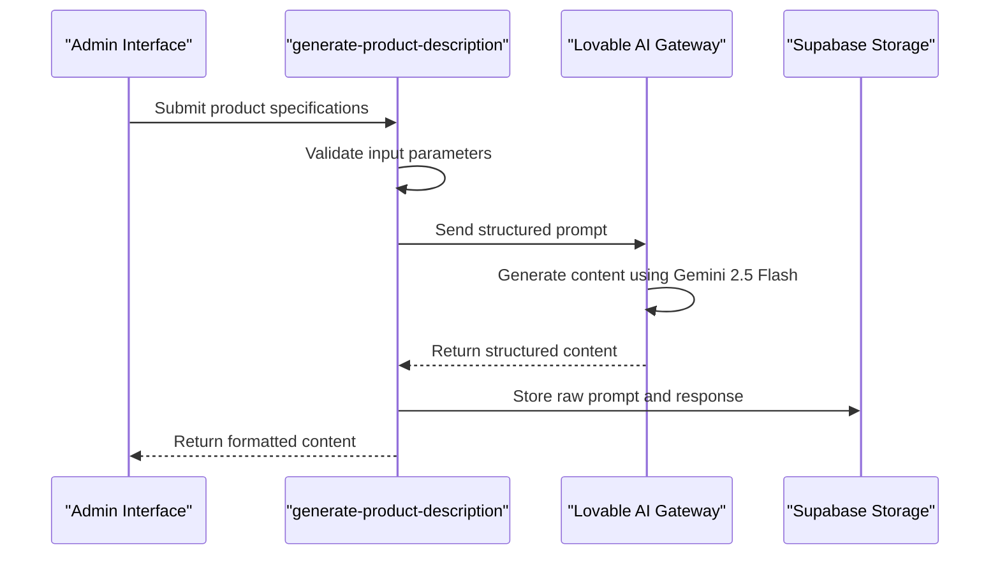
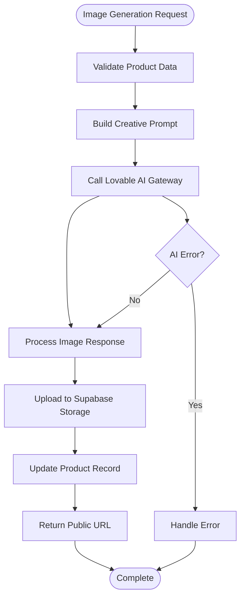
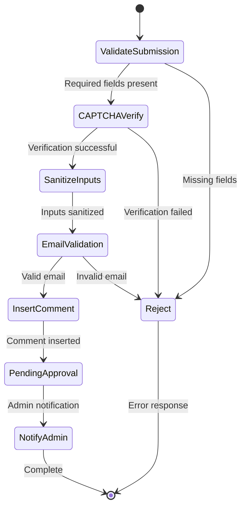
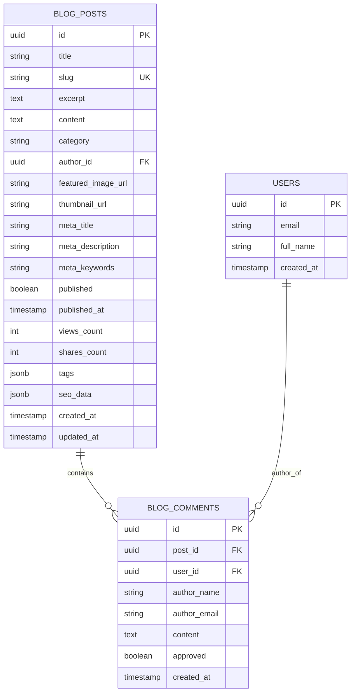
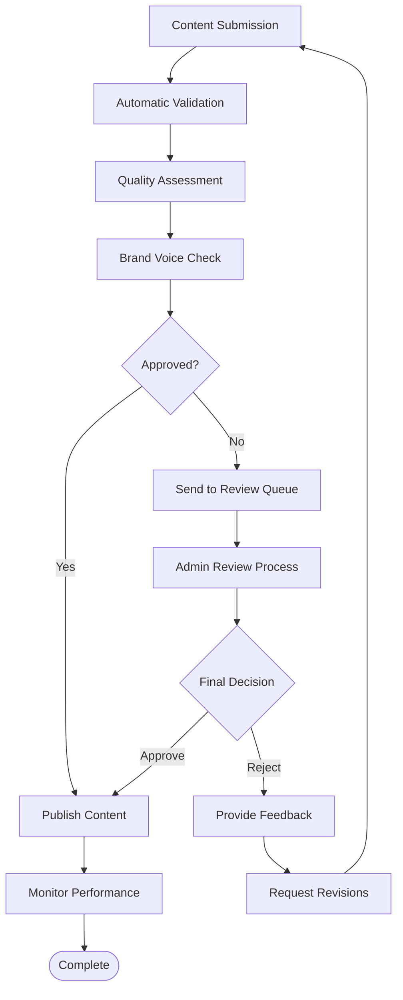
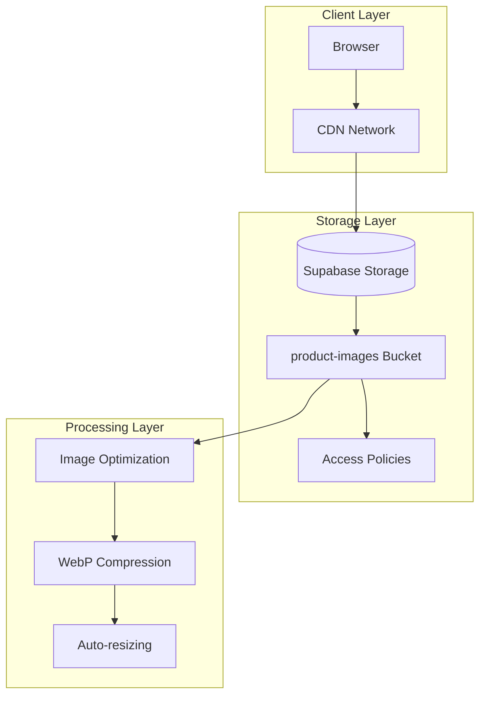
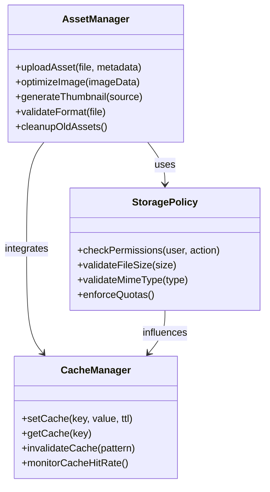
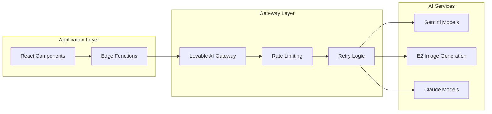
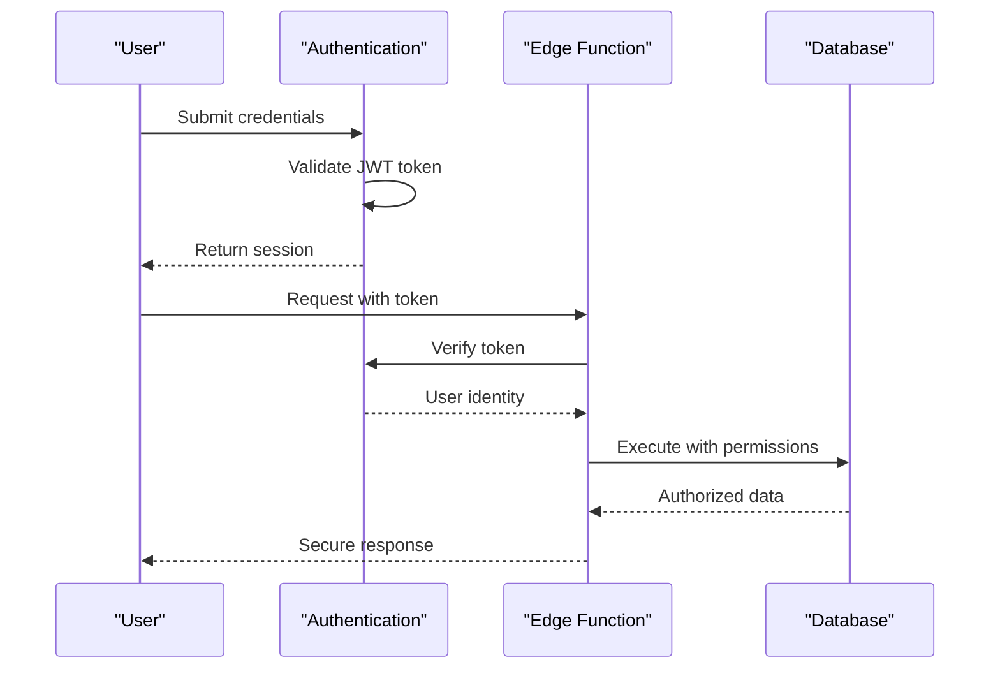
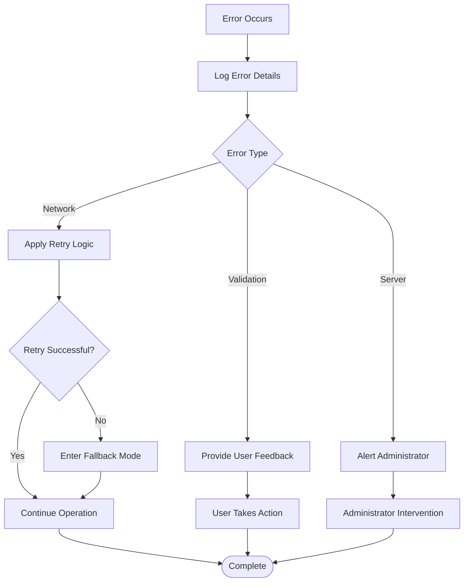

# Content and User-Generated Content Functions

<cite>
**Referenced Files in This Document**
- [generate-product-description/index.ts](file://supabase/functions/generate-product-description/index.ts)
- [generate-product-image/index.ts](file://supabase/functions/generate-product-image/index.ts)
- [submit-blog-comment/index.ts](file://supabase/functions/submit-blog-comment/index.ts)
- [ProductDescriptionGenerator.tsx](file://src/components/admin/ProductDescriptionGenerator.tsx)
- [aiGeneratedProductImages.ts](file://src/lib/aiGeneratedProductImages.ts)
- [portfolioImagesPhotorealistic.ts](file://src/lib/portfolioImagesPhotorealistic.ts)
- [ai-design-generator/index.ts](file://supabase/functions/ai-design-generator/index.ts)
- [generate-invoice/index.ts](file://supabase/functions/generate-invoice/index.ts)
- [RateLimitMonitoringDashboard.tsx](file://src/components/admin/RateLimitMonitoringDashboard.tsx)
- [blog_comments table schema](file://supabase/FIXED_SETUP_PART1.sql)
- [storage bucket configuration](file://supabase/migrations/20250122010000_setup_product_images_storage.sql)
- [ProductApproval.tsx](file://src/pages/admin/ProductApproval.tsx)
- [ProductReview.tsx](file://src/pages/admin/ProductReview.tsx)
</cite>

## Table of Contents
1. [Introduction](#introduction)
2. [AI-Powered Content Generation](#ai-powered-content-generation)
3. [User-Generated Content Management](#user-generated-content-management)
4. [Content Moderation and Quality Control](#content-moderation-and-quality-control)
5. [Storage and Performance Systems](#storage-and-performance-systems)
6. [Integration Architecture](#integration-architecture)
7. [Security and Rate Limiting](#security-and-rate-limiting)
8. [Best Practices and Guidelines](#best-practices-and-guidelines)
9. [Troubleshooting and Monitoring](#troubleshooting-and-monitoring)
10. [Conclusion](#conclusion)

## Introduction

SleekApp v100 implements a comprehensive content management system that leverages AI technologies to automate content creation while maintaining strict quality control and moderation standards. The system provides three primary functions: AI-powered product description generation, automated product image creation, and moderated user comment submission. These functions work together to create a seamless content ecosystem that balances automation with human oversight.

The platform integrates advanced AI services through the Lovable AI Gateway to generate high-quality, brand-consistent content while implementing robust moderation workflows to prevent spam and inappropriate content. Storage systems are optimized for performance with automatic caching and CDN delivery, ensuring fast content delivery across global markets.

## AI-Powered Content Generation

### Product Description Generator

The AI Product Description Generator creates compelling copy using sophisticated prompt engineering and AI models. The system accepts technical specifications and generates complete product descriptions including titles, feature bullets, and meta descriptions.

**Diagram sources**
- [generate-product-description/index.ts](file://supabase/functions/generate-product-description/index.ts#L13-L91)
- [ProductDescriptionGenerator.tsx](file://src/components/admin/ProductDescriptionGenerator.tsx#L19-L48)

#### Prompt Template Architecture

The system uses a sophisticated prompt template system that ensures consistent, high-quality output:

| Component | Purpose | Example |
|-----------|---------|---------|
| System Prompt | Defines AI role and tone | "Expert copywriter specializing in apparel product descriptions" |
| User Prompt | Provides specific requirements | Product type, materials, features, target audience |
| Tool Definition | Structured output format | JSON schema with title, description, features, meta_description |
| Validation | Ensures completeness | Required fields check and content quality assessment |

**Section sources**
- [generate-product-description/index.ts](file://supabase/functions/generate-product-description/index.ts#L21-L35)

#### Content Structure and Output

Generated content follows a standardized structure:

- **Product Title**: Catchy headline with main keyword
- **Full Description**: 200-300 word SEO-optimized text
- **Feature Bullets**: 5-7 bullet points highlighting key attributes
- **Meta Description**: 150-160 character SEO tag

### AI Product Image Generator

The AI Product Image Generator creates professional-grade product photography using advanced image generation models. The system combines technical specifications with creative prompts to produce studio-quality images.

**Diagram sources**
- [generate-product-image/index.ts](file://supabase/functions/generate-product-image/index.ts#L14-L138)

#### Image Generation Workflow

The image generation process incorporates multiple optimization strategies:

| Optimization Level | Technique | Implementation |
|-------------------|-----------|----------------|
| Prompt Engineering | Detailed creative direction | Professional photography style, studio lighting, fabric textures |
| Model Selection | Appropriate AI model | Google Gemini 2.5 Flash Image Preview |
| Quality Control | Multi-stage validation | Base64 decoding, format verification, size constraints |
| Storage Optimization | Efficient file handling | WebP compression, automatic naming, metadata preservation |

**Section sources**
- [generate-product-image/index.ts](file://supabase/functions/generate-product-image/index.ts#L22-L35)

### Design Generation System

The AI Design Generator creates print-ready designs for apparel manufacturing, supporting various style preferences and color palettes.

**Section sources**
- [ai-design-generator/index.ts](file://supabase/functions/ai-design-generator/index.ts#L32-L40)

## User-Generated Content Management

### Blog Comment Submission System

The blog comment system implements a comprehensive moderation workflow that handles both authenticated and anonymous submissions while preventing spam and inappropriate content.

**Diagram sources**
- [submit-blog-comment/index.ts](file://supabase/functions/submit-blog-comment/index.ts#L16-L128)

#### Submission Validation Pipeline

The system implements multi-layered validation:

| Validation Stage | Purpose | Implementation |
|------------------|---------|----------------|
| Field Validation | Required data presence | Presence checks for post_id, author_name, author_email, content |
| CAPTCHA Verification | Bot prevention | Google reCAPTCHA v3 integration with score threshold |
| Input Sanitization | XSS protection | Character limits, format normalization |
| Email Validation | Address verification | Regex pattern matching and format checking |
| Duplicate Prevention | Spam reduction | Rate limiting and duplicate detection |

**Section sources**
- [submit-blog-comment/index.ts](file://supabase/functions/submit-blog-comment/index.ts#L19-L66)

### Database Schema and Relationships

The blog comment system uses a normalized database schema with appropriate indexing and constraints:

**Diagram sources**
- [blog_comments table schema](file://supabase/FIXED_SETUP_PART1.sql#L173-L181)
- [blog_posts table schema](file://supabase/FIXED_SETUP_PART1.sql#L183-L204)

**Section sources**
- [blog_comments table schema](file://supabase/FIXED_SETUP_PART1.sql#L173-L181)

## Content Moderation and Quality Control

### Approval Workflow System

The content approval system implements a comprehensive workflow for managing AI-generated and user-submitted content:

**Diagram sources**
- [ProductApproval.tsx](file://src/pages/admin/ProductApproval.tsx#L393-L415)
- [ProductReview.tsx](file://src/pages/admin/ProductReview.tsx#L185-L610)

### Quality Control Mechanisms

The system implements multiple quality control layers:

| Control Layer | Purpose | Implementation |
|---------------|---------|----------------|
| Pre-submission | Input validation | Frontend form validation and backend sanitization |
| AI Quality | Content assessment | Automated readability scoring and sentiment analysis |
| Brand Compliance | Voice consistency | Keyword matching and tone analysis |
| Human Review | Final approval | Admin dashboard with approval/rejection workflows |
| Post-publish | Performance monitoring | Analytics tracking and user feedback collection |

### Versioning Strategies

Content versioning ensures rollback capabilities and change tracking:

- **Automatic Versioning**: Each content modification creates a new version
- **Rollback Capability**: Administrators can revert to previous versions
- **Change Tracking**: Detailed audit logs of all modifications
- **Approval History**: Complete workflow history for compliance

**Section sources**
- [ProductReview.tsx](file://src/pages/admin/ProductReview.tsx#L185-L610)

## Storage and Performance Systems

### Image Storage Architecture

The system uses a multi-tiered storage architecture optimized for performance and scalability:

**Diagram sources**
- [storage bucket configuration](file://supabase/migrations/20250122010000_setup_product_images_storage.sql#L12-L22)

### Performance Optimization Strategies

| Optimization Technique | Implementation | Benefits |
|------------------------|----------------|----------|
| CDN Integration | Automatic CDN URLs | Reduced latency, global distribution |
| Image Compression | WebP format conversion | Smaller file sizes, faster loading |
| Lazy Loading | Progressive image loading | Improved page performance |
| Caching Headers | Intelligent cache policies | Reduced server load |
| Auto-scaling | Dynamic resource allocation | Consistent performance under load |

**Section sources**
- [storage bucket configuration](file://supabase/migrations/20250122010000_setup_product_images_storage.sql#L12-L22)

### Asset Management System

The asset management system provides comprehensive control over generated content:

**Diagram sources**
- [aiGeneratedProductImages.ts](file://src/lib/aiGeneratedProductImages.ts#L1-L331)
- [portfolioImagesPhotorealistic.ts](file://src/lib/portfolioImagesPhotorealistic.ts#L1-L162)

**Section sources**
- [aiGeneratedProductImages.ts](file://src/lib/aiGeneratedProductImages.ts#L1-L331)

## Integration Architecture

### AI Service Integration

The system integrates with multiple AI services through a unified gateway:

**Diagram sources**
- [generate-product-description/index.ts](file://supabase/functions/generate-product-description/index.ts#L37-L48)
- [generate-product-image/index.ts](file://supabase/functions/generate-product-image/index.ts#L40-L56)

### Database Integration Patterns

The system uses Supabase for comprehensive data management:

| Integration Pattern | Purpose | Implementation |
|---------------------|---------|----------------|
| Real-time Subscriptions | Live updates | WebSocket connections for instant notifications |
| RLS Policies | Access control | Row-level security for data isolation |
| Triggers | Automated workflows | Database triggers for cascading updates |
| Stored Procedures | Complex operations | PL/pgSQL functions for business logic |
| Foreign Keys | Data integrity | Referential constraints for relationships |

**Section sources**
- [generate-invoice/index.ts](file://supabase/functions/generate-invoice/index.ts#L49-L53)

## Security and Rate Limiting

### Authentication and Authorization

The system implements comprehensive security measures:

**Diagram sources**
- [submit-blog-comment/index.ts](file://supabase/functions/submit-blog-comment/index.ts#L73-L88)

### Rate Limiting Implementation

The system implements intelligent rate limiting to prevent abuse:

| Rate Limit Type | Scope | Limits | Enforcement |
|-----------------|-------|--------|-------------|
| Per-IP Limiting | Global | 100 requests/hour | Distributed counter |
| Per-User Limiting | Authenticated | 500 requests/hour | User-specific counters |
| Per-Endpoint | Specific functions | 10 requests/minute | Function-level throttling |
| Burst Protection | Temporary spikes | 5 requests/second | Sliding window algorithm |

**Section sources**
- [RateLimitMonitoringDashboard.tsx](file://src/components/admin/RateLimitMonitoringDashboard.tsx#L1-L165)

### Security Measures

Comprehensive security controls protect against various threats:

- **Input Validation**: All user inputs undergo strict validation
- **Output Encoding**: Generated content is properly encoded
- **CSRF Protection**: Cross-site request forgery prevention
- **Content Security Policy**: Prevents XSS attacks
- **Encryption**: Data encryption at rest and in transit
- **Audit Logging**: Comprehensive logging of all actions

## Best Practices and Guidelines

### Brand Voice Consistency

Maintaining consistent brand voice across all generated content:

| Guideline | Implementation | Tools |
|-----------|----------------|-------|
| Tone Standards | Define acceptable tones and styles | AI training data |
| Keyword Usage | Control for brand terminology | Keyword filtering |
| Style Guides | Document preferred writing styles | Content templates |
| Review Process | Human oversight for quality | Admin approval workflow |

### Content Quality Standards

Establishing and maintaining high content quality:

- **Readability Scores**: Minimum Flesch-Kincaid grade level
- **Grammar Checking**: Automated grammar and spelling validation
- **Plagiarism Detection**: Content uniqueness verification
- **SEO Optimization**: Keyword density and meta tag validation
- **Accessibility**: WCAG compliance for generated content

### Performance Optimization

Best practices for optimal performance:

- **Image Optimization**: Proper compression and format selection
- **Caching Strategies**: Intelligent cache management
- **CDN Utilization**: Global content delivery network
- **Lazy Loading**: Progressive content loading
- **Resource Minification**: JavaScript and CSS optimization

## Troubleshooting and Monitoring

### Error Handling and Recovery

Comprehensive error handling ensures system reliability:

### Monitoring and Alerting

The system includes comprehensive monitoring capabilities:

| Monitoring Aspect | Metrics | Alerts |
|-------------------|---------|--------|
| API Performance | Response times, error rates | SLA violations |
| Rate Limits | Usage patterns, threshold breaches | Capacity warnings |
| AI Service Health | Availability, latency | Service degradation |
| Storage Performance | Upload speeds, error rates | Storage issues |
| Content Quality | Approval rates, user feedback | Quality concerns |

### Debugging Tools

Administrative tools for troubleshooting:

- **Request Logs**: Complete request/response logging
- **Performance Profiling**: Detailed timing information
- **Error Analytics**: Trend analysis and pattern recognition
- **User Impact Analysis**: Affected user identification
- **System Health Checks**: Automated health monitoring

**Section sources**
- [RateLimitMonitoringDashboard.tsx](file://src/components/admin/RateLimitMonitoringDashboard.tsx#L1-L165)

## Conclusion

SleekApp v100's content management system represents a sophisticated balance between automation and quality control. The AI-powered content generation functions provide efficient, scalable solutions for creating high-quality product descriptions and images, while the comprehensive moderation and approval workflows ensure content quality and brand consistency.

The system's architecture emphasizes performance, security, and reliability through intelligent caching, robust rate limiting, and comprehensive monitoring. The integration of multiple AI services through a unified gateway enables flexible content generation while maintaining control over output quality.

Key strengths of the system include:

- **Scalable AI Integration**: Flexible AI service integration with multiple providers
- **Comprehensive Moderation**: Multi-layered content review and approval workflows
- **Performance Optimization**: Intelligent caching and CDN integration
- **Security Focus**: Robust authentication, authorization, and rate limiting
- **Developer Experience**: Well-documented APIs and comprehensive error handling

The platform's design supports future enhancements including additional AI models, expanded content types, and advanced analytics capabilities. The modular architecture ensures that new features can be integrated seamlessly while maintaining system stability and performance.