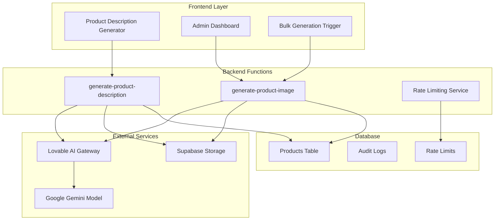
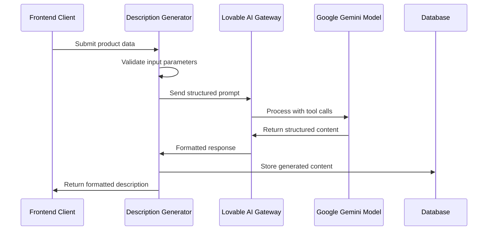
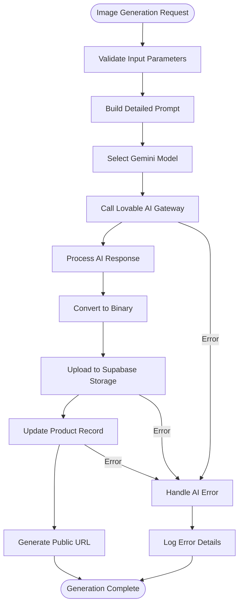
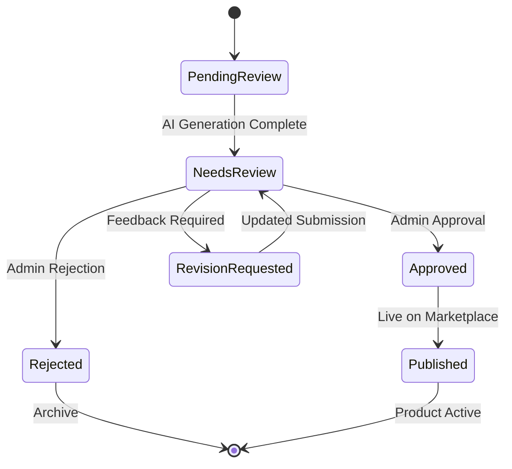
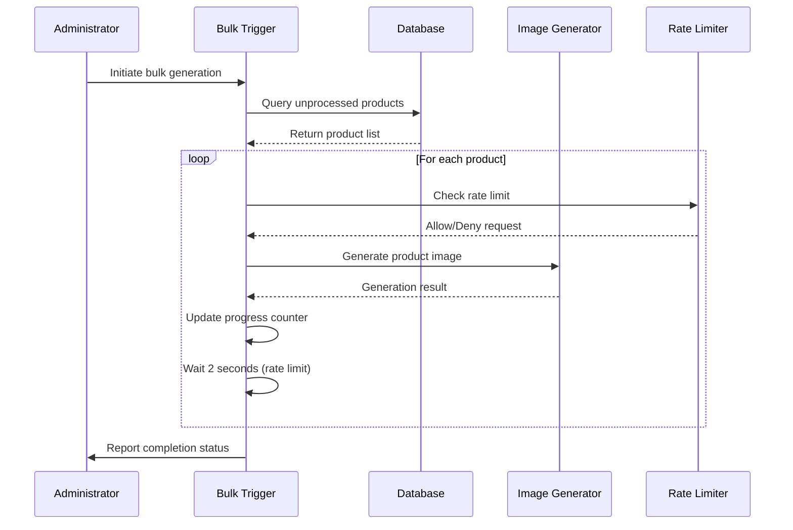
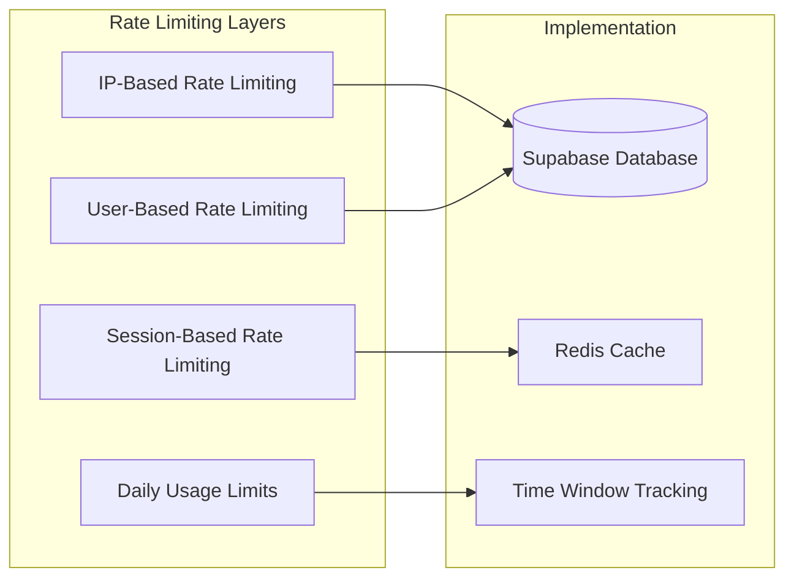
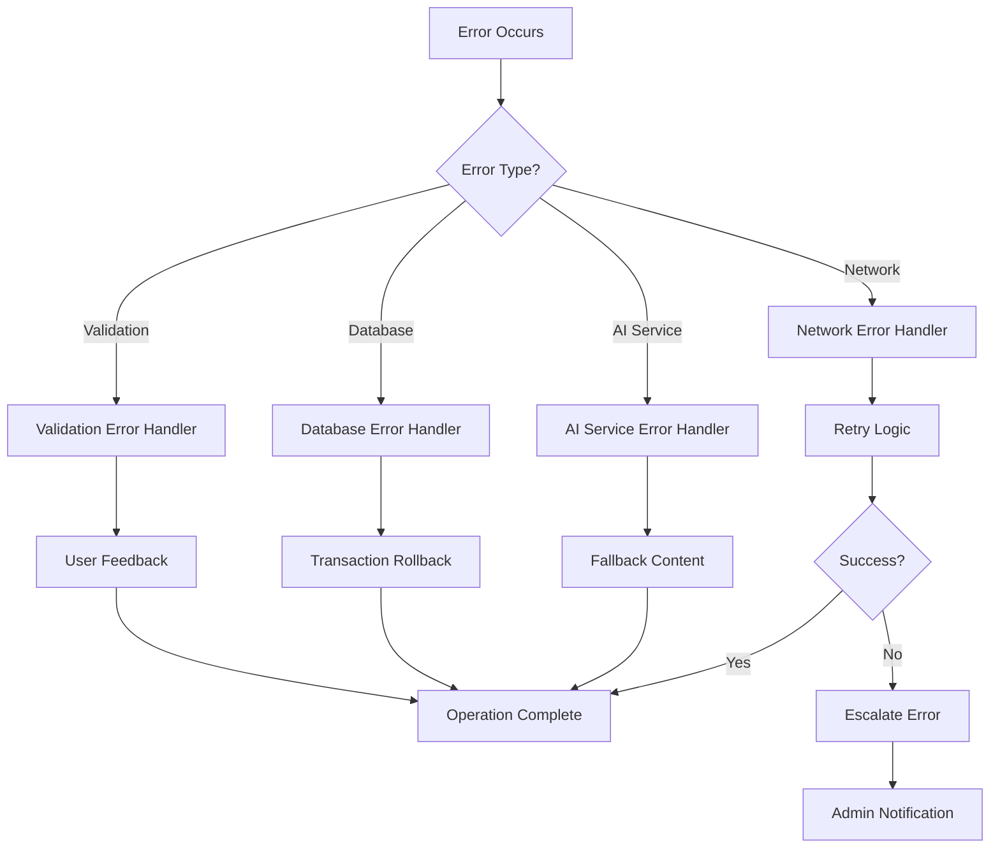

# Product Content Generation

<cite>
**Referenced Files in This Document**
- [ProductDescriptionGenerator.tsx](file://src/components/admin/ProductDescriptionGenerator.tsx)
- [generate-product-description/index.ts](file://supabase/functions/generate-product-description/index.ts)
- [generate-product-image/index.ts](file://supabase/functions/generate-product-image/index.ts)
- [aiGeneratedProductImages.ts](file://src/lib/aiGeneratedProductImages.ts)
- [BulkGenerationTrigger.tsx](file://src/pages/BulkGenerationTrigger.tsx)
- [ProductApproval.tsx](file://src/pages/admin/ProductApproval.tsx)
- [AdminProducts.tsx](file://src/pages/admin/AdminProducts.tsx)
- [database.ts](file://src/types/database.ts)
- [marketplace.ts](file://src/types/marketplace.ts)
- [ai-quote-generator/index.ts](file://supabase/functions/ai-quote-generator/index.ts)
- [conversational-assistant/index.ts](file://supabase/functions/conversational-assistant/index.ts)
</cite>

## Table of Contents
1. [Introduction](#introduction)
2. [System Architecture](#system-architecture)
3. [Product Description Generation](#product-description-generation)
4. [Product Image Generation](#product-image-generation)
5. [Approval Workflow](#approval-workflow)
6. [Bulk Generation System](#bulk-generation-system)
7. [Rate Limiting and Performance](#rate-limiting-and-performance)
8. [Error Handling Strategies](#error-handling-strategies)
9. [Best Practices and Guidelines](#best-practices-and-guidelines)
10. [Troubleshooting Guide](#troubleshooting-guide)

## Introduction

The sleekapp-v100 product content generation system provides automated AI-powered solutions for creating compelling product descriptions and professional-quality images. Built on a robust architecture utilizing Google's Gemini model through the Lovable AI Gateway, this system enables efficient content creation for e-commerce product listings while maintaining strict quality controls and approval workflows.

The system consists of two primary components: AI-powered product description generation that creates SEO-optimized copy based on technical specifications, and AI-driven product image generation that produces studio-quality visuals with professional photography standards. Both systems integrate seamlessly with Supabase for data persistence and storage, while implementing comprehensive rate limiting and error handling mechanisms.

## System Architecture

The product content generation system follows a serverless architecture with clear separation of concerns between frontend interfaces, backend functions, and external AI services.



**Diagram sources**
- [ProductDescriptionGenerator.tsx](file://src/components/admin/ProductDescriptionGenerator.tsx#L1-L176)
- [generate-product-description/index.ts](file://supabase/functions/generate-product-description/index.ts#L1-L91)
- [generate-product-image/index.ts](file://supabase/functions/generate-product-image/index.ts#L1-L138)

**Section sources**
- [ProductDescriptionGenerator.tsx](file://src/components/admin/ProductDescriptionGenerator.tsx#L1-L176)
- [generate-product-description/index.ts](file://supabase/functions/generate-product-description/index.ts#L1-L91)
- [generate-product-image/index.ts](file://supabase/functions/generate-product-image/index.ts#L1-L138)

## Product Description Generation

### Core Functionality

The product description generation system transforms technical specifications into compelling marketing copy using advanced AI capabilities. The system accepts structured input parameters and generates comprehensive product descriptions with SEO optimization.



**Diagram sources**
- [ProductDescriptionGenerator.tsx](file://src/components/admin/ProductDescriptionGenerator.tsx#L19-L48)
- [generate-product-description/index.ts](file://supabase/functions/generate-product-description/index.ts#L14-L83)

### Input Parameters and Structure

The description generator accepts the following structured input:

| Parameter | Type | Required | Description |
|-----------|------|----------|-------------|
| product_type | string | Yes | The type of product being described |
| material | string | No | Fabric composition and materials |
| features | string[] | No | Key product features and benefits |
| target_audience | string | No | Target market segment |

### Output Structure

The AI model generates a comprehensive product description with the following structure:

| Field | Type | Description |
|-------|------|-------------|
| title | string | Catchy, keyword-rich product title |
| description | string | 200-300 word SEO-optimized description |
| features | string[] | 5-7 feature bullet points |
| meta_description | string | 150-160 character SEO meta description |

### Prompt Engineering and Templates

The system employs sophisticated prompt engineering to ensure high-quality output:

**System Prompt Template:**
```
You are an expert copywriter specializing in apparel product descriptions.
Create compelling, SEO-optimized product descriptions that highlight quality, features, and benefits.
```

**User Prompt Template:**
```
Generate a complete product description for:

Product Type: ${product_type}
Material: ${material}
Key Features: ${features?.join(', ')}
Target Audience: ${target_audience}

Provide:
1. Product title (catchy, includes main keyword)
2. Full description (200-300 words, SEO-optimized)
3. Feature bullet points (5-7 points)
4. Meta description (150-160 characters for SEO)
```

**Section sources**
- [generate-product-description/index.ts](file://supabase/functions/generate-product-description/index.ts#L21-L35)

## Product Image Generation

### AI-Powered Visual Asset Creation

The product image generation system creates professional-grade product photography using advanced AI models with detailed prompt engineering for optimal visual results.



**Diagram sources**
- [generate-product-image/index.ts](file://supabase/functions/generate-product-image/index.ts#L14-L138)

### Prompt Engineering for Professional Photography

The system generates highly detailed prompts optimized for professional product photography:

**Base Style Elements:**
- Professional product photography
- Studio lighting with soft shadows
- Pure white background (#FFFFFF)
- Ultra-realistic fabric texture visible
- 4K commercial fashion photography quality
- High detail

**Product-Specific Modifications:**
- **Knitwear:** invisible mannequin effect, ghost mannequin technique
- **Other Categories:** flat lay photography, perfectly aligned
- **Color Information:** included when available
- **Fabric Details:** premium quality fabric specification
- **Detail Focus:** fabric texture, stitching details, collar and cuff details

### Storage and Management

Generated images are automatically stored in Supabase storage buckets with the following characteristics:

| Aspect | Implementation |
|--------|----------------|
| File Naming | `{productId}-{timestamp}.webp` |
| Storage Location | `product-images` bucket |
| Compression | WebP format for optimal quality/size ratio |
| Access Control | Public URLs for marketplace display |
| Metadata | Automatic tracking of generation parameters |

### Database Integration

The image generation process updates the product record with comprehensive metadata:

| Field | Purpose | Default Value |
|-------|---------|---------------|
| image_url | Public URL for marketplace display | null |
| ai_generated_image | Flag indicating AI origin | true |
| image_generation_prompt | Original prompt for reference | Generated prompt |
| image_generation_date | Timestamp of generation | Current timestamp |
| image_approved_by_admin | Approval status flag | false |

**Section sources**
- [generate-product-image/index.ts](file://supabase/functions/generate-product-image/index.ts#L22-L35)
- [generate-product-image/index.ts](file://supabase/functions/generate-product-image/index.ts#L77-L115)

## Approval Workflow

### Administrative Review Process

The approval workflow ensures quality control and brand consistency through a comprehensive review system managed by administrators.



**Diagram sources**
- [AdminProducts.tsx](file://src/pages/admin/AdminProducts.tsx#L87-L100)
- [ProductApproval.tsx](file://src/pages/admin/ProductApproval.tsx#L1-L416)

### Approval Status Tracking

The system maintains detailed approval status through database fields:

| Status | Description | UI Indicator |
|--------|-------------|--------------|
| `false` | AI image generated but not reviewed | Orange dot |
| `true` | Admin-approved image ready for publication | Green checkmark |

### Bulk Approval Management

Administrators can efficiently manage multiple product approvals through:

- **Individual Approval:** Click-to-approve individual products
- **Bulk Operations:** Select multiple products for batch approval
- **Filtering:** Search and filter products by various criteria
- **Statistics:** Real-time approval statistics dashboard

**Section sources**
- [AdminProducts.tsx](file://src/pages/admin/AdminProducts.tsx#L87-L100)
- [ProductApproval.tsx](file://src/pages/admin/ProductApproval.tsx#L47-L89)

## Bulk Generation System

### Automated Batch Processing

The bulk generation system enables efficient processing of multiple products with intelligent rate limiting and progress tracking.



**Diagram sources**
- [BulkGenerationTrigger.tsx](file://src/pages/BulkGenerationTrigger.tsx#L7-L79)
- [AdminProducts.tsx](file://src/pages/admin/AdminProducts.tsx#L102-L128)

### Rate Limiting Implementation

The system implements intelligent rate limiting to prevent API abuse and ensure service reliability:

| Limit Type | Configuration | Purpose |
|------------|---------------|---------|
| Per-request delay | 2 seconds | Prevent API throttling |
| Concurrent processing | Single-threaded | Avoid overwhelming AI service |
| Retry logic | Automatic exponential backoff | Handle temporary failures |

### Progress Monitoring

Bulk operations provide real-time progress tracking:

- **Current/Total Counter:** Shows processed vs. total products
- **Individual Status:** Success/failure notification for each product
- **Completion Summary:** Final statistics report
- **Error Handling:** Detailed error logging and reporting

**Section sources**
- [BulkGenerationTrigger.tsx](file://src/pages/BulkGenerationTrigger.tsx#L26-L58)
- [AdminProducts.tsx](file://src/pages/admin/AdminProducts.tsx#L102-L128)

## Rate Limiting and Performance

### Multi-Level Rate Limiting

The system implements comprehensive rate limiting across multiple dimensions to ensure fair usage and service stability.



**Diagram sources**
- [ai-quote-generator/index.ts](file://supabase/functions/ai-quote-generator/index.ts#L39-L81)
- [conversational-assistant/index.ts](file://supabase/functions/conversational-assistant/index.ts#L69-L109)

### Rate Limiting Strategies

The system employs tiered rate limiting based on user context:

| Level | Limit Type | Duration | Purpose |
|-------|------------|----------|---------|
| IP | 5 requests per hour | 1 hour | Prevent abuse from single IP |
| Email | 10 requests per day | 24 hours | Protect individual users |
| Session | 100 requests per session | Session lifetime | Manage API usage |

### Performance Optimization

Several optimization strategies enhance system performance:

- **Caching:** Frequently accessed prompts and configurations cached
- **Batch Processing:** Multiple operations grouped for efficiency
- **Asynchronous Processing:** Non-blocking operation execution
- **Connection Pooling:** Efficient database connection management

**Section sources**
- [ai-quote-generator/index.ts](file://supabase/functions/ai-quote-generator/index.ts#L39-L81)
- [conversational-assistant/index.ts](file://supabase/functions/conversational-assistant/index.ts#L69-L109)

## Error Handling Strategies

### Comprehensive Error Management

The system implements robust error handling across all components to ensure reliable operation and meaningful user feedback.



**Diagram sources**
- [generate-product-description/index.ts](file://supabase/functions/generate-product-description/index.ts#L84-L91)
- [generate-product-image/index.ts](file://supabase/functions/generate-product-image/index.ts#L125-L138)

### Error Categories and Responses

The system handles various error scenarios with appropriate responses:

| Error Type | Handling Strategy | User Impact |
|------------|-------------------|-------------|
| AI API Failure | Fallback to manual intervention | Error notification with retry option |
| Rate Limit Exceeded | Automatic retry with backoff | Temporary pause with progress indication |
| Database Connection | Graceful degradation | Local caching with sync on recovery |
| Invalid Input | Immediate validation feedback | Clear error messages with field highlighting |

### Logging and Monitoring

Comprehensive logging ensures effective troubleshooting and system monitoring:

- **Structured Logging:** JSON-formatted logs for easy parsing
- **Error Classification:** Automatic categorization of error types
- **Performance Metrics:** Response times and throughput tracking
- **Alert Integration:** Automated notifications for critical failures

**Section sources**
- [generate-product-description/index.ts](file://supabase/functions/generate-product-description/index.ts#L84-L91)
- [generate-product-image/index.ts](file://supabase/functions/generate-product-image/index.ts#L125-L138)

## Best Practices and Guidelines

### Brand Voice Consistency

Maintaining consistent brand voice across all generated content requires careful prompt engineering and quality control:

- **Tone Guidelines:** Establish clear tone and style preferences
- **Keyword Usage:** Define primary and secondary keywords for SEO
- **Content Structure:** Standardize format and structure elements
- **Brand Values:** Incorporate core brand attributes into prompts

### Content Quality Standards

High-quality content requires adherence to established standards:

| Standard | Requirement | Validation Method |
|----------|-------------|-------------------|
| Length | 200-300 words for descriptions | Character count validation |
| Keyword Density | 2-3% keyword density | Automated analysis |
| Grammar | Zero grammatical errors | AI grammar checking |
| Readability | Grade 6-8 reading level | Flesch-Kincaid scoring |

### Technical Specifications

Ensure optimal technical performance:

- **Image Resolution:** Minimum 800x800 pixels for generated images
- **File Formats:** WebP compression for optimal loading
- **Metadata:** Proper ALT text and SEO metadata inclusion
- **Accessibility:** Screen reader compatible descriptions

### Maintenance Procedures

Regular maintenance ensures system reliability:

- **Prompt Updates:** Periodic review and enhancement of AI prompts
- **Model Updates:** Regular assessment of AI model performance
- **Rate Limit Tuning:** Dynamic adjustment based on usage patterns
- **Backup Verification:** Regular testing of data backup and recovery

## Troubleshooting Guide

### Common Issues and Solutions

#### AI Generation Failures

**Symptom:** AI service returns empty or malformed responses
**Causes:** 
- Insufficient prompt specificity
- API quota exceeded
- Network connectivity issues

**Solutions:**
1. Enhance prompt specificity with more detailed product information
2. Monitor API usage against quotas
3. Implement retry logic with exponential backoff

#### Rate Limiting Problems

**Symptom:** Requests being blocked or delayed
**Causes:**
- Excessive API calls from single source
- Improper rate limiting configuration
- Concurrent processing conflicts

**Solutions:**
1. Implement proper delay between requests (2-second minimum)
2. Distribute load across multiple sessions
3. Use bulk processing for large datasets

#### Storage Upload Failures

**Symptom:** Generated images not appearing in marketplace
**Causes:**
- Supabase storage quota exceeded
- Incorrect file permissions
- Network connectivity issues during upload

**Solutions:**
1. Monitor storage usage and implement cleanup policies
2. Verify file permissions and access rights
3. Implement chunked upload for large files

### Diagnostic Tools

The system provides several diagnostic capabilities:

- **Progress Tracking:** Real-time monitoring of bulk operations
- **Error Logs:** Comprehensive logging of all system events
- **Performance Metrics:** Response time and throughput analysis
- **Health Checks:** Automated system health monitoring

### Support Procedures

For escalated issues:

1. **Log Analysis:** Review system logs for error patterns
2. **API Testing:** Direct API endpoint testing
3. **Configuration Review:** Verify system configuration settings
4. **Vendor Support:** Contact Lovable AI Gateway support for service issues

**Section sources**
- [generate-product-description/index.ts](file://src/components/admin/ProductDescriptionGenerator.tsx#L43-L46)
- [generate-product-image/index.ts](file://supabase/functions/generate-product-image/index.ts#L125-L138)