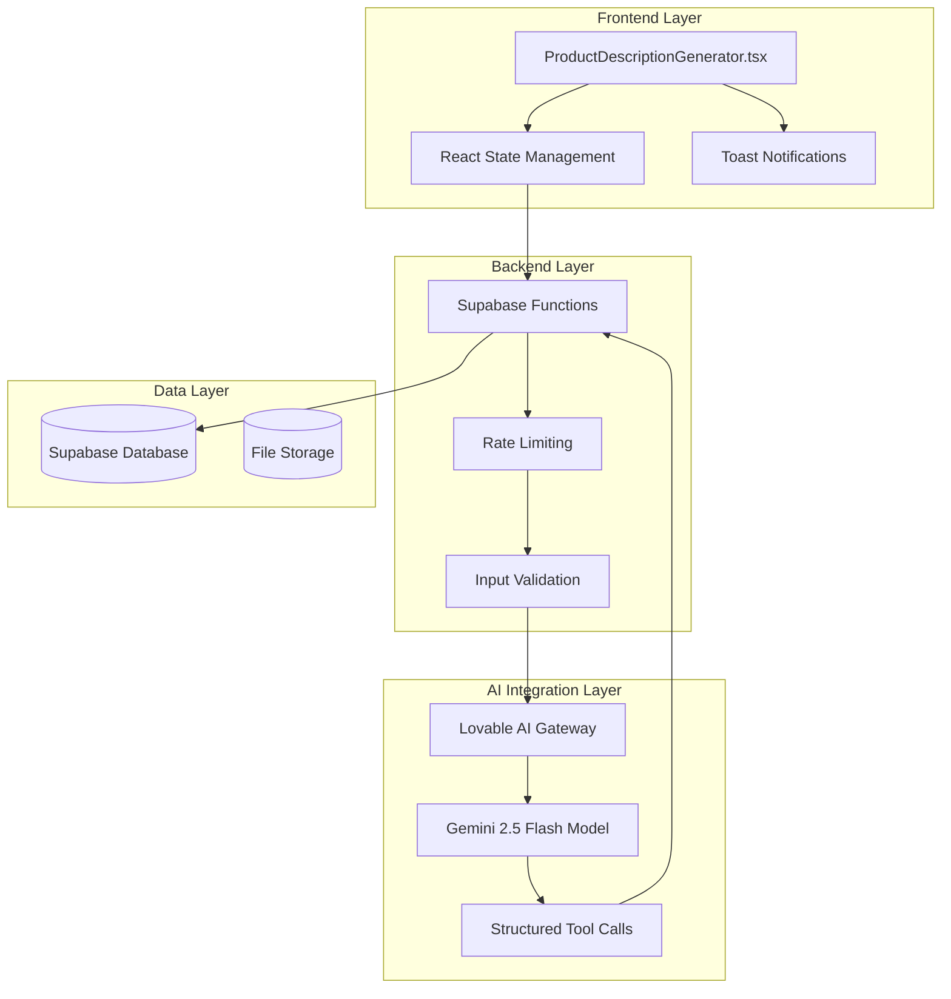
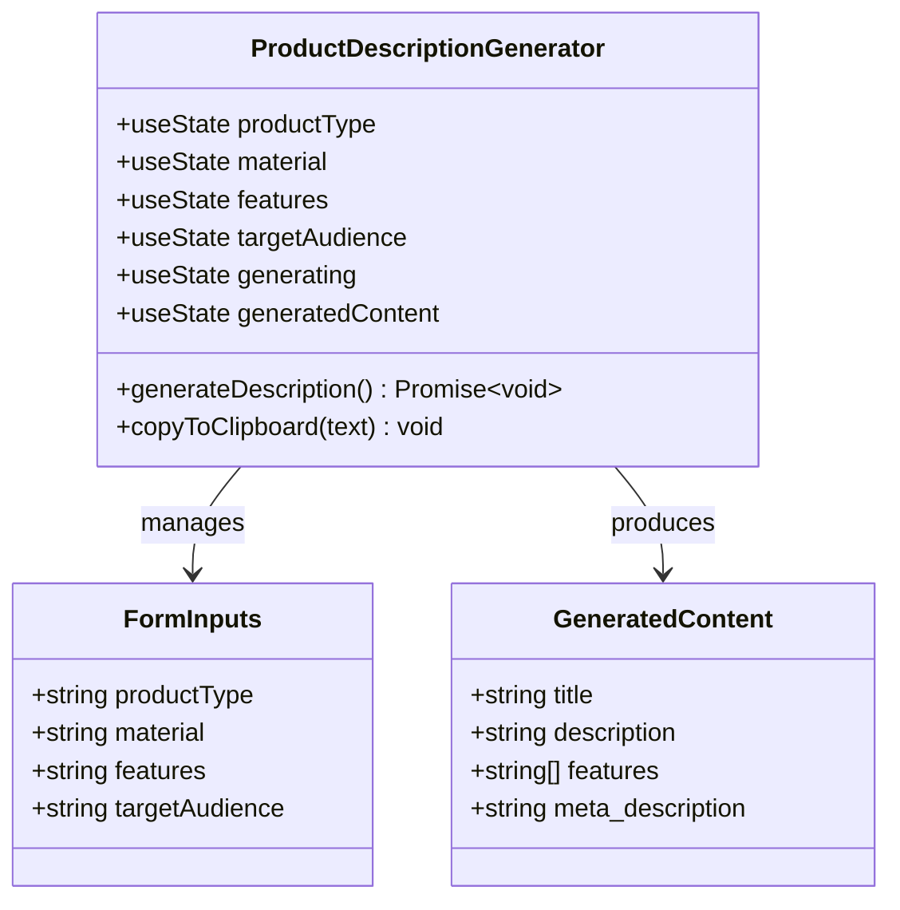
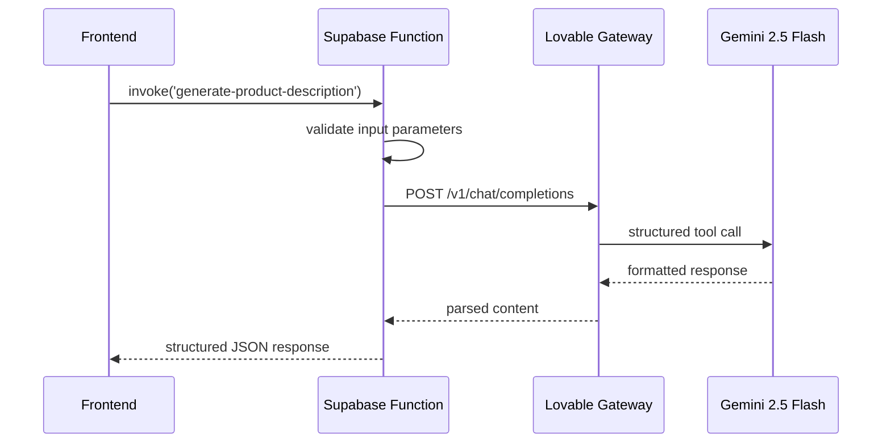
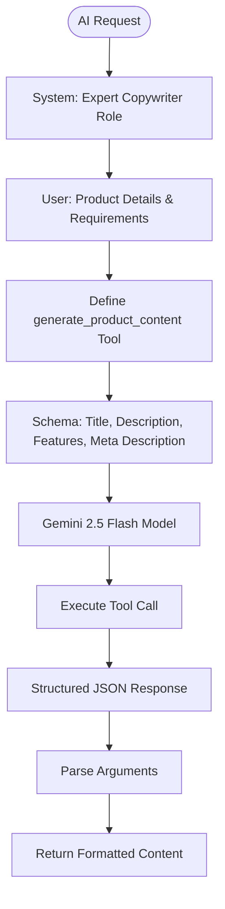
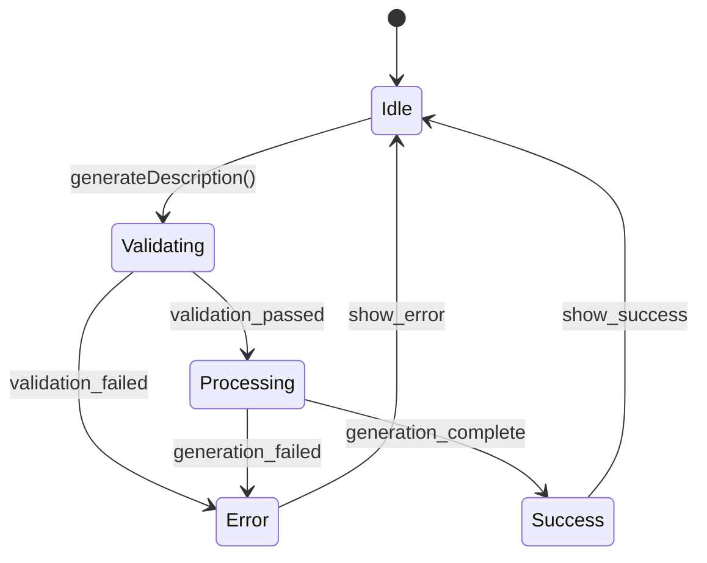
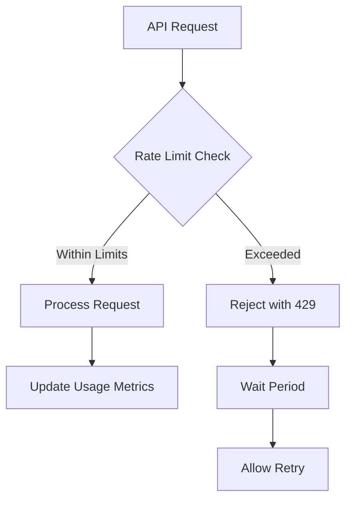

# Product Description Generation

<cite>
**Referenced Files in This Document**
- [ProductDescriptionGenerator.tsx](file://src/components/admin/ProductDescriptionGenerator.tsx)
- [generate-product-description/index.ts](file://supabase/functions/generate-product-description/index.ts)
- [AdminProducts.tsx](file://src/pages/admin/AdminProducts.tsx)
- [client.ts](file://src/integrations/supabase/client.ts)
- [RateLimitMonitoringDashboard.tsx](file://src/components/admin/RateLimitMonitoringDashboard.tsx)
- [database.ts](file://src/types/database.ts)
- [marketplace.ts](file://src/types/marketplace.ts)
</cite>

## Table of Contents
1. [Introduction](#introduction)
2. [System Architecture](#system-architecture)
3. [Frontend Implementation](#frontend-implementation)
4. [Backend Supabase Function](#backend-supabase-function)
5. [AI Integration with Lovable Gateway](#ai-integration-with-lovable-gateway)
6. [Data Flow and Processing](#data-flow-and-processing)
7. [Error Handling and Toast Notifications](#error-handling-and-toast-notifications)
8. [Rate Limiting and Performance](#rate-limiting-and-performance)
9. [SEO Optimization Guidelines](#seo-optimization-guidelines)
10. [Best Practices and Brand Voice](#best-practices-and-brand-voice)
11. [Troubleshooting Guide](#troubleshooting-guide)
12. [Conclusion](#conclusion)

## Introduction

The Product Description Generation feature in sleekapp-v100 provides an AI-powered solution for creating professional, SEO-optimized product descriptions for apparel products. Built on a modern React frontend with a Supabase backend, this system leverages Google's Gemini 2.5 Flash model through the Lovable AI Gateway to generate comprehensive product content including titles, descriptions, feature bullets, and meta descriptions.

The feature serves as a powerful productivity tool for administrators managing product catalogs, enabling rapid content creation while maintaining brand consistency and SEO best practices. It integrates seamlessly with the existing product management workflow, providing immediate feedback and copy-to-clipboard functionality for easy content adoption.

## System Architecture

The product description generation system follows a serverless architecture pattern with clear separation of concerns between frontend presentation, backend processing, and AI service integration.



**Diagram sources**
- [ProductDescriptionGenerator.tsx](file://src/components/admin/ProductDescriptionGenerator.tsx#L1-L176)
- [generate-product-description/index.ts](file://supabase/functions/generate-product-description/index.ts#L1-L91)

**Section sources**
- [ProductDescriptionGenerator.tsx](file://src/components/admin/ProductDescriptionGenerator.tsx#L1-L176)
- [generate-product-description/index.ts](file://supabase/functions/generate-product-description/index.ts#L1-L91)

## Frontend Implementation

The frontend component is built using React with TypeScript, leveraging the shadcn/ui component library for consistent UI patterns. The implementation focuses on user experience with real-time feedback and intuitive form controls.

### Component Structure and State Management

The [`ProductDescriptionGenerator`](file://src/components/admin/ProductDescriptionGenerator.tsx) component manages four primary form inputs through React state hooks:

- **Product Type**: Required field capturing the core product category
- **Material**: Optional field specifying fabric composition
- **Features**: Comma-separated list of product attributes
- **Target Audience**: Optional field defining the intended market segment



**Diagram sources**
- [ProductDescriptionGenerator.tsx](file://src/components/admin/ProductDescriptionGenerator.tsx#L12-L17)

### Form Controls and User Interface

The interface employs a responsive grid layout with clear labeling and placeholder guidance:

- **Product Type Field**: Required input with validation
- **Material Field**: Optional with default fallback
- **Features Field**: Comma-separated input with automatic parsing
- **Target Audience Field**: Optional with B2B default

### Copy-to-Clipboard Functionality

The component implements seamless copy-to-clipboard functionality using the browser's Clipboard API, providing immediate visual feedback through toast notifications.

**Section sources**
- [ProductDescriptionGenerator.tsx](file://src/components/admin/ProductDescriptionGenerator.tsx#L1-L176)

## Backend Supabase Function

The [`generate-product-description`](file://supabase/functions/generate-product-description/index.ts) function serves as the core processing engine, handling input validation, AI integration, and response formatting.

### Function Architecture



**Diagram sources**
- [generate-product-description/index.ts](file://supabase/functions/generate-product-description/index.ts#L28-L82)

### Input Processing and Validation

The function validates incoming requests and prepares structured prompts for the AI model:

- **Parameter Extraction**: Destructures product_type, material, features, and target_audience
- **Default Values**: Provides sensible defaults for optional parameters
- **Feature Parsing**: Converts comma-separated strings to arrays with filtering

### Response Formatting

The function returns a standardized JSON structure containing all generated content:

```typescript
{
  success: true,
  content: {
    title: string,
    description: string,
    features: Array<string>,
    meta_description: string
  }
}
```

**Section sources**
- [generate-product-description/index.ts](file://supabase/functions/generate-product-description/index.ts#L1-L91)

## AI Integration with Lovable Gateway

The system integrates with the Lovable AI Gateway to leverage Google's Gemini 2.5 Flash model through structured tool calls, ensuring consistent and reliable content generation.

### System and User Prompts

The AI integration uses carefully crafted prompts to guide content generation:

**System Prompt**: Establishes the expert copywriter role with focus on apparel product descriptions and SEO optimization.

**User Prompt**: Provides structured input parameters including product type, material, features, and target audience with explicit requirements for the desired output format.

### Structured Tool Call Implementation

The system employs a sophisticated tool call mechanism to ensure structured output:



**Diagram sources**
- [generate-product-description/index.ts](file://supabase/functions/generate-product-description/index.ts#L44-L67)

### Model Configuration

The integration specifies:
- **Model**: google/gemini-2.5-flash
- **Tool Choice**: Explicit function call selection
- **Response Format**: Strict JSON schema adherence

**Section sources**
- [generate-product-description/index.ts](file://supabase/functions/generate-product-description/index.ts#L44-L67)

## Data Flow and Processing

The complete data flow demonstrates the seamless integration between frontend, backend, and AI services.

### Complete Processing Pipeline

```mermaid
flowchart LR
subgraph "Input Phase"
A[User Form Input] --> B[Frontend Validation]
B --> C[State Management]
end
subgraph "Processing Phase"
C --> D[Supabase Function Invocation]
D --> E[Parameter Preparation]
E --> F[AI Gateway Request]
end
subgraph "AI Processing"
F --> G[System Prompt]
G --> H[User Prompt]
H --> I[Tool Definition]
I --> J[Gemini 2.5 Flash]
J --> K[Structured Output]
end
subgraph "Output Phase"
K --> L[Response Parsing]
L --> M[JSON Formatting]
M --> N[Frontend Display]
N --> O[User Feedback]
end
```



**Diagram sources**
- [ProductDescriptionGenerator.tsx](file://src/components/admin/ProductDescriptionGenerator.tsx#L19-L48)
- [generate-product-description/index.ts](file://supabase/functions/generate-product-description/index.ts#L28-L82)

### Content Generation Specifications

The system generates content according to specific requirements:

| Content Type | Character/Word Limits | Purpose |
|--------------|----------------------|---------|
| Product Title | Flexible | Catchy, keyword-rich |
| Full Description | 200-300 words | Comprehensive product narrative |
| Feature Bullets | 5-7 items | Highlight key attributes |
| Meta Description | 150-160 characters | SEO optimization |

**Section sources**
- [generate-product-description/index.ts](file://supabase/functions/generate-product-description/index.ts#L24-L35)

## Error Handling and Toast Notifications

The system implements comprehensive error handling with user-friendly toast notifications for improved user experience.

### Frontend Error Handling

The [`ProductDescriptionGenerator`](file://src/components/admin/ProductDescriptionGenerator.tsx) component handles various error scenarios:

- **Validation Errors**: Product type requirement validation
- **Network Errors**: API communication failures
- **Processing Errors**: AI service unavailability

### Toast Notification System

The implementation uses the Sonner toast library for contextual feedback:



**Diagram sources**
- [ProductDescriptionGenerator.tsx](file://src/components/admin/ProductDescriptionGenerator.tsx#L19-L48)

### Error Recovery Strategies

The system provides graceful degradation:
- **Missing Product Type**: Immediate user feedback
- **API Failures**: Retry mechanisms with user notification
- **AI Service Issues**: Fallback messaging and logging

**Section sources**
- [ProductDescriptionGenerator.tsx](file://src/components/admin/ProductDescriptionGenerator.tsx#L19-L48)

## Rate Limiting and Performance

The system incorporates robust rate limiting to ensure fair usage and system stability.

### Rate Limiting Implementation

While the specific rate limiting configuration isn't directly visible in the product description generator, the system inherits comprehensive rate limiting from the broader Supabase infrastructure:



**Diagram sources**
- [RateLimitMonitoringDashboard.tsx](file://src/components/admin/RateLimitMonitoringDashboard.tsx#L30-L80)

### Performance Optimization

Key performance considerations include:
- **Request Throttling**: Prevents API abuse
- **Caching Strategies**: Reduces redundant AI calls
- **Async Processing**: Non-blocking user interface
- **Resource Monitoring**: Real-time usage tracking

**Section sources**
- [RateLimitMonitoringDashboard.tsx](file://src/components/admin/RateLimitMonitoringDashboard.tsx#L1-L165)

## SEO Optimization Guidelines

The system is designed to generate SEO-optimized content following established best practices.

### SEO Content Standards

The generated content adheres to specific SEO guidelines:

| Element | Character/Word Count | SEO Benefits |
|---------|---------------------|--------------|
| Title Tag | Flexible | Primary keyword placement |
| Meta Description | 150-160 chars | Click-through rate optimization |
| Body Content | 200-300 words | Content depth and relevance |
| Feature Lists | 5-7 bullet points | Scannable information architecture |

### Keyword Integration Strategies

The AI prompts emphasize strategic keyword placement:
- **Primary Keywords**: Natural integration in titles and descriptions
- **Secondary Keywords**: Contextual inclusion in feature lists
- **Long-tail Phrases**: Descriptive attribute highlighting

### Content Structure Optimization

Generated content follows SEO best practices:
- **Clear Headings**: Logical information hierarchy
- **Internal Linking**: Contextual product references
- **Mobile Optimization**: Responsive content formatting
- **Loading Speed**: Optimized character counts

**Section sources**
- [generate-product-description/index.ts](file://supabase/functions/generate-product-description/index.ts#L21-L35)

## Best Practices and Brand Voice

Maintaining consistent brand voice while leveraging AI-generated content requires careful prompt engineering and content validation.

### Brand Consistency Guidelines

The system ensures brand alignment through:
- **Tone Specification**: Professional yet approachable language
- **Style Guidelines**: Consistent terminology and formatting
- **Voice Patterns**: Repetitive phrase structures and vocabulary

### Content Quality Assurance

Implementation includes several quality checks:
- **Grammar and Spelling**: Automated validation
- **Relevance Verification**: Context-appropriate content
- **Brand Alignment**: Consistent messaging standards

### Human Oversight Requirements

While AI generates initial content, human review remains essential:
- **Final Approval**: Administrative oversight
- **Customization**: Brand-specific adjustments
- **Quality Control**: Manual refinement processes

**Section sources**
- [generate-product-description/index.ts](file://supabase/functions/generate-product-description/index.ts#L21-L22)

## Troubleshooting Guide

Common issues and resolution strategies for the product description generation system.

### Technical Issues

| Issue | Symptoms | Resolution |
|-------|----------|------------|
| API Timeout | Long loading times | Check network connectivity |
| Invalid Response | Malformed JSON | Verify input parameters |
| Rate Limiting | 429 HTTP errors | Implement retry logic |
| Authentication | 401/403 errors | Verify API keys |

### Content Issues

| Issue | Symptoms | Resolution |
|-------|----------|------------|
| Poor Quality | Generic content | Adjust input parameters |
| SEO Problems | Missing keywords | Refine system prompts |
| Length Issues | Too short/long | Modify content requirements |
| Style Mismatches | Inconsistent tone | Update brand guidelines |

### Performance Issues

Common performance bottlenecks and solutions:
- **Slow AI Responses**: Optimize prompt length
- **High API Costs**: Implement caching strategies
- **Memory Usage**: Monitor concurrent requests
- **Network Latency**: Use CDN for static assets

**Section sources**
- [generate-product-description/index.ts](file://supabase/functions/generate-product-description/index.ts#L84-L91)

## Conclusion

The Product Description Generation feature represents a sophisticated integration of modern web technologies, AI capabilities, and business requirements. By combining React's component architecture with Supabase's serverless functions and Lovable's AI gateway, the system delivers a powerful tool for content creation while maintaining technical excellence and user experience standards.

The implementation demonstrates best practices in:
- **Modular Architecture**: Clear separation of concerns
- **Error Handling**: Comprehensive user feedback
- **Performance Optimization**: Efficient resource utilization
- **SEO Compliance**: Search engine friendly content
- **Brand Consistency**: Maintained voice and tone

Future enhancements could include content preview capabilities, batch generation features, and advanced customization options for different product categories and target markets.