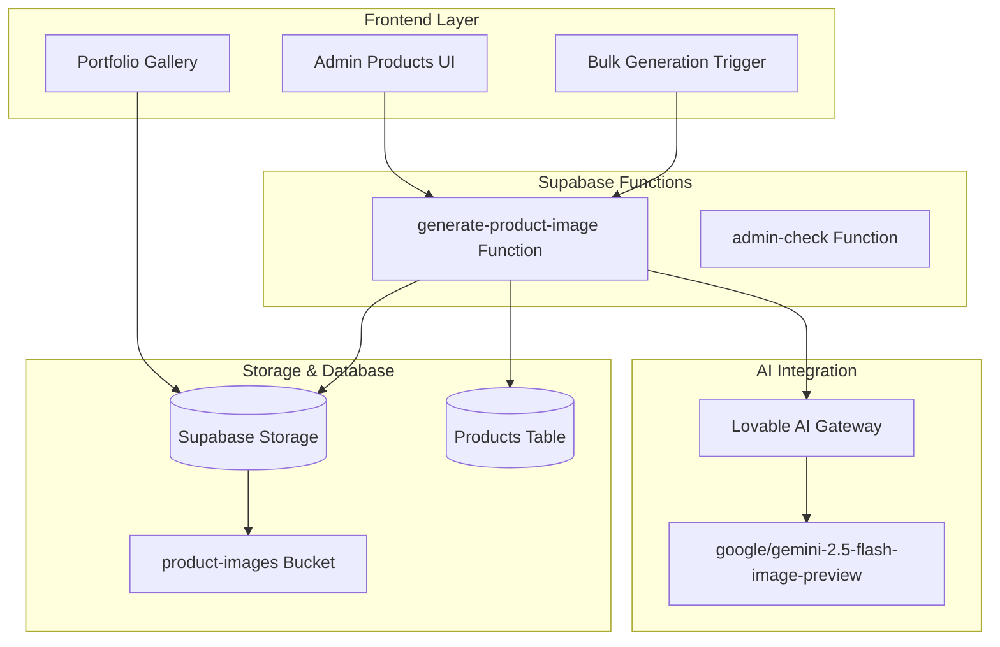
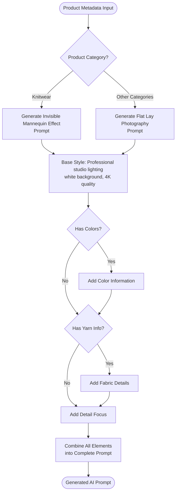
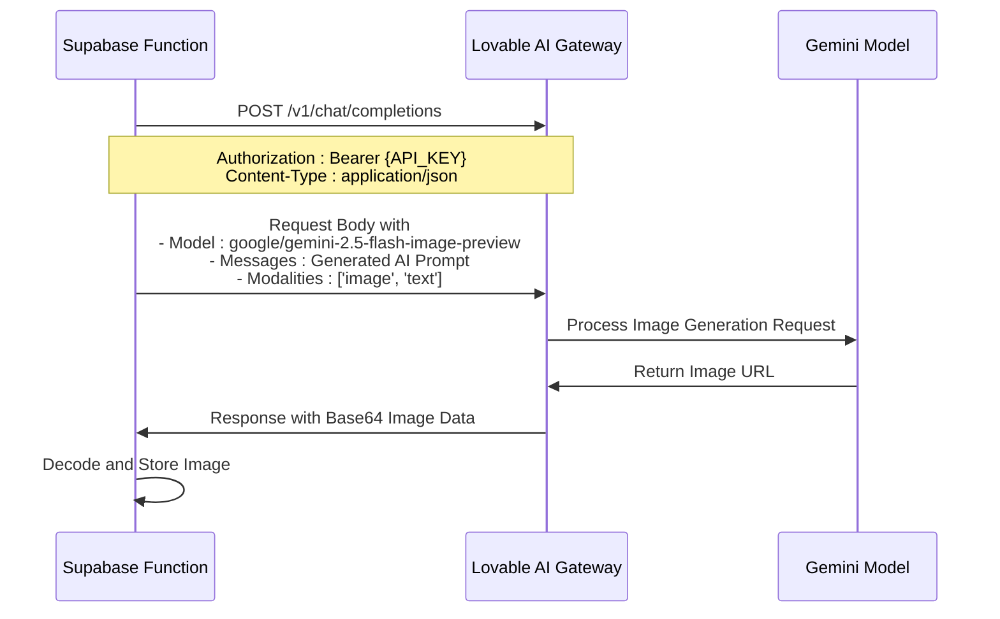
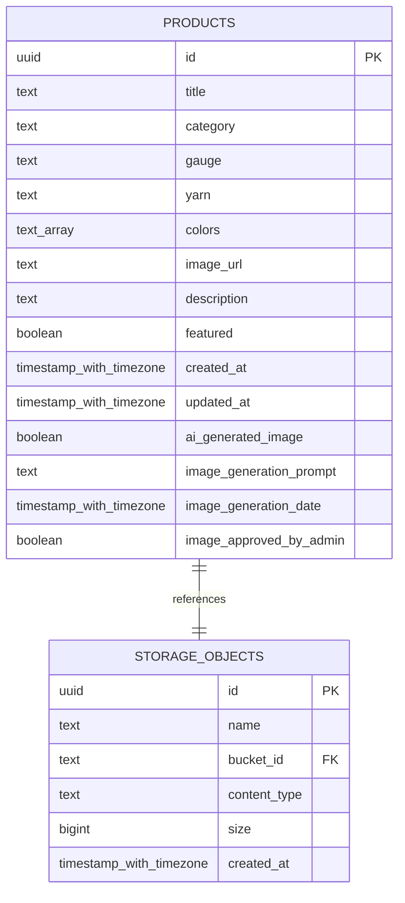
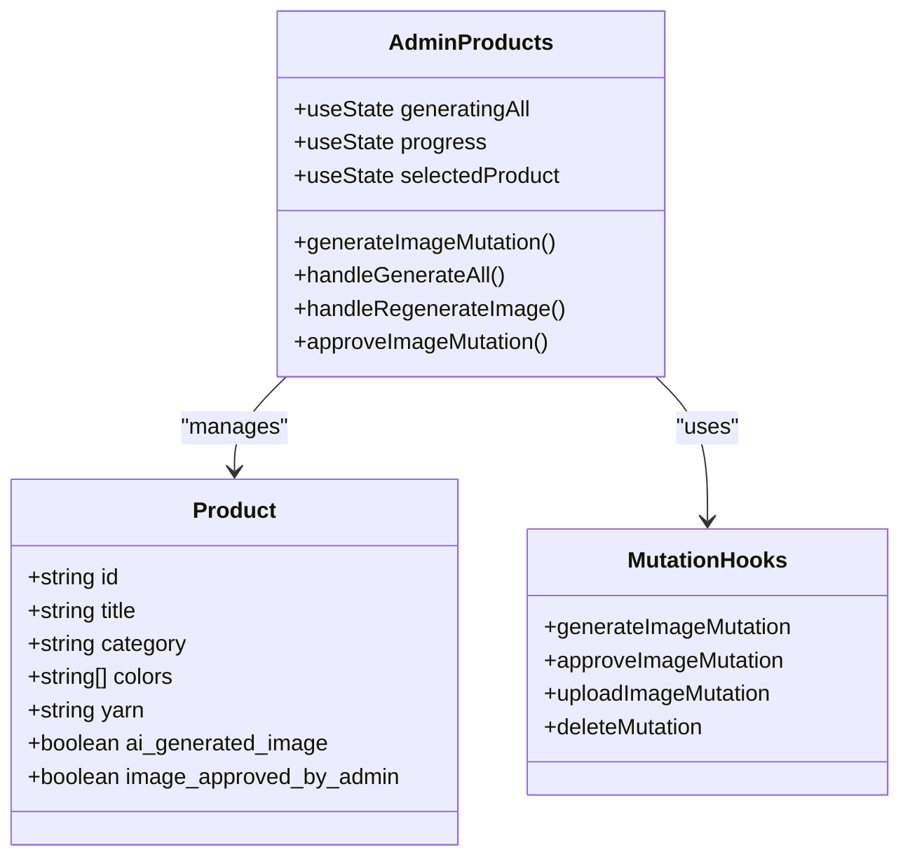
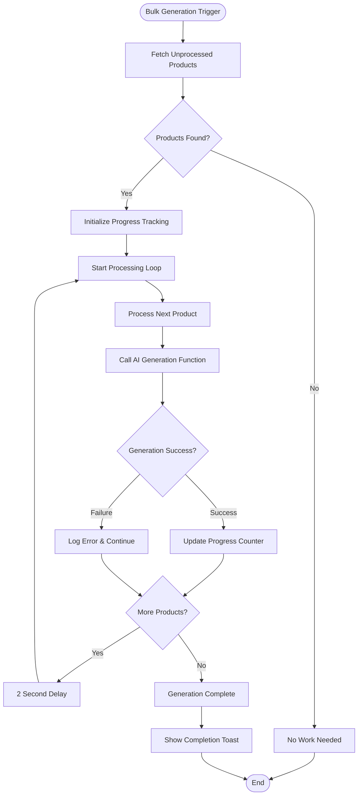
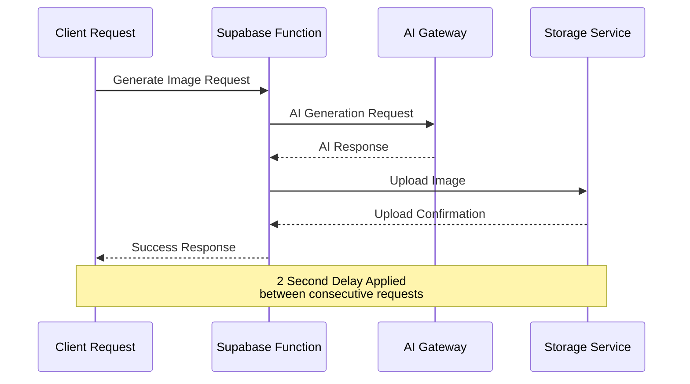
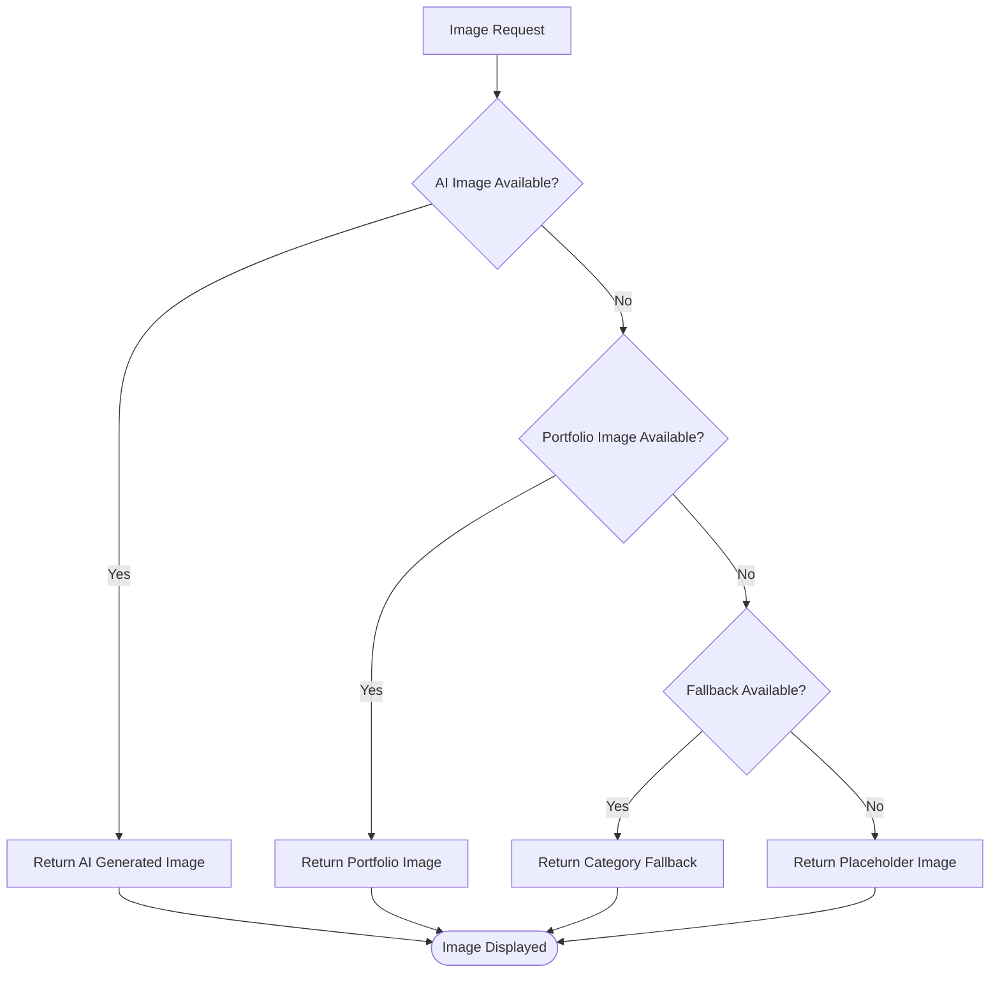
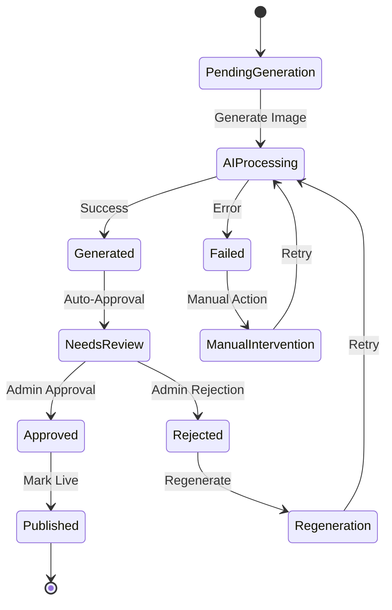

# Product Image Generation System

<cite>
**Referenced Files in This Document**
- [BulkGenerationTrigger.tsx](file://src/pages/BulkGenerationTrigger.tsx)
- [AdminProducts.tsx](file://src/pages/admin/AdminProducts.tsx)
- [generate-product-image/index.ts](file://supabase/functions/generate-product-image/index.ts)
- [aiGeneratedProductImages.ts](file://src/lib/aiGeneratedProductImages.ts)
- [portfolioImages.ts](file://src/lib/portfolioImages.ts)
- [portfolioImagesPhotorealistic.ts](file://src/lib/portfolioImagesPhotorealistic.ts)
- [20250122010000_setup_product_images_storage.sql](file://supabase/migrations/20250122010000_setup_product_images_storage.sql)
- [20251115150759_remix_migration_from_pg_dump.sql](file://supabase/migrations/20251115150759_remix_migration_from_pg_dump.sql)
- [AIVisualShowcase.tsx](file://src/pages/AIVisualShowcase.tsx)
</cite>

## Table of Contents
1. [Introduction](#introduction)
2. [System Architecture](#system-architecture)
3. [AI Prompt Engineering](#ai-prompt-engineering)
4. [Integration with Lovable AI Gateway](#integration-with-lovable-ai-gateway)
5. [Storage and Database Operations](#storage-and-database-operations)
6. [Frontend Implementation](#frontend-implementation)
7. [Error Handling and Rate Limiting](#error-handling-and-rate-limiting)
8. [Fallback Mechanisms](#fallback-mechanisms)
9. [Approval Workflow](#approval-workflow)
10. [Performance Considerations](#performance-considerations)
11. [Troubleshooting Guide](#troubleshooting-guide)

## Introduction

The Product Image Generation System in sleekapp-v100 is a sophisticated AI-driven solution that creates professional-grade product visual assets using advanced prompt engineering and machine learning integration. The system transforms product metadata into high-quality, studio-quality images with professional photography characteristics, including studio lighting, white backgrounds, and detailed fabric textures.

The system serves as a comprehensive solution for e-commerce product catalog management, enabling businesses to quickly generate visually appealing product images without requiring professional photography resources. It integrates seamlessly with the Supabase backend infrastructure and provides both individual and bulk generation capabilities.

## System Architecture

The product image generation system follows a serverless architecture with clear separation of concerns between frontend interfaces, AI processing, and database operations.



**Diagram sources**
- [AdminProducts.tsx](file://src/pages/admin/AdminProducts.tsx#L1-L665)
- [BulkGenerationTrigger.tsx](file://src/pages/BulkGenerationTrigger.tsx#L1-L79)
- [generate-product-image/index.ts](file://supabase/functions/generate-product-image/index.ts#L1-L138)

**Section sources**
- [AdminProducts.tsx](file://src/pages/admin/AdminProducts.tsx#L1-L50)
- [BulkGenerationTrigger.tsx](file://src/pages/BulkGenerationTrigger.tsx#L1-L30)

## AI Prompt Engineering

The system employs sophisticated prompt engineering to generate high-quality product images with professional photography characteristics. The prompt generation logic varies based on product category and incorporates comprehensive product metadata.

### Prompt Generation Logic

The prompt generation follows a hierarchical structure that adapts the photographic style based on product type:



**Diagram sources**
- [generate-product-image/index.ts](file://supabase/functions/generate-product-image/index.ts#L23-L35)

### Category-Specific Adaptations

The system implements specialized prompt engineering for different product categories:

| Category | Display Style | Special Features |
|----------|---------------|------------------|
| **Knitwear** | Invisible mannequin effect, ghost mannequin technique | Emphasizes fabric texture, stitch details, seamless appearance |
| **Cut & Sew** | Flat lay photography, perfectly aligned | Focuses on clean presentation, fabric drape, construction details |
| **Uniforms** | Professional retail presentation | Highlights branding, sizing, uniform characteristics |
| **Accessories** | Close-up product focus | Emphasizes texture, material quality, functional details |

### Prompt Template Structure

The generated prompts follow a consistent template structure:

```
Professional product photography, studio lighting with soft shadows, pure white background (#FFFFFF), ultra-realistic fabric texture visible, 4K commercial fashion photography quality, high detail. 
[Category-specific display style]. 
[Product Title] - [Product Type/Subcategory]. 
[Product Description]. 
[Color Information]. 
[Fabric Information]. 
Show fabric texture, stitching details, collar and cuff details if applicable. Professional retail product presentation. No models, no lifestyle shots, pure product focus.
```

**Section sources**
- [generate-product-image/index.ts](file://supabase/functions/generate-product-image/index.ts#L23-L35)

## Integration with Lovable AI Gateway

The system integrates with the Lovable AI Gateway using the Google Gemini 2.5 Flash Image Preview model, providing access to advanced multimodal AI capabilities.

### API Configuration

The integration utilizes a RESTful API endpoint with specific configuration parameters:



**Diagram sources**
- [generate-product-image/index.ts](file://supabase/functions/generate-product-image/index.ts#L40-L67)

### Authentication and Security

The system implements secure API communication with the following security measures:

- **API Key Management**: Uses environment variable `LOVABLE_API_KEY` for authentication
- **Bearer Token Authentication**: Implements proper authorization header format
- **HTTPS Protocol**: Ensures encrypted communication channel
- **Rate Limiting**: Built-in protection against excessive API calls

### Response Processing

The system handles the AI gateway response through a structured pipeline:

1. **Validation**: Checks for successful HTTP response status
2. **Data Extraction**: Parses JSON response for image URL
3. **Base64 Decoding**: Converts encoded image data to binary format
4. **Format Validation**: Ensures proper WebP format compliance

**Section sources**
- [generate-product-image/index.ts](file://supabase/functions/generate-product-image/index.ts#L40-L67)

## Storage and Database Operations

The system manages product images through a comprehensive storage and database architecture that ensures data integrity, performance, and scalability.

### Storage Configuration

The Supabase storage system is configured with specific policies and limitations:

| Configuration | Value | Purpose |
|---------------|-------|---------|
| **Bucket Name** | `product-images` | Dedicated storage for product visual assets |
| **Public Access** | Enabled | Allows CDN delivery of images |
| **Max File Size** | 5MB | Prevents oversized uploads |
| **Allowed MIME Types** | `image/jpeg`, `image/jpg`, `image/png`, `image/webp`, `image/gif` | Ensures compatibility |
| **File Naming** | `{product_id}-{timestamp}.webp` | Provides uniqueness and organization |

### Database Schema

The products table includes comprehensive fields for AI-generated image management:



**Diagram sources**
- [20251115150759_remix_migration_from_pg_dump.sql](file://supabase/migrations/20251115150759_remix_migration_from_pg_dump.sql#L1415-L1430)
- [20250122010000_setup_product_images_storage.sql](file://supabase/migrations/20250122010000_setup_product_images_storage.sql#L12-L22)

### Update Operations

The system performs atomic database updates to maintain data consistency:

1. **Image URL Storage**: Updates product record with generated image URL
2. **AI Flag Setting**: Marks product as AI-generated
3. **Prompt Logging**: Stores the exact prompt used for generation
4. **Timestamp Recording**: Captures generation completion time
5. **Approval Status Reset**: Sets admin approval flag to false

**Section sources**
- [generate-product-image/index.ts](file://supabase/functions/generate-product-image/index.ts#L99-L114)
- [20250122010000_setup_product_images_storage.sql](file://supabase/migrations/20250122010000_setup_product_images_storage.sql#L1-L169)

## Frontend Implementation

The frontend provides comprehensive interfaces for both individual and bulk product image generation, with intuitive user experiences and robust error handling.

### Individual Generation Interface

The Admin Products page offers granular control over individual product image generation:



**Diagram sources**
- [AdminProducts.tsx](file://src/pages/admin/AdminProducts.tsx#L17-L30)

### Bulk Generation Interface

The BulkGenerationTrigger component provides automated batch processing capabilities:



**Diagram sources**
- [BulkGenerationTrigger.tsx](file://src/pages/BulkGenerationTrigger.tsx#L8-L65)

### User Interface Features

The frontend implementation includes several user-friendly features:

- **Progress Indicators**: Real-time feedback during bulk operations
- **Toast Notifications**: Comprehensive status updates and error reporting
- **Loading States**: Clear indication of ongoing operations
- **Error Recovery**: Graceful handling of failed generations
- **Approval Workflows**: Streamlined admin review process

**Section sources**
- [AdminProducts.tsx](file://src/pages/admin/AdminProducts.tsx#L65-L128)
- [BulkGenerationTrigger.tsx](file://src/pages/BulkGenerationTrigger.tsx#L1-L79)

## Error Handling and Rate Limiting

The system implements comprehensive error handling and rate limiting strategies to ensure reliable operation under various conditions.

### Rate Limiting Strategy

The system employs multiple layers of rate limiting protection:



**Diagram sources**
- [BulkGenerationTrigger.tsx](file://src/pages/BulkGenerationTrigger.tsx#L50-L52)

### Error Handling Mechanisms

The system implements layered error handling across all components:

| Error Type | Handler | Recovery Strategy |
|------------|---------|-------------------|
| **Network Errors** | Retry Logic | Automatic retry with exponential backoff |
| **AI Generation Failures** | Fallback to Defaults | Use existing images or category defaults |
| **Storage Failures** | Rollback Operations | Revert database updates on storage errors |
| **Validation Errors** | Input Sanitization | Reject malformed requests with clear messages |
| **Authentication Errors** | API Key Rotation | Automatic key validation and refresh |

### Exception Management

The system captures and processes exceptions through structured error handling:

1. **AI Gateway Errors**: Handles HTTP status codes and response validation
2. **Storage Errors**: Manages upload failures and cleanup operations
3. **Database Errors**: Ensures transaction rollback on failure
4. **Network Errors**: Implements timeout and retry mechanisms

**Section sources**
- [generate-product-image/index.ts](file://supabase/functions/generate-product-image/index.ts#L125-L137)
- [BulkGenerationTrigger.tsx](file://src/pages/BulkGenerationTrigger.tsx#L54-L58)

## Fallback Mechanisms

The system implements sophisticated fallback mechanisms to ensure continuous operation even when AI generation fails or images are unavailable.

### Portfolio Image Fallback

The system maintains a comprehensive fallback library for portfolio images:



**Diagram sources**
- [portfolioImages.ts](file://src/lib/portfolioImages.ts#L86-L131)
- [portfolioImagesPhotorealistic.ts](file://src/lib/portfolioImagesPhotorealistic.ts#L126-L161)

### Photorealistic Image Matching

The photorealistic image system provides intelligent fallback matching:

| Matching Strategy | Priority | Examples |
|-------------------|----------|----------|
| **Exact Match** | Highest | Direct filename matches |
| **Partial Match** | High | Substring matching (e.g., "navy-polo" matches "navy-polo-pro") |
| **Category Fallback** | Medium | Default images by product category |
| **Extension Normalization** | Low | Automatic format conversion (.png → .webp) |
| **URL Validation** | Highest | Direct external image URLs |

### Category-Based Defaults

The system maintains category-specific default images:

- **Knitwear**: Default polo shirt images
- **Uniforms**: School uniform collections
- **Accessories**: Basic beanies and caps
- **Cut & Sew**: Oxford shirts and classic garments

**Section sources**
- [portfolioImagesPhotorealistic.ts](file://src/lib/portfolioImagesPhotorealistic.ts#L23-L30)
- [portfolioImages.ts](file://src/lib/portfolioImages.ts#L86-L131)

## Approval Workflow

The system implements a comprehensive approval workflow that ensures quality control while maintaining efficient processing.

### Admin Review Process

The approval workflow consists of several stages:



**Diagram sources**
- [AdminProducts.tsx](file://src/pages/admin/AdminProducts.tsx#L87-L100)

### Approval Status Tracking

The system tracks approval status through database fields:

- **`image_approved_by_admin`**: Boolean flag indicating admin approval
- **`image_generation_date`**: Timestamp of generation completion
- **`image_generation_prompt`**: Exact prompt used for generation
- **`ai_generated_image`**: Boolean flag marking AI-generated content

### Bulk Approval Operations

The system supports bulk approval operations for efficiency:

- **Batch Approval**: Approve multiple images simultaneously
- **Selective Approval**: Approve based on criteria filters
- **Mass Rejection**: Reject problematic batches
- **Status Reporting**: Comprehensive approval statistics

**Section sources**
- [AdminProducts.tsx](file://src/pages/admin/AdminProducts.tsx#L87-L100)
- [AdminProducts.tsx](file://src/pages/admin/AdminProducts.tsx#L279-L284)

## Performance Considerations

The system is optimized for performance across multiple dimensions, ensuring efficient operation at scale.

### Optimization Strategies

| Optimization Area | Implementation | Benefits |
|-------------------|----------------|----------|
| **Concurrent Processing** | Parallel AI requests with controlled batching | Improved throughput |
| **Caching** | Local caching of frequently accessed images | Reduced load times |
| **Compression** | WebP format with optimal quality settings | Smaller file sizes |
| **CDN Integration** | Supabase storage with global distribution | Faster delivery |
| **Lazy Loading** | Progressive image loading in galleries | Better UX performance |

### Memory Management

The system implements efficient memory usage patterns:

- **Streaming Processing**: Process images without full memory loads
- **Garbage Collection**: Automatic cleanup of temporary data
- **Resource Pooling**: Reuse of network connections and clients
- **Memory Monitoring**: Runtime memory usage tracking

### Scalability Features

The architecture supports horizontal scaling:

- **Serverless Functions**: Auto-scaling based on demand
- **Distributed Storage**: Load-balanced storage infrastructure
- **Queue Processing**: Asynchronous job processing
- **Database Scaling**: Read replicas and connection pooling

## Troubleshooting Guide

Common issues and their resolution strategies for the product image generation system.

### AI Generation Issues

**Problem**: AI generation fails consistently
**Symptoms**: Error messages about API connectivity or generation failures
**Resolution**:
1. Verify Lovable API key configuration
2. Check network connectivity to AI gateway
3. Review rate limiting quotas
4. Validate product metadata completeness

**Problem**: Poor quality generated images
**Symptoms**: Blurry, low-resolution, or irrelevant images
**Resolution**:
1. Refine product metadata (titles, descriptions, colors)
2. Adjust category assignments
3. Review prompt engineering logic
4. Consider manual intervention for critical products

### Storage and Database Issues

**Problem**: Images not saving to storage
**Symptoms**: Successful API responses but missing images
**Resolution**:
1. Verify storage bucket permissions
2. Check file size limits
3. Validate MIME type configurations
4. Review database update operations

**Problem**: Database inconsistencies
**Symptoms**: Missing image URLs or corrupted records
**Resolution**:
1. Run database integrity checks
2. Verify foreign key relationships
3. Check for orphaned records
4. Implement data recovery procedures

### Frontend Interface Issues

**Problem**: Bulk generation appears stuck
**Symptoms**: Progress indicators not updating, no error messages
**Resolution**:
1. Check browser console for JavaScript errors
2. Verify network connectivity
3. Review toast notification settings
4. Monitor function invocation logs

**Problem**: Approval workflow not functioning
**Symptoms**: Approval buttons inactive or failing silently
**Resolution**:
1. Verify admin authentication
2. Check database write permissions
3. Review mutation hook implementations
4. Validate approval logic flow

**Section sources**
- [generate-product-image/index.ts](file://supabase/functions/generate-product-image/index.ts#L125-L137)
- [BulkGenerationTrigger.tsx](file://src/pages/BulkGenerationTrigger.tsx#L54-L58)