# User-Generated Content Management

<cite>
**Referenced Files in This Document**
- [supabase/functions/submit-blog-comment/index.ts](file://supabase/functions/submit-blog-comment/index.ts)
- [src/components/blog/BlogEditor.tsx](file://src/components/blog/BlogEditor.tsx)
- [src/pages/AdminBlog.tsx](file://src/pages/AdminBlog.tsx)
- [src/pages/AdminBlogEditor.tsx](file://src/pages/AdminBlogEditor.tsx)
- [src/pages/BlogPost.tsx](file://src/pages/BlogPost.tsx)
- [src/hooks/useNotifications.ts](file://src/hooks/useNotifications.ts)
- [src/lib/supabaseHelpers.ts](file://src/lib/supabaseHelpers.ts)
- [supabase/migrations/20251121151938_f8ef64fa-2788-4f5f-97ae-0cc88e97b4dc.sql](file://supabase/migrations/20251121151938_f8ef64fa-2788-4f5f-97ae-0cc88e97b4dc.sql)
- [supabase/FIXED_SETUP_PART1.sql](file://supabase/FIXED_SETUP_PART1.sql)
- [supabase/COMPLETE_SETUP.sql](file://supabase/COMPLETE_SETUP.sql)
</cite>

## Table of Contents
1. [Introduction](#introduction)
2. [System Architecture](#system-architecture)
3. [Core Components](#core-components)
4. [Security and Validation](#security-and-validation)
5. [Moderation Workflow](#moderation-workflow)
6. [Database Schema](#database-schema)
7. [Frontend Integration](#frontend-integration)
8. [Admin Management](#admin-management)
9. [Rate Limiting and Spam Protection](#rate-limiting-and-spam-protection)
10. [GDPR Compliance](#gdpr-compliance)
11. [Performance Considerations](#performance-considerations)
12. [Troubleshooting Guide](#troubleshooting-guide)
13. [Best Practices](#best-practices)

## Introduction

SleekApp's user-generated content management system provides a comprehensive solution for handling blog comments with robust security measures, moderation workflows, and GDPR compliance. The system ensures that all user comments undergo thorough review before publication while maintaining user privacy and preventing spam submissions.

The core functionality centers around the `submit-blog-comment` Edge Function, which handles comment submissions with comprehensive security validations including reCAPTCHA verification, input sanitization, and email validation. Comments are stored in a moderated state until approved by administrators, ensuring content quality and compliance with community standards.

## System Architecture

The user-generated content management system follows a multi-layered architecture that separates concerns between frontend presentation, backend processing, and database storage:

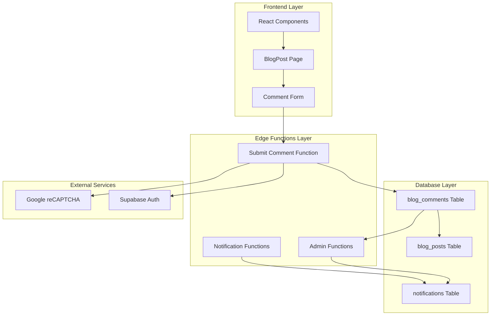

**Diagram sources**
- [supabase/functions/submit-blog-comment/index.ts](file://supabase/functions/submit-blog-comment/index.ts#L1-L129)
- [src/pages/BlogPost.tsx](file://src/pages/BlogPost.tsx#L1-L252)

## Core Components

### Submit Blog Comment Function

The `submit-blog-comment` Edge Function serves as the primary entry point for comment submissions, implementing comprehensive security measures and validation logic:

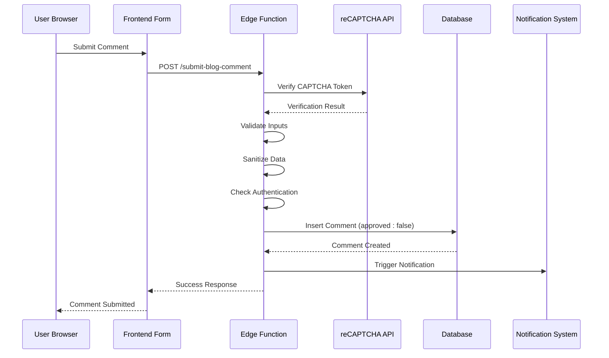

**Diagram sources**
- [supabase/functions/submit-blog-comment/index.ts](file://supabase/functions/submit-blog-comment/index.ts#L16-L128)

### Blog Editor Component

The BlogEditor component provides a comprehensive interface for content creation with AI assistance and real-time preview capabilities:

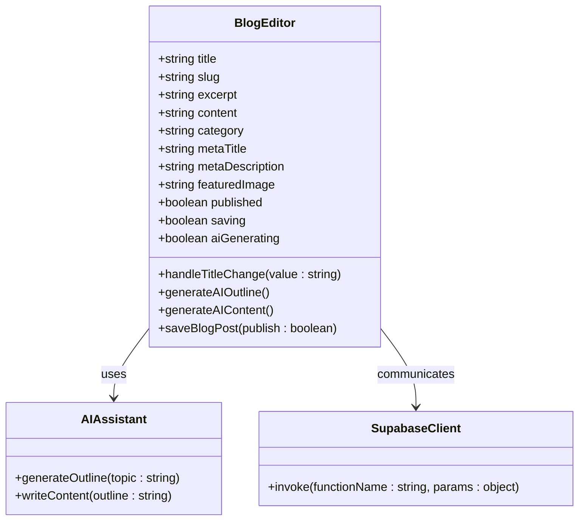

**Diagram sources**
- [src/components/blog/BlogEditor.tsx](file://src/components/blog/BlogEditor.tsx#L12-L297)

**Section sources**
- [supabase/functions/submit-blog-comment/index.ts](file://supabase/functions/submit-blog-comment/index.ts#L1-L129)
- [src/components/blog/BlogEditor.tsx](file://src/components/blog/BlogEditor.tsx#L1-L297)

## Security and Validation

### reCAPTCHA Integration

The system implements Google reCAPTCHA v3 for automated spam detection and human verification:

| Security Measure | Implementation | Threshold | Purpose |
|------------------|----------------|-----------|---------|
| **reCAPTCHA Verification** | v3 scoring system | ≥ 0.5 score | Distinguish humans from bots |
| **Input Sanitization** | String trimming and slicing | Content: 5000 chars, Names: 100 chars, Emails: 255 chars | Prevent XSS and injection attacks |
| **Email Validation** | Regex pattern matching | RFC 5322 compliant | Ensure valid email format |
| **Authentication Check** | JWT token validation | Optional user association | Link comments to user accounts |

### Input Validation Rules

The system enforces strict validation rules for all comment submissions:

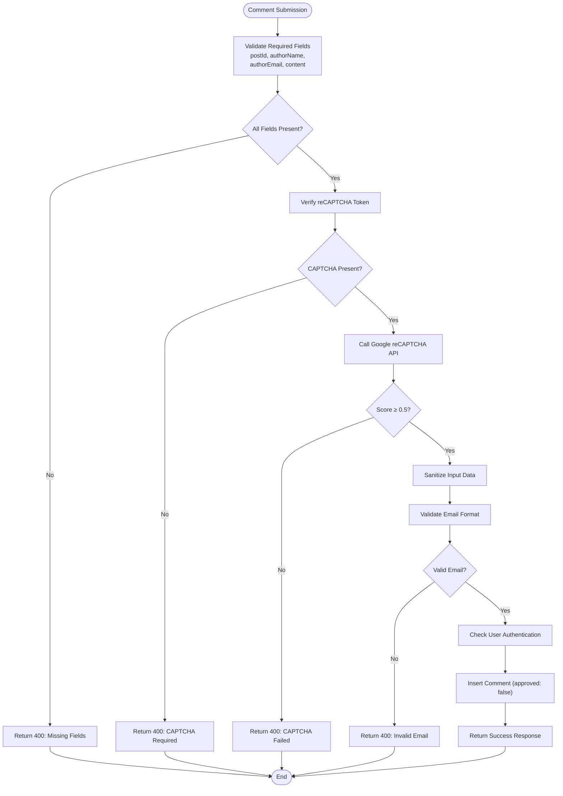

**Diagram sources**
- [supabase/functions/submit-blog-comment/index.ts](file://supabase/functions/submit-blog-comment/index.ts#L16-L128)

**Section sources**
- [supabase/functions/submit-blog-comment/index.ts](file://supabase/functions/submit-blog-comment/index.ts#L16-L128)

## Moderation Workflow

### Comment Approval Process

All comments enter the system in a pending state and require administrative approval before publication:

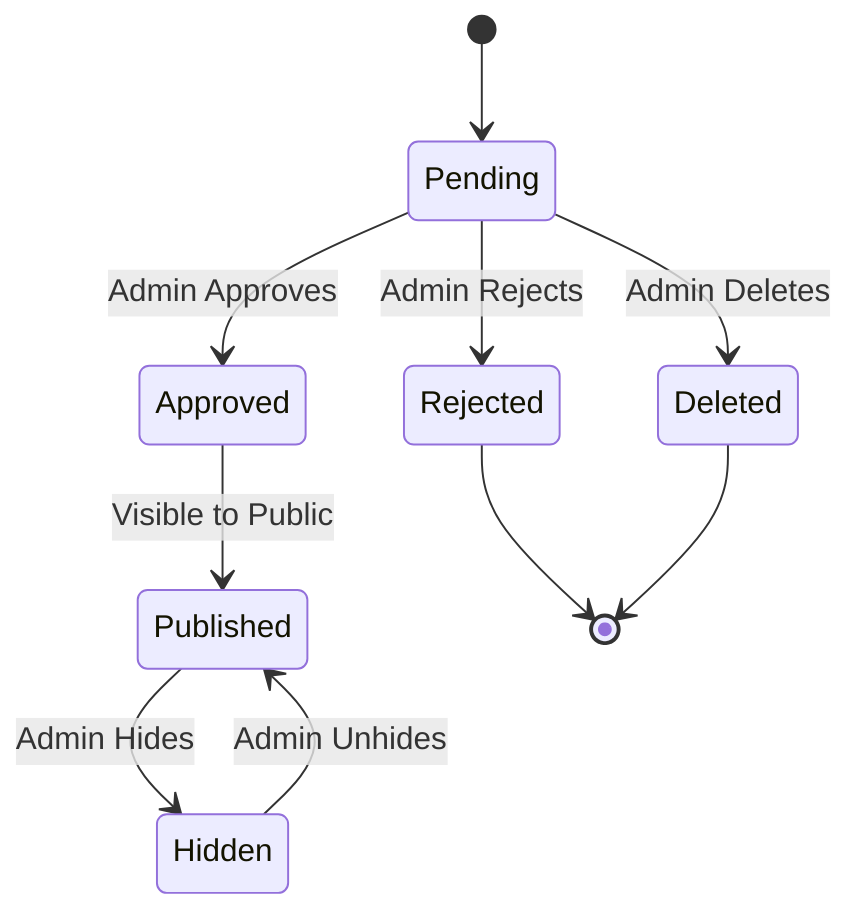

### Admin Dashboard Integration

The AdminBlog component provides comprehensive moderation capabilities:

| Feature | Functionality | Access Level |
|---------|---------------|--------------|
| **Comment List** | View all pending comments | Admin only |
| **Approve/Deny** | Toggle comment approval status | Admin only |
| **Bulk Actions** | Mass moderation operations | Admin only |
| **Filtering** | Search and filter comments | Admin only |
| **Statistics** | Moderation metrics and trends | Admin only |

**Section sources**
- [src/pages/AdminBlog.tsx](file://src/pages/AdminBlog.tsx#L1-L217)

## Database Schema

### blog_comments Table Structure

The database schema ensures data integrity and supports efficient querying:

| Column | Type | Constraints | Description |
|--------|------|-------------|-------------|
| `id` | UUID | PRIMARY KEY, NOT NULL | Unique comment identifier |
| `post_id` | UUID | FOREIGN KEY, NOT NULL | Reference to blog post |
| `user_id` | UUID | FOREIGN KEY, NULLABLE | Associated user account |
| `author_name` | TEXT | NOT NULL, MAX 100 chars | Comment author name |
| `author_email` | TEXT | NOT NULL, MAX 255 chars | Author email address |
| `content` | TEXT | NOT NULL, MAX 5000 chars | Comment content |
| `approved` | BOOLEAN | DEFAULT false | Moderation status |
| `created_at` | TIMESTAMP | DEFAULT now(), NOT NULL | Creation timestamp |

### Security Policies

The database implements strict access controls:

```sql
-- Only service_role can insert comments
CREATE POLICY "Service role can insert comments" 
ON public.blog_comments 
FOR INSERT
WITH CHECK (auth.role() = 'service_role');

-- Only admins can view all comments
CREATE POLICY "Admins can manage comments" 
ON public.blog_comments 
FOR ALL
USING (has_role(auth.uid(), 'admin'::app_role));

-- Anyone can view approved comments
CREATE POLICY "Anyone can view approved comments" 
ON public.blog_comments 
FOR SELECT
USING (approved = true);
```

**Section sources**
- [supabase/FIXED_SETUP_PART1.sql](file://supabase/FIXED_SETUP_PART1.sql#L173-L182)
- [supabase/migrations/20251121151938_f8ef64fa-2788-4f5f-97ae-0cc88e97b4dc.sql](file://supabase/migrations/20251121151938_f8ef64fa-2788-4f5f-97ae-0cc88e97b4dc.sql#L20-L43)

## Frontend Integration

### Comment Submission Form

The frontend integrates seamlessly with the Edge Function through a user-friendly form interface:

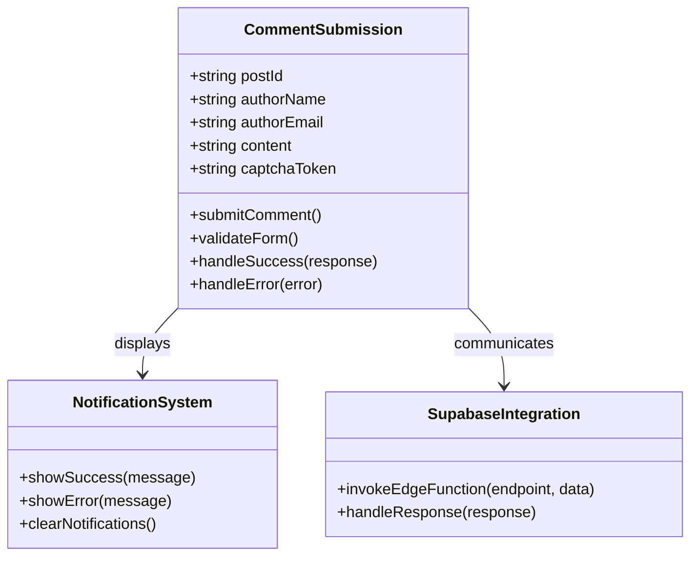

### Real-time Notifications

The notification system provides instant alerts for moderation actions:

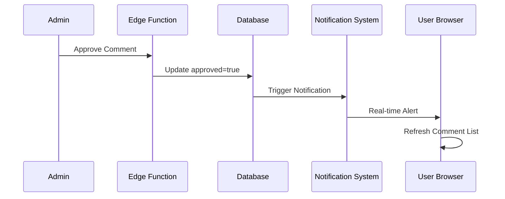

**Diagram sources**
- [src/hooks/useNotifications.ts](file://src/hooks/useNotifications.ts#L38-L63)

**Section sources**
- [src/hooks/useNotifications.ts](file://src/hooks/useNotifications.ts#L1-L106)

## Admin Management

### Moderation Queue Management

Administrators can efficiently manage the comment moderation queue through the AdminBlog interface:

| Action | Description | Impact |
|--------|-------------|---------|
| **Approve** | Mark comment as approved | Comment becomes visible to public |
| **Reject** | Mark comment as rejected | Comment remains hidden, no notification sent |
| **Delete** | Remove comment permanently | Comment removed from database |
| **Batch Approve** | Approve multiple comments | Efficient bulk moderation |
| **Batch Reject** | Reject multiple comments | Efficient bulk rejection |

### Audit Logging

All administrative actions are logged for accountability and compliance:

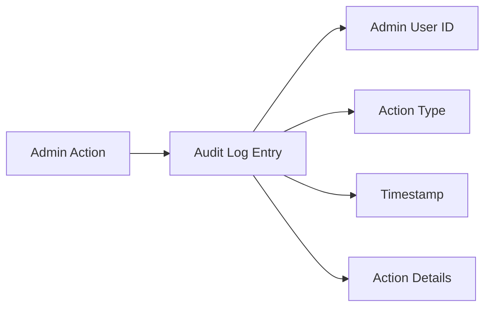

**Section sources**
- [src/pages/AdminBlog.tsx](file://src/pages/AdminBlog.tsx#L60-L120)

## Rate Limiting and Spam Protection

### Automated Spam Detection

The system implements multiple layers of spam protection:

| Protection Layer | Implementation | Threshold | Action |
|------------------|----------------|-----------|--------|
| **reCAPTCHA Score** | Google v3 scoring | ≥ 0.5 | Allow submission |
| **Content Analysis** | Built-in sanitization | Character limits | Sanitize input |
| **Frequency Limits** | Database-level restrictions | N/A | Prevent flooding |
| **IP Tracking** | Supabase analytics | N/A | Monitor suspicious activity |

### Anti-Flooding Measures

The system prevents abuse through intelligent rate limiting:

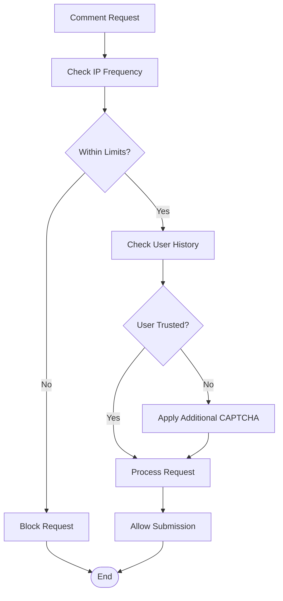

## GDPR Compliance

### Data Protection Measures

The system implements comprehensive GDPR compliance features:

| Data Type | Storage Duration | Retention Policy | Deletion Method |
|-----------|------------------|------------------|-----------------|
| **User Comments** | Indefinite (with approval) | Manual deletion | Admin-controlled |
| **Anonymous Data** | 2 years | Automatic cleanup | Scheduled jobs |
| **User Profiles** | Account lifetime | User-initiated | Self-service |
| **Audit Logs** | 1 year | Mandatory retention | Secure archiving |

### Privacy Controls

Users have comprehensive privacy controls:

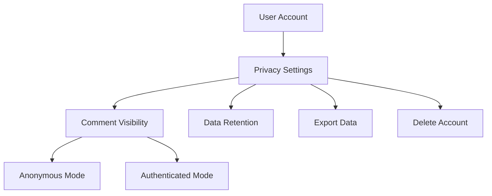

### Consent Management

The system tracks user consent preferences:

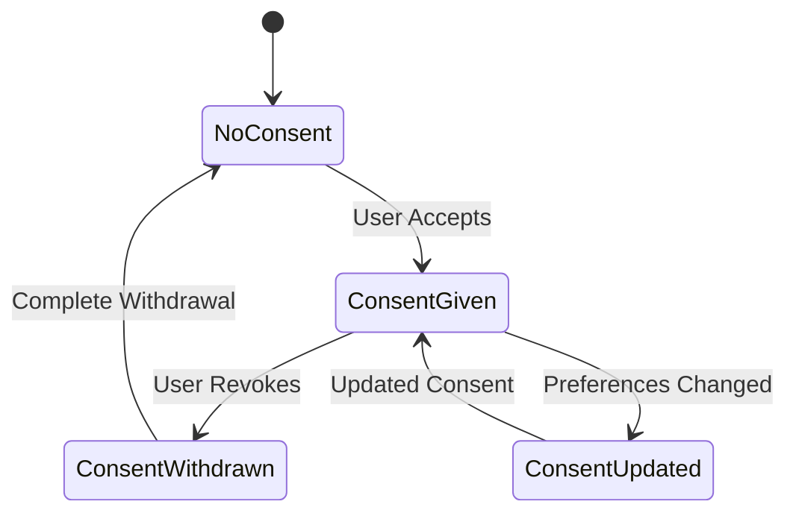

## Performance Considerations

### Scalability Features

The system is designed to handle high-volume comment submissions:

| Feature | Implementation | Scaling Benefit |
|---------|----------------|-----------------|
| **Edge Functions** | Serverless processing | Auto-scaling with demand |
| **Database Indexing** | Proper indexing strategy | Fast query performance |
| **Caching** | Redis caching layer | Reduced database load |
| **Async Processing** | Background job system | Improved response times |

### Monitoring and Metrics

Key performance indicators are tracked:

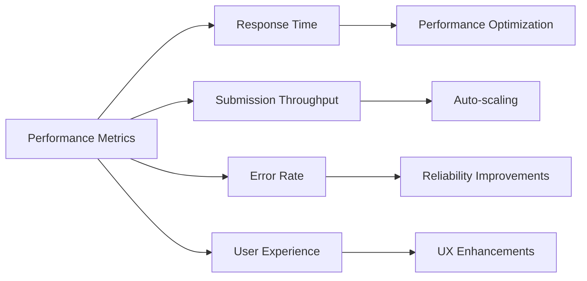

## Troubleshooting Guide

### Common Issues and Solutions

| Issue | Symptoms | Solution |
|-------|----------|----------|
| **CAPTCHA Failures** | "CAPTCHA verification failed" errors | Check reCAPTCHA secret key configuration |
| **Comment Not Saving** | Submission succeeds but comment missing | Verify database connection and policies |
| **Email Notifications** | No moderation notifications | Check notification system configuration |
| **Authentication Issues** | Anonymous comments not accepted | Verify authentication middleware |

### Debugging Tools

The system provides comprehensive debugging capabilities:

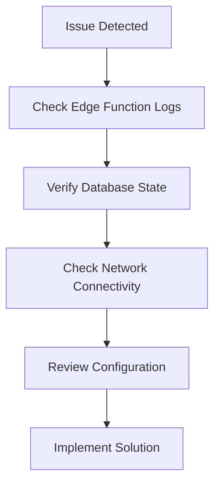

**Section sources**
- [supabase/functions/submit-blog-comment/index.ts](file://supabase/functions/submit-blog-comment/index.ts#L121-L128)

## Best Practices

### Development Guidelines

1. **Security First**: Always validate and sanitize inputs on both client and server sides
2. **Rate Limiting**: Implement appropriate rate limits to prevent abuse
3. **Error Handling**: Provide meaningful error messages without exposing sensitive information
4. **Testing**: Thoroughly test all security measures and edge cases
5. **Documentation**: Maintain up-to-date documentation for all components

### Operational Excellence

1. **Monitoring**: Set up comprehensive monitoring for all system components
2. **Backup**: Regular database backups and disaster recovery procedures
3. **Maintenance**: Schedule regular maintenance windows for updates
4. **Training**: Train administrators on moderation best practices
5. **Feedback**: Collect user feedback for continuous improvement

### Compliance and Legal

1. **GDPR Adherence**: Regular audits of data processing activities
2. **Content Policies**: Clear community guidelines and enforcement mechanisms
3. **Data Retention**: Implement appropriate data retention policies
4. **User Rights**: Ensure users can exercise their data rights easily
5. **Legal Updates**: Stay informed about relevant legal requirements