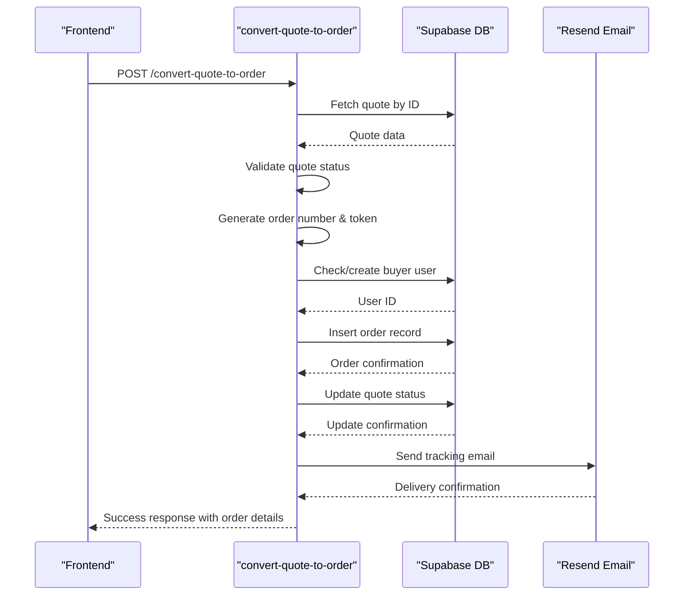
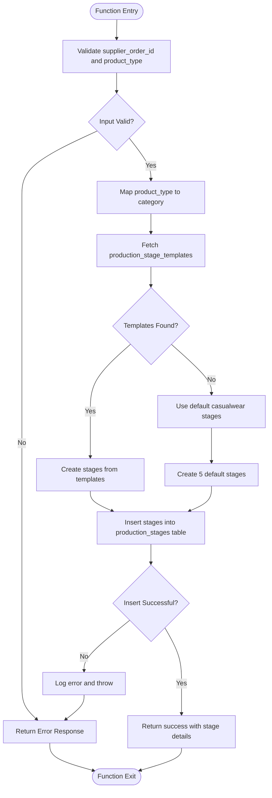
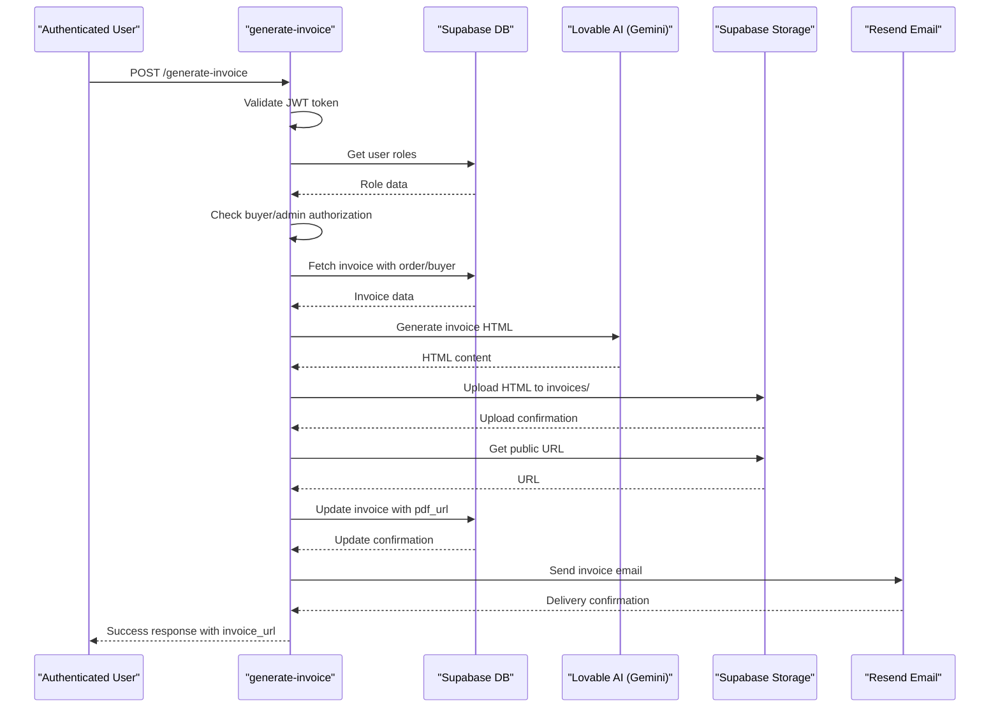
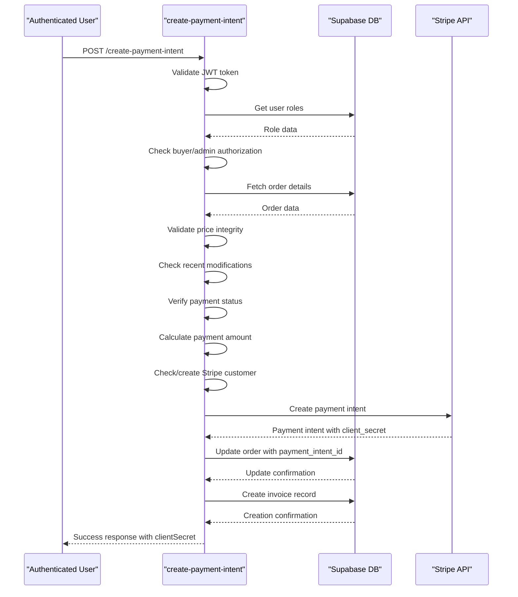
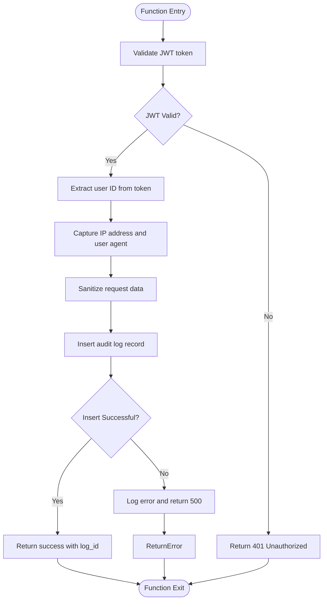
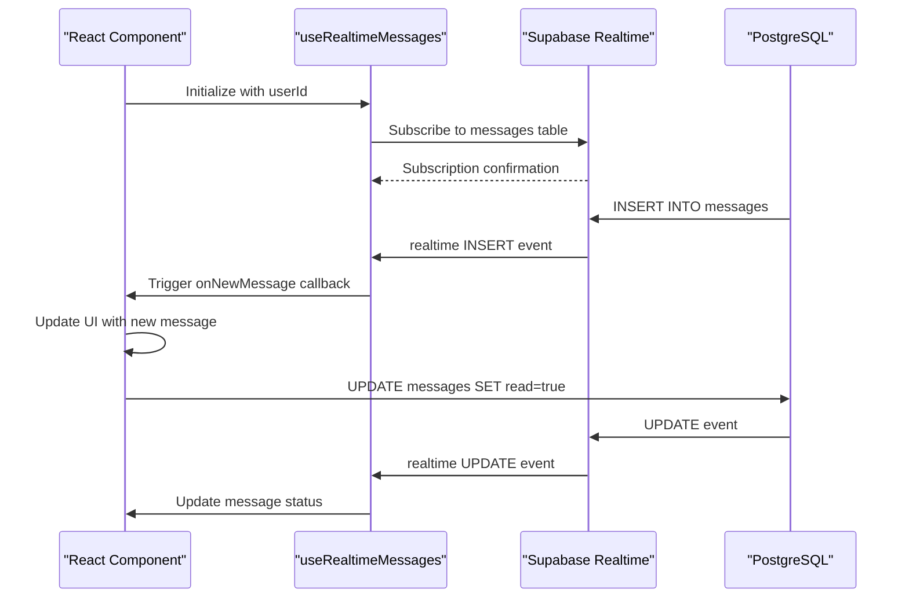

# Core Business Logic Functions

<cite>
**Referenced Files in This Document**   
- [convert-quote-to-order/index.ts](file://supabase/functions/convert-quote-to-order/index.ts)
- [initialize-production-stages/index.ts](file://supabase/functions/initialize-production-stages/index.ts)
- [generate-invoice/index.ts](file://supabase/functions/generate-invoice/index.ts)
- [create-payment-intent/index.ts](file://supabase/functions/create-payment-intent/index.ts)
- [log-audit-action/index.ts](file://supabase/functions/log-audit-action/index.ts)
- [logger.ts](file://supabase/functions/_shared/logger.ts)
- [migrations/20251115150759_remix_migration_from_pg_dump.sql](file://supabase/migrations/20251115150759_remix_migration_from_pg_dump.sql)
- [useOptimisticUpdate.ts](file://src/hooks/useOptimisticUpdate.ts)
</cite>

## Table of Contents
1. [Introduction](#introduction)
2. [convert-quote-to-order Function](#convert-quote-to-order-function)
3. [initialize-production-stages Function](#initialize-production-stages-function)
4. [generate-invoice Function](#generate-invoice-function)
5. [create-payment-intent Function](#create-payment-intent-function)
6. [Audit Logging with log-audit-action](#audit-logging-with-log-audit-action)
7. [Error Handling and Rollback Procedures](#error-handling-and-rollback-procedures)
8. [Race Condition Prevention and Atomic Operations](#race-condition-prevention-and-atomic-operations)
9. [Real-time Frontend Updates](#real-time-frontend-updates)
10. [Debugging and State Inconsistency Resolution](#debugging-and-state-inconsistency-resolution)
11. [Conclusion](#conclusion)

## Introduction
This document provides a comprehensive analysis of the core business logic functions in the sleekapp-v100 application. The system revolves around four critical functions that manage the order lifecycle: converting quotes to production orders, initializing production stages, generating invoices, and creating payment intents. These functions enforce business rules, maintain data integrity through atomic operations, and provide robust error handling. The document also covers audit logging, race condition prevention, and debugging strategies to ensure system reliability and traceability.

## convert-quote-to-order Function

The `convert-quote-to-order` function orchestrates the transition from quote to production order, creating associated records across multiple tables. It begins by validating the quote ID and checking if the quote has already been converted. The function then generates a unique order number and tracking token, calculates the expected delivery date based on the quote's estimated delivery days, and ensures the buyer exists in the system (creating a new user if necessary).

The core transaction creates an order record in the `orders` table with key details including order number, buyer ID, product type, quantity, and status. It then updates the original quote in the `ai_quotes` table to mark it as "converted" and link it to the newly created order ID. This function enforces business rules such as quote validity checks and prevents duplicate conversions through the `converted_to_order_id` field validation.

The process includes sending a confirmation email via Resend with tracking information, providing immediate feedback to the customer. Error handling is comprehensive, with detailed logging of any failures during order creation, user creation, or email sending. The function uses Supabase's service role key for elevated privileges, ensuring it can perform all necessary operations across the database.

**Diagram sources**
- [convert-quote-to-order/index.ts](file://supabase/functions/convert-quote-to-order/index.ts#L16-L204)

**Section sources**
- [convert-quote-to-order/index.ts](file://supabase/functions/convert-quote-to-order/index.ts#L16-L204)

## initialize-production-stages Function

The `initialize-production-stages` function sets up the 8-stage LoopTrace™ production timeline with scheduled dates and responsible parties. It takes a supplier order ID and product type as input, mapping the product type to a category (e.g., t-shirt → casualwear) to determine the appropriate production stage template.

The function first attempts to fetch stage templates from the `production_stage_templates` table filtered by the product category and active status. If no templates exist, it creates default stages for casualwear with estimated durations. When templates are found, it creates production stages in the `production_stages` table with calculated target dates based on the template's estimated days.

Each stage includes the stage number, name, description, initial status of "not_started," and a completion percentage of 0. The target date is calculated by adding the template's estimated days to the current date. This function ensures consistency in production timelines across similar product types while allowing customization through the template system.

The function is designed to be idempotent, preventing duplicate stage creation. It includes comprehensive error handling and logging to capture any issues during template fetching or stage insertion. The resulting production stages provide a clear roadmap for the supplier to follow, with scheduled dates and progress tracking capabilities.

**Diagram sources**
- [initialize-production-stages/index.ts](file://supabase/functions/initialize-production-stages/index.ts#L9-L125)

**Section sources**
- [initialize-production-stages/index.ts](file://supabase/functions/initialize-production-stages/index.ts#L9-L125)

## generate-invoice Function

The `generate-invoice` function handles financial documentation by creating professional invoices using AI-generated HTML. It begins with authentication, verifying the user's JWT token to ensure they are either the order's buyer or an admin. This security check prevents unauthorized access to financial documents.

The function retrieves the invoice details along with associated order and buyer information through a joined query. It then uses the Lovable AI service (Google Gemini) to generate a professional invoice HTML document based on the order details, including invoice number, dates, billing information, and payment terms.

The generated HTML is stored in Supabase storage with a predictable filename (`invoices/{invoice_number}.html`), and the public URL is saved in the invoice record's `pdf_url` field. This allows for persistent access to the invoice. The function also sends the invoice via email using Resend, including a direct link to view the invoice.

Business rules enforced include access control (only buyers or admins can generate invoices), data integrity (validating invoice existence), and proper financial documentation standards. The AI-generated approach ensures consistent, professional invoice formatting while reducing development effort for template maintenance.

**Diagram sources**
- [generate-invoice/index.ts](file://supabase/functions/generate-invoice/index.ts#L13-L230)

**Section sources**
- [generate-invoice/index.ts](file://supabase/functions/generate-invoice/index.ts#L13-L230)

## create-payment-intent Function

The `create-payment-intent` function manages Stripe integration for secure payment processing. It begins with authentication, verifying the user's JWT token to ensure they are either the order's buyer or an admin. This prevents unauthorized payment attempts.

The function retrieves the order details using the service role key for comprehensive access, then validates that the user is authorized to pay for this order. It implements multiple security checks to prevent price manipulation, including validating the order price against the original quote with a 0.5% tolerance for currency rounding.

The function detects potential tampering by logging when an order was recently modified before payment. It verifies the order is in a valid state for payment (not already paid). Based on the payment type (deposit, balance, or full), it calculates the appropriate amount (30%, 70%, or 100% of the order price).

If the order doesn't have a Stripe customer ID, the function creates one and updates the order record. It then creates a Stripe payment intent with the calculated amount, customer ID, and metadata linking to the order. The payment intent ID is stored in the order record, and an invoice record is created for accounting purposes.

This function enforces business rules around payment security, price integrity, and proper financial record-keeping. The use of Stripe's automatic payment methods provides a seamless checkout experience while maintaining PCI compliance.

**Diagram sources**
- [create-payment-intent/index.ts](file://supabase/functions/create-payment-intent/index.ts#L13-L277)

**Section sources**
- [create-payment-intent/index.ts](file://supabase/functions/create-payment-intent/index.ts#L13-L277)

## Audit Logging with log-audit-action

The `log-audit-action` function provides comprehensive audit logging for administrative actions. It captures critical information including the action performed, resource type, resource ID, details of the change, and the user who performed the action.

The function begins by validating the JWT token to authenticate the user and extract their user ID from the token payload (not from the request body) to prevent spoofing. It captures the IP address and user agent from request headers for security monitoring.

Audit logs are stored in the `admin_audit_logs` table with fields for admin ID, action, resource type, resource ID, details (as JSON), IP address, and user agent. This comprehensive logging enables traceability of all administrative changes, supporting security investigations and compliance requirements.

The function uses PII sanitization through the shared logger module, automatically redacting sensitive information like emails, phone numbers, and order IDs in logs. This ensures compliance with data protection regulations while maintaining debuggability.

**Diagram sources**
- [log-audit-action/index.ts](file://supabase/functions/log-audit-action/index.ts#L16-L87)
- [logger.ts](file://supabase/functions/_shared/logger.ts#L61-L81)

**Section sources**
- [log-audit-action/index.ts](file://supabase/functions/log-audit-action/index.ts#L16-L87)
- [logger.ts](file://supabase/functions/_shared/logger.ts#L61-L81)

## Error Handling and Rollback Procedures

The system implements robust error handling and rollback procedures to maintain data integrity. Each core function uses try-catch blocks to capture exceptions and provide meaningful error responses. The `convert-quote-to-order` function demonstrates a transactional approach where the order creation and quote update are performed as separate operations, with comprehensive logging to track the state if one operation succeeds while the other fails.

The `create-payment-intent` function includes multiple validation layers to prevent inconsistent states, including price integrity checks against the original quote and verification of recent order modifications. When errors occur, the function logs detailed information (with PII sanitization) to aid debugging while preventing sensitive data exposure.

The shared logger module (`logger.ts`) provides structured logging with automatic PII sanitization, redacting emails, phone numbers, order IDs, and authentication tokens. This ensures that logs can be used for debugging without compromising user privacy or security.

For critical operations, the system could benefit from database transactions to ensure atomicity. Currently, operations like quote conversion involve multiple database calls that should ideally be wrapped in a transaction to prevent partial updates. The error handling strategy focuses on prevention through validation and comprehensive logging rather than automatic rollback, relying on manual intervention for state correction when necessary.

**Section sources**
- [convert-quote-to-order/index.ts](file://supabase/functions/convert-quote-to-order/index.ts#L205-L218)
- [create-payment-intent/index.ts](file://supabase/functions/create-payment-intent/index.ts#L279-L285)
- [logger.ts](file://supabase/functions/_shared/logger.ts#L135-L148)

## Race Condition Prevention and Atomic Operations

The system employs several strategies to prevent race conditions and ensure atomic operations. The `convert-quote-to-order` function includes a check for the `converted_to_order_id` field before proceeding, preventing multiple conversions of the same quote. This is a form of optimistic locking at the application level.

The database schema includes constraints and checks to maintain data integrity, such as the `orders_quantity_check` constraint ensuring quantities are positive, and ENUM types for status fields to prevent invalid values. The use of UUIDs for primary keys reduces the risk of key collisions in distributed systems.

For critical financial operations, the `create-payment-intent` function implements price validation against the original quote with a small tolerance for currency rounding, preventing price manipulation attacks. It also logs when orders are modified shortly before payment, which could indicate tampering.

The system could enhance race condition prevention by implementing database-level locks or transactions for multi-step operations. Currently, operations like quote conversion involve separate database calls that could be vulnerable to race conditions in high-concurrency scenarios. Adding row-level locking or using PostgreSQL's `FOR UPDATE` clause would provide stronger guarantees.

The real-time capabilities through Supabase's realtime subscriptions help maintain consistency between the frontend and backend, reducing the window for stale data issues. The optimistic update pattern in frontend components provides a better user experience while the system ensures backend consistency through validation.

**Section sources**
- [convert-quote-to-order/index.ts](file://supabase/functions/convert-quote-to-order/index.ts#L49-L55)
- [create-payment-intent/index.ts](file://supabase/functions/create-payment-intent/index.ts#L108-L132)
- [migrations/20251115150759_remix_migration_from_pg_dump.sql](file://supabase/migrations/20251115150759_remix_migration_from_pg_dump.sql#L1313-L1314)

## Real-time Frontend Updates

The system implements real-time updates to frontend components through Supabase's realtime capabilities. The `useRealtimeMessages` hook establishes a subscription to the `messages` table, listening for INSERT and UPDATE events where the user is the recipient. This enables instant notifications when new messages arrive.

The `CommunicationCenter` component sets up multiple realtime channels to monitor both sent and received messages, refreshing the message list whenever changes occur. This provides a chat-like experience where users see updates immediately without manual refreshing.

The `useOptimisticUpdate` hook implements an optimistic update pattern, immediately reflecting changes in the UI before the server confirms the update. If the server operation fails, the hook can rollback to the previous state, providing a responsive user experience while maintaining data integrity.

These real-time capabilities are built on Supabase's Postgres replication functionality, which broadcasts database changes to subscribed clients. The system uses channel namespaces and filters to minimize bandwidth usage and ensure clients only receive relevant updates.

The combination of realtime subscriptions and optimistic updates creates a responsive, modern user interface that feels instantaneous while ensuring data consistency through proper error handling and rollback mechanisms.

**Diagram sources**
- [useRealtimeMessages.ts](file://src/hooks/useRealtimeMessages.ts#L17-L61)
- [CommunicationCenter.tsx](file://src/components/shared/CommunicationCenter.tsx#L47-L83)

**Section sources**
- [useRealtimeMessages.ts](file://src/hooks/useRealtimeMessages.ts#L17-L61)
- [useOptimisticUpdate.ts](file://src/hooks/useOptimisticUpdate.ts#L16-L47)
- [CommunicationCenter.tsx](file://src/components/shared/CommunicationCenter.tsx#L47-L83)

## Debugging and State Inconsistency Resolution

The system provides comprehensive debugging capabilities through structured logging, audit trails, and monitoring. The shared logger module (`logger.ts`) implements structured JSON logging with automatic PII sanitization, making logs both secure and searchable. Different log levels (INFO, WARN, ERROR, SUCCESS) help filter and prioritize issues.

The `log-audit-action` function creates a complete audit trail of administrative actions, capturing who performed what action on which resource and from what IP address. This enables forensic analysis of state changes and helps identify the source of inconsistencies.

For payment-related issues, the `create-payment-intent` function includes detailed logging of price validation checks, recent order modifications, and payment amount calculations. This helps diagnose issues related to price mismatches or suspected tampering.

The database schema includes `created_at` and `updated_at` timestamps on all relevant tables, enabling temporal analysis of state changes. The `order_status_history` table specifically tracks workflow status transitions, providing a complete history of order progression.

To resolve state inconsistencies, administrators can use the audit logs to identify when and how an inconsistency occurred, then use the detailed logs to understand the context. For financial discrepancies, the combination of Stripe payment intents, invoice records, and order payment fields provides multiple data points for reconciliation.

The system could be enhanced with automated consistency checks and repair jobs that identify and resolve common inconsistency patterns, reducing the need for manual intervention.

**Section sources**
- [logger.ts](file://supabase/functions/_shared/logger.ts#L93-L165)
- [log-audit-action/index.ts](file://supabase/functions/log-audit-action/index.ts#L58-L84)
- [create-payment-intent/index.ts](file://supabase/functions/create-payment-intent/index.ts#L178-L182)

## Conclusion
The core business logic functions in sleekapp-v100 provide a robust foundation for managing the order lifecycle from quote to delivery. The `convert-quote-to-order`, `initialize-production-stages`, `generate-invoice`, and `create-payment-intent` functions work together to create a seamless experience while enforcing critical business rules around pricing, production, and payments.

The system demonstrates strong security practices through authentication, authorization, and PII sanitization in logs. The real-time capabilities provide an engaging user experience, while the audit logging ensures traceability and compliance. However, there are opportunities for improvement in transaction management to ensure atomicity of multi-step operations and enhanced race condition prevention through database-level locking.

Overall, the architecture balances developer productivity with system reliability, leveraging Supabase's capabilities for authentication, realtime, and database operations while implementing custom business logic in Deno edge functions. The comprehensive logging and monitoring infrastructure enables effective debugging and state inconsistency resolution, supporting the platform's growth and reliability.