# Financial Operations

<cite>
**Referenced Files in This Document**
- [generate-invoice/index.ts](file://supabase/functions/generate-invoice/index.ts)
- [create-payment-intent/index.ts](file://supabase/functions/create-payment-intent/index.ts)
- [usePayment.ts](file://src/hooks/usePayment.ts)
- [PaymentCheckout.tsx](file://src/pages/PaymentCheckout.tsx)
- [PaymentForm.tsx](file://src/components/payment/PaymentForm.tsx)
- [InvoiceViewer.tsx](file://src/components/payment/InvoiceViewer.tsx)
- [stripe-webhook/index.ts](file://supabase/functions/stripe-webhook/index.ts)
- [enhancedAuditLog.ts](file://src/lib/enhancedAuditLog.ts)
- [database.ts](file://src/types/database.ts)
- [PaymentManagement.tsx](file://src/components/admin/PaymentManagement.tsx)
- [FinancialDashboard.tsx](file://src/components/supplier/FinancialDashboard.tsx)
- [InvoicesPaymentsSection.tsx](file://src/components/buyer/InvoicesPaymentsSection.tsx)
</cite>

## Table of Contents
1. [Introduction](#introduction)
2. [System Architecture](#system-architecture)
3. [Generate Invoice Function](#generate-invoice-function)
4. [Create Payment Intent Function](#create-payment-intent-function)
5. [Payment Checkout Implementation](#payment-checkout-implementation)
6. [Security Measures](#security-measures)
7. [Integration with External Services](#integration-with-external-services)
8. [Error Handling and Debugging](#error-handling-and-debugging)
9. [Administrative Features](#administrative-features)
10. [Troubleshooting Guide](#troubleshooting-guide)

## Introduction

SleekApp v100 implements a comprehensive financial operations system that handles invoice generation, payment processing, and financial document management. The system integrates multiple external services including Lovable AI for invoice generation, Stripe for payment processing, and Resend for email notifications. Built with robust security measures including role-based access control and comprehensive audit logging, the financial operations module ensures secure and reliable transaction processing.

The system supports multiple payment types (deposit, balance, full payment) and provides automated invoice generation with professional HTML templates. It maintains strict separation of concerns between frontend payment processing and backend financial operations while ensuring data integrity and compliance with financial regulations.

## System Architecture

The financial operations system follows a serverless architecture with Supabase Edge Functions handling core financial operations. The system consists of several interconnected components that work together to provide seamless financial transaction capabilities.

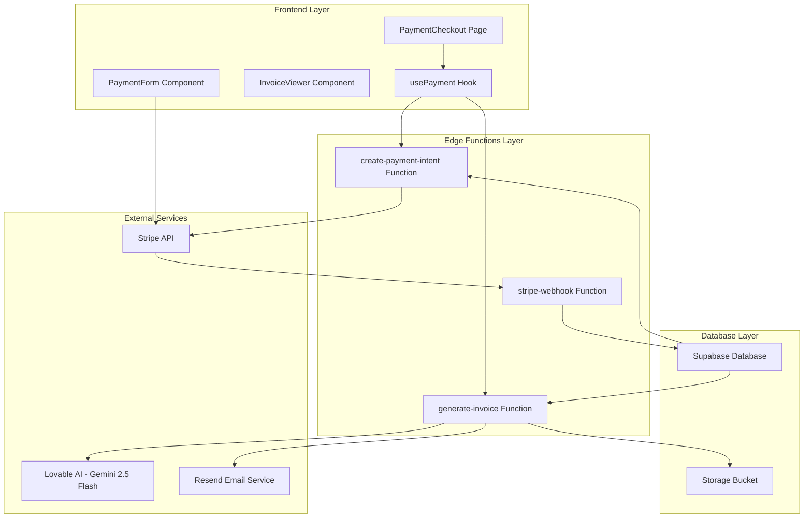

**Diagram sources**
- [PaymentCheckout.tsx](file://src/pages/PaymentCheckout.tsx#L1-L174)
- [usePayment.ts](file://src/hooks/usePayment.ts#L1-L68)
- [generate-invoice/index.ts](file://supabase/functions/generate-invoice/index.ts#L1-L243)
- [create-payment-intent/index.ts](file://supabase/functions/create-payment-intent/index.ts#L1-L288)

## Generate Invoice Function

The `generate-invoice` function creates professional B2B invoice HTML documents using Lovable AI's gemini-2.5-flash model, stores them in Supabase storage, and sends email notifications to buyers.

### Core Functionality

The invoice generation process involves multiple steps with comprehensive validation and security checks:

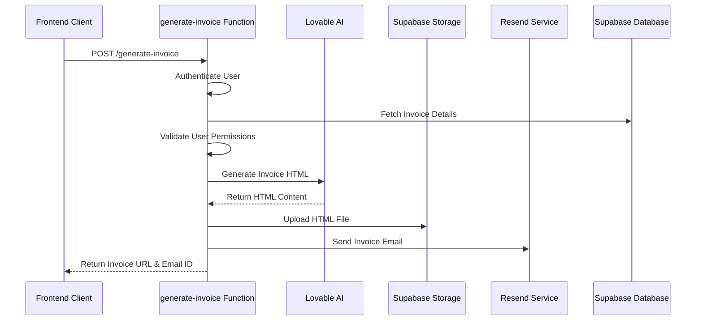

**Diagram sources**
- [generate-invoice/index.ts](file://supabase/functions/generate-invoice/index.ts#L13-L243)

### Authentication and Authorization

The function implements strict authentication and authorization mechanisms:

| Security Measure | Implementation | Purpose |
|------------------|----------------|---------|
| JWT Token Validation | `Authorization` header check | Ensures only authenticated users can access |
| User Role Verification | `user_roles` table lookup | Validates admin or buyer permissions |
| Order Ownership Check | `buyer_id` comparison | Prevents unauthorized access to orders |
| Service Role Access | Dedicated service account | Enables database operations without user context |

### Invoice Generation Process

The invoice generation follows a structured workflow:

1. **Input Validation**: Validates `invoice_id` parameter presence
2. **Data Retrieval**: Fetches invoice, order, and buyer details with proper joins
3. **Permission Validation**: Verifies user authorization through role checking
4. **AI Generation**: Sends invoice details to Lovable AI for HTML generation
5. **Storage Upload**: Stores generated HTML in Supabase storage bucket
6. **URL Generation**: Creates public URL for invoice access
7. **Database Update**: Updates invoice record with PDF URL
8. **Email Notification**: Sends invoice email with download link

### Template Structure and Content

The AI-generated invoice template includes:

| Element | Content | Purpose |
|---------|---------|---------|
| Header | Company logo placeholder | Brand recognition |
| Bill To Section | Buyer company name, email, phone | Recipient identification |
| From Section | Sleek Apparels Ltd. details | Sender information |
| Order Details | Order number, product type, quantity | Transaction specifics |
| Payment Terms | Net 7 days | Payment conditions |
| Amount Details | Invoice amount breakdown | Financial clarity |
| Bank Details | Placeholder for bank information | Payment instructions |
| Footer | Contact information | Support details |

**Section sources**
- [generate-invoice/index.ts](file://supabase/functions/generate-invoice/index.ts#L108-L167)
- [generate-invoice/index.ts](file://supabase/functions/generate-invoice/index.ts#L169-L220)

## Create Payment Intent Function

The `create-payment-intent` function handles Stripe payment integration, generating client secrets and managing payment initialization with comprehensive security validations.

### Payment Flow Architecture

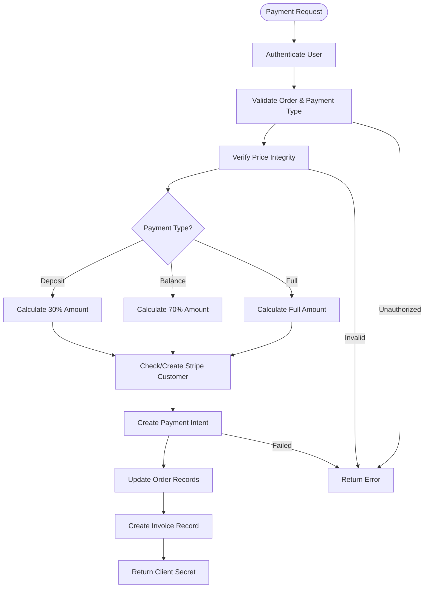

**Diagram sources**
- [create-payment-intent/index.ts](file://supabase/functions/create-payment-intent/index.ts#L53-L288)

### Payment Type Calculations

The function supports three payment types with specific calculation logic:

| Payment Type | Calculation Formula | Purpose |
|--------------|-------------------|---------|
| Deposit | `orderPrice * 0.30 * 100` | Initial payment requirement |
| Balance | `orderPrice * 0.70 * 100` | Remaining payment amount |
| Full | `orderPrice * 100` | Complete payment in one transaction |

### Security Validation Layers

The payment creation process implements multiple security validation layers:

1. **Price Integrity Validation**: Compares order price against quote price with ±0.5% tolerance
2. **Recent Modification Detection**: Alerts if order was modified within 5 minutes before payment
3. **Duplicate Payment Prevention**: Checks if order already has payment status 'paid'
4. **Amount Reasonableness**: Ensures payment amount is at least $1.00
5. **Customer ID Management**: Creates or retrieves Stripe customer records

### Database Operations

The function performs coordinated database updates across multiple tables:

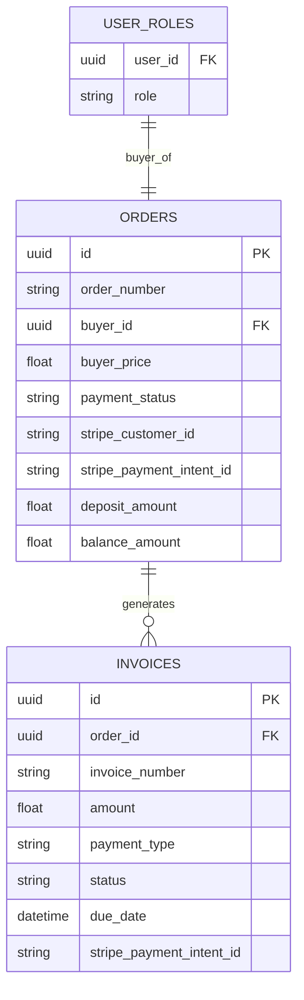

**Diagram sources**
- [create-payment-intent/index.ts](file://supabase/functions/create-payment-intent/index.ts#L184-L267)
- [database.ts](file://src/types/database.ts#L311-L438)

**Section sources**
- [create-payment-intent/index.ts](file://supabase/functions/create-payment-intent/index.ts#L53-L288)

## Payment Checkout Implementation

The payment checkout system provides a seamless user experience through React components and hooks that handle payment processing from initiation to completion.

### Component Architecture

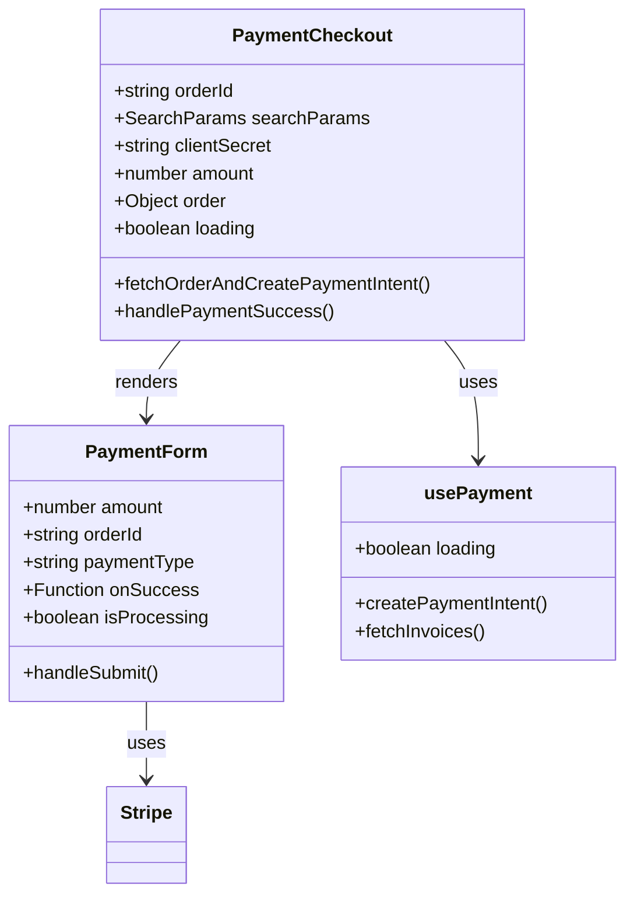

**Diagram sources**
- [PaymentCheckout.tsx](file://src/pages/PaymentCheckout.tsx#L1-L174)
- [PaymentForm.tsx](file://src/components/payment/PaymentForm.tsx#L1-L94)
- [usePayment.ts](file://src/hooks/usePayment.ts#L1-L68)

### Function Invocation Patterns

The payment system demonstrates sophisticated function invocation patterns:

#### usePayment Hook Usage
The `usePayment` hook provides centralized payment functionality with error handling and state management:

```typescript
// Example usage pattern from PaymentCheckout
const { createPaymentIntent } = usePayment();
const { data, error } = await supabase.functions.invoke('create-payment-intent', {
  body: { orderId, paymentType },
});
```

#### Error Handling Strategies
The system implements comprehensive error handling across multiple layers:

| Error Type | Handling Strategy | User Experience |
|------------|------------------|-----------------|
| Network Errors | Toast notifications with retry options | Clear error messaging |
| Authentication Failures | Redirect to login with return URL | Seamless re-authentication |
| Payment Validation Errors | Immediate feedback with specific messages | Guided resolution |
| Stripe API Errors | Detailed error reporting with support links | Professional error handling |

### State Management

The payment checkout implements sophisticated state management:

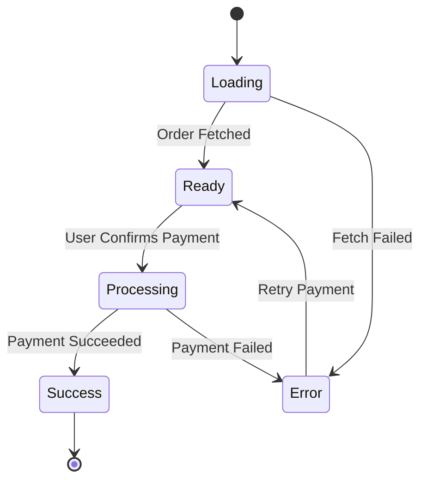

**Diagram sources**
- [PaymentCheckout.tsx](file://src/pages/PaymentCheckout.tsx#L27-L65)
- [PaymentForm.tsx](file://src/components/payment/PaymentForm.tsx#L20-L55)

**Section sources**
- [PaymentCheckout.tsx](file://src/pages/PaymentCheckout.tsx#L1-L174)
- [PaymentForm.tsx](file://src/components/payment/PaymentForm.tsx#L1-L94)
- [usePayment.ts](file://src/hooks/usePayment.ts#L1-L68)

## Security Measures

SleekApp v100 implements comprehensive security measures across all financial operations, ensuring data protection, access control, and regulatory compliance.

### Role-Based Access Control

The system implements a granular RBAC model with specific permissions for financial operations:

| Role | Permissions | Financial Operations |
|------|-------------|---------------------|
| Admin | Full access to all financial data | Manage invoices, process refunds, view all payments |
| Buyer | Access to own orders and invoices | Initiate payments, view invoice history, download documents |
| Supplier | Limited access to order-related finances | View order payments, invoice status |

### Authentication and Authorization

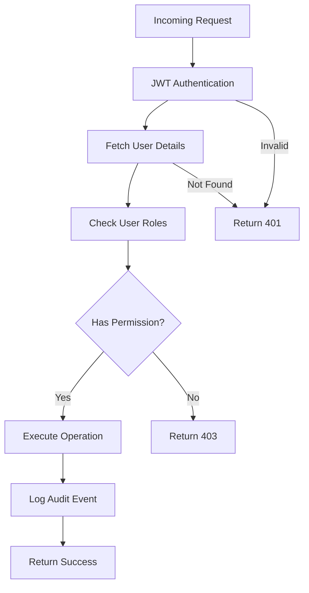

**Diagram sources**
- [generate-invoice/index.ts](file://supabase/functions/generate-invoice/index.ts#L86-L106)
- [create-payment-intent/index.ts](file://supabase/functions/create-payment-intent/index.ts#L78-L98)

### Audit Logging Implementation

The system maintains comprehensive audit trails for all financial operations:

#### Enhanced Audit Logging Features

| Feature | Implementation | Purpose |
|---------|----------------|---------|
| IP Address Capture | Automatic logging | Security monitoring |
| User Agent Tracking | Request metadata | Behavioral analysis |
| Resource-Level Logging | Specific action tracking | Detailed accountability |
| Severity Classification | Info, Warning, Error, Critical | Priority-based alerts |
| Export Capabilities | CSV and JSON exports | Compliance reporting |

#### Financial Operation Audits

The audit system tracks critical financial events:

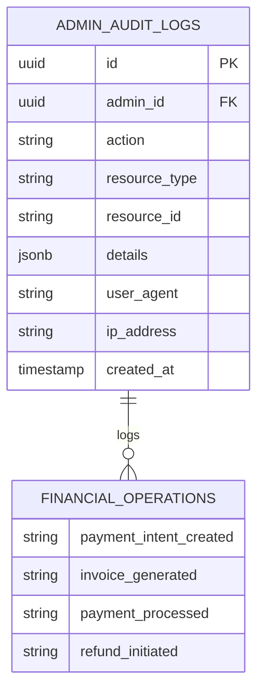

**Diagram sources**
- [enhancedAuditLog.ts](file://src/lib/enhancedAuditLog.ts#L49-L228)

### Data Protection Measures

The system implements multiple layers of data protection:

1. **Encryption**: All financial data encrypted at rest and in transit
2. **Tokenization**: Credit card details never stored in database
3. **Access Logging**: Comprehensive logging of all data access
4. **Rate Limiting**: Protection against abuse and DDoS attacks
5. **Input Validation**: Strict validation of all financial inputs

**Section sources**
- [enhancedAuditLog.ts](file://src/lib/enhancedAuditLog.ts#L49-L228)
- [generate-invoice/index.ts](file://supabase/functions/generate-invoice/index.ts#L86-L106)
- [create-payment-intent/index.ts](file://supabase/functions/create-payment-intent/index.ts#L78-L98)

## Integration with External Services

SleekApp v100 integrates with multiple external services to provide comprehensive financial capabilities, each with specific roles and responsibilities.

### Stripe Payment Processing

Stripe serves as the primary payment processor with comprehensive integration:

#### Key Integration Points

| Service | Purpose | Implementation |
|---------|---------|----------------|
| Payment Intents API | Secure payment initialization | Creates client secrets for frontend |
| Webhook Handler | Payment status updates | Real-time payment tracking |
| Customer Management | Recurring payment support | Maintains customer profiles |
| Metadata Storage | Order association | Links payments to orders |

#### Webhook Processing

The Stripe webhook handles payment lifecycle events:

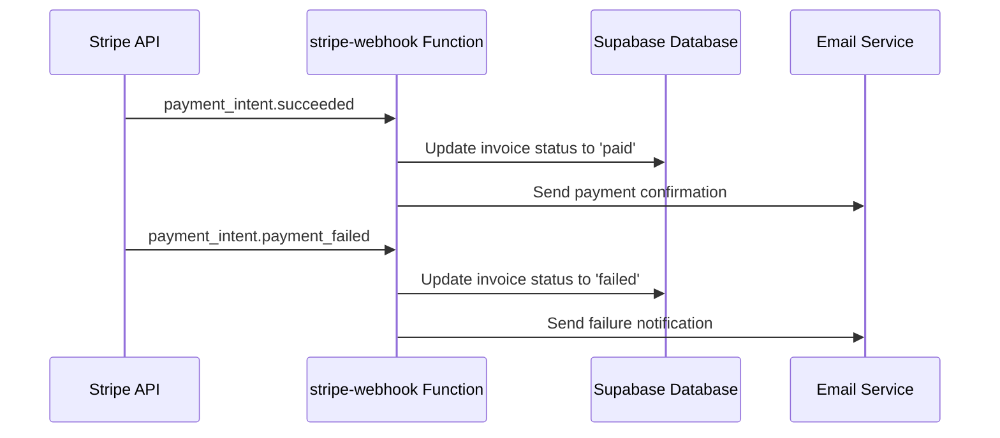

**Diagram sources**
- [stripe-webhook/index.ts](file://supabase/functions/stripe-webhook/index.ts#L61-L98)

### Lovable AI Invoice Generation

Lovable AI provides intelligent invoice generation with professional HTML templates:

#### AI Integration Features

| Feature | Implementation | Benefit |
|---------|----------------|---------|
| Model Selection | gemini-2.5-flash | High-quality invoice generation |
| Template Customization | Parameterized prompts | Tailored invoice formats |
| Content Validation | Output verification | Consistent quality standards |
| Cost Optimization | Efficient prompt engineering | Reduced API costs |

### Resend Email Service

Resend handles all email communications for financial operations:

#### Email Workflow

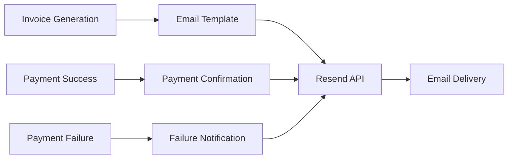

**Diagram sources**
- [generate-invoice/index.ts](file://supabase/functions/generate-invoice/index.ts#L194-L219)
- [stripe-webhook/index.ts](file://supabase/functions/stripe-webhook/index.ts#L66-L93)

### Environment Configuration

The system requires specific environment variables for external service integration:

| Variable | Purpose | Service |
|----------|---------|---------|
| `STRIPE_SECRET_KEY` | Payment processing | Stripe |
| `STRIPE_WEBHOOK_SECRET` | Webhook verification | Stripe |
| `LOVABLE_API_KEY` | AI invoice generation | Lovable AI |
| `RESEND_API_KEY` | Email delivery | Resend |
| `SUPABASE_SERVICE_ROLE_KEY` | Database operations | Supabase |

**Section sources**
- [stripe-webhook/index.ts](file://supabase/functions/stripe-webhook/index.ts#L33-L113)
- [generate-invoice/index.ts](file://supabase/functions/generate-invoice/index.ts#L10-L11)

## Error Handling and Debugging

The financial operations system implements comprehensive error handling and debugging capabilities to ensure reliability and facilitate troubleshooting.

### Error Classification and Handling

#### Payment Processing Errors

| Error Category | Common Causes | Resolution Strategy |
|----------------|---------------|-------------------|
| Authentication Errors | Expired tokens, invalid credentials | Re-authentication prompts |
| Authorization Errors | Insufficient permissions | Role verification and escalation |
| Validation Errors | Invalid payment amounts, malformed data | Input sanitization and user feedback |
| External Service Errors | API timeouts, network issues | Retry mechanisms with exponential backoff |

#### Invoice Generation Errors

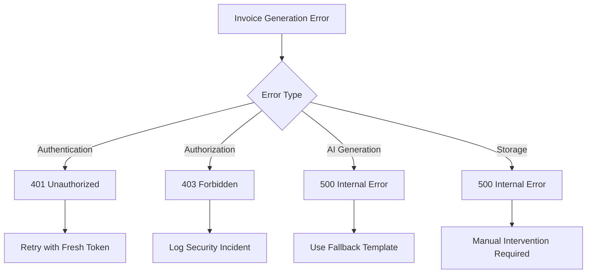

**Diagram sources**
- [create-payment-intent/index.ts](file://supabase/functions/create-payment-intent/index.ts#L279-L287)
- [generate-invoice/index.ts](file://supabase/functions/generate-invoice/index.ts#L232-L242)

### Debugging Tools and Techniques

#### Logging Strategy

The system implements structured logging with multiple levels:

| Log Level | Usage | Example |
|-----------|-------|---------|
| ERROR | Critical failures | Payment processing failures |
| WARN | Suspicious activities | Recent order modifications |
| INFO | Normal operations | Payment intent creation |
| DEBUG | Development debugging | Detailed API responses |

#### Monitoring and Alerting

Key monitoring indicators for financial operations:

1. **Payment Success Rate**: Track payment conversion rates
2. **Invoice Generation Latency**: Monitor AI response times
3. **Error Rate by Type**: Identify common failure patterns
4. **API Response Times**: Monitor external service performance

### Common Issues and Solutions

#### Payment Flow Issues

| Issue | Symptoms | Solution |
|-------|----------|----------|
| Payment Intent Creation Fails | 400 Bad Request errors | Verify order data integrity |
| Stripe Webhook Not Received | Payments not updating | Check webhook endpoint configuration |
| Duplicate Payment Attempts | Stripe API errors | Implement idempotency keys |
| Price Mismatch Errors | Validation failures | Refresh quote data before payment |

#### Invoice Generation Failures

| Issue | Symptoms | Solution |
|-------|----------|----------|
| AI Generation Timeout | 504 Gateway Timeout | Implement timeout handling |
| Storage Upload Failures | 500 Internal Server Error | Check storage bucket permissions |
| Email Delivery Issues | Missing emails | Verify Resend configuration |
| Template Generation Errors | Invalid HTML content | Validate AI output format |

### Debugging Workflow

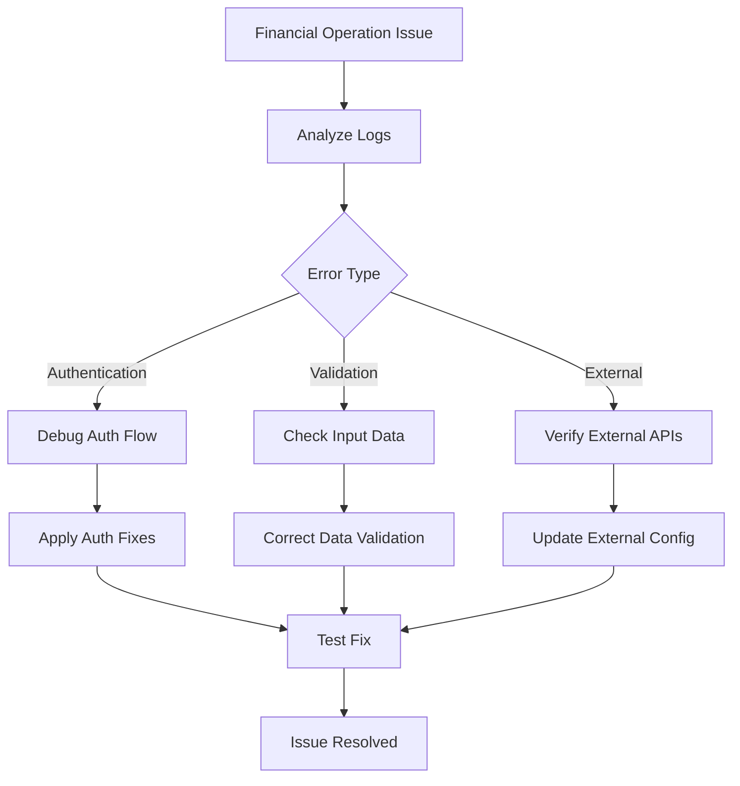

**Section sources**
- [create-payment-intent/index.ts](file://supabase/functions/create-payment-intent/index.ts#L279-L287)
- [generate-invoice/index.ts](file://supabase/functions/generate-invoice/index.ts#L232-L242)

## Administrative Features

The administrative interface provides comprehensive tools for managing financial operations, monitoring transactions, and maintaining system integrity.

### Payment Management Dashboard

The admin dashboard offers centralized control over all financial operations:

#### Key Administrative Features

| Feature | Description | Use Case |
|---------|-------------|----------|
| Invoice Status Tracking | Monitor invoice lifecycle | Payment collection management |
| Payment Verification | Validate payment authenticity | Fraud prevention |
| Refund Processing | Handle payment reversals | Customer service operations |
| Report Generation | Export financial data | Accounting and compliance |

### Financial Reporting

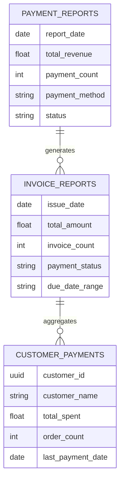

**Diagram sources**
- [PaymentManagement.tsx](file://src/components/admin/PaymentManagement.tsx#L161-L225)

### Supplier Financial Dashboard

Suppliers have access to financial insights specific to their operations:

#### Supplier Financial Metrics

| Metric | Calculation | Purpose |
|--------|-------------|---------|
| Total Revenue | Sum of paid invoices | Sales performance |
| Average Order Value | Total revenue ÷ order count | Pricing strategy |
| Payment Collection Rate | Paid invoices ÷ total invoices | Collection efficiency |
| Outstanding Balance | Pending invoices - paid invoices | Cash flow management |

### Buyer Financial Interface

Buyers can track their financial obligations and payment history:

#### Buyer Payment Tracking

The buyer interface provides comprehensive payment visibility:

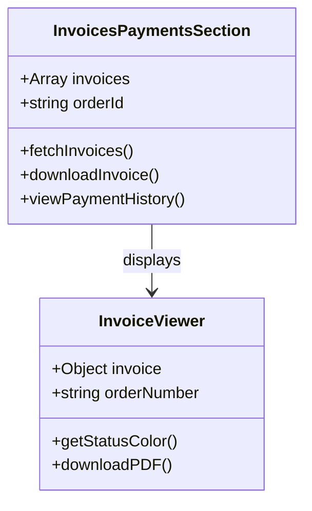

**Diagram sources**
- [InvoicesPaymentsSection.tsx](file://src/components/buyer/InvoicesPaymentsSection.tsx#L190-L216)
- [InvoiceViewer.tsx](file://src/components/payment/InvoiceViewer.tsx#L1-L97)

**Section sources**
- [PaymentManagement.tsx](file://src/components/admin/PaymentManagement.tsx#L161-L225)
- [FinancialDashboard.tsx](file://src/components/supplier/FinancialDashboard.tsx#L207-L231)
- [InvoicesPaymentsSection.tsx](file://src/components/buyer/InvoicesPaymentsSection.tsx#L190-L216)

## Troubleshooting Guide

This comprehensive troubleshooting guide addresses common issues encountered in financial operations, providing step-by-step solutions and preventive measures.

### Payment Processing Issues

#### Problem: Payment Intent Creation Fails

**Symptoms:**
- Error message: "Order not found" or "Invalid order price"
- 400 Bad Request responses from API
- Payment flow stops unexpectedly

**Diagnostic Steps:**
1. Verify order exists in database with correct status
2. Check order price integrity against quote
3. Confirm user has appropriate permissions
4. Validate payment type parameter

**Solution:**
```typescript
// Example validation code
const order = await supabase
  .from('orders')
  .select('*')
  .eq('id', orderId)
  .single();

if (!order || order.payment_status === 'paid') {
  throw new Error('Order not eligible for payment');
}
```

#### Problem: Stripe Webhook Not Processing

**Symptoms:**
- Payments succeed but invoice status remains pending
- Missing payment confirmation emails
- Discrepancies between Stripe and database

**Diagnostic Steps:**
1. Verify webhook endpoint configuration in Stripe dashboard
2. Check webhook secret key in environment variables
3. Review webhook logs for processing errors
4. Validate signature verification implementation

**Solution:**
```typescript
// Webhook signature verification
const event = stripe.webhooks.constructEvent(
  body, 
  signature, 
  webhookSecret
);
```

### Invoice Generation Problems

#### Problem: AI Invoice Generation Fails

**Symptoms:**
- 500 Internal Server errors during invoice generation
- Empty or malformed invoice HTML
- Timeout errors from Lovable AI

**Diagnostic Steps:**
1. Check Lovable AI API key validity
2. Verify AI service availability
3. Review request payload formatting
4. Monitor API rate limits

**Solution:**
```typescript
// Implement fallback mechanism
try {
  const aiResponse = await fetch(aiEndpoint, {
    method: 'POST',
    body: JSON.stringify(payload)
  });
  
  if (!aiResponse.ok) {
    // Fallback to basic template
    return generateBasicInvoice(orderData);
  }
} catch (error) {
  // Log error and use fallback
  console.error('AI generation failed:', error);
  return generateBasicInvoice(orderData);
}
```

#### Problem: Email Delivery Issues

**Symptoms:**
- Invoices generated but no emails sent
- Email delivery failures in Resend dashboard
- Missing invoice download links

**Diagnostic Steps:**
1. Verify Resend API key configuration
2. Check email template formatting
3. Review spam filters and domain reputation
4. Monitor email sending quotas

### Security and Access Issues

#### Problem: Unauthorized Access Attempts

**Symptoms:**
- Audit logs show suspicious activity
- 403 Forbidden errors in production
- Unexpected permission denials

**Diagnostic Steps:**
1. Review audit logs for patterns
2. Check user role assignments
3. Verify authentication token validity
4. Monitor for brute force attempts

**Solution:**
```typescript
// Enhanced authorization check
const { data: userRole } = await supabase
  .from('user_roles')
  .select('role')
  .eq('user_id', userId)
  .eq('role', ['admin', 'buyer'], { foreignTable: 'profiles' });

if (!userRole) {
  await logSecurityIncident('Unauthorized access attempt', userId, { 
    attemptedResource: 'financial_operation',
    userRoles: userRoles
  });
  throw new Error('Access denied');
}
```

### Performance Optimization

#### Problem: Slow Payment Processing

**Symptoms:**
- Long delays in payment confirmation
- Timeout errors in frontend
- Poor user experience during checkout

**Diagnostic Steps:**
1. Monitor API response times
2. Check external service performance
3. Analyze database query performance
4. Review frontend loading states

**Solution:**
```typescript
// Implement caching for frequently accessed data
const cacheKey = `order:${orderId}:details`;
const cachedOrder = await redis.get(cacheKey);

if (cachedOrder) {
  return cachedOrder;
}

const order = await fetchOrderFromDatabase(orderId);
await redis.set(cacheKey, order, 'EX', 300); // Cache for 5 minutes
```

### Monitoring and Maintenance

#### Regular Maintenance Tasks

| Task | Frequency | Purpose |
|------|-----------|---------|
| Audit Log Review | Daily | Security monitoring |
| Payment Status Sync | Hourly | Data consistency |
| Invoice Generation Testing | Weekly | Service reliability |
| External API Health Checks | Continuous | Service availability |

#### Proactive Monitoring

Implement monitoring for key metrics:

```typescript
// Key performance indicators
const kpis = {
  payment_success_rate: calculateSuccessRate(),
  average_processing_time: calculateAverageTime(),
  error_rate_by_type: categorizeErrors(),
  api_response_times: monitorAPILatencies()
};
```

This comprehensive troubleshooting guide provides the foundation for maintaining reliable financial operations in the SleekApp v100 system, ensuring smooth payment processing and invoice generation while maintaining security and compliance standards.