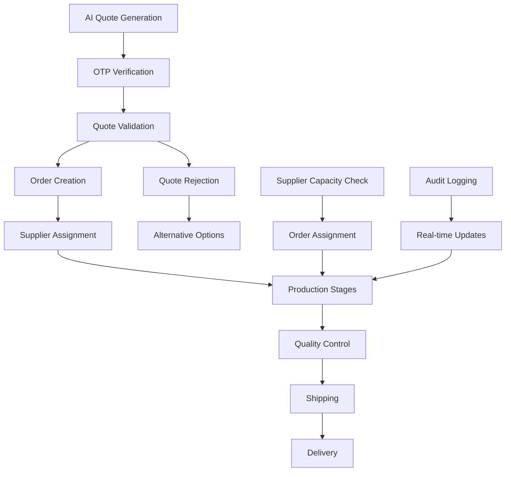
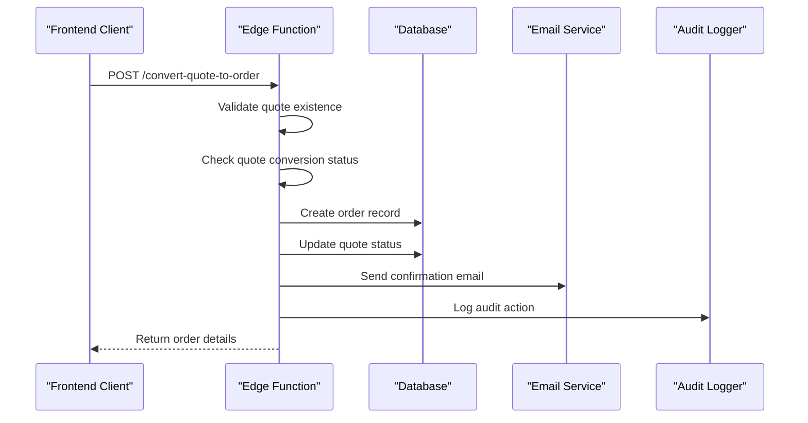
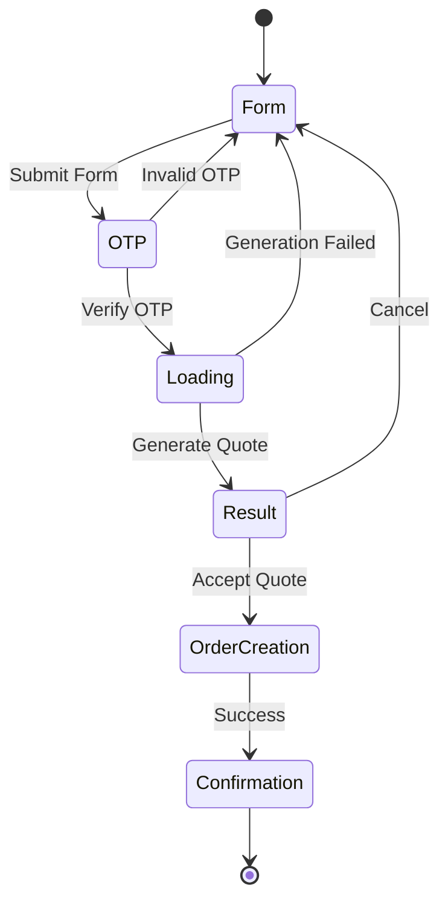
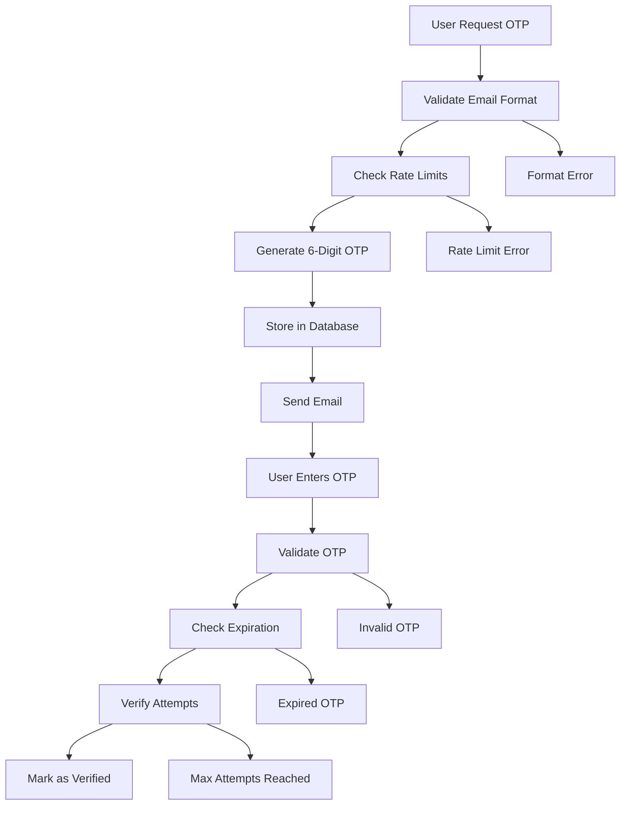
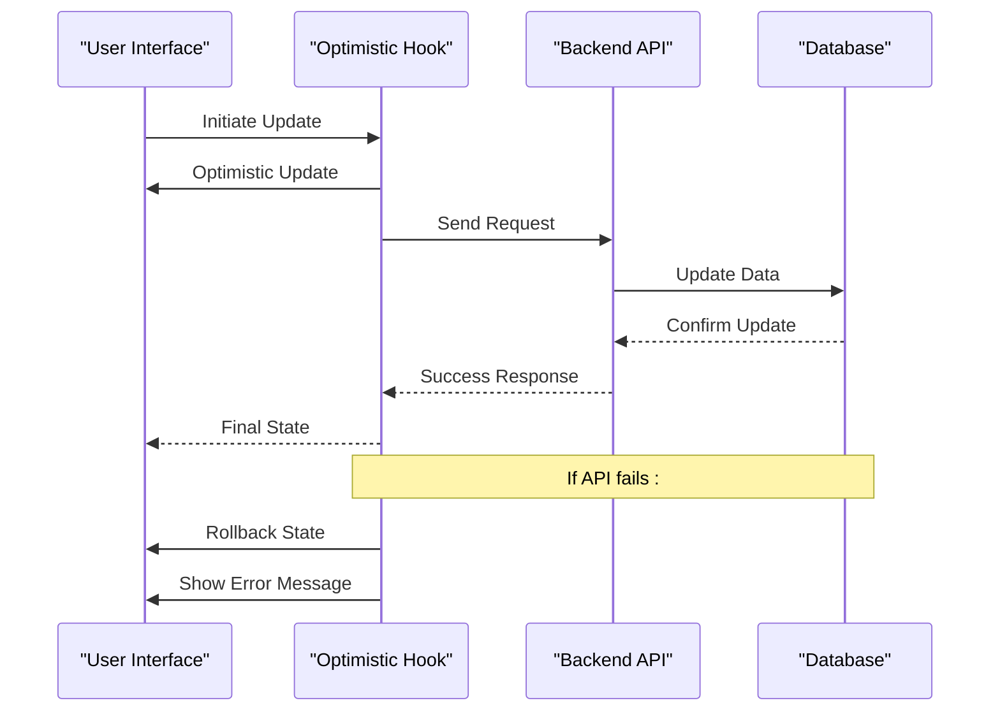
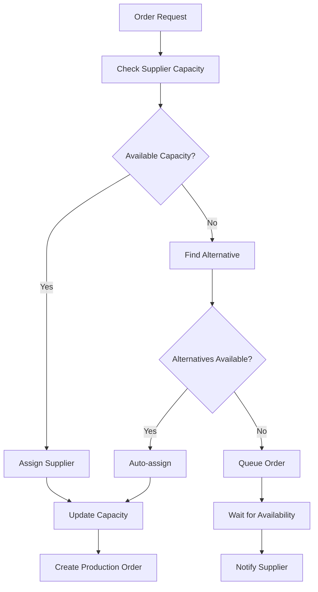
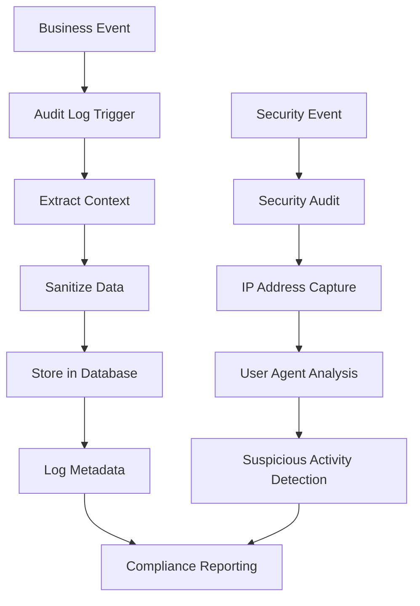
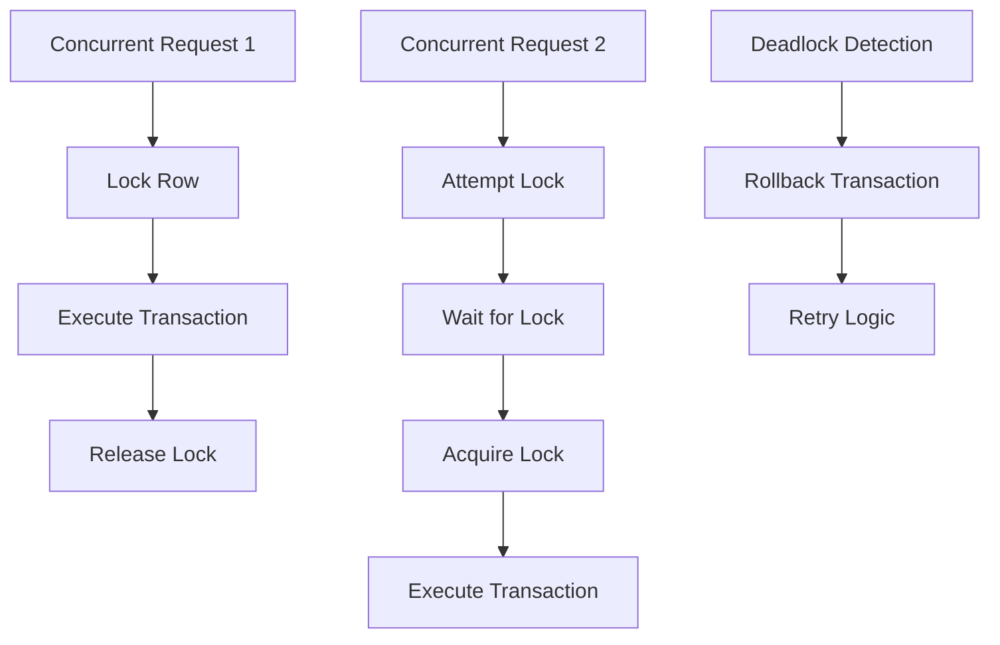
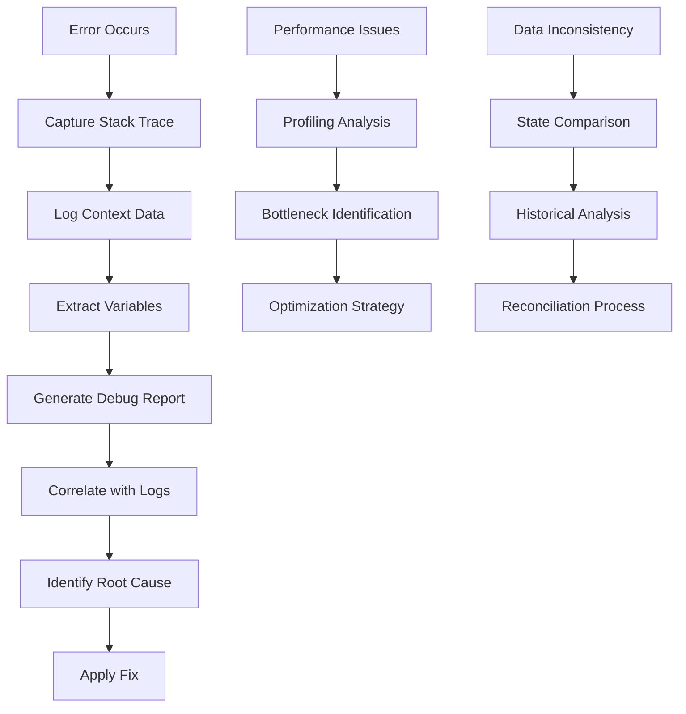

# Order Lifecycle Management

<cite>
**Referenced Files in This Document**
- [useOrderManagement.ts](file://src/hooks/useOrderManagement.ts)
- [AIQuoteGeneratorWithOTP.tsx](file://src/components/AIQuoteGeneratorWithOTP.tsx)
- [convert-quote-to-order/index.ts](file://supabase/functions/convert-quote-to-order/index.ts)
- [log-audit-action/index.ts](file://supabase/functions/log-audit-action/index.ts)
- [aiQuote.ts](file://src/lib/api/aiQuote.ts)
- [send-otp/index.ts](file://supabase/functions/send-otp/index.ts)
- [verify-otp/index.ts](file://supabase/functions/verify-otp/index.ts)
- [database.ts](file://src/types/database.ts)
- [order.ts](file://src/types/order.ts)
- [OrderConfirmation.tsx](file://src/pages\OrderConfirmation.tsx)
- [useOptimisticUpdate.ts](file://src/hooks\useOptimisticUpdate.ts)
- [QuoteHistoryCard.tsx](file://src/components\quote\QuoteHistoryCard.tsx)
</cite>

## Table of Contents
1. [Introduction](#introduction)
2. [Order Lifecycle Overview](#order-lifecycle-overview)
3. [Convert Quote to Order Function](#convert-quote-to-order-function)
4. [Frontend Integration Components](#frontend-integration-components)
5. [OTP Verification Workflow](#otp-verification-workflow)
6. [State Management and Optimistic Updates](#state-management-and-optimistic-updates)
7. [Business Rules and Validation](#business-rules-and-validation)
8. [Error Handling and Audit Logging](#error-handling-and-audit-logging)
9. [Race Condition Prevention](#race-condition-prevention)
10. [Debugging and Troubleshooting](#debugging-and-troubleshooting)
11. [Performance Considerations](#performance-considerations)
12. [Conclusion](#conclusion)

## Introduction

The sleekapp-v100 order lifecycle management system provides a comprehensive solution for converting AI-generated quotes into production orders. This system implements sophisticated business logic, robust authentication mechanisms, and real-time state management to ensure seamless transitions from quote generation to order fulfillment.

The order lifecycle encompasses multiple stages including quote validation, supplier assignment, production tracking, and delivery monitoring. The system maintains strict business rules enforcement while providing excellent user experience through optimistic updates and real-time notifications.

## Order Lifecycle Overview

The order lifecycle in sleekapp-v100 follows a structured progression from initial quote generation through final delivery:

**Diagram sources**
- [convert-quote-to-order/index.ts](file://supabase/functions/convert-quote-to-order/index.ts#L35-L150)
- [useOrderManagement.ts](file://src/hooks\useOrderManagement.ts#L52-L122)

The lifecycle includes several critical phases:

- **Quote Generation**: AI-powered pricing and timeline estimation
- **Verification**: Email-based OTP authentication for quote access
- **Validation**: Business rule compliance and supplier capacity checks
- **Order Creation**: Atomic database transactions for order persistence
- **Production Tracking**: Real-time stage monitoring and updates
- **Quality Assurance**: Multi-stage quality control processes
- **Delivery Monitoring**: Tracking and notification systems

**Section sources**
- [convert-quote-to-order/index.ts](file://supabase/functions/convert-quote-to-order/index.ts#L35-L150)
- [database.ts](file://src/types\database.ts#L1-L50)

## Convert Quote to Order Function

The `convert-quote-to-order` function serves as the core transition mechanism from AI-generated quotes to production orders. This function implements atomic transactions across multiple database tables to ensure data consistency.

### Function Architecture

**Diagram sources**
- [convert-quote-to-order/index.ts](file://supabase/functions/convert-quote-to-order/index.ts#L16-L223)

### Core Implementation Details

The function performs several critical operations:

1. **Quote Validation**: Ensures the quote exists and hasn't been previously converted
2. **Order Number Generation**: Creates unique order identifiers with timestamp-based prefixes
3. **Tracking Token Creation**: Generates secure random tokens for order tracking
4. **Buyer Management**: Handles anonymous user creation and existing user identification
5. **Atomic Transactions**: Maintains data consistency across multiple table operations
6. **Email Notifications**: Sends confirmation emails with tracking links
7. **Audit Logging**: Records all actions for compliance and debugging

### Error Handling Mechanisms

The function implements comprehensive error handling:

- **Quote Existence Checks**: Validates quote availability before processing
- **Conversion Status Validation**: Prevents duplicate order creation
- **Database Transaction Rollback**: Ensures data consistency on failures
- **Email Delivery Failures**: Graceful degradation when email services are unavailable
- **Detailed Error Reporting**: Provides meaningful error messages with debugging information

**Section sources**
- [convert-quote-to-order/index.ts](file://supabase/functions/convert-quote-to-order/index.ts#L35-L223)

## Frontend Integration Components

The frontend integration relies on several key components that work together to provide a seamless user experience during the order conversion process.

### AIQuoteGeneratorWithOTP Component

This component orchestrates the entire quote-to-order workflow:

**Diagram sources**
- [AIQuoteGeneratorWithOTP.tsx](file://src/components\AIQuoteGeneratorWithOTP.tsx#L56-L100)

### Key Features

1. **Multi-Step Workflow**: Guided process from quote generation to order placement
2. **File Upload Support**: Handles product specifications and design files
3. **Real-time Validation**: Immediate feedback on form submissions
4. **Progress Indicators**: Visual feedback during quote generation
5. **Error Recovery**: Graceful handling of network and validation errors

### State Management Integration

The component integrates with React's state management through:

- **Form State Management**: Controlled components for quote parameters
- **Loading States**: Optimistic UI updates during API calls
- **Error Boundaries**: Comprehensive error handling and user feedback
- **Local Storage**: Persistent session data for quote history

**Section sources**
- [AIQuoteGeneratorWithOTP.tsx](file://src/components\AIQuoteGeneratorWithOTP.tsx#L1-L800)

## OTP Verification Workflow

The OTP (One-Time Password) verification system provides secure authentication for quote access and order placement.

### OTP Generation and Validation Process

**Diagram sources**
- [send-otp/index.ts](file://supabase/functions\send-otp\index.ts#L131-L489)
- [verify-otp/index.ts](file://supabase/functions\verify-otp\index.ts#L21-L356)

### Security Measures

1. **Rate Limiting**: Prevents abuse through configurable limits
2. **Expiration Control**: OTPs expire after 10 minutes
3. **Attempt Monitoring**: Limits verification attempts to 5 per OTP
4. **Email Validation**: Comprehensive email format and domain checks
5. **Disposable Email Blocking**: Prevents automated abuse
6. **IP Address Tracking**: Monitors suspicious activity patterns

### Integration with Order Lifecycle

The OTP system integrates at multiple points:

- **Quote Access**: Requires OTP verification before quote generation
- **Order Placement**: Secure authentication for placing orders
- **Supplier Registration**: OTP verification for supplier onboarding
- **Daily Limits**: Controls quote generation frequency

**Section sources**
- [send-otp/index.ts](file://supabase/functions\send-otp\index.ts#L131-L489)
- [verify-otp/index.ts](file://supabase/functions\verify-otp\index.ts#L21-L356)

## State Management and Optimistic Updates

The system employs optimistic updates to provide immediate feedback while maintaining data consistency.

### Optimistic Update Pattern

**Diagram sources**
- [useOptimisticUpdate.ts](file://src/hooks\useOptimisticUpdate.ts#L16-L144)

### Implementation Details

The optimistic update system provides:

1. **Immediate UI Feedback**: Users see changes instantly
2. **Automatic Rollback**: Failed operations revert to previous state
3. **Error Handling**: Comprehensive error reporting and recovery
4. **Transaction Safety**: Ensures data consistency across operations
5. **User Experience**: Smooth interactions without waiting for server responses

### Production Stage Updates

Specialized hooks manage production stage updates:

- **Stage Progress Tracking**: Real-time updates for production stages
- **Photo Upload Integration**: Support for visual progress documentation
- **Completion Percentage**: Automatic calculation and display
- **Status Transitions**: Controlled state changes with validation

**Section sources**
- [useOptimisticUpdate.ts](file://src/hooks\useOptimisticUpdate.ts#L16-L144)

## Business Rules and Validation

The order lifecycle enforces numerous business rules to ensure operational integrity and compliance.

### Quote Validation Rules

| Rule Category | Validation Criteria | Enforcement Method |
|---------------|-------------------|-------------------|
| **Quantity Limits** | Minimum 50 units, Maximum 100,000 units | Form validation and backend checks |
| **Product Type** | Valid product categories only | Database constraint validation |
| **Complexity Level** | Simple/Medium/Complex enumeration | Type-safe validation |
| **Fabric Type** | Length constraints and format validation | Backend sanitization |
| **Quote Uniqueness** | Prevent duplicate conversions | Database uniqueness constraints |

### Supplier Capacity Validation

**Diagram sources**
- [useOrderManagement.ts](file://src/hooks\useOrderManagement.ts#L52-L122)

### Authentication Requirements

The system implements role-based access control:

- **Quote Generation**: Email verification required
- **Order Placement**: Full authentication mandatory
- **Supplier Access**: Supplier-specific permissions
- **Admin Functions**: Administrative privileges required
- **Audit Access**: Restricted to authorized personnel

### Real-time Business Rules

1. **Quote Expiration**: Quotes become invalid after 24 hours
2. **Supplier Assignment**: Automatic assignment based on capacity and expertise
3. **Production Scheduling**: Dynamic scheduling based on factory load
4. **Quality Thresholds**: Automated quality checks at each stage
5. **Delivery Deadlines**: Real-time deadline calculations

**Section sources**
- [useOrderManagement.ts](file://src/hooks\useOrderManagement.ts#L52-L122)
- [database.ts](file://src/types\database.ts#L1-L50)

## Error Handling and Audit Logging

The system implements comprehensive error handling and audit logging to ensure transparency and accountability.

### Audit Logging Architecture

**Diagram sources**
- [log-audit-action/index.ts](file://supabase/functions\log-audit-action\index.ts#L16-L97)

### Error Handling Strategies

1. **Graceful Degradation**: System continues operating despite individual component failures
2. **User-Friendly Messages**: Clear error messages without exposing technical details
3. **Automatic Retry**: Intelligent retry mechanisms for transient failures
4. **Fallback Mechanisms**: Alternative paths when primary systems fail
5. **Monitoring Integration**: Real-time alerting for critical failures

### Audit Trail Features

- **Action Tracking**: Complete history of all user actions
- **Resource Changes**: Detailed logs of data modifications
- **User Identification**: Associated actions with specific users
- **Timestamp Accuracy**: Millisecond precision for event timing
- **IP Address Logging**: Network access tracking
- **User Agent Analysis**: Browser and device information capture

### Compliance and Security

The audit system supports:

- **Regulatory Compliance**: GDPR, SOX, and other regulatory requirements
- **Forensic Analysis**: Detailed investigation capabilities
- **Access Monitoring**: User activity tracking and analysis
- **Change Accountability**: Clear attribution for all system changes
- **Security Incident Response**: Rapid detection and response to security events

**Section sources**
- [log-audit-action/index.ts](file://supabase/functions\log-audit-action\index.ts#L16-L97)

## Race Condition Prevention

The system implements multiple strategies to prevent race conditions and ensure data consistency.

### Database-Level Protection

### Optimistic Concurrency Control

1. **Version Checking**: Tracks record versions for conflict detection
2. **Timestamp Validation**: Ensures operations occur in correct sequence
3. **Conflict Resolution**: Automatic resolution of simultaneous updates
4. **Retry Mechanisms**: Intelligent retry logic for transient conflicts
5. **State Synchronization**: Consistent state across distributed components

### Application-Level Guards

- **State Locking**: Prevents simultaneous state modifications
- **Queue Management**: Serializes critical operations
- **Debounce Patterns**: Prevents rapid successive updates
- **Validation Pipelines**: Comprehensive input validation before processing
- **Transaction Boundaries**: Clear isolation of business operations

### Real-time Conflict Detection

The system monitors for:

- **Simultaneous Access**: Detects concurrent modifications
- **State Inconsistencies**: Identifies conflicting state changes
- **Timing Violations**: Prevents operations occurring out of sequence
- **Resource Contention**: Manages shared resource access
- **Deadlock Prevention**: Automatic deadlock detection and resolution

**Section sources**
- [useOptimisticUpdate.ts](file://src/hooks\useOptimisticUpdate.ts#L16-L144)

## Debugging and Troubleshooting

Effective debugging and troubleshooting capabilities are essential for maintaining system reliability.

### Tracing Function Execution

### Debug Information Collection

The system captures comprehensive debug information:

- **Execution Context**: Function parameters and execution state
- **Database State**: Current database records and relationships
- **Network Requests**: API call details and responses
- **User Session**: Authentication state and user information
- **Timing Metrics**: Performance measurements and bottlenecks
- **Error Details**: Exception stack traces and error codes

### Common Issues and Solutions

| Issue Category | Symptoms | Diagnostic Approach | Solution Strategy |
|----------------|----------|-------------------|------------------|
| **Quote Conversion Failures** | "Quote already converted" errors | Check quote status in database | Implement retry logic with status validation |
| **OTP Verification Issues** | "Invalid OTP" errors | Verify OTP storage and expiration | Improve OTP generation and delivery reliability |
| **Order Creation Errors** | Database constraint violations | Analyze foreign key relationships | Strengthen input validation and data integrity checks |
| **Supplier Assignment Problems** | Capacity calculation errors | Review supplier capacity data | Implement capacity validation before assignment |
| **Audit Log Failures** | Missing audit entries | Check audit function logs | Add fallback logging mechanisms |

### Monitoring and Alerting

- **Real-time Monitoring**: Continuous system health monitoring
- **Performance Metrics**: Key performance indicators tracking
- **Error Rate Analysis**: Automated error detection and alerting
- **Capacity Monitoring**: Resource utilization tracking
- **Security Monitoring**: Suspicious activity detection

### Development Tools

- **Local Debugging**: Comprehensive local development environment
- **Test Coverage**: Extensive unit and integration testing
- **Mock Services**: Isolated testing environments
- **Performance Profiling**: Built-in performance analysis tools
- **Error Simulation**: Controlled error injection for testing

**Section sources**
- [convert-quote-to-order/index.ts](file://supabase/functions\convert-quote-to-order\index.ts#L205-L223)
- [log-audit-action/index.ts](file://supabase/functions\log-audit-action\index.ts#L90-L97)

## Performance Considerations

The order lifecycle system is designed for high performance and scalability.

### Database Optimization

1. **Indexing Strategy**: Strategic indexing for frequently queried fields
2. **Query Optimization**: Efficient query patterns and execution plans
3. **Connection Pooling**: Optimized database connection management
4. **Caching Layers**: Intelligent caching for frequently accessed data
5. **Partitioning**: Data partitioning for large datasets

### API Performance

- **Edge Function Deployment**: Global CDN distribution for low latency
- **Compression**: Automatic response compression
- **CORS Optimization**: Efficient cross-origin resource sharing
- **Rate Limiting**: Intelligent rate limiting to prevent abuse
- **Circuit Breakers**: Automatic failure isolation

### Frontend Performance

- **Code Splitting**: Dynamic imports for optimal loading
- **State Management**: Efficient state updates and reconciliation
- **Memory Management**: Proper cleanup of resources and subscriptions
- **Rendering Optimization**: Virtual scrolling and lazy loading
- **Bundle Optimization**: Minification and tree shaking

### Scalability Features

- **Horizontal Scaling**: Ability to scale across multiple regions
- **Load Balancing**: Intelligent traffic distribution
- **Auto-scaling**: Dynamic resource allocation based on demand
- **Caching Strategies**: Multi-level caching for improved performance
- **CDN Integration**: Global content delivery network

## Conclusion

The sleekapp-v100 order lifecycle management system represents a comprehensive solution for transforming AI-generated quotes into production orders. Through careful implementation of business rules, robust error handling, and sophisticated state management, the system ensures reliable operation while providing excellent user experience.

Key strengths of the system include:

- **Atomic Transactions**: Guaranteed data consistency across multiple operations
- **Comprehensive Audit Logging**: Complete transparency for compliance and debugging
- **Robust Security**: Multi-layered authentication and validation
- **Optimistic Updates**: Immediate user feedback with automatic rollback
- **Race Condition Prevention**: Multiple strategies to ensure data integrity
- **Performance Optimization**: Scalable architecture with efficient resource utilization

The system's modular design allows for easy maintenance and extension, while the comprehensive error handling ensures graceful degradation in case of failures. The combination of frontend integration components, backend functions, and database triggers creates a cohesive ecosystem that supports the entire order lifecycle from quote generation to delivery monitoring.

Future enhancements could include expanded supplier integration, advanced analytics capabilities, and enhanced automation features. The current architecture provides a solid foundation for these improvements while maintaining the system's reliability and performance characteristics.