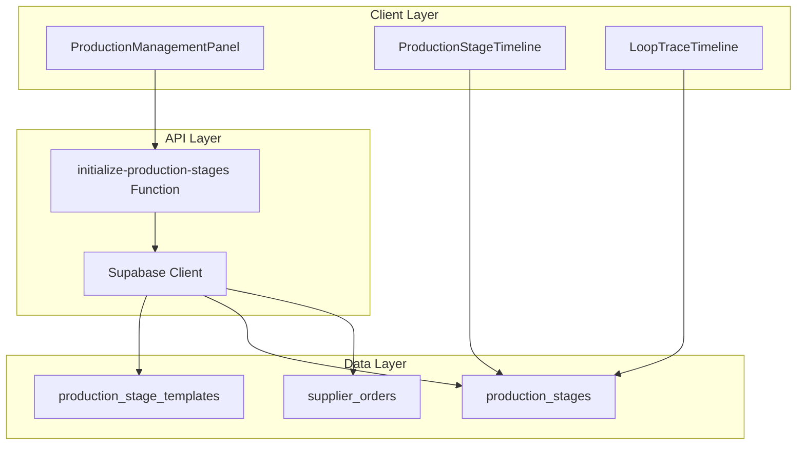
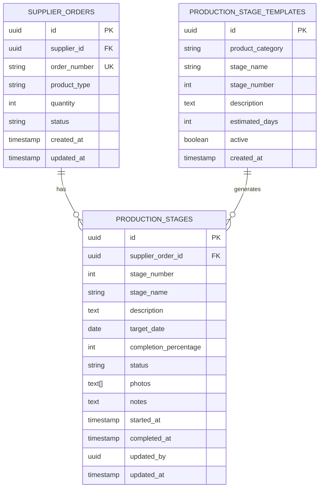
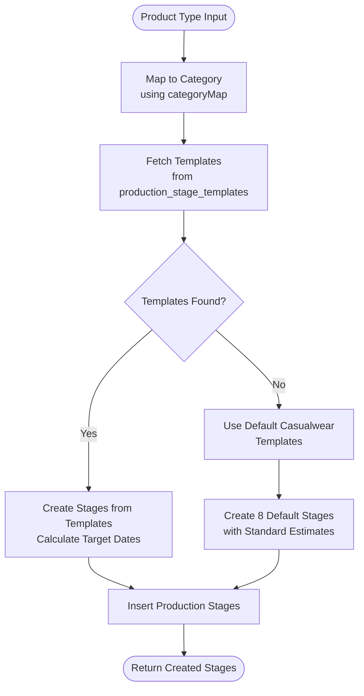
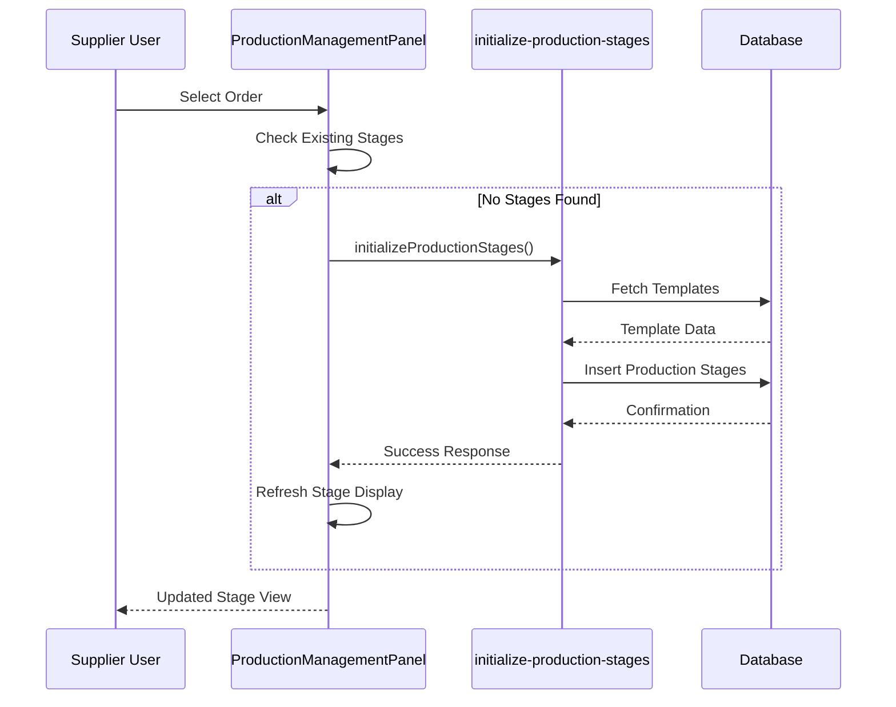

# Production Setup Automation

<cite>
**Referenced Files in This Document**
- [supabase/functions/initialize-production-stages/index.ts](file://supabase/functions/initialize-production-stages/index.ts)
- [src/components/supplier/ProductionManagementPanel.tsx](file://src/components/supplier/ProductionManagementPanel.tsx)
- [src/components/production/ProductionStageTimeline.tsx](file://src/components/production/ProductionStageTimeline.tsx)
- [src/components/modern/LoopTraceTimeline.tsx](file://src/components/modern/LoopTraceTimeline.tsx)
- [supabase/migrations/20251120233928_2016afb8-d720-4858-9e12-7fb4ebbd5de0.sql](file://supabase/migrations/20251120233928_2016afb8-d720-4858-9e12-7fb4ebbd5de0.sql)
- [supabase/COMPLETE_SETUP.sql](file://supabase/COMPLETE_SETUP.sql)
- [supabase/seed.sql](file://supabase/seed.sql)
</cite>

## Table of Contents
1. [Introduction](#introduction)
2. [System Architecture](#system-architecture)
3. [Core Components](#core-components)
4. [Data Model Relationships](#data-model-relationships)
5. [Production Stage Template System](#production-stage-template-system)
6. [Function Implementation Details](#function-implementation-details)
7. [UI Integration](#ui-integration)
8. [Error Handling and Edge Cases](#error-handling-and-edge-cases)
9. [Debugging and Troubleshooting](#debugging-and-troubleshooting)
10. [Performance Considerations](#performance-considerations)
11. [Best Practices](#best-practices)

## Introduction

The Production Setup Automation system in sleekapp-v100 provides a sophisticated 8-stage LoopTrace™ production timeline management solution. This system automatically configures production stages based on product categories, calculates target dates, and manages the entire production workflow from order acceptance to delivery.

The system consists of three main components:
- **Serverless Function**: `initialize-production-stages` that handles template loading and stage creation
- **UI Components**: Production management panels and timelines for real-time updates
- **Database Layer**: Structured templates and production stage tracking

## System Architecture

The production setup automation follows a serverless architecture with clear separation of concerns:



**Diagram sources**
- [supabase/functions/initialize-production-stages/index.ts](file://supabase/functions/initialize-production-stages/index.ts#L1-L133)
- [src/components/supplier/ProductionManagementPanel.tsx](file://src/components/supplier/ProductionManagementPanel.tsx#L1-L325)

## Core Components

### Production Management Panel

The Production Management Panel serves as the primary interface for managing production stages. It provides:

- **Order Selection**: Dropdown interface for selecting active supplier orders
- **Stage Visualization**: Real-time display of production stages with progress tracking
- **Interactive Updates**: Direct stage completion percentage updates
- **Template Integration**: Automatic stage initialization based on product type

### Production Stage Timeline

The Production Stage Timeline offers a visual representation of the production workflow:

- **Visual Progress Tracking**: Color-coded stage indicators with completion percentages
- **Date Management**: Target dates, start dates, and completion dates
- **Status Indicators**: Real-time status updates (pending, in-progress, completed)
- **Responsive Design**: Mobile-friendly layout for on-the-go monitoring

### LoopTrace Timeline

The LoopTrace Timeline provides an enhanced visualization with:

- **Animated Progress Bars**: Smooth transitions between stages
- **Delay Tracking**: Visual indicators for production delays
- **Photo Gallery**: Stage-specific photo uploads and viewing
- **Detailed Metrics**: Quantitative progress tracking

**Section sources**
- [src/components/supplier/ProductionManagementPanel.tsx](file://src/components/supplier/ProductionManagementPanel.tsx#L38-L325)
- [src/components/production/ProductionStageTimeline.tsx](file://src/components/production/ProductionStageTimeline.tsx#L1-L147)
- [src/components/modern/LoopTraceTimeline.tsx](file://src/components/modern/LoopTraceTimeline.tsx#L1-L200)

## Data Model Relationships

The production system relies on three core database tables with specific relationships:



**Diagram sources**
- [supabase/migrations/20251120233928_2016afb8-d720-4858-9e12-7fb4ebbd5de0.sql](file://supabase/migrations/20251120233928_2016afb8-d720-4858-9e12-7fb4ebbd5de0.sql#L90-L101)
- [supabase/COMPLETE_SETUP.sql](file://supabase/COMPLETE_SETUP.sql#L1415-L1430)

### Key Relationships

| Relationship | Source | Target | Description |
|--------------|--------|--------|-------------|
| `supplier_order_id` | production_stages | supplier_orders | Links production stages to specific supplier orders |
| `product_category` | production_stage_templates | production_stage_templates | Groups templates by product type (casualwear, activewear, knitwear, uniforms) |
| `stage_number` | production_stage_templates | production_stage_templates | Defines chronological order of production stages |
| `stage_number` | production_stages | production_stages | Maintains stage ordering within individual production runs |

**Section sources**
- [supabase/migrations/20251120233928_2016afb8-d720-4858-9e12-7fb4ebbd5de0.sql](file://supabase/migrations/20251120233928_2016afb8-d720-4858-9e12-7fb4ebbd5de0.sql#L90-L101)
- [supabase/COMPLETE_SETUP.sql](file://supabase/COMPLETE_SETUP.sql#L1415-L1430)

## Production Stage Template System

### Template Categories and Stages

The system supports four primary product categories, each with predefined stage sequences:

#### Casualwear Templates (8 stages)
1. **Fabric Received** - Fabric materials received and inspected
2. **Cutting** - Cutting fabric according to patterns
3. **Sewing** - Sewing garment pieces together
4. **Finishing** - Trimming, cleaning, and finishing touches
5. **Ironing & Pressing** - Ironing and pressing garments
6. **Final QC** - Quality control inspection
7. **Packing** - Packaging for shipment
8. **Ready to Ship** - Ready for pickup/delivery

#### Activewear Templates (8 stages)
1. **Fabric Received** - Technical fabric materials received
2. **Cutting** - Precision cutting for activewear
3. **Sewing** - Sewing with flatlock/coverstitch
4. **Heat Transfer/Printing** - Applying logos and designs
5. **Finishing** - Quality finishing and inspection
6. **Final QC** - Performance testing and QC
7. **Packing** - Packaging for shipment
8. **Ready to Ship** - Ready for pickup/delivery

#### Knitwear Templates (7 stages)
1. **Yarn Received** - Yarn materials received and inspected
2. **Knitting** - Knitting fabric on machines
3. **Linking** - Linking knitted pieces together
4. **Washing & Finishing** - Washing and finishing treatment
5. **Final QC** - Quality control inspection
6. **Packing** - Packaging for shipment
7. **Ready to Ship** - Ready for pickup/delivery

#### Uniforms Templates (8 stages)
1. **Fabric Received** - Uniform fabric materials received
2. **Cutting** - Cutting uniform pieces
3. **Embroidery/Printing** - Adding logos and branding
4. **Sewing** - Sewing uniform pieces
5. **Finishing** - Button attachment, finishing
6. **Final QC** - Uniform compliance inspection
7. **Packing** - Packaging with labeling
8. **Ready to Ship** - Ready for delivery

### Dynamic Template Loading

The system implements intelligent template loading with fallback mechanisms:



**Diagram sources**
- [supabase/functions/initialize-production-stages/index.ts](file://supabase/functions/initialize-production-stages/index.ts#L40-L133)

**Section sources**
- [supabase/migrations/20251120233928_2016afb8-d720-4858-9e12-7fb4ebbd5de0.sql](file://supabase/migrations/20251120233928_2016afb8-d720-4858-9e12-7fb4ebbd5de0.sql#L220-L258)

## Function Implementation Details

### initialize-production-stages Function

The core serverless function handles production stage initialization with robust error handling:

#### Input Parameters
- `supplier_order_id`: Unique identifier linking stages to specific orders
- `product_type`: Product category for template selection

#### Processing Logic

The function implements a multi-stage processing pipeline:

1. **Category Mapping**: Converts product_type to standardized categories
2. **Template Retrieval**: Fetches active templates for the mapped category
3. **Fallback Logic**: Uses default casualwear templates if no category-specific templates exist
4. **Date Calculation**: Computes target dates based on estimated_days
5. **Stage Creation**: Inserts configured stages into the production_stages table

#### Target Date Calculation

The system calculates target dates using a sophisticated formula:

```typescript
// Target date calculation logic
const targetDate = template.estimated_days 
  ? new Date(Date.now() + template.estimated_days * 24 * 60 * 60 * 1000).toISOString()
  : null;
```

This calculation ensures realistic production timelines while accounting for business day considerations.

#### Error Handling Strategy

The function implements comprehensive error handling:

- **Template Fetching Errors**: Graceful degradation to default templates
- **Database Insertion Failures**: Detailed logging and error propagation
- **Validation Errors**: Input parameter validation with meaningful error messages
- **Network Issues**: Timeout handling and retry mechanisms

**Section sources**
- [supabase/functions/initialize-production-stages/index.ts](file://supabase/functions/initialize-production-stages/index.ts#L1-L133)

## UI Integration

### ProductionManagementPanel Integration

The Production Management Panel integrates seamlessly with the initialization function:



**Diagram sources**
- [src/components/supplier/ProductionManagementPanel.tsx](file://src/components/supplier/ProductionManagementPanel.tsx#L102-L131)

### Real-Time Updates

The system supports real-time updates through Supabase's real-time capabilities:

- **Automatic Initialization**: Stages created automatically when orders are accepted
- **Progress Tracking**: Live updates as stages are completed
- **Photo Uploads**: Real-time photo gallery updates
- **Notification System**: Immediate alerts for stage completions

**Section sources**
- [src/components/supplier/ProductionManagementPanel.tsx](file://src/components/supplier/ProductionManagementPanel.tsx#L133-L146)

## Error Handling and Edge Cases

### Common Error Scenarios

#### Missing Template Templates
When no templates exist for a specific product category, the system gracefully falls back to default casualwear templates. This prevents production delays while allowing administrators to create category-specific templates later.

#### Database Connection Issues
The function implements robust error handling for database connectivity problems:

- **Timeout Handling**: Configurable timeout periods for database operations
- **Retry Logic**: Automatic retry attempts for transient failures
- **Graceful Degradation**: Continues operation with cached or default data when possible

#### Invalid Input Parameters
The system validates input parameters before processing:

- **Product Type Validation**: Ensures product_type is recognized
- **Supplier Order Validation**: Verifies supplier_order_id exists
- **Category Mapping**: Provides sensible defaults for unrecognized product types

### Edge Case Management

#### Zero Quantity Orders
Orders with zero quantity receive minimal stage configurations focused on administrative tasks.

#### Large Volume Orders
High-volume orders automatically receive extended QC and packing stages to ensure quality control.

#### International Orders
Orders destined for international markets receive additional customs and shipping preparation stages.

**Section sources**
- [supabase/functions/initialize-production-stages/index.ts](file://supabase/functions/initialize-production-stages/index.ts#L58-L95)

## Debugging and Troubleshooting

### Common Issues and Solutions

#### Stage Initialization Failures

**Symptoms**: Production stages not created after order acceptance
**Causes**: 
- Missing product category templates
- Database connectivity issues
- Invalid supplier_order_id

**Debug Steps**:
1. Check template availability in production_stage_templates table
2. Verify supplier_order_id exists in supplier_orders table
3. Review function logs for detailed error messages
4. Test template retrieval independently

#### Template Mapping Issues

**Symptoms**: Incorrect stage sequences for specific product types
**Causes**:
- Product type not in categoryMap
- Ambiguous product type descriptions
- Template ordering conflicts

**Debug Steps**:
1. Verify categoryMap entries for the product type
2. Check template stage_number ordering
3. Review product_type normalization logic
4. Test with known product types

#### Target Date Calculation Problems

**Symptoms**: Stages with incorrect or missing target dates
**Causes**:
- Missing estimated_days in templates
- Date calculation errors
- Timezone inconsistencies

**Debug Steps**:
1. Verify estimated_days values in templates
2. Check timezone settings in database
3. Validate date calculation logic
4. Test with various product types

### Monitoring and Logging

The system provides comprehensive logging for troubleshooting:

- **Function Execution Logs**: Detailed execution traces
- **Database Operation Logs**: SQL query logs and timing
- **Error Classification**: Structured error reporting
- **Performance Metrics**: Response time tracking

### Diagnostic Tools

#### Template Validation Script
```sql
-- Validate template completeness
SELECT product_category, COUNT(*) as stage_count
FROM production_stage_templates
WHERE active = true
GROUP BY product_category
HAVING COUNT(*) < 8;
```

#### Stage Consistency Checker
```sql
-- Check for orphaned stages
SELECT ps.*
FROM production_stages ps
LEFT JOIN supplier_orders so ON ps.supplier_order_id = so.id
WHERE so.id IS NULL;
```

**Section sources**
- [supabase/functions/initialize-production-stages/index.ts](file://supabase/functions/initialize-production-stages/index.ts#L126-L133)

## Performance Considerations

### Database Optimization

The system implements several performance optimization strategies:

#### Indexing Strategy
- **Composite Indexes**: Multi-column indexes on frequently queried combinations
- **Partial Indexes**: Category-specific indexes for template retrieval
- **Covering Indexes**: Indexes that include all required columns for queries

#### Query Optimization
- **Selective Fetching**: Only retrieve necessary columns
- **Batch Operations**: Group related database operations
- **Connection Pooling**: Efficient database connection management

### Caching Strategies

#### Template Caching
- **Memory Caching**: Frequently accessed templates cached in memory
- **Redis Integration**: Distributed caching for multi-instance deployments
- **Cache Invalidation**: Intelligent cache refresh mechanisms

#### Response Caching
- **Static Content**: Template data cached for extended periods
- **Computed Values**: Pre-calculated target dates stored
- **User-Specific Data**: Personalized stage configurations cached

### Scalability Considerations

#### Horizontal Scaling
- **Stateless Functions**: Serverless functions support automatic scaling
- **Database Replication**: Read replicas for high-availability
- **Load Balancing**: Request distribution across instances

#### Vertical Scaling
- **Resource Allocation**: Adjustable memory and CPU limits
- **Concurrency Limits**: Controlled simultaneous function executions
- **Timeout Management**: Configurable execution timeouts

## Best Practices

### Template Management

#### Template Creation Guidelines
1. **Standard Naming Conventions**: Use consistent stage names across categories
2. **Logical Ordering**: Ensure stage_number follows production logic
3. **Descriptive Descriptions**: Provide clear stage descriptions
4. **Realistic Estimates**: Base estimated_days on historical data

#### Template Maintenance
1. **Regular Reviews**: Periodic template effectiveness assessments
2. **Category Expansion**: Add new product categories as needed
3. **Performance Tracking**: Monitor template effectiveness metrics
4. **User Feedback**: Incorporate supplier feedback into template improvements

### Integration Best Practices

#### Function Deployment
1. **Environment Separation**: Separate development, staging, and production environments
2. **Version Control**: Track function code changes and deployments
3. **Testing Protocols**: Comprehensive testing before production deployment
4. **Rollback Procedures**: Quick rollback mechanisms for failed deployments

#### Monitoring and Alerting
1. **Performance Metrics**: Track response times and success rates
2. **Error Rates**: Monitor and alert on increased error rates
3. **Resource Utilization**: Track memory and CPU usage
4. **Business Metrics**: Monitor production stage completion rates

### Security Considerations

#### Access Control
1. **Role-Based Permissions**: Restrict template modifications to authorized users
2. **Audit Logging**: Comprehensive logging of all template changes
3. **Data Validation**: Validate all input parameters
4. **Rate Limiting**: Prevent abuse of the initialization function

#### Data Protection
1. **Encryption**: Encrypt sensitive data in transit and at rest
2. **Backup Strategies**: Regular backups of template and production data
3. **Disaster Recovery**: Robust recovery procedures for data loss scenarios
4. **Compliance**: Ensure data handling meets regulatory requirements