# Analytics Tracking System

<cite>
**Referenced Files in This Document**
- [track-product-interaction/index.ts](file://supabase/functions/track-product-interaction/index.ts)
- [track-social-share/index.ts](file://supabase/functions/track-social-share/index.ts)
- [tracker.ts](file://src/lib/analytics/tracker.ts)
- [MarketResearchInsights.tsx](file://src/components/quote/MarketResearchInsights.tsx)
- [analyticsTracking.ts](file://src/lib/analyticsTracking.ts)
- [useProductAnalytics.ts](file://src/hooks/useProductAnalytics.ts)
- [20251117015024_d47b7ef9-be84-43eb-9ec4-b93c55d353e8.sql](file://supabase/migrations/20251117015024_d47b7ef9-be84-43eb-9ec4-b93c55d353e8.sql)
- [20251120131648_76091c3c-ec15-4a1a-a0bc-3d265c494103.sql](file://supabase/migrations/20251120131648_76091c3c-ec15-4a1a-a0bc-3d265c494103.sql)
- [README.md](file://README.md)
</cite>

## Table of Contents
1. [Introduction](#introduction)
2. [System Architecture](#system-architecture)
3. [Core Tracking Functions](#core-tracking-functions)
4. [Database Schema](#database-schema)
5. [Security and Privacy](#security-and-privacy)
6. [Client-Side Integration](#client-side-integration)
7. [Performance Optimization](#performance-optimization)
8. [Business Intelligence](#business-intelligence)
9. [Troubleshooting Guide](#troubleshooting-guide)
10. [Best Practices](#best-practices)

## Introduction

The Sleek Apparels analytics tracking system is a comprehensive solution for capturing user engagement metrics across product interactions and social sharing events. Built on Supabase with edge functions, this system provides real-time tracking capabilities while maintaining high performance and strict privacy controls.

The system consists of two primary tracking functions:
- **track-product-interaction**: Captures detailed product engagement metrics including hover events, clicks, and user interactions
- **track-social-share**: Monitors social media sharing activities with rate limiting and validation

Both functions implement a non-blocking execution model that returns HTTP 204 immediately while processing asynchronously, ensuring optimal user experience without compromising data collection accuracy.

## System Architecture

The analytics tracking system follows a distributed architecture with edge functions serving as the primary data ingestion layer:

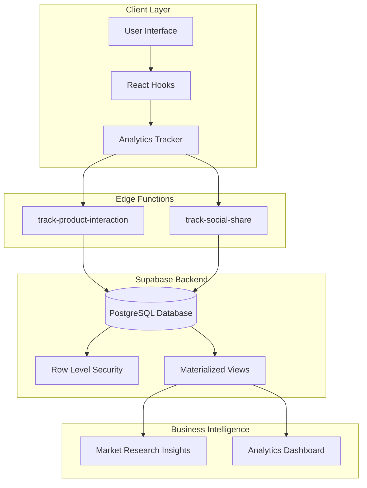

**Diagram sources**
- [track-product-interaction/index.ts](file://supabase/functions/track-product-interaction/index.ts#L28-L136)
- [track-social-share/index.ts](file://supabase/functions/track-social-share/index.ts#L12-L129)
- [20251117015024_d47b7ef9-be84-43eb-9ec4-b93c55d353e8.sql](file://supabase/migrations/20251117015024_d47b7ef9-be84-43eb-9ec4-b93c55d353e8.sql#L13-L98)

**Section sources**
- [track-product-interaction/index.ts](file://supabase/functions/track-product-interaction/index.ts#L1-L136)
- [track-social-share/index.ts](file://supabase/functions/track-social-share/index.ts#L1-L129)

## Core Tracking Functions

### Product Interaction Tracking

The `track-product-interaction` function captures comprehensive user engagement data with sophisticated deduplication and validation mechanisms:

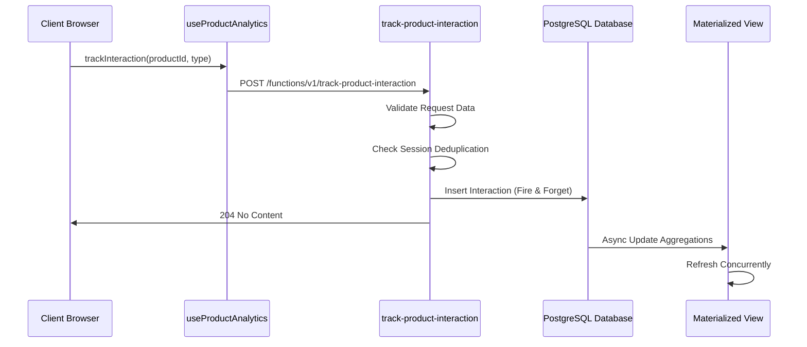

**Diagram sources**
- [track-product-interaction/index.ts](file://supabase/functions/track-product-interaction/index.ts#L28-L136)
- [useProductAnalytics.ts](file://src/hooks/useProductAnalytics.ts#L34-L64)

#### Request Structure and Validation

The product interaction function validates incoming requests through multiple layers:

| Field | Type | Validation | Purpose |
|-------|------|------------|---------|
| `productId` | string | UUID format check | Ensures valid product reference |
| `interactionType` | enum | Predefined interaction types | Maintains data consistency |
| `sessionId` | string | Required field | Enables session-based deduplication |
| `additionalData` | object | Optional JSON | Stores custom event properties |

#### Interaction Types

The system tracks eight distinct interaction types:

| Type | Description | Use Case |
|------|-------------|----------|
| `hover` | Mouse hover events | Engagement measurement |
| `quick_view_click` | Quick view button clicks | Product exploration |
| `wishlist_click` | Add to wishlist actions | Interest tracking |
| `color_swatch_click` | Color selection clicks | Personalization data |
| `design_click` | Design customization actions | Feature usage |
| `quote_click` | Quote request initiation | Conversion funnel |
| `add_to_cart` | Cart addition actions | Purchase intent |
| `view_details` | Product detail page visits | Content consumption |

#### Deduplication Strategies

The system implements intelligent deduplication to prevent data inflation:

- **Session-based Deduplication**: Hover events are tracked only once per session per product
- **Asynchronous Processing**: Inserts occur without blocking response delivery
- **Fire-and-forget Model**: Guarantees user experience continuity

**Section sources**
- [track-product-interaction/index.ts](file://supabase/functions/track-product-interaction/index.ts#L9-L136)
- [useProductAnalytics.ts](file://src/hooks/useProductAnalytics.ts#L1-L115)

### Social Share Tracking

The `track-social-share` function monitors social media sharing activities with robust rate limiting and validation:

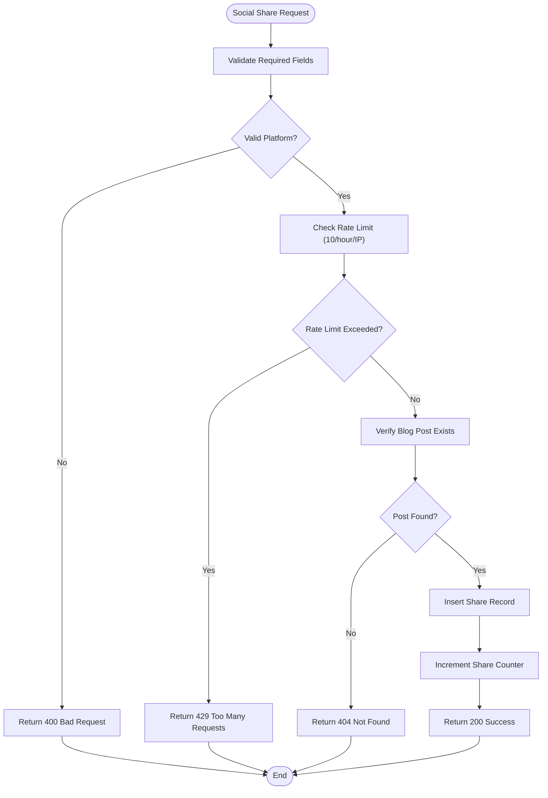

**Diagram sources**
- [track-social-share/index.ts](file://supabase/functions/track-social-share/index.ts#L18-L129)

#### Rate Limiting Implementation

The social share function implements a sophisticated rate limiting mechanism:

- **Time Window**: 1-hour sliding window
- **Threshold**: Maximum 10 shares per IP address
- **Storage**: Uses the `social_shares` table for tracking
- **Service Role**: Requires Supabase service role for enforcement

#### Supported Platforms

| Platform | Code | Description |
|----------|------|-------------|
| LinkedIn | `linkedin` | Professional networking |
| Facebook | `facebook` | Social media platform |
| Twitter | `twitter` | Microblogging service |
| WhatsApp | `whatsapp` | Messaging application |

**Section sources**
- [track-social-share/index.ts](file://supabase/functions/track-social-share/index.ts#L1-L129)

## Database Schema

### Product Interactions Table

The `product_interactions` table serves as the central repository for all product engagement data:

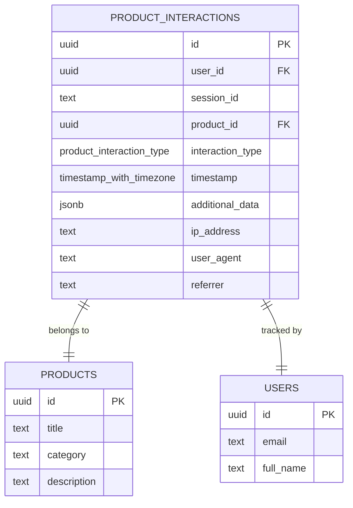

**Diagram sources**
- [20251117015024_d47b7ef9-be84-43eb-9ec4-b93c55d353e8.sql](file://supabase/migrations/20251117015024_d47b7ef9-be84-43eb-9ec4-b93c55d353e8.sql#L13-L26)

#### Table Structure and Constraints

| Column | Type | Constraints | Purpose |
|--------|------|-------------|---------|
| `id` | UUID | PRIMARY KEY | Unique identifier |
| `user_id` | UUID | FOREIGN KEY | Authenticated user reference |
| `session_id` | TEXT | NOT NULL | Anonymous tracking identifier |
| `product_id` | UUID | NOT NULL, FK | Related product reference |
| `interaction_type` | ENUM | NOT NULL | Interaction classification |
| `timestamp` | TIMESTAMP | DEFAULT now() | Event timing |
| `additional_data` | JSONB | DEFAULT '{}' | Flexible property storage |
| `ip_address` | TEXT | NULLABLE | Client IP address |
| `user_agent` | TEXT | NULLABLE | Browser/device information |
| `referrer` | TEXT | NULLABLE | Originating page |

#### Indexing Strategy

The database employs a comprehensive indexing strategy for optimal query performance:

| Index | Columns | Purpose |
|-------|---------|---------|
| `idx_product_interactions_product_id` | `product_id` | Fast product-based queries |
| `idx_product_interactions_session_id` | `session_id` | Session-based analytics |
| `idx_product_interactions_user_id` | `user_id` | User-specific queries |
| `idx_product_interactions_timestamp` | `timestamp` | Time-series analysis |
| `idx_product_interactions_type` | `interaction_type` | Interaction type filtering |
| `idx_product_interactions_composite` | `product_id, interaction_type, timestamp` | Complex analytics queries |

**Section sources**
- [20251117015024_d47b7ef9-be84-43eb-9ec4-b93c55d353e8.sql](file://supabase/migrations/20251117015024_d47b7ef9-be84-43eb-9ec4-b93c55d353e8.sql#L13-L98)

### Materialized View for Engagement Metrics

The system maintains a materialized view for aggregated product engagement analytics:

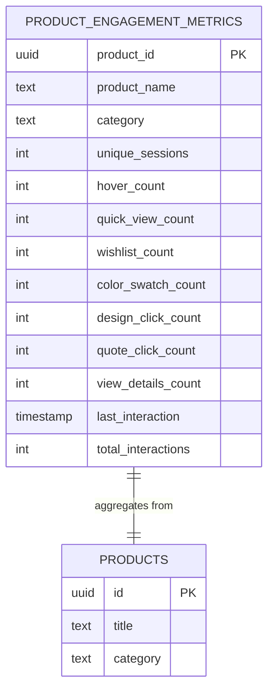

**Diagram sources**
- [20251117015024_d47b7ef9-be84-43eb-9ec4-b93c55d353e8.sql](file://supabase/migrations/20251117015024_d47b7ef9-be84-43eb-9ec4-b93c55d353e8.sql#L58-L76)

#### Aggregation Logic

The materialized view performs sophisticated aggregations over the past 30 days:

| Metric | Calculation | Purpose |
|--------|-------------|---------|
| `unique_sessions` | COUNT(DISTINCT session_id) | Session-based engagement |
| `hover_count` | COUNT(*) FILTER (WHERE type = 'hover') | Engagement intensity |
| `quick_view_count` | COUNT(*) FILTER (WHERE type = 'quick_view_click') | Exploration behavior |
| `wishlist_count` | COUNT(*) FILTER (WHERE type = 'wishlist_click') | Interest level |
| `color_swatch_count` | COUNT(*) FILTER (WHERE type = 'color_swatch_click') | Personalization usage |
| `design_click_count` | COUNT(*) FILTER (WHERE type = 'design_click') | Feature adoption |
| `quote_click_count` | COUNT(*) FILTER (WHERE type = 'quote_click') | Conversion funnel |
| `view_details_count` | COUNT(*) FILTER (WHERE type = 'view_details') | Content consumption |
| `last_interaction` | MAX(timestamp) | Recency analysis |
| `total_interactions` | COUNT(*) | Overall activity |

#### Refresh Strategy

The materialized view supports concurrent refresh operations for high availability:

- **Concurrent Refresh**: `REFRESH MATERIALIZED VIEW CONCURRENTLY`
- **Scheduled Updates**: Configurable refresh intervals
- **Service Role Access**: Requires service role permissions

**Section sources**
- [20251117015024_d47b7ef9-be84-43eb-9ec4-b93c55d353e8.sql](file://supabase/migrations/20251117015024_d47b7ef9-be84-43eb-9ec4-b93c55d353e8.sql#L58-L98)

## Security and Privacy

### Row Level Security (RLS) Policies

The analytics system implements comprehensive RLS policies to protect user privacy and ensure data segregation:

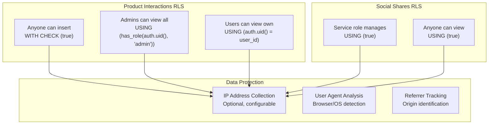

**Diagram sources**
- [20251117015024_d47b7ef9-be84-43eb-9ec4-b93c55d353e8.sql](file://supabase/migrations/20251117015024_d47b7ef9-be84-43eb-9ec4-b93c55d353e8.sql#L39-L55)
- [20251120131648_76091c3c-ec15-4a1a-a0bc-3d265c494103.sql](file://supabase/migrations/20251120131648_76091c3c-ec15-4a1a-a0bc-3d265c494103.sql#L19-L30)

#### Policy Details

| Table | Insert Policy | Select Policy | Purpose |
|-------|---------------|---------------|---------|
| `product_interactions` | Anyone can insert | Admins + Self | Public engagement tracking |
| `social_shares` | Service role only | Anyone can view | Social analytics with restricted writes |

#### Privacy Considerations

The system implements several privacy-preserving measures:

- **Optional IP Collection**: IP addresses are collected only when necessary
- **User Agent Analysis**: Browser and OS detection without personal identification
- **Anonymous Tracking**: Session-based tracking for unauthenticated users
- **Data Retention**: Automatic cleanup of old interaction data

**Section sources**
- [20251117015024_d47b7ef9-be84-43eb-9ec4-b93c55d353e8.sql](file://supabase/migrations/20251117015024_d47b7ef9-be84-43eb-9ec4-b93c55d353e8.sql#L39-L55)
- [20251120131648_76091c3c-ec15-4a1a-a0bc-3d265c494103.sql](file://supabase/migrations/20251120131648_76091c3c-ec15-4a1a-a0bc-3d265c494103.sql#L19-L30)

## Client-Side Integration

### React Hook Implementation

The `useProductAnalytics` hook provides a comprehensive interface for client-side tracking:

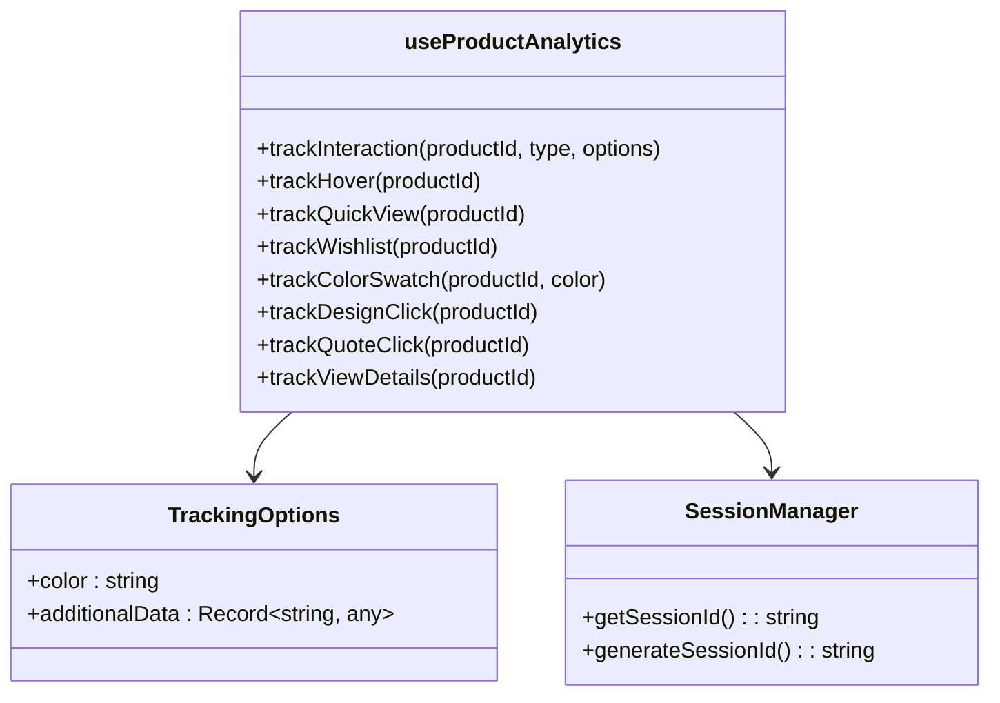

**Diagram sources**
- [useProductAnalytics.ts](file://src/hooks/useProductAnalytics.ts#L29-L114)

#### Hook Functionality

The analytics hook provides specialized tracking functions for different interaction types:

| Function | Purpose | Implementation |
|----------|---------|----------------|
| `trackHover` | Mouse hover events | Session-based deduplication |
| `trackQuickView` | Product preview clicks | Standard interaction tracking |
| `trackWishlist` | Add to wishlist actions | User-centric tracking |
| `trackColorSwatch` | Color selection | Additional data support |
| `trackDesignClick` | Customization actions | Feature-specific tracking |
| `trackQuoteClick` | Quote request initiation | Conversion-focused tracking |
| `trackViewDetails` | Product detail visits | Content engagement tracking |

#### Session Management

The system implements intelligent session management:

- **Session Persistence**: Uses `sessionStorage` for cross-page tracking
- **Automatic Generation**: Creates unique session IDs when needed
- **Fallback Handling**: Graceful degradation for storage limitations

**Section sources**
- [useProductAnalytics.ts](file://src/hooks/useProductAnalytics.ts#L1-L115)

### Tracker Library Integration

The centralized tracker library provides standardized event tracking across the application:

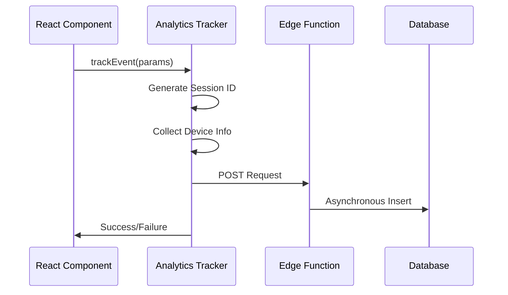

**Diagram sources**
- [tracker.ts](file://src/lib/analytics/tracker.ts#L23-L103)
- [analyticsTracking.ts](file://src/lib/analyticsTracking.ts#L17-L149)

#### Event Categories

The tracker supports multiple event categories for organized analytics:

| Category | Events | Purpose |
|----------|--------|---------|
| `engagement` | Page views, CTAs, form interactions | User behavior analysis |
| `conversion` | Signups, form submissions, purchases | Funnel optimization |
| `navigation` | Page transitions, route changes | User journey mapping |
| `error` | Failed operations, timeouts | System reliability monitoring |

**Section sources**
- [tracker.ts](file://src/lib/analytics/tracker.ts#L1-L103)
- [analyticsTracking.ts](file://src/lib/analyticsTracking.ts#L1-L149)

## Performance Optimization

### Asynchronous Processing Model

The analytics system implements a fire-and-forget architecture for optimal performance:

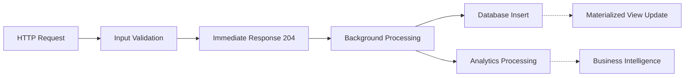

**Diagram sources**
- [track-product-interaction/index.ts](file://supabase/functions/track-product-interaction/index.ts#L118-L127)

#### Performance Benefits

The asynchronous model provides several performance advantages:

- **Zero Latency**: Immediate HTTP 204 response prevents user experience delays
- **Scalable Processing**: Background workers handle data persistence
- **Resource Efficiency**: Separates user-facing concerns from data processing
- **Fault Isolation**: Database failures don't impact user interactions

#### Concurrency Management

The system handles high-volume traffic through:

- **Parallel Processing**: Multiple concurrent edge function invocations
- **Queue Management**: Automatic queuing for database operations
- **Error Resilience**: Failed inserts logged but don't block responses

### Materialized View Optimization

The materialized view system employs advanced optimization techniques:

#### Concurrent Refresh Strategy

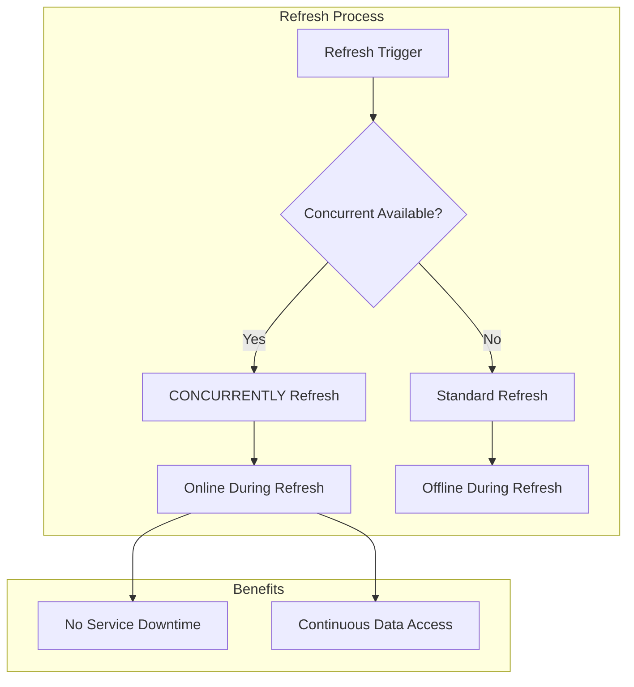

**Diagram sources**
- [20251117015024_d47b7ef9-be84-43eb-9ec4-b93c55d353e8.sql](file://supabase/migrations/20251117015024_d47b7ef9-be84-43eb-9ec4-b93c55d353e8.sql#L81-L91)

#### Indexing Strategy

The database employs a multi-layered indexing approach:

| Index Type | Purpose | Performance Impact |
|------------|---------|-------------------|
| Single-column | Fast individual queries | Linear scaling |
| Composite | Complex analytics | O(log n) complexity |
| Partial | Conditional filtering | Reduced storage overhead |
| Functional | Expression-based | Enhanced query flexibility |

**Section sources**
- [20251117015024_d47b7ef9-be84-43eb-9ec4-b93c55d353e8.sql](file://supabase/migrations/20251117015024_d47b7ef9-be84-43eb-9ec4-b93c55d353e8.sql#L29-L35)

## Business Intelligence

### Market Research Insights Integration

The analytics system feeds directly into business intelligence components like Market Research Insights:

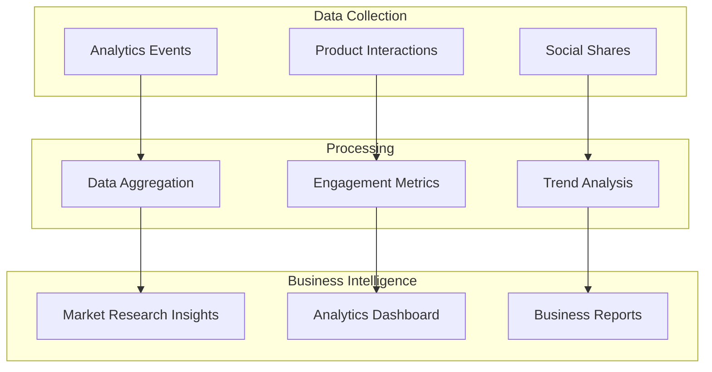

**Diagram sources**
- [MarketResearchInsights.tsx](file://src/components/quote/MarketResearchInsights.tsx#L1-L140)

#### Data-Driven Insights

The Market Research Insights component leverages analytics data to provide actionable business intelligence:

| Metric | Source | Business Value |
|--------|--------|----------------|
| Average Unit Cost | Product interaction data | Pricing strategy |
| Material Costs | Supply chain analytics | Cost optimization |
| Lead Times | Production tracking | Delivery planning |
| Market Markup | Competitor analysis | Profit margin analysis |

#### Confidence Scoring

The system implements confidence scoring for analytical results:

- **High Confidence**: ≥85% confidence score
- **Medium Confidence**: 70-84% confidence score  
- **Estimated**: <70% confidence score

**Section sources**
- [MarketResearchInsights.tsx](file://src/components/quote/MarketResearchInsights.tsx#L1-L140)

## Troubleshooting Guide

### Common Issues and Solutions

#### Edge Function Failures

**Issue**: Product interaction tracking fails silently
**Symptoms**: No data appearing in analytics
**Solution**: Check edge function logs for validation errors

**Diagnostic Steps**:
1. Verify request payload format
2. Check Supabase service role configuration
3. Review database connection status

#### Rate Limiting Issues

**Issue**: Social share tracking returns 429 errors
**Symptoms**: "Too many share requests" messages
**Solution**: Implement client-side rate limiting

**Implementation**:
```typescript
// Client-side rate limiting example
const lastShareTime = localStorage.getItem('lastShareTime');
const timeDiff = Date.now() - parseInt(lastShareTime || '0');
if (timeDiff < 3600000) { // 1 hour
  console.warn('Rate limit exceeded');
  return;
}
localStorage.setItem('lastShareTime', Date.now().toString());
```

#### Database Performance Issues

**Issue**: Slow analytics queries on large datasets
**Symptoms**: Timeout errors, slow dashboard loading
**Solution**: Optimize materialized view refresh strategy

**Optimization Strategies**:
- Increase refresh frequency during peak hours
- Implement partial refreshes for recent data
- Monitor index effectiveness

### Monitoring and Debugging

#### Logging Configuration

Enable comprehensive logging for troubleshooting:

```typescript
// Enable debug logging
console.log('[Analytics] Tracking event:', {
  productId,
  interactionType,
  sessionId,
  timestamp: new Date().toISOString()
});
```

#### Health Checks

Implement health checks for critical components:

- **Edge Function Availability**: Monitor function response times
- **Database Connectivity**: Check connection pool status
- **Materialized View Freshness**: Verify refresh intervals

**Section sources**
- [track-product-interaction/index.ts](file://supabase/functions/track-product-interaction/index.ts#L120-L135)
- [track-social-share/index.ts](file://supabase/functions/track-social-share/index.ts#L65-L71)

## Best Practices

### Implementation Guidelines

#### Event Naming Conventions

Follow consistent naming patterns for analytics events:

- **Product Interactions**: `product_${interactionType}`
- **Social Sharing**: `share_${platform}`
- **User Actions**: `user_${action}_${context}`

#### Data Validation

Implement comprehensive input validation:

```typescript
// Example validation pattern
const validateInteraction = (data: any) => {
  if (!data.productId || !isValidUUID(data.productId)) {
    throw new Error('Invalid product ID');
  }
  if (!VALID_INTERACTION_TYPES.includes(data.interactionType)) {
    throw new Error('Invalid interaction type');
  }
};
```

#### Privacy Compliance

Ensure compliance with privacy regulations:

- **GDPR**: Implement data retention policies
- **CCPA**: Provide opt-out mechanisms
- **Consent Management**: Track user consent preferences

### Performance Optimization

#### Client-Side Optimization

- **Debouncing**: Implement debouncing for rapid events
- **Batch Processing**: Group multiple events for efficiency
- **Local Caching**: Cache frequently accessed data

#### Server-Side Optimization

- **Connection Pooling**: Optimize database connections
- **Index Maintenance**: Regular index optimization
- **Query Optimization**: Monitor and optimize slow queries

### Security Considerations

#### Access Control

- **Principle of Least Privilege**: Grant minimal necessary permissions
- **Role-Based Access**: Implement fine-grained role-based access control
- **Audit Logging**: Maintain comprehensive audit trails

#### Data Protection

- **Encryption**: Encrypt sensitive data at rest and in transit
- **Anonymization**: Anonymize personally identifiable information
- **Retention Policies**: Implement automated data cleanup

**Section sources**
- [track-product-interaction/index.ts](file://supabase/functions/track-product-interaction/index.ts#L43-L67)
- [track-social-share/index.ts](file://supabase/functions/track-social-share/index.ts#L21-L35)