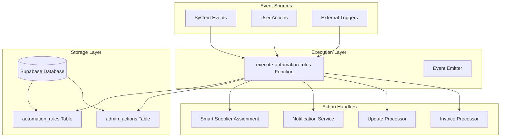
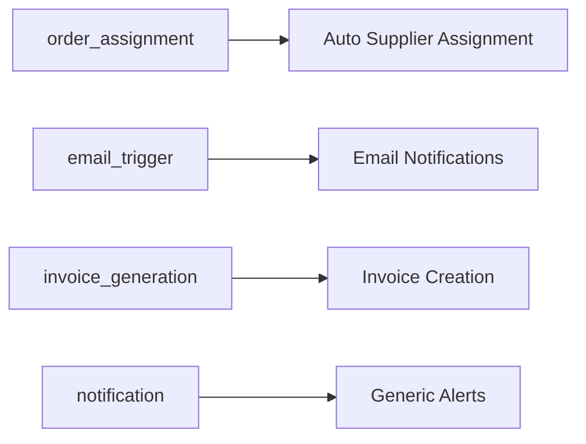
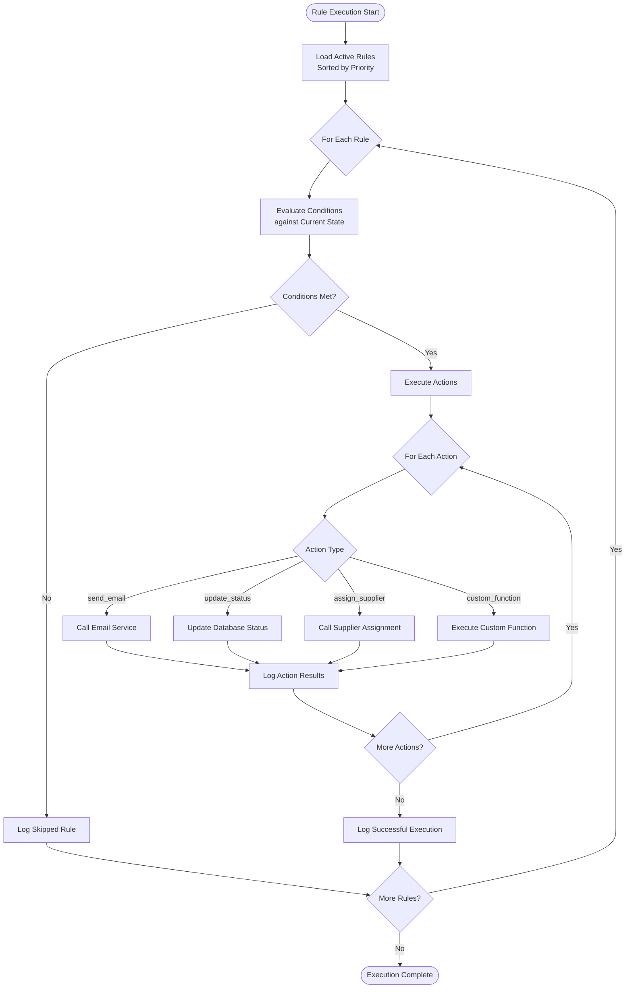
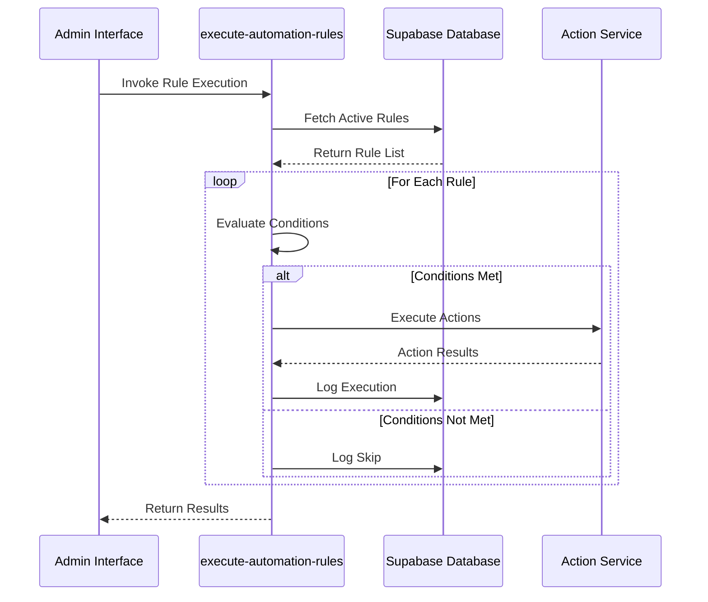
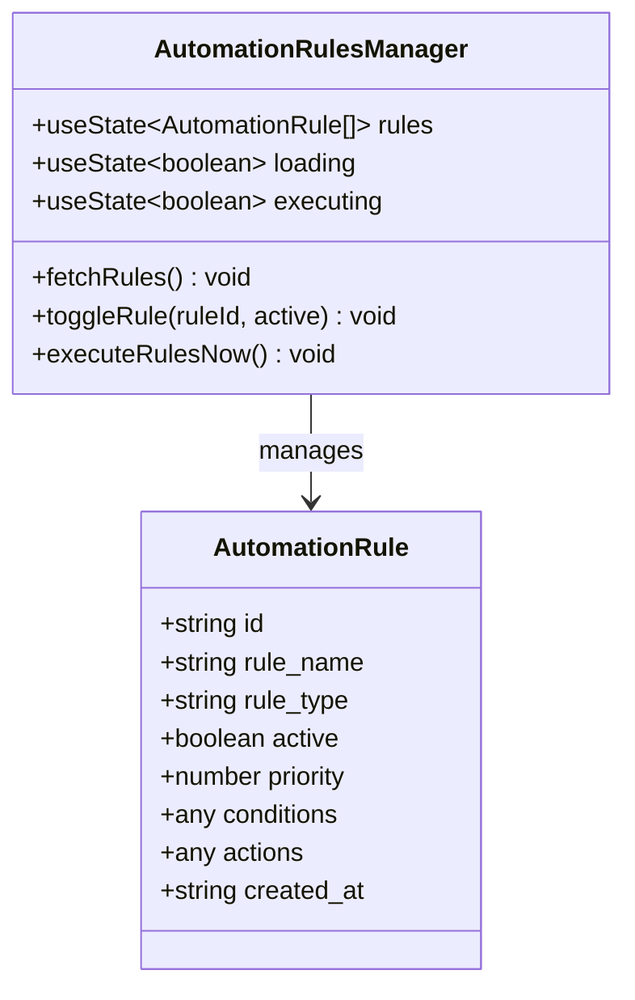
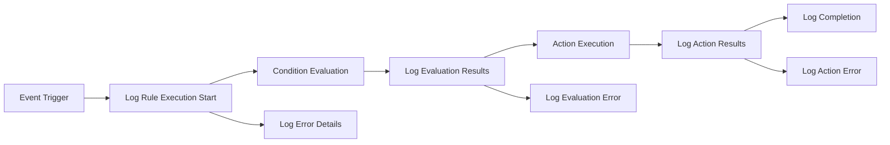
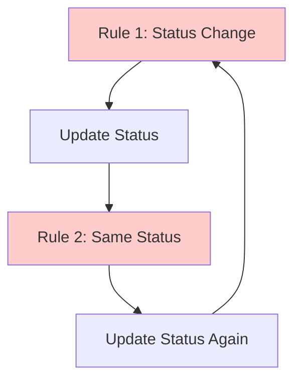

# Automation Rules Engine

<cite>
**Referenced Files in This Document**
- [supabase/functions/execute-automation-rules/index.ts](file://supabase/functions/execute-automation-rules/index.ts)
- [src/components/admin/AutomationRulesManager.tsx](file://src/components/admin/AutomationRulesManager.tsx)
- [supabase/COMPLETE_SETUP.sql](file://supabase/COMPLETE_SETUP.sql)
- [supabase/migrations/20251120233928_2016afb8-d720-4858-9e12-7fb4ebbd5de0.sql](file://supabase/migrations/20251120233928_2016afb8-d720-4858-9e12-7fb4ebbd5de0.sql)
- [src/integrations/supabase/types.ts](file://src/integrations/supabase/types.ts)
- [src/types/database.ts](file://src/types/database.ts)
- [src/components/admin/SmartSupplierAssignment.tsx](file://src/components/admin/SmartSupplierAssignment.tsx)
- [supabase/functions/batch-processor/index.ts](file://supabase/functions/batch-processor/index.ts)
</cite>

## Table of Contents
1. [Introduction](#introduction)
2. [System Architecture](#system-architecture)
3. [Database Schema](#database-schema)
4. [Rule Definition Schema](#rule-definition-schema)
5. [Condition Evaluation Logic](#condition-evaluation-logic)
6. [Action Execution Pipeline](#action-execution-pipeline)
7. [Admin Interface](#admin-interface)
8. [Security and Access Control](#security-and-access-control)
9. [Performance Optimization](#performance-optimization)
10. [Debugging and Monitoring](#debugging-and-monitoring)
11. [Common Automation Scenarios](#common-automation-scenarios)
12. [Best Practices](#best-practices)

## Introduction

The Automation Rules Engine in sleekapp-v100 is a sophisticated system that applies configurable business rules to system events, enabling automated workflows across the platform. Built on Supabase's serverless architecture, it provides real-time event-driven automation for critical business processes such as supplier assignment, notification triggering, and workflow orchestration.

The engine operates through a declarative rule system where administrators can define conditions and corresponding actions that execute automatically when specific events occur. This approach enables rapid business process adaptation without requiring code changes or system downtime.

## System Architecture

The automation rules engine follows a serverless architecture pattern with clear separation of concerns:



**Diagram sources**
- [supabase/functions/execute-automation-rules/index.ts](file://supabase/functions/execute-automation-rules/index.ts#L1-L169)
- [supabase/migrations/20251120233928_2016afb8-d720-4858-9e12-7fb4ebbd5de0.sql](file://supabase/migrations/20251120233928_2016afb8-d720-4858-9e12-7fb4ebbd5de0.sql#L103-L114)

**Section sources**
- [supabase/functions/execute-automation-rules/index.ts](file://supabase/functions/execute-automation-rules/index.ts#L1-L169)

## Database Schema

The automation rules engine relies on two primary database tables that provide the foundation for rule storage and execution tracking:

### Automation Rules Table

The `automation_rules` table stores the core rule definitions with JSONB fields for flexible condition and action specifications:

| Column | Type | Description | Constraints |
|--------|------|-------------|-------------|
| `id` | UUID | Primary key with default random UUID | PRIMARY KEY |
| `rule_name` | TEXT | Human-readable rule identifier | NOT NULL |
| `rule_type` | TEXT | Rule category/type | NOT NULL, CHECK (rule_type IN (...)) |
| `conditions` | JSONB | Condition evaluation criteria | NOT NULL |
| `actions` | JSONB | Action definitions to execute | NOT NULL |
| `active` | BOOLEAN | Rule activation status | DEFAULT TRUE |
| `priority` | INTEGER | Execution priority (higher executes first) | DEFAULT 0 |
| `created_at` | TIMESTAMPTZ | Rule creation timestamp | DEFAULT NOW() |
| `updated_at` | TIMESTAMPTZ | Last modification timestamp | DEFAULT NOW() |

### Admin Actions Table

The `admin_actions` table tracks rule executions and administrative activities:

| Column | Type | Description | Constraints |
|--------|------|-------------|-------------|
| `id` | UUID | Primary key with default random UUID | PRIMARY KEY |
| `admin_id` | UUID | Reference to admin user | FOREIGN KEY |
| `action_type` | TEXT | Type of action performed | NOT NULL |
| `entity_type` | TEXT | Associated entity type | NOT NULL |
| `entity_id` | UUID | Associated entity identifier | NULLABLE |
| `details` | JSONB | Action-specific details | NULLABLE |
| `ip_address` | TEXT | Source IP address | NULLABLE |
| `created_at` | TIMESTAMPTZ | Action timestamp | DEFAULT NOW() |

**Section sources**
- [supabase/migrations/20251120233928_2016afb8-d720-4858-9e12-7fb4ebbd5de0.sql](file://supabase/migrations/20251120233928_2016afb8-d720-4858-9e12-7fb4ebbd5de0.sql#L103-L114)
- [supabase/migrations/20251120233928_2016afb8-d720-4858-9e12-7fb4ebbd5de0.sql](file://supabase/migrations/20251120233928_2016afb8-d720-4858-9e12-7fb4ebbd5de0.sql#L118-L127)

## Rule Definition Schema

### Rule Types

The system supports four primary rule types, each designed for specific automation scenarios:



**Diagram sources**
- [supabase/migrations/20251120233928_2016afb8-d720-4858-9e12-7fb4ebbd5de0.sql](file://supabase/migrations/20251120233928_2016afb8-d720-4858-9e12-7fb4ebbd5de0.sql#L107)

### Condition Schema

Conditions are defined using JSONB structures that support complex logical evaluations:

```typescript
interface Condition {
  product_type?: string;
  quantity_greater_than?: number;
  quantity_less_than?: number;
  order_value_greater_than?: number;
  workflow_status?: string;
  supplier_capacity_available?: boolean;
  lead_time_exceeds?: number;
  priority?: string;
  created_before?: string;
  created_after?: string;
}
```

### Action Schema

Actions define what happens when conditions are met:

```typescript
interface Action {
  type: 'send_email' | 'update_status' | 'assign_supplier' | 'custom_function';
  params: {
    // Email action parameters
    template?: string;
    recipients?: string[];
    subject?: string;
    body?: string;
    
    // Status update parameters
    table?: string;
    id?: string;
    new_status?: string;
    
    // Supplier assignment parameters
    order_id?: string;
    product_type?: string;
    quantity?: number;
    
    // Custom function parameters
    function_name?: string;
    arguments?: Record<string, any>;
  };
}
```

**Section sources**
- [supabase/functions/execute-automation-rules/index.ts](file://supabase/functions/execute-automation-rules/index.ts#L125-L169)

## Condition Evaluation Logic

The condition evaluation system currently implements placeholder logic but is designed to support sophisticated business rule evaluation:



**Diagram sources**
- [supabase/functions/execute-automation-rules/index.ts](file://supabase/functions/execute-automation-rules/index.ts#L68-L110)

**Section sources**
- [supabase/functions/execute-automation-rules/index.ts](file://supabase/functions/execute-automation-rules/index.ts#L125-L130)

## Action Execution Pipeline

The action execution pipeline processes rule actions through a modular system:

### Supported Action Types

1. **Email Notifications**: Sends templated emails to specified recipients
2. **Status Updates**: Updates database records with new status values
3. **Supplier Assignment**: Calls the smart supplier assignment system
4. **Custom Functions**: Executes registered serverless functions

### Transaction Patterns

The system ensures atomicity through careful transaction management:



**Diagram sources**
- [supabase/functions/execute-automation-rules/index.ts](file://supabase/functions/execute-automation-rules/index.ts#L68-L110)

**Section sources**
- [supabase/functions/execute-automation-rules/index.ts](file://supabase/functions/execute-automation-rules/index.ts#L132-L169)

## Admin Interface

The Automation Rules Manager provides a comprehensive interface for rule administration:

### Key Features

- **Rule Listing**: Displays all automation rules with status indicators
- **Activation Control**: Toggle rules on/off without deletion
- **Immediate Execution**: Execute rules manually for testing
- **Visual Editing**: JSON-based condition and action editing
- **Priority Management**: Configure execution order

### User Interface Components



**Diagram sources**
- [src/components/admin/AutomationRulesManager.tsx](file://src/components/admin/AutomationRulesManager.tsx#L10-L19)

**Section sources**
- [src/components/admin/AutomationRulesManager.tsx](file://src/components/admin/AutomationRulesManager.tsx#L1-L165)

## Security and Access Control

### Row Level Security (RLS) Policies

The system implements comprehensive RLS policies to ensure data isolation:

| Policy | Scope | Permissions |
|--------|-------|-------------|
| Admin Rule Management | automation_rules | ALL for admins only |
| Admin Action Viewing | admin_actions | SELECT for admins only |
| System Logging | admin_actions | INSERT for system only |

### Authentication Requirements

- **Function Authentication**: Requires valid JWT token
- **Admin Role Verification**: Validates admin privileges
- **Service Role Access**: Uses service role keys for internal operations

### Data Protection Measures

- **Token Validation**: Comprehensive JWT verification
- **Role-Based Access**: Fine-grained permission checking
- **Audit Logging**: Complete action tracking
- **Secure Function Deployment**: Isolated serverless function execution

**Section sources**
- [supabase/COMPLETE_SETUP.sql](file://supabase/COMPLETE_SETUP.sql#L6946-L6955)
- [supabase/functions/execute-automation-rules/index.ts](file://supabase/functions/execute-automation-rules/index.ts#L20-L47)

## Performance Optimization

### Scalability Considerations

The automation rules engine is designed for high-frequency event processing:

#### Filtering Strategies

- **Active Rule Filtering**: Only processes enabled rules
- **Priority Sorting**: Higher priority rules execute first
- **Index Utilization**: Strategic indexing on active rules and timestamps

#### Performance Metrics

| Metric | Optimization Strategy |
|--------|----------------------|
| Rule Evaluation | Parallel processing potential |
| Condition Matching | JSONB indexing support |
| Action Execution | Asynchronous processing |
| Database Queries | Minimal query overhead |

### High-Frequency Event Handling

For systems experiencing high event volumes:

1. **Batch Processing**: Group related events for efficient processing
2. **Rate Limiting**: Prevent system overload during peak periods
3. **Caching**: Store frequently accessed rule configurations
4. **Async Execution**: Non-blocking action processing

**Section sources**
- [supabase/functions/execute-automation-rules/index.ts](file://supabase/functions/execute-automation-rules/index.ts#L56-L60)

## Debugging and Monitoring

### Structured Logging

The system provides comprehensive logging for debugging and monitoring:



**Diagram sources**
- [supabase/functions/execute-automation-rules/index.ts](file://supabase/functions/execute-automation-rules/index.ts#L53-L110)

### Monitoring Capabilities

- **Execution Tracking**: Complete rule execution history
- **Performance Metrics**: Response times and throughput
- **Error Reporting**: Detailed error logging with stack traces
- **Audit Trails**: Administrative action logging

### Debugging Workflows

1. **Rule Testing**: Manual execution capability
2. **Condition Validation**: Real-time condition evaluation feedback
3. **Action Verification**: Immediate action result confirmation
4. **Error Resolution**: Comprehensive error reporting

**Section sources**
- [supabase/functions/execute-automation-rules/index.ts](file://supabase/functions/execute-automation-rules/index.ts#L101-L109)

## Common Automation Scenarios

### Auto-Assign Supplier Based on Capacity

```json
{
  "rule_name": "High Demand Supplier Assignment",
  "rule_type": "order_assignment",
  "conditions": {
    "quantity_greater_than": 1000,
    "supplier_capacity_available": true,
    "priority": "high"
  },
  "actions": [
    {
      "type": "assign_supplier",
      "params": {
        "order_id": "{{order.id}}",
        "product_type": "{{order.product_type}}",
        "quantity": "{{order.quantity}}"
      }
    }
  ]
}
```

### Production Delay Notifications

```json
{
  "rule_name": "Production Delay Alert",
  "rule_type": "notification",
  "conditions": {
    "workflow_status": "in_production",
    "estimated_completion": {
      "days_late": {
        "greater_than": 3
      }
    }
  },
  "actions": [
    {
      "type": "send_email",
      "params": {
        "template": "production_delay",
        "recipients": ["{{order.buyer_id}}"],
        "subject": "Production Delay Notification"
      }
    }
  ]
}
```

### Batch Completion Automation

Based on the batch processor functionality, rules can automate batch management:

```json
{
  "rule_name": "Batch Fill Completion",
  "rule_type": "order_assignment",
  "conditions": {
    "fill_percentage": {
      "greater_than": 75
    },
    "batch_status": "filling"
  },
  "actions": [
    {
      "type": "update_status",
      "params": {
        "table": "production_batches",
        "id": "{{batch.id}}",
        "new_status": "confirmed"
      }
    }
  ]
}
```

**Section sources**
- [supabase/functions/batch-processor/index.ts](file://supabase/functions/batch-processor/index.ts#L118-L156)
- [src/components/admin/SmartSupplierAssignment.tsx](file://src/components/admin/SmartSupplierAssignment.tsx#L1-L39)

## Best Practices

### Rule Design Principles

1. **Single Responsibility**: Each rule should have one clear purpose
2. **Clear Naming**: Use descriptive rule names that indicate purpose
3. **Priority Planning**: Set appropriate priorities for execution order
4. **Testing**: Always test rules with manual execution before activation

### Avoiding Circular Triggers

Circular rule triggers can cause infinite loops:



**Avoidance Strategies:**
- Implement state change detection
- Use conditional logic to prevent redundant actions
- Monitor execution logs for unexpected patterns

### Configuration Guidelines

1. **Modular Design**: Break complex rules into smaller, manageable pieces
2. **Parameterization**: Use dynamic parameters instead of hard-coded values
3. **Documentation**: Comment complex conditions and actions
4. **Version Control**: Track rule changes and maintain rollback capabilities

### Performance Optimization

- **Index Strategy**: Ensure proper indexing on frequently queried fields
- **Rule Ordering**: Place most frequently used rules at higher priority
- **Conditional Efficiency**: Use the most selective conditions first
- **Resource Management**: Monitor function execution limits and optimize accordingly

### Security Considerations

- **Principle of Least Privilege**: Grant minimal necessary permissions
- **Input Validation**: Validate all rule parameters and conditions
- **Audit Trails**: Maintain comprehensive logging for security reviews
- **Regular Security Reviews**: Periodically assess rule security implications