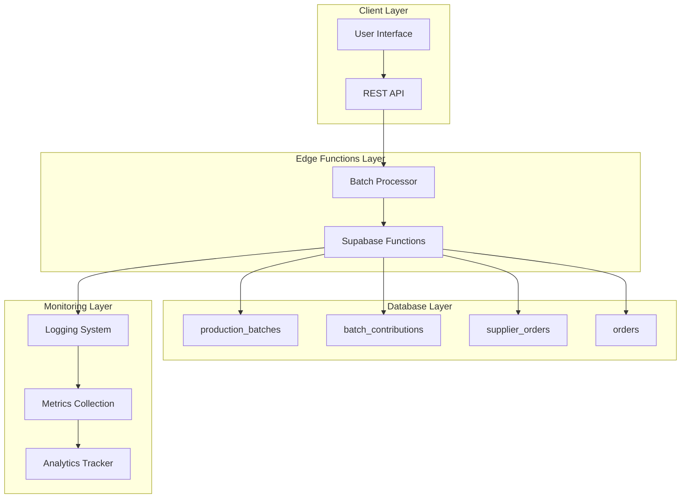
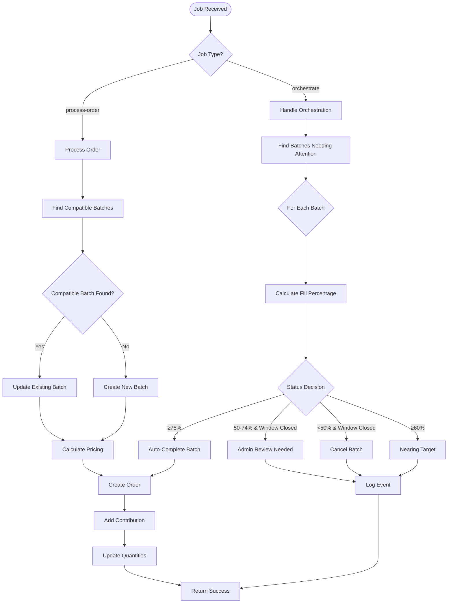
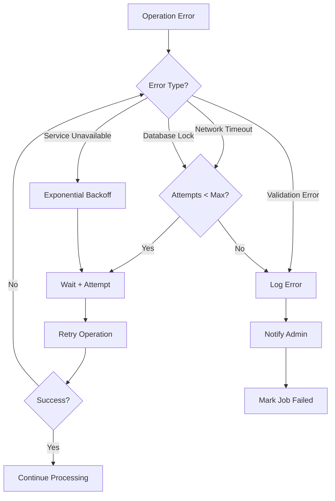
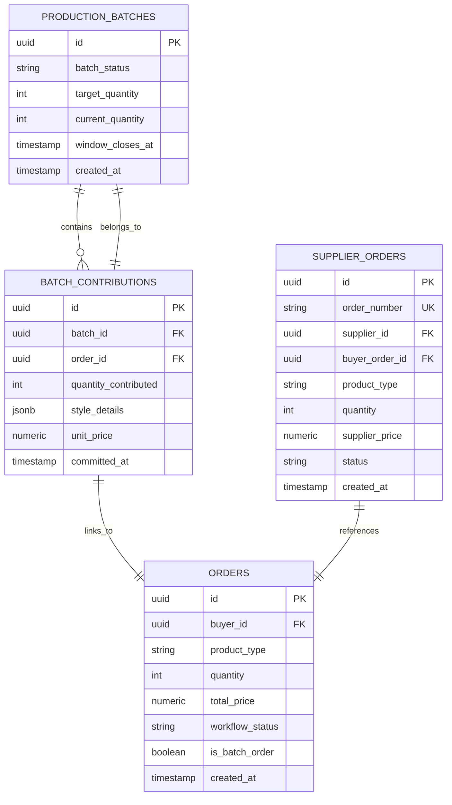
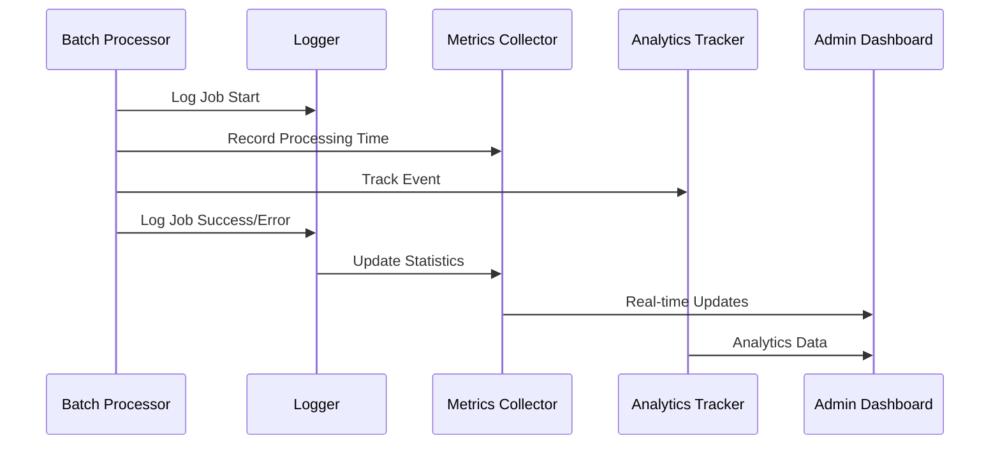
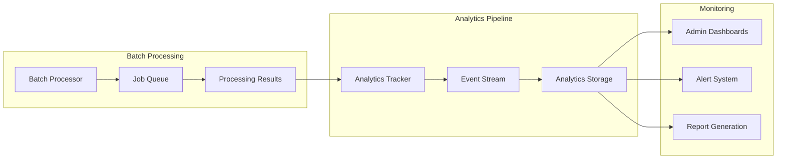

# Batch Processing System

<cite>
**Referenced Files in This Document**
- [supabase/functions/batch-processor/index.ts](file://supabase/functions/batch-processor/index.ts)
- [src/lib/analytics/tracker.ts](file://src/lib/analytics/tracker.ts)
- [src/hooks/useAggregation.ts](file://src/hooks/useAggregation.ts)
- [supabase/migrations/20251115150759_remix_migration_from_pg_dump.sql](file://supabase/migrations/20251115150759_remix_migration_from_pg_dump.sql)
- [supabase/FIXED_SETUP_PART1.sql](file://supabase/FIXED_SETUP_PART1.sql)
- [supabase/COMPLETE_SETUP.sql](file://supabase/COMPLETE_SETUP.sql)
- [src/components/admin/RateLimitMonitoringDashboard.tsx](file://src/components/admin/RateLimitMonitoringDashboard.tsx)
- [src/components/supplier/SupplierPerformanceMetrics.tsx](file://src/components/supplier/SupplierPerformanceMetrics.tsx)
</cite>

## Table of Contents
1. [Introduction](#introduction)
2. [System Architecture](#system-architecture)
3. [Job Queue Management](#job-queue-management)
4. [Core Processing Functions](#core-processing-functions)
5. [Error Handling and Retry Logic](#error-handling-and-retry-logic)
6. [Transaction Isolation and Idempotency](#transaction-isolation-and-idempotency)
7. [Performance Optimization](#performance-optimization)
8. [Monitoring and Analytics](#monitoring-and-analytics)
9. [Real-World Use Cases](#real-world-use-cases)
10. [Integration with Analytics System](#integration-with-analytics-system)
11. [Best Practices and Recommendations](#best-practices-and-recommendations)

## Introduction

The batch-processor function in sleekapp-v100 serves as the central orchestrator for handling bulk operations that drive the platform's production workflow. Built on Supabase Edge Functions, it manages complex supply chain operations including report generation, data synchronization, and scheduled maintenance tasks through a sophisticated job queuing mechanism.

The system handles two primary job types: **orchestration** for managing production batches and **order processing** for aggregating individual orders into efficient production runs. This architecture enables scalable, reliable bulk operations while maintaining data consistency and providing comprehensive monitoring capabilities.

## System Architecture

The batch processing system follows a serverless architecture leveraging Supabase Edge Functions for scalability and reliability. The core components work together to provide a robust foundation for bulk operations.

**Diagram sources**
- [supabase/functions/batch-processor/index.ts](file://supabase/functions/batch-processor/index.ts#L1-L56)
- [src/lib/analytics/tracker.ts](file://src/lib/analytics/tracker.ts#L1-L103)

**Section sources**
- [supabase/functions/batch-processor/index.ts](file://supabase/functions/batch-processor/index.ts#L1-L56)

## Job Queue Management

The batch-processor utilizes Supabase database tables to implement a robust job queue system that manages both orchestration and order processing tasks.

### Database Schema Design

The system relies on several key database tables for job management:

| Table | Purpose | Key Fields |
|-------|---------|------------|
| `production_batches` | Stores batch information and status | `id`, `batch_status`, `target_quantity`, `current_quantity`, `window_closes_at` |
| `batch_contributions` | Links orders to batches | `batch_id`, `order_id`, `quantity_contributed`, `style_details` |
| `supplier_orders` | Manages supplier purchase orders | `order_number`, `supplier_id`, `quantity`, `status` |
| `orders` | Individual customer orders | `workflow_status`, `is_batch_order` |

### Job Types and Processing Logic

The system supports two primary job types with distinct processing mechanisms:

**Diagram sources**
- [supabase/functions/batch-processor/index.ts](file://supabase/functions/batch-processor/index.ts#L58-L175)
- [supabase/functions/batch-processor/index.ts](file://supabase/functions/batch-processor/index.ts#L178-L343)

**Section sources**
- [supabase/functions/batch-processor/index.ts](file://supabase/functions/batch-processor/index.ts#L58-L175)
- [supabase/functions/batch-processor/index.ts](file://supabase/functions/batch-processor/index.ts#L178-L343)

## Core Processing Functions

### Orchestration Function

The orchestration function manages production batch lifecycle through intelligent status transitions based on fill percentages and timing constraints.

#### Key Features:
- **Automated Batch Completion**: Batches reaching 75% fill automatically transition to confirmed status
- **Window Management**: Handles batches approaching deadline with different strategies
- **Admin Intervention**: Flags batches requiring manual review (50-74% filled with closed window)
- **Cancellation Logic**: Cancels underfilled batches (<50%) with automatic order refunds

#### Status Transition Logic:
- **≥75% Fill**: Auto-complete → Create supplier order → Update batch status
- **50-74% Fill**: Log for admin review → No automatic action
- **<50% Fill**: Cancel batch → Refund all contributing orders
- **≥60% Fill**: Monitor closely → Potential promotion triggers

### Order Processing Function

The order processing function aggregates individual orders into production batches using sophisticated matching algorithms.

#### Processing Stages:
1. **Compatibility Checking**: Validates product category, style count, and quantity constraints
2. **Supplier Matching**: Identifies optimal suppliers based on MOQ and pricing
3. **Pricing Calculation**: Computes final prices using the pricing calculator function
4. **Order Creation**: Creates individual orders linked to the batch
5. **Contribution Recording**: Updates batch contributions and quantities

**Section sources**
- [supabase/functions/batch-processor/index.ts](file://supabase/functions/batch-processor/index.ts#L58-L175)
- [supabase/functions/batch-processor/index.ts](file://supabase/functions/batch-processor/index.ts#L178-L343)

## Error Handling and Retry Logic

The batch-processor implements comprehensive error handling with exponential backoff retry mechanisms to ensure reliable operation under various failure conditions.

### Error Recovery Strategy

### Implementation Details:

The system implements several error handling patterns:

- **Exponential Backoff**: Uses `1000 * attempt` delay pattern for retry intervals
- **Max Retries**: Configurable maximum retry attempts (typically 3-5)
- **Idempotent Operations**: Ensures operations can be safely retried
- **Error Classification**: Distinguishes between retryable and fatal errors

**Section sources**
- [supabase/functions/send-otp/index.ts](file://supabase/functions/send-otp/index.ts#L113-L149)

## Transaction Isolation and Idempotency

### Database Transaction Management

The batch-processor ensures data consistency through careful transaction management and idempotency guarantees.

#### Transaction Patterns:
- **Atomic Updates**: Critical operations use atomic database transactions
- **Foreign Key Constraints**: Enforces referential integrity between tables
- **Cascade Deletion**: Maintains data consistency during batch cancellations

#### Idempotency Mechanisms:
- **Unique Identifiers**: Uses UUIDs for all primary keys
- **Conditional Updates**: Employs `eq()` clauses for targeted updates
- **State Validation**: Verifies current state before applying changes
- **Duplicate Prevention**: Implements checks to prevent duplicate processing

### Foreign Key Relationships

**Diagram sources**
- [supabase/migrations/20251115150759_remix_migration_from_pg_dump.sql](file://supabase/migrations/20251115150759_remix_migration_from_pg_dump.sql#L1407-L1434)
- [supabase/migrations/20251115150759_remix_migration_from_pg_dump.sql](file://supabase/migrations/20251115150759_remix_migration_from_pg_dump.sql#L1724-L1751)

**Section sources**
- [supabase/migrations/20251115150759_remix_migration_from_pg_dump.sql](file://supabase/migrations/20251115150759_remix_migration_from_pg_dump.sql#L1407-L1434)
- [supabase/migrations/20251115150759_remix_migration_from_pg_dump.sql](file://supabase/migrations/20251115150759_remix_migration_from_pg_dump.sql#L1724-L1751)

## Performance Optimization

### Parallel Execution Limits

The system implements several performance optimization strategies to handle large-scale batch operations efficiently.

#### Chunked Processing Approach:
- **Batch Size Optimization**: Processes batches in manageable chunks to prevent timeouts
- **Memory Management**: Limits concurrent operations to prevent memory exhaustion
- **Resource Pooling**: Reuses database connections and function instances

#### Performance Metrics Monitoring:

| Metric | Purpose | Implementation |
|--------|---------|----------------|
| Processing Time | Track job completion speed | Console timestamps |
| Memory Usage | Monitor resource consumption | Runtime profiling |
| Error Rate | Measure reliability | Success/failure ratios |
| Throughput | Track processing capacity | Jobs per minute |

### Memory Management Strategies

- **Streaming Processing**: Processes large datasets in chunks rather than loading entirely into memory
- **Connection Pooling**: Reuses database connections across function invocations
- **Garbage Collection**: Explicit cleanup of temporary objects and closures

**Section sources**
- [src/components/admin/RateLimitMonitoringDashboard.tsx](file://src/components/admin/RateLimitMonitoringDashboard.tsx#L34-L66)

## Monitoring and Analytics

### Logging and Completion Rate Metrics

The batch-processor integrates with the analytics system to provide comprehensive monitoring capabilities.

#### Logging Implementation:
- **Structured Logging**: Consistent log format with severity levels
- **Correlation IDs**: Tracks operations across function boundaries
- **Performance Metrics**: Records timing and resource usage data

#### Completion Rate Tracking:
- **Success Rates**: Monitors successful vs. failed job completions
- **Processing Times**: Tracks average and peak processing durations
- **Error Patterns**: Identifies recurring failure scenarios

### Analytics Integration

**Diagram sources**
- [src/lib/analytics/tracker.ts](file://src/lib/analytics/tracker.ts#L23-L103)
- [src/components/admin/RateLimitMonitoringDashboard.tsx](file://src/components/admin/RateLimitMonitoringDashboard.tsx#L34-L66)

**Section sources**
- [src/lib/analytics/tracker.ts](file://src/lib/analytics/tracker.ts#L23-L103)
- [src/components/admin/RateLimitMonitoringDashboard.tsx](file://src/components/admin/RateLimitMonitoringDashboard.tsx#L34-L66)

## Real-World Use Cases

### Daily Analytics Aggregation

The batch-processor handles daily analytics aggregation by processing large volumes of transaction data through optimized batch operations.

#### Implementation Example:
- **Data Volume**: Processes millions of order records daily
- **Processing Window**: Executes during off-peak hours (2 AM - 4 AM)
- **Output Generation**: Creates comprehensive reports for business intelligence
- **Performance Target**: Completes processing within 30 minutes

### Supplier Performance Batch Updates

The system manages supplier performance metrics through automated batch updates that aggregate data from multiple sources.

#### Key Features:
- **Real-time Updates**: Processes supplier performance data as it becomes available
- **Historical Analysis**: Maintains long-term performance trends
- **Threshold Monitoring**: Alerts when performance metrics exceed thresholds
- **Quality Assurance**: Validates data integrity before updates

### Report Generation Workflows

The batch-processor orchestrates complex report generation workflows involving multiple data sources and processing steps.

#### Workflow Components:
- **Data Extraction**: Retrieves raw data from operational systems
- **Transformation**: Applies business logic and calculations
- **Aggregation**: Combines data across multiple dimensions
- **Output Formatting**: Generates reports in various formats (PDF, Excel, CSV)

**Section sources**
- [src/components/supplier/SupplierPerformanceMetrics.tsx](file://src/components/supplier/SupplierPerformanceMetrics.tsx#L1-L50)

## Integration with Analytics System

### Event Tracking Integration

The batch-processor seamlessly integrates with the analytics tracking system to provide comprehensive visibility into batch processing operations.

#### Tracking Events:
- **Job Completion**: Logs successful job completions with timing metrics
- **Error Conditions**: Records error occurrences with detailed context
- **Performance Metrics**: Captures processing times and resource utilization
- **Business KPIs**: Tracks key performance indicators for batch operations

### Data Flow Architecture

**Diagram sources**
- [src/lib/analytics/tracker.ts](file://src/lib/analytics/tracker.ts#L23-L103)
- [src/hooks/useAggregation.ts](file://src/hooks/useAggregation.ts#L1-L143)

**Section sources**
- [src/lib/analytics/tracker.ts](file://src/lib/analytics/tracker.ts#L23-L103)
- [src/hooks/useAggregation.ts](file://src/hooks/useAggregation.ts#L1-L143)

## Best Practices and Recommendations

### Development Guidelines

1. **Idempotency Design**: Ensure all operations can be safely retried
2. **Error Handling**: Implement comprehensive error catching and logging
3. **Performance Testing**: Regular load testing with realistic data volumes
4. **Monitoring Setup**: Establish comprehensive monitoring and alerting

### Operational Recommendations

1. **Resource Planning**: Monitor memory and CPU usage during peak processing
2. **Backup Strategies**: Implement data backup procedures for critical batch operations
3. **Rollback Procedures**: Maintain ability to revert batch processing changes
4. **Capacity Planning**: Plan for seasonal processing volume increases

### Security Considerations

1. **Access Control**: Implement proper RBAC for batch processing functions
2. **Data Protection**: Ensure sensitive data is properly encrypted and protected
3. **Audit Trails**: Maintain comprehensive audit logs for all batch operations
4. **Rate Limiting**: Implement appropriate rate limiting to prevent abuse

### Maintenance Procedures

1. **Regular Monitoring**: Establish baseline performance metrics
2. **Incident Response**: Develop procedures for handling processing failures
3. **System Updates**: Plan maintenance windows during low-activity periods
4. **Documentation**: Maintain up-to-date documentation for all batch processing workflows