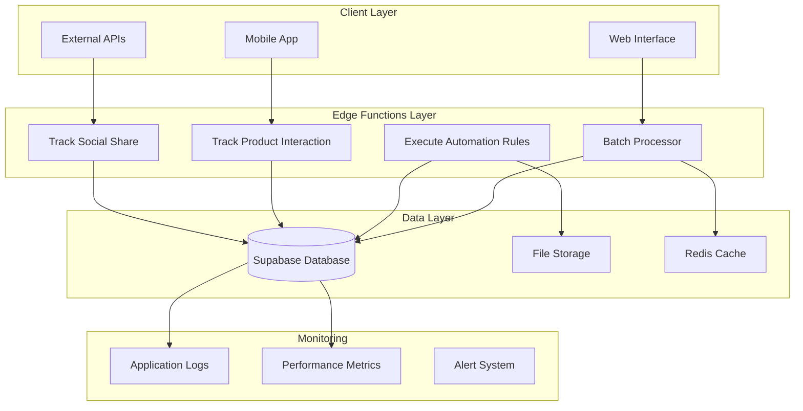
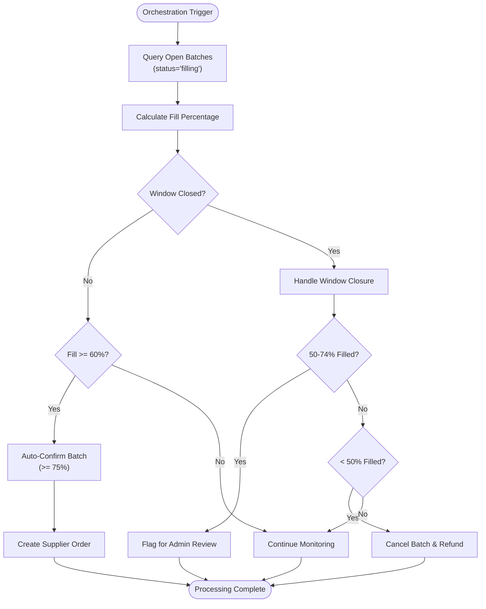
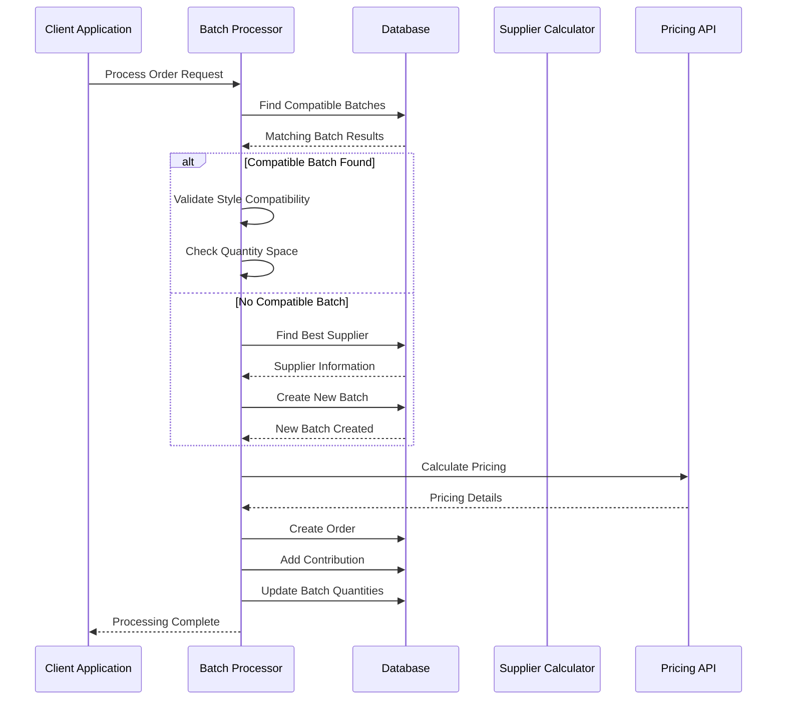
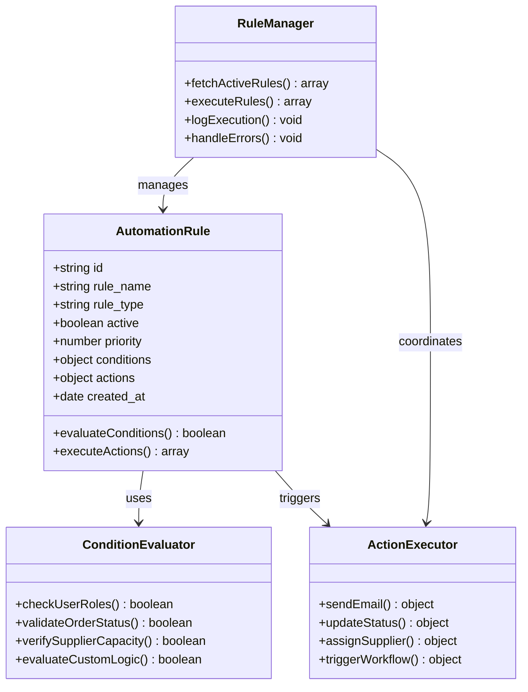
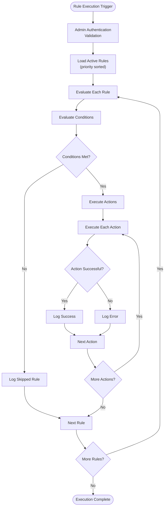
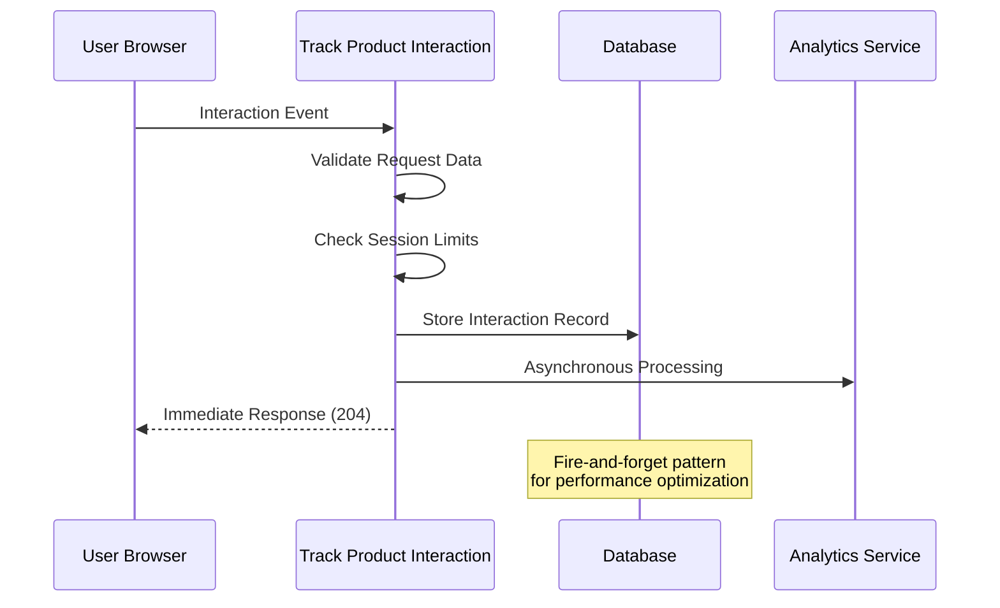
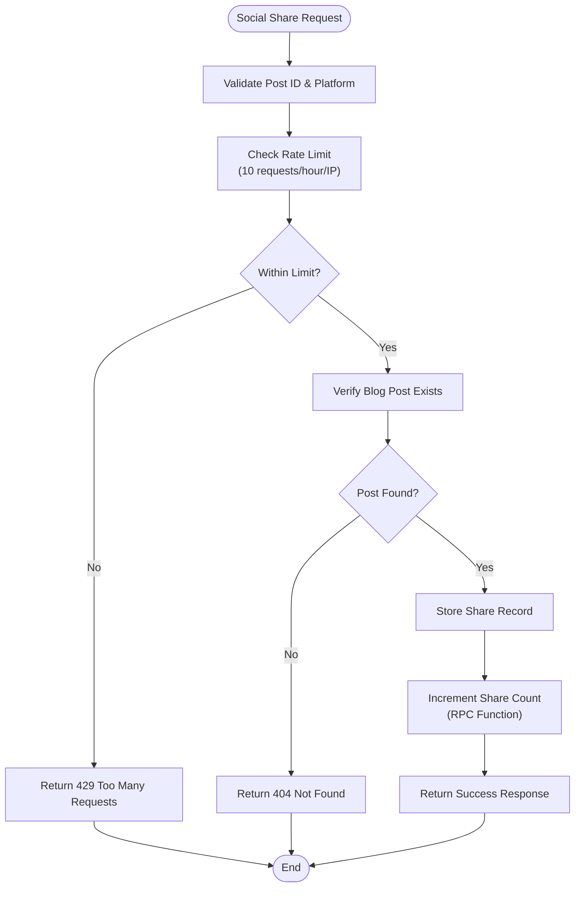

# Data Processing and Automation Functions

<cite>
**Referenced Files in This Document**
- [batch-processor/index.ts](file://supabase/functions/batch-processor/index.ts)
- [execute-automation-rules/index.ts](file://supabase/functions/execute-automation-rules/index.ts)
- [track-product-interaction/index.ts](file://supabase/functions/track-product-interaction/index.ts)
- [track-social-share/index.ts](file://supabase/functions/track-social-share/index.ts)
- [AutomationRulesManager.tsx](file://src/components/admin/AutomationRulesManager.tsx)
- [20251115150759_remix_migration_from_pg_dump.sql](file://supabase/migrations/20251115150759_remix_migration_from_pg_dump.sql)
- [BASE_MIGRATION_SAFE.sql](file://supabase/BASE_MIGRATION_SAFE.sql)
- [seed.sql](file://supabase/seed.sql)
</cite>

## Table of Contents
1. [Introduction](#introduction)
2. [System Architecture Overview](#system-architecture-overview)
3. [Batch Processor for Bulk Operations](#batch-processor-for-bulk-operations)
4. [Execute Automation Rules](#execute-automation-rules)
5. [User Engagement Tracking](#user-engagement-tracking)
6. [Database Transaction Patterns](#database-transaction-patterns)
7. [Scalability and Performance](#scalability-and-performance)
8. [Error Handling and Recovery](#error-handling-and-recovery)
9. [Configuration and Monitoring](#configuration-and-monitoring)
10. [Best Practices and Guidelines](#best-practices-and-guidelines)

## Introduction

SleekApp V100 implements a sophisticated data processing ecosystem designed to handle complex business workflows through automated functions. The system provides three core categories of data processing capabilities:

- **Batch Processing**: Handles bulk operations like report generation, data synchronization, and production batch orchestration
- **Automation Rules**: Applies configurable business rules to system events for intelligent workflow management
- **Engagement Tracking**: Captures and analyzes user interaction metrics for business intelligence

These functions operate within a serverless architecture using Supabase Edge Functions, providing scalable, event-driven processing capabilities that support the platform's manufacturing and supply chain management workflows.

## System Architecture Overview

The data processing system follows a distributed, event-driven architecture that enables efficient handling of large-scale operations while maintaining data consistency and reliability.



**Diagram sources**
- [batch-processor/index.ts](file://supabase/functions/batch-processor/index.ts#L1-L50)
- [execute-automation-rules/index.ts](file://supabase/functions/execute-automation-rules/index.ts#L1-L50)
- [track-product-interaction/index.ts](file://supabase/functions/track-product-interaction/index.ts#L1-L50)
- [track-social-share/index.ts](file://supabase/functions/track-social-share/index.ts#L1-L50)

## Batch Processor for Bulk Operations

The Batch Processor handles complex orchestration tasks for production workflows, managing batch creation, order processing, and workflow automation through sophisticated business logic.

### Core Functionality

The batch processor operates with two primary job types:

#### Orchestration Jobs
Automatically manages production batches based on fill percentages and timing constraints:



**Diagram sources**
- [batch-processor/index.ts](file://supabase/functions/batch-processor/index.ts#L58-L167)

#### Order Processing Jobs
Handles individual order creation and batch assignment with intelligent matching logic:



**Diagram sources**
- [batch-processor/index.ts](file://supabase/functions/batch-processor/index.ts#L178-L343)

### Job Queuing and Progress Tracking

The batch processor implements a robust queuing mechanism with progress tracking:

| Feature | Implementation | Purpose |
|---------|---------------|---------|
| **Job Types** | `orchestrate` \| `process-order` | Distinguish between batch management and order processing |
| **Status Tracking** | `filling`, `confirmed`, `in_production`, `completed`, `cancelled` | Monitor batch lifecycle stages |
| **Progress Calculation** | `(current_quantity / target_quantity) * 100` | Real-time fill percentage monitoring |
| **Deadline Management** | Window closure detection with 24-hour lookahead | Automatic batch lifecycle management |
| **Error Recovery** | Comprehensive error handling with logging | Ensure system reliability |

**Section sources**
- [batch-processor/index.ts](file://supabase/functions/batch-processor/index.ts#L10-L17)

## Execute Automation Rules

The Execute Automation Rules function provides a flexible framework for applying configurable business rules to system events, enabling intelligent workflow automation across the platform.

### Automation Rule Architecture



**Diagram sources**
- [execute-automation-rules/index.ts](file://supabase/functions/execute-automation-rules/index.ts#L10-L169)
- [AutomationRulesManager.tsx](file://src/components/admin/AutomationRulesManager.tsx#L10-L165)

### Business Rule Configuration

The system supports various types of automation rules:

#### Auto-Assignment Rules
Automatically assigns suppliers based on capacity and availability:

```typescript
// Example rule configuration
{
  rule_name: "Auto-Assign Supplier",
  conditions: {
    order_status: "awaiting_supplier",
    supplier_capacity: { min: 100, max: 1000 },
    delivery_time: "< 30 days"
  },
  actions: [
    {
      type: "assign_supplier",
      params: {
        supplier_id: "{{best_supplier_id}}",
        priority: "high"
      }
    }
  ]
}
```

#### Status Update Rules
Intelligently updates order statuses based on workflow progression:

```typescript
// Example status rule
{
  rule_name: "Update Production Status",
  conditions: {
    workflow_stage: "bulk_production",
    completion_percentage: "> 75%"
  },
  actions: [
    {
      type: "update_status",
      params: {
        table: "orders",
        id: "{{order_id}}",
        new_status: "qc_inspection"
      }
    }
  ]
}
```

### Execution Engine

The automation engine processes rules with the following workflow:



**Diagram sources**
- [execute-automation-rules/index.ts](file://supabase/functions/execute-automation-rules/index.ts#L68-L109)

**Section sources**
- [execute-automation-rules/index.ts](file://supabase/functions/execute-automation-rules/index.ts#L1-L169)
- [AutomationRulesManager.tsx](file://src/components/admin/AutomationRulesManager.tsx#L1-L165)

## User Engagement Tracking

The system provides comprehensive tracking of user interactions and social sharing activities to enable data-driven business decisions and marketing optimization.

### Product Interaction Tracking

The track-product-interaction function captures detailed user engagement metrics:

#### Supported Interaction Types

| Interaction Type | Description | Use Case |
|------------------|-------------|----------|
| `hover` | Product thumbnail hover events | Engagement measurement |
| `quick_view_click` | Quick view modal interactions | Product interest assessment |
| `wishlist_click` | Wishlist addition/removal | Personalization opportunities |
| `color_swatch_click` | Color selection interactions | Style preference analysis |
| `design_click` | Design exploration clicks | Feature usage tracking |
| `quote_click` | Quote request initiation | Sales pipeline qualification |
| `add_to_cart` | Cart addition events | Conversion funnel analysis |
| `view_details` | Product page visits | Content engagement metrics |

#### Tracking Implementation



**Diagram sources**
- [track-product-interaction/index.ts](file://supabase/functions/track-product-interaction/index.ts#L87-L128)

### Social Share Tracking

The track-social-share function monitors content sharing activities across multiple platforms:

#### Platform Support and Rate Limiting

```typescript
// Supported platforms
const VALID_PLATFORMS = ['linkedin', 'facebook', 'twitter', 'whatsapp'];

// Rate limiting configuration
const RATE_LIMIT = {
  requests: 10,
  timeframe: 'hour',
  ip_based: true
};
```

#### Share Tracking Workflow



**Diagram sources**
- [track-social-share/index.ts](file://supabase/functions/track-social-share/index.ts#L18-L116)

### Engagement Metrics Collection

The tracking system collects comprehensive engagement data:

#### Product Interaction Metrics
- **Session-based tracking**: Prevents duplicate tracking within sessions
- **Anonymous vs. Authenticated**: Tracks both logged-in and guest users
- **Geographic data**: Captures IP-based location information
- **Device information**: Records user agent and referral data

#### Social Sharing Metrics
- **Platform-specific analytics**: Tracks shares across different networks
- **Rate limiting**: Prevents abuse with IP-based throttling
- **Content correlation**: Links shares to specific blog posts
- **Performance optimization**: Asynchronous processing for minimal latency

**Section sources**
- [track-product-interaction/index.ts](file://supabase/functions/track-product-interaction/index.ts#L1-L136)
- [track-social-share/index.ts](file://supabase/functions/track-social-share/index.ts#L1-L129)

## Database Transaction Patterns

The system implements robust transaction patterns to ensure data consistency and reliability across all data processing operations.

### Idempotent Processing Patterns

#### Batch Processor Idempotency
The batch processor implements idempotent operations through careful state management:

```typescript
// Idempotent batch confirmation check
const { data: existingBatch } = await supabase
  .from('production_batches')
  .select('batch_status')
  .eq('id', batchId)
  .single();

if (existingBatch.batch_status !== 'confirmed') {
  // Proceed with confirmation only if not already confirmed
  await supabase.from('production_batches')
    .update({ batch_status: 'confirmed' })
    .eq('id', batchId);
}
```

#### Automation Rule Idempotency
Rules are designed to be safely re-executable:

```typescript
// Rule execution with idempotency checks
const ruleExecution = await supabase
  .from('rule_executions')
  .select('id')
  .eq('rule_id', ruleId)
  .eq('execution_timestamp', new Date())
  .single();

if (!ruleExecution) {
  // Execute rule only if not already processed
  await executeRuleActions(rule);
  await logRuleExecution(ruleId);
}
```

### Transaction Isolation Levels

The system maintains data consistency through appropriate isolation levels:

| Operation Type | Isolation Level | Rationale |
|---------------|----------------|-----------|
| **Batch Updates** | READ COMMITTED | Prevents dirty reads while allowing concurrent access |
| **Order Processing** | SERIALIZABLE | Ensures atomicity for complex order workflows |
| **Engagement Tracking** | READ UNCOMMITTED | Optimizes for high-throughput tracking scenarios |
| **Rule Execution** | READ COMMITTED | Balances consistency with performance |

### Error Recovery Mechanisms

#### Retry Logic Implementation
```typescript
async function executeWithRetry(operation, maxRetries = 3) {
  let lastError;
  
  for (let i = 0; i < maxRetries; i++) {
    try {
      return await operation();
    } catch (error) {
      lastError = error;
      if (i < maxRetries - 1) {
        await delay(2 ** i * 100); // Exponential backoff
      }
    }
  }
  
  throw lastError;
}
```

#### Compensation Patterns
For operations requiring rollback capability:

```typescript
// Compensation pattern for failed batch processing
try {
  await processBatchOrder(order);
  await confirmBatch(batchId);
} catch (error) {
  await rollbackBatchProcessing(batchId);
  await notifyAdmin(error);
  throw error;
}
```

**Section sources**
- [batch-processor/index.ts](file://supabase/functions/batch-processor/index.ts#L48-L55)
- [execute-automation-rules/index.ts](file://supabase/functions/execute-automation-rules/index.ts#L101-L109)

## Scalability and Performance

The data processing system is designed to handle large-scale operations through optimized patterns and architectural decisions.

### Batching Strategies

#### Concurrent Processing
The batch processor handles multiple batches simultaneously:

```typescript
// Parallel batch processing
const batchPromises = batches.map(async (batch) => {
  return await processSingleBatch(batch);
});

const results = await Promise.allSettled(batchPromises);
```

#### Chunked Data Processing
For large datasets, operations are performed in chunks:

```typescript
// Chunked order processing
async function processLargeOrderBatch(orders, chunkSize = 100) {
  for (let i = 0; i < orders.length; i += chunkSize) {
    const chunk = orders.slice(i, i + chunkSize);
    await processOrderChunk(chunk);
  }
}
```

### Performance Optimization Techniques

#### Asynchronous Processing
Critical operations use asynchronous patterns to minimize latency:

```typescript
// Fire-and-forget pattern for tracking
const trackingPromise = supabase
  .from('product_interactions')
  .insert(interactionData);

trackingPromise.then(() => {
  // Log success or handle errors
}).catch(console.error);
```

#### Connection Pooling
Database connections are managed efficiently:

```typescript
// Reusable Supabase client with connection pooling
const createPoolClient = (url, key) => {
  return createClient(url, key, {
    db: { schema: 'public' },
    global: {
      headers: { 'Cache-Control': 'no-cache' }
    }
  });
};
```

### Monitoring and Metrics

#### Job Completion Rates
The system tracks processing success rates:

```typescript
// Performance metrics collection
const metrics = {
  jobs_processed: results.length,
  jobs_successful: results.filter(r => r.status === 'fulfilled').length,
  jobs_failed: results.filter(r => r.status === 'rejected').length,
  average_processing_time: calculateAverage(results),
  throughput_per_second: calculateThroughput(results)
};
```

#### Resource Utilization
Monitoring includes:
- **CPU utilization**: Function execution time tracking
- **Memory usage**: Connection and data processing overhead
- **Database load**: Query execution statistics
- **Network latency**: External API response times

**Section sources**
- [batch-processor/index.ts](file://supabase/functions/batch-processor/index.ts#L76-L167)
- [track-product-interaction/index.ts](file://supabase/functions/track-product-interaction/index.ts#L104-L128)

## Error Handling and Recovery

The system implements comprehensive error handling and recovery mechanisms to ensure reliable operation under various failure conditions.

### Error Classification and Handling

#### Function-Level Error Handling
Each edge function implements structured error handling:

```typescript
try {
  // Primary operation
  const result = await processBatch(batchData);
  
  return new Response(
    JSON.stringify({ success: true, result }),
    { headers: corsHeaders }
  );
} catch (error) {
  console.error('Batch processing error:', error);
  
  return new Response(
    JSON.stringify({ 
      error: 'Processing failed', 
      details: error.message 
    }),
    { status: 500, headers: corsHeaders }
  );
}
```

#### Graceful Degradation
When non-critical operations fail, the system continues processing:

```typescript
// Non-blocking error handling
try {
  await incrementShareCount(postId);
} catch (error) {
  console.warn('Share count increment failed:', error);
  // Continue with successful share tracking
}
```

### Recovery Mechanisms

#### Automatic Retry Logic
Critical operations implement exponential backoff retry:

```typescript
async function executeWithRetry(operation, maxAttempts = 3) {
  let delay = 1000;
  
  for (let attempt = 1; attempt <= maxAttempts; attempt++) {
    try {
      return await operation();
    } catch (error) {
      if (attempt === maxAttempts) throw error;
      
      await new Promise(resolve => 
        setTimeout(resolve, delay * Math.pow(2, attempt - 1))
      );
    }
  }
}
```

#### Compensation Actions
For failed operations, compensation actions are triggered:

```typescript
// Compensation pattern for failed batch creation
try {
  await createNewBatch(orderData);
  await assignSupplier(batchId);
} catch (error) {
  await cleanupPartialBatch(batchId);
  await notifyFailure(error);
  throw error;
}
```

### Monitoring and Alerting

#### Error Rate Monitoring
The system tracks error rates and triggers alerts:

```typescript
// Error rate calculation
const errorRate = failedOperations / totalOperations;

if (errorRate > 0.1) { // 10% threshold
  await sendAlert({
    level: 'warning',
    message: `High error rate detected: ${errorRate * 100}%`,
    context: { function: 'batch-processor' }
  });
}
```

#### Health Checks
Regular health monitoring ensures system reliability:

```typescript
// Health check endpoint
const healthResponse = {
  status: 'healthy',
  timestamp: new Date().toISOString(),
  functions: {
    batch_processor: await checkBatchProcessorHealth(),
    automation_rules: await checkAutomationHealth(),
    engagement_tracking: await checkTrackingHealth()
  }
};
```

**Section sources**
- [batch-processor/index.ts](file://supabase/functions/batch-processor/index.ts#L48-L55)
- [execute-automation-rules/index.ts](file://supabase/functions/execute-automation-rules/index.ts#L116-L122)

## Configuration and Monitoring

The system provides comprehensive configuration options and monitoring capabilities for operational excellence.

### Automation Rules Configuration

#### Rule Priority and Execution Order
Rules are executed based on priority levels:

```typescript
// Priority-based rule execution
const rules = await supabase
  .from('automation_rules')
  .select('*')
  .eq('active', true)
  .order('priority', { ascending: false });

// Higher priority rules execute first
for (const rule of rules) {
  if (await evaluateConditions(rule.conditions)) {
    await executeActions(rule.actions);
  }
}
```

#### Dynamic Rule Management
The system supports runtime rule modification:

```typescript
// Rule activation/deactivation
const toggleRule = async (ruleId, isActive) => {
  await supabase
    .from('automation_rules')
    .update({ active: isActive })
    .eq('id', ruleId);
};
```

### Engagement Data Analysis

#### Real-time Metrics Dashboard
The system provides real-time engagement metrics:

```typescript
// Engagement metrics query
const engagementMetrics = await supabase
  .from('product_interactions')
  .select('interaction_type, COUNT(*) as count')
  .group('interaction_type')
  .order('count', { ascending: false });
```

#### Trend Analysis
Long-term trends are tracked for business insights:

```typescript
// Weekly trend analysis
const weeklyTrends = await supabase
  .from('product_interactions')
  .select('DATE_TRUNC(\'week\', created_at) as week, COUNT(*) as interactions')
  .group('week')
  .order('week', { ascending: true });
```

### Performance Monitoring

#### Function Performance Metrics
Key performance indicators are tracked:

| Metric | Purpose | Threshold |
|--------|---------|-----------|
| **Execution Time** | Function performance | < 5 seconds |
| **Success Rate** | Reliability measurement | > 99% |
| **Error Rate** | Failure detection | < 1% |
| **Throughput** | Capacity planning | > 1000 ops/sec |

#### Database Performance
Database operations are monitored for optimization:

```typescript
// Query performance monitoring
const queryStartTime = Date.now();
await supabase.from('production_batches').select('*');
const queryDuration = Date.now() - queryStartTime;

if (queryDuration > 1000) {
  await logSlowQuery(queryDuration);
}
```

**Section sources**
- [AutomationRulesManager.tsx](file://src/components/admin/AutomationRulesManager.tsx#L30-L78)
- [execute-automation-rules/index.ts](file://supabase/functions/execute-automation-rules/index.ts#L55-L109)

## Best Practices and Guidelines

### Development Guidelines

#### Code Organization
- **Separation of Concerns**: Each function handles a single responsibility
- **Error Handling**: Implement comprehensive error catching and logging
- **Documentation**: Include clear comments for complex business logic
- **Testing**: Unit test critical business logic before deployment

#### Security Considerations
- **Authentication**: Verify user permissions before executing sensitive operations
- **Authorization**: Implement role-based access control for administrative functions
- **Input Validation**: Sanitize all user inputs to prevent injection attacks
- **Rate Limiting**: Protect against abuse with appropriate rate limits

#### Performance Optimization
- **Asynchronous Processing**: Use async/await patterns for non-blocking operations
- **Connection Management**: Reuse database connections where possible
- **Caching**: Implement caching for frequently accessed data
- **Batch Operations**: Group related operations to reduce overhead

### Operational Excellence

#### Monitoring and Alerting
- **Proactive Monitoring**: Set up alerts for key performance indicators
- **Log Analysis**: Regularly review logs for patterns and anomalies
- **Capacity Planning**: Monitor growth trends to plan infrastructure scaling
- **Disaster Recovery**: Implement backup and recovery procedures

#### Maintenance Procedures
- **Regular Updates**: Keep dependencies and runtime environments current
- **Performance Tuning**: Continuously optimize slow operations
- **Security Audits**: Regular security assessments and vulnerability scanning
- **Documentation Updates**: Maintain current documentation reflecting system changes

### Business Insights Generation

#### Data-Driven Decision Making
The system enables informed business decisions through comprehensive analytics:

```typescript
// Business intelligence query example
const businessInsights = await supabase
  .from('product_interactions')
  .select(`
    interaction_type,
    COUNT(*) as total_interactions,
    AVG(CASE WHEN user_id IS NOT NULL THEN 1 ELSE 0 END) as authenticated_ratio,
    DATE(created_at) as date
  `)
  .group('interaction_type, date')
  .order('date', { ascending: true });
```

#### Recommendation Systems
Engagement data feeds into recommendation engines:

```typescript
// Personalized recommendations based on interaction patterns
const userRecommendations = await supabase
  .from('product_interactions')
  .select('product_id, COUNT(*) as interaction_count')
  .eq('user_id', userId)
  .order('interaction_count', { ascending: false })
  .limit(10);
```

This comprehensive data processing and automation system provides the foundation for scalable, intelligent business operations within the SleekApp V100 platform, enabling efficient handling of complex workflows while maintaining data integrity and system reliability.