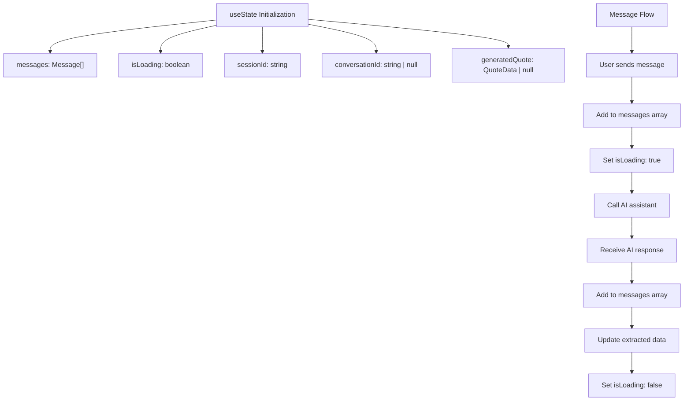
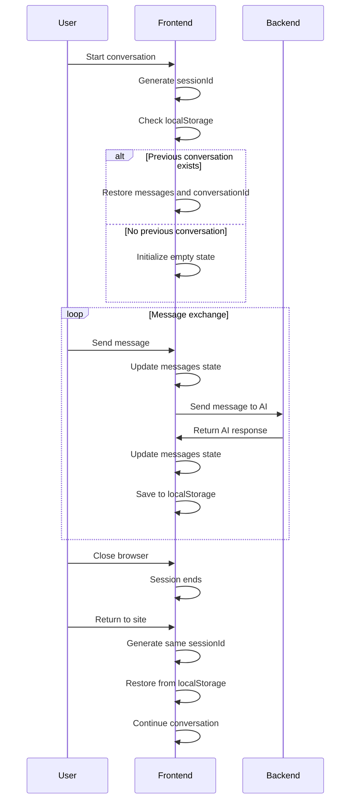
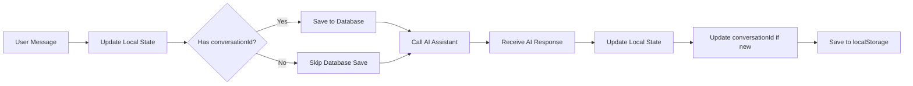
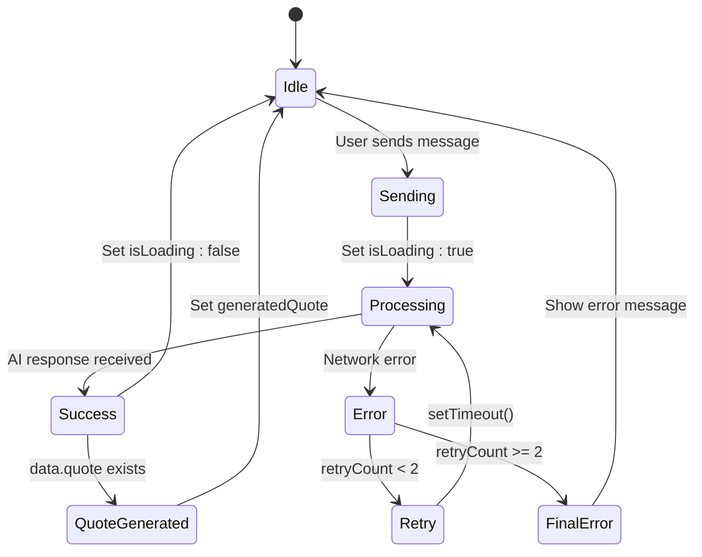
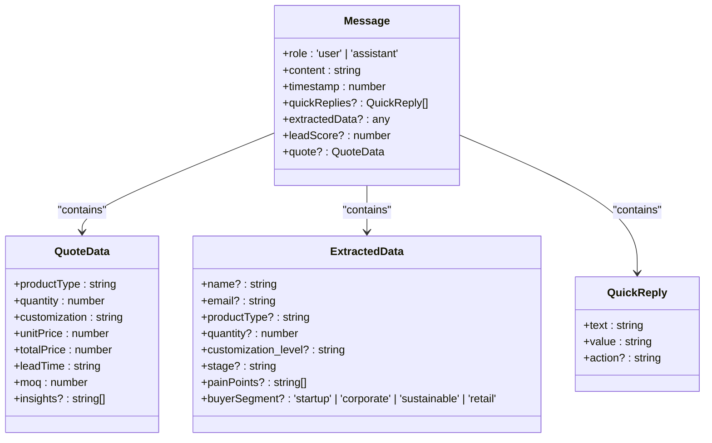
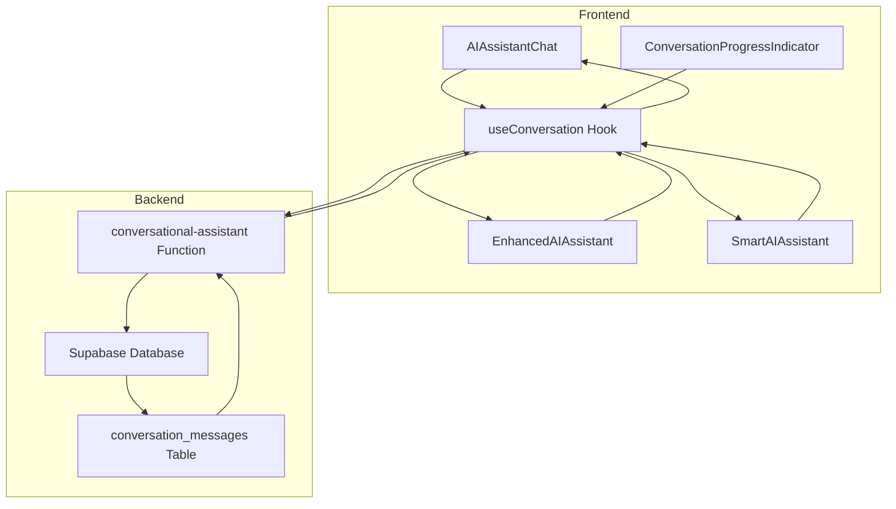

# Conversation State Management

<cite>
**Referenced Files in This Document**   
- [useConversation.ts](file://src/hooks/useConversation.ts)
- [AIAssistantChat.tsx](file://src/components/AIAssistantChat.tsx)
- [EnhancedAIAssistant.tsx](file://src/components/EnhancedAIAssistant.tsx)
- [SmartAIAssistant.tsx](file://src/components/SmartAIAssistant.tsx)
- [ConversationProgressIndicator.tsx](file://src/components/ConversationProgressIndicator.tsx)
- [client.ts](file://src/integrations/supabase/client.ts)
</cite>

## Table of Contents
1. [Introduction](#introduction)
2. [Core State Management](#core-state-management)
3. [Conversation Context Preservation](#conversation-context-preservation)
4. [Message Synchronization](#message-synchronization)
5. [State Transitions](#state-transitions)
6. [Data Extraction and UI Updates](#data-extraction-and-ui-updates)
7. [Architecture Overview](#architecture-overview)
8. [Conclusion](#conclusion)

## Introduction
The conversation state management system in the SleekApp platform provides a robust framework for maintaining interactive AI-assisted conversations between users and the manufacturing assistant. This system handles real-time messaging, preserves conversation context across sessions, synchronizes data between frontend and backend, and manages complex state transitions during message exchanges. The implementation leverages React's useState hooks for local state management while integrating with Supabase for persistent storage and real-time synchronization.

**Section sources**
- [useConversation.ts](file://src/hooks/useConversation.ts#L32-L177)

## Core State Management
The conversation state management system utilizes React's useState hooks to maintain several critical state variables within the `useConversation` hook. The primary state variables include:

- **messages**: An array of Message objects that stores the complete conversation history between the user and AI assistant
- **isLoading**: A boolean flag that indicates when a message is being processed or sent
- **sessionId**: A unique identifier generated using crypto.randomUUID() to track the current session
- **conversationId**: A persistent identifier that links the conversation across sessions
- **generatedQuote**: A QuoteData object that stores extracted quote information from AI responses

The system initializes these states at component mount and manages their lifecycle through useEffect hooks and useCallback functions. The messages state is updated whenever a user sends a message or receives a response from the AI assistant, while the isLoading state provides visual feedback during message processing.

**Diagram sources**
- [useConversation.ts](file://src/hooks/useConversation.ts#L32-L177)

**Section sources**
- [useConversation.ts](file://src/hooks/useConversation.ts#L32-L177)

## Conversation Context Preservation
The system implements a sophisticated mechanism for preserving conversation context across sessions using localStorage and a unique sessionId. When a user begins a conversation, a sessionId is generated using crypto.randomUUID() and used as a key for localStorage operations.

The preservation mechanism operates through two useEffect hooks:
1. On component mount, the system attempts to restore a previous conversation by retrieving data from localStorage using the sessionId as a key
2. Whenever the messages or conversationId state changes, the system saves the current conversation state to localStorage

This approach ensures that users can close and reopen the chat interface without losing their conversation history. The system stores both the messages array and the conversationId, allowing for seamless continuity when the user returns. The conversationId serves as a permanent reference to the conversation in the backend database, while the sessionId provides temporary client-side persistence.

**Diagram sources**
- [useConversation.ts](file://src/hooks/useConversation.ts#L40-L62)

**Section sources**
- [useConversation.ts](file://src/hooks/useConversation.ts#L35-L62)

## Message Synchronization
The conversation system implements bidirectional synchronization between the frontend and backend to ensure data consistency and persistence. The synchronization process involves several key components:

- **sessionId Generation**: A unique sessionId is generated client-side using crypto.randomUUID() and persists for the duration of the browsing session
- **conversationId Propagation**: The conversationId is established during the first AI interaction and propagated to subsequent requests to maintain conversation continuity
- **Database Integration**: Messages are stored in the Supabase database in the conversation_messages table when a conversationId exists
- **Real-time Updates**: The system uses Supabase's real-time capabilities to synchronize messages across devices

When a user sends a message, the system first updates the local state, then sends the message to the backend AI assistant function. If a conversationId already exists, the message is immediately stored in the database. The AI assistant processes the message and returns a response with updated conversation context, including potentially a new conversationId for newly created conversations.

**Diagram sources**
- [useConversation.ts](file://src/hooks/useConversation.ts#L76-L119)

**Section sources**
- [useConversation.ts](file://src/hooks/useConversation.ts#L76-L119)
- [client.ts](file://src/integrations/supabase/client.ts#L1-L20)

## State Transitions
The conversation system manages several state transitions during message sending and receiving, including loading states and error handling. The primary state transitions occur within the sendMessage function and follow a well-defined sequence:

1. **Initial State**: The system starts with isLoading set to false and an empty or populated messages array
2. **Message Sending**: When a user submits a message, isLoading is set to true and the user message is added to the messages array
3. **Processing State**: The system calls the AI assistant function while displaying a loading indicator
4. **Response Handling**: Upon receiving a response, the AI message is added to the messages array and isLoading is set to false
5. **Error State**: If an error occurs, an error message is displayed and retry logic is implemented

The system includes comprehensive error handling with retry logic that attempts to resend failed messages up to three times with increasing delays. Error states trigger toast notifications to inform users of connection issues while maintaining the conversation flow. The loading state is visually represented in the UI, providing feedback during AI processing.

**Diagram sources**
- [useConversation.ts](file://src/hooks/useConversation.ts#L64-L149)

**Section sources**
- [useConversation.ts](file://src/hooks/useConversation.ts#L64-L149)

## Data Extraction and UI Updates
The system extracts valuable data from AI responses and uses it to update the UI and enhance the user experience. The AI assistant returns structured data in the response, including:

- **extractedData**: Contains conversation context such as user name, product type, quantity, and customization preferences
- **leadScore**: A numerical value representing the user's engagement level and sales potential
- **quote**: Structured quote information including pricing, lead time, and MOQ
- **quickReplies**: Contextual response options that guide the conversation flow

This extracted data is used to update various UI components. The ConversationProgressIndicator component uses the extractedData.stage field to display the user's progress through the conversation funnel, showing completion of stages like name collection, product selection, and quantity inquiry. The leadScore is displayed as a badge indicating lead quality (New Lead, Warm Lead, or Hot Lead). When a quote is generated, the information is stored in the generatedQuote state and can be used to pre-fill quote forms or display pricing information.

**Diagram sources**
- [useConversation.ts](file://src/hooks/useConversation.ts#L5-L31)
- [ConversationProgressIndicator.tsx](file://src/components/ConversationProgressIndicator.tsx#L8-L16)

**Section sources**
- [useConversation.ts](file://src/hooks/useConversation.ts#L5-L31)
- [ConversationProgressIndicator.tsx](file://src/components/ConversationProgressIndicator.tsx#L8-L16)

## Architecture Overview
The conversation state management system follows a clean architecture pattern with clear separation of concerns between the UI components, state management hook, and backend services. The core architecture consists of:

- **UI Components**: Multiple AI assistant variants (AIAssistantChat, EnhancedAIAssistant, SmartAIAssistant) that provide different user experiences
- **State Management Hook**: The useConversation hook that encapsulates all conversation state logic
- **Backend Integration**: Supabase functions and database for persistent storage and AI processing
- **Data Flow**: Unidirectional data flow from user input through state updates to backend synchronization

The system is designed to be reusable across different components while maintaining consistent state management. The useConversation hook can be imported and used by any component that requires conversation functionality, ensuring consistency in behavior and state management across the application.

**Diagram sources**
- [useConversation.ts](file://src/hooks/useConversation.ts#L32-L177)
- [AIAssistantChat.tsx](file://src/components/AIAssistantChat.tsx#L99-L337)
- [EnhancedAIAssistant.tsx](file://src/components/EnhancedAIAssistant.tsx#L135-L649)
- [SmartAIAssistant.tsx](file://src/components/SmartAIAssistant.tsx#L35-L466)

**Section sources**
- [useConversation.ts](file://src/hooks/useConversation.ts#L32-L177)
- [AIAssistantChat.tsx](file://src/components/AIAssistantChat.tsx#L99-L337)
- [EnhancedAIAssistant.tsx](file://src/components/EnhancedAIAssistant.tsx#L135-L649)
- [SmartAIAssistant.tsx](file://src/components/SmartAIAssistant.tsx#L35-L466)

## Conclusion
The conversation state management system in the SleekApp platform provides a comprehensive solution for maintaining interactive AI-assisted conversations. By leveraging React's useState hooks, localStorage persistence, and Supabase backend integration, the system effectively manages conversation state, preserves context across sessions, synchronizes data between frontend and backend, and handles complex state transitions. The extracted data from AI responses enhances the user experience by enabling progress tracking, lead scoring, and quote generation. This architecture supports multiple UI variants while maintaining consistent state management, making it a scalable and maintainable solution for AI-powered customer interactions.