# Conversational AI Engine

<cite>
**Referenced Files in This Document**
- [index.ts](file://supabase/functions/conversational-assistant/index.ts)
- [AIAssistantChat.tsx](file://src/components/AIAssistantChat.tsx)
- [SmartAIAssistant.tsx](file://src/components/SmartAIAssistant.tsx)
- [useConversation.ts](file://src/hooks/useConversation.ts)
- [SmartReplyButtons.tsx](file://src/components/SmartReplyButtons.tsx)
- [AIQuoteGenerator.tsx](file://src/components/AIQuoteGenerator.tsx)
- [NaturalLanguageQuoteInput.tsx](file://src/components/quote/NaturalLanguageQuoteInput.tsx)
- [TABLES_ONLY.sql](file://supabase/TABLES_ONLY.sql)
- [create_lead_capture_system.sql](file://supabase/migrations/20251123052149_create_lead_capture_system.sql)
</cite>

## Table of Contents
1. [Introduction](#introduction)
2. [System Architecture](#system-architecture)
3. [State Machine-Driven Conversation Flow](#state-machine-driven-conversation-flow)
4. [AI Integration with Lovable AI's GPT-5-mini](#ai-integration-with-lovable-ais-gpt-5-mini)
5. [Data Persistence and Context Management](#data-persistence-and-context-management)
6. [Rate Limiting Implementation](#rate-limiting-implementation)
7. [Quick Reply Generation System](#quick-reply-generation-system)
8. [Error Handling and Fallback Mechanisms](#error-handling-and-fallback-mechanisms)
9. [Lead Scoring Algorithm](#lead-scoring-algorithm)
10. [Integration Patterns](#integration-patterns)
11. [Performance Considerations](#performance-considerations)
12. [Troubleshooting Guide](#troubleshooting-guide)
13. [Conclusion](#conclusion)

## Introduction

The Conversational AI Engine is a sophisticated state machine-driven system that powers Sleek Apparels' AI chat interface. Built on Supabase Functions and React components, it guides users through a conversational journey from initial greeting to quote generation, leveraging Lovable AI's GPT-5-mini model for natural language processing and context preservation through advanced database schemas.

The system implements a five-stage conversation flow: GREETING → NAME_COLLECTION → PRODUCT_IDENTIFICATION → QUANTITY_COLLECTION → CUSTOMIZATION_COLLECTION → EMAIL_COLLECTION → FINAL_CHOICES. Each stage is carefully designed to collect essential data points while maintaining conversational continuity and providing context-aware responses.

## System Architecture

The Conversational AI Engine follows a serverless architecture with clear separation of concerns between frontend presentation, backend processing, and data persistence layers.

**Diagram sources**
- [index.ts](file://supabase/functions/conversational-assistant/index.ts#L22-L388)
- [SmartAIAssistant.tsx](file://src/components/SmartAIAssistant.tsx#L35-L466)
- [useConversation.ts](file://src/hooks/useConversation.ts#L32-L177)

**Section sources**
- [index.ts](file://supabase/functions/conversational-assistant/index.ts#L1-L50)
- [SmartAIAssistant.tsx](file://src/components/SmartAIAssistant.tsx#L1-L50)

## State Machine-Driven Conversation Flow

The conversation flow is governed by a strict state machine that ensures logical progression through six distinct stages, each with specific data collection goals and response patterns.

**Diagram sources**
- [index.ts](file://supabase/functions/conversational-assistant/index.ts#L156-L228)
- [index.ts](file://supabase/functions/conversational-assistant/index.ts#L391-L405)

### Stage Definitions and Data Collection

Each conversation stage focuses on collecting specific data points while maintaining conversational flow:

| Stage | Primary Goal | Data Collected | Response Pattern |
|-------|-------------|----------------|------------------|
| GREETING | Establish rapport | User's name | Warm, welcoming response |
| NAME_COLLECTED | Understand intent | User's intent description | Clarifying questions |
| INTENT_UNDERSTOOD | Identify product type | Product category preference | Specific product suggestions |
| PRODUCT_IDENTIFIED | Determine quantity | Order quantity range | Realistic quantity ranges |
| QUANTITY_COLLECTED | Define customization | Customization level | Customization options |
| CUSTOMIZATION_COLLECTED | Obtain contact info | Email address | Natural email collection |
| EMAIL_COLLECTED | Final decision point | Final choices | Option selection |

**Section sources**
- [index.ts](file://supabase/functions/conversational-assistant/index.ts#L156-L228)
- [index.ts](file://supabase/functions/conversational-assistant/index.ts#L391-L405)

## AI Integration with Lovable AI's GPT-5-mini

The system integrates with Lovable AI's GPT-5-mini model through a carefully crafted system prompt that enforces strict adherence to the state machine flow.

### System Prompt Architecture

The system prompt combines multiple contextual elements to guide the AI response:

**Diagram sources**
- [index.ts](file://supabase/functions/conversational-assistant/index.ts#L154-L252)

### AI Response Validation

The system implements robust validation to ensure AI responses align with the expected state machine flow:

**Diagram sources**
- [index.ts](file://supabase/functions/conversational-assistant/index.ts#L483-L504)
- [index.ts](file://supabase/functions/conversational-assistant/index.ts#L506-L518)

**Section sources**
- [index.ts](file://supabase/functions/conversational-assistant/index.ts#L254-L278)
- [index.ts](file://supabase/functions/conversational-assistant/index.ts#L483-L518)

## Data Persistence and Context Management

The system maintains conversation context through a sophisticated database schema that preserves user interactions, extracted data, and conversation state across sessions.

### Database Schema Architecture

**Diagram sources**
- [TABLES_ONLY.sql](file://supabase/TABLES_ONLY.sql#L260-L297)
- [create_lead_capture_system.sql](file://supabase/migrations/20251123052149_create_lead_capture_system.sql#L5-L50)

### Context Preservation Mechanism

The system implements dual-layer context preservation:

1. **Real-time Context**: Maintained in Supabase tables during active conversations
2. **Local Storage Backup**: Preserved in browser localStorage for offline capability

**Diagram sources**
- [useConversation.ts](file://src/hooks/useConversation.ts#L40-L62)
- [SmartAIAssistant.tsx](file://src/components/SmartAIAssistant.tsx#L47-L67)

**Section sources**
- [TABLES_ONLY.sql](file://supabase/TABLES_ONLY.sql#L260-L297)
- [useConversation.ts](file://src/hooks/useConversation.ts#L40-L62)

## Rate Limiting Implementation

The system implements a sophisticated rate limiting mechanism to prevent abuse while allowing legitimate users to engage in multiple conversations.

### Rate Limiting Algorithm

**Diagram sources**
- [index.ts](file://supabase/functions/conversational-assistant/index.ts#L55-L92)

### Rate Limiting Configuration

| Parameter | Value | Purpose |
|-----------|-------|---------|
| Time Window | 1 hour | Prevents abuse within reasonable timeframe |
| Maximum Requests | 10 per window | Allows multiple meaningful conversations |
| Identifier Source | IP Address | Provides fair usage distribution |
| Grace Period | 3600 seconds | Standard retry-after header |

**Section sources**
- [index.ts](file://supabase/functions/conversational-assistant/index.ts#L55-L92)

## Quick Reply Generation System

The system provides intelligent quick reply buttons that adapt to the current conversation context, offering users convenient response options while maintaining conversational flow.

### Context-Aware Quick Reply Generation

**Diagram sources**
- [index.ts](file://supabase/functions/conversational-assistant/index.ts#L407-L480)
- [SmartReplyButtons.tsx](file://src/components/SmartReplyButtons.tsx#L13-L69)

### Quick Reply Categories

The system generates contextually appropriate quick reply categories:

| Category | Purpose | Examples |
|----------|---------|----------|
| Product Selection | Help users choose product types | "👕 T-shirts", "🧥 Hoodies", "👔 Polo shirts" |
| Quantity Ranges | Guide quantity selection | "🧪 50-100 (Testing)", "🚀 100-500 (Launch)" |
| Customization Levels | Define customization options | "🏷️ Logo Only", "🎨 Custom Design", "🧵 Embroidery" |
| Budget Ranges | Establish budget expectations | "💵 $5-10 per piece", "💰 $10-20 per piece" |
| Action Choices | Present final decisions | "🎯 Generate Quote", "📧 Talk to Team" |

**Section sources**
- [index.ts](file://supabase/functions/conversational-assistant/index.ts#L407-L480)
- [SmartReplyButtons.tsx](file://src/components/SmartReplyButtons.tsx#L13-L69)

## Error Handling and Fallback Mechanisms

The system implements comprehensive error handling with multiple fallback layers to ensure reliable operation even when AI services experience temporary failures.

### Multi-Level Error Handling Architecture

**Diagram sources**
- [index.ts](file://supabase/functions/conversational-assistant/index.ts#L375-L387)
- [SmartAIAssistant.tsx](file://src/components/SmartAIAssistant.tsx#L129-L150)

### Error Recovery Strategies

The system employs several error recovery strategies:

1. **AI Response Validation**: Ensures responses align with expected state machine flow
2. **Fallback Questions**: Provides appropriate default questions when AI fails
3. **Retry Logic**: Implements exponential backoff for transient failures
4. **Graceful Degradation**: Continues operation with reduced functionality when services fail

**Section sources**
- [index.ts](file://supabase/functions/conversational-assistant/index.ts#L375-L387)
- [SmartAIAssistant.tsx](file://src/components/SmartAIAssistant.tsx#L129-L150)

## Lead Scoring Algorithm

The system implements a sophisticated lead scoring algorithm that evaluates user engagement and intent based on collected data points, helping sales teams prioritize high-quality leads.

### Lead Scoring Formula

```mermaid
flowchart TD
UserData[User Data Collection] --> NameCheck{Name Provided?}
UserData --> EmailCheck{Email Provided?}
UserData --> ProductCheck{Product Type Selected?}
UserData --> QuantityCheck{Quantity Specified?}
UserData --> CustomizationCheck{Customization Level?}
UserData --> BudgetCheck{Budget Range?}
NameCheck --> |Yes| NameScore[+15 Points]
NameCheck --> |No| ZeroScore[0 Points]
EmailCheck --> |Yes| EmailScore[+30 Points]
EmailCheck --> |No| ZeroScore
ProductCheck --> |Yes| ProductScore[+20 Points]
ProductCheck --> |No| ZeroScore
QuantityCheck --> |Yes| QuantityScore[+15 Points]
QuantityCheck --> |No| ZeroScore
QuantityCheck --> LargeOrder{Quantity ≥ 500?}
LargeOrder --> |Yes| LargeOrderBonus[+10 Bonus Points]
LargeOrder --> |No| ZeroBonus[0 Bonus Points]
CustomizationCheck --> |Yes| CustomizationScore[+10 Points]
CustomizationCheck --> |No| ZeroScore
BudgetCheck --> |Yes| BudgetScore[+5 Points]
BudgetCheck --> |No| ZeroScore
NameScore --> TotalScore[Calculate Total Score]
EmailScore --> TotalScore
ProductScore --> TotalScore
QuantityScore --> TotalScore
LargeOrderBonus --> TotalScore
CustomizationScore --> TotalScore
BudgetScore --> TotalScore
TotalScore --> MaxScore{Score > 100?}
MaxScore --> |Yes| FinalScore[100]
MaxScore --> |No| FinalScore[Actual Score]
```

**Diagram sources**
- [index.ts](file://supabase/functions/conversational-assistant/index.ts#L605-L620)

### Lead Score Interpretation

| Score Range | Lead Quality | Sales Priority |
|-------------|-------------|----------------|
| 0-39 | Cold | Low Priority |
| 40-69 | Warm | Medium Priority |
| 70-100 | Hot | High Priority |

### Data Extraction and Scoring

The system extracts key data points from user interactions to calculate lead scores:

**Diagram sources**
- [index.ts](file://supabase/functions/conversational-assistant/index.ts#L522-L620)

**Section sources**
- [index.ts](file://supabase/functions/conversational-assistant/index.ts#L605-L620)

## Integration Patterns

The Conversational AI Engine integrates seamlessly with various parts of the Sleek Apparels ecosystem through standardized APIs and data exchange patterns.

### Frontend Integration

The system provides multiple frontend integration points:

1. **SmartAIAssistant Component**: Primary chat interface with advanced features
2. **AIAssistantChat Component**: Simplified chat interface for basic interactions
3. **useConversation Hook**: Reusable conversation management logic
4. **SmartReplyButtons Component**: Dynamic quick reply generation

### Backend Integration

The system integrates with Supabase Functions and database services:

**Diagram sources**
- [SmartAIAssistant.tsx](file://src/components/SmartAIAssistant.tsx#L70-L122)
- [useConversation.ts](file://src/hooks/useConversation.ts#L64-L122)

**Section sources**
- [SmartAIAssistant.tsx](file://src/components/SmartAIAssistant.tsx#L35-L122)
- [useConversation.ts](file://src/hooks/useConversation.ts#L32-L122)

## Performance Considerations

The system is optimized for performance through several key strategies:

### Caching and Optimization

1. **Industry Knowledge Caching**: Static knowledge base loaded once per request
2. **Rate Limiting Optimization**: Efficient database queries for rate limit checks
3. **Context Preservation**: Minimal database writes during active conversations
4. **AI Response Caching**: Intelligent caching of common response patterns

### Scalability Features

1. **Serverless Architecture**: Automatic scaling with demand
2. **Database Indexing**: Optimized queries for conversation lookups
3. **Connection Pooling**: Efficient database connection management
4. **CDN Integration**: Static asset delivery optimization

### Monitoring and Metrics

The system tracks key performance indicators:

- **Response Latency**: Average response time per conversation
- **Rate Limit Violations**: Frequency of rate limit triggers
- **AI Service Availability**: Success/failure rates of AI requests
- **User Engagement**: Conversation completion rates and lead quality

## Troubleshooting Guide

Common issues and their solutions:

### AI Service Failures

**Issue**: AI responses are inconsistent or fail frequently
**Solution**: 
1. Check Lovable AI service status
2. Verify API key configuration
3. Review system prompt for clarity
4. Monitor rate limit compliance

### Conversation Context Loss

**Issue**: User conversations reset unexpectedly
**Solution**:
1. Verify localStorage availability
2. Check database connection status
3. Review conversation ID generation
4. Ensure proper session management

### Rate Limit Exceeded

**Issue**: Users receive 429 errors frequently
**Solution**:
1. Increase rate limit thresholds if needed
2. Implement user-friendly error messaging
3. Add rate limit monitoring
4. Consider user segmentation for different limits

### Quick Reply Issues

**Issue**: Quick replies don't appear or are incorrect
**Solution**:
1. Verify response content analysis
2. Check stage detection logic
3. Review quick reply generation conditions
4. Test with different conversation flows

**Section sources**
- [index.ts](file://supabase/functions/conversational-assistant/index.ts#L375-L387)
- [SmartAIAssistant.tsx](file://src/components/SmartAIAssistant.tsx#L129-L150)

## Conclusion

The Conversational AI Engine represents a sophisticated approach to building intelligent chat interfaces that balance user experience with business objectives. Through its state machine-driven architecture, robust error handling, and comprehensive data persistence, it creates seamless conversational experiences that drive lead generation and quote conversions.

The system's integration with Lovable AI's GPT-5-mini model, combined with custom validation and fallback mechanisms, ensures reliable operation even under challenging conditions. The lead scoring algorithm provides valuable insights for sales teams, while the rate limiting implementation protects system resources from abuse.

Future enhancements could include expanded product knowledge integration, multilingual support, and advanced sentiment analysis capabilities. The modular architecture ensures that such improvements can be implemented without disrupting the core conversation flow.