# Conversational Interfaces

<cite>
**Referenced Files in This Document**
- [index.ts](file://supabase/functions/conversational-assistant/index.ts)
- [SmartAIAssistant.tsx](file://src/components/SmartAIAssistant.tsx)
- [AIAssistantChat.tsx](file://src/components/AIAssistantChat.tsx)
- [useConversation.ts](file://src/hooks/useConversation.ts)
- [SmartReplyButtons.tsx](file://src/components/SmartReplyButtons.tsx)
- [RateLimitMonitoringDashboard.tsx](file://src/components/admin/RateLimitMonitoringDashboard.tsx)
- [conversation_context table](file://supabase/COMPLETE_SETUP.sql#L1014-L1045)
- [conversation_messages table](file://supabase/COMPLETE_SETUP.sql#L1048-L1057)
- [conversation_rate_limits table](file://supabase/migrations/20251115150759_remix_migration_from_pg_dump.sql#L1102-L1147)
- [industry_knowledge table](file://supabase/migrations/20251115150759_remix_migration_from_pg_dump.sql#L1128-L1147)
- [quote_requests table](file://supabase/FIXED_SETUP_PART1.sql#L1279-L1322)
</cite>

## Table of Contents
1. [Introduction](#introduction)
2. [System Architecture](#system-architecture)
3. [State Machine-Driven Conversation Flow](#state-machine-driven-conversation-flow)
4. [AI Integration with Lovable AI](#ai-integration-with-lovable-ai)
5. [Context Preservation System](#context-preservation-system)
6. [Rate Limiting Implementation](#rate-limiting-implementation)
7. [Quick Reply Generation System](#quick-reply-generation-system)
8. [Error Handling and Fallback Mechanisms](#error-handling-and-fallback-mechanisms)
9. [Lead Scoring Algorithm](#lead-scoring-algorithm)
10. [Technical Implementation Details](#technical-implementation-details)
11. [Performance Considerations](#performance-considerations)
12. [Troubleshooting Guide](#troubleshooting-guide)
13. [Conclusion](#conclusion)

## Introduction

The conversational assistant system represents a sophisticated AI-powered interface that guides users through the apparel manufacturing journey, from initial inquiry to quote generation. Built on a state machine architecture, this system provides intelligent, context-aware interactions that enhance user engagement while capturing valuable lead data for business intelligence.

The system integrates seamlessly with Lovable AI's GPT-5-mini model to deliver natural language processing capabilities, enabling fluid conversations that adapt to user intent and context. Through comprehensive context preservation and intelligent lead scoring, the assistant transforms casual inquiries into actionable business opportunities.

## System Architecture

The conversational assistant follows a multi-layered architecture that separates concerns between frontend presentation, backend processing, and external AI services:

**Diagram sources**
- [SmartAIAssistant.tsx](file://src/components/SmartAIAssistant.tsx#L35-L466)
- [index.ts](file://supabase/functions/conversational-assistant/index.ts#L22-L621)

**Section sources**
- [SmartAIAssistant.tsx](file://src/components/SmartAIAssistant.tsx#L1-L466)
- [index.ts](file://supabase/functions/conversational-assistant/index.ts#L1-L621)

## State Machine-Driven Conversation Flow

The conversational assistant operates on a strict state machine architecture that ensures logical progression through the customer journey. Each state represents a specific data collection phase with predetermined questions and validation rules.

### State Flow Architecture

**Diagram sources**
- [index.ts](file://supabase/functions/conversational-assistant/index.ts#L158-L176)
- [index.ts](file://supabase/functions/conversational-assistant/index.ts#L391-L405)

### State-Specific Interaction Patterns

Each state implements specific interaction patterns designed to collect essential data points while maintaining conversational flow:

| State | Purpose | Expected Input | Validation Rules |
|-------|---------|----------------|------------------|
| GREETING | Collect user name | Free-form text | Must contain name (first word or "I'm [name]") |
| NAME_COLLECTED | Understand intent | Free-form text | Must indicate product/service interest |
| PRODUCT_IDENTIFIED | Specify product type | Dropdown selection | Must match predefined product categories |
| QUANTITY_COLLECTED | Determine order size | Numeric input | Must be reasonable quantity (50-10000+) |
| CUSTOMIZATION_COLLECTED | Define design requirements | Dropdown selection | Must match customization options |
| EMAIL_COLLECTED | Capture contact information | Email format | Must be valid email address |
| FINAL_CHOICE | Decision point | User preference | Must be one of offered options |

**Section sources**
- [index.ts](file://supabase/functions/conversational-assistant/index.ts#L154-L251)
- [index.ts](file://supabase/functions/conversational-assistant/index.ts#L391-L405)

## AI Integration with Lovable AI

The system leverages Lovable AI's GPT-5-mini model through a carefully crafted prompt engineering strategy that ensures consistent, context-aware responses while maintaining brand voice and business logic.

### Prompt Engineering Architecture

**Diagram sources**
- [index.ts](file://supabase/functions/conversational-assistant/index.ts#L254-L269)
- [index.ts](file://supabase/functions/conversational-assistant/index.ts#L138-L152)

### System Prompt Structure

The system prompt incorporates multiple layers of context to guide the AI's behavior:

1. **Role Definition**: Clear specification of the assistant's persona and capabilities
2. **State Machine Rules**: Strict adherence to conversation flow requirements
3. **Knowledge Base**: Access to industry-specific information
4. **Conversation Context**: Real-time data extraction and summarization
5. **Response Guidelines**: Formatting and tone specifications

**Section sources**
- [index.ts](file://supabase/functions/conversational-assistant/index.ts#L154-L251)

## Context Preservation System

The context preservation system maintains conversation state across multiple interactions through a dual-table architecture that stores both message history and extracted data points.

### Database Schema Design

**Diagram sources**
- [conversation_context table](file://supabase/COMPLETE_SETUP.sql#L1014-L1045)
- [conversation_messages table](file://supabase/COMPLETE_SETUP.sql#L1048-L1057)
- [conversation_rate_limits table](file://supabase/migrations/20251115150759_remix_migration_from_pg_dump.sql#L1102-L1147)
- [industry_knowledge table](file://supabase/migrations/20251115150759_remix_migration_from_pg_dump.sql#L1128-L1147)
- [quote_requests table](file://supabase/FIXED_SETUP_PART1.sql#L1279-L1322)

### Data Extraction and Storage

The system employs sophisticated natural language processing to extract meaningful data points from user interactions:

**Diagram sources**
- [index.ts](file://supabase/functions/conversational-assistant/index.ts#L522-L602)

**Section sources**
- [index.ts](file://supabase/functions/conversational-assistant/index.ts#L113-L139)
- [conversation_context table](file://supabase/COMPLETE_SETUP.sql#L1014-L1045)

## Rate Limiting Implementation

The rate limiting system prevents abuse while ensuring fair access to the conversational assistant across all users and sessions.

### Rate Limiting Architecture

**Diagram sources**
- [index.ts](file://supabase/functions/conversational-assistant/index.ts#L55-L92)
- [RateLimitMonitoringDashboard.tsx](file://src/components/admin/RateLimitMonitoringDashboard.tsx#L29-L80)

### Rate Limiting Configuration

The system implements a sliding window approach with configurable limits:

| Parameter | Value | Purpose |
|-----------|-------|---------|
| Identifier | IP Address/Session ID | Unique user identification |
| Window Duration | 1 hour | Time window for counting |
| Request Limit | 10 requests | Maximum requests per window |
| Reset Behavior | Automatic | Resets after window expiration |
| Monitoring | Real-time | Continuous performance tracking |

**Section sources**
- [index.ts](file://supabase/functions/conversational-assistant/index.ts#L55-L92)
- [RateLimitMonitoringDashboard.tsx](file://src/components/admin/RateLimitMonitoringDashboard.tsx#L1-L204)

## Quick Reply Generation System

The quick reply system provides context-aware response suggestions that streamline user interaction and reduce friction in the conversation flow.

### Context-Aware Quick Reply Generation

**Diagram sources**
- [index.ts](file://supabase/functions/conversational-assistant/index.ts#L408-L481)
- [SmartReplyButtons.tsx](file://src/components/SmartReplyButtons.tsx#L1-L69)

### Quick Reply Categories

The system generates contextually appropriate quick replies based on the current conversation state:

| State | Quick Reply Options | Purpose |
|-------|-------------------|---------|
| Product Selection | T-shirts, Hoodies, Polo shirts, Sweaters, Other | Streamline product type selection |
| Quantity Selection | 50-100, 100-500, 500-1000, 1000+, Testing/Bulk | Simplify quantity input |
| Customization | Logo Only, Custom Design, Multi-Color, Embroidery, Help Needed | Accelerate customization choices |
| Budget Inquiry | $5-10, $10-20, $20+, Not Sure | Quick budget estimation |
| Final Decision | Generate Quote, Talk to Team, More Questions | Clear next steps |

**Section sources**
- [index.ts](file://supabase/functions/conversational-assistant/index.ts#L408-L481)
- [SmartReplyButtons.tsx](file://src/components/SmartReplyButtons.tsx#L1-L69)

## Error Handling and Fallback Mechanisms

The system implements comprehensive error handling to ensure graceful degradation when AI services or external dependencies fail.

### Error Handling Architecture

**Diagram sources**
- [index.ts](file://supabase/functions/conversational-assistant/index.ts#L375-L387)
- [SmartAIAssistant.tsx](file://src/components/SmartAIAssistant.tsx#L129-L151)

### Fallback Response Strategies

When AI services become unavailable, the system employs several fallback mechanisms:

1. **Graceful Degradation**: Continue functioning with reduced AI capabilities
2. **Static Responses**: Provide predefined answers for common queries
3. **Human Handoff**: Offer direct contact options when appropriate
4. **Retry Logic**: Attempt automatic recovery after temporary failures
5. **User Guidance**: Inform users about service status and alternatives

**Section sources**
- [index.ts](file://supabase/functions/conversational-assistant/index.ts#L375-L387)
- [SmartAIAssistant.tsx](file://src/components/SmartAIAssistant.tsx#L129-L151)

## Lead Scoring Algorithm

The lead scoring system evaluates user engagement and intent to prioritize sales efforts and optimize conversion rates.

### Lead Scoring Formula

```mermaid
flowchart TD
UserData[User Data Points] --> Name{Name Provided?}
UserData --> Email{Email Provided?}
UserData --> Product{Product Type Selected?}
UserData --> Quantity{Quantity Specified?}
UserData --> Custom{Customization Level?}
UserData --> Budget{Budget Range?}
Name --> |Yes| NameScore[+15 Points]
Name --> |No| ZeroName[0 Points]
Email --> |Yes| EmailScore[+30 Points]
Email --> |No| ZeroEmail[0 Points]
Product --> |Yes| ProdScore[+20 Points]
Product --> |No| ZeroProd[0 Points]
Quantity --> |Yes| QtyScore[+15 Points]
Quantity --> |No| ZeroQty[0 Points]
Quantity --> LargeOrder{Quantity ≥ 500?}
LargeOrder --> |Yes| LargeBonus[+10 Points]
LargeOrder --> |No| ZeroLarge[0 Points]
Custom --> |Yes| CustomScore[+10 Points]
Custom --> |No| ZeroCustom[0 Points]
Budget --> |Yes| BudgetScore[+5 Points]
Budget --> |No| ZeroBudget[0 Points]
NameScore --> Total[Calculate Total Score]
ZeroName --> Total
EmailScore --> Total
ZeroEmail --> Total
ProdScore --> Total
ZeroProd --> Total
QtyScore --> Total
ZeroQty --> Total
LargeBonus --> Total
ZeroLarge --> Total
CustomScore --> Total
ZeroCustom --> Total
BudgetScore --> Total
ZeroBudget --> Total
Total --> MaxScore[Cap at 100 Points]
MaxScore --> FinalScore[Final Lead Score]
```

**Diagram sources**
- [index.ts](file://supabase/functions/conversational-assistant/index.ts#L605-L620)

### Lead Score Interpretation

The lead scoring system categorizes prospects based on their engagement level:

| Score Range | Category | Description | Action Recommended |
|-------------|----------|-------------|-------------------|
| 0-39 | Cold Lead | Minimal engagement | Nurture with educational content |
| 40-69 | Warm Lead | Moderate engagement | Personalized outreach required |
| 70-100 | Hot Lead | High engagement | Immediate sales follow-up |

**Section sources**
- [index.ts](file://supabase/functions/conversational-assistant/index.ts#L605-L620)

## Technical Implementation Details

### Frontend Component Architecture

The frontend implementation utilizes React hooks and state management to handle conversation state and user interactions efficiently.

**Diagram sources**
- [SmartAIAssistant.tsx](file://src/components/SmartAIAssistant.tsx#L35-L466)
- [useConversation.ts](file://src/hooks/useConversation.ts#L32-L177)
- [SmartReplyButtons.tsx](file://src/components/SmartReplyButtons.tsx#L8-L69)

### Backend Function Implementation

The backend function handles complex orchestration of AI services, database operations, and business logic validation.

**Section sources**
- [SmartAIAssistant.tsx](file://src/components/SmartAIAssistant.tsx#L1-L466)
- [useConversation.ts](file://src/hooks/useConversation.ts#L1-L177)
- [index.ts](file://supabase/functions/conversational-assistant/index.ts#L1-L621)

## Performance Considerations

### Optimization Strategies

1. **Caching**: Frequently accessed industry knowledge cached in memory
2. **Batch Operations**: Multiple database operations executed efficiently
3. **Async Processing**: Non-blocking operations for AI service calls
4. **Connection Pooling**: Efficient database connection management
5. **Compression**: Reduced payload sizes for API communications

### Scalability Features

- Horizontal scaling through serverless architecture
- Stateless design enabling easy replication
- Database indexing for rapid query performance
- CDN integration for static assets
- Intelligent load balancing across AI service providers

## Troubleshooting Guide

### Common Issues and Solutions

| Issue | Symptoms | Solution |
|-------|----------|----------|
| Slow Response Times | Delayed AI responses | Check Lovable AI service status, verify API keys |
| Rate Limit Exceeded | 429 HTTP errors | Implement exponential backoff, monitor usage patterns |
| Context Loss | Repeated questions | Verify database connectivity, check session persistence |
| Invalid Responses | Nonsensical AI output | Review system prompt, validate input data |
| Authentication Failures | API key errors | Verify environment variables, check service role permissions |

### Monitoring and Diagnostics

The system includes comprehensive monitoring capabilities:

- Real-time rate limit tracking
- AI service health monitoring
- Database performance metrics
- Error rate analysis
- User engagement analytics

**Section sources**
- [RateLimitMonitoringDashboard.tsx](file://src/components/admin/RateLimitMonitoringDashboard.tsx#L1-L204)

## Conclusion

The conversational assistant system represents a sophisticated blend of AI technology, business logic, and user experience design. By implementing a state machine-driven approach with robust context preservation, intelligent lead scoring, and comprehensive error handling, the system delivers exceptional user experiences while driving business outcomes.

The modular architecture ensures maintainability and extensibility, while the rate limiting and monitoring systems provide operational reliability. As the system evolves, these foundational components enable continuous improvement and adaptation to changing business requirements.

Through careful attention to technical implementation details, performance optimization, and user-centric design principles, the conversational assistant serves as a powerful tool for transforming online inquiries into tangible business opportunities.