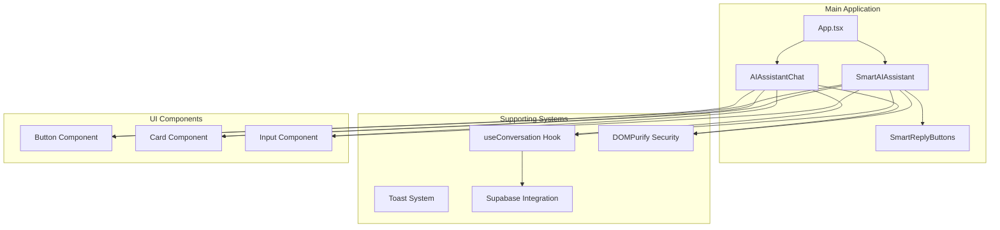
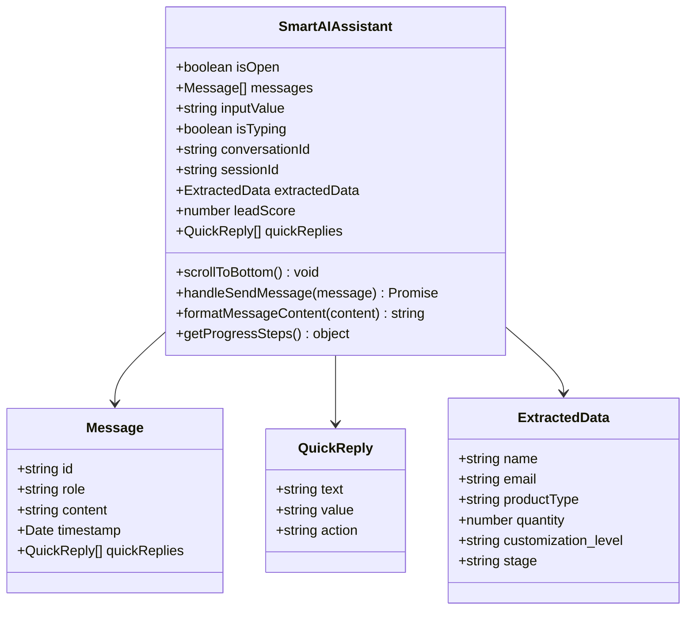
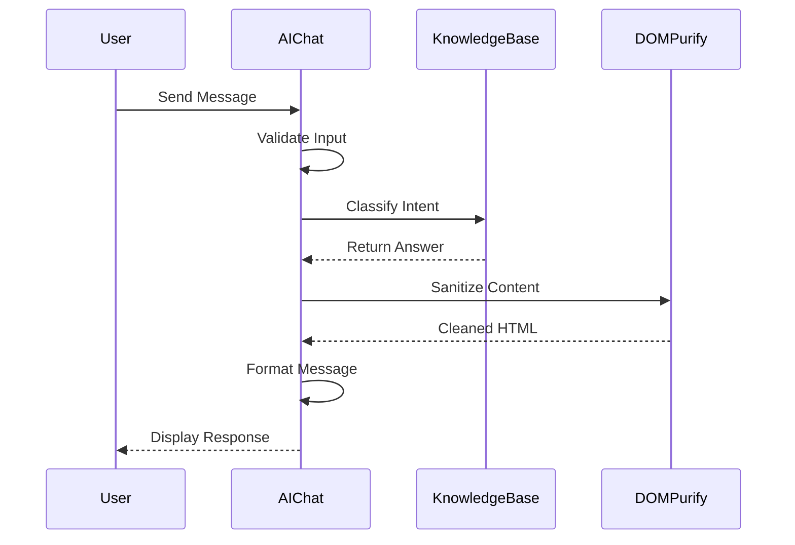
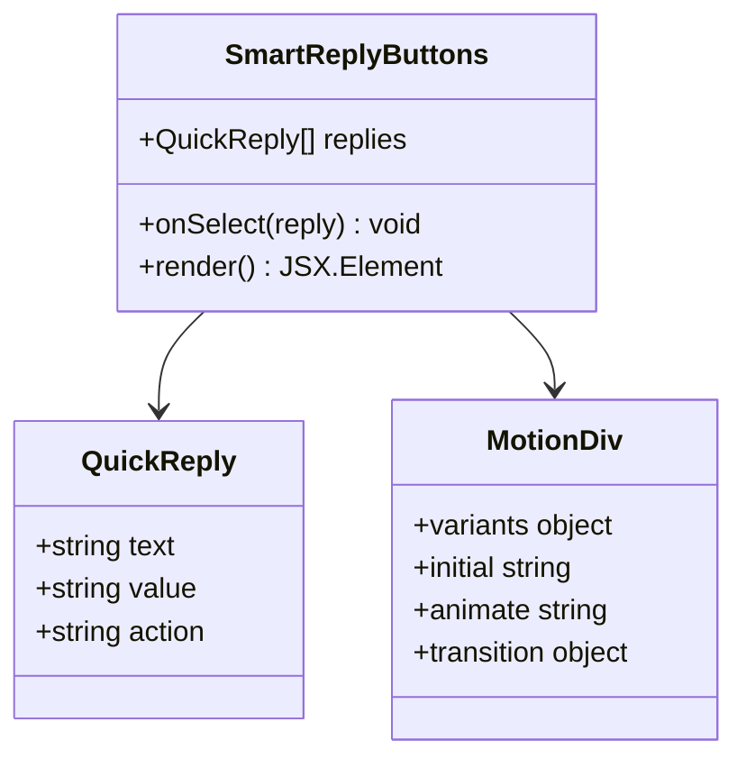
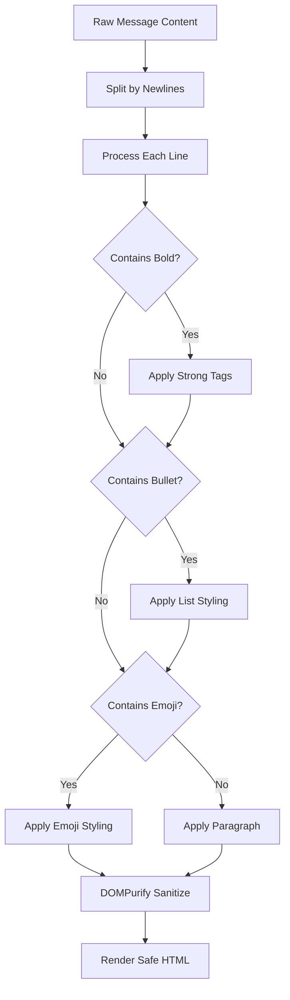

# User Interface Components

<cite>
**Referenced Files in This Document**
- [SmartAIAssistant.tsx](file://src/components/SmartAIAssistant.tsx)
- [AIAssistantChat.tsx](file://src/components/AIAssistantChat.tsx)
- [SmartReplyButtons.tsx](file://src/components/SmartReplyButtons.tsx)
- [useConversation.ts](file://src/hooks/useConversation.ts)
- [button.tsx](file://src/components/ui/button.tsx)
- [designTokens.ts](file://src/lib/designTokens.ts)
- [tailwind.config.ts](file://tailwind.config.ts)
- [App.tsx](file://src/App.tsx)
</cite>

## Table of Contents
1. [Introduction](#introduction)
2. [Component Architecture](#component-architecture)
3. [SmartAIAssistant Component](#smartaiassistant-component)
4. [AIAssistantChat Component](#aiassistantchat-component)
5. [SmartReplyButtons Component](#smartreplybuttons-component)
6. [Visual Design System](#visual-design-system)
7. [Animation and Microinteractions](#animation-and-microinteractions)
8. [Message Rendering System](#message-rendering-system)
9. [Accessibility Considerations](#accessibility-considerations)
10. [Responsive Design Patterns](#responsive-design-patterns)
11. [Integration and Dependencies](#integration-and-dependencies)
12. [Performance Optimization](#performance-optimization)

## Introduction

The Sleek Apparels conversational interface consists of three primary components that work together to provide an engaging, AI-powered customer experience: SmartAIAssistant, AIAssistantChat, and SmartReplyButtons. These components implement modern design principles with sophisticated animations, responsive layouts, and robust accessibility features.

The system combines advanced AI capabilities with intuitive user interface design, featuring floating AI buttons with pulse animations, gradient-bordered chat windows, markdown-style message formatting, and context-aware quick reply systems. All components are built with React and TypeScript, leveraging Tailwind CSS for styling and framer-motion for animations.

## Component Architecture

The conversational interface follows a modular architecture where each component serves a specific purpose while maintaining seamless integration:

**Diagram sources**
- [App.tsx](file://src/App.tsx#L15-L16)
- [SmartAIAssistant.tsx](file://src/components/SmartAIAssistant.tsx#L1-L50)
- [AIAssistantChat.tsx](file://src/components/AIAssistantChat.tsx#L1-L50)
- [SmartReplyButtons.tsx](file://src/components/SmartReplyButtons.tsx#L1-L30)

**Section sources**
- [App.tsx](file://src/App.tsx#L15-L16)
- [SmartAIAssistant.tsx](file://src/components/SmartAIAssistant.tsx#L1-L50)
- [AIAssistantChat.tsx](file://src/components/AIAssistantChat.tsx#L1-L50)

## SmartAIAssistant Component

The SmartAIAssistant component serves as the primary conversational interface, featuring a sophisticated AI assistant with advanced capabilities including lead scoring, quote generation, and contextual awareness.

### Visual Design Features

The component implements a floating AI button with sophisticated pulse animation and gradient borders:

**Diagram sources**
- [SmartAIAssistant.tsx](file://src/components/SmartAIAssistant.tsx#L12-L33)
- [useConversation.ts](file://src/hooks/useConversation.ts#L5-L30)

### Floating AI Button Implementation

The floating AI button features:
- **Gradient Background**: From primary to accent colors with subtle animation
- **Pulse Animation**: Continuous scaling and rotation effect
- **AI Badge**: Gradient-labeled "AI" badge in top-right corner
- **Shadow Effects**: Multiple layers of depth with hover interactions

### Chat Window Design

The chat window implements:
- **Gradient Borders**: Primary color gradient with 20% opacity
- **Progress Indicators**: Visual progression tracking with percentage display
- **Lead Scoring**: Dynamic badge showing lead quality indicators
- **Smooth Scrolling**: Automatic scrolling to latest messages with animation

### Message History System

The message history system includes:
- **Timestamp Display**: Localized time formatting
- **Role Differentiation**: Distinct styling for user and assistant messages
- **Markdown Formatting**: Support for bold text, bullet points, and headers
- **XSS Protection**: DOMPurify sanitization for all content

**Section sources**
- [SmartAIAssistant.tsx](file://src/components/SmartAIAssistant.tsx#L220-L466)

## AIAssistantChat Component

The AIAssistantChat component provides a simplified conversational interface focused on immediate customer support with quick question functionality.

### Simplified Design Approach

The component maintains the core conversational elements while streamlining the interface:

**Diagram sources**
- [AIAssistantChat.tsx](file://src/components/AIAssistantChat.tsx#L122-L152)
- [AIAssistantChat.tsx](file://src/components/AIAssistantChat.tsx#L49-L96)

### Quick Question System

The component includes a quick question system with categorized questions:
- **Pricing Information**: Minimum order quantities and cost estimates
- **Timeline Details**: Production schedules and delivery estimates
- **Product Capabilities**: Available product types and customization options
- **Technical Support**: LoopTrace™ system and quality assurance information

### Typing Indicator Implementation

The typing indicator features animated dots with synchronized timing:
- **Three-dot Animation**: Each dot scales independently with staggered delays
- **Color Coordination**: Primary, purple, and accent colors for visual interest
- **Smooth Transitions**: CSS animations with cubic-bezier easing

**Section sources**
- [AIAssistantChat.tsx](file://src/components/AIAssistantChat.tsx#L1-L337)

## SmartReplyButtons Component

The SmartReplyButtons component provides context-aware quick reply functionality with sophisticated microinteractions.

### Component Structure

**Diagram sources**
- [SmartReplyButtons.tsx](file://src/components/SmartReplyButtons.tsx#L8-L11)
- [useConversation.ts](file://src/hooks/useConversation.ts#L26-L30)

### Microinteraction Features

The component implements several sophisticated microinteractions:
- **Hover Animations**: Scale up by 3% with Y-axis movement
- **Tap Interactions**: Scale down to 97% with immediate feedback
- **Staggered Appearances**: Buttons appear with increasing delays
- **Gradient Borders**: Subtle border animations with shadow effects

### Visual Design Elements

Key visual elements include:
- **Lightbulb Icon**: Animated with pulsing shadow effect
- **Quick Reply Label**: Subtle typography treatment
- **Button Styling**: Outline variant with hover state transitions
- **Spacing**: Consistent 1.5px gaps between buttons

**Section sources**
- [SmartReplyButtons.tsx](file://src/components/SmartReplyButtons.tsx#L1-L69)

## Visual Design System

The conversational interface implements a comprehensive design system based on modern design tokens and responsive typography.

### Color Palette

The system utilizes a carefully curated color palette:

| Color Category | Primary | Accent | Semantic Variants |
|----------------|---------|--------|-------------------|
| **Primary** | #3b82f6 (Blue) | #f97316 (Orange) | Success, Warning, Error, Info |
| **Neutrals** | #f9fafb - #111827 | Various shades | Grayscale spectrum |
| **Gradients** | Primary → Accent | Secondary → Tertiary | Linear gradient backgrounds |

### Typography System

The typography system supports multiple scales and weights:
- **Headings**: H1-H4 with mobile-responsive scaling
- **Body Text**: Base, small, and large variants
- **Monospace**: JetBrains Mono for technical content
- **Font Weights**: Light, Normal, Medium, Semibold, Bold, Extrabold

### Spacing and Layout

The spacing system follows a 4px grid:
- **Base Units**: 4px, 8px, 12px, 16px, 24px, 32px
- **Component Spacing**: 24px between major sections
- **Content Padding**: 16px internal padding
- **Responsive Breakpoints**: Mobile-first design with 640px, 768px, 1024px, 1280px, 1536px

**Section sources**
- [designTokens.ts](file://src/lib/designTokens.ts#L1-L205)
- [tailwind.config.ts](file://tailwind.config.ts#L1-L196)

## Animation and Microinteractions

The conversational interface employs sophisticated animations and microinteractions to enhance user experience.

### Pulse Animation System

The floating AI button implements a continuous pulse animation:
- **Scale Animation**: 100% → 120% → 100%
- **Rotation Effect**: Gentle 10-degree rotation in opposite directions
- **Timing**: 2-second cycle with 3-second delay between pulses
- **Opacity**: 20% initial opacity with smooth transitions

### Message Animation Sequence

Messages appear with a staggered animation sequence:
- **Fade In**: Opacity from 0 to 1
- **Vertical Movement**: Y-position from 20px to 0
- **Delay Pattern**: 0.1-second increments per message
- **Duration**: 0.3-second animation with ease-out timing

### Typing Indicator Animation

The typing indicator features synchronized dot animations:
- **Individual Timing**: 0.6-second duration with staggered delays
- **Scale Variation**: 100% → 120% → 100% scale changes
- **Color Coordination**: Three distinct colors with gradient effects
- **Repeat Behavior**: Infinite repetition with smooth easing

### Quick Reply Button Interactions

Quick reply buttons implement sophisticated hover and tap effects:
- **Hover Scale**: 103% scale increase with 1px upward movement
- **Tap Scale**: 97% scale reduction for immediate feedback
- **Transition Duration**: 300ms with ease-out timing
- **Shadow Enhancement**: Increased shadow intensity on hover

**Section sources**
- [SmartAIAssistant.tsx](file://src/components/SmartAIAssistant.tsx#L233-L249)
- [SmartReplyButtons.tsx](file://src/components/SmartReplyButtons.tsx#L48-L64)

## Message Rendering System

The message rendering system provides secure, formatted content display with markdown-style support and XSS protection.

### Markdown Formatting Engine

The system supports comprehensive markdown formatting:
- **Bold Text**: Double asterisk syntax (**text**) renders as strong elements
- **Bullet Points**: Dash (-) and bullet (•) characters render as list items
- **Emoji Bullets**: Special emoji characters trigger enhanced styling
- **Paragraph Separation**: Line breaks create separate paragraph elements

### XSS Protection Implementation

DOMPurify integration ensures secure content rendering:
- **Allowed Tags**: Paragraph, break, strong, em, list items, headers, span
- **Allowed Attributes**: Class and key attributes for styling
- **Sanitization Process**: Automatic cleaning of potentially dangerous HTML
- **Content Validation**: Strict filtering of user-generated content

### Content Formatting Pipeline

**Diagram sources**
- [SmartAIAssistant.tsx](file://src/components/SmartAIAssistant.tsx#L177-L204)
- [AIAssistantChat.tsx](file://src/components/AIAssistantChat.tsx#L158-L185)

**Section sources**
- [SmartAIAssistant.tsx](file://src/components/SmartAIAssistant.tsx#L177-L204)
- [AIAssistantChat.tsx](file://src/components/AIAssistantChat.tsx#L158-L185)

## Accessibility Considerations

The conversational interface incorporates comprehensive accessibility features to ensure inclusivity for all users.

### Keyboard Navigation

All interactive elements support keyboard navigation:
- **Tab Order**: Logical sequence through form elements and buttons
- **Enter/Space**: Activation of interactive elements
- **Escape**: Close chat windows and cancel actions
- **Arrow Keys**: Navigation within dropdown menus and lists

### Screen Reader Support

The interface provides comprehensive screen reader compatibility:
- **ARIA Labels**: Descriptive labels for all interactive elements
- **Role Attributes**: Proper semantic roles for complex components
- **Live Regions**: Dynamic content announcements for new messages
- **Focus Management**: Clear focus indicators and logical tab sequences

### Visual Accessibility

Visual accessibility features include:
- **High Contrast**: Sufficient contrast ratios for text and backgrounds
- **Scalable Text**: Responsive typography that adapts to user preferences
- **Color Independence**: Information conveyed through multiple modalities
- **Motion Preferences**: Reduced motion support for sensitive users

### Form Accessibility

Form elements implement accessibility best practices:
- **Label Association**: Proper association between labels and inputs
- **Error Messaging**: Clear, descriptive error messages with focus management
- **Validation Feedback**: Real-time validation with accessible messaging
- **Disabled States**: Clear indication of disabled form elements

**Section sources**
- [SmartAIAssistant.tsx](file://src/components/SmartAIAssistant.tsx#L428-L457)
- [AIAssistantChat.tsx](file://src/components/AIAssistantChat.tsx#L304-L331)

## Responsive Design Patterns

The conversational interface implements mobile-first responsive design patterns that adapt seamlessly across device sizes.

### Mobile-First Approach

Design patterns prioritize mobile experiences:
- **Touch Targets**: Minimum 44px touch targets for all interactive elements
- **Gesture Support**: Swipe gestures for message navigation
- **Orientation Handling**: Smooth transitions between portrait and landscape modes
- **Performance Optimization**: Lightweight animations for mobile devices

### Breakpoint Adaptations

The interface adapts at multiple breakpoints:
- **Mobile (≤640px)**: Single-column layout with full-width elements
- **Tablet (≥768px)**: Dual-column layout with optimized spacing
- **Desktop (≥1024px)**: Multi-panel layout with expanded functionality
- **Large Screens (≥1536px)**: Extended layouts with additional features

### Adaptive Typography

Typography scales appropriately across devices:
- **Mobile Scaling**: Reduced font sizes with increased line heights
- **Touch Optimization**: Larger text sizes for easy reading
- **Contrast Adjustment**: Enhanced contrast for smaller screens
- **Line Length**: Optimal line lengths for readability

### Layout Flexibility

Layout components adapt dynamically:
- **Flexible Grids**: CSS Grid and Flexbox for responsive layouts
- **Fluid Typography**: Rem-based sizing for scalable text
- **Adaptive Spacing**: Proportional spacing that scales with screen size
- **Content Prioritization**: Essential content remains visible across breakpoints

**Section sources**
- [tailwind.config.ts](file://tailwind.config.ts#L194-L200)
- [designTokens.ts](file://src/lib/designTokens.ts#L193-L200)

## Integration and Dependencies

The conversational interface integrates with multiple external systems and libraries to provide comprehensive functionality.

### External Dependencies

Key external dependencies include:
- **Framer Motion**: Advanced animation library for complex motion
- **DOMPurify**: XSS protection for user-generated content
- **Lucide Icons**: Consistent iconography across the interface
- **Supabase**: Backend services for AI conversations and data storage
- **TanStack Query**: State management for API data fetching

### API Integration

The system integrates with multiple APIs:
- **Conversational Assistant**: AI-powered chat functionality
- **Quote Generation**: Instant quote calculation services
- **User Authentication**: Secure user session management
- **Notification System**: Real-time communication features

### State Management

State management follows a hierarchical approach:
- **Local State**: Component-level state for UI interactions
- **Context Providers**: Global state for cross-component data sharing
- **Persistent Storage**: LocalStorage for conversation persistence
- **Real-time Updates**: WebSocket connections for live data

### Error Handling

Robust error handling ensures reliability:
- **Network Failures**: Automatic retry mechanisms with exponential backoff
- **API Errors**: Graceful degradation with fallback content
- **Validation Errors**: User-friendly error messages with suggestions
- **System Errors**: Comprehensive logging and monitoring

**Section sources**
- [SmartAIAssistant.tsx](file://src/components/SmartAIAssistant.tsx#L1-L10)
- [useConversation.ts](file://src/hooks/useConversation.ts#L1-L50)

## Performance Optimization

The conversational interface implements multiple performance optimization strategies to ensure smooth operation across various devices and network conditions.

### Bundle Optimization

Code splitting and lazy loading reduce initial bundle size:
- **Dynamic Imports**: Components loaded on-demand
- **Chunk Optimization**: Strategic bundling for optimal loading
- **Tree Shaking**: Elimination of unused code
- **Compression**: Gzip and Brotli compression for assets

### Runtime Performance

Runtime optimizations improve user experience:
- **Memoization**: React.memo for expensive component calculations
- **Virtual Scrolling**: Efficient rendering of large message lists
- **Debounced Inputs**: Reduced API calls during user input
- **Efficient Reconciliation**: Minimal DOM updates with key-based rendering

### Memory Management

Memory usage is optimized through careful resource management:
- **Component Cleanup**: Proper cleanup of event listeners and timers
- **State Optimization**: Minimal state updates to reduce re-renders
- **Image Optimization**: Compressed images with appropriate resolutions
- **Resource Pooling**: Reuse of expensive objects and calculations

### Network Optimization

Network performance is enhanced through various strategies:
- **Request Batching**: Multiple API calls combined into single requests
- **Caching Strategies**: Intelligent caching of frequently accessed data
- **Compression**: Efficient data compression for reduced bandwidth
- **CDN Integration**: Content delivery network for global performance

**Section sources**
- [SmartAIAssistant.tsx](file://src/components/SmartAIAssistant.tsx#L48-L54)
- [AIAssistantChat.tsx](file://src/components/AIAssistantChat.tsx#L114-L120)