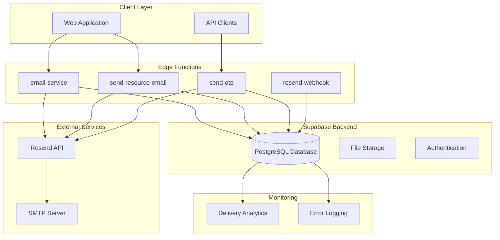
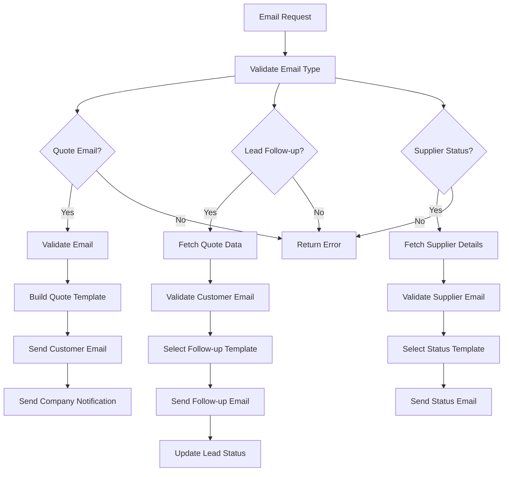
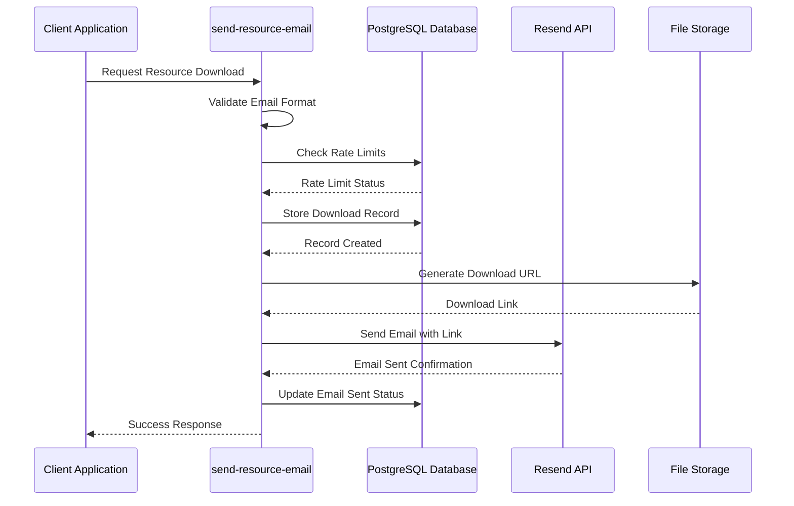
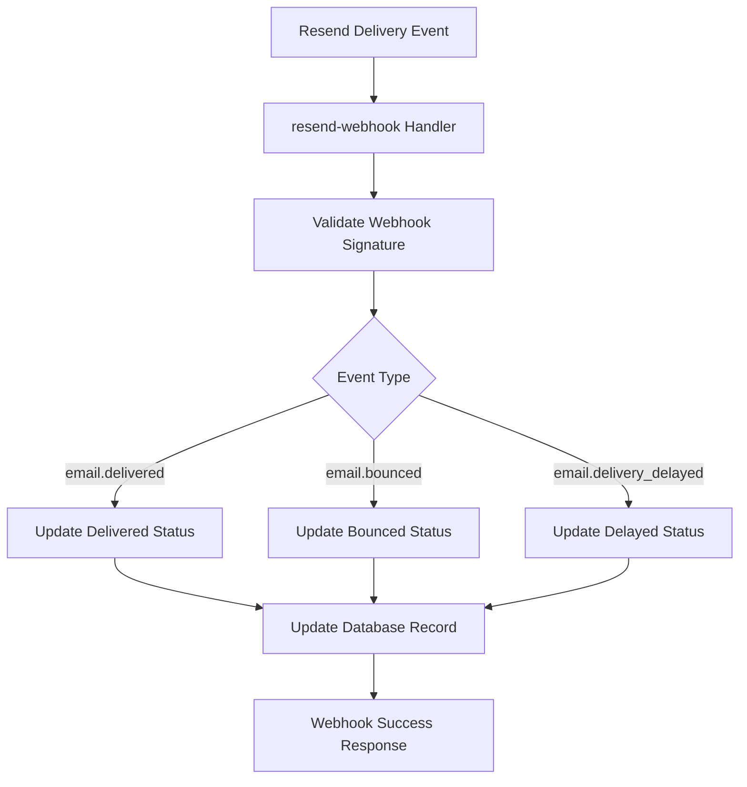
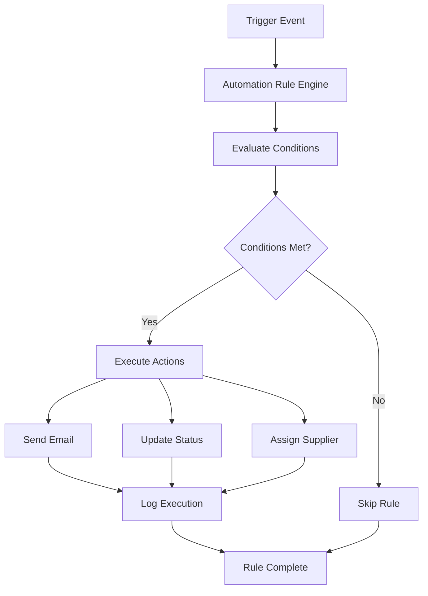

# Email Services

<cite>
**Referenced Files in This Document**
- [email-service/index.ts](file://supabase/functions/email-service/index.ts)
- [send-resource-email/index.ts](file://supabase/functions/send-resource-email/index.ts)
- [resend-webhook/index.ts](file://supabase/functions/resend-webhook/index.ts)
- [execute-automation-rules/index.ts](file://supabase/functions/execute-automation-rules/index.ts)
- [send-otp/index.ts](file://supabase/functions/send-otp/index.ts)
- [ai-quote-generator/index.ts](file://supabase/functions/ai-quote-generator/index.ts)
- [20251124153707_081333e0-a3e1-48b0-bf13-2cea6f895f71.sql](file://supabase/migrations/20251124153707_081333e0-a3e1-48b0-bf13-2cea6f895f71.sql)
- [20251126153950_c7e943cb-2683-48e9-9c3a-6016f721a744.sql](file://supabase/migrations/20251126153950_c7e943cb-2683-48e9-9c3a-6016f721a744.sql)
- [20251126173430_ebd0f1c8-4897-4156-9576-206e95a66988.sql](file://supabase/migrations/20251126173430_ebd0f1c8-4897-4156-9576-206e95a66988.sql)
- [20251119140029_887f03c6-bdb2-46d4-ac7b-4b4868f9a169.sql](file://supabase/migrations/20251119140029_887f03c6-bdb2-46d4-ac7b-4b4868f9a169.sql)
- [20251126173430_ebd0f1c8-4897-4156-9576-206e95a66988.sql](file://supabase/migrations/20251126173430_ebd0f1c8-4897-4156-9576-206e95a66988.sql)
</cite>

## Table of Contents
1. [Introduction](#introduction)
2. [System Architecture](#system-architecture)
3. [Email Service Functions](#email-service-functions)
4. [Resource Distribution Service](#resource-distribution-service)
5. [Email Validation and Security](#email-validation-and-security)
6. [Delivery Tracking and Reliability](#delivery-tracking-and-reliability)
7. [Rate Limiting Implementation](#rate-limiting-implementation)
8. [Template Management System](#template-management-system)
9. [Event-Driven Notifications](#event-driven-notifications)
10. [Best Practices and Monitoring](#best-practices-and-monitoring)
11. [Troubleshooting Guide](#troubleshooting-guide)

## Introduction

SleekApparels v100 implements a comprehensive email service ecosystem designed to handle transactional communications, marketing materials distribution, and automated notifications. The system leverages Resend API for reliable email delivery while incorporating advanced security measures, rate limiting, and delivery tracking capabilities.

The email services consist of two primary functions:
- **email-service**: Handles transactional emails for quotes, lead follow-ups, and supplier status notifications
- **send-resource-email**: Manages marketing material distribution with sophisticated rate limiting and tracking

Both systems incorporate robust validation, spam prevention, and reliability features to maintain high deliverability rates and ensure secure communication channels.

## System Architecture

The email services architecture follows a serverless function pattern with Supabase integration, providing scalable and reliable email delivery capabilities.



**Diagram sources**
- [email-service/index.ts](file://supabase/functions/email-service/index.ts#L1-L50)
- [send-resource-email/index.ts](file://supabase/functions/send-resource-email/index.ts#L1-L50)
- [resend-webhook/index.ts](file://supabase/functions/resend-webhook/index.ts#L1-L50)

## Email Service Functions

### Transactional Email Service

The email-service function handles critical business communications including quote confirmations, lead follow-ups, and supplier status notifications.

#### Core Features

**Multi-Type Email Support**
- **Quote Confirmations**: Automated quote delivery with detailed manufacturing estimates
- **Lead Follow-ups**: Personalized re-engagement campaigns with three template types
- **Supplier Status Notifications**: Verification, rejection, and suspension notifications

**Advanced Template System**
The system supports dynamic content insertion with personalization tokens and responsive HTML design:



**Diagram sources**
- [email-service/index.ts](file://supabase/functions/email-service/index.ts#L186-L210)

#### Quote Email Processing

The quote email system provides comprehensive manufacturing estimates with:
- **Dynamic Pricing Calculation**: Real-time cost breakdowns with unit prices and total amounts
- **Product Specification Details**: Fabric types, quantities, and customization options
- **Timeline Information**: Delivery estimates and production stages
- **Additional Requests**: Swatch kits, newsletter subscriptions, and custom requirements

#### Lead Follow-up Campaigns

Three distinct follow-up templates optimize customer engagement:
- **Gentle Reminder**: Non-aggressive re-engagement with detailed quote summaries
- **Discount Offer**: Limited-time promotions with percentage discounts
- **Urgent Reminder**: Time-sensitive pricing guarantees and delivery deadlines

#### Supplier Status Notifications

Automated supplier communication includes:
- **Verification Success**: Welcome messages with dashboard access links
- **Application Rejection**: Constructive feedback with improvement suggestions
- **Account Suspension**: Clear communication with resolution steps

**Section sources**
- [email-service/index.ts](file://supabase/functions/email-service/index.ts#L186-L555)

### Resource Distribution Service

The send-resource-email function manages marketing material distribution with sophisticated rate limiting and tracking capabilities.

#### Resource Management

**Supported Resources**
- **Buyer's Guide**: Comprehensive 25-page manufacturing guide
- **Material Charts**: Comparative analysis of fabric types and specifications

#### Distribution Workflow



**Diagram sources**
- [send-resource-email/index.ts](file://supabase/functions/send-resource-email/index.ts#L73-L231)

**Section sources**
- [send-resource-email/index.ts](file://supabase/functions/send-resource-email/index.ts#L1-L232)

## Email Validation and Security

### Comprehensive Email Validation

The system implements multi-layered email validation to prevent spam and ensure delivery reliability:

**Format Validation**
- **Regex Pattern Matching**: Strict RFC 5322 compliance with comprehensive validation
- **Length Constraints**: Minimum 5 characters, maximum 254 characters
- **Domain Validation**: Proper domain structure with subdomain support
- **Local Part Validation**: Maximum 64 character limit for email usernames

**Security Measures**
- **Disposable Email Blocking**: Blacklist of 12 common temporary email domains
- **Consecutive Character Prevention**: Protection against malformed email addresses
- **Header Injection Prevention**: Sanitization of email content to prevent attacks

### Spam Prevention Techniques

**Domain Blacklisting**
The system maintains an extensive blacklist of disposable email providers including:
- tempmail.com, throwaway.email, 10minutemail.com
- guerrillamail.com, mailinator.com, maildrop.cc
- trashmail.com, yopmail.com, temp-mail.org
- fakeinbox.com, sharklasers.com, getnada.com

**Content Filtering**
- **HTML Sanitization**: Prevents malicious script injection in email content
- **Attachment Validation**: Ensures file types meet security standards
- **Link Verification**: Validates external links before inclusion

**Section sources**
- [email-service/index.ts](file://supabase/functions/email-service/index.ts#L12-L70)
- [send-resource-email/index.ts](file://supabase/functions/send-resource-email/index.ts#L12-L41)

## Delivery Tracking and Reliability

### Resend API Integration

The system leverages Resend API for reliable email delivery with comprehensive tracking capabilities:

**Delivery Status Tracking**
- **Pending**: Initial state before sending
- **Sent**: Successfully queued for delivery
- **Delivered**: Confirmed delivery to recipient inbox
- **Failed**: Permanent delivery failure
- **Bounced**: Temporary delivery failure requiring retry

### Webhook-Based Delivery Monitoring

The resend-webhook function processes Resend delivery events to maintain accurate delivery status:



**Diagram sources**
- [resend-webhook/index.ts](file://supabase/functions/resend-webhook/index.ts#L69-L103)

### Retry Mechanisms

**Transient Failure Handling**
The system implements intelligent retry logic for recoverable delivery failures:
- **Rate Limiting**: Automatic retry with exponential backoff
- **Temporary Failures**: Network timeouts and service unavailability
- **Delivery Delays**: Temporary recipient inbox issues

**Permanent Failure Management**
- **Bounce Detection**: Immediate failure categorization
- **Blacklist Updates**: Automatic addition of problematic domains
- **User Notification**: Alerts for persistent delivery issues

### Delivery Status Logging

The resource_downloads table tracks all email distribution activities:

| Column | Type | Purpose |
|--------|------|---------|
| id | UUID | Primary key for record identification |
| email | TEXT | Recipient email address |
| full_name | TEXT | Personalized name field |
| company_name | TEXT | Company affiliation |
| resource_type | TEXT | Type of resource downloaded |
| source | TEXT | Origin of download request |
| ip_address | TEXT | Client IP address |
| user_agent | TEXT | Browser/device information |
| email_sent | BOOLEAN | Delivery confirmation flag |
| email_sent_at | TIMESTAMPTZ | Timestamp of successful delivery |
| created_at | TIMESTAMPTZ | Record creation timestamp |

**Section sources**
- [resend-webhook/index.ts](file://supabase/functions/resend-webhook/index.ts#L1-L118)
- [20251126153950_c7e943cb-2683-48e9-9c3a-6016f721a744.sql](file://supabase/migrations/20251126153950_c7e943cb-2683-48e9-9c3a-6016f721a744.sql#L1-L34)

## Rate Limiting Implementation

### Multi-Level Rate Control

The system implements tiered rate limiting to prevent abuse while maintaining service availability:

**Resource Download Rate Limiting**
- **Daily Limit**: 3 downloads per email address per 24-hour period
- **Time Window**: Rolling 24-hour window with automatic reset
- **Tracking Method**: Database-based counting with efficient indexing

**Implementation Details**
```typescript
// Rate limiting calculation
const oneDayAgo = new Date(Date.now() - 24 * 60 * 60 * 1000).toISOString();
const { count } = await supabase
  .from('resource_downloads')
  .select('*', { count: 'exact', head: true })
  .eq('email', email.toLowerCase())
  .gte('created_at', oneDayAgo);

if (count !== null && count >= 3) {
  return new Response(
    JSON.stringify({ error: 'Rate limit exceeded. Please try again tomorrow.' }),
    { status: 429, headers: { ...corsHeaders, "Content-Type": "application/json" } }
  );
}
```

### Quote Request Rate Limiting

**Tiered Access Control**
- **Authenticated Users**: 20 quote requests per day
- **Anonymous Users**: 3 quote requests per session
- **Session-Based Tracking**: IP-bound session validation

**Security Enhancements**
- **IP Binding**: Session validation tied to originating IP address
- **Window Reduction**: Session windows reduced from 2 hours to 5 minutes for enhanced security
- **Attempt Monitoring**: Failed attempt logging for abuse detection

### Rate Limiting Benefits

**Service Protection**
- **Abuse Prevention**: Mitigation of automated scraping and spam attempts
- **Resource Optimization**: Efficient allocation of computational resources
- **Quality Assurance**: Maintaining service quality under high load

**User Experience**
- **Fair Usage**: Equitable access to service features
- **Predictable Limits**: Clear boundaries for service usage
- **Graceful Degradation**: Informative error messages with retry guidance

**Section sources**
- [send-resource-email/index.ts](file://supabase/functions/send-resource-email/index.ts#L95-L108)
- [ai-quote-generator/index.ts](file://supabase/functions/ai-quote-generator/index.ts#L37-L378)

## Template Management System

### Dynamic Content Generation

The email system supports sophisticated template management with dynamic content insertion:

**Personalization Tokens**
- **Customer Name**: `{customer_name}` for personalized greetings
- **Quote Details**: `{quote_total_price}`, `{quote_unit_price}`, `{quote_timeline}`
- **Product Information**: `{product_type}`, `{quantity}`, `{fabric_type}`
- **Company Branding**: `{company_name}`, `{brand_color}`, `{brand_logo}`

**Responsive HTML Design**
Templates are built with mobile-first responsive design principles:
- **Fluid Layouts**: Adaptive column widths for various screen sizes
- **Flexible Images**: Scalable graphics with appropriate fallbacks
- **Touch-Friendly Elements**: Appropriate button sizes and spacing
- **Email Client Compatibility**: Cross-platform rendering optimization

### Template Categories

**Transactional Templates**
- **Quote Confirmations**: Detailed manufacturing estimates with pricing breakdowns
- **Order Notifications**: Purchase confirmations and order status updates
- **Shipping Updates**: Delivery tracking and shipment notifications
- **Customer Support**: Help desk communications and issue resolutions

**Marketing Templates**
- **Welcome Series**: Onboarding sequences for new subscribers
- **Promotional Offers**: Special deals and limited-time discounts
- **Educational Content**: Industry insights and best practices
- **Product Launches**: New product announcements and features

### Content Management Features

**Version Control**
- **Template History**: Complete revision tracking and rollback capabilities
- **A/B Testing**: Parallel template testing for optimization
- **Approval Workflows**: Editorial review processes for content changes

**Localization Support**
- **Multi-Language Templates**: Regional content adaptation
- **Currency Formatting**: Automatic currency conversion and display
- **Date/Time Localization**: Appropriate timezone handling

**Section sources**
- [email-service/index.ts](file://supabase/functions/email-service/index.ts#L111-L184)
- [send-resource-email/index.ts](file://supabase/functions/send-resource-email/index.ts#L138-L199)

## Event-Driven Notifications

### Automation Rules System

The execute-automation-rules function enables sophisticated event-driven email notifications:

**Rule Engine Architecture**


**Diagram sources**
- [execute-automation-rules/index.ts](file://supabase/functions/execute-automation-rules/index.ts#L68-L100)

### Supported Event Triggers

**Quote Management Events**
- **Quote Creation**: Automated welcome emails for new quote requests
- **Status Changes**: Notifications for quote approval, rejection, or modification
- **Deadline Reminders**: Proactive reminders for upcoming quote expirations
- **Follow-up Campaigns**: Automated re-engagement sequences

**Order Processing Events**
- **Order Confirmation**: Receipt acknowledgments and order details
- **Production Updates**: Manufacturing progress notifications
- **Shipping Notifications**: Tracking information and delivery estimates
- **Quality Inspections**: Inspection results and quality assurance updates

**Supplier Management Events**
- **Application Status**: Supplier registration outcome notifications
- **Performance Alerts**: Capacity utilization and delivery performance updates
- **Contract Renewals**: Contract expiration and renewal reminder notifications
- **Compliance Updates**: Regulatory compliance and certification reminders

### Action Types

**Email Actions**
- **Single Recipient Emails**: Direct notifications to specific individuals
- **Broadcast Emails**: Mass communications to subscriber lists
- **Conditional Emails**: Targeted messaging based on user behavior
- **Scheduled Emails**: Future-dated email delivery

**System Actions**
- **Status Updates**: Database record modifications
- **Workflow Transitions**: Process state changes
- **Resource Allocation**: Supplier and capacity assignments
- **Notification Queuing**: Deferred notification scheduling

**Section sources**
- [execute-automation-rules/index.ts](file://supabase/functions/execute-automation-rules/index.ts#L1-L169)

## Best Practices and Monitoring

### Deliverability Optimization

**Domain Authentication**
- **SPF Records**: Sender Policy Framework for domain authentication
- **DKIM Signing**: DomainKeys Identified Mail for message integrity
- **DMARC Policies**: Domain-based Message Authentication, Reporting & Conformance
- **Reverse DNS**: Proper PTR record configuration for outbound servers

**Content Optimization**
- **Spam Score Minimization**: Content analysis and optimization
- **Engagement Metrics**: Open rates, click-through rates, and conversion tracking
- **List Hygiene**: Regular cleaning of email lists and suppression management
- **Segmentation Strategies**: Targeted messaging based on user preferences

### Monitoring and Analytics

**Delivery Metrics**
- **Success Rates**: Percentage of successfully delivered emails
- **Bounce Rates**: Permanent delivery failure analysis
- **Open Rates**: Engagement measurement and content optimization
- **Click-through Rates**: Link engagement and content effectiveness

**Performance Monitoring**
- **Delivery Latency**: Time from send request to delivery confirmation
- **API Response Times**: Function execution performance monitoring
- **Error Rates**: Failure analysis and system reliability tracking
- **Resource Utilization**: Cost optimization and scaling analysis

### Security Best Practices

**Access Control**
- **Role-Based Permissions**: Granular access control for email functions
- **API Key Management**: Secure storage and rotation of authentication credentials
- **Audit Logging**: Comprehensive logging of all email-related activities
- **Rate Limit Enforcement**: Protection against abuse and denial-of-service attacks

**Data Protection**
- **Encryption in Transit**: TLS encryption for all email communications
- **Data Retention Policies**: Appropriate data lifecycle management
- **Privacy Compliance**: GDPR and CCPA compliance measures
- **Secure Storage**: Encrypted storage of sensitive email data

## Troubleshooting Guide

### Common Issues and Solutions

**Email Delivery Failures**

**Issue**: Emails not reaching recipients
**Diagnosis Steps**:
1. Check Resend API status and quotas
2. Verify recipient email format and domain
3. Review delivery logs for specific error codes
4. Check spam filters and blacklists

**Solution**: 
- Validate email addresses using the built-in validation system
- Monitor delivery status through webhook callbacks
- Review and update domain authentication records
- Implement proper sender reputation management

**Rate Limiting Issues**

**Issue**: Rate limit errors during high-volume operations
**Diagnosis Steps**:
1. Monitor rate limit counters in real-time
2. Analyze request patterns and timing
3. Check for session-based vs. user-based limits
4. Review quota consumption trends

**Solution**:
- Implement exponential backoff for retry logic
- Distribute requests across multiple time windows
- Upgrade rate limits for high-volume use cases
- Use batch processing for bulk operations

**Template Rendering Problems**

**Issue**: Emails displaying incorrectly across clients
**Diagnosis Steps**:
1. Test templates across major email clients
2. Validate HTML and CSS compatibility
3. Check for unsupported email client features
4. Review responsive design breakpoints

**Solution**:
- Use email-safe HTML and CSS practices
- Implement fallback designs for unsupported features
- Test with popular email preview tools
- Maintain browser compatibility matrices

### Debugging Tools and Techniques

**Logging and Monitoring**
- Enable detailed logging for all email operations
- Implement structured logging for analytics
- Set up alerts for delivery failures and rate limit breaches
- Monitor system health metrics and performance indicators

**Testing Strategies**
- Use staging environments for template development
- Implement automated email testing suites
- Conduct manual testing across multiple devices and clients
- Perform A/B testing for template optimization

**Section sources**
- [resend-webhook/index.ts](file://supabase/functions/resend-webhook/index.ts#L104-L118)
- [email-service/index.ts](file://supabase/functions/email-service/index.ts#L211-L218)