# Marketing Emails

<cite>
**Referenced Files in This Document**
- [ResourceDownloadModal.tsx](file://src/components/ResourceDownloadModal.tsx)
- [ResourcesSection.tsx](file://src/components/ResourcesSection.tsx)
- [send-resource-email/index.ts](file://supabase/functions/send-resource-email/index.ts)
- [email-service/index.ts](file://supabase/functions/email-service/index.ts)
- [resource_downloads table migration](file://supabase/migrations/20251126153950_c7e943cb-2683-48e9-9c3a-6016f721a744.sql)
- [RateLimitMonitoringDashboard.tsx](file://src/components/admin/RateLimitMonitoringDashboard.tsx)
- [analyticsTracking.ts](file://src/lib/analyticsTracking.ts)
</cite>

## Table of Contents
1. [Introduction](#introduction)
2. [System Architecture](#system-architecture)
3. [Core Components](#core-components)
4. [Rate Limiting Implementation](#rate-limiting-implementation)
5. [Email Validation Process](#email-validation-process)
6. [Responsive HTML Email Templates](#responsive-html-email-templates)
7. [Delivery Status Tracking](#delivery-status-tracking)
8. [Resend API Integration](#resend-api-integration)
9. [Storage and Analytics](#storage-and-analytics)
10. [Frontend Integration](#frontend-integration)
11. [Error Handling](#error-handling)
12. [Performance Considerations](#performance-considerations)
13. [Troubleshooting Guide](#troubleshooting-guide)

## Introduction

The marketing email service in sleekapp-v100 provides a comprehensive solution for distributing valuable marketing materials to potential customers. The system enables users to download free resources like the Buyer's Guide and Material Chart through a controlled distribution mechanism that includes rate limiting, email validation, and analytics tracking.

The service is built around the `send-resource-email` function, which handles the complete workflow from user request to email delivery, ensuring compliance with anti-spam regulations while maintaining excellent user experience.

## System Architecture

The marketing email system follows a serverless architecture with Supabase edge functions as the core processing layer:

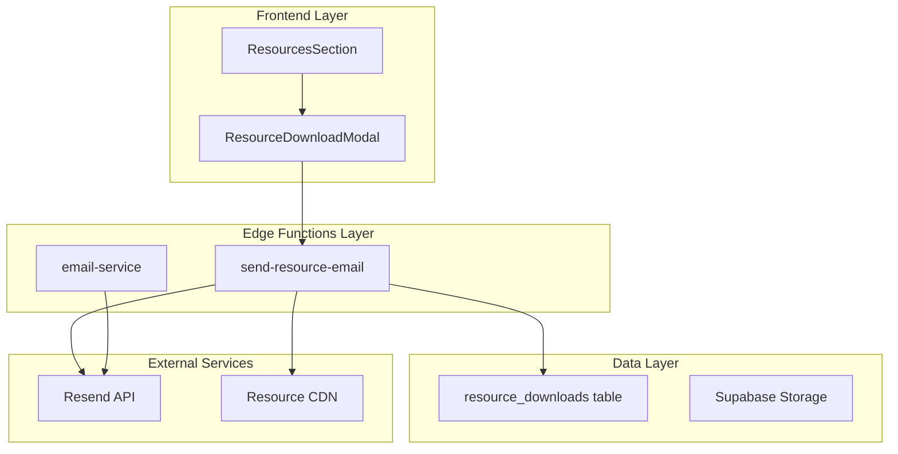

**Diagram sources**
- [ResourceDownloadModal.tsx](file://src/components/ResourceDownloadModal.tsx#L1-L187)
- [send-resource-email/index.ts](file://supabase/functions/send-resource-email/index.ts#L1-L232)

**Section sources**
- [ResourceDownloadModal.tsx](file://src/components/ResourceDownloadModal.tsx#L1-L187)
- [send-resource-email/index.ts](file://supabase/functions/send-resource-email/index.ts#L1-L232)

## Core Components

### ResourceDownloadModal Component

The frontend interface for resource downloads provides a clean, user-friendly form that captures essential information while implementing basic validation:

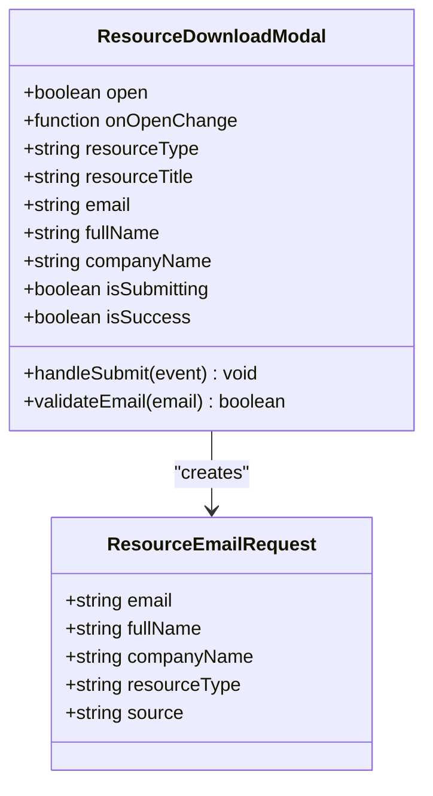

**Diagram sources**
- [ResourceDownloadModal.tsx](file://src/components/ResourceDownloadModal.tsx#L10-L15)
- [send-resource-email/index.ts](file://supabase/functions/send-resource-email/index.ts#L43-L49)

### send-resource-email Function

The core edge function orchestrates the entire resource distribution process:

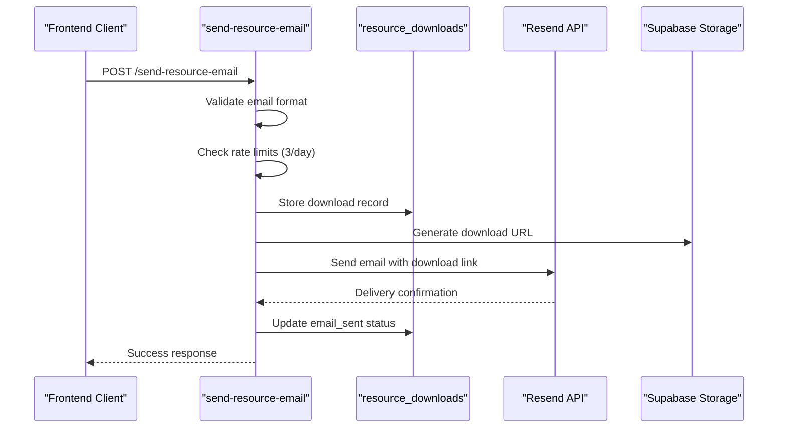

**Diagram sources**
- [send-resource-email/index.ts](file://supabase/functions/send-resource-email/index.ts#L66-L232)

**Section sources**
- [ResourceDownloadModal.tsx](file://src/components/ResourceDownloadModal.tsx#L29-L78)
- [send-resource-email/index.ts](file://supabase/functions/send-resource-email/index.ts#L66-L232)

## Rate Limiting Implementation

The system implements a sophisticated rate limiting mechanism to prevent abuse while allowing legitimate users to access resources:

### Daily Rate Limiting

Each email address is limited to 3 downloads per day:

| Component | Implementation | Purpose |
|-----------|---------------|---------|
| **Time Window** | 24-hour rolling window | Ensures fair distribution |
| **Counting Method** | Database query with `created_at` filtering | Tracks individual email usage |
| **Threshold** | 3 downloads per email | Prevents abuse while allowing reasonable access |
| **Error Response** | HTTP 429 with "Rate limit exceeded" | Clear feedback to users |

### Database Implementation

The `resource_downloads` table includes comprehensive indexing for efficient rate limiting:

```sql
-- Rate limiting query pattern
SELECT COUNT(*) FROM resource_downloads
WHERE email = ?
AND created_at >= ?
```

**Section sources**
- [send-resource-email/index.ts](file://supabase/functions/send-resource-email/index.ts#L95-L107)
- [resource_downloads table migration](file://supabase/migrations/20251126153950_c7e943cb-2683-48e9-9c3a-6016f721a744.sql#L95-L107)

## Email Validation Process

The system implements comprehensive email validation to ensure quality and prevent abuse:

### Validation Pipeline

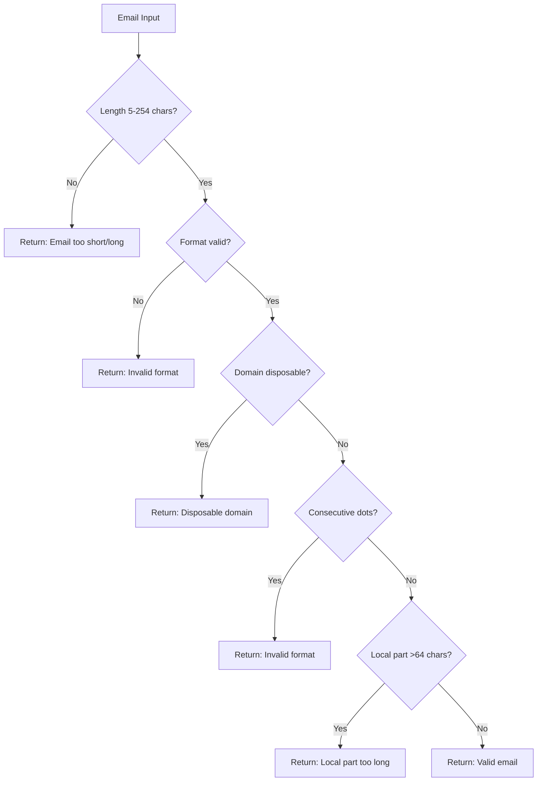

**Diagram sources**
- [send-resource-email/index.ts](file://supabase/functions/send-resource-email/index.ts#L20-L41)
- [email-service/index.ts](file://supabase/functions/email-service/index.ts#L22-L64)

### Disposable Domain Blocking

The system maintains an extensive blacklist of disposable email domains:

| Category | Domains Blocked |
|----------|----------------|
| **Temporary Mail** | tempmail.com, 10minutemail.com, guerrillamail.com |
| **Throwaway Services** | throwaway.email, mailinator.com, yopmail.com |
| **Trash Mail** | trashmail.com, fakeinbox.com, getnada.com |
| **Other** | temp-mail.org, sharklasers.com |

**Section sources**
- [send-resource-email/index.ts](file://supabase/functions/send-resource-email/index.ts#L13-L19)
- [email-service/index.ts](file://supabase/functions/email-service/index.ts#L15-L20)

## Responsive HTML Email Templates

The system generates professional, branded HTML emails optimized for all devices:

### Template Structure

The email templates follow a consistent structure with branded design elements:

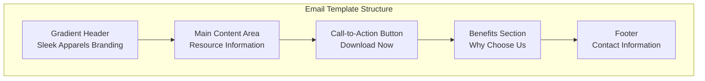

**Diagram sources**
- [send-resource-email/index.ts](file://supabase/functions/send-resource-email/index.ts#L142-L198)

### Branded Design Elements

| Element | Implementation | Purpose |
|---------|---------------|---------|
| **Gradient Header** | `linear-gradient(135deg, #2d5016 0%, #4a7c2c 100%)` | Brand identity |
| **Primary Color** | `#2d5016` (dark green) | Professional appearance |
| **Secondary Color** | `#4a7c2c` (medium green) | Complementary accent |
| **Typography** | Arial, sans-serif | Readability across devices |
| **Button Style** | Solid green with white text | Clear call-to-action |

### Responsive Design Features

The templates include responsive design elements for optimal viewing:

- **Max Width**: 600px container for desktop readability
- **Flexible Layout**: Percentage-based widths for mobile adaptation
- **Font Scaling**: Relative sizing for different screen sizes
- **Touch Targets**: Minimum 44px touch areas for buttons

**Section sources**
- [send-resource-email/index.ts](file://supabase/functions/send-resource-email/index.ts#L142-L198)

## Delivery Status Tracking

The system provides comprehensive tracking of email delivery status:

### Tracking Mechanism

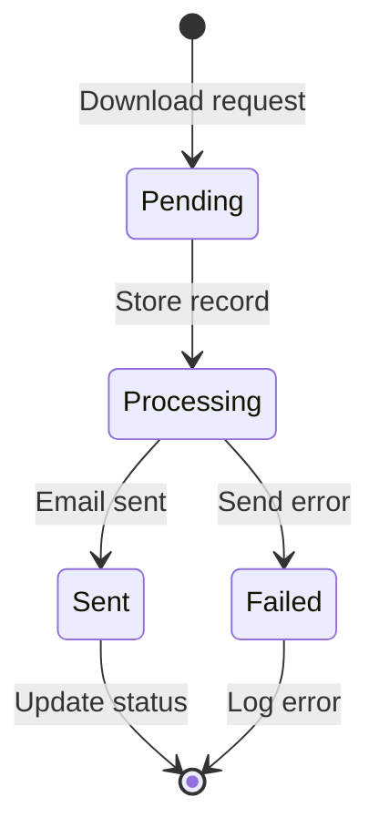

**Diagram sources**
- [send-resource-email/index.ts](file://supabase/functions/send-resource-email/index.ts#L201-L208)

### Database Fields for Tracking

| Field | Type | Purpose | Default Value |
|-------|------|---------|---------------|
| `email_sent` | BOOLEAN | Delivery confirmation | `false` |
| `email_sent_at` | TIMESTAMPTZ | Delivery timestamp | NULL |
| `ip_address` | TEXT | Client IP for analytics | NULL |
| `user_agent` | TEXT | Browser/device info | NULL |

### Update Process

The system updates the `resource_downloads` table with delivery status:

```sql
UPDATE resource_downloads 
SET email_sent = true, 
    email_sent_at = NOW() 
WHERE id = ?
```

**Section sources**
- [send-resource-email/index.ts](file://supabase/functions/send-resource-email/index.ts#L201-L208)
- [resource_downloads table migration](file://supabase/migrations/20251126153950_c7e943cb-2683-48e9-9c3a-6016f721a744.sql#L11-L12)

## Resend API Integration

The system integrates with Resend for reliable email delivery:

### API Configuration

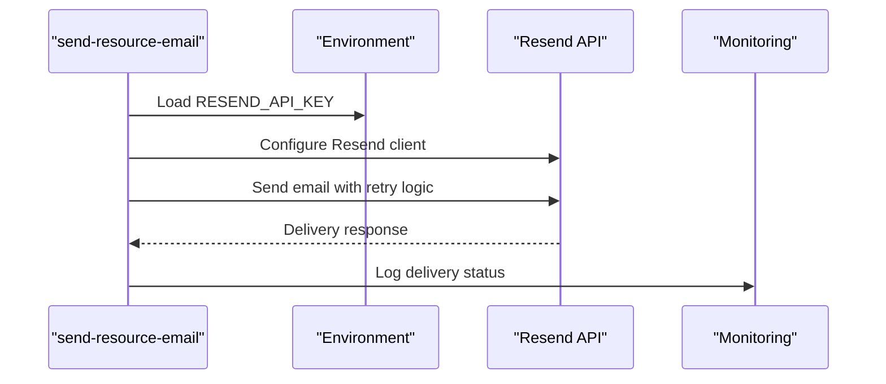

**Diagram sources**
- [send-resource-email/index.ts](file://supabase/functions/send-resource-email/index.ts#L10-L11)

### Retry Logic

The system implements robust retry logic for transient failures:

| Retry Attempt | Delay | Purpose |
|---------------|-------|---------|
| 1st | Immediate | Quick recovery from temporary issues |
| 2nd | 1 second | Additional attempt for network delays |
| Max Attempts | 2 | Prevent infinite loops |

### Error Handling

The Resend integration includes comprehensive error handling:

- **Rate Limiting**: Automatic retry with exponential backoff
- **Timeout Handling**: Configurable timeout periods
- **Service Unavailability**: Graceful degradation
- **Delivery Failures**: Detailed logging and user feedback

**Section sources**
- [send-resource-email/index.ts](file://supabase/functions/send-resource-email/index.ts#L10-L11)
- [send-resource-email/index.ts](file://supabase/functions/send-resource-email/index.ts#L201-L208)

## Storage and Analytics

### Download Record Storage

The system stores comprehensive metadata for analytics and compliance:

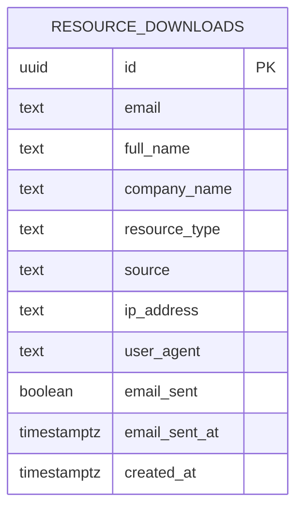

**Diagram sources**
- [resource_downloads table migration](file://supabase/migrations/20251126153950_c7e943cb-2683-48e9-9c3a-6016f721a744.sql#L2-L14)

### Analytics Collection

The system collects valuable analytics data:

| Metric | Purpose | Implementation |
|--------|---------|---------------|
| **IP Address** | Geographic analysis, fraud detection | Request header parsing |
| **User Agent** | Device/browser analytics | Header extraction |
| **Source Tracking** | Campaign effectiveness | Request parameter |
| **Download Frequency** | User engagement patterns | Rate limiting queries |

### Row Level Security (RLS)

The database implements strict access controls:

- **Service Role**: Can insert records (edge functions)
- **Admin Role**: Can view all downloads
- **User Isolation**: Records linked to authenticated users

**Section sources**
- [resource_downloads table migration](file://supabase/migrations/20251126153950_c7e943cb-2683-48e9-9c3a-6016f721a744.sql#L21-L34)

## Frontend Integration

### ResourceDownloadModal Invocation

The frontend component integrates seamlessly with the backend service:

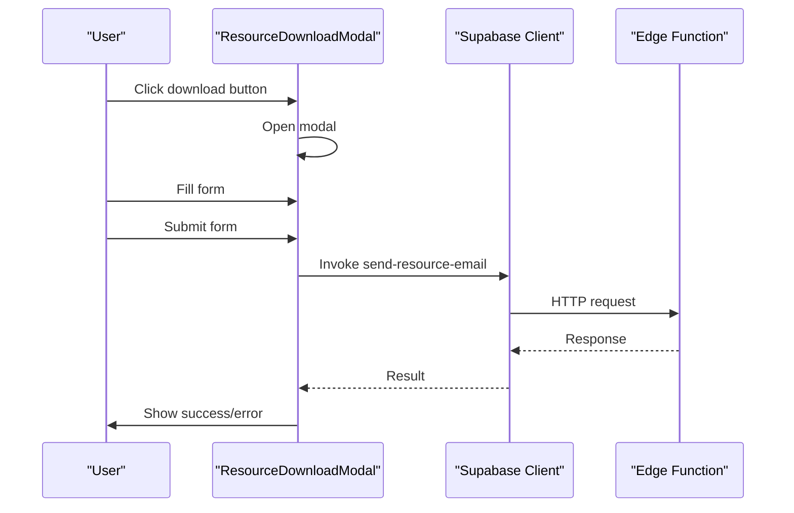

**Diagram sources**
- [ResourceDownloadModal.tsx](file://src/components/ResourceDownloadModal.tsx#L29-L78)

### Resource Selection Flow

The ResourcesSection component manages resource selection:

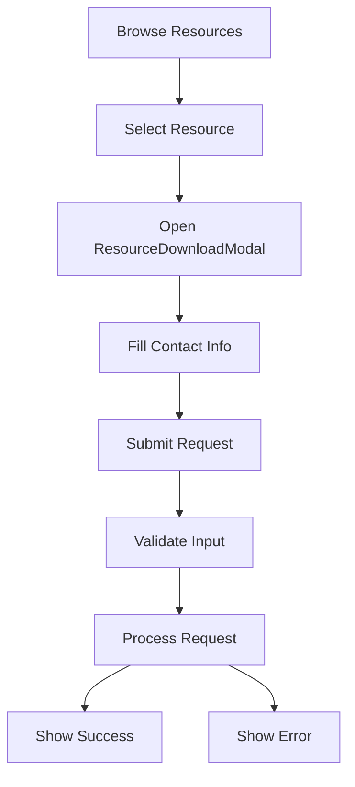

**Diagram sources**
- [ResourcesSection.tsx](file://src/components/ResourcesSection.tsx#L31-L34)
- [ResourceDownloadModal.tsx](file://src/components/ResourceDownloadModal.tsx#L29-L78)

**Section sources**
- [ResourcesSection.tsx](file://src/components/ResourcesSection.tsx#L1-L88)
- [ResourceDownloadModal.tsx](file://src/components/ResourceDownloadModal.tsx#L1-L187)

## Error Handling

### Frontend Error Management

The system provides comprehensive error handling with user-friendly feedback:

| Error Type | Frontend Handler | User Message | Recovery Action |
|------------|------------------|--------------|-----------------|
| **Invalid Email** | Regex validation | "Please enter a valid email address" | Continue editing |
| **Rate Limit** | HTTP 429 response | "You've reached the download limit" | Try again tomorrow |
| **Disposable Email** | Domain validation | "Please use a permanent email address" | Use different email |
| **Network Error** | Generic handler | "Failed to send resource" | Retry submission |

### Backend Error Handling

The edge function implements robust error handling:

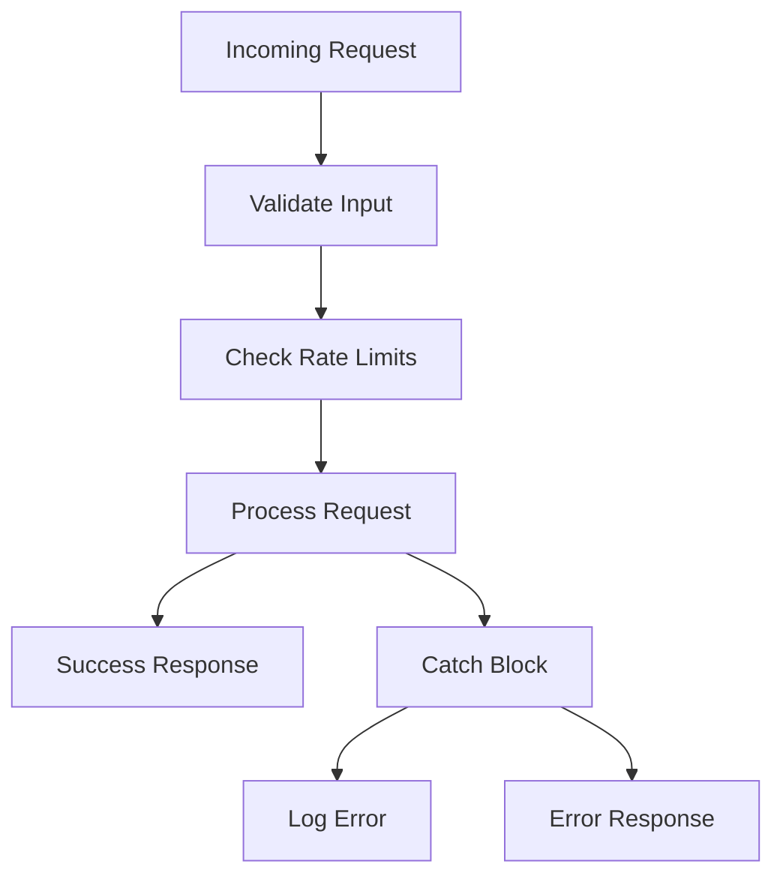

**Diagram sources**
- [send-resource-email/index.ts](file://supabase/functions/send-resource-email/index.ts#L221-L228)

### Error Response Patterns

The system returns standardized error responses:

```typescript
// Rate limit error
{
  error: "Rate limit exceeded. Please try again tomorrow."
}

// Validation error  
{
  error: "Invalid email format. Please provide a valid email address"
}

// System error
{
  error: "Failed to process request"
}
```

**Section sources**
- [ResourceDownloadModal.tsx](file://src/components/ResourceDownloadModal.tsx#L69-L75)
- [send-resource-email/index.ts](file://supabase/functions/send-resource-email/index.ts#L221-L228)

## Performance Considerations

### Optimization Strategies

The system implements several performance optimizations:

| Strategy | Implementation | Benefit |
|----------|---------------|---------|
| **Indexing** | Composite indexes on email, created_at | Fast rate limiting queries |
| **Async Processing** | Non-blocking email sending | Improved user experience |
| **Caching** | Edge function caching | Reduced latency |
| **Connection Pooling** | Supabase client reuse | Efficient database access |

### Scalability Features

- **Horizontal Scaling**: Edge functions scale automatically
- **Database Optimization**: Proper indexing for high-volume queries
- **CDN Integration**: Static resource delivery from CDN
- **Graceful Degradation**: Fallback mechanisms for failures

### Monitoring and Alerting

The system includes monitoring capabilities:

- **Rate Limit Monitoring**: Dashboard for tracking usage patterns
- **Error Rates**: Automated alerting for high error rates
- **Delivery Metrics**: Email bounce and open rate tracking
- **Performance Metrics**: Response time monitoring

**Section sources**
- [RateLimitMonitoringDashboard.tsx](file://src/components/admin/RateLimitMonitoringDashboard.tsx#L61-L165)

## Troubleshooting Guide

### Common Issues and Solutions

#### Rate Limit Exceeded
**Symptoms**: User receives "Rate limit exceeded" message
**Causes**: 
- User has reached 3 downloads today
- IP-based rate limiting triggered
- Database query timing issues

**Solutions**:
- Wait until midnight UTC for rate limit reset
- Check user's download history in admin dashboard
- Verify database indexing is functioning correctly

#### Email Validation Failures
**Symptoms**: "Invalid email format" or "Disposable email" errors
**Causes**:
- Malformed email address input
- Domain on disposable email blacklist
- Email length restrictions exceeded

**Solutions**:
- Verify email format matches RFC standards
- Check disposable domain list in code
- Review email length constraints

#### Email Delivery Failures
**Symptoms**: Downloads recorded but no email received
**Causes**:
- Resend API connectivity issues
- Email blocked by recipient provider
- Invalid email address

**Solutions**:
- Check Resend API status and logs
- Verify email address validity
- Review spam filters for recipient domain

#### Database Connection Issues
**Symptoms**: "Failed to process request" errors
**Causes**:
- Supabase service key configuration
- Database connection timeouts
- Row level security policy conflicts

**Solutions**:
- Verify environment variables are set
- Check database connection limits
- Review RLS policy configurations

### Debugging Tools

The system provides several debugging capabilities:

- **Console Logging**: Detailed request/response logging
- **Error Tracking**: Centralized error reporting
- **Analytics Dashboard**: Download and conversion tracking
- **Rate Limit Monitoring**: Real-time usage analysis

**Section sources**
- [RateLimitMonitoringDashboard.tsx](file://src/components/admin/RateLimitMonitoringDashboard.tsx#L61-L165)
- [send-resource-email/index.ts](file://supabase/functions/send-resource-email/index.ts#L221-L228)