# Transactional Emails

<cite>
**Referenced Files in This Document**
- [supabase/functions/email-service/index.ts](file://supabase/functions/email-service/index.ts)
- [src/components/LeadFollowupEmailDialog.tsx](file://src/components/LeadFollowupEmailDialog.tsx)
- [supabase/functions/_shared/logger.ts](file://supabase/functions/_shared/logger.ts)
- [supabase/functions/send-otp/index.ts](file://supabase/functions/send-otp/index.ts)
- [supabase/functions/resend-webhook/index.ts](file://supabase/functions/resend-webhook/index.ts)
- [supabase/functions/execute-automation-rules/index.ts](file://supabase/functions/execute-automation-rules/index.ts)
- [src/components/admin/AutomationRulesManager.tsx](file://src/components/admin/AutomationRulesManager.tsx)
- [README.md](file://README.md)
</cite>

## Table of Contents
1. [Introduction](#introduction)
2. [System Architecture](#system-architecture)
3. [Email Service Function](#email-service-function)
4. [Email Templates](#email-templates)
5. [Email Validation and Security](#email-validation-and-security)
6. [Frontend Integration](#frontend-integration)
7. [Automation Rules](#automation-rules)
8. [Error Handling and Monitoring](#error-handling-and-monitoring)
9. [Best Practices](#best-practices)
10. [Troubleshooting Guide](#troubleshooting-guide)

## Introduction

The transactional email service in sleekapp-v100 is a comprehensive system designed to handle critical business communications for the knitwear manufacturing platform. Built on Supabase Edge Functions and integrated with Resend API, this service manages three distinct types of email communications: quote confirmations, lead follow-ups, and supplier status notifications.

The system ensures reliable, secure, and deliverable email communications while maintaining high standards for user privacy and data protection. It integrates seamlessly with the platform's automation rules and provides robust monitoring capabilities for email delivery and performance tracking.

## System Architecture

The transactional email system follows a serverless architecture with clear separation of concerns:

**Diagram sources**
- [supabase/functions/email-service/index.ts](file://supabase/functions/email-service/index.ts#L186-L218)
- [supabase/functions/send-otp/index.ts](file://supabase/functions/send-otp/index.ts#L131-L149)
- [supabase/functions/resend-webhook/index.ts](file://supabase/functions/resend-webhook/index.ts#L33-L117)

**Section sources**
- [supabase/functions/email-service/index.ts](file://supabase/functions/email-service/index.ts#L1-L20)
- [supabase/functions/_shared/logger.ts](file://supabase/functions/_shared/logger.ts#L1-L173)

## Email Service Function

The core email service is implemented as a Supabase Edge Function that handles all transactional email communications. The service provides three main email types through a unified interface.

### Service Structure

**Diagram sources**
- [supabase/functions/email-service/index.ts](file://supabase/functions/email-service/index.ts#L67-L108)

### Email Types and Handlers

The service supports three distinct email types, each handled by specialized functions:

| Email Type | Purpose | Trigger Conditions | Key Features |
|------------|---------|-------------------|--------------|
| `quote` | Quote confirmations | Quote generation completion | Dual delivery (customer + company), pricing details, next steps |
| `lead-followup` | Customer engagement | Manual admin action or automation | Three template variants, custom message support |
| `supplier-status` | Supplier notifications | Verification status changes | Status-specific templates, reason field support |

**Section sources**
- [supabase/functions/email-service/index.ts](file://supabase/functions/email-service/index.ts#L186-L218)
- [supabase/functions/email-service/index.ts](file://supabase/functions/email-service/index.ts#L221-L352)
- [supabase/functions/email-service/index.ts](file://supabase/functions/email-service/index.ts#L355-L411)
- [supabase/functions/email-service/index.ts](file://supabase/functions/email-service/index.ts#L414-L551)

## Email Templates

The system provides three distinct email templates optimized for different business scenarios and customer engagement strategies.

### Quote Confirmation Template

The quote confirmation template serves as the primary customer acquisition channel, providing comprehensive pricing information and clear next steps.

**Key Features:**
- **Dual Delivery System**: Sends separate emails to customer and internal team
- **Rich HTML Formatting**: Professional design with pricing tables and call-to-action buttons
- **Dynamic Content**: Real-time pricing calculations and product specifications
- **Mobile Responsive**: Optimized for all device types
- **Legal Compliance**: AI-generated disclaimer and contact information

**Template Structure:**
- **Subject Line**: Dynamic quote ID with "Your Manufacturing Quote"
- **Executive Summary**: Product type, quantity, total price, and timeline
- **Pricing Breakdown**: Unit price, total amount, and additional requests
- **Next Steps**: Clear workflow with four sequential actions
- **Contact Information**: Multiple contact channels with WhatsApp integration

### Lead Follow-Up Templates

The lead follow-up system offers three distinct template variants to accommodate different customer engagement strategies:

#### Gentle Template
**Purpose**: Friendly re-engagement for customers who haven't responded
**Use Case**: Initial follow-up after quote delivery
**Content Focus**: Questions about quote, availability for discussion

#### Discount Template  
**Purpose**: Urgent conversion with special incentives
**Use Case**: When customer shows interest but hasn't committed
**Content Focus**: 10% discount offer with time-sensitive language

#### Urgent Template
**Purpose**: Last-chance conversion before quote expiration
**Use Case**: Final attempt to secure commitment
**Content Focus**: Quote expiration warning with pricing guarantees

**Template Features:**
- **Conditional Logic**: Automatic template selection based on criteria
- **Custom Message Support**: Admin-defined personalized content
- **Status Tracking**: Automatic lead status updates upon delivery
- **Analytics Integration**: Event tracking for marketing effectiveness

**Section sources**
- [supabase/functions/email-service/index.ts](file://supabase/functions/email-service/index.ts#L111-L183)
- [src/components/LeadFollowupEmailDialog.tsx](file://src/components/LeadFollowupEmailDialog.tsx#L67-L71)

### Supplier Status Templates

The supplier status system provides professional communication for supplier verification outcomes:

#### Verified Status Template
**Purpose**: Welcome new suppliers to the platform
**Content**: Approval confirmation, next steps, dashboard access
**Design**: Positive, welcoming tone with clear action items

#### Rejected Status Template  
**Purpose**: Professional rejection with constructive feedback
**Content**: Reason for rejection, improvement suggestions, future application encouragement
**Design**: Empathetic yet professional tone

#### Suspended Status Template
**Purpose**: Temporary account restrictions notice
**Content**: Suspension reason, resolution process, contact information
**Design**: Serious but helpful tone

**Section sources**
- [supabase/functions/email-service/index.ts](file://supabase/functions/email-service/index.ts#L447-L531)

## Email Validation and Security

The email service implements comprehensive validation and security measures to ensure reliable delivery and protect against abuse.

### Validation Pipeline

```mermaid
flowchart TD
Start([Email Input]) --> CheckEmpty["Check if email exists"]
CheckEmpty --> EmptyCheck{"Email provided?"}
EmptyCheck --> |No| ReturnError["Return 'Email is required'"]
EmptyCheck --> |Yes| TrimEmail["Trim and lowercase"]
TrimEmail --> LengthCheck["Length validation (5-254 chars)"]
LengthCheck --> LengthValid{"Valid length?"}
LengthValid --> |No| ReturnLengthError["Return length error"]
LengthValid --> |Yes| FormatCheck["Regex format validation"]
FormatCheck --> FormatValid{"Valid format?"}
FormatValid --> |No| ReturnFormatError["Return format error"]
FormatValid --> |Yes| DomainCheck["Domain extraction"]
DomainCheck --> DisposableCheck["Check disposable domains"]
DisposableCheck --> IsDisposable{"Disposable domain?"}
IsDisposable --> |Yes| ReturnDisposableError["Return disposable error"]
IsDisposable --> |No| ConsecutiveDotCheck["Check for consecutive dots"]
ConsecutiveDotCheck --> HasConsecutiveDots{"Has consecutive dots?"}
HasConsecutiveDots --> |Yes| ReturnDotError["Return dot error"]
HasConsecutiveDots --> |No| LocalPartCheck["Local part length check"]
LocalPartCheck --> LocalPartValid{"Local part ≤ 64 chars?"}
LocalPartValid --> |No| ReturnLocalError["Return local part error"]
LocalPartValid --> |Yes| ReturnSuccess["Return validation success"]
ReturnError --> End([Validation Complete])
ReturnLengthError --> End
ReturnFormatError --> End
ReturnDisposableError --> End
ReturnDotError --> End
ReturnLocalError --> End
ReturnSuccess --> End
```

**Diagram sources**
- [supabase/functions/email-service/index.ts](file://supabase/functions/email-service/index.ts#L22-L64)

### Security Measures

| Security Layer | Implementation | Purpose |
|----------------|----------------|---------|
| **Disposable Domain Blocking** | List of 12 common disposable domains | Prevents spam and invalid email addresses |
| **Format Validation** | Comprehensive regex pattern | Ensures RFC-compliant email addresses |
| **Length Constraints** | 5-254 character limits | Prevents buffer overflow and validates practicality |
| **Consecutive Dot Prevention** | Pattern detection | Blocks malformed email addresses |
| **Local Part Limits** | 64 character maximum | Adheres to SMTP standards |
| **PII Sanitization** | Automatic redaction in logs | Protects sensitive information in monitoring |

### API Security

The service implements CORS headers and authentication validation:

- **CORS Headers**: Allow cross-origin requests from trusted domains
- **API Key Validation**: Resend API key verification
- **Request Validation**: JSON schema validation for incoming requests
- **Rate Limiting**: Built-in Resend rate limiting compliance

**Section sources**
- [supabase/functions/email-service/index.ts](file://supabase/functions/email-service/index.ts#L12-L21)
- [supabase/functions/email-service/index.ts](file://supabase/functions/email-service/index.ts#L22-L64)

## Frontend Integration

The frontend provides intuitive interfaces for triggering email communications, with seamless integration between user actions and backend services.

### Lead Follow-Up Dialog

The primary interface for sending lead follow-up emails provides comprehensive customization options:

**Diagram sources**
- [src/components/LeadFollowupEmailDialog.tsx](file://src/components/LeadFollowupEmailDialog.tsx#L31-L64)

### Integration Features

**Frontend Components:**
- **Template Selection**: Dropdown with three predefined templates
- **Custom Message Field**: Optional rich text editor for personalization
- **Real-time Validation**: Immediate feedback on email validity
- **Progress Indication**: Loading states during email processing
- **Error Handling**: Comprehensive error messages with user guidance

**Backend Integration:**
- **Supabase Functions**: Serverless function invocation with typed parameters
- **Database Integration**: Automatic status updates and data retrieval
- **Analytics Tracking**: Business event logging for marketing analysis
- **Toast Notifications**: User feedback through notification system

**Section sources**
- [src/components/LeadFollowupEmailDialog.tsx](file://src/components/LeadFollowupEmailDialog.tsx#L1-L160)

## Automation Rules

The email service integrates with the platform's automation engine to enable programmatic email triggering based on business logic and user behavior.

### Automation Architecture

**Diagram sources**
- [supabase/functions/execute-automation-rules/index.ts](file://supabase/functions/execute-automation-rules/index.ts#L68-L110)
- [src/components/admin/AutomationRulesManager.tsx](file://src/components/admin/AutomationRulesManager.tsx#L21-L165)

### Automation Features

**Rule Management:**
- **Priority System**: Rules execute in configurable priority order
- **Activation Controls**: Enable/disable rules without code changes
- **Execution History**: Track rule performance and results
- **Real-time Execution**: Manual rule execution capability

**Trigger Conditions:**
- **Quote-Based Triggers**: Based on quote creation, status changes, or customer actions
- **Lead-Based Triggers**: Based on lead activity, response times, or engagement levels
- **Supplier-Based Triggers**: Based on verification status changes or performance metrics

**Action Types:**
- **Email Sending**: Direct email service invocation
- **Status Updates**: Database record modifications
- **Workflow Triggers**: Multi-step automation sequences

**Section sources**
- [supabase/functions/execute-automation-rules/index.ts](file://supabase/functions/execute-automation-rules/index.ts#L35-L155)
- [src/components/admin/AutomationRulesManager.tsx](file://src/components/admin/AutomationRulesManager.tsx#L1-L165)

## Error Handling and Monitoring

The email service implements comprehensive error handling and monitoring to ensure reliability and facilitate troubleshooting.

### Error Handling Strategy

**Diagram sources**
- [supabase/functions/email-service/index.ts](file://supabase/functions/email-service/index.ts#L211-L218)
- [supabase/functions/send-otp/index.ts](file://supabase/functions/send-otp/index.ts#L96-L128)

### Monitoring and Logging

The system employs structured logging with automatic PII sanitization:

**Logging Levels:**
- **Info**: General operational messages and successful operations
- **Warn**: Recoverable issues and non-critical problems  
- **Error**: Failures requiring immediate attention
- **Success**: Completed operations with positive outcomes

**PII Protection:**
- **Email Sanitization**: Shows first 3 characters and domain
- **Phone Number Masking**: Preserves international format while hiding digits
- **Order ID Redaction**: Truncates UUIDs to first 8 characters
- **Token Protection**: Redacts passwords, secrets, and API tokens

**Monitoring Features:**
- **Delivery Webhooks**: Real-time delivery status tracking
- **Error Rate Tracking**: Monitor failure patterns and trends
- **Performance Metrics**: Email send times and success rates
- **Retry Analytics**: Track retry attempts and success rates

**Section sources**
- [supabase/functions/_shared/logger.ts](file://supabase/functions/_shared/logger.ts#L1-L173)
- [supabase/functions/resend-webhook/index.ts](file://supabase/functions/resend-webhook/index.ts#L33-L117)
- [supabase/functions/send-otp/index.ts](file://supabase/functions/send-otp/index.ts#L96-L128)

## Best Practices

### Email Deliverability

**Content Optimization:**
- **Clear Subject Lines**: Use descriptive, action-oriented subject lines
- **Mobile Responsiveness**: Ensure templates render correctly on all devices
- **Minimal Attachments**: Avoid large attachments that may trigger spam filters
- **Text Alternatives**: Provide text versions for HTML emails

**Sender Reputation:**
- **Domain Authentication**: Implement SPF, DKIM, and DMARC records
- **Consistent Sender Names**: Use recognizable sender identification
- **Frequency Management**: Avoid overwhelming recipients with too many emails
- **Unsubscribe Options**: Provide clear unsubscribe mechanisms

### Security Practices

**Data Protection:**
- **Encryption in Transit**: Use HTTPS for all API communications
- **Secure Storage**: Store API keys and credentials securely
- **Access Controls**: Implement role-based access to email functionality
- **Audit Trails**: Maintain logs of all email activities

**Privacy Compliance:**
- **GDPR Ready**: Implement data minimization and consent management
- **User Consent**: Ensure recipients have opted in to receive communications
- **Data Retention**: Define and enforce appropriate data retention policies
- **Bounce Handling**: Properly manage hard and soft bounce addresses

### Performance Optimization

**Delivery Speed:**
- **Async Processing**: Use asynchronous email sending to prevent UI blocking
- **Batch Operations**: Group similar emails for efficient processing
- **Caching Strategies**: Cache frequently used templates and data
- **CDN Integration**: Serve static assets from content delivery networks

**Resource Management:**
- **Memory Efficiency**: Optimize memory usage in edge functions
- **Timeout Handling**: Implement appropriate timeout values for API calls
- **Retry Logic**: Use exponential backoff for transient failures
- **Monitoring Alerts**: Set up alerts for performance degradation

## Troubleshooting Guide

### Common Issues and Solutions

**Email Not Delivered:**
1. **Verify Recipient Address**: Check email format and domain validity
2. **Check Spam Filters**: Review recipient spam folder and whitelist domain
3. **Validate API Key**: Confirm Resend API key is correctly configured
4. **Review Rate Limits**: Check for rate limit violations in Resend dashboard

**Template Rendering Issues:**
1. **HTML Validation**: Ensure HTML markup is valid and compatible
2. **CSS Compatibility**: Verify CSS styles work across email clients
3. **Responsive Design**: Test on various screen sizes and devices
4. **Fallback Content**: Provide alternative content for unsupported features

**Automation Rule Failures:**
1. **Condition Logic**: Review rule conditions for logical errors
2. **Data Availability**: Ensure required data exists in database
3. **Permission Issues**: Verify user permissions for rule execution
4. **Error Handling**: Check error logs for specific failure reasons

### Debugging Tools

**Development Environment:**
- **Console Logging**: Use structured logging for detailed debugging information
- **Test Emails**: Send test emails to verify template rendering
- **Mock Data**: Use mock data to test automation rule logic
- **Local Testing**: Run edge functions locally for development

**Production Monitoring:**
- **Webhook Monitoring**: Track Resend delivery webhooks for real-time status
- **Error Tracking**: Monitor error logs for recurring issues
- **Performance Metrics**: Track email send times and success rates
- **User Feedback**: Collect feedback on email content and timing

**Section sources**
- [supabase/functions/email-service/index.ts](file://supabase/functions/email-service/index.ts#L211-L218)
- [supabase/functions/resend-webhook/index.ts](file://supabase/functions/resend-webhook/index.ts#L33-L117)