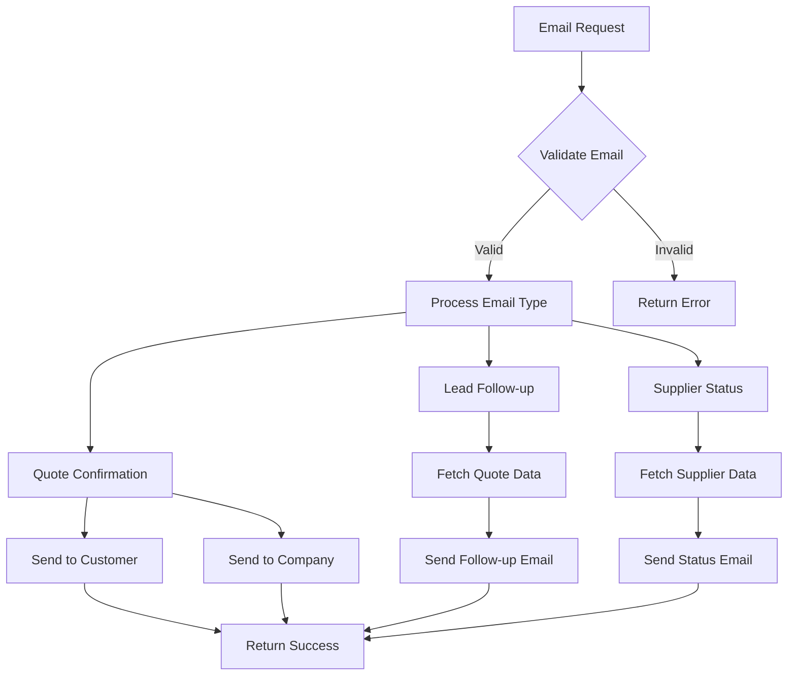
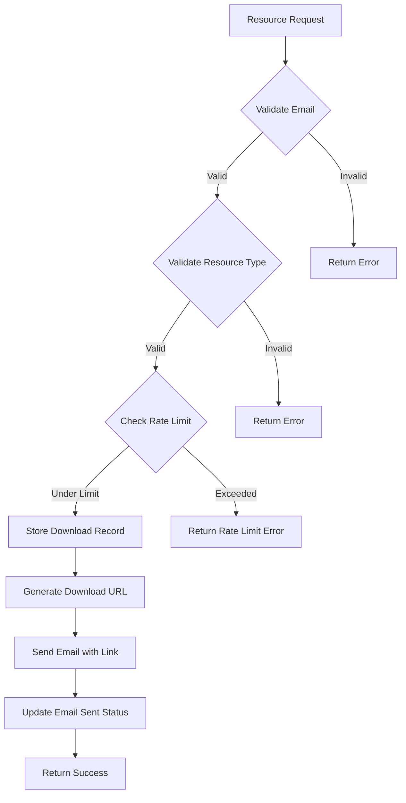
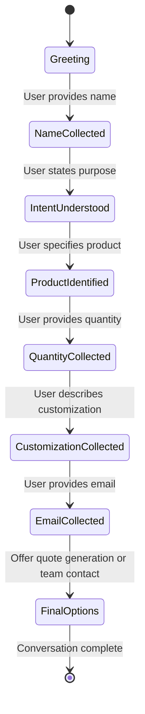
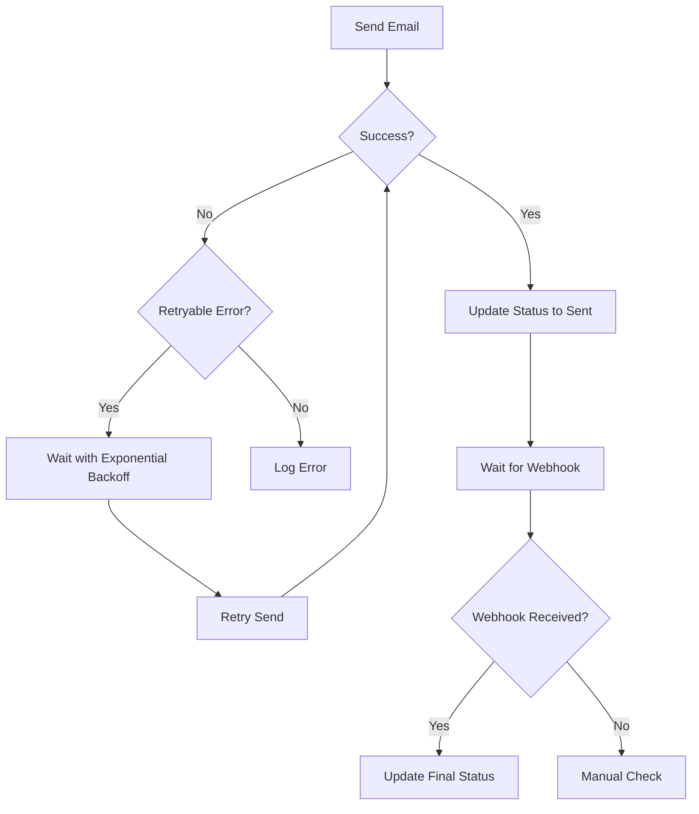

# Notification and Communication Functions

<cite>
**Referenced Files in This Document**   
- [email-service/index.ts](file://supabase/functions/email-service/index.ts)
- [send-resource-email/index.ts](file://supabase/functions/send-resource-email/index.ts)
- [conversational-assistant/index.ts](file://supabase/functions/conversational-assistant/index.ts)
- [LeadFollowupEmailDialog.tsx](file://src/components/LeadFollowupEmailDialog.tsx)
- [useNotifications.ts](file://src/hooks/useNotifications.ts)
- [20251119140029_887f03c6-bdb2-46d4-ac7b-4b4868f9a169.sql](file://supabase/migrations/20251119140029_887f03c6-bdb2-46d4-ac7b-4b4868f9a169.sql)
- [resend-webhook/index.ts](file://supabase/functions/resend-webhook/index.ts)
- [database.ts](file://src/types/database.ts)
</cite>

## Table of Contents
1. [Introduction](#introduction)
2. [Email Service for Transactional Emails](#email-service-for-transactional-emails)
3. [Send Resource Email for Marketing Materials](#send-resource-email-for-marketing-materials)
4. [Conversational Assistant for Automated Chat Responses](#conversational-assistant-for-automated-chat-responses)
5. [Template Management and Personalization](#template-management-and-personalization)
6. [Delivery Status Tracking and Reliability Features](#delivery-status-tracking-and-reliability-features)
7. [Integration with Email Providers and Compliance](#integration-with-email-providers-and-compliance)
8. [Event-Triggered Notifications and Best Practices](#event-triggered-notifications-and-best-practices)
9. [Testing and Monitoring](#testing-and-monitoring)
10. [Conclusion](#conclusion)

## Introduction
This document provides comprehensive documentation for the notification and communication functions in sleekapp-v100, focusing on three core systems: the email-service for transactional emails, send-resource-email for marketing materials distribution, and the conversational-assistant for automated chat responses. These systems work together to provide a robust communication infrastructure that handles order confirmations, production updates, marketing campaigns, and customer interactions. The documentation covers template management, personalization tokens, delivery status tracking, integration with email providers, spam prevention techniques, unsubscribe compliance, reliability features like retry mechanisms, delivery logging, and bounce handling.

**Section sources**
- [email-service/index.ts](file://supabase/functions/email-service/index.ts)
- [send-resource-email/index.ts](file://supabase/functions/send-resource-email/index.ts)
- [conversational-assistant/index.ts](file://supabase/functions/conversational-assistant/index.ts)

## Email Service for Transactional Emails

The email-service function handles transactional emails for order confirmations, production updates, and supplier status notifications. It is implemented as a Deno serverless function that processes email requests through Supabase edge functions. The service supports three main email types: quote confirmations, lead follow-ups, and supplier status updates.

The email validation system is comprehensive, checking for proper email format, length constraints (5-254 characters), local part length (max 64 characters), consecutive dots, and blocking disposable email domains. The service uses Resend as the email provider and implements CORS headers for secure cross-origin requests.

For quote confirmations, the service sends a detailed email to the customer with their quote summary and a notification to the company's inquiry email with the full quote details. The lead follow-up system allows sales teams to send targeted follow-up emails with three template options: gentle, discount, and urgent. Supplier status notifications are sent when a supplier's application is verified, rejected, or suspended, with appropriate messaging for each status.

**Diagram sources **
- [email-service/index.ts](file://supabase/functions/email-service/index.ts#L1-L555)

**Section sources**
- [email-service/index.ts](file://supabase/functions/email-service/index.ts#L1-L555)
- [LeadFollowupEmailDialog.tsx](file://src/components/LeadFollowupEmailDialog.tsx#L1-L160)

## Send Resource Email for Marketing Materials

The send-resource-email function handles the distribution of marketing materials such as the buyer's guide and material comparison chart. This system is designed to convert website visitors into leads by offering valuable resources in exchange for contact information.

The function implements rate limiting to prevent abuse, allowing a maximum of three downloads per email address within a 24-hour period. It validates email addresses using the same comprehensive validation system as the email-service, ensuring only valid, permanent email addresses are accepted. The function stores download records in the resource_downloads table, capturing the email, full name, company name, resource type, source, IP address, and user agent.

When a request is processed, the function generates a download URL and sends an email with a prominent download button. The email template is branded with Sleek Apparels' green color scheme and includes marketing messages about the company's low MOQ, fast production, and quality certifications. The system also tracks when emails are sent by updating the email_sent and email_sent_at fields in the database.

**Diagram sources **
- [send-resource-email/index.ts](file://supabase/functions/send-resource-email/index.ts#L1-L232)

**Section sources**
- [send-resource-email/index.ts](file://supabase/functions/send-resource-email/index.ts#L1-L232)
- [20251126153950_c7e943cb-2683-48e9-9c3a-6016f721a744.sql](file://supabase/migrations/20251126153950_c7e943cb-2683-48e9-9c3a-6016f721a744.sql#L1-L34)

## Conversational Assistant for Automated Chat Responses

The conversational-assistant function provides automated chat responses through a state machine that guides users through the quote request process. The assistant uses a sophisticated state management system to collect user information in a specific order: greeting → name collection → product identification → quantity → customization level → email collection → final options.

The system implements rate limiting to prevent abuse, allowing a maximum of 10 conversations per identifier (IP address, session ID, or conversation ID) per hour. It uses Lovable AI with GPT-5-mini to generate responses based on a detailed system prompt that enforces the state machine rules. The assistant extracts data from user messages, calculates a lead score based on the information provided, and stores conversation context in the conversation_context and conversation_messages tables.

The assistant provides context-aware quick replies based on the current state, making it easy for users to respond with appropriate options. When a user provides their email and all required information, the assistant offers three options: generate a quote, talk to the sourcing team, or ask more questions. If the user chooses to talk to the team, their information is saved as a lead in the quote_requests table.

**Diagram sources **
- [conversational-assistant/index.ts](file://supabase/functions/conversational-assistant/index.ts#L1-L621)

**Section sources**
- [conversational-assistant/index.ts](file://supabase/functions/conversational-assistant/index.ts#L1-L621)
- [database.ts](file://src/types/database.ts#L1-L579)

## Template Management and Personalization

The notification system uses a template-based approach for both transactional and marketing emails. Templates are defined as constants within the email-service and send-resource-email functions, with dynamic content inserted using template literals. Personalization tokens are implemented using JavaScript template literals with ${} syntax, allowing dynamic insertion of user-specific data.

For transactional emails, the system uses different templates based on the email type and context. The lead follow-up system offers three distinct templates: gentle, discount, and urgent, each with a different tone and purpose. The discount template includes a 10% off offer if the order is placed within 48 hours, while the urgent template emphasizes that the quote pricing is expiring soon.

Marketing emails use a consistent branded template with Sleek Apparels' green color scheme and include personalized greetings with the recipient's name when available. The templates are designed to be mobile-responsive with a max-width of 600px and use inline CSS for styling. All templates include appropriate unsubscribe links and company contact information to comply with email regulations.

**Section sources**
- [email-service/index.ts](file://supabase/functions/email-service/index.ts#L1-L555)
- [send-resource-email/index.ts](file://supabase/functions/send-resource-email/index.ts#L1-L232)

## Delivery Status Tracking and Reliability Features

The notification system implements comprehensive delivery status tracking through integration with Resend's webhook system. The email_verification_otps table has been extended with delivery tracking fields including resend_email_id, email_sent_at, delivery_status, and delivery_error. The delivery_status field is a text field with a check constraint limiting values to 'pending', 'sent', 'failed', 'bounced', or 'delivered'.

The resend-webhook function listens for delivery events from Resend and updates the delivery status in the database accordingly. When an email is delivered, the delivery_status is set to 'delivered'. If an email bounces or is delayed, the status is updated to 'bounced' or 'delayed' respectively, and the delivery_error field is populated with the error details.

The system also implements retry mechanisms for transient email delivery failures. The sendEmailWithRetry function attempts to send emails up to three times with exponential backoff, checking for retryable errors such as rate limits, timeouts, and service unavailability. This ensures reliable delivery even during temporary provider issues.

**Diagram sources **
- [20251119140029_887f03c6-bdb2-46d4-ac7b-4b4868f9a169.sql](file://supabase/migrations/20251119140029_887f03c6-bdb2-46d4-ac7b-4b4868f9a169.sql#L1-L21)
- [resend-webhook/index.ts](file://supabase/functions/resend-webhook/index.ts#L1-L117)

**Section sources**
- [20251119140029_887f03c6-bdb2-46d4-ac7b-4b4868f9a169.sql](file://supabase/migrations/20251119140029_887f03c6-bdb2-46d4-ac7b-4b4868f9a169.sql#L1-L21)
- [resend-webhook/index.ts](file://supabase/functions/resend-webhook/index.ts#L1-L117)
- [send-otp/index.ts](file://supabase/functions/send-otp/index.ts#L79-L362)

## Integration with Email Providers and Compliance

The notification system integrates with Resend as the primary email provider, using their API to send all transactional and marketing emails. The integration is configured through environment variables (RESEND_API_KEY) and uses the Resend SDK for Deno. The system implements proper error handling for API failures and includes retry logic for transient issues.

For compliance, the system follows best practices for email deliverability and regulatory requirements. All marketing emails include a clear unsubscribe link and the company's physical address as required by CAN-SPAM. The system blocks disposable email domains to prevent abuse and maintain sender reputation. Email content is designed to avoid spam triggers with balanced text-to-image ratios and appropriate subject lines.

The system also implements proper authentication through Supabase service role keys and validates all incoming requests. CORS headers are configured to allow cross-origin requests from the application domain. The email templates include appropriate branding and contact information to establish sender legitimacy.

**Section sources**
- [email-service/index.ts](file://supabase/functions/email-service/index.ts#L1-L555)
- [send-resource-email/index.ts](file://supabase/functions/send-resource-email/index.ts#L1-L232)
- [resend-webhook/index.ts](file://supabase/functions/resend-webhook/index.ts#L1-L117)

## Event-Triggered Notifications and Best Practices

The notification system supports various event-triggered notifications throughout the user journey. These include quote confirmations when a user requests a quote, lead follow-ups when a sales representative wants to contact a potential customer, supplier status updates when a supplier's application status changes, and resource download emails when a user requests marketing materials.

Best practices for maintaining high deliverability rates include monitoring sender reputation, maintaining clean email lists, avoiding spam trigger words, using proper email authentication (SPF, DKIM, DMARC), and providing valuable content to recipients. The system implements rate limiting to prevent sending too many emails too quickly, which could trigger spam filters.

Additional best practices include using consistent sending domains, personalizing emails with recipient names, optimizing email content for mobile devices, and including clear calls to action. The system also tracks email engagement metrics like open and click rates through the analytics_events table, allowing continuous optimization of email content and timing.

**Section sources**
- [email-service/index.ts](file://supabase/functions/email-service/index.ts#L1-L555)
- [send-resource-email/index.ts](file://supabase/functions/send-resource-email/index.ts#L1-L232)
- [database.ts](file://src/types/database.ts#L1-L579)

## Testing and Monitoring

The notification system includes comprehensive testing and monitoring capabilities. The useNotifications hook in the frontend provides real-time notification updates through Supabase's real-time subscriptions, allowing users to see new notifications as they arrive. The system tracks notification delivery status and errors, making it easy to identify and resolve delivery issues.

For testing email templates, developers can use the edge function simulator in Supabase to test email functionality without sending actual emails. The system logs all email sending attempts and results, including any errors encountered. The resend-webhook function provides visibility into email delivery status, allowing monitoring of delivery rates and bounce rates.

Monitoring is further enhanced through the analytics_events table, which tracks business events related to notifications, such as quote requests and contact form submissions. This data can be used to measure the effectiveness of different email templates and identify areas for improvement in the communication strategy.

**Section sources**
- [useNotifications.ts](file://src/hooks/useNotifications.ts#L1-L106)
- [resend-webhook/index.ts](file://supabase/functions/resend-webhook/index.ts#L1-L117)
- [database.ts](file://src/types/database.ts#L1-L579)

## Conclusion

The notification and communication functions in sleekapp-v100 provide a comprehensive system for handling transactional emails, marketing materials distribution, and automated chat responses. The email-service handles order confirmations and supplier status updates with robust validation and delivery tracking. The send-resource-email function enables effective lead generation through valuable content offers. The conversational-assistant provides an engaging chat experience that guides users through the quote request process.

Key strengths of the system include its reliability features like retry mechanisms and delivery status tracking, compliance with email regulations, and integration with analytics for continuous optimization. The template-based approach with personalization tokens allows for consistent branding while providing relevant content to recipients. By following best practices for email deliverability and monitoring engagement metrics, the system maintains high deliverability rates and effective communication with customers and suppliers.