# Serverless Functions Architecture

<cite>
**Referenced Files in This Document**
- [logger.ts](file://supabase/functions/_shared/logger.ts)
- [ai-quote-generator/index.ts](file://supabase/functions/ai-quote-generator/index.ts)
- [ai-supplier-assignment/index.ts](file://supabase/functions/ai-supplier-assignment/index.ts)
- [convert-quote-to-order/index.ts](file://supabase/functions/convert-quote-to-order/index.ts)
- [initialize-production-stages/index.ts](file://supabase/functions/initialize-production-stages/index.ts)
- [stripe-webhook/index.ts](file://supabase/functions/stripe-webhook/index.ts)
- [send-resource-email/index.ts](file://supabase/functions/send-resource-email/index.ts)
- [supabaseHelpers.ts](file://src/lib/supabaseHelpers.ts)
- [database.ts](file://src/types/database.ts)
- [health/index.ts](file://supabase/functions/health/index.ts)
</cite>

## Table of Contents
1. [Introduction](#introduction)
2. [Architecture Overview](#architecture-overview)
3. [Shared Infrastructure](#shared-infrastructure)
4. [AI-Powered Services](#ai-powered-services)
5. [Business Logic Functions](#business-logic-functions)
6. [Integration Endpoints](#integration-endpoints)
7. [Security and Rate Limiting](#security-and-rate-limiting)
8. [Error Management and Logging](#error-management-and-logging)
9. [Performance Optimization](#performance-optimization)
10. [Monitoring and Debugging](#monitoring-and-debugging)
11. [Best Practices](#best-practices)

## Introduction

The sleekapp-v100 serverless functions architecture provides a comprehensive backend-as-a-service solution built on Supabase Edge Functions. This architecture enables AI-powered quote generation, supplier assignment, order processing, and integration with external services while maintaining high security standards and performance optimization.

The system consists of specialized functions handling different business domains: AI services for intelligent quote generation, business logic for order conversion and production management, and integration endpoints for external systems like Stripe and email services.

## Architecture Overview

The serverless functions architecture follows a modular design pattern with clear separation of concerns:

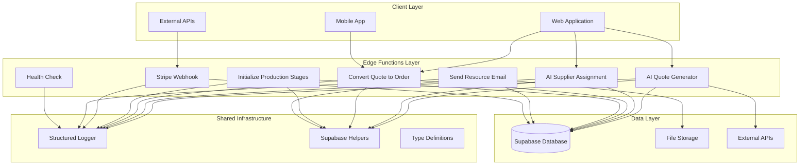

**Diagram sources**
- [ai-quote-generator/index.ts](file://supabase/functions/ai-quote-generator/index.ts#L1-L50)
- [ai-supplier-assignment/index.ts](file://supabase/functions/ai-supplier-assignment/index.ts#L1-L30)
- [convert-quote-to-order/index.ts](file://supabase/functions/convert-quote-to-order/index.ts#L1-L30)

## Shared Infrastructure

### Structured Logging System

The logging infrastructure provides comprehensive monitoring with PII sanitization and structured data formatting:

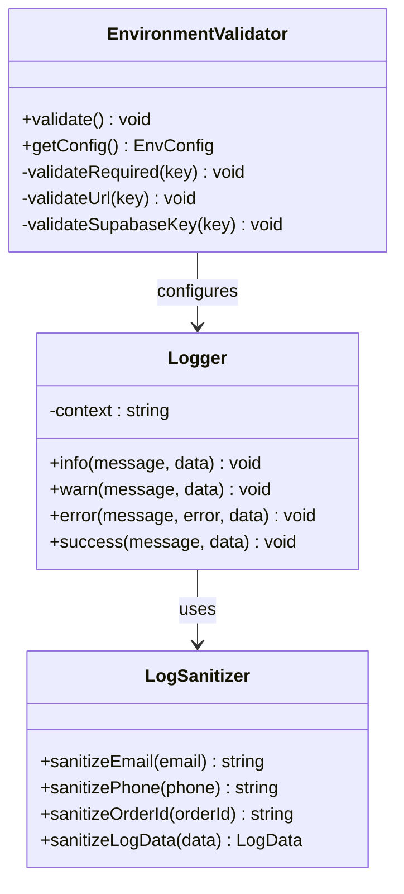

**Diagram sources**
- [logger.ts](file://supabase/functions/_shared/logger.ts#L93-L172)

The logger implements multiple log levels with automatic PII sanitization:
- **Info**: General operational messages with structured data
- **Warn**: Recoverable issues with contextual information
- **Error**: Failures with stack traces and error details
- **Success**: Completed operations with confirmation

**Section sources**
- [logger.ts](file://supabase/functions/_shared/logger.ts#L1-L173)

### Supabase Helpers and Type System

The type-safe database access layer provides comprehensive CRUD operations with TypeScript integration:

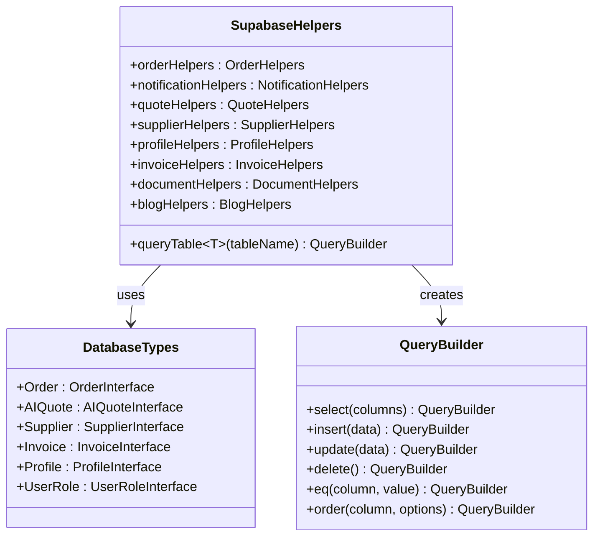

**Diagram sources**
- [supabaseHelpers.ts](file://src/lib/supabaseHelpers.ts#L26-L376)
- [database.ts](file://src/types/database.ts#L33-L579)

**Section sources**
- [supabaseHelpers.ts](file://src/lib/supabaseHelpers.ts#L1-L376)
- [database.ts](file://src/types/database.ts#L1-L579)

## AI-Powered Services

### AI Quote Generator

The AI Quote Generator provides intelligent quote generation with sophisticated rate limiting and AI integration:

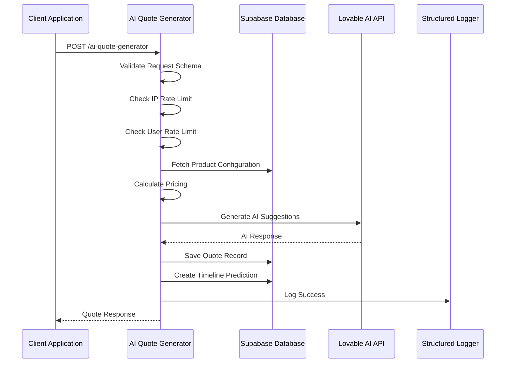

**Diagram sources**
- [ai-quote-generator/index.ts](file://supabase/functions/ai-quote-generator/index.ts#L253-L727)

Key features include:
- **Tiered Rate Limiting**: IP-based (15/day), Session-based (3/day), User-based (20/day)
- **AI Integration**: Gemini 2.5 Flash/Pro models for different complexity levels
- **Configuration Management**: Dynamic product configuration with fallback mechanisms
- **Pricing Calculation**: Volume discounts and complexity multipliers
- **Timeline Prediction**: Production stage estimation with confidence scoring

**Section sources**
- [ai-quote-generator/index.ts](file://supabase/functions/ai-quote-generator/index.ts#L1-L753)

### AI Supplier Assignment

The AI Supplier Assignment function matches orders with optimal suppliers using machine learning:

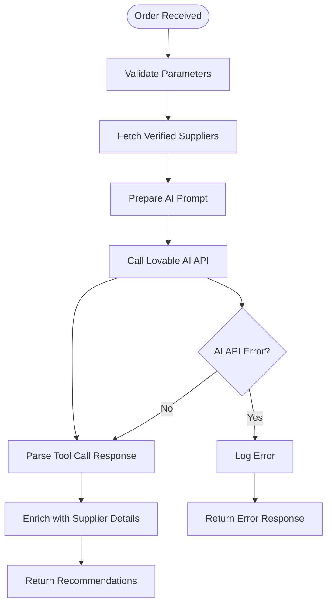

**Diagram sources**
- [ai-supplier-assignment/index.ts](file://supabase/functions/ai-supplier-assignment/index.ts#L14-L134)

**Section sources**
- [ai-supplier-assignment/index.ts](file://supabase/functions/ai-supplier-assignment/index.ts#L1-L134)

## Business Logic Functions

### Convert Quote to Order

The Convert Quote to Order function transforms AI-generated quotes into production-ready orders:

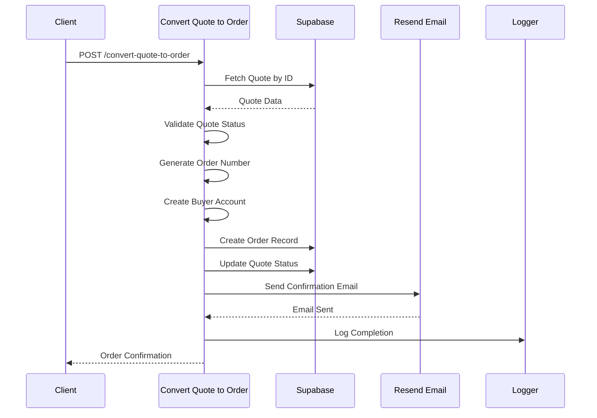

**Diagram sources**
- [convert-quote-to-order/index.ts](file://supabase/functions/convert-quote-to-order/index.ts#L21-L223)

**Section sources**
- [convert-quote-to-order/index.ts](file://supabase/functions/convert-quote-to-order/index.ts#L1-L223)

### Initialize Production Stages

The Initialize Production Stages function creates production workflows based on product categories:

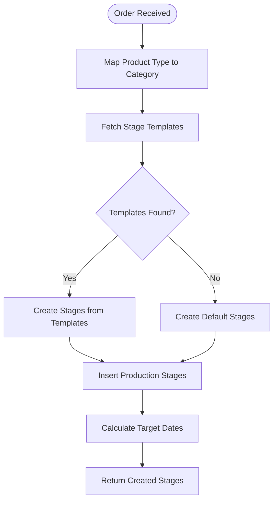

**Diagram sources**
- [initialize-production-stages/index.ts](file://supabase/functions/initialize-production-stages/index.ts#L14-L133)

**Section sources**
- [initialize-production-stages/index.ts](file://supabase/functions/initialize-production-stages/index.ts#L1-L133)

## Integration Endpoints

### Stripe Webhook Handler

The Stripe Webhook handler processes payment events and updates order status:

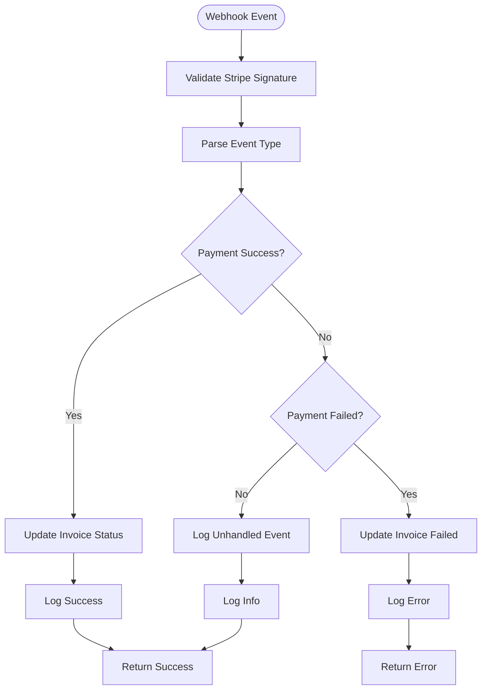

**Diagram sources**
- [stripe-webhook/index.ts](file://supabase/functions/stripe-webhook/index.ts#L52-L106)

**Section sources**
- [stripe-webhook/index.ts](file://supabase/functions/stripe-webhook/index.ts#L1-L114)

### Send Resource Email

The Send Resource Email function manages educational content distribution with rate limiting:

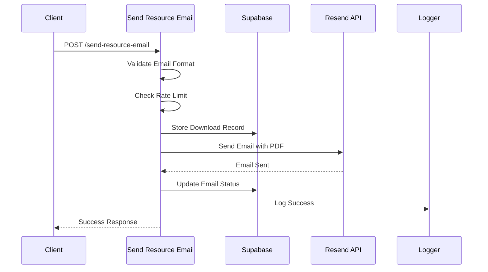

**Diagram sources**
- [send-resource-email/index.ts](file://supabase/functions/send-resource-email/index.ts#L66-L232)

**Section sources**
- [send-resource-email/index.ts](file://supabase/functions/send-resource-email/index.ts#L1-L232)

## Security and Rate Limiting

### Origin Validation and CORS

All functions implement comprehensive security measures:

| Security Feature | Implementation | Purpose |
|------------------|----------------|---------|
| **Origin Validation** | Domain whitelist with wildcard support | Prevent cross-origin attacks |
| **CORS Headers** | Standard CORS configuration | Enable browser communication |
| **Rate Limiting** | IP, Session, and User-based limits | Prevent abuse and ensure fair usage |
| **Input Validation** | Zod schema validation | Ensure data integrity |
| **Environment Validation** | Runtime configuration checks | Verify secure deployment |

### Rate Limiting Strategies

The system implements a multi-tier rate limiting approach:

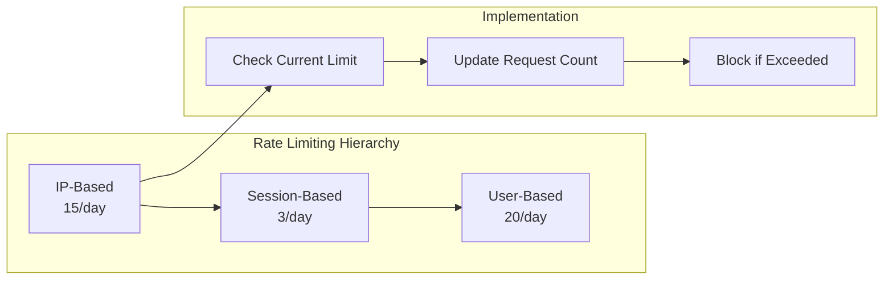

**Diagram sources**
- [ai-quote-generator/index.ts](file://supabase/functions/ai-quote-generator/index.ts#L38-L94)

**Section sources**
- [ai-quote-generator/index.ts](file://supabase/functions/ai-quote-generator/index.ts#L139-L202)
- [send-resource-email/index.ts](file://supabase/functions/send-resource-email/index.ts#L89-L108)

## Error Management and Logging

### Structured Error Handling

The logging system provides comprehensive error tracking with automatic PII sanitization:

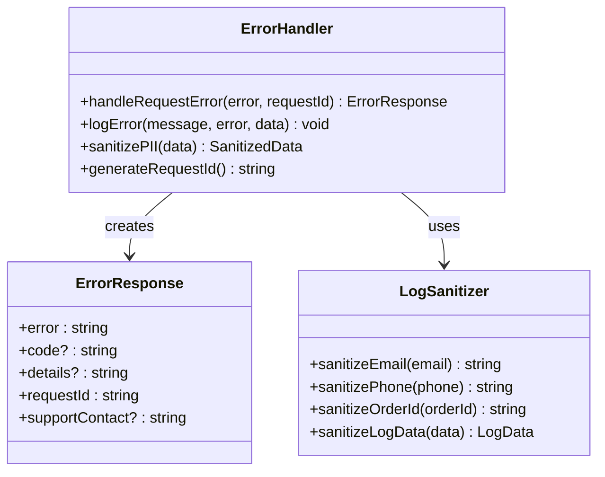

**Diagram sources**
- [logger.ts](file://supabase/functions/_shared/logger.ts#L103-L148)

### Error Response Patterns

Functions implement consistent error response patterns:

| Status Code | Pattern | Use Case |
|-------------|---------|----------|
| **200** | `{ success: true, data: ... }` | Successful operations |
| **400** | `{ error: "Validation failed", details: [...] }` | Input validation errors |
| **403** | `{ error: "Unauthorized", code: "AUTH_001" }` | Authentication failures |
| **429** | `{ error: "Rate limited", retryAfter: 3600 }` | Rate limiting violations |
| **500** | `{ error: "Internal error", requestId: "..." }` | Unexpected server errors |

**Section sources**
- [logger.ts](file://supabase/functions/_shared/logger.ts#L103-L148)
- [ai-quote-generator/index.ts](file://supabase/functions/ai-quote-generator/index.ts#L732-L752)

## Performance Optimization

### High-Latency Operation Handling

The architecture optimizes performance for AI-intensive operations:

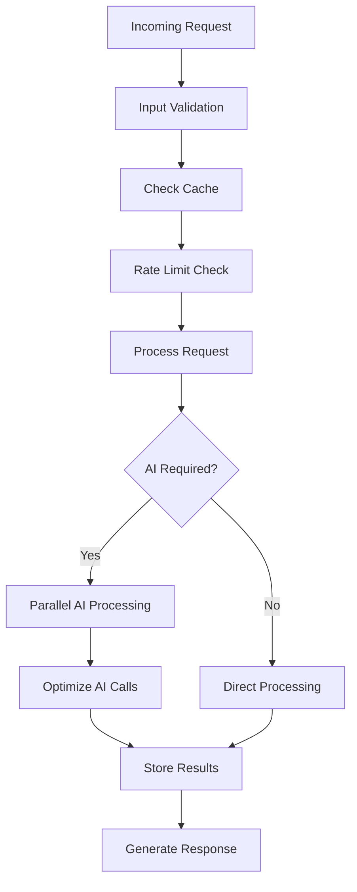

### Optimization Strategies

1. **AI Model Selection**: Uses Gemini 2.5 Flash for text-only requests, Gemini 2.5 Pro for image analysis
2. **Parallel Processing**: Concurrent AI API calls when appropriate
3. **Caching**: Intelligent caching of frequently accessed configurations
4. **Batch Operations**: Grouped database operations for efficiency
5. **Connection Pooling**: Reuse of database connections

**Section sources**
- [ai-quote-generator/index.ts](file://supabase/functions/ai-quote-generator/index.ts#L591-L624)

## Monitoring and Debugging

### Function Execution Metrics

The logging system provides comprehensive monitoring capabilities:

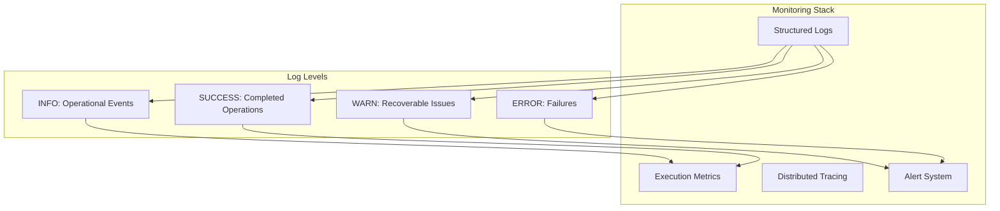

### Debugging Tools and Techniques

1. **Request ID Tracking**: Unique identifiers for end-to-end request tracing
2. **PII Sanitization**: Automatic removal of sensitive data from logs
3. **Structured Logging**: JSON-formatted logs for easy parsing
4. **Error Correlation**: Linked error messages with request context
5. **Performance Metrics**: Built-in timing and resource usage tracking

**Section sources**
- [logger.ts](file://supabase/functions/_shared/logger.ts#L82-L172)
- [health/index.ts](file://supabase/functions/health/index.ts#L1-L34)

## Best Practices

### Function Design Principles

1. **Single Responsibility**: Each function handles one specific business operation
2. **Idempotency**: Functions can safely handle duplicate requests
3. **Timeout Handling**: Graceful degradation for long-running operations
4. **Resource Cleanup**: Proper cleanup of temporary resources
5. **Error Recovery**: Comprehensive error handling with meaningful messages

### Security Best Practices

1. **Input Validation**: Strict schema validation for all inputs
2. **Output Sanitization**: Automatic PII removal from responses
3. **Access Control**: Role-based permissions and service role keys
4. **Rate Limiting**: Multi-tier protection against abuse
5. **Secure Communication**: HTTPS-only for all external API calls

### Performance Guidelines

1. **Async Operations**: Non-blocking database and API calls
2. **Connection Reuse**: Efficient database connection management
3. **Caching Strategy**: Intelligent caching of expensive operations
4. **Resource Limits**: Configurable timeouts and memory limits
5. **Monitoring**: Comprehensive logging and metrics collection

### Deployment Considerations

1. **Environment Variables**: Secure configuration management
2. **Health Checks**: Regular system health monitoring
3. **Rollback Strategy**: Quick recovery from deployment issues
4. **Scaling**: Automatic scaling based on demand
5. **Testing**: Comprehensive testing with realistic load scenarios