# Audit Logging and Security Monitoring

<cite>
**Referenced Files in This Document**
- [enhancedAuditLog.ts](file://src/lib/enhancedAuditLog.ts)
- [AdminAuditLogs.tsx](file://src/pages/AdminAuditLogs.tsx)
- [log-audit-action/index.ts](file://supabase/functions/log-audit-action/index.ts)
- [auditLog.ts](file://src/lib/auditLog.ts)
- [RateLimitMonitoringDashboard.tsx](file://src/components/admin/RateLimitMonitoringDashboard.tsx)
- [password-breach-check/index.ts](file://supabase/functions/password-breach-check/index.ts)
- [ChangePasswordDialog.tsx](file://src/components/ChangePasswordDialog.tsx)
- [20251115150759_remix_migration_from_pg_dump.sql](file://supabase/migrations/20251115150759_remix_migration_from_pg_dump.sql)
- [20251120233928_2016afb8-d720-4858-9e12-7fb4ebbd5de0.sql](file://supabase/migrations/20251120233928_2016afb8-d720-4858-9e12-7fb4ebbd5de0.sql)
- [20251121014007_e1ea3a7e-b3b2-4082-a10a-c5eff6b1135b.sql](file://supabase/migrations/20251121014007_e1ea3a7e-b3b2-4082-a10a-c5eff6b1135b.sql)
</cite>

## Table of Contents
1. [Introduction](#introduction)
2. [System Architecture](#system-architecture)
3. [Core Components](#core-components)
4. [Enhanced Audit Logging Implementation](#enhanced-audit-logging-implementation)
5. [Server-Side Logging Mechanism](#server-side-logging-mechanism)
6. [Security Event Monitoring](#security-event-monitoring)
7. [Admin Audit Logs Interface](#admin-audit-logs-interface)
8. [Rate Limiting and Abuse Detection](#rate-limiting-and-abuse-detection)
9. [Data Retention and Compliance](#data-retention-and-compliance)
10. [SIEM Integration](#siem-integration)
11. [Security Best Practices](#security-best-practices)
12. [Troubleshooting Guide](#troubleshooting-guide)
13. [Conclusion](#conclusion)

## Introduction

The Sleek Apparels audit logging and security monitoring system provides comprehensive tracking of security-critical actions across the platform. Built on Supabase's edge functions and PostgreSQL database, this system captures detailed information about user activities, security events, and system operations with IP address tracking, user agent identification, and contextual metadata.

The system implements a multi-layered approach to security monitoring, combining client-side logging with server-side validation, real-time rate limiting, and automated breach detection. It supports compliance with major regulatory frameworks including GDPR and CCPA while providing robust protection against various attack vectors.

## System Architecture

The audit logging system follows a distributed architecture with multiple components working together to provide comprehensive security monitoring:

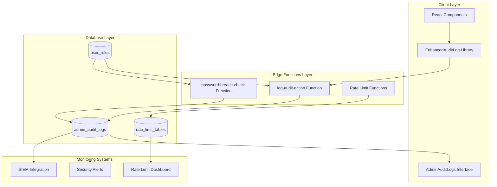

**Diagram sources**
- [enhancedAuditLog.ts](file://src/lib/enhancedAuditLog.ts#L101-L137)
- [log-audit-action/index.ts](file://supabase/functions/log-audit-action/index.ts#L16-L97)
- [AdminAuditLogs.tsx](file://src/pages/AdminAuditLogs.tsx#L22-L45)

## Core Components

### Enhanced Audit Log Library

The enhanced audit log system provides comprehensive logging capabilities with support for multiple action types, resource categories, and severity levels.

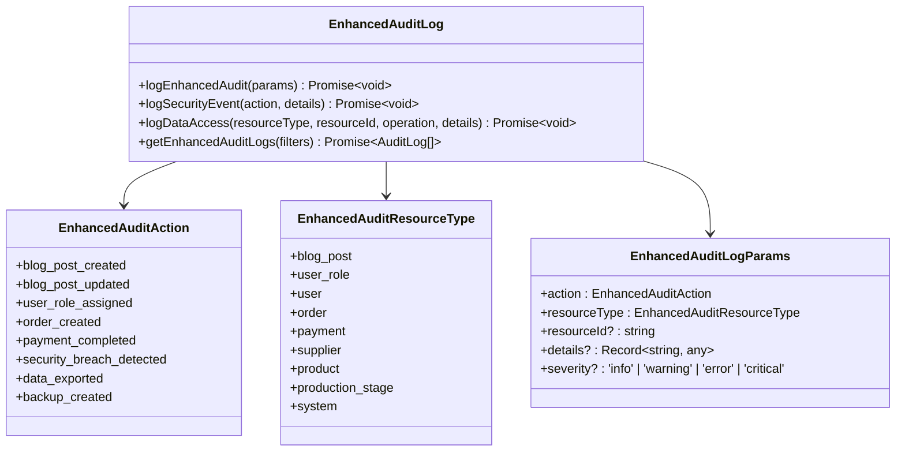

**Diagram sources**
- [enhancedAuditLog.ts](file://src/lib/enhancedAuditLog.ts#L8-L87)
- [enhancedAuditLog.ts](file://src/lib/enhancedAuditLog.ts#L89-L95)

### Action Categories

The system categorizes audit actions into several domains:

| Category | Actions | Severity Levels |
|----------|---------|----------------|
| **Blog Operations** | `blog_post_created`, `blog_post_updated`, `blog_post_deleted`, `blog_post_published`, `blog_post_unpublished` | Info |
| **User Management** | `user_role_assigned`, `user_role_revoked`, `user_created`, `user_updated`, `user_deleted`, `user_login`, `user_logout`, `user_password_reset` | Info, Warning |
| **Order Processing** | `order_created`, `order_updated`, `order_status_changed`, `order_assigned`, `order_cancelled` | Info, Warning |
| **Financial Operations** | `payment_initiated`, `payment_completed`, `payment_failed`, `payment_refunded`, `invoice_generated`, `invoice_sent` | Info, Warning |
| **Quote Management** | `quote_created`, `quote_approved`, `quote_rejected`, `quote_converted` | Info |
| **Supplier Management** | `supplier_created`, `supplier_updated`, `supplier_verified`, `supplier_suspended`, `supplier_assigned` | Info, Warning |
| **Product Operations** | `product_created`, `product_updated`, `product_deleted`, `product_viewed` | Info |
| **Production Tracking** | `production_stage_updated`, `work_order_generated`, `quality_check_completed` | Info |
| **Security Events** | `security_breach_detected`, `suspicious_activity`, `rate_limit_exceeded`, `unauthorized_access_attempt` | Critical |
| **Data Access** | `sensitive_data_accessed`, `data_exported`, `data_deleted` | Warning, Error |
| **System Operations** | `backup_created`, `backup_restored`, `settings_changed`, `automation_rule_triggered` | Info |

**Section sources**
- [enhancedAuditLog.ts](file://src/lib/enhancedAuditLog.ts#L8-L71)

## Enhanced Audit Logging Implementation

### Primary Logging Function

The `logEnhancedAudit` function serves as the central logging mechanism, providing comprehensive audit trail capabilities:

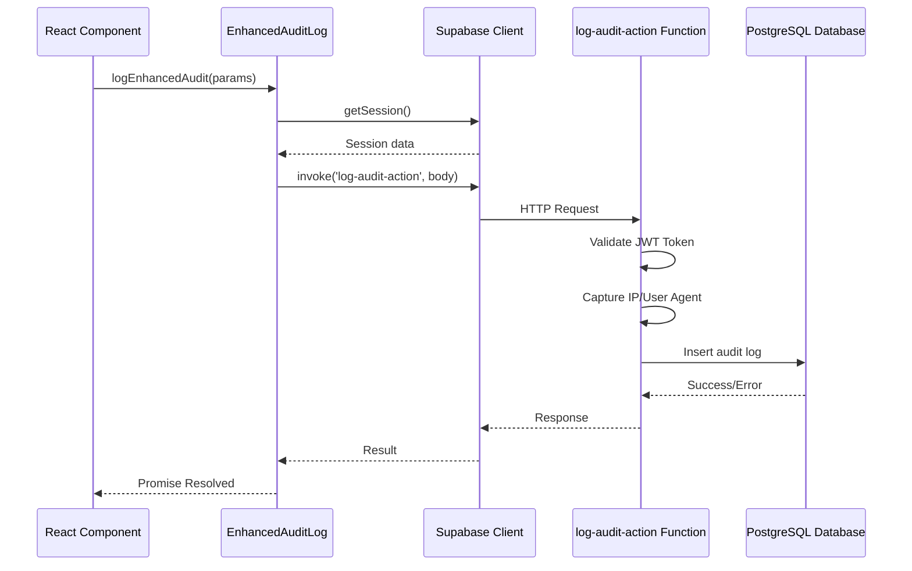

**Diagram sources**
- [enhancedAuditLog.ts](file://src/lib/enhancedAuditLog.ts#L101-L137)
- [log-audit-action/index.ts](file://supabase/functions/log-audit-action/index.ts#L16-L97)

### Security Event Logging

The system provides specialized functions for logging security-related events with automatic severity classification:

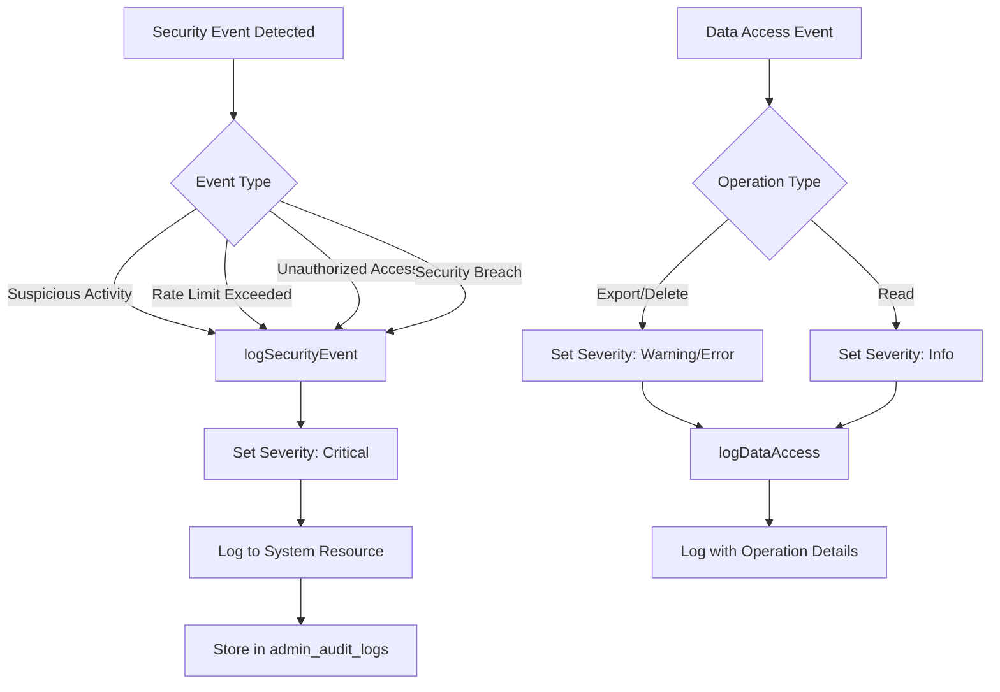

**Diagram sources**
- [enhancedAuditLog.ts](file://src/lib/enhancedAuditLog.ts#L142-L151)
- [enhancedAuditLog.ts](file://src/lib/enhancedAuditLog.ts#L157-L174)

**Section sources**
- [enhancedAuditLog.ts](file://src/lib/enhancedAuditLog.ts#L142-L174)

## Server-Side Logging Mechanism

### Deno Edge Function Implementation

The `log-audit-action` edge function provides server-side logging with enhanced security and reliability:

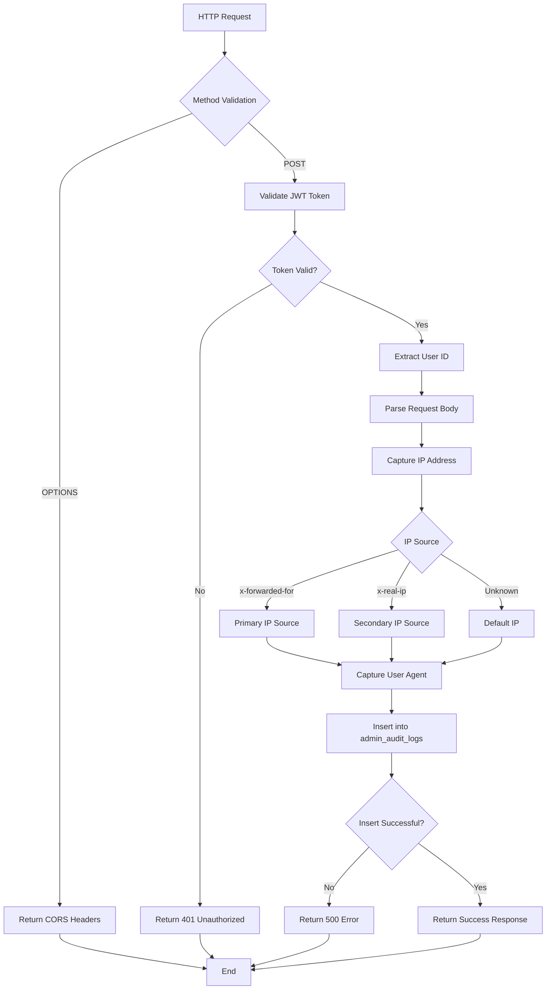

**Diagram sources**
- [log-audit-action/index.ts](file://supabase/functions/log-audit-action/index.ts#L16-L97)

### IP Address Capture Strategy

The system implements a robust IP address capture mechanism that works across different deployment environments:

| Header Source | Priority | Use Case |
|---------------|----------|----------|
| `x-forwarded-for` | Highest | Load balancers, reverse proxies |
| `x-real-ip` | Medium | Cloudflare, other CDN providers |
| `unknown` | Lowest | Fallback for direct connections |

**Section sources**
- [log-audit-action/index.ts](file://supabase/functions/log-audit-action/index.ts#L52-L56)

## Security Event Monitoring

### Password Breach Detection

The system integrates with the Have I Been Pwned API to detect compromised passwords:

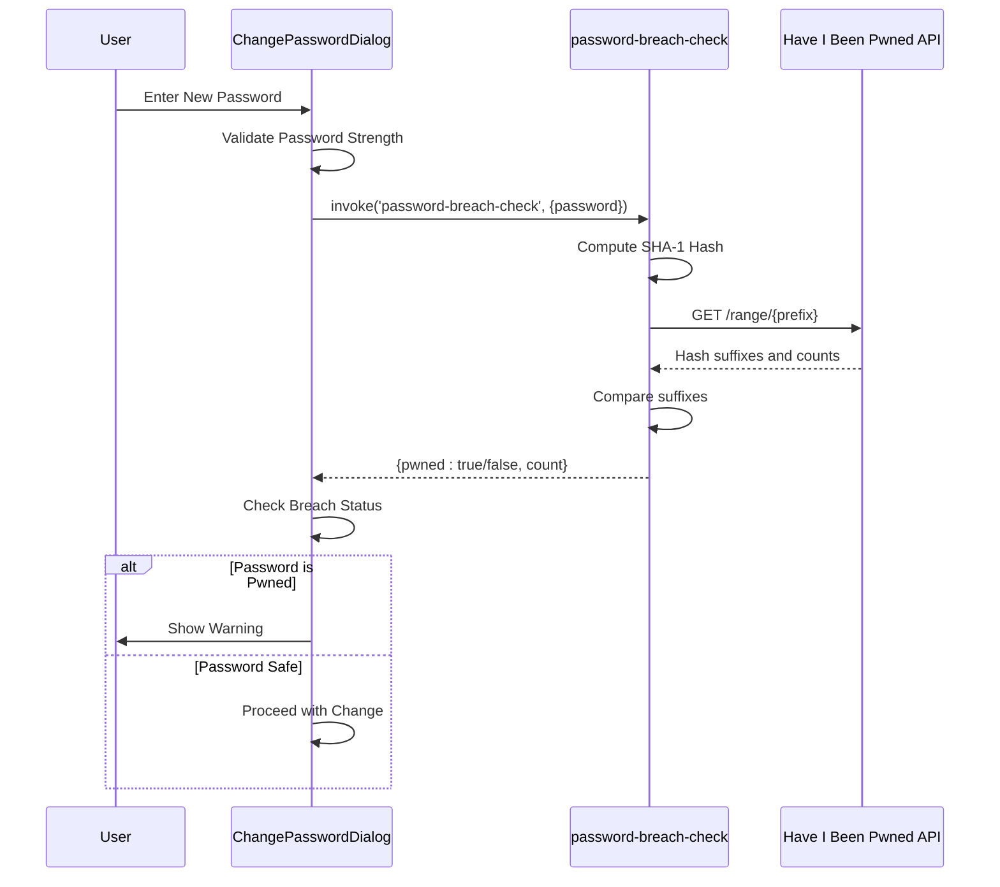

**Diagram sources**
- [password-breach-check/index.ts](file://supabase/functions/password-breach-check/index.ts#L107-L130)
- [ChangePasswordDialog.tsx](file://src/components/ChangePasswordDialog.tsx#L68-L76)

### Rate Limiting and Abuse Detection

The system implements comprehensive rate limiting across multiple endpoints:

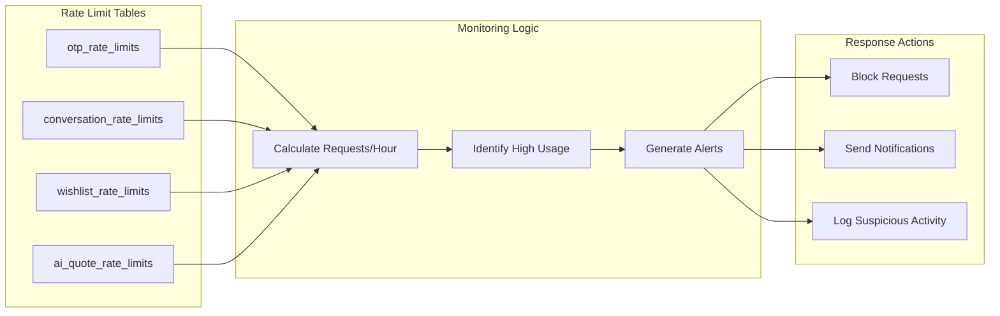

**Diagram sources**
- [RateLimitMonitoringDashboard.tsx](file://src/components/admin/RateLimitMonitoringDashboard.tsx#L32-L61)

**Section sources**
- [RateLimitMonitoringDashboard.tsx](file://src/components/admin/RateLimitMonitoringDashboard.tsx#L1-204)

## Admin Audit Logs Interface

### Administrative Dashboard

The AdminAuditLogs interface provides comprehensive visibility into all audit activities:

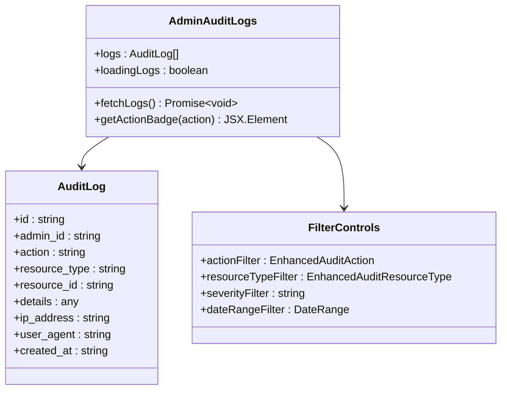

**Diagram sources**
- [AdminAuditLogs.tsx](file://src/pages/AdminAuditLogs.tsx#L10-L20)
- [enhancedAuditLog.ts](file://src/lib/enhancedAuditLog.ts#L180-L228)

### Filtering and Search Capabilities

The interface supports sophisticated filtering options:

| Filter Type | Options | Purpose |
|-------------|---------|---------|
| **Action Type** | All EnhancedAuditAction values | Focus on specific operations |
| **Resource Type** | All EnhancedAuditResourceType values | Target specific resources |
| **Severity Level** | info, warning, error, critical | Prioritize critical events |
| **Date Range** | Custom date selection | Historical analysis |
| **User ID** | Specific admin user | User-specific activity |

**Section sources**
- [AdminAuditLogs.tsx](file://src/pages/AdminAuditLogs.tsx#L180-L228)

## Rate Limiting and Abuse Detection

### Real-Time Monitoring Dashboard

The RateLimitMonitoringDashboard provides real-time visibility into API usage patterns:

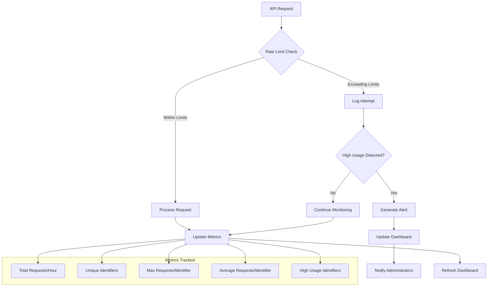

**Diagram sources**
- [RateLimitMonitoringDashboard.tsx](file://src/components/admin/RateLimitMonitoringDashboard.tsx#L32-L61)

### Abuse Pattern Detection

The system identifies potential abuse patterns through statistical analysis:

| Metric | Threshold | Action |
|--------|-----------|--------|
| **Requests per Identifier** | > 80/hour | Warning |
| **Consecutive Failed Attempts** | > 5 | Block |
| **Unusual Geographic Patterns** | > 3 locations/hour | Alert |
| **API Version Mismatch** | None | Log |

**Section sources**
- [RateLimitMonitoringDashboard.tsx](file://src/components/admin/RateLimitMonitoringDashboard.tsx#L67-L72)

## Data Retention and Compliance

### GDPR Compliance Features

The system implements comprehensive GDPR compliance measures:

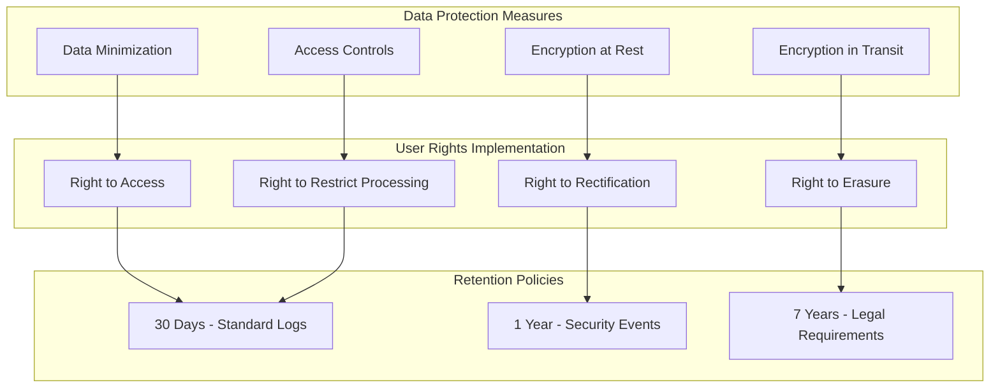

### CCPA Compliance

The system supports California Consumer Privacy Act requirements:

| Requirement | Implementation |
|-------------|----------------|
| **Notice at Collection** | Clear privacy policy disclosure |
| **Right to Know** | Comprehensive audit log access |
| **Right to Delete** | Data deletion capabilities |
| **Right to Opt-Out** | Preference management system |
| **Non-Discrimination** | Fair treatment for privacy choices |

### Data Retention Schedule

| Log Type | Retention Period | Storage Location | Purging Method |
|----------|------------------|------------------|----------------|
| **Standard Operations** | 30 days | PostgreSQL | Automated cleanup |
| **Security Events** | 1 year | PostgreSQL | Automated cleanup |
| **Sensitive Data Access** | 90 days | PostgreSQL | Automated cleanup |
| **Administrative Actions** | 2 years | PostgreSQL | Manual review |
| **Backup Archives** | 7 years | Cloud Storage | Legal retention |

## SIEM Integration

### Event Forwarding Architecture

The system supports integration with Security Information and Event Management (SIEM) systems:

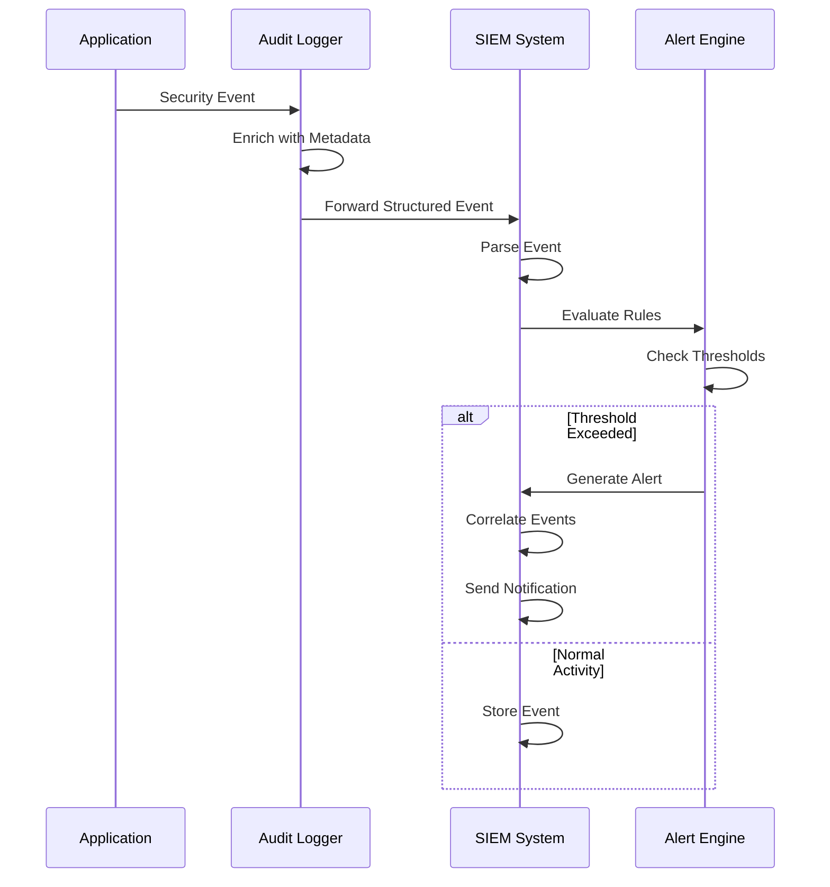

### Supported SIEM Formats

| Format | Use Case | Fields Included |
|--------|----------|-----------------|
| **JSON** | Modern SIEMs | Full event structure |
| **Syslog** | Legacy Systems | Basic event info |
| **CEF** | ArcSight | Common event format |
| **STIX** | Threat Intelligence | Threat indicators |

### Alert Configuration

The system generates alerts based on configurable thresholds:

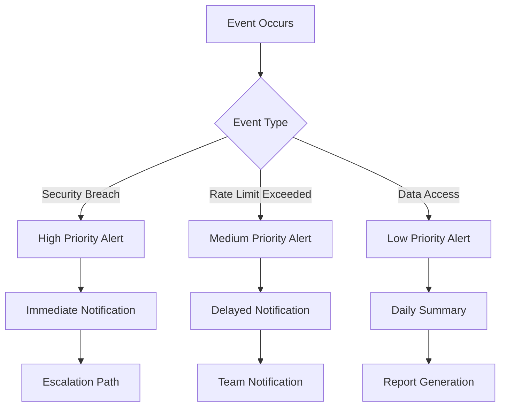

## Security Best Practices

### Authentication and Authorization

The system implements defense-in-depth security measures:

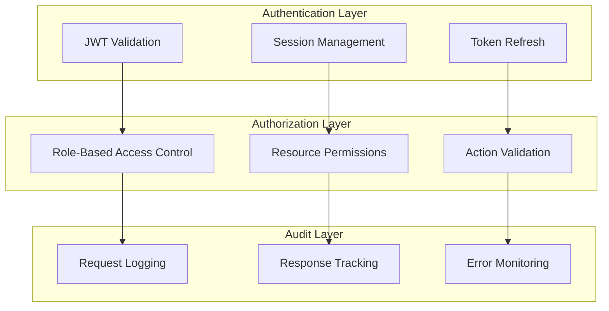

### Data Protection Measures

| Security Control | Implementation | Purpose |
|------------------|----------------|---------|
| **Input Validation** | Server-side validation | Prevent injection attacks |
| **Output Encoding** | Automatic encoding | XSS prevention |
| **SQL Injection Prevention** | Parameterized queries | SQL attack protection |
| **Cross-Site Request Forgery** | CSRF tokens | Request forgery prevention |
| **Content Security Policy** | Strict CSP headers | Malicious content blocking |

### Network Security

The system implements comprehensive network security controls:

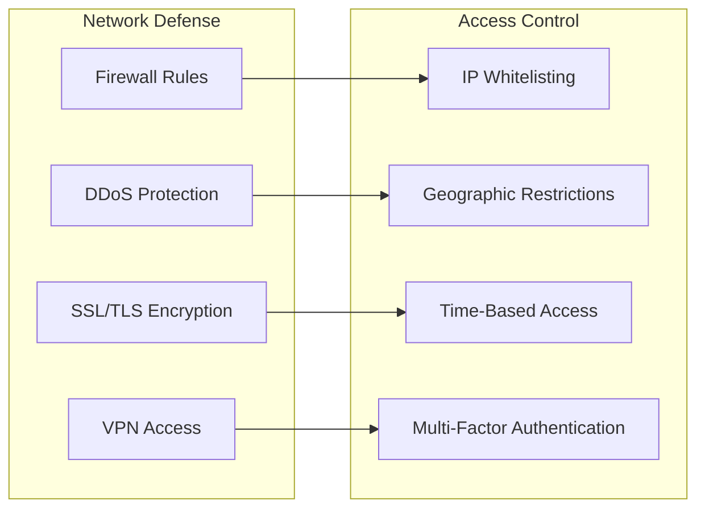

## Troubleshooting Guide

### Common Issues and Solutions

| Issue | Symptoms | Solution |
|-------|----------|----------|
| **Audit Logs Not Appearing** | Empty audit log view | Check function permissions and database connectivity |
| **IP Address Not Captured** | Null IP addresses in logs | Verify proxy headers and edge function configuration |
| **Rate Limit False Positives** | Legitimate users blocked | Adjust rate limit thresholds and whitelist trusted IPs |
| **Security Events Not Logged** | Missing security events | Verify function triggers and database policies |

### Debugging Audit Logs

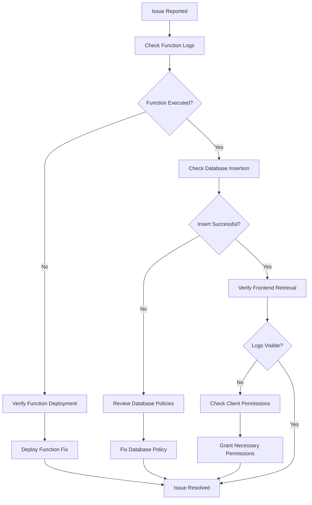

### Performance Optimization

Key optimization strategies for audit logging:

| Optimization | Benefit | Implementation |
|--------------|---------|----------------|
| **Batch Inserts** | Reduced database load | Group multiple logs into single transactions |
| **Index Optimization** | Faster queries | Create indexes on frequently queried columns |
| **Partitioning** | Improved scalability | Partition large audit tables by date |
| **Compression** | Reduced storage | Enable compression for log data |
| **Caching** | Faster retrieval | Cache recent audit data |

**Section sources**
- [enhancedAuditLog.ts](file://src/lib/enhancedAuditLog.ts#L138-L141)
- [log-audit-action/index.ts](file://supabase/functions/log-audit-action/index.ts#L89-L94)

## Conclusion

The Sleek Apparels audit logging and security monitoring system provides a comprehensive solution for tracking security-critical actions and maintaining regulatory compliance. Through its multi-layered architecture combining client-side logging, server-side validation, real-time monitoring, and SIEM integration, the system delivers robust protection against various threat vectors while maintaining operational efficiency.

Key strengths of the system include:

- **Comprehensive Coverage**: Tracks all security-critical actions across the platform
- **Real-Time Monitoring**: Provides immediate visibility into security events and abuse patterns
- **Regulatory Compliance**: Supports GDPR, CCPA, and other major regulatory frameworks
- **Scalable Architecture**: Built on Supabase's edge functions for reliable, scalable operation
- **Intelligent Alerting**: Automatically detects and responds to suspicious activities
- **Flexible Integration**: Supports integration with existing SIEM and monitoring systems

The system continues to evolve with ongoing enhancements to threat detection capabilities, improved performance optimization, and expanded compliance support. Regular security audits and updates ensure the system remains effective against emerging threats while maintaining the highest standards of data protection and privacy.