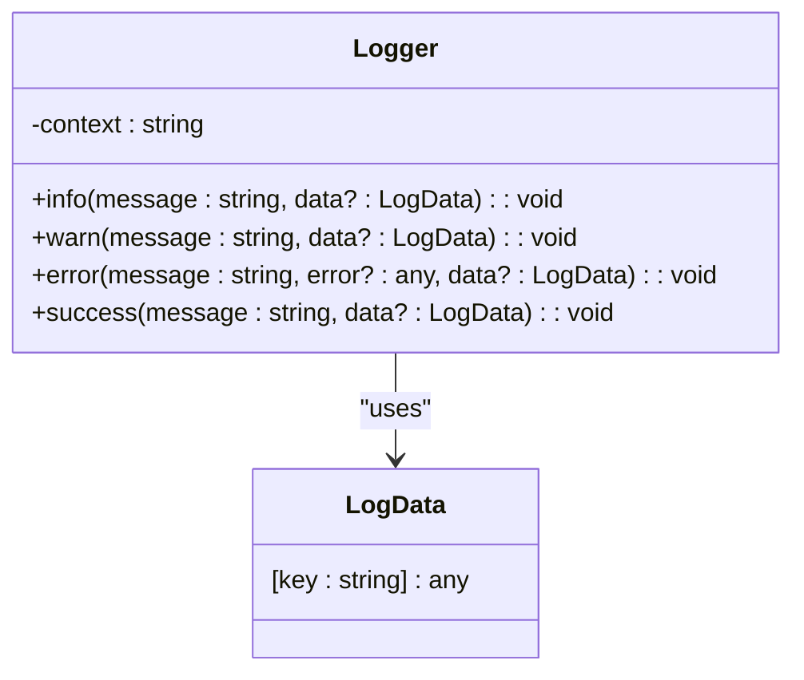
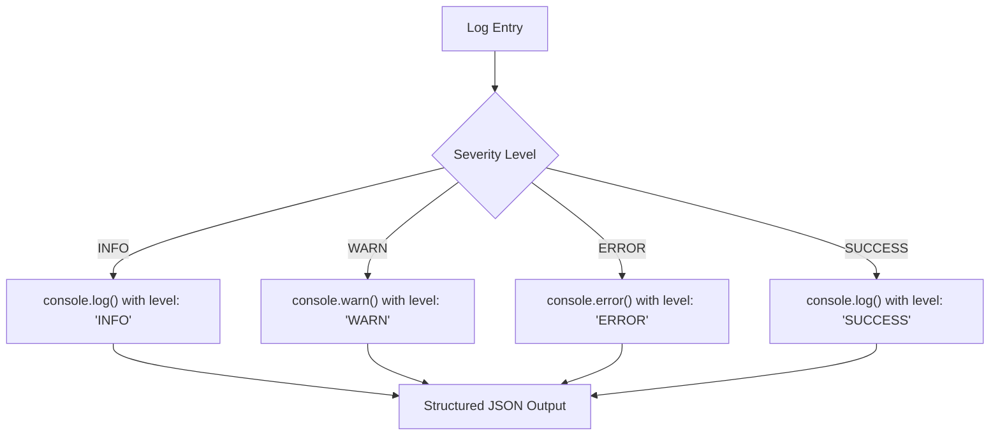
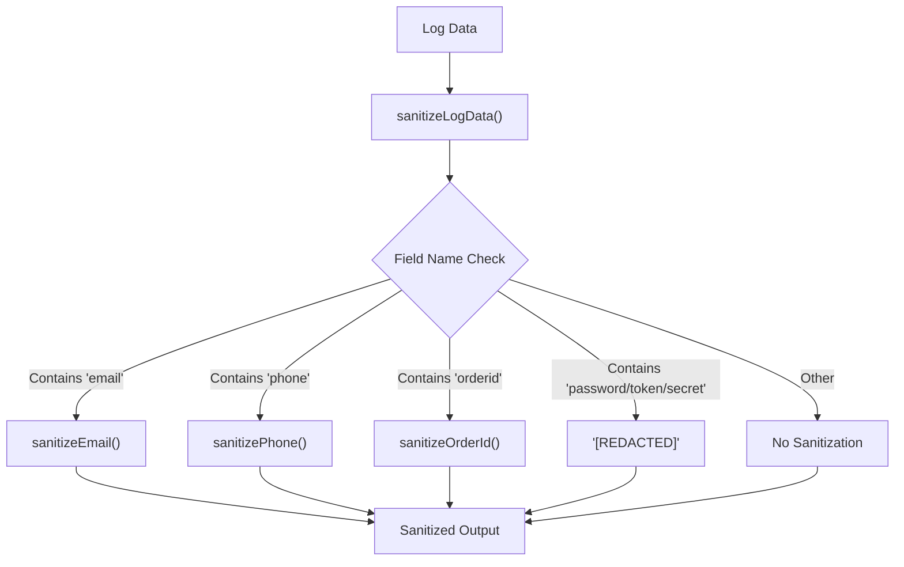
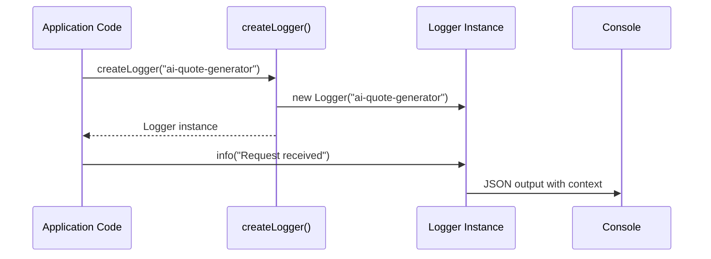

# Centralized Logging System

<cite>
**Referenced Files in This Document**   
- [logger.ts](file://supabase/functions/_shared/logger.ts)
- [ai-quote-generator/index.ts](file://supabase/functions/ai-quote-generator/index.ts)
- [email-service/index.ts](file://supabase/functions/email-service/index.ts)
- [analytics-service/index.ts](file://supabase/functions/analytics-service/index.ts)
- [log-audit-action/index.ts](file://supabase/functions/log-audit-action/index.ts)
</cite>

## Table of Contents
1. [Introduction](#introduction)
2. [Logger Class Implementation](#logger-class-implementation)
3. [Log Severity Levels](#log-severity-levels)
4. [PII Sanitization Mechanisms](#pii-sanitization-mechanisms)
5. [Context-Specific Logging with createLogger](#context-specific-logging-with-createlogger)
6. [Log Formatting and Structure](#log-formatting-and-structure)
7. [Integration with External Monitoring Tools](#integration-with-external-monitoring-tools)
8. [Log Retention Policies](#log-retention-policies)
9. [Performance Implications in Serverless Environments](#performance-implications-in-serverless-environments)
10. [Security Considerations](#security-considerations)
11. [Consistent Logging Practices](#consistent-logging-practices)
12. [Conclusion](#conclusion)

## Introduction
The centralized logging system in the SleekApparels platform provides a structured, secure, and consistent approach to logging across all Supabase edge functions. Built around the `logger.ts` utility, this system ensures that all log entries are standardized, sensitive data is properly sanitized, and logs can be effectively used for monitoring, debugging, and compliance purposes. The implementation addresses the unique challenges of serverless environments while maintaining high security standards for handling personally identifiable information (PII).

**Section sources**
- [logger.ts](file://supabase/functions/_shared/logger.ts#L1-L172)

## Logger Class Implementation

The Logger class provides a robust foundation for structured logging across the application. Implemented as a TypeScript class, it encapsulates logging functionality with built-in security features and consistent formatting. The class is designed to be instantiated with a context parameter that identifies the source of the logs, enabling better traceability across distributed systems.

The implementation follows object-oriented principles with private properties and public methods for different log levels. Each instance maintains its context, which is included in every log entry to provide traceability. The class leverages JSON serialization to ensure structured output that can be easily parsed by log aggregation tools.

**Diagram sources**
- [logger.ts](file://supabase/functions/_shared/logger.ts#L93-L165)

**Section sources**
- [logger.ts](file://supabase/functions/_shared/logger.ts#L93-L172)

## Log Severity Levels

The logging system implements four distinct severity levels to categorize log entries based on their importance and context:

- **INFO**: General operational messages that track the normal flow of application execution
- **WARN**: Recoverable issues or potential problems that don't prevent functionality
- **ERROR**: Failures and exceptions that indicate a problem requiring attention
- **SUCCESS**: Positive outcomes of completed operations, useful for tracking successful workflows

Each severity level corresponds to appropriate console methods (console.log for INFO and SUCCESS, console.warn for WARN, and console.error for ERROR), ensuring proper handling by logging infrastructure. The structured JSON output includes the level field, making it easy to filter and analyze logs based on severity.

**Diagram sources**
- [logger.ts](file://supabase/functions/_shared/logger.ts#L103-L164)

**Section sources**
- [logger.ts](file://supabase/functions/_shared/logger.ts#L100-L164)

## PII Sanitization Mechanisms

The logging system incorporates comprehensive PII sanitization to protect sensitive information while maintaining the debuggability of log data. The sanitization process automatically detects and redacts sensitive fields based on their names and applies appropriate masking strategies.

The system implements specialized sanitization functions for different types of PII:
- Email addresses are masked to show only the first three characters and full domain
- Phone numbers display only the first four and last two digits
- Order IDs are truncated to the first eight characters
- Passwords, tokens, and secrets are completely redacted

This automated sanitization occurs through the `sanitizeLogData` function, which inspects all log data fields and applies the appropriate sanitization based on field naming conventions, ensuring that sensitive information never reaches log storage systems.

**Diagram sources**
- [logger.ts](file://supabase/functions/_shared/logger.ts#L61-L80)

**Section sources**
- [logger.ts](file://supabase/functions/_shared/logger.ts#L14-L56)

## Context-Specific Logging with createLogger

The `createLogger` factory function enables context-specific logging instances throughout the application. This pattern allows different components and functions to create logger instances with descriptive context names, making it easier to trace log entries back to their source.

By using descriptive context names such as "ai-quote-generator" or "email-service", the system provides clear attribution for log entries. This approach enhances troubleshooting capabilities by immediately identifying which component generated a particular log message. The factory function simplifies logger creation and ensures consistent initialization across the codebase.

**Diagram sources**
- [logger.ts](file://supabase/functions/_shared/logger.ts#L170-L171)

**Section sources**
- [logger.ts](file://supabase/functions/_shared/logger.ts#L167-L172)

## Log Formatting and Structure

All log entries follow a consistent JSON structure that includes standardized fields for easy parsing and analysis. Each log entry contains:

- **level**: The severity level (INFO, WARN, ERROR, SUCCESS)
- **timestamp**: ISO format timestamp with timezone information
- **context**: The component or service that generated the log
- **message**: The primary log message
- **Additional data**: Any structured data passed to the logging method

This structured format enables reliable log parsing by monitoring tools and facilitates advanced querying capabilities. The use of JSON ensures that log entries can contain complex nested data structures while maintaining readability and machine-parsability.

**Section sources**
- [logger.ts](file://supabase/functions/_shared/logger.ts#L106-L112)

## Integration with External Monitoring Tools

The structured JSON logging format is designed to integrate seamlessly with external monitoring and observability platforms. The consistent schema allows for automatic field extraction and indexing by services like Datadog, New Relic, or AWS CloudWatch.

The logging system's design considerations for external integration include:
- Consistent field naming for reliable parsing
- Machine-readable timestamps in ISO format
- Structured error information with message and stack trace
- Contextual information for correlation across services

This integration enables comprehensive monitoring, alerting, and analytics capabilities, transforming raw log data into actionable insights for operations and development teams.

**Section sources**
- [logger.ts](file://supabase/functions/_shared/logger.ts#L86-L87)

## Log Retention Policies

The platform implements log retention policies aligned with operational needs and compliance requirements. While the logging utility itself doesn't manage retention, it produces structured output that can be processed by log management systems according to defined retention rules.

Typical retention policies for different log types include:
- INFO and SUCCESS logs: 30 days for operational analysis
- WARN logs: 90 days for trend analysis
- ERROR logs: 365 days for debugging and compliance
- Security-related logs: Extended retention as required by regulations

These policies ensure that logs are retained for appropriate periods while managing storage costs and compliance obligations.

**Section sources**
- [logger.ts](file://supabase/functions/_shared/logger.ts#L1-L172)

## Performance Implications in Serverless Environments

The logging implementation considers the performance characteristics of serverless environments, where synchronous operations can impact function execution time and cost. The current implementation uses synchronous console logging, which is generally acceptable in most serverless platforms but has some performance implications.

Key performance considerations include:
- Synchronous JSON serialization adds minimal overhead
- Console output is typically buffered and processed asynchronously by the platform
- Excessive logging can increase function duration and cold start times
- Large log payloads consume more memory and bandwidth

For high-throughput functions, consideration should be given to batching log entries or implementing asynchronous logging mechanisms to minimize performance impact.

**Section sources**
- [logger.ts](file://supabase/functions/_shared/logger.ts#L105-L113)

## Security Considerations

The logging system incorporates multiple security measures to protect sensitive data and ensure compliance with privacy regulations:

- **Automatic PII detection and sanitization** prevents accidental exposure of sensitive information
- **Context-based filtering** ensures that only appropriate data is logged
- **Structured error handling** prevents stack trace leakage in production
- **Environment-aware logging** can adjust verbosity based on deployment environment

The system supports compliance with data privacy regulations such as GDPR, CCPA, and HIPAA by ensuring that PII is never stored in raw form in log systems. The sanitization functions are designed to meet regulatory requirements for data minimization and protection.

**Section sources**
- [logger.ts](file://supabase/functions/_shared/logger.ts#L61-L80)

## Consistent Logging Practices

To ensure consistent logging across all Supabase functions, the following guidelines should be followed:

1. **Use context-specific loggers**: Always create loggers with descriptive context names
2. **Include relevant data**: Pass structured data objects rather than string concatenation
3. **Use appropriate severity levels**: Match log level to the actual severity of the event
4. **Avoid sensitive data**: Never intentionally log passwords, tokens, or complete PII
5. **Maintain consistency**: Follow the same patterns for similar operations across functions

These practices ensure that logs are useful for debugging, monitoring, and auditing while maintaining security and performance standards.

**Section sources**
- [logger.ts](file://supabase/functions/_shared/logger.ts#L1-L172)

## Conclusion

The centralized logging system provides a robust foundation for observability and debugging in the SleekApparels platform. By implementing structured JSON logging with automatic PII sanitization, the system balances the need for detailed operational insights with strict security requirements. The Logger class and createLogger factory function enable consistent logging practices across all Supabase edge functions, while the structured format facilitates integration with external monitoring tools. This comprehensive approach to logging supports both operational excellence and regulatory compliance in a serverless environment.