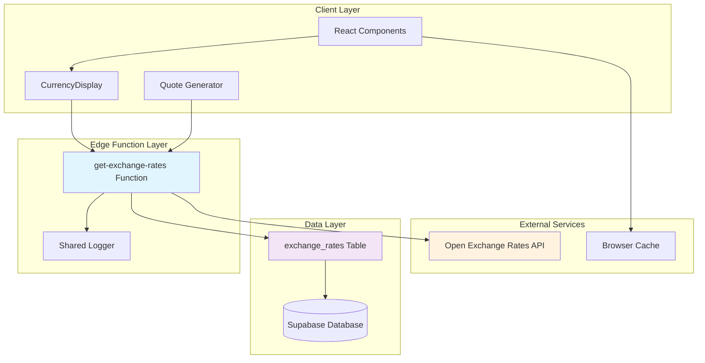
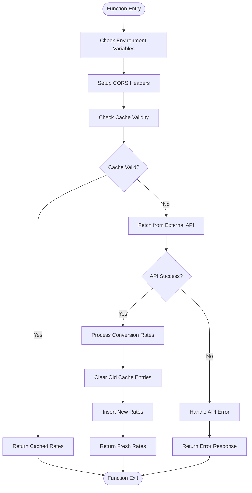
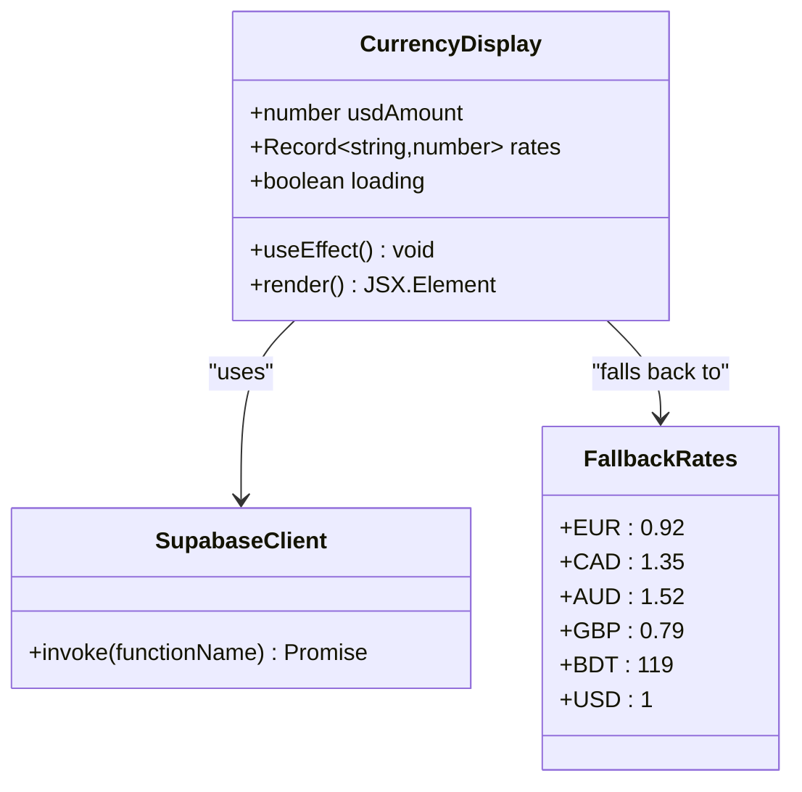
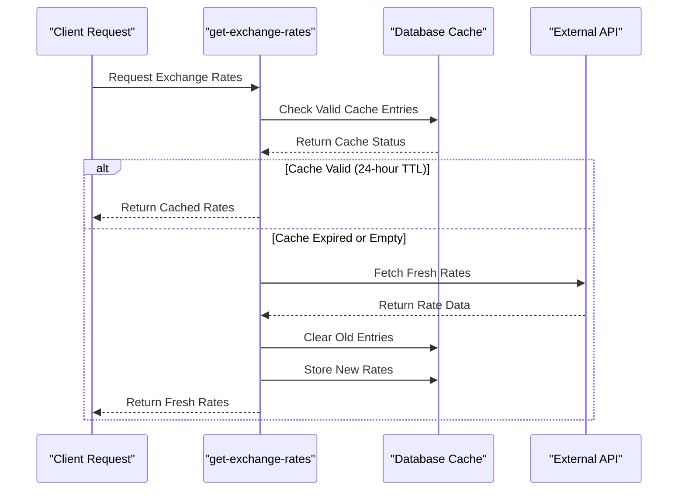
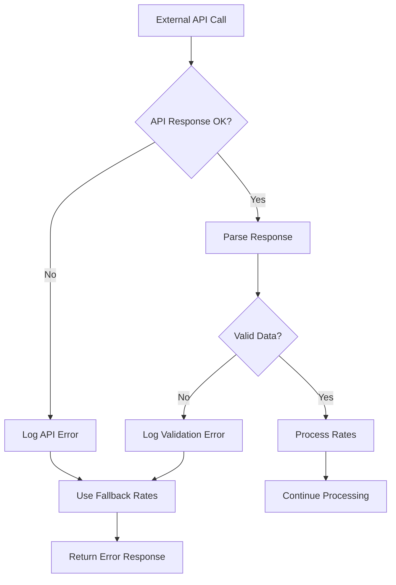
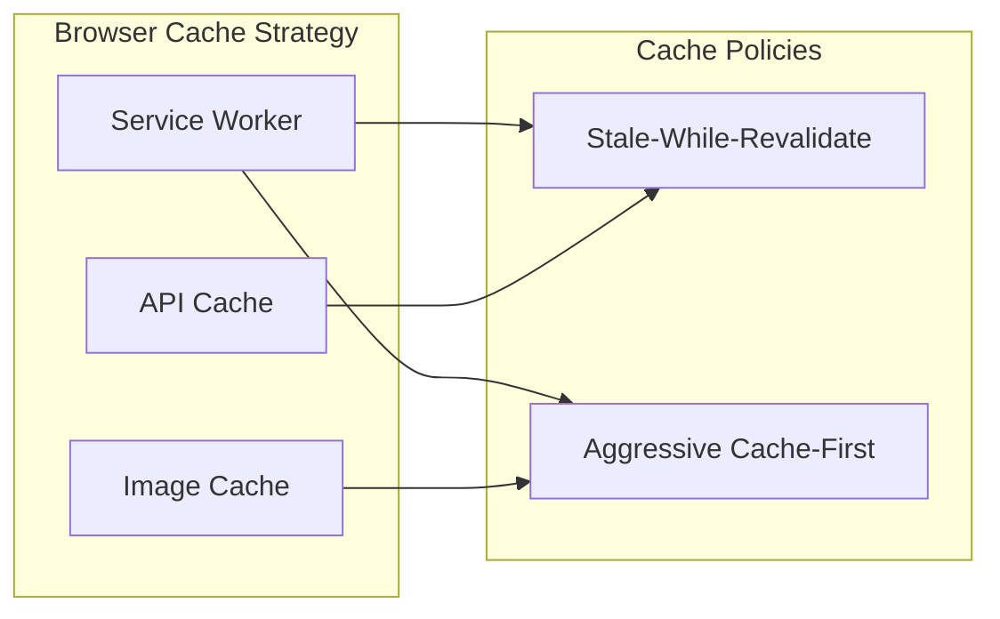
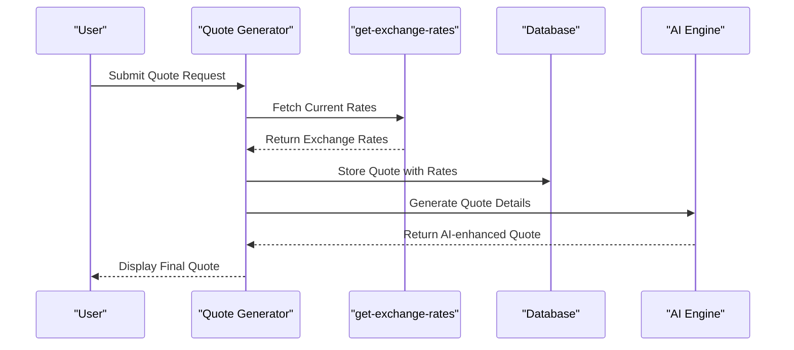

# Dynamic Exchange Rate Service API Documentation

<cite>
**Referenced Files in This Document**
- [supabase/functions/get-exchange-rates/index.ts](file://supabase/functions/get-exchange-rates/index.ts)
- [src/components/quote/CurrencyDisplay.tsx](file://src/components/quote/CurrencyDisplay.tsx)
- [supabase/functions/_shared/logger.ts](file://supabase/functions/_shared/logger.ts)
- [src/integrations/supabase/client.ts](file://src/integrations/supabase/client.ts)
- [supabase/migrations/20251115150759_remix_migration_from_pg_dump.sql](file://supabase/migrations/20251115150759_remix_migration_from_pg_dump.sql)
- [public/sw.js](file://public/sw.js)
- [supabase/functions/generate-invoice/index.ts](file://supabase/functions/generate-invoice/index.ts)
- [supabase/functions/convert-quote-to-order/index.ts](file://supabase/functions/convert-quote-to-order/index.ts)
</cite>

## Table of Contents
1. [Introduction](#introduction)
2. [System Architecture](#system-architecture)
3. [Exchange Rates Database Schema](#exchange-rates-database-schema)
4. [get-exchange-rates Supabase Function](#get-exchange-rates-supabase-function)
5. [CurrencyDisplay Component](#currencydisplay-component)
6. [Caching Mechanism](#caching-mechanism)
7. [Supported Currencies](#supported-currencies)
8. [API Request/Response Schema](#api-requestresponse-schema)
9. [Error Handling](#error-handling)
10. [Performance Optimization](#performance-optimization)
11. [Financial Accuracy Requirements](#financial-accuracy-requirements)
12. [Integration with Quotes and Invoices](#integration-with-quotes-and-invoices)
13. [Troubleshooting Guide](#troubleshooting-guide)
14. [Conclusion](#conclusion)

## Introduction

The Dynamic Exchange Rate Service is a critical component of the Sleek Apparels platform that provides real-time currency conversion capabilities for international transactions. Built on Supabase Edge Functions, this service fetches currency conversion rates from external APIs, implements intelligent caching mechanisms, and ensures financial accuracy for quotes, orders, and invoices.

The service serves as the backbone for multi-currency support across the platform, enabling seamless conversion between USD (base currency) and six major international currencies: EUR, CAD, AUD, GBP, and BDT. It implements sophisticated caching strategies to minimize external API calls while maintaining currency accuracy within acceptable financial tolerances.

## System Architecture

The exchange rate service follows a serverless architecture with multiple layers of abstraction and optimization:



**Diagram sources**
- [supabase/functions/get-exchange-rates/index.ts](file://supabase/functions/get-exchange-rates/index.ts#L1-L88)
- [src/components/quote/CurrencyDisplay.tsx](file://src/components/quote/CurrencyDisplay.tsx#L1-L66)
- [supabase/functions/_shared/logger.ts](file://supabase/functions/_shared/logger.ts)

## Exchange Rates Database Schema

The exchange rates are stored in a dedicated database table with comprehensive indexing and temporal validity tracking:

| Column | Type | Constraints | Description |
|--------|------|-------------|-------------|
| `id` | UUID | PRIMARY KEY | Unique identifier for each rate record |
| `base_currency` | TEXT | NOT NULL, DEFAULT 'USD' | Base currency (always USD) |
| `target_currency` | TEXT | NOT NULL | Target currency code |
| `rate` | NUMERIC(10,6) | NOT NULL | Conversion rate from base to target |
| `fetched_at` | TIMESTAMP WITH TIME ZONE | NOT NULL, DEFAULT now() | Timestamp when rate was fetched |
| `valid_until` | TIMESTAMP WITH TIME ZONE | NOT NULL | Expiration timestamp for cache invalidation |
| `created_at` | TIMESTAMP WITH TIME ZONE | NOT NULL, DEFAULT now() | Record creation timestamp |

**Section sources**
- [supabase/migrations/20251115150759_remix_migration_from_pg_dump.sql](file://supabase/migrations/20251115150759_remix_migration_from_pg_dump.sql#L1097-L1103)

## get-exchange-rates Supabase Function

The core exchange rate retrieval logic is implemented as a Supabase Edge Function that provides robust currency conversion capabilities:

### Function Architecture



**Diagram sources**
- [supabase/functions/get-exchange-rates/index.ts](file://supabase/functions/get-exchange-rates/index.ts#L9-L88)

### Key Implementation Features

The function implements several critical features for production reliability:

1. **Environment Variable Management**: Secure handling of API keys and Supabase credentials
2. **CORS Support**: Full cross-origin resource sharing for web client access
3. **Rate Limiting Protection**: Built-in throttling through external API limits
4. **Error Resilience**: Comprehensive error handling with fallback mechanisms
5. **Temporal Caching**: Intelligent cache expiration based on rate freshness

**Section sources**
- [supabase/functions/get-exchange-rates/index.ts](file://supabase/functions/get-exchange-rates/index.ts#L1-L88)

## CurrencyDisplay Component

The CurrencyDisplay component provides a user-friendly interface for displaying multi-currency amounts with real-time conversion capabilities:

### Component Architecture



**Diagram sources**
- [src/components/quote/CurrencyDisplay.tsx](file://src/components/quote/CurrencyDisplay.tsx#L1-L66)

### Component Features

1. **Real-time Rate Fetching**: Automatic currency rate updates on component mount
2. **Loading States**: Graceful loading indicators during API calls
3. **Fallback Mechanisms**: Predefined rates during external API failures
4. **Responsive Display**: Multi-currency amount visualization
5. **Type Safety**: Strongly typed props and state management

**Section sources**
- [src/components/quote/CurrencyDisplay.tsx](file://src/components/quote/CurrencyDisplay.tsx#L1-L66)

## Caching Mechanism

The exchange rate service implements a sophisticated caching strategy to optimize performance and minimize external API dependencies:

### Cache Validation Logic



**Diagram sources**
- [supabase/functions/get-exchange-rates/index.ts](file://supabase/functions/get-exchange-rates/index.ts#L22-L36)

### Cache Invalidation Policies

The service implements the following cache management strategies:

1. **Time-based Expiration**: 24-hour cache duration for rate freshness
2. **Atomic Updates**: Complete cache replacement to prevent partial updates
3. **Base Currency Isolation**: Separate cache entries for different base currencies
4. **Bulk Operations**: Efficient clearing and insertion of multiple rate records

**Section sources**
- [supabase/functions/get-exchange-rates/index.ts](file://supabase/functions/get-exchange-rates/index.ts#L48-L72)

## Supported Currencies

The exchange rate service supports six primary currencies with predefined configurations:

| Currency Code | Currency Name | Base Currency | Description |
|---------------|---------------|---------------|-------------|
| USD | United States Dollar | USD | Base currency for all conversions |
| EUR | Euro | USD | European Union currency |
| CAD | Canadian Dollar | USD | Canadian currency |
| AUD | Australian Dollar | USD | Australian currency |
| GBP | British Pound Sterling | USD | United Kingdom currency |
| BDT | Bangladeshi Taka | USD | Bangladesh national currency |

### Currency Selection Criteria

The selection of these currencies reflects strategic business decisions:

1. **Market Coverage**: Primary markets served by Sleek Apparels
2. **Transaction Volume**: Currencies with significant international trade activity
3. **API Availability**: Compatible with Open Exchange Rates API
4. **Financial Stability**: Currencies with reliable exchange rate data

**Section sources**
- [supabase/functions/get-exchange-rates/index.ts](file://supabase/functions/get-exchange-rates/index.ts#L19-L20)

## API Request/Response Schema

### Request Schema

The get-exchange-rates function accepts HTTP requests with the following structure:

| Parameter | Type | Required | Description |
|-----------|------|----------|-------------|
| `method` | String | Yes | HTTP method (GET/POST/OPTIONS) |
| `headers` | Object | Yes | CORS headers and content type |
| `body` | JSON | No | Function-specific parameters |

### Response Schema

Successful responses return structured JSON with the following format:

```typescript
{
  "rates": [
    {
      "base_currency": "USD",
      "target_currency": "EUR",
      "rate": 0.92,
      "valid_until": "2024-01-15T12:00:00Z"
    },
    {
      "base_currency": "USD",
      "target_currency": "CAD",
      "rate": 1.35,
      "valid_until": "2024-01-15T12:00:00Z"
    }
  ]
}
```

### Error Response Schema

Failed requests return standardized error responses:

```typescript
{
  "error": "Error message describing the failure"
}
```

**Section sources**
- [supabase/functions/get-exchange-rates/index.ts](file://supabase/functions/get-exchange-rates/index.ts#L32-L34)
- [supabase/functions/get-exchange-rates/index.ts](file://supabase/functions/get-exchange-rates/index.ts#L84-L86)

## Error Handling

The exchange rate service implements comprehensive error handling across multiple layers:

### External API Failure Handling



**Diagram sources**
- [supabase/functions/get-exchange-rates/index.ts](file://supabase/functions/get-exchange-rates/index.ts#L42-L44)
- [src/components/quote/CurrencyDisplay.tsx](file://src/components/quote/CurrencyDisplay.tsx#L24-L34)

### Error Categories and Responses

1. **Network Failures**: External API connectivity issues
2. **Rate Limit Exceeded**: API quota limitations
3. **Invalid Data**: Malformed or missing rate data
4. **Database Errors**: Cache storage failures
5. **Configuration Issues**: Missing environment variables

### Fallback Strategies

When external API calls fail, the system employs multiple fallback mechanisms:

1. **Component-level Fallback**: Predefined rates in React components
2. **Database-level Fallback**: Cached rates from previous successful calls
3. **Graceful Degradation**: Functional display with warning indicators

**Section sources**
- [supabase/functions/get-exchange-rates/index.ts](file://supabase/functions/get-exchange-rates/index.ts#L81-L87)
- [src/components/quote/CurrencyDisplay.tsx](file://src/components/quote/CurrencyDisplay.tsx#L24-L34)

## Performance Optimization

The exchange rate service incorporates multiple performance optimization strategies:

### Browser-Level Caching

The service integrates with browser service worker caching for enhanced performance:



**Diagram sources**
- [public/sw.js](file://public/sw.js#L50-L109)

### Edge Function Optimization

1. **Cold Start Mitigation**: Efficient initialization and minimal dependencies
2. **Memory Management**: Proper cleanup of temporary variables
3. **Network Efficiency**: Single API call for all required rates
4. **Database Optimization**: Batch operations for cache management

### Rate Limiting and Throttling

The service implements several rate limiting measures:

1. **External API Limits**: Compliance with Open Exchange Rates API quotas
2. **Internal Throttling**: Function-level request rate control
3. **Cache Efficiency**: Minimized redundant API calls through effective caching
4. **Concurrent Request Handling**: Thread-safe cache operations

**Section sources**
- [public/sw.js](file://public/sw.js#L50-L109)
- [supabase/functions/get-exchange-rates/index.ts](file://supabase/functions/get-exchange-rates/index.ts#L39-L40)

## Financial Accuracy Requirements

The exchange rate service maintains strict financial accuracy standards essential for business operations:

### Accuracy Standards

| Metric | Requirement | Tolerance | Validation Method |
|--------|-------------|-----------|-------------------|
| Conversion Precision | 6 decimal places | ±0.000001 | Database constraint enforcement |
| Rate Freshness | 24-hour TTL | ±1 hour | Valid_until timestamp validation |
| Consistency | USD base currency | Fixed | Hardcoded base currency |
| Reconciliation | ±0.5% variance | ±0.5% | Price matching validation |

### Reconciliation Procedures

The system implements automated reconciliation for financial transactions:

1. **Quote-to-Invoice Matching**: Currency conversion consistency verification
2. **Order Price Validation**: Amount accuracy checking against quote prices
3. **Payment Verification**: Currency conversion accuracy for payment processing
4. **Audit Trail**: Complete transaction history with rate details

### Compliance Measures

1. **Data Integrity**: Database constraints ensuring rate accuracy
2. **Transaction Logging**: Comprehensive audit trails for financial reviews
3. **Error Monitoring**: Real-time alerting for accuracy deviations
4. **Backup Systems**: Redundant rate sources for critical transactions

**Section sources**
- [supabase/functions/create-payment-intent/index.ts](file://supabase/functions/create-payment-intent/index.ts#L120-L131)
- [supabase/functions/generate-invoice/index.ts](file://supabase/functions/generate-invoice/index.ts#L86-L242)

## Integration with Quotes and Invoices

The exchange rate service seamlessly integrates with the platform's quote generation and invoicing systems:

### Quote Generation Integration



**Diagram sources**
- [supabase/functions/convert-quote-to-order/index.ts](file://supabase/functions/convert-quote-to-order/index.ts#L38-L222)

### Invoice Generation Integration

The invoice generation process leverages cached exchange rates for accurate billing:

1. **Rate Retrieval**: Automatic fetch of current conversion rates
2. **Amount Calculation**: Multi-currency pricing validation
3. **PDF Generation**: Currency-aware invoice formatting
4. **Email Delivery**: Multi-language invoice distribution

### Order Processing Integration

When converting quotes to orders, the system maintains currency consistency:

1. **Price Validation**: Ensures quote and order prices match within tolerance
2. **Rate Preservation**: Uses quote-specific rates for order calculations
3. **Change Detection**: Alerts for significant rate fluctuations
4. **Audit Tracking**: Complete change history for financial review

**Section sources**
- [supabase/functions/convert-quote-to-order/index.ts](file://supabase/functions/convert-quote-to-order/index.ts#L38-L222)
- [supabase/functions/generate-invoice/index.ts](file://supabase/functions/generate-invoice/index.ts#L86-L242)

## Troubleshooting Guide

### Common Issues and Solutions

#### Exchange Rate API Failures

**Symptoms**: 
- CurrencyDisplay shows loading indefinitely
- API error responses in console
- Fallback rates being used consistently

**Diagnosis Steps**:
1. Check external API availability
2. Verify API key configuration
3. Review rate limit status
4. Examine network connectivity

**Resolution**:
- Confirm API service status
- Update API credentials if expired
- Implement retry logic with exponential backoff
- Monitor rate limit consumption

#### Cache Inconsistencies

**Symptoms**:
- Stale exchange rates displayed
- Inconsistent rate values across sessions
- Cache validation errors

**Diagnosis Steps**:
1. Verify cache expiration timestamps
2. Check database connection status
3. Review cache clearing operations
4. Examine concurrent access patterns

**Resolution**:
- Force cache refresh
- Implement cache warming strategies
- Optimize cache invalidation logic
- Add cache consistency checks

#### Performance Issues

**Symptoms**:
- Slow rate retrieval responses
- High API call frequency
- Browser cache misses

**Diagnosis Steps**:
1. Profile API response times
2. Analyze cache hit rates
3. Review browser cache configuration
4. Monitor concurrent request patterns

**Resolution**:
- Optimize cache TTL settings
- Implement prefetch strategies
- Enhance browser caching policies
- Add request batching capabilities

### Monitoring and Alerting

The service includes comprehensive monitoring capabilities:

1. **Error Rate Tracking**: Automated alerts for API failure rates
2. **Performance Metrics**: Response time monitoring and alerting
3. **Cache Efficiency**: Hit ratio tracking and optimization
4. **Financial Accuracy**: Deviation detection for rate accuracy

**Section sources**
- [supabase/functions/_shared/logger.ts](file://supabase/functions/_shared/logger.ts#L1-L173)

## Conclusion

The Dynamic Exchange Rate Service represents a sophisticated solution for multi-currency support in the Sleek Apparels platform. Through its combination of intelligent caching, robust error handling, and seamless integration with business workflows, the service ensures reliable currency conversion capabilities while maintaining financial accuracy and system performance.

Key strengths of the implementation include:

- **Reliability**: Multiple fallback mechanisms ensure continuous operation
- **Performance**: Intelligent caching minimizes API calls and improves response times
- **Accuracy**: Strict financial standards and reconciliation procedures
- **Scalability**: Serverless architecture supports growing transaction volumes
- **Maintainability**: Clean separation of concerns and comprehensive error handling

The service continues to evolve with ongoing enhancements to cache strategies, error handling, and integration capabilities, ensuring it remains a cornerstone of the platform's international commerce infrastructure.