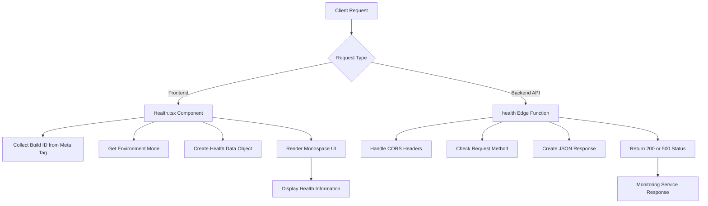
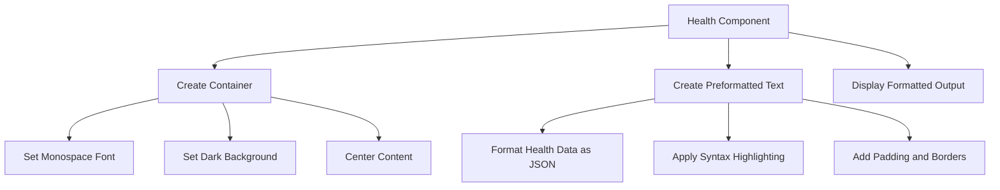
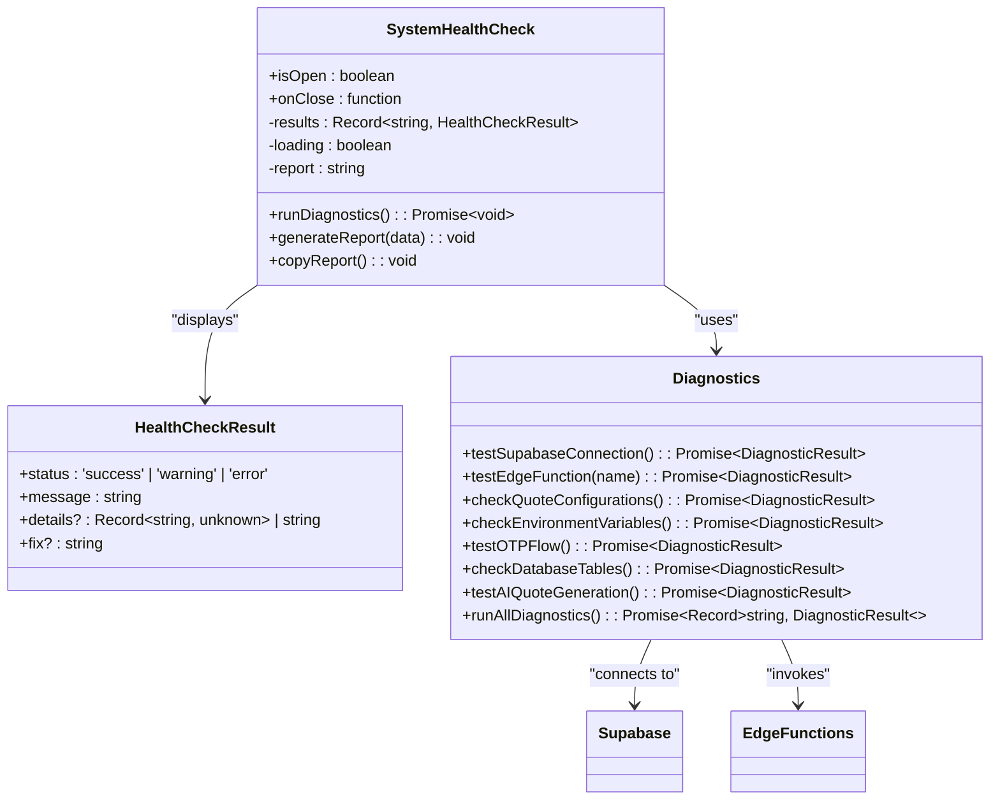

# System Health Check Endpoint

<cite>
**Referenced Files in This Document**   
- [Health.tsx](file://src/pages/Health.tsx)
- [index.ts](file://supabase/functions/health/index.ts)
- [diagnostics.ts](file://src/lib/diagnostics.ts)
- [SystemHealthCheck.tsx](file://src/components/SystemHealthCheck.tsx)
</cite>

## Table of Contents
1. [Introduction](#introduction)
2. [Health Endpoint Implementation](#health-endpoint-implementation)
3. [JSON Response Structure](#json-response-structure)
4. [UI Rendering in Health.tsx](#ui-rendering-in-healthtsx)
5. [System Health Check Component](#system-health-check-component)
6. [Integration with Monitoring Services](#integration-with-monitoring-services)
7. [Security Considerations](#security-considerations)
8. [Error Handling Patterns](#error-handling-patterns)
9. [Conclusion](#conclusion)

## Introduction

The system health check endpoint serves as a critical monitoring tool for the Sleek Apparels platform, providing real-time status information about the application's operational state. This documentation details the implementation of both frontend and backend health check mechanisms, covering the JSON response structure, UI rendering, integration with monitoring services, and security considerations. The health check system consists of two main components: a frontend health page accessible to users and administrators, and a backend edge function used for infrastructure monitoring.

**Section sources**
- [Health.tsx](file://src/pages/Health.tsx)
- [index.ts](file://supabase/functions/health/index.ts)

## Health Endpoint Implementation

The health check functionality is implemented through two complementary systems: a frontend health page and a backend edge function. The frontend implementation in `Health.tsx` creates a user-facing health check page that displays application status, build information, timestamp, environment mode, and version. This component retrieves the build ID from a meta tag in the document head, ensuring the displayed build information matches the currently deployed version.

The backend implementation resides in the Supabase edge function at `supabase/functions/health/index.ts`, which provides a lightweight API endpoint for monitoring services. This edge function implements CORS headers to allow cross-origin requests and handles OPTIONS preflight requests for CORS compliance. The function returns a JSON response with basic health information including a status flag, timestamp, and service identifier. Both implementations follow a similar pattern of collecting system information and returning it in a structured format, but serve different purposes: the frontend version for human consumption and the backend version for automated monitoring.

**Diagram sources**
- [Health.tsx](file://src/pages/Health.tsx)
- [index.ts](file://supabase/functions/health/index.ts)

**Section sources**
- [Health.tsx](file://src/pages/Health.tsx#L1-L31)
- [index.ts](file://supabase/functions/health/index.ts#L1-L33)

## JSON Response Structure

The health check endpoint returns structured JSON data containing essential system information. The frontend implementation in `Health.tsx` produces a response with the following fields:

- **app**: Status indicator with value "ok" when the application is functioning normally
- **buildId**: Unique identifier for the current build, retrieved from the meta tag or defaulting to "unknown"
- **timestamp**: ISO 8601 formatted timestamp of when the health check was performed
- **environment**: Current environment mode (e.g., "development", "production") obtained from Vite's import.meta.env.MODE
- **version**: Application version identifier, currently hardcoded as "v7"

The backend edge function returns a slightly different structure optimized for monitoring services:
- **ok**: Boolean flag indicating health status (true for healthy)
- **timestamp**: ISO 8601 formatted timestamp
- **service**: Identifier for the service being checked, set to "edge-functions"

Both endpoints use JSON serialization with proper headers and appropriate HTTP status codes (200 for success, 500 for errors). The frontend version includes error handling that logs issues to the console but continues to display available information, while the backend version catches exceptions and returns a structured error response.

**Section sources**
- [Health.tsx](file://src/pages/Health.tsx#L5-L11)
- [index.ts](file://supabase/functions/health/index.ts#L13-L17)

## UI Rendering in Health.tsx

The `Health.tsx` component implements a monospace UI design for human-readable display of health information. The component uses inline styles to create a terminal-like interface with a dark background (#1a1a1a) and green text (#4ade80), evoking a command-line interface aesthetic that is commonly associated with system diagnostics.

The UI structure consists of a container div with monospace font family, proper padding, and centered layout. Within this container, a `<pre>` element displays the JSON-formatted health data using `JSON.stringify()` with indentation (2 spaces) for readability. The styling includes rounded corners, overflow handling, and appropriate spacing to ensure the content is easily readable on various screen sizes.

This design choice serves multiple purposes: it clearly distinguishes the health check page from regular application interfaces, provides excellent readability for technical users, and creates a professional impression of system transparency. The monospace font ensures that the JSON formatting is preserved and aligned properly, making it easier to scan and parse the information visually.

**Diagram sources**
- [Health.tsx](file://src/pages/Health.tsx#L14-L28)

**Section sources**
- [Health.tsx](file://src/pages/Health.tsx#L14-L28)

## System Health Check Component

Beyond the basic health endpoint, the system includes a comprehensive diagnostic tool implemented in `SystemHealthCheck.tsx`. This component provides detailed system diagnostics through the `runAllDiagnostics()` function imported from `src/lib/diagnostics.ts`. The diagnostic system performs multiple checks including Supabase connection testing, edge function availability, database table verification, environment variable validation, and OTP flow testing.

The `SystemHealthCheck` component presents a modal interface with a button to run diagnostics, displaying results in a structured format with status indicators (success, warning, error). Each diagnostic result includes a message, optional details, and suggested fixes for issues. The component also generates a markdown-formatted report that can be copied to the clipboard for sharing with support teams.

The diagnostic process is implemented as a series of parallel asynchronous operations using `Promise.all()`, ensuring efficient execution. Results are displayed with appropriate visual indicators and organized by diagnostic category, providing administrators with comprehensive visibility into system health beyond the basic endpoint status.

**Diagram sources**
- [SystemHealthCheck.tsx](file://src/components/SystemHealthCheck.tsx)
- [diagnostics.ts](file://src/lib/diagnostics.ts)

**Section sources**
- [SystemHealthCheck.tsx](file://src/components/SystemHealthCheck.tsx#L1-L101)
- [diagnostics.ts](file://src/lib/diagnostics.ts#L1-L269)

## Integration with Monitoring Services

The health check endpoints are designed to integrate seamlessly with external monitoring services and automated verification workflows. The backend edge function at `/functions/health` provides a lightweight, fast-response endpoint ideal for uptime monitoring services like Pingdom, UptimeRobot, or Datadog. These services can poll the endpoint at regular intervals to verify system availability and receive immediate feedback on service status.

The JSON response structure is compatible with standard monitoring tool expectations, using HTTP 200 status for healthy responses and HTTP 500 for failures. The inclusion of a timestamp allows monitoring systems to calculate response latency and detect potential performance degradation over time.

For more comprehensive monitoring, the system supports automated health verification workflows through the diagnostic functions. These can be incorporated into CI/CD pipelines or scheduled tasks to perform regular system checks beyond simple uptime monitoring. The diagnostic report generation capability enables automated collection of system health data for trend analysis and proactive issue detection.

Additionally, the presence of rate limit monitoring in the admin dashboard (RateLimitMonitoringDashboard.tsx) suggests integration with broader system monitoring that includes API usage patterns and potential abuse detection, providing a more complete picture of system health.

**Section sources**
- [index.ts](file://supabase/functions/health/index.ts)
- [diagnostics.ts](file://src/lib/diagnostics.ts)
- [RateLimitMonitoringDashboard.tsx](file://src/components/admin/RateLimitMonitoringDashboard.tsx)

## Security Considerations

The health check implementation includes several security considerations to prevent information leakage and protect against abuse. The frontend health page, while informative, is accessible to any user who can navigate to the `/health` route, so it deliberately limits the information disclosed to non-sensitive data such as build ID, timestamp, environment mode, and version.

The backend edge function follows the principle of least privilege, exposing only essential health information without revealing internal system details that could aid attackers. Both implementations include proper error handling that avoids exposing stack traces or sensitive error messages to clients.

The system employs CORS headers in the edge function to control cross-origin access, allowing requests from authorized domains while preventing unauthorized access from malicious sites. The presence of similar CORS handling in other edge functions (e.g., ai-quote-generator, password-breach-check) indicates a consistent security approach across the API surface.

For production environments, additional security measures could include:
- Restricting access to the health endpoint based on IP whitelisting
- Implementing authentication for detailed diagnostic information
- Rate limiting requests to prevent abuse
- Removing or obfuscating build IDs in production to reduce information disclosure

The current implementation strikes a balance between transparency for legitimate users and operators while minimizing the risk of providing useful information to potential attackers.

**Section sources**
- [index.ts](file://supabase/functions/health/index.ts)
- [ai-quote-generator/index.ts](file://supabase/functions/ai-quote-generator/index.ts)
- [password-breach-check/index.ts](file://supabase/functions/password-breach-check/index.ts)

## Error Handling Patterns

The health check system implements robust error handling patterns to ensure reliability and provide meaningful feedback during failures. The backend edge function uses a try-catch wrapper around the entire response generation process, ensuring that any unexpected errors result in a proper HTTP 500 response with a structured error message rather than an unhandled exception.

In the frontend `Health.tsx` component, error handling is more permissive, as the goal is to display as much information as possible even when some data cannot be retrieved. For example, if the build ID meta tag is missing, the component defaults to "unknown" rather than failing to render.

The comprehensive diagnostic system in `diagnostics.ts` implements granular error handling for each individual check, allowing the system to report partial failures. Each diagnostic function returns a standardized result object that includes not only the status but also details about the error and suggested fixes, enabling effective troubleshooting.

The error handling approach follows a consistent pattern across the system:
1. Attempt the operation
2. Catch specific and general errors
3. Return structured error information
4. Provide actionable remediation steps
5. Log errors for debugging purposes

This pattern ensures that health checks remain informative even in failure scenarios, helping administrators quickly identify and resolve issues.

**Section sources**
- [index.ts](file://supabase/functions/health/index.ts#L11-L32)
- [diagnostics.ts](file://src/lib/diagnostics.ts)

## Conclusion

The system health check endpoint in the Sleek Apparels platform provides a comprehensive solution for monitoring application status and system health. Through a combination of frontend and backend implementations, the system offers both user-facing status information and machine-readable endpoints for automated monitoring services.

The design effectively balances transparency with security, providing essential operational information while minimizing the risk of information leakage. The inclusion of both a simple health check and a comprehensive diagnostic system allows for different levels of monitoring, from basic uptime verification to detailed system analysis.

Key strengths of the implementation include:
- Clean separation between frontend and backend health checks
- Consistent JSON response structures
- User-friendly monospace UI design
- Comprehensive diagnostic capabilities
- Robust error handling
- Security-conscious design

For production deployments, additional security measures such as access controls or rate limiting could be considered to further protect the health endpoints while maintaining their utility for monitoring and troubleshooting.