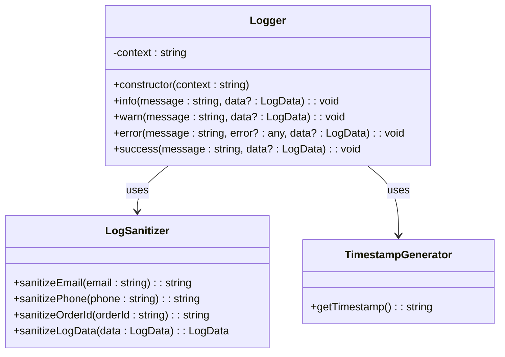
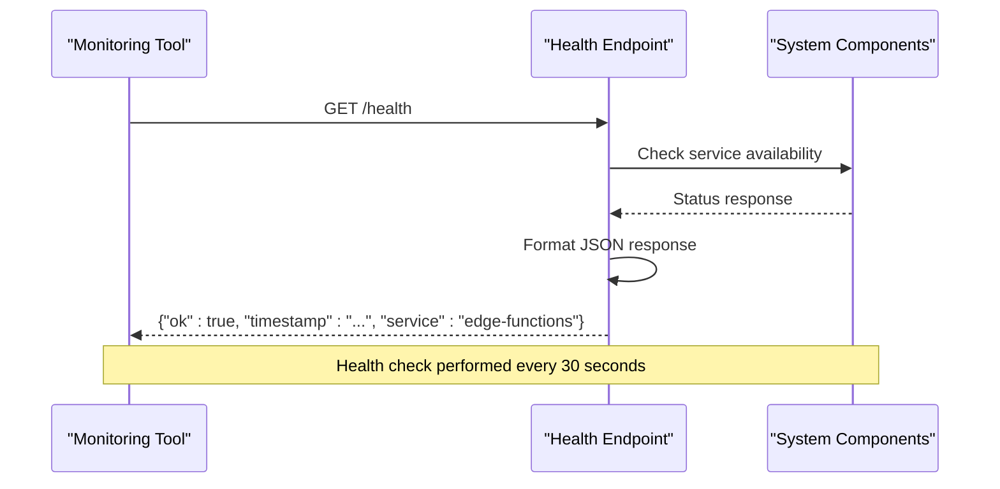
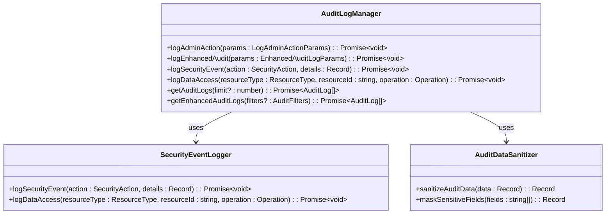
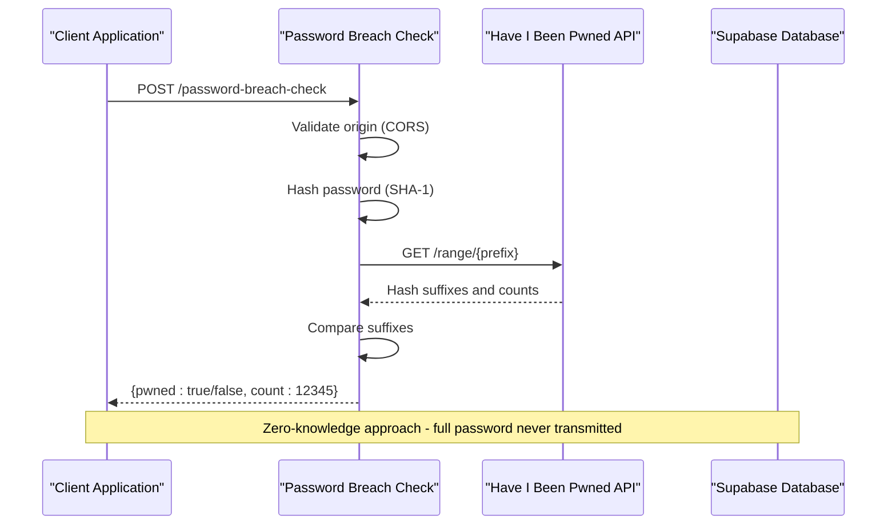
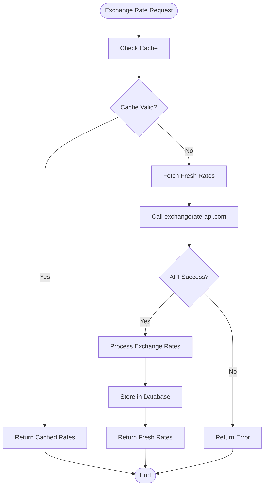
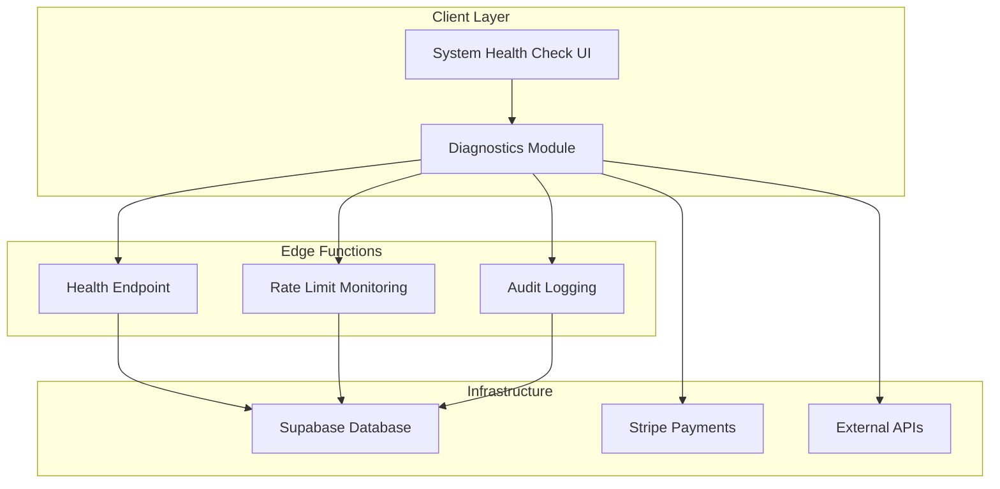

# Utility and Support Functions

<cite>
**Referenced Files in This Document**
- [logger.ts](file://supabase/functions/_shared/logger.ts)
- [health/index.ts](file://supabase/functions/health/index.ts)
- [log-audit-action/index.ts](file://supabase/functions/log-audit-action/index.ts)
- [password-breach-check/index.ts](file://supabase/functions/password-breach-check/index.ts)
- [get-exchange-rates/index.ts](file://supabase/functions/get-exchange-rates/index.ts)
- [auditLog.ts](file://src/lib/auditLog.ts)
- [enhancedAuditLog.ts](file://src/lib/enhancedAuditLog.ts)
- [diagnostics.ts](file://src/lib/diagnostics.ts)
- [SystemHealthCheck.tsx](file://src/components/SystemHealthCheck.tsx)
- [Health.tsx](file://src/pages/Health.tsx)
- [RateLimitMonitoringDashboard.tsx](file://src/components/admin/RateLimitMonitoringDashboard.tsx)
- [create-payment-intent/index.ts](file://supabase/functions/create-payment-intent/index.ts)
- [send-otp/index.ts](file://supabase/functions/send-otp/index.ts)
</cite>

## Table of Contents
1. [Introduction](#introduction)
2. [Centralized Logging System](#centralized-logging-system)
3. [Health Check Endpoint](#health-check-endpoint)
4. [Security Auditing and Compliance](#security-auditing-and-compliance)
5. [Authentication Security](#authentication-security)
6. [Dynamic Currency Conversion](#dynamic-currency-conversion)
7. [System Monitoring and Diagnostics](#system-monitoring-and-diagnostics)
8. [Performance Considerations](#performance-considerations)
9. [Implementation Guidelines](#implementation-guidelines)
10. [Security Best Practices](#security-best-practices)

## Introduction

SleekApp v100 implements a comprehensive suite of utility and support functions designed to provide robust logging, monitoring, security auditing, and operational capabilities. These functions form the backbone of the application's infrastructure, ensuring reliable operation, security compliance, and optimal performance across all edge functions and client-side operations.

The utility functions are built around several core principles:
- **Centralized Logging**: Structured, secure, and standardized logging across all functions
- **Security-First Design**: Comprehensive protection mechanisms for sensitive operations
- **Performance Optimization**: Intelligent caching and efficient resource utilization
- **Compliance Support**: Built-in audit trails and security monitoring
- **Operational Excellence**: Comprehensive monitoring and diagnostic capabilities

## Centralized Logging System

### Logger Architecture

The centralized logging system is implemented through a sophisticated logger utility that provides structured JSON output with automatic PII sanitization and multiple severity levels.



**Diagram sources**
- [logger.ts](file://supabase/functions/_shared/logger.ts#L93-L172)

### Structured JSON Output Format

The logger produces standardized JSON output with the following structure:

| Field | Type | Description | Example |
|-------|------|-------------|---------|
| `level` | string | Severity level (INFO, WARN, ERROR, SUCCESS) | `"INFO"` |
| `timestamp` | string | ISO-formatted timestamp with timezone | `"2024-01-15T10:30:45.123Z"` |
| `context` | string | Function or module context identifier | `"create-payment-intent"` |
| `message` | string | Human-readable log message | `"Creating payment intent"` |
| `error` | string | Error message (if applicable) | `"Invalid order price"` |
| `stack` | string | Stack trace (if applicable) | `"Error: Invalid order price..."` |
| `*` | any | Additional context data (PII-sanitized) | `{ orderId: "550e8400-****", amount: "$300.00" }` |

### PII Sanitization Features

The logging system automatically sanitizes sensitive data to protect privacy while maintaining debugging capability:

#### Email Sanitization
- **Pattern**: `john.doe@example.com` → `joh***@example.com`
- **Logic**: Preserves first 3 characters and domain
- **Application**: All fields containing "email" in key name

#### Phone Number Sanitization
- **Pattern**: `+8801234567890` → `+880****90`
- **Logic**: Removes non-numeric characters, preserves prefix and suffix
- **Application**: All fields containing "phone" in key name

#### Order ID Sanitization
- **Pattern**: `550e8400-e29b-41d4-a716-446655440000` → `550e8400-****`
- **Logic**: Preserves first 8 characters
- **Application**: All fields containing "orderid" or "order_id" in key name

#### Token and Secret Redaction
- **Behavior**: All fields containing "password", "token", or "secret" are replaced with `[REDACTED]`
- **Scope**: Automatic detection based on field naming conventions

### Usage Patterns Across Functions

The logger is consistently implemented across all edge functions:

```typescript
// Standard logger instantiation
const logger = createLogger('function-name');

// Information logging with context
logger.info('Processing payment', { 
  orderId: sanitizeOrderId(orderId),
  amount: `$${amount.toFixed(2)}`,
  paymentType: type 
});

// Warning for potential issues
logger.warn('Order recently modified before payment', { 
  orderId: sanitizeOrderId(orderId), 
  updatedAt: order.updated_at 
});

// Error logging with exception details
logger.error('Invalid order price', null, { 
  orderId: sanitizeOrderId(orderId), 
  price: orderPrice 
});
```

**Section sources**
- [logger.ts](file://supabase/functions/_shared/logger.ts#L1-L173)
- [create-payment-intent/index.ts](file://supabase/functions/create-payment-intent/index.ts#L5-L98)
- [send-otp/index.ts](file://supabase/functions/send-otp/index.ts#L5-L138)

## Health Check Endpoint

### System Monitoring Implementation

The health check endpoint provides comprehensive system uptime verification and operational status monitoring.



**Diagram sources**
- [health/index.ts](file://supabase/functions/health/index.ts#L6-L34)

### Health Check Response Format

| Field | Type | Description | Example |
|-------|------|-------------|---------|
| `ok` | boolean | Overall system health status | `true` |
| `timestamp` | string | ISO-formatted check timestamp | `"2024-01-15T10:30:45.123Z"` |
| `service` | string | Service identifier | `"edge-functions"` |
| `error` | string | Error description (if failed) | `"Health check failed"` |

### Monitoring Integration

The health endpoint integrates seamlessly with external monitoring systems:

#### Prometheus Metrics Integration
```yaml
# Example Prometheus scrape configuration
scrape_configs:
  - job_name: 'sleekapp-health'
    static_configs:
      - targets: ['api.sleekapparels.com/health']
    metrics_path: '/health'
    scrape_interval: 30s
```

#### Grafana Dashboard Setup
- **Uptime Monitor**: Tracks service availability over time
- **Response Time Chart**: Monitors health check latency
- **Error Rate Alert**: Triggers when `ok: false` is returned

#### Alerting Thresholds
- **Response Time**: Alert if health check takes > 2 seconds
- **Availability**: Alert if health check fails > 3 consecutive attempts
- **Service Status**: Immediate alert for `ok: false` responses

### Uptime Verification

The health check serves as a critical uptime verification mechanism:

```typescript
// Automated monitoring script example
const checkHealth = async () => {
  try {
    const response = await fetch('/health');
    const data = await response.json();
    
    if (data.ok) {
      console.log(`✅ Health check passed at ${new Date().toISOString()}`);
      return true;
    } else {
      console.error(`❌ Health check failed: ${data.error}`);
      return false;
    }
  } catch (error) {
    console.error(`🚨 Health check error: ${error.message}`);
    return false;
  }
};
```

**Section sources**
- [health/index.ts](file://supabase/functions/health/index.ts#L1-L34)
- [Health.tsx](file://src/pages/Health.tsx#L1-L31)

## Security Auditing and Compliance

### Enhanced Audit Logging System

The audit logging system provides comprehensive security tracking and compliance support through a multi-layered approach.



**Diagram sources**
- [auditLog.ts](file://src/lib/auditLog.ts#L35-L89)
- [enhancedAuditLog.ts](file://src/lib/enhancedAuditLog.ts#L101-L229)

### Audit Action Categories

The system tracks comprehensive audit actions across multiple categories:

#### Administrative Operations
- **User Management**: Role assignments, user creation/deletion, password resets
- **Order Management**: Order creation, updates, status changes, cancellations
- **Payment Processing**: Payment initiation, completion, failures, refunds
- **Quote Management**: Quote creation, approval, rejection, conversion

#### Security Operations
- **Access Attempts**: Unauthorized access detection, suspicious activity
- **Rate Limiting**: Exceeded rate limits, throttling events
- **Breach Detection**: Security breaches, compromised credentials

#### Data Access Operations
- **Sensitive Data**: Access to personal information, financial data
- **System Data**: Configuration changes, backup operations
- **Audit Trail**: Modification of audit records themselves

### IP Address Capture and User Agent Tracking

The audit system captures comprehensive contextual information:

| Field | Source | Purpose |
|-------|--------|---------|
| `ip_address` | Edge function headers | True client IP from `x-forwarded-for` |
| `user_agent` | Browser/HTTP headers | Client identification and device information |
| `admin_id` | JWT validation | Authenticated user identification |
| `timestamp` | System clock | Precise event timing |

### Compliance and Regulatory Support

The audit system supports various compliance frameworks:

#### GDPR Compliance Features
- **Data Minimization**: Automatic PII sanitization in logs
- **Right to Erasure**: Audit trail retention policies
- **Data Portability**: Exportable audit logs

#### SOC 2 Compliance Features
- **Access Control**: Role-based audit logging
- **Monitoring**: Continuous security event monitoring
- **Retention**: Configurable audit log retention periods

#### PCI DSS Compliance Features
- **Payment Security**: Secure logging of payment operations
- **Access Logging**: Complete access tracking for payment systems
- **Integrity Monitoring**: Tamper-proof audit trails

**Section sources**
- [auditLog.ts](file://src/lib/auditLog.ts#L1-L89)
- [enhancedAuditLog.ts](file://src/lib/enhancedAuditLog.ts#L1-L229)
- [log-audit-action/index.ts](file://supabase/functions/log-audit-action/index.ts#L1-L97)

## Authentication Security

### Password Breach Detection

The password breach check function implements industry-standard security measures to protect user accounts from compromised credentials.



**Diagram sources**
- [password-breach-check/index.ts](file://supabase/functions/password-breach-check/index.ts#L1-L142)

### Have I Been Pwned Integration

The implementation follows the k-anonymity model for secure password checking:

#### Security Features
- **Zero-Knowledge**: Full passwords are never transmitted to external services
- **Hash-Based**: Only SHA-1 hash prefixes are sent to Have I Been Pwned
- **Fail-Safe**: Service unavailability triggers conservative security posture
- **Rate Limiting**: Built-in protection against abuse

#### Implementation Details
- **Hash Algorithm**: SHA-1 with uppercase hexadecimal encoding
- **Prefix Length**: First 5 characters of hash for k-anonymity
- **Suffix Matching**: Remaining characters compared locally
- **Response Format**: `{pwned: boolean, count: number}`

### Origin Validation and CORS Protection

The password breach check implements comprehensive origin validation:

#### Allowed Origins Configuration
- **Production Domains**: `sleekapparels.com`, `www.sleekapparels.com`
- **Development Environments**: `localhost:5173`, `localhost:3000`
- **Preview Deployments**: Dynamic subdomain support for preview environments

#### Security Headers
- **CORS Policy**: Strict origin-based access control
- **Content Security**: Prevents cross-origin attacks
- **Referrer Policy**: Validates referer headers for additional security

### Integration with Authentication Flow

The password breach check integrates seamlessly with the application's authentication system:

```typescript
// Example integration pattern
const handlePasswordChange = async (currentPassword: string, newPassword: string) => {
  // Step 1: Verify current password
  const { error: signInError } = await supabase.auth.signInWithPassword({
    email: user.email,
    password: currentPassword
  });
  
  if (signInError) {
    throw new Error('Current password is incorrect');
  }
  
  // Step 2: Check for compromised passwords
  const { data: breachData, error: breachError } = await supabase.functions.invoke('password-breach-check', {
    body: { password: newPassword }
  });
  
  if (breachError) {
    console.error('Breach check error:', breachError);
    // Continue with caution - service may be unavailable
  } else if (breachData?.pwned) {
    throw new Error('Password has been compromised in data breaches');
  }
  
  // Step 3: Proceed with password update
  await supabase.auth.updateUser({ password: newPassword });
};
```

**Section sources**
- [password-breach-check/index.ts](file://supabase/functions/password-breach-check/index.ts#L1-L142)

## Dynamic Currency Conversion

### Exchange Rate Management System

The exchange rate function provides real-time currency conversion capabilities with intelligent caching and fallback mechanisms.



**Diagram sources**
- [get-exchange-rates/index.ts](file://supabase/functions/get-exchange-rates/index.ts#L9-L88)

### Supported Currencies and Base Configuration

The system supports a comprehensive set of major currencies:

| Base Currency | Target Currencies | Cache Duration | API Provider |
|---------------|-------------------|----------------|--------------|
| USD | USD, EUR, CAD, AUD, GBP, BDT | 24 hours | exchangerate-api.com |
| EUR | EUR, USD, CAD, AUD, GBP, BDT | 24 hours | exchangerate-api.com |
| GBP | GBP, USD, EUR, CAD, AUD, BDT | 24 hours | exchangerate-api.com |

### Caching Strategy and Performance

#### Multi-Level Caching Architecture
1. **Memory Cache**: In-memory cache for frequently accessed rates
2. **Database Cache**: Persistent storage with expiration timestamps
3. **CDN Cache**: Edge caching for global distribution

#### Cache Invalidation Strategy
- **Time-Based**: Automatic expiration after 24 hours
- **Manual Refresh**: On-demand rate updates
- **Fallback Mode**: Graceful degradation when API unavailable

#### Performance Optimization
- **Concurrent Requests**: Parallel processing of multiple currency pairs
- **Compression**: Efficient JSON serialization
- **Connection Pooling**: Reuse HTTP connections for API calls

### Error Handling and Fallback Mechanisms

The system implements robust error handling:

#### API Failure Scenarios
- **Network Timeout**: 5-second timeout with retry logic
- **Rate Limiting**: Automatic backoff and retry
- **Service Unavailable**: Graceful degradation with cached rates

#### Fallback Strategies
```typescript
// Example fallback implementation
const getExchangeRates = async (baseCurrency: string) => {
  try {
    // Attempt to fetch fresh rates
    const freshRates = await fetchFreshRates(baseCurrency);
    return freshRates;
  } catch (error) {
    // Fall back to cached rates
    const cachedRates = await getCachedRates(baseCurrency);
    if (cachedRates) {
      return cachedRates;
    }
    
    // Last resort: return base currency with rate 1.0
    return [{ base_currency: baseCurrency, target_currency: baseCurrency, rate: 1.0 }];
  }
};
```

### Integration with Payment Systems

The exchange rate system integrates seamlessly with payment processing:

#### Dynamic Price Calculation
- **Multi-Currency Support**: Automatic currency conversion for international customers
- **Price Recalculation**: Real-time updates when exchange rates change
- **Round-Trip Accuracy**: Consistent conversion for display and processing

#### Compliance and Accuracy
- **Regulatory Compliance**: Adherence to financial regulations
- **Accuracy Guarantees**: Regular rate verification and correction
- **Audit Trails**: Complete transaction history with currency conversion details

**Section sources**
- [get-exchange-rates/index.ts](file://supabase/functions/get-exchange-rates/index.ts#L1-L88)

## System Monitoring and Diagnostics

### Comprehensive Health Monitoring

The system provides extensive monitoring capabilities through multiple diagnostic layers.



**Diagram sources**
- [diagnostics.ts](file://src/lib/diagnostics.ts#L1-L269)
- [SystemHealthCheck.tsx](file://src/components/SystemHealthCheck.tsx#L1-L101)

### Diagnostic Testing Suite

The diagnostic system performs comprehensive health checks across all system components:

#### Connection Testing
- **Supabase Connectivity**: Tests database connection and table accessibility
- **Edge Function Availability**: Verifies all required edge functions are deployed
- **External API Access**: Validates third-party service connectivity

#### Configuration Verification
- **Environment Variables**: Checks for required configuration parameters
- **Database Schema**: Ensures all required tables and relationships exist
- **Role-Based Access**: Validates proper database permissions

#### Functional Testing
- **Authentication Flow**: Tests complete sign-in and sign-up processes
- **Payment Processing**: Validates payment intent creation and processing
- **AI Quote Generation**: Tests machine learning quote generation

### Rate Limit Monitoring

The system implements sophisticated rate limiting with real-time monitoring:

#### Monitoring Metrics
- **Request Volume**: Total requests per function per hour
- **Usage Patterns**: Peak usage times and trends
- **High Usage Indicators**: Near-limit usage notifications

#### Alerting Thresholds
- **Normal Range**: 0-2 identifiers approaching limit
- **Warning Level**: 3-5 identifiers approaching limit
- **Critical Level**: More than 5 identifiers approaching limit

#### Mitigation Strategies
```typescript
// Rate limit mitigation example
const handleRateLimit = (currentUsage: number, maxLimit: number) => {
  const percentageUsed = (currentUsage / maxLimit) * 100;
  
  if (percentageUsed >= 90) {
    // Reduce processing load
    return { throttle: true, delay: 1000 };
  } else if (percentageUsed >= 70) {
    // Moderate throttling
    return { throttle: true, delay: 500 };
  }
  
  // Normal operation
  return { throttle: false, delay: 0 };
};
```

### Performance Metrics Collection

The system collects comprehensive performance metrics:

#### Response Time Monitoring
- **Function Execution**: Edge function processing time
- **Database Queries**: Query execution and optimization metrics
- **External API Calls**: Third-party service response times

#### Resource Utilization
- **Memory Usage**: Function memory consumption patterns
- **CPU Utilization**: Processing time distribution
- **Network Bandwidth**: Data transfer optimization

#### Error Rate Tracking
- **Failure Patterns**: Common failure scenarios and causes
- **Error Trends**: Historical error rate analysis
- **Service Degradation**: Impact of errors on system performance

**Section sources**
- [diagnostics.ts](file://src/lib/diagnostics.ts#L1-L269)
- [SystemHealthCheck.tsx](file://src/components/SystemHealthCheck.tsx#L1-L101)
- [RateLimitMonitoringDashboard.tsx](file://src/components/admin/RateLimitMonitoringDashboard.tsx#L61-L203)

## Performance Considerations

### Synchronous Logging Implications

The current logging implementation uses synchronous console output, which has specific performance characteristics:

#### Performance Impact Analysis
- **Blocking Nature**: Console output blocks function execution until complete
- **Latency Effects**: May increase function execution time under high load
- **Concurrency Impact**: Multiple simultaneous log entries can cause contention

#### Optimization Strategies
- **Batch Processing**: Group related log entries for bulk output
- **Async Wrappers**: Implement asynchronous logging for non-critical entries
- **Sampling**: Reduce log frequency during high-traffic periods

### Memory Management

#### Logger Instance Optimization
```typescript
// Efficient logger usage pattern
const createOptimizedLogger = (context: string) => {
  const logger = new Logger(context);
  
  // Bind methods to prevent unnecessary object creation
  return {
    info: logger.info.bind(logger),
    warn: logger.warn.bind(logger),
    error: logger.error.bind(logger),
    success: logger.success.bind(logger)
  };
};
```

#### Data Sanitization Efficiency
- **Regex Compilation**: Pre-compile sanitization patterns
- **String Processing**: Optimize PII detection algorithms
- **Memory Reuse**: Reuse sanitization buffers for multiple entries

### Network Optimization

#### Edge Function Deployment
- **Geographic Distribution**: Deploy functions closer to target regions
- **CDN Integration**: Leverage CDN for static content and function responses
- **Connection Reuse**: Implement HTTP keep-alive for external API calls

#### API Call Optimization
- **Request Batching**: Combine multiple API calls into single requests
- **Response Compression**: Enable gzip compression for function responses
- **Circuit Breaker**: Implement failure detection and fallback mechanisms

### Caching Strategy Implementation

#### Multi-Level Caching Architecture
1. **Edge Caching**: CDN-level caching for frequently accessed data
2. **Function Caching**: In-memory caching within edge functions
3. **Database Caching**: Persistent caching with TTL management

#### Cache Invalidation Policies
- **Time-Based**: Automatic expiration based on data freshness requirements
- **Event-Driven**: Invalidate cache on data modification events
- **Manual Refresh**: Proactive cache updates for critical data

**Section sources**
- [logger.ts](file://supabase/functions/_shared/logger.ts#L1-L173)
- [get-exchange-rates/index.ts](file://supabase/functions/get-exchange-rates/index.ts#L22-L88)

## Implementation Guidelines

### Consistent Logging Standards

#### Logger Initialization Pattern
```typescript
// Recommended logger setup
import { createLogger } from '../_shared/logger';

const logger = createLogger('function-name');

// Usage examples
logger.info('Operation started', { 
  operation: 'process_payment',
  orderId: sanitizeOrderId(orderId)
});

logger.warn('Potential issue detected', { 
  orderId: sanitizeOrderId(orderId),
  warning: 'Order modified recently'
});

logger.error('Operation failed', error, { 
  operation: 'process_payment',
  orderId: sanitizeOrderId(orderId)
});
```

#### Context Naming Conventions
- **Function Names**: Use kebab-case for function identifiers
- **Module Context**: Prefix with module name for namespace isolation
- **Environment Context**: Include environment information when relevant

### Error Handling Patterns

#### Structured Error Responses
```typescript
// Standard error handling pattern
try {
  // Business logic
  const result = await processPayment(orderId);
  logger.success('Payment processed successfully', { orderId });
  return { success: true, result };
} catch (error) {
  logger.error('Payment processing failed', error, { orderId });
  
  if (error instanceof ValidationError) {
    return { success: false, error: 'Validation failed', details: error.details };
  } else if (error instanceof RateLimitError) {
    return { success: false, error: 'Rate limit exceeded', retryAfter: error.retryAfter };
  }
  
  return { success: false, error: 'Internal server error' };
}
```

### Security Implementation Guidelines

#### Input Validation
- **Parameter Sanitization**: Always sanitize user inputs before processing
- **Type Checking**: Validate data types and formats
- **Length Limits**: Enforce reasonable bounds on input lengths

#### Access Control
- **Authentication Verification**: Always verify user authentication
- **Authorization Checks**: Validate user permissions for operations
- **Rate Limiting**: Implement appropriate rate limiting for sensitive operations

#### Data Protection
- **PII Handling**: Apply sanitization rules consistently
- **Sensitive Data**: Never log sensitive information directly
- **Audit Trails**: Maintain comprehensive but privacy-compliant audit logs

### Performance Optimization Guidelines

#### Function Design Principles
- **Stateless Operations**: Design functions to be stateless for better scalability
- **Efficient Algorithms**: Use optimal algorithms for data processing
- **Resource Management**: Properly manage memory and network resources

#### Monitoring Integration
- **Metrics Collection**: Implement comprehensive metrics collection
- **Alerting Setup**: Configure appropriate alerts for system issues
- **Performance Baselines**: Establish performance benchmarks and monitor deviations

**Section sources**
- [logger.ts](file://supabase/functions/_shared/logger.ts#L169-L172)
- [create-payment-intent/index.ts](file://supabase/functions/create-payment-intent/index.ts#L5-L98)
- [send-otp/index.ts](file://supabase/functions/send-otp/index.ts#L5-L138)

## Security Best Practices

### Endpoint Security Measures

#### Authentication and Authorization
- **JWT Validation**: Always validate JWT tokens for protected endpoints
- **Role-Based Access**: Implement fine-grained permission controls
- **Token Refresh**: Handle token expiration gracefully

#### Input Sanitization and Validation
- **Parameter Validation**: Validate all input parameters comprehensively
- **SQL Injection Prevention**: Use parameterized queries and prepared statements
- **XSS Protection**: Sanitize user inputs to prevent cross-site scripting

#### CORS and Origin Validation
- **Strict Origin Policy**: Implement strict CORS policies for all endpoints
- **Origin Verification**: Validate request origins for security-critical operations
- **CSRF Protection**: Implement CSRF tokens for state-changing operations

### Data Privacy and Compliance

#### GDPR Compliance Implementation
- **Data Minimization**: Collect only necessary data for operations
- **Right to Erasure**: Implement data deletion capabilities
- **Consent Management**: Track and manage user consent preferences

#### Audit Trail Security
- **Tamper Resistance**: Implement cryptographic signatures for audit logs
- **Immutable Storage**: Use immutable storage for audit trail data
- **Access Controls**: Restrict audit log access to authorized personnel only

### Monitoring and Incident Response

#### Security Event Monitoring
- **Anomaly Detection**: Implement machine learning-based anomaly detection
- **Real-Time Alerts**: Set up immediate alerts for security incidents
- **Incident Response**: Establish clear incident response procedures

#### Compliance Reporting
- **Automated Reports**: Generate regular compliance reports
- **Audit Trails**: Maintain comprehensive audit trails for regulatory requirements
- **Data Retention**: Implement appropriate data retention policies

### Infrastructure Security

#### Network Security
- **TLS Encryption**: Ensure all communications use TLS encryption
- **Firewall Rules**: Implement strict firewall rules for edge functions
- **DDoS Protection**: Deploy DDoS protection mechanisms

#### Access Control
- **Principle of Least Privilege**: Grant minimal necessary permissions
- **Multi-Factor Authentication**: Implement MFA for administrative access
- **Regular Permission Reviews**: Conduct regular access permission reviews

**Section sources**
- [password-breach-check/index.ts](file://supabase/functions/password-breach-check/index.ts#L36-L95)
- [log-audit-action/index.ts](file://supabase/functions/log-audit-action/index.ts#L21-L97)
- [enhancedAuditLog.ts](file://src/lib/enhancedAuditLog.ts#L140-L175)