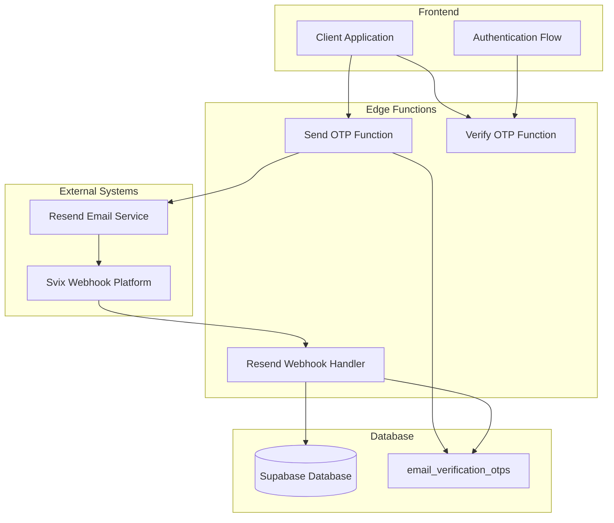
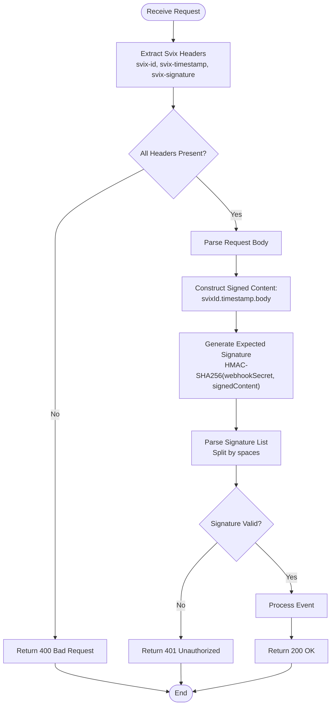
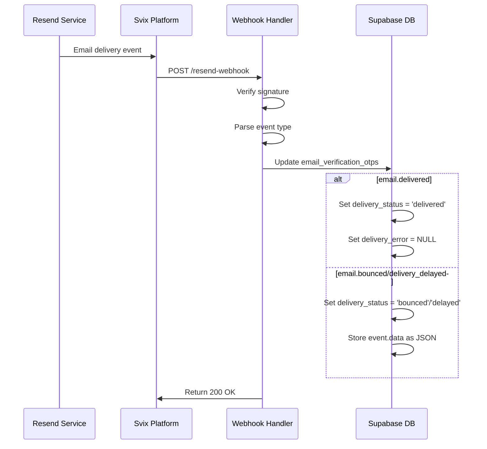
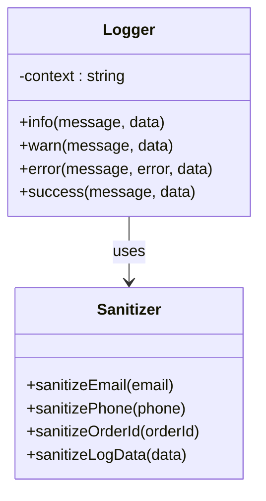
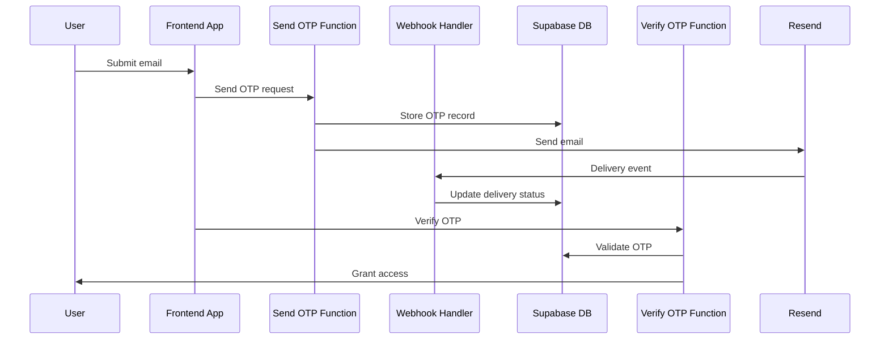

# Resend Email Webhook Handler

<cite>
**Referenced Files in This Document**
- [index.ts](file://supabase/functions/resend-webhook/index.ts)
- [send-otp/index.ts](file://supabase/functions/send-otp/index.ts)
- [verify-otp/index.ts](file://supabase/functions/verify-otp/index.ts)
- [logger.ts](file://supabase/functions/_shared/logger.ts)
- [config.toml](file://supabase/config.toml)
- [20251119140029_887f03c6-bdb2-46d4-ac7b-4b4868f9a169.sql](file://supabase/migrations/20251119140029_887f03c6-bdb2-46d4-ac7b-4b4868f9a169.sql)
</cite>

## Table of Contents
1. [Introduction](#introduction)
2. [System Architecture](#system-architecture)
3. [Webhook Endpoint Overview](#webhook-endpoint-overview)
4. [Signature Verification Process](#signature-verification-process)
5. [Database Schema and Updates](#database-schema-and-updates)
6. [Event Processing Logic](#event-processing-logic)
7. [Error Handling and Logging](#error-handling-and-logging)
8. [Security Considerations](#security-considerations)
9. [Integration Points](#integration-points)
10. [Sample Event Payloads](#sample-event-payloads)
11. [Failure Recovery Mechanisms](#failure-recovery-mechanisms)
12. [Best Practices](#best-practices)

## Introduction

The Resend Email Webhook Handler is a critical component of the sleekapp-v100 system that processes email delivery events from Resend's email service. Built as a Deno Edge Function, this handler receives and validates Svix-signed payloads containing email delivery status updates, primarily for the email verification OTP (One-Time Password) system.

The webhook serves as the bridge between Resend's email delivery monitoring and the application's email verification workflow, enabling real-time tracking of email delivery status and automatic updates to the `email_verification_otps` table in Supabase.

## System Architecture

The Resend webhook handler operates within a serverless architecture that integrates multiple components:



**Diagram sources**
- [index.ts](file://supabase/functions/resend-webhook/index.ts#L1-L118)
- [send-otp/index.ts](file://supabase/functions/send-otp/index.ts#L1-L489)
- [verify-otp/index.ts](file://supabase/functions/verify-otp/index.ts#L1-L489)

## Webhook Endpoint Overview

The webhook endpoint is implemented as a Deno Edge Function that handles HTTP POST requests from Svix, which forwards events from Resend. The endpoint follows a RESTful pattern with comprehensive CORS support and robust error handling.

### Endpoint Configuration

The webhook endpoint supports the following HTTP methods and headers:

| Method | Purpose | CORS Support |
|--------|---------|--------------|
| POST | Receive webhook events | Yes |
| OPTIONS | Preflight requests | Yes |

### CORS Headers Configuration

The handler implements comprehensive CORS headers to support cross-origin requests:

```typescript
const corsHeaders = {
  'Access-Control-Allow-Origin': '*',
  'Access-Control-Allow-Headers': 'authorization, x-client-info, apikey, content-type, svix-id, svix-timestamp, svix-signature'
};
```

**Section sources**
- [index.ts](file://supabase/functions/resend-webhook/index.ts#L5-L8)

## Signature Verification Process

The webhook implements Svix's signature verification mechanism using HMAC-SHA256 to ensure the authenticity and integrity of incoming payloads.

### Svix Header Extraction

The handler extracts three critical headers from each incoming request:

| Header Name | Purpose | Required |
|-------------|---------|----------|
| `svix-id` | Unique identifier for the webhook event | Yes |
| `svix-timestamp` | Unix timestamp of when the event was generated | Yes |
| `svix-signature` | Comma-separated list of signatures | Yes |

### Signature Generation and Validation

The signature verification process follows these steps:

1. **Construct Signed Content**: Combine Svix ID, timestamp, and request body
2. **Generate Expected Signature**: Create HMAC-SHA256 hash using the webhook secret
3. **Parse Signatures**: Split the `svix-signature` header into individual signatures
4. **Validate Against Secret**: Compare each signature against the expected value



**Diagram sources**
- [index.ts](file://supabase/functions/resend-webhook/index.ts#L25-L58)

### Security Implementation Details

The signature verification uses the following cryptographic parameters:

- **Hash Algorithm**: HMAC-SHA256
- **Encoding**: Base64-encoded signatures
- **Version Support**: v1 signatures only
- **Multiple Signatures**: Supports multiple signatures for backward compatibility

**Section sources**
- [index.ts](file://supabase/functions/resend-webhook/index.ts#L40-L58)

## Database Schema and Updates

The webhook handler interacts with the `email_verification_otps` table, which has been enhanced to track email delivery status and associated metadata.

### Table Schema Enhancements

The migration adds four critical columns to support email delivery tracking:

| Column Name | Data Type | Purpose | Default Value |
|-------------|-----------|---------|---------------|
| `resend_email_id` | TEXT | Resend API email ID for tracking | NULL |
| `email_sent_at` | TIMESTAMPTZ | Timestamp when email was sent | NULL |
| `delivery_status` | TEXT | Current delivery status | 'pending' |
| `delivery_error` | TEXT | Error details if delivery failed | NULL |

### Delivery Status Values

The `delivery_status` column uses an enumerated type with the following values:

- **pending**: Email queued for delivery
- **sent**: Email successfully sent via Resend
- **failed**: Email delivery failed
- **bounced**: Email bounced (hard failure)
- **delivered**: Email successfully delivered to recipient

### Database Operations

The webhook performs UPSERT operations based on the `resend_email_id` field:

```sql
UPDATE email_verification_otps
SET delivery_status = ?, delivery_error = ?
WHERE resend_email_id = ?
```

**Section sources**
- [20251119140029_887f03c6-bdb2-46d4-ac7b-4b4868f9a169.sql](file://supabase/migrations/20251119140029_887f03c6-bdb2-46d4-ac7b-4b4868f9a169.sql#L1-L21)

## Event Processing Logic

The webhook handler processes three primary email delivery events, each requiring different database update strategies.

### Supported Event Types

| Event Type | Description | Database Action |
|------------|-------------|-----------------|
| `email.delivered` | Email successfully delivered to recipient | Set status to 'delivered', clear error |
| `email.bounced` | Email bounced (hard failure) | Set status to 'bounced', store bounce data |
| `email.delivery_delayed` | Email delivery delayed | Set status to 'delayed', store delay data |

### Event Processing Flow



**Diagram sources**
- [index.ts](file://supabase/functions/resend-webhook/index.ts#L68-L103)

### Database Update Strategies

Each event type triggers specific database update patterns:

#### Delivered Events
```typescript
await supabase
  .from('email_verification_otps')
  .update({
    delivery_status: 'delivered',
    delivery_error: null,
  })
  .eq('resend_email_id', event.data.email_id);
```

#### Bounced/Delayed Events
```typescript
await supabase
  .from('email_verification_otps')
  .update({
    delivery_status: event.type === 'email.bounced' ? 'bounced' : 'delayed',
    delivery_error: JSON.stringify(event.data),
  })
  .eq('resend_email_id', event.data.email_id);
```

**Section sources**
- [index.ts](file://supabase/functions/resend-webhook/index.ts#L69-L103)

## Error Handling and Logging

The webhook implements comprehensive error handling and structured logging to ensure reliable operation and effective debugging.

### Error Categories

The handler manages several categories of errors:

| Error Category | HTTP Status | Description |
|----------------|-------------|-------------|
| Configuration | 500 | Missing environment variables |
| Authentication | 401 | Invalid webhook signature |
| Validation | 400 | Missing or malformed headers |
| Processing | 500 | Database or processing errors |

### Logging Implementation

The handler uses a centralized logging system with PII sanitization:



**Diagram sources**
- [logger.ts](file://supabase/functions/_shared/logger.ts#L93-L172)

### Log Levels and Patterns

The logging system implements structured logging with the following levels:

- **INFO**: General operational messages
- **WARN**: Recoverable issues and warnings
- **ERROR**: Failures and exceptions
- **SUCCESS**: Completed operations

### Error Recovery Patterns

The handler implements several error recovery mechanisms:

1. **Graceful Degradation**: Continue processing despite individual event failures
2. **Idempotent Responses**: Return consistent success/failure responses
3. **Structured Logging**: Comprehensive error context for debugging
4. **Environment Validation**: Early detection of configuration issues

**Section sources**
- [index.ts](file://supabase/functions/resend-webhook/index.ts#L110-L117)
- [logger.ts](file://supabase/functions/_shared/logger.ts#L103-L164)

## Security Considerations

The webhook handler implements multiple layers of security to protect against various attack vectors and ensure data integrity.

### Authentication and Authorization

#### Webhook Secret Management
- **Storage**: Environment variable `RESEND_WEBHOOK_SECRET`
- **Validation**: Mandatory presence check
- **Rotation**: Manual rotation required
- **Scope**: Single-purpose secret for webhook authentication

#### Signature Verification
- **Algorithm**: HMAC-SHA256
- **Key Derivation**: Static webhook secret
- **Content Signing**: Svix ID + timestamp + request body
- **Version Support**: v1 signatures only

### Input Validation

#### Header Validation
- **Presence Checks**: All Svix headers required
- **Format Validation**: Proper header format enforcement
- **Tamper Detection**: Signature verification prevents tampering

#### Payload Validation
- **JSON Parsing**: Safe JSON deserialization
- **Schema Validation**: Event type validation
- **Field Validation**: Email ID existence checks

### Data Protection

#### PII Sanitization
The logging system automatically sanitizes sensitive data:

| Data Type | Sanitization Pattern |
|-----------|---------------------|
| Email | `john.doe@example.com` → `joh***@example.com` |
| Phone | `+8801234567890` → `+880****90` |
| Order ID | `550e8400-e29b-41d4-a716-446655440000` → `550e8400-****` |

#### Access Control
- **CORS Policy**: Permissive CORS for external integrations
- **Rate Limiting**: Not implemented at handler level (handled by Svix)
- **Resource Isolation**: Edge function isolation

### Best Practices for Security

1. **Secret Rotation**: Regular rotation of webhook secrets
2. **Monitoring**: Comprehensive logging and alerting
3. **Network Security**: HTTPS-only communication
4. **Audit Trails**: Complete event logging for compliance
5. **Error Handling**: Graceful error responses without information leakage

**Section sources**
- [index.ts](file://supabase/functions/resend-webhook/index.ts#L16-L36)
- [logger.ts](file://supabase/functions/_shared/logger.ts#L14-L77)

## Integration Points

The webhook handler integrates with multiple components of the sleekapp-v100 system, forming a cohesive email verification workflow.

### Frontend Integration

#### Email Verification Flow
The webhook integrates seamlessly with the frontend authentication system:



**Diagram sources**
- [send-otp/index.ts](file://supabase/functions/send-otp/index.ts#L348-L448)
- [verify-otp/index.ts](file://supabase/functions/verify-otp/index.ts#L260-L302)

### Backend Integration

#### Function Dependencies
The webhook handler depends on several backend services:

| Service | Purpose | Integration Point |
|---------|---------|------------------|
| Supabase | Database operations | Real-time updates |
| Resend | Email delivery | Event notifications |
| Svix | Webhook forwarding | Event delivery |

#### Environment Configuration
Required environment variables for proper operation:

- `RESEND_WEBHOOK_SECRET`: Webhook authentication secret
- `SUPABASE_URL`: Supabase database URL
- `SUPABASE_SERVICE_ROLE_KEY`: Database service role key

### Database Integration

#### Table Relationships
The webhook handler works with the `email_verification_otps` table, which serves as the central repository for email verification data.

#### Index Strategy
The database includes optimized indexes for efficient querying:

- `idx_email_verification_delivery_status`: Fast status-based queries
- `idx_email_verification_resend_id`: Efficient webhook lookups

**Section sources**
- [index.ts](file://supabase/functions/resend-webhook/index.ts#L63-L66)
- [config.toml](file://supabase/config.toml#L36-L38)

## Sample Event Payloads

Understanding the structure of Resend webhook events is crucial for proper processing and debugging.

### Delivered Event Example

```json
{
  "type": "email.delivered",
  "data": {
    "email_id": "msg_01ABC123XYZ456",
    "timestamp": "2024-01-15T10:30:00Z",
    "recipient": "user@example.com",
    "subject": "Your Verification Code"
  }
}
```

### Bounced Event Example

```json
{
  "type": "email.bounced",
  "data": {
    "email_id": "msg_01ABC123XYZ456",
    "timestamp": "2024-01-15T10:35:00Z",
    "recipient": "invalid@example.com",
    "bounce_type": "permanent",
    "diagnostic_code": "550 5.1.1 Recipient address rejected"
  }
}
```

### Delayed Event Example

```json
{
  "type": "email.delivery_delayed",
  "data": {
    "email_id": "msg_01ABC123XYZ456",
    "timestamp": "2024-01-15T11:00:00Z",
    "recipient": "user@example.com",
    "reason": "Temporary DNS resolution issue",
    "retry_after": 300
  }
}
```

### Common Fields Across Events

All Resend webhook events share these common characteristics:

| Field | Type | Description |
|-------|------|-------------|
| `type` | string | Event type identifier |
| `data` | object | Event-specific data |
| `timestamp` | string | ISO 8601 timestamp |
| `email_id` | string | Resend message identifier |

## Failure Recovery Mechanisms

The webhook handler implements robust failure recovery mechanisms to ensure reliable operation under various failure conditions.

### Network-Level Failures

#### Retry Logic
While the webhook itself doesn't implement retry logic, it relies on Svix's built-in retry mechanisms:

- **Automatic Retries**: Svix retries failed deliveries with exponential backoff
- **Timeout Handling**: Configurable timeout limits
- **Dead Letter Queue**: Failed events are handled separately

#### Connection Resilience
- **HTTP Status Codes**: Proper HTTP status code responses
- **Idempotency**: Handlers can safely process duplicate events
- **Graceful Degradation**: Continue operating despite individual failures

### Database-Level Failures

#### Transaction Safety
The webhook uses Supabase's database operations with proper error handling:

```typescript
// Example error handling pattern
const { error } = await supabase
  .from('email_verification_otps')
  .update({ /* fields */ })
  .eq('resend_email_id', emailId);

if (error) {
  console.error('Database update failed:', error);
  // Continue processing other events
}
```

#### Data Consistency
- **Atomic Operations**: Database operations are atomic
- **Rollback Safety**: Failed operations don't corrupt data
- **Index Maintenance**: Automatic index updates

### Processing-Level Failures

#### Exception Handling
The handler wraps all processing logic in try-catch blocks:

```typescript
try {
  // Processing logic
  return new Response(JSON.stringify({ received: true }), {
    status: 200,
    headers: corsHeaders,
  });
} catch (error) {
  console.error('Webhook error:', error);
  return new Response(JSON.stringify({ error: error.message }), {
    status: 500,
    headers: corsHeaders,
  });
}
```

#### State Preservation
- **Event Ordering**: Events are processed independently
- **Partial Success**: Successful events are committed
- **Error Isolation**: Individual event failures don't affect others

**Section sources**
- [index.ts](file://supabase/functions/resend-webhook/index.ts#L110-L117)

## Best Practices

Based on the implementation analysis, several best practices emerge for webhook development and maintenance.

### Security Best Practices

#### Secret Management
1. **Environment Variables**: Store secrets in environment variables only
2. **Rotation Schedule**: Implement regular secret rotation
3. **Least Privilege**: Use minimal permissions for webhook secrets
4. **Monitoring**: Monitor for unauthorized access attempts

#### Input Validation
1. **Header Validation**: Always validate required headers
2. **Payload Parsing**: Use safe JSON parsing with error handling
3. **Signature Verification**: Implement comprehensive signature validation
4. **Rate Limiting**: Consider implementing rate limiting at the application level

### Operational Best Practices

#### Monitoring and Observability
1. **Structured Logging**: Use structured logging with PII sanitization
2. **Metrics Collection**: Track webhook processing metrics
3. **Alerting**: Set up alerts for webhook failures
4. **Health Checks**: Implement health check endpoints

#### Error Handling
1. **Graceful Degradation**: Continue operating despite individual failures
2. **Idempotent Operations**: Design handlers to handle duplicate events
3. **Comprehensive Logging**: Log sufficient context for debugging
4. **Error Classification**: Differentiate between transient and permanent errors

### Performance Best Practices

#### Resource Management
1. **Connection Pooling**: Use connection pooling for database operations
2. **Memory Efficiency**: Minimize memory usage in edge functions
3. **Timeout Configuration**: Set appropriate timeouts for external calls
4. **Caching**: Implement caching where appropriate

#### Scalability Considerations
1. **Horizontal Scaling**: Design for horizontal scaling
2. **Statelessness**: Maintain stateless handler design
3. **Async Processing**: Consider async processing for heavy operations
4. **Load Balancing**: Distribute load across multiple instances

### Development Best Practices

#### Code Organization
1. **Separation of Concerns**: Separate validation, processing, and persistence
2. **Error Handling**: Implement comprehensive error handling
3. **Logging**: Use structured logging with appropriate log levels
4. **Testing**: Implement thorough testing for webhook handlers

#### Documentation
1. **API Documentation**: Document webhook endpoints thoroughly
2. **Event Schema**: Document expected event schemas
3. **Error Codes**: Define comprehensive error codes
4. **Integration Guides**: Provide integration documentation

**Section sources**
- [index.ts](file://supabase/functions/resend-webhook/index.ts#L1-L118)
- [logger.ts](file://supabase/functions/_shared/logger.ts#L1-L173)