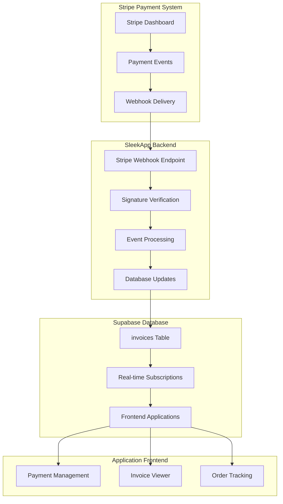
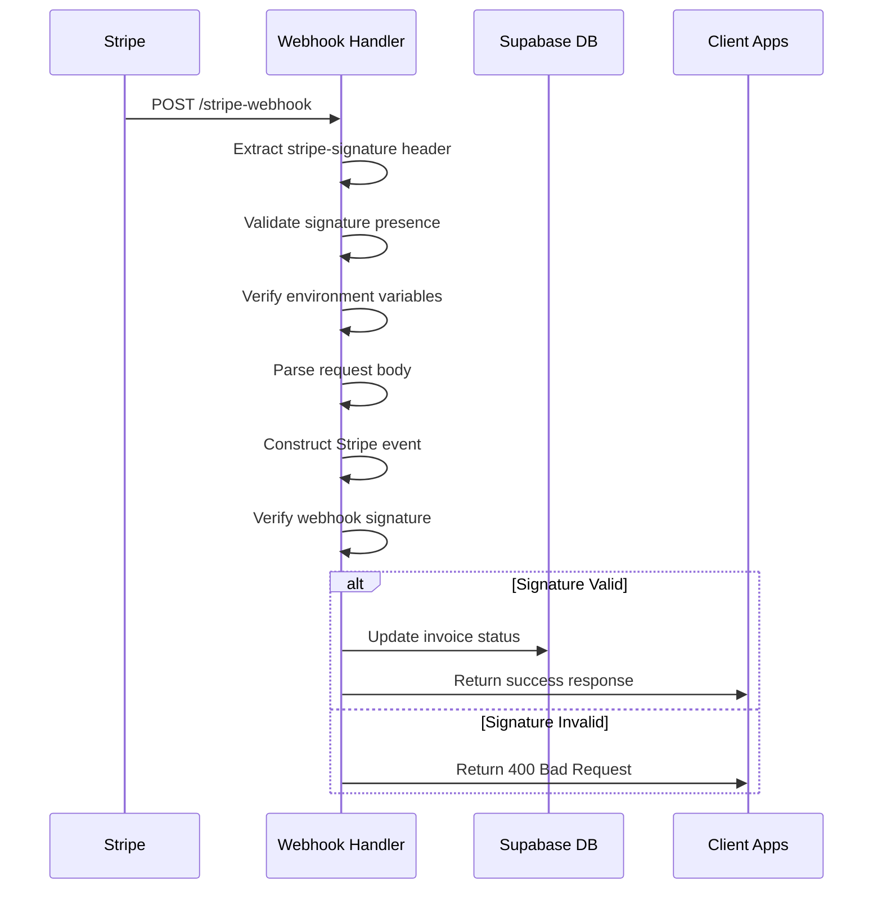
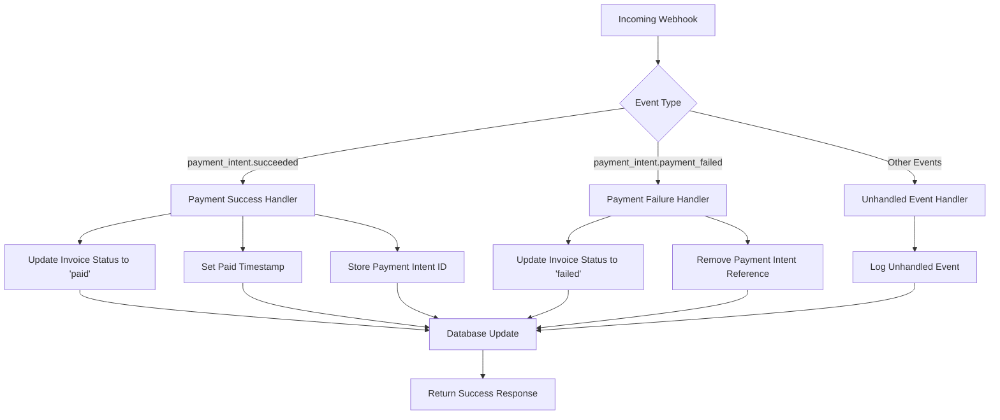
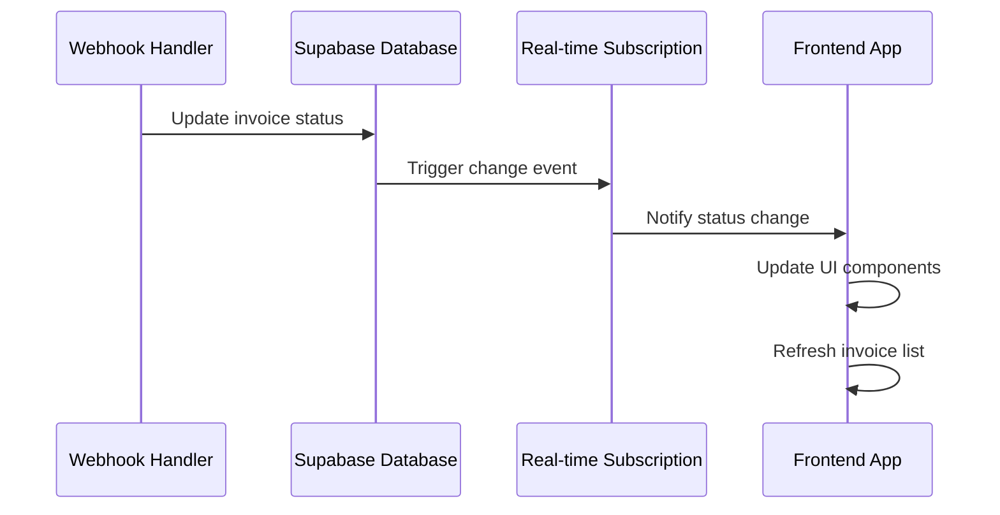
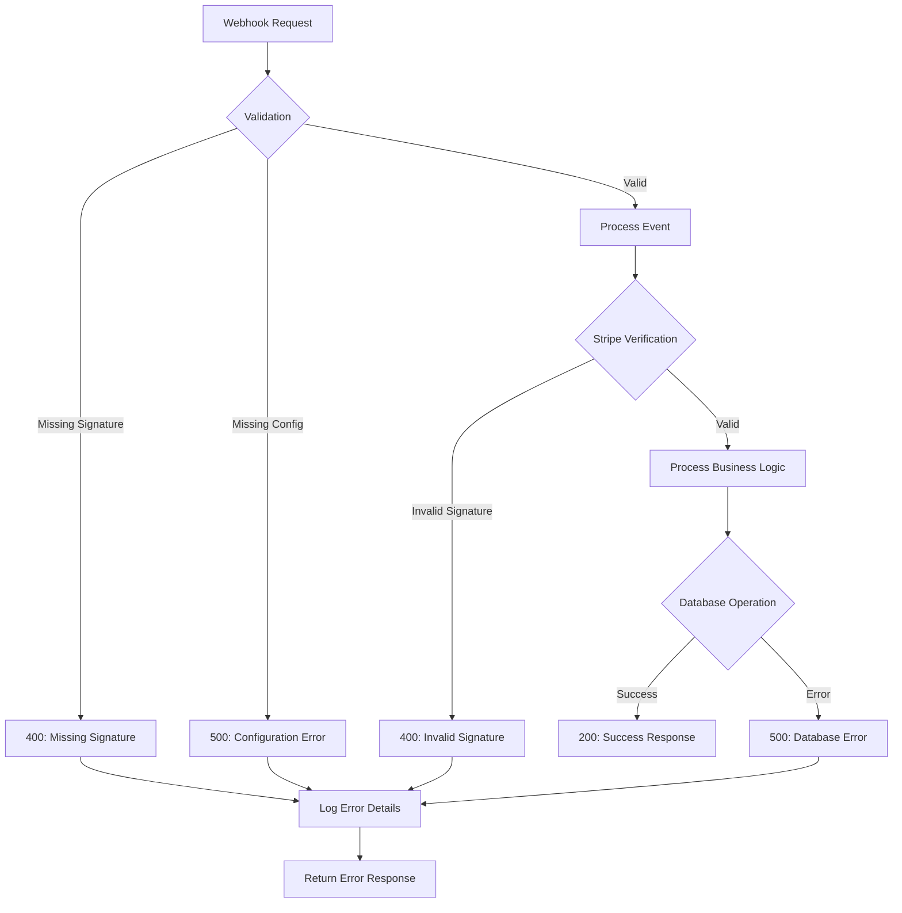
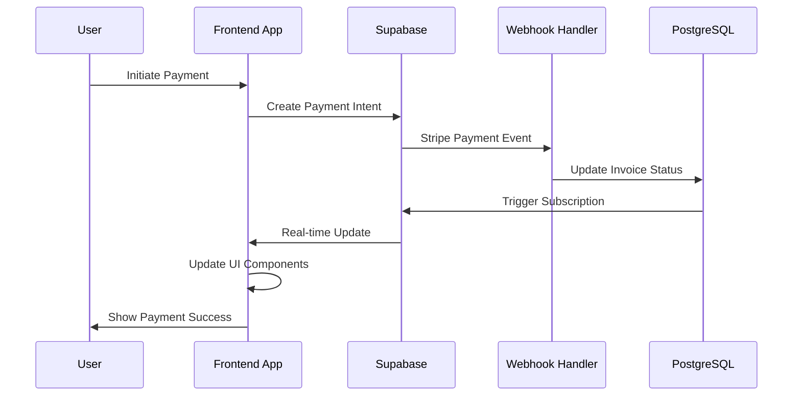

# Stripe Webhook Handler API Documentation

<cite>
**Referenced Files in This Document**
- [supabase/functions/stripe-webhook/index.ts](file://supabase/functions/stripe-webhook/index.ts)
- [supabase/functions/create-payment-intent/index.ts](file://supabase/functions/create-payment-intent/index.ts)
- [supabase/config.toml](file://supabase/config.toml)
- [src/hooks/usePayment.ts](file://src/hooks/usePayment.ts)
- [src/pages/PaymentCheckout.tsx](file://src/pages/PaymentCheckout.tsx)
- [src/components/admin/PaymentManagement.tsx](file://src/components/admin/PaymentManagement.tsx)
- [supabase/migrations/20251121014007_e1ea3a7e-b3b2-4082-a10a-c5eff6b1135b.sql](file://supabase/migrations/20251121014007_e1ea3a7e-b3b2-4082-a10a-c5eff6b1135b.sql)
- [supabase/migrations/20251121014007_e1ea3a7e-b3b2-4082-a10a-c5eff6b1135b.sql](file://supabase/migrations/20251121014007_e1ea3a7e-b3b2-4082-a10a-c5eff6b1135b.sql)
- [src/integrations/supabase/types.ts](file://src/integrations/supabase/types.ts)
</cite>

## Table of Contents
1. [Introduction](#introduction)
2. [Architecture Overview](#architecture-overview)
3. [Endpoint Configuration](#endpoint-configuration)
4. [Signature Verification Process](#signature-verification-process)
5. [Event Processing Workflow](#event-processing-workflow)
6. [Database Integration](#database-integration)
7. [Error Handling Strategies](#error-handling-strategies)
8. [Security Practices](#security-practices)
9. [Testing Procedures](#testing-procedures)
10. [Integration Examples](#integration-examples)
11. [Troubleshooting Guide](#troubleshooting-guide)

## Introduction

The Stripe webhook handler in sleekapp-v100 serves as a critical component for processing payment events from Stripe's payment processing system. This serverless function handles real-time payment notifications, specifically focusing on `payment_intent.succeeded` and `payment_intent.payment_failed` events to maintain synchronized invoice statuses in the Supabase database.

The webhook handler operates as part of a comprehensive payment processing pipeline that integrates seamlessly with the application's order management system, ensuring accurate financial tracking and real-time invoice status updates across the platform.

## Architecture Overview

The Stripe webhook handler follows a serverless architecture pattern built on Deno runtime, providing efficient and scalable payment event processing.



**Diagram sources**
- [supabase/functions/stripe-webhook/index.ts](file://supabase/functions/stripe-webhook/index.ts#L10-L114)
- [src/components/admin/PaymentManagement.tsx](file://src/components/admin/PaymentManagement.tsx#L46-L100)

**Section sources**
- [supabase/functions/stripe-webhook/index.ts](file://supabase/functions/stripe-webhook/index.ts#L1-L114)

## Endpoint Configuration

The Stripe webhook endpoint is configured as a Deno serverless function with comprehensive CORS support and security headers.

### CORS Configuration

The endpoint implements strict CORS policies to ensure secure cross-origin requests:

| Header | Value | Purpose |
|--------|-------|---------|
| `Access-Control-Allow-Origin` | `*` | Allows requests from any origin |
| `Access-Control-Allow-Headers` | `authorization, x-client-info, apikey, content-type, stripe-signature` | Specifies permitted headers |
| `Content-Type` | `application/json` | Standard JSON response format |

### Environment Variables

The webhook handler relies on several critical environment variables for secure operation:

| Variable | Purpose | Security Level |
|----------|---------|----------------|
| `STRIPE_SECRET_KEY` | Stripe API authentication | Secret |
| `STRIPE_WEBHOOK_SECRET` | Webhook signature verification | Secret |
| `SUPABASE_URL` | Supabase database endpoint | Public |
| `SUPABASE_SERVICE_ROLE_KEY` | Database service authentication | Secret |

**Section sources**
- [supabase/functions/stripe-webhook/index.ts](file://supabase/functions/stripe-webhook/index.ts#L5-L8)
- [supabase/functions/stripe-webhook/index.ts](file://supabase/functions/stripe-webhook/index.ts#L16-L18)

## Signature Verification Process

The webhook handler implements robust signature verification to ensure the authenticity and integrity of incoming Stripe events.



**Diagram sources**
- [supabase/functions/stripe-webhook/index.ts](file://supabase/functions/stripe-webhook/index.ts#L40-L51)

### Verification Steps

1. **Header Validation**: Ensures the `stripe-signature` header is present
2. **Environment Check**: Validates required environment variables are configured
3. **Body Parsing**: Reads and parses the raw request body
4. **Event Construction**: Uses Stripe SDK to construct the event object
5. **Signature Verification**: Compares the computed signature with the provided signature

### Security Measures

- **Strict Signature Validation**: Uses Stripe's native signature verification
- **Environment Isolation**: Requires explicit configuration of secrets
- **Request Body Integrity**: Validates the entire request payload
- **Error Logging**: Comprehensive logging for security monitoring

**Section sources**
- [supabase/functions/stripe-webhook/index.ts](file://supabase/functions/stripe-webhook/index.ts#L28-L51)

## Event Processing Workflow

The webhook handler processes different Stripe payment events with specific business logic for each scenario.

### Supported Event Types



**Diagram sources**
- [supabase/functions/stripe-webhook/index.ts](file://supabase/functions/stripe-webhook/index.ts#L60-L98)

### Payment Success Processing

When a `payment_intent.succeeded` event is received:

1. **Event Extraction**: Retrieves the PaymentIntent object from the event data
2. **Status Update**: Changes invoice status to 'paid'
3. **Timestamp Recording**: Sets the `paid_at` timestamp
4. **Reference Storage**: Stores the Stripe PaymentIntent ID for future reference
5. **Database Persistence**: Updates the invoices table with new status

### Payment Failure Processing

When a `payment_intent.payment_failed` event is received:

1. **Event Extraction**: Retrieves the PaymentIntent object
2. **Status Update**: Changes invoice status to 'failed'
3. **Reference Cleanup**: Removes the PaymentIntent ID reference
4. **Database Update**: Persists the failure status

### Database Update Operations

Both success and failure scenarios utilize Supabase's real-time database capabilities:

| Operation | Field | Value | Purpose |
|-----------|-------|-------|---------|
| Update | `status` | 'paid'/'failed' | Reflects payment outcome |
| Update | `paid_at` | Current timestamp | Records payment completion |
| Update | `stripe_payment_intent_id` | PaymentIntent ID | Maintains payment reference |

**Section sources**
- [supabase/functions/stripe-webhook/index.ts](file://supabase/functions/stripe-webhook/index.ts#L62-L94)

## Database Integration

The webhook handler integrates with Supabase's PostgreSQL database to maintain synchronized invoice records.

### Invoices Table Structure

The invoices table maintains comprehensive payment and order tracking information:

| Column | Type | Constraints | Purpose |
|--------|------|-------------|---------|
| `id` | UUID | Primary Key | Unique identifier |
| `order_id` | UUID | Foreign Key | Links to orders table |
| `invoice_number` | Text | Not Null | Human-readable invoice ID |
| `amount` | Numeric | Not Null | Payment amount |
| `payment_type` | Text | Check constraint | Deposit/balance/full |
| `status` | Text | Default 'pending' | Payment status |
| `due_date` | Date | Nullable | Payment deadline |
| `paid_at` | Timestamp | Nullable | Payment completion time |
| `pdf_url` | Text | Nullable | Invoice PDF location |
| `stripe_payment_intent_id` | Text | Nullable | Stripe reference |
| `created_at` | Timestamp | Default now() | Record creation |
| `updated_at` | Timestamp | Default now() | Last modification |

### Real-time Integration

The webhook handler enables real-time invoice status updates through Supabase's subscription system:



**Diagram sources**
- [src/components/admin/PaymentManagement.tsx](file://src/components/admin/PaymentManagement.tsx#L46-L100)

**Section sources**
- [supabase/migrations/20251121014007_e1ea3a7e-b3b2-4082-a10a-c5eff6b1135b.sql](file://supabase/migrations/20251121014007_e1ea3a7e-b3b2-4082-a10a-c5eff6b1135b.sql#L1150-L1166)
- [src/integrations/supabase/types.ts](file://src/integrations/supabase/types.ts#L1202-L1213)

## Error Handling Strategies

The webhook handler implements comprehensive error handling to ensure reliable operation and provide meaningful feedback.

### Error Categories



**Diagram sources**
- [supabase/functions/stripe-webhook/index.ts](file://supabase/functions/stripe-webhook/index.ts#L20-L113)

### Error Response Formats

The webhook handler returns standardized error responses with appropriate HTTP status codes:

| Error Type | HTTP Status | Response Format | Example |
|------------|-------------|-----------------|---------|
| Missing Signature | 400 | `{ error: "Missing signature" }` | Missing stripe-signature header |
| Invalid Signature | 400 | `{ error: "Invalid signature" }` | Signature verification failed |
| Configuration Error | 500 | `{ error: "Stripe configuration missing" }` | Missing environment variables |
| Processing Error | 500 | `{ error: "Error message" }` | Database or business logic errors |

### Logging Strategy

The webhook handler implements comprehensive logging for operational monitoring:

- **Success Logs**: Event type and payment intent ID
- **Warning Logs**: Unhandled event types
- **Error Logs**: Detailed error information with stack traces
- **Security Logs**: Signature verification failures

**Section sources**
- [supabase/functions/stripe-webhook/index.ts](file://supabase/functions/stripe-webhook/index.ts#L28-L113)

## Security Practices

The webhook handler implements multiple layers of security to protect against unauthorized access and ensure data integrity.

### Authentication and Authorization

1. **Environment Variable Protection**: Secrets stored in environment variables only
2. **Signature Verification**: Stripe's cryptographic signature validation
3. **Request Validation**: Comprehensive input validation and sanitization
4. **Rate Limiting**: Built-in rate limiting through Deno runtime

### Data Protection

- **Encryption in Transit**: HTTPS required for all webhook deliveries
- **Secure Storage**: Environment variables encrypted at rest
- **Minimal Exposure**: Only necessary data processed and stored
- **Audit Logging**: Comprehensive logging of all webhook activity

### Best Practices Implementation

| Practice | Implementation | Benefit |
|----------|----------------|---------|
| Principle of Least Privilege | Service role keys only | Minimized attack surface |
| Input Validation | Strict request body parsing | Prevents injection attacks |
| Error Information Sanitization | Generic error messages | Prevents information disclosure |
| Monitoring and Alerting | Comprehensive logging | Early threat detection |

**Section sources**
- [supabase/functions/stripe-webhook/index.ts](file://supabase/functions/stripe-webhook/index.ts#L16-L18)
- [supabase/functions/stripe-webhook/index.ts](file://supabase/functions/stripe-webhook/index.ts#L44-L51)

## Testing Procedures

Effective testing of the Stripe webhook handler ensures reliable payment processing and error-free operation.

### Testing Tools and Methods

#### 1. Stripe CLI Testing

The Stripe CLI provides comprehensive testing capabilities:

```bash
# Start webhook listening
stripe listen --forward-to localhost:8787/stripe-webhook --skip-verify

# Send test events
stripe trigger payment_intent.succeeded
stripe trigger payment_intent.payment_failed
```

#### 2. Webhook Replay Testing

Test previously sent webhooks to ensure consistent processing:

```bash
# Replay webhook with specific ID
stripe replay <webhook_id>
```

#### 3. Local Development Testing

Configure local testing environment:

- **Environment Setup**: Mock environment variables
- **Local Server**: Run Deno server locally
- **Mock Data**: Use test payment intents
- **Logging Review**: Monitor console logs

### Test Scenarios

| Scenario | Expected Outcome | Validation Criteria |
|----------|------------------|-------------------|
| Valid Signature | Success response | HTTP 200, status updated |
| Invalid Signature | Error response | HTTP 400, error logged |
| Missing Signature | Error response | HTTP 400, error logged |
| Unknown Event | Success response | HTTP 200, unhandled log |
| Database Error | Error response | HTTP 500, error logged |

### Integration Testing

Test the complete payment flow:

1. **Payment Intent Creation**: Verify create-payment-intent function
2. **Webhook Registration**: Confirm webhook endpoint registration
3. **Event Processing**: Validate webhook handler processing
4. **Database Updates**: Verify invoice status synchronization
5. **Frontend Updates**: Test real-time UI updates

**Section sources**
- [supabase/functions/stripe-webhook/index.ts](file://supabase/functions/stripe-webhook/index.ts#L10-L114)

## Integration Examples

The webhook handler integrates with various parts of the sleekapp-v100 ecosystem.

### Frontend Integration

The frontend applications consume webhook-triggered updates through Supabase subscriptions:



**Diagram sources**
- [src/hooks/usePayment.ts](file://src/hooks/usePayment.ts#L9-L33)
- [src/pages/PaymentCheckout.tsx](file://src/pages/PaymentCheckout.tsx#L16-L80)

### Backend Integration

The webhook handler coordinates with other backend functions:

- **create-payment-intent**: Generates payment intents and creates invoices
- **Payment Management**: Provides administrative invoice viewing
- **Order Processing**: Links payment status to order lifecycle

### API Consumption Patterns

| Component | Method | Endpoint | Purpose |
|-----------|--------|----------|---------|
| Payment Checkout | GET | `/orders/:orderId` | Load order details |
| Payment Creation | POST | `/functions/create-payment-intent` | Generate payment intent |
| Invoice Viewing | GET | `/functions/fetch-invoices` | Retrieve invoice list |
| Webhook Endpoint | POST | `/functions/stripe-webhook` | Process payment events |

**Section sources**
- [src/hooks/usePayment.ts](file://src/hooks/usePayment.ts#L1-L68)
- [src/pages/PaymentCheckout.tsx](file://src/pages/PaymentCheckout.tsx#L1-L80)

## Troubleshooting Guide

Common issues and their resolutions when working with the Stripe webhook handler.

### Common Issues

#### 1. Signature Verification Failures

**Symptoms**: HTTP 400 responses with "Invalid signature" error
**Causes**: 
- Incorrect webhook secret configuration
- Network issues causing request modification
- Clock skew between systems

**Solutions**:
- Verify `STRIPE_WEBHOOK_SECRET` environment variable
- Check webhook endpoint URL in Stripe dashboard
- Ensure system clocks are synchronized

#### 2. Missing Environment Variables

**Symptoms**: HTTP 500 responses with "Stripe configuration missing"
**Causes**:
- Environment variables not set
- Deployment configuration errors

**Solutions**:
- Verify environment variable configuration
- Check deployment logs for configuration issues
- Restart function after configuration changes

#### 3. Database Update Failures

**Symptoms**: Payments processed but invoice status unchanged
**Causes**:
- Database connectivity issues
- Permission problems
- Constraint violations

**Solutions**:
- Check database connection status
- Verify service role permissions
- Review database logs for constraint errors

### Debugging Steps

1. **Enable Logging**: Increase log verbosity for detailed information
2. **Check Headers**: Verify all required headers are present
3. **Validate Payload**: Test with known good webhook payloads
4. **Monitor Database**: Check for successful update operations
5. **Review Stripe Dashboard**: Verify webhook delivery status

### Monitoring and Alerting

Implement monitoring for webhook reliability:

- **Delivery Success Rate**: Track webhook delivery success
- **Processing Time**: Monitor webhook processing duration
- **Error Rates**: Track different error categories
- **Database Health**: Monitor database operation success

**Section sources**
- [supabase/functions/stripe-webhook/index.ts](file://supabase/functions/stripe-webhook/index.ts#L20-L113)