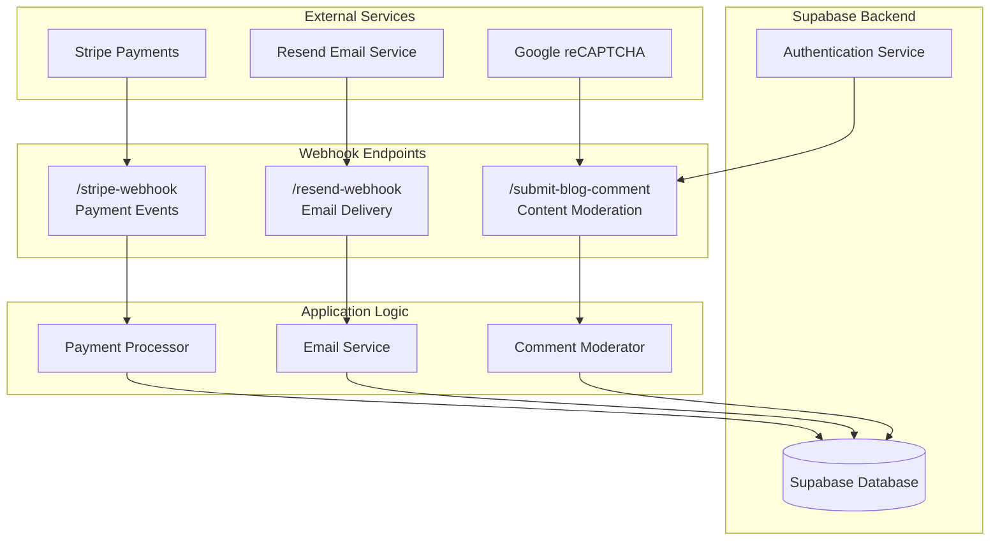
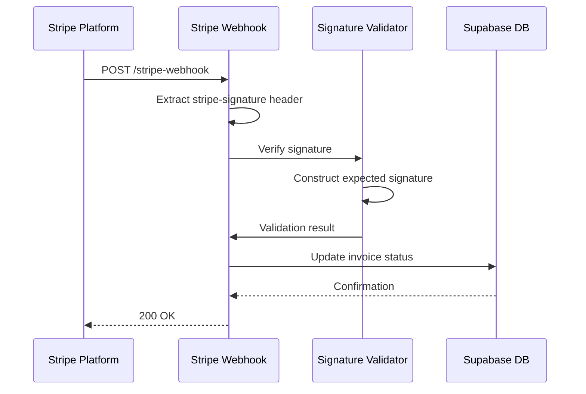
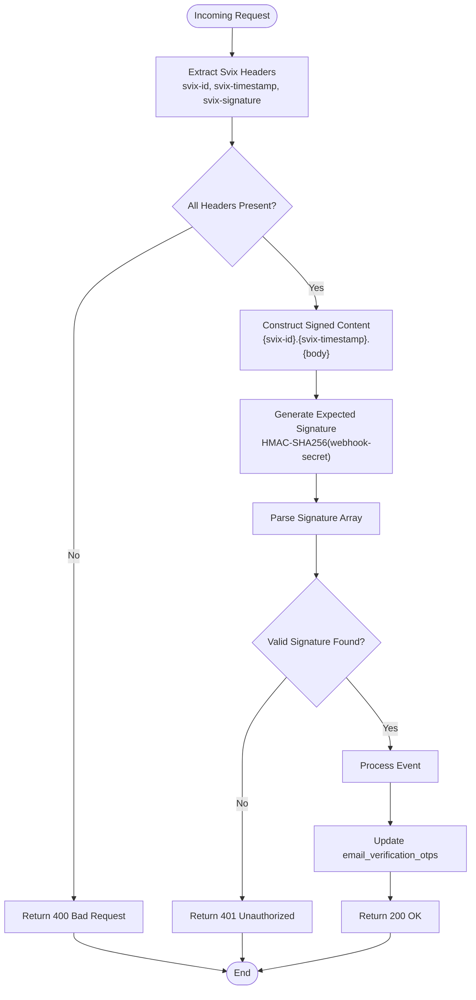
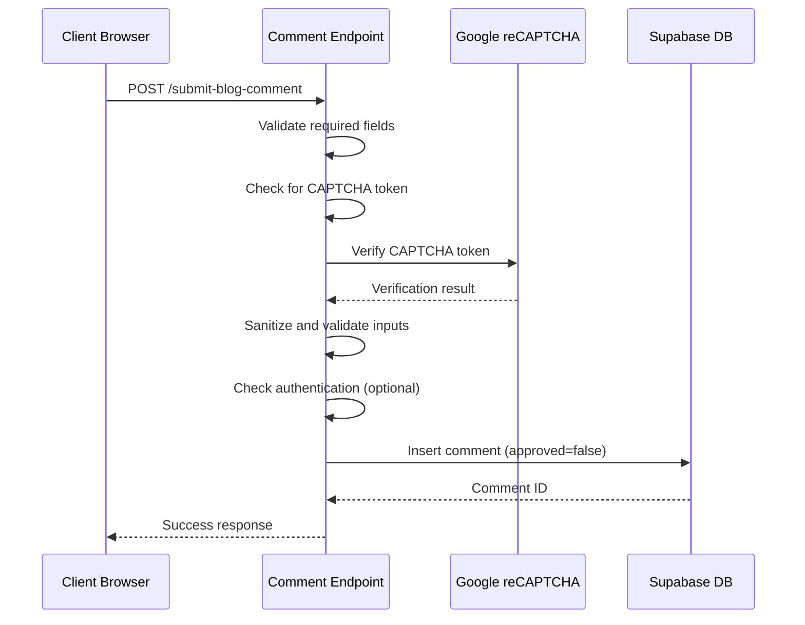
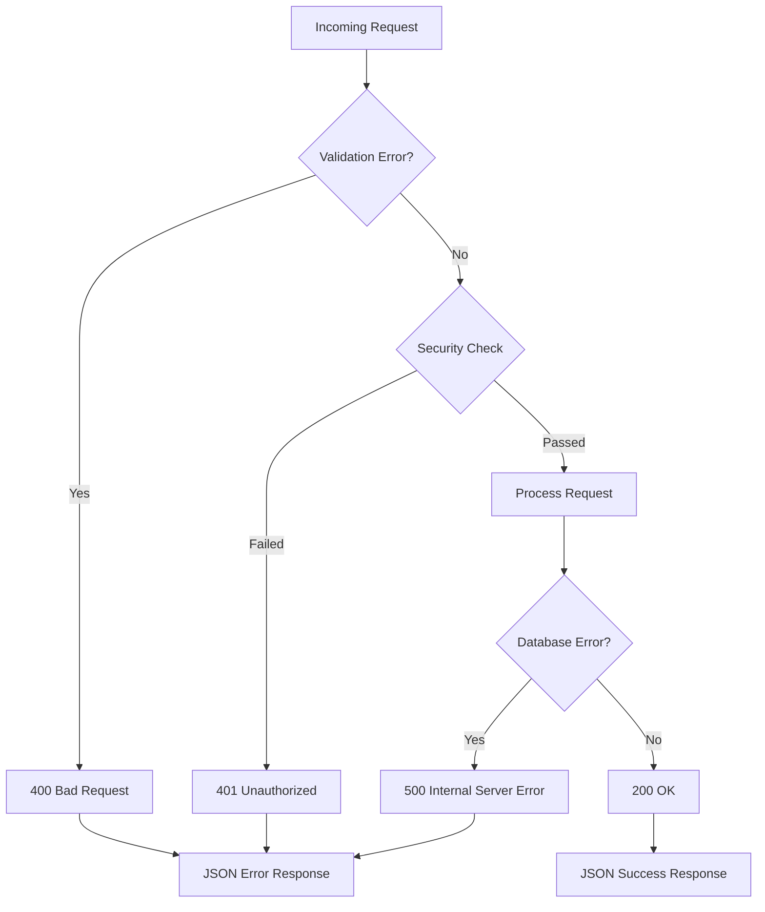

# Webhook Integration Endpoints

<cite>
**Referenced Files in This Document**
- [stripe-webhook/index.ts](file://supabase/functions/stripe-webhook/index.ts)
- [resend-webhook/index.ts](file://supabase/functions/resend-webhook/index.ts)
- [submit-blog-comment/index.ts](file://supabase/functions/submit-blog-comment/index.ts)
- [email-service/index.ts](file://supabase/functions/email-service/index.ts)
- [create-payment-intent/index.ts](file://supabase/functions/create-payment-intent/index.ts)
- [config.toml](file://supabase/config.toml)
- [invoices table schema](file://supabase/migrations/20251115150759_remix_migration_from_pg_dump.sql#L1148-L1164)
- [email_verification_otps table schema](file://supabase/migrations/20251119140029_887f03c6-bdb2-46d4-ac7b-4b4868f9a169.sql#L1-L21)
- [blog_comments table schema](file://supabase/FIXED_SETUP_PART1.sql#L173-L181)
</cite>

## Table of Contents
1. [Introduction](#introduction)
2. [Webhook Architecture Overview](#webhook-architecture-overview)
3. [Stripe Webhook Endpoint](#stripe-webhook-endpoint)
4. [Resend Webhook Endpoint](#resend-webhook-endpoint)
5. [Submit Blog Comment Endpoint](#submit-blog-comment-endpoint)
6. [Security Implementation](#security-implementation)
7. [Error Handling and Retry Logic](#error-handling-and-retry-logic)
8. [Testing and Development](#testing-and-development)
9. [Adding New Webhook Integrations](#adding-new-webhook-integrations)
10. [Troubleshooting Guide](#troubleshooting-guide)

## Introduction

The sleekapp-v100 application implements a comprehensive webhook integration system that handles external event notifications from payment processors, email services, and content management systems. This documentation covers three primary webhook endpoints: the Stripe payment webhook for processing payment events, the Resend webhook for email delivery notifications, and the blog comment submission endpoint for user-generated content moderation.

The webhook system follows industry best practices for security, reliability, and scalability, incorporating signature verification, idempotency controls, and robust error handling mechanisms.

## Webhook Architecture Overview

The webhook system is built on Supabase Edge Functions, providing serverless execution of webhook handlers with automatic scaling and global distribution.



**Diagram sources**
- [stripe-webhook/index.ts](file://supabase/functions/stripe-webhook/index.ts#L1-L114)
- [resend-webhook/index.ts](file://supabase/functions/resend-webhook/index.ts#L1-L118)
- [submit-blog-comment/index.ts](file://supabase/functions/submit-blog-comment/index.ts#L1-L129)

## Stripe Webhook Endpoint

The Stripe webhook endpoint processes payment events from the Stripe payment platform, handling payment confirmation and failure notifications to update invoice statuses in the system.

### Endpoint Configuration

| Property | Value |
|----------|-------|
| Path | `/stripe-webhook` |
| Method | `POST` |
| Authentication | Disabled (public endpoint) |
| CORS Headers | `*` |
| Content-Type | `application/json` |

### Supported Event Types

The Stripe webhook handles the following payment events:

| Event Type | Description | Database Action |
|------------|-------------|-----------------|
| `payment_intent.succeeded` | Successful payment completion | Updates invoice status to 'paid' |
| `payment_intent.payment_failed` | Payment failure | Updates invoice status to 'failed' |
| Other events | Unhandled events | Logged but ignored |

### Signature Verification Process



**Diagram sources**
- [stripe-webhook/index.ts](file://supabase/functions/stripe-webhook/index.ts#L40-L51)

### Payload Structure and Processing

#### Payment Intent Succeeded Event
```typescript
{
  "id": "evt_123456789",
  "type": "payment_intent.succeeded",
  "data": {
    "object": {
      "id": "pi_123456789",
      "amount": 1000,
      "currency": "usd",
      "status": "succeeded",
      "created": 1640995200
    }
  }
}
```

#### Database Update Operations

The webhook performs atomic updates to the invoices table:

| Field | Update Value | Condition |
|-------|-------------|-----------|
| `status` | `'paid'` | On successful payment |
| `paid_at` | Current timestamp | On successful payment |
| `stripe_payment_intent_id` | Event payment intent ID | Both success and failure |

**Section sources**
- [stripe-webhook/index.ts](file://supabase/functions/stripe-webhook/index.ts#L60-L98)
- [invoices table schema](file://supabase/migrations/20251115150759_remix_migration_from_pg_dump.sql#L1148-L1164)

## Resend Webhook Endpoint

The Resend webhook endpoint processes email delivery notifications from the Resend email service, updating delivery status and error information in the system.

### Endpoint Configuration

| Property | Value |
|----------|-------|
| Path | `/resend-webhook` |
| Method | `POST` |
| Authentication | Disabled (public endpoint) |
| CORS Headers | `authorization, x-client-info, apikey, content-type, svix-id, svix-timestamp, svix-signature` |
| Content-Type | `application/json` |

### Svix Signature Verification

The Resend webhook uses Svix signature verification with HMAC-SHA256:



**Diagram sources**
- [resend-webhook/index.ts](file://supabase/functions/resend-webhook/index.ts#L25-L58)

### Supported Email Events

| Event Type | Description | Database Action |
|------------|-------------|-----------------|
| `email.delivered` | Email successfully delivered to recipient | Sets `delivery_status` to 'delivered' |
| `email.bounced` | Email bounced (hard failure) | Sets `delivery_status` to 'bounced' |
| `email.delivery_delayed` | Email delivery delayed | Sets `delivery_status` to 'delayed' |

### Database Schema Enhancements

The email delivery tracking requires specific database schema modifications:

| Column | Type | Purpose |
|--------|------|---------|
| `resend_email_id` | `TEXT` | Resend API email identifier |
| `email_sent_at` | `TIMESTAMPTZ` | Timestamp of successful send |
| `delivery_status` | `TEXT` | Current delivery status |
| `delivery_error` | `TEXT` | Error details if delivery failed |

**Section sources**
- [resend-webhook/index.ts](file://supabase/functions/resend-webhook/index.ts#L68-L102)
- [email_verification_otps table schema](file://supabase/migrations/20251119140029_887f03c6-bdb2-46d4-ac7b-4b4868f9a169.sql#L1-L21)

## Submit Blog Comment Endpoint

The blog comment submission endpoint handles user-generated content with comprehensive security measures including CAPTCHA verification and content moderation.

### Endpoint Configuration

| Property | Value |
|----------|-------|
| Path | `/submit-blog-comment` |
| Method | `POST` |
| Authentication | Optional (supports both authenticated and anonymous users) |
| CORS Headers | `authorization, x-client-info, apikey, content-type` |
| Content-Type | `application/json` |

### Security Implementation



**Diagram sources**
- [submit-blog-comment/index.ts](file://supabase/functions/submit-blog-comment/index.ts#L16-L128)

### Input Validation and Sanitization

| Field | Validation Rules | Sanitization |
|-------|------------------|--------------|
| `postId` | Required, UUID format | None |
| `authorName` | Required, max 100 characters | Trim, limit length |
| `authorEmail` | Required, valid email format | Trim, lowercase, limit length |
| `content` | Required, max 5000 characters | Trim, limit length |
| `captchaToken` | Required for submission | None |

### CAPTCHA Verification

The endpoint integrates with Google reCAPTCHA v3 for spam protection:

| Parameter | Value | Purpose |
|-----------|-------|---------|
| `secret` | Environment variable | Secret key for verification |
| `response` | CAPTCHA token from client | Token to verify |
| `score_threshold` | 0.5 | Minimum score for acceptance |

### Database Operations

Comments are inserted with the following default state:
- `approved`: `false` (requires admin approval)
- `created_at`: Current timestamp
- `user_id`: Set from authenticated session (if available)

**Section sources**
- [submit-blog-comment/index.ts](file://supabase/functions/submit-blog-comment/index.ts#L16-L128)
- [blog_comments table schema](file://supabase/FIXED_SETUP_PART1.sql#L173-L181)

## Security Implementation

### Signature Verification Standards

Each webhook endpoint implements industry-standard security measures:

#### Stripe Webhook Security
- **HMAC-SHA256 Verification**: Uses Stripe webhook secret
- **Header Validation**: Requires `stripe-signature` header
- **API Version Control**: Fixed Stripe API version (2023-10-16)

#### Resend Webhook Security
- **Svix Signature Scheme**: HMAC-SHA256 with webhook secret
- **Multiple Signature Support**: Handles multiple signature formats
- **Timestamp Validation**: Validates signature freshness

#### Input Sanitization
- **SQL Injection Prevention**: Parameterized queries only
- **XSS Protection**: Input sanitization and validation
- **Length Limits**: Character limits for all text fields

### Replay Attack Prevention

The system implements several mechanisms to prevent replay attacks:

| Mechanism | Implementation | Effectiveness |
|-----------|----------------|---------------|
| Signature Verification | HMAC-SHA256 with timestamps | High |
| Idempotency Keys | Unique request identifiers | Medium |
| Event Deduplication | Database constraints | High |

### Rate Limiting Considerations

While not explicitly implemented in the current code, the system architecture supports rate limiting through:

- **Edge Function Throttling**: Supabase automatically throttles requests
- **Database Constraints**: Prevent duplicate entries
- **External Service Limits**: Stripe and Resend rate limits

## Error Handling and Retry Logic

### HTTP Status Codes

| Status Code | Scenario | Response Format |
|-------------|----------|-----------------|
| 200 | Successful processing | `{ received: true }` |
| 400 | Missing/invalid data | `{ error: "message" }` |
| 401 | Invalid signature | `{ error: "Invalid signature" }` |
| 500 | Internal server error | `{ error: "message" }` |

### Error Categories and Responses



### Retry Mechanisms

External services implement their own retry logic:

| Service | Retry Policy | Backoff Strategy |
|---------|--------------|------------------|
| Stripe | Built-in retry | Exponential backoff |
| Resend | Built-in retry | Linear backoff |
| Supabase | Built-in retry | Exponential backoff |

### Logging and Monitoring

All webhook endpoints implement comprehensive logging:

- **Success Events**: Logged with event type and processing time
- **Error Events**: Logged with error details and stack traces
- **Security Events**: Logged for signature failures and validation errors

**Section sources**
- [stripe-webhook/index.ts](file://supabase/functions/stripe-webhook/index.ts#L106-L113)
- [resend-webhook/index.ts](file://supabase/functions/resend-webhook/index.ts#L110-L117)
- [submit-blog-comment/index.ts](file://supabase/functions/submit-blog-comment/index.ts#L121-L128)

## Testing and Development

### Local Development Setup

To test webhook endpoints locally:

1. **Environment Variables**: Set required secrets
   ```bash
   export STRIPE_SECRET_KEY="your_stripe_secret_key"
   export STRIPE_WEBHOOK_SECRET="your_webhook_secret"
   export RESEND_WEBHOOK_SECRET="your_resend_webhook_secret"
   export SUPABASE_URL="your_supabase_url"
   export SUPABASE_SERVICE_ROLE_KEY="your_service_role_key"
   ```

2. **Local Testing Tools**: Use webhook testing utilities
   - **Stripe CLI**: `stripe listen --forward-to localhost:8080/stripe-webhook`
   - **ngrok**: Tunnel local endpoints for external access
   - **Postman**: Manual testing with custom headers

### Webhook Replay Tools

Recommended tools for webhook testing:

| Tool | Purpose | Features |
|------|---------|----------|
| Stripe CLI | Stripe webhook testing | Event simulation, forwarding |
| ngrok | Local tunneling | HTTPS forwarding, logging |
| Postman | Manual testing | Custom headers, payloads |
| Zapier/Integromat | Workflow testing | Multi-service integration |

### Testing Scenarios

#### Stripe Webhook Testing
- **Successful Payment**: Simulate `payment_intent.succeeded` event
- **Failed Payment**: Simulate `payment_intent.payment_failed` event
- **Invalid Signature**: Test signature verification failure
- **Missing Fields**: Test validation error responses

#### Resend Webhook Testing
- **Successful Delivery**: Test `email.delivered` event
- **Bounced Email**: Test `email.bounced` event
- **Delayed Delivery**: Test `email.delivery_delayed` event
- **Invalid Signature**: Test signature verification failure

#### Blog Comment Testing
- **Valid Submission**: Test successful comment creation
- **Missing Fields**: Test validation error responses
- **CAPTCHA Failure**: Test reCAPTCHA verification
- **Spam Content**: Test content filtering

### Debugging Techniques

1. **Console Logging**: Enable detailed logging in development
2. **Request Tracing**: Use correlation IDs for request tracking
3. **Database Inspection**: Monitor database changes in real-time
4. **External Service Logs**: Check Stripe and Resend logs

## Adding New Webhook Integrations

### Implementation Checklist

When adding a new webhook endpoint, follow this checklist:

#### 1. Environment Configuration
- [ ] Add required environment variables to Supabase
- [ ] Configure webhook URLs in external services
- [ ] Set up signature verification keys

#### 2. Endpoint Implementation
- [ ] Create function in `supabase/functions/`
- [ ] Implement CORS headers
- [ ] Add signature verification logic
- [ ] Implement event processing logic
- [ ] Add error handling and logging

#### 3. Database Integration
- [ ] Create/update database schema
- [ ] Add appropriate indexes
- [ ] Implement data validation
- [ ] Set up triggers if needed

#### 4. Testing and Deployment
- [ ] Write unit tests
- [ ] Test with webhook replay tools
- [ ] Deploy to staging environment
- [ ] Monitor logs and metrics

### Template for New Webhook Endpoints

```typescript
import { serve } from "https://deno.land/std@0.168.0/http/server.ts";
import { createClient } from "https://esm.sh/@supabase/supabase-js@2";

const corsHeaders = {
  'Access-Control-Allow-Origin': '*',
  'Access-Control-Allow-Headers': 'authorization, x-client-info, apikey, content-type, signature-header'
};

serve(async (req) => {
  if (req.method === 'OPTIONS') {
    return new Response(null, { headers: corsHeaders });
  }

  try {
    // Extract and validate signature
    const signature = req.headers.get('signature-header');
    const secret = Deno.env.get('WEBHOOK_SECRET');
    
    if (!signature || !secret) {
      return new Response(JSON.stringify({ error: 'Missing signature or secret' }), {
        status: 400,
        headers: { ...corsHeaders, 'Content-Type': 'application/json' },
      });
    }

    // Verify signature
    const isValid = await verifySignature(req, signature, secret);
    if (!isValid) {
      return new Response(JSON.stringify({ error: 'Invalid signature' }), {
        status: 401,
        headers: { ...corsHeaders, 'Content-Type': 'application/json' },
      });
    }

    // Process event
    const body = await req.text();
    const event = JSON.parse(body);
    
    // Handle different event types
    switch (event.type) {
      case 'event.type':
        // Process event
        break;
      default:
        console.log('Unhandled event type:', event.type);
    }

    return new Response(JSON.stringify({ received: true }), {
      status: 200,
      headers: { ...corsHeaders, 'Content-Type': 'application/json' },
    });

  } catch (error) {
    console.error('Webhook error:', error);
    return new Response(JSON.stringify({ error: error.message }), {
      status: 500,
      headers: { ...corsHeaders, 'Content-Type': 'application/json' },
    });
  }
});

async function verifySignature(req: Request, signature: string, secret: string): Promise<boolean> {
  // Implement signature verification logic
  return true;
}
```

### Best Practices for New Webhooks

1. **Security First**: Always implement signature verification
2. **Idempotency**: Design endpoints to handle duplicate events
3. **Error Handling**: Provide meaningful error messages
4. **Logging**: Implement comprehensive logging for debugging
5. **Testing**: Create thorough test suites
6. **Documentation**: Document webhook specifications

## Troubleshooting Guide

### Common Issues and Solutions

#### Stripe Webhook Issues

| Problem | Symptoms | Solution |
|---------|----------|----------|
| Invalid signature | 400 Bad Request responses | Verify webhook secret configuration |
| Missing signature | 400 Bad Request responses | Check `stripe-signature` header |
| Database update failures | Payment status not updating | Review database permissions |

#### Resend Webhook Issues

| Problem | Symptoms | Solution |
|---------|----------|----------|
| Signature verification fails | 401 Unauthorized responses | Verify webhook secret and Svix configuration |
| Missing headers | 400 Bad Request responses | Check Svix headers in webhook configuration |
| Email status not updating | Delivery status unchanged | Verify database connection and permissions |

#### Blog Comment Issues

| Problem | Symptoms | Solution |
|---------|----------|----------|
| CAPTCHA failures | 400 Bad Request responses | Verify reCAPTCHA secret key |
| Spam detection | Comments not appearing | Check content filtering logic |
| Authentication issues | Anonymous submissions failing | Verify JWT token handling |

### Debugging Steps

1. **Enable Logging**: Check console logs for detailed error messages
2. **Verify Signatures**: Test signature verification independently
3. **Check Environment**: Confirm all environment variables are set
4. **Test Locally**: Use webhook replay tools for local testing
5. **Monitor Metrics**: Check Supabase dashboard for function performance

### Performance Optimization

#### Database Optimization
- **Indexes**: Ensure proper indexing on lookup columns
- **Transactions**: Use database transactions for related operations
- **Batch Processing**: Consider batch operations for high-volume scenarios

#### Function Optimization
- **Cold Start**: Minimize function initialization time
- **Memory Usage**: Optimize memory allocation
- **Timeout Handling**: Set appropriate timeout values

### Monitoring and Alerting

Set up monitoring for webhook endpoints:

- **Success Rate**: Monitor successful webhook processing rates
- **Error Rate**: Track error rates by endpoint and error type
- **Processing Time**: Monitor webhook processing latency
- **Signature Failures**: Alert on signature verification failures

**Section sources**
- [stripe-webhook/index.ts](file://supabase/functions/stripe-webhook/index.ts#L106-L113)
- [resend-webhook/index.ts](file://supabase/functions/resend-webhook/index.ts#L110-L117)
- [submit-blog-comment/index.ts](file://supabase/functions/submit-blog-comment/index.ts#L121-L128)