# Supabase Configuration Architecture

<cite>
**Referenced Files in This Document**
- [config.toml](file://supabase/config.toml)
- [client.ts](file://src/integrations/supabase/client.ts)
- [types.ts](file://src/integrations/supabase/types.ts)
- [env-validator.ts](file://src/lib/env-validator.ts)
- [package.json](file://package.json)
- [logger.ts](file://supabase/functions/_shared/logger.ts)
- [admin-check/index.ts](file://supabase/functions/admin-check/index.ts)
- [wishlist-add/index.ts](file://supabase/functions/wishlist-add/index.ts)
- [send-resource-email/index.ts](file://supabase/functions/send-resource-email/index.ts)
- [AuthContext.tsx](file://src/contexts/AuthContext.tsx)
- [Auth.tsx](file://src/pages/Auth.tsx)
- [useRealtimeMessages.ts](file://src/hooks/useRealtimeMessages.ts)
- [useSuppliers.ts](file://src/hooks/useSuppliers.ts)
- [20250122000000_create_marketplace_system.sql](file://supabase/migrations/20250122000000_create_marketplace_system.sql)
- [add_supplier_to_quotes.sql](file://supabase/migrations/add_supplier_to_quotes.sql)
- [20250122010000_setup_product_images_storage.sql](file://supabase/migrations/20250122010000_setup_product_images_storage.sql)
</cite>

## Table of Contents
1. [Introduction](#introduction)
2. [Project Structure Overview](#project-structure-overview)
3. [Supabase Configuration](#supabase-configuration)
4. [Frontend Integration](#frontend-integration)
5. [Edge Functions Architecture](#edge-functions-architecture)
6. [Database Schema](#database-schema)
7. [Authentication System](#authentication-system)
8. [Real-time Features](#real-time-features)
9. [Security Implementation](#security-implementation)
10. [Performance and Scalability](#performance-and-scalability)
11. [Deployment Configuration](#deployment-configuration)
12. [Infrastructure Requirements](#infrastructure-requirements)
13. [Troubleshooting Guide](#troubleshooting-guide)
14. [Conclusion](#conclusion)

## Introduction

The Sleek Apparels application utilizes Supabase as its Backend-as-a-Service (BaaS) platform, providing a comprehensive solution that includes PostgreSQL database management, authentication services, storage capabilities, and Edge Functions for serverless computing. This architecture enables rapid development of a sophisticated B2B marketplace platform with real-time features, AI-powered functionalities, and robust security measures.

The Supabase configuration serves as the foundation for the entire application, managing everything from user authentication and role-based access control to real-time data synchronization and automated business logic through Edge Functions. The system is designed to handle high-volume transactions, support multiple user types, and provide seamless integration between frontend and backend services.

## Project Structure Overview

The Supabase configuration is organized within the `supabase/` directory, containing all essential components for the backend infrastructure:

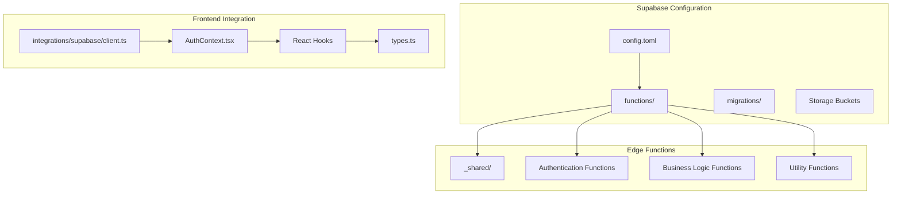

**Diagram sources**
- [config.toml](file://supabase/config.toml#L1-L80)
- [client.ts](file://src/integrations/supabase/client.ts#L1-L20)
- [types.ts](file://src/integrations/supabase/types.ts#L1-L800)

**Section sources**
- [config.toml](file://supabase/config.toml#L1-L80)
- [client.ts](file://src/integrations/supabase/client.ts#L1-L20)

## Supabase Configuration

### config.toml Structure and JWT Verification Settings

The `config.toml` file serves as the central configuration hub for Supabase Edge Functions, specifically managing JWT verification settings at the function level. This granular control allows different functions to operate with varying security requirements:

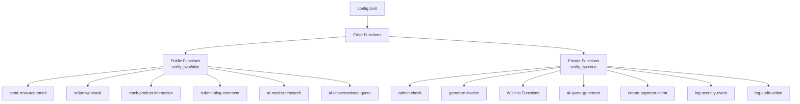

**Diagram sources**
- [config.toml](file://supabase/config.toml#L3-L80)

The configuration demonstrates a clear separation between public and private functions:

- **Public Functions (verify_jwt = false)**: These functions are designed for external access without requiring authentication, such as resource email delivery, webhook processing, and AI research services.
- **Private Functions (verify_jwt = true)**: These functions require JWT verification for secure access, including administrative operations, financial transactions, and user-specific data manipulation.

### Environment Variable Management

The system implements comprehensive environment variable validation through the `env-validator.ts` module, ensuring secure and reliable configuration:

| Variable | Purpose | Validation |
|----------|---------|------------|
| `VITE_SUPABASE_URL` | Supabase project endpoint | URL format validation |
| `VITE_SUPABASE_PUBLISHABLE_KEY` | Client-side authentication key | JWT-like key format check |

**Section sources**
- [config.toml](file://supabase/config.toml#L1-L80)
- [env-validator.ts](file://src/lib/env-validator.ts#L1-L142)

## Frontend Integration

### Supabase Client Initialization

The frontend integration utilizes the official `@supabase/supabase-js` client library (version 2.58.0) with comprehensive configuration for optimal performance and security:

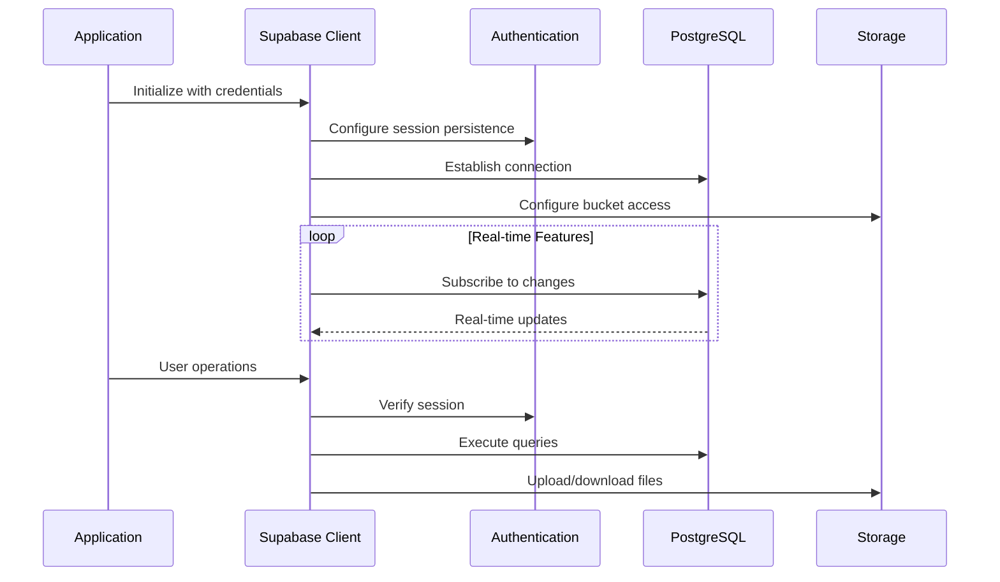

**Diagram sources**
- [client.ts](file://src/integrations/supabase/client.ts#L14-L20)
- [AuthContext.tsx](file://src/contexts/AuthContext.tsx#L40-L165)

### Authentication Context Provider

The authentication system is built around a React Context provider that manages user state, roles, and permissions throughout the application:

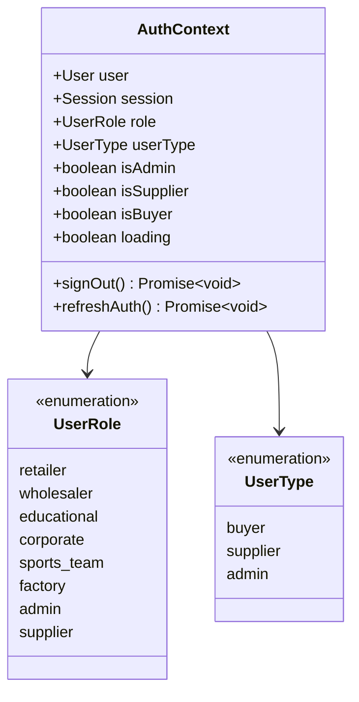

**Diagram sources**
- [AuthContext.tsx](file://src/contexts/AuthContext.tsx#L5-L16)

**Section sources**
- [client.ts](file://src/integrations/supabase/client.ts#L1-L20)
- [AuthContext.tsx](file://src/contexts/AuthContext.tsx#L1-L165)

## Edge Functions Architecture

### Function Categories and Security Model

The Edge Functions are organized into distinct categories based on their security requirements and business logic:

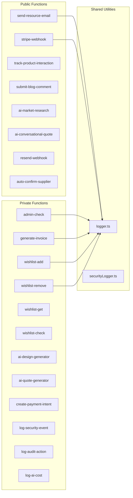

**Diagram sources**
- [config.toml](file://supabase/config.toml#L3-L80)
- [logger.ts](file://supabase/functions/_shared/logger.ts#L1-L173)

### Authentication and Authorization in Edge Functions

Each Edge Function implements appropriate authentication and authorization mechanisms:

#### Admin Check Function
The admin check function demonstrates secure JWT verification with role-based access control:

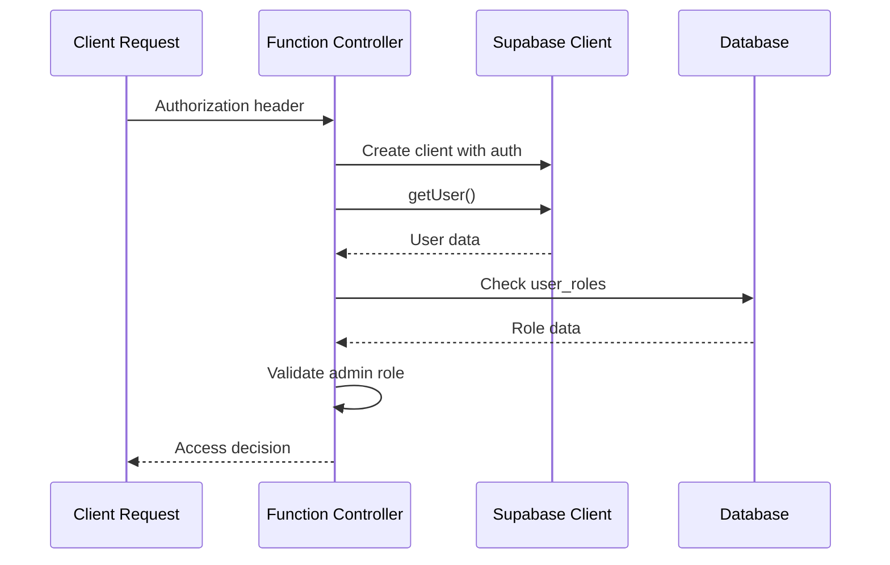

**Diagram sources**
- [admin-check/index.ts](file://supabase/functions/admin-check/index.ts#L14-L74)

#### Wishlist Management Function
The wishlist functions showcase user authentication with rate limiting and data validation:

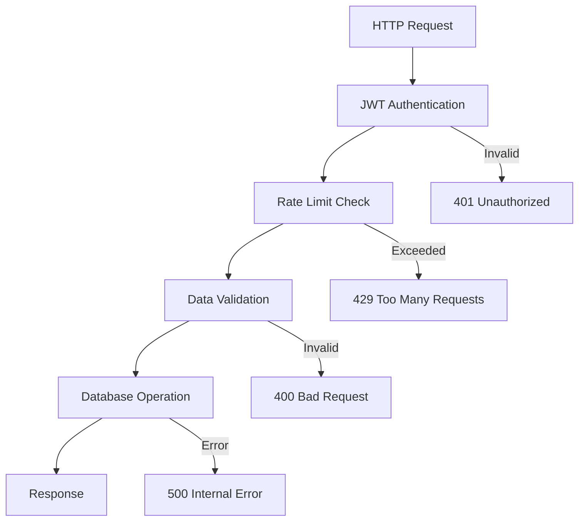

**Diagram sources**
- [wishlist-add/index.ts](file://supabase/functions/wishlist-add/index.ts#L14-L121)

**Section sources**
- [admin-check/index.ts](file://supabase/functions/admin-check/index.ts#L1-L74)
- [wishlist-add/index.ts](file://supabase/functions/wishlist-add/index.ts#L1-L121)
- [send-resource-email/index.ts](file://supabase/functions/send-resource-email/index.ts#L1-L232)

## Database Schema

### Core Tables and Relationships

The PostgreSQL database implements a comprehensive schema supporting the marketplace ecosystem:

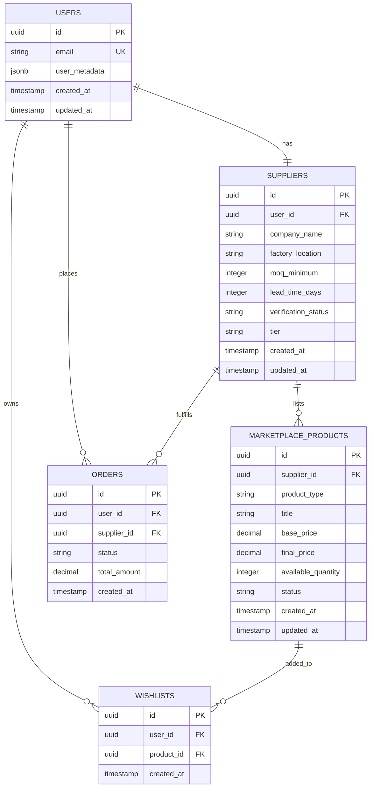

**Diagram sources**
- [20250122000000_create_marketplace_system.sql](file://supabase/migrations/20250122000000_create_marketplace_system.sql#L42-L200)
- [add_supplier_to_quotes.sql](file://supabase/migrations/add_supplier_to_quotes.sql#L6-L13)

### Storage Configuration

The storage system is configured with dedicated buckets for different content types:

| Bucket Name | Purpose | Access Level | File Size Limit | Allowed Types |
|-------------|---------|--------------|-----------------|---------------|
| `product-images` | Marketplace product photos | Public | 5MB | JPEG, PNG, WebP, GIF |
| `user-profiles` | User profile pictures | Private | 2MB | JPEG, PNG |
| `documents` | Administrative documents | Restricted | 10MB | PDF, DOCX, XLSX |

**Section sources**
- [20250122000000_create_marketplace_system.sql](file://supabase/migrations/20250122000000_create_marketplace_system.sql#L1-L200)
- [add_supplier_to_quotes.sql](file://supabase/migrations/add_supplier_to_quotes.sql#L1-L28)
- [20250122010000_setup_product_images_storage.sql](file://supabase/migrations/20250122010000_setup_product_images_storage.sql#L1-L123)

## Authentication System

### Multi-Factor Authentication and User Roles

The authentication system supports multiple user types with role-based access control:

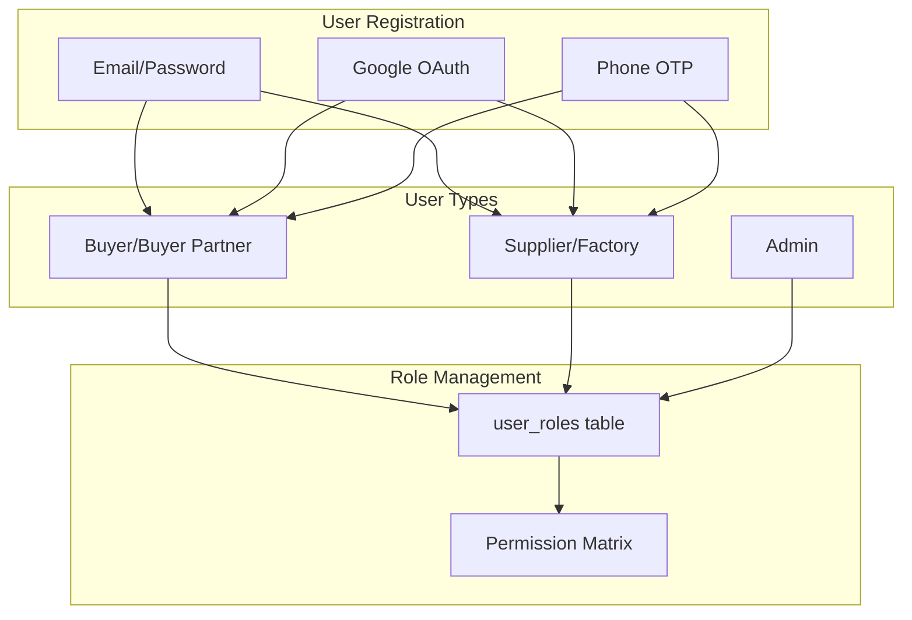

**Diagram sources**
- [Auth.tsx](file://src/pages/Auth.tsx#L57-L135)
- [AuthContext.tsx](file://src/contexts/AuthContext.tsx#L5-L16)

### Session Management and Security

The system implements robust session management with automatic token refresh and secure storage:

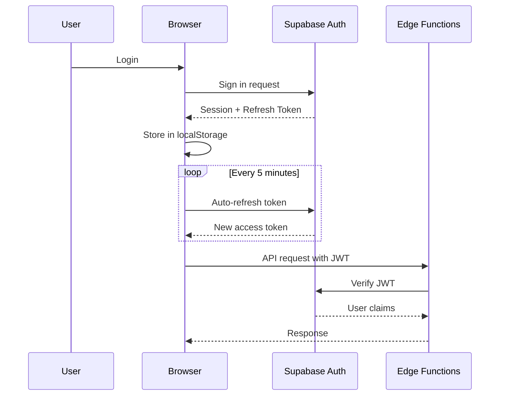

**Diagram sources**
- [client.ts](file://src/integrations/supabase/client.ts#L15-L20)
- [Auth.tsx](file://src/pages/Auth.tsx#L137-L153)

**Section sources**
- [Auth.tsx](file://src/pages/Auth.tsx#L1-L200)
- [AuthContext.tsx](file://src/contexts/AuthContext.tsx#L1-L165)

## Real-time Features

### WebSocket Connections and Event Streaming

The application leverages Supabase's real-time capabilities for live updates and notifications:

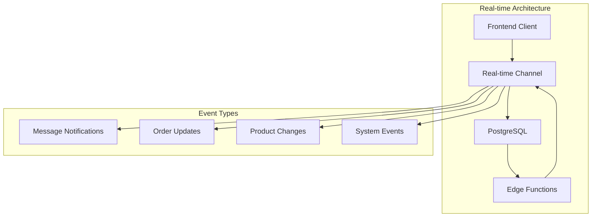

**Diagram sources**
- [useRealtimeMessages.ts](file://src/hooks/useRealtimeMessages.ts#L17-L61)

### Connection Monitoring and Reliability

The system implements comprehensive connection monitoring with automatic reconnection:

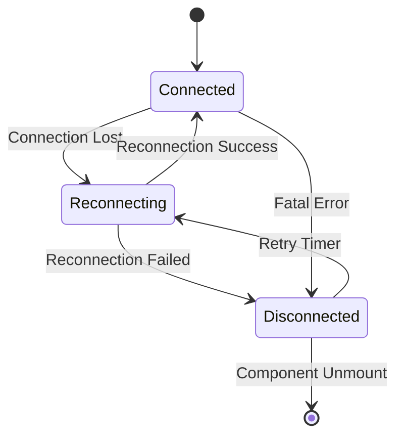

**Diagram sources**
- [useRealtimeMessages.ts](file://src/hooks/useRealtimeMessages.ts#L17-L61)

**Section sources**
- [useRealtimeMessages.ts](file://src/hooks/useRealtimeMessages.ts#L1-L61)

## Security Implementation

### Data Protection and Privacy

The security implementation follows industry best practices with comprehensive data protection:

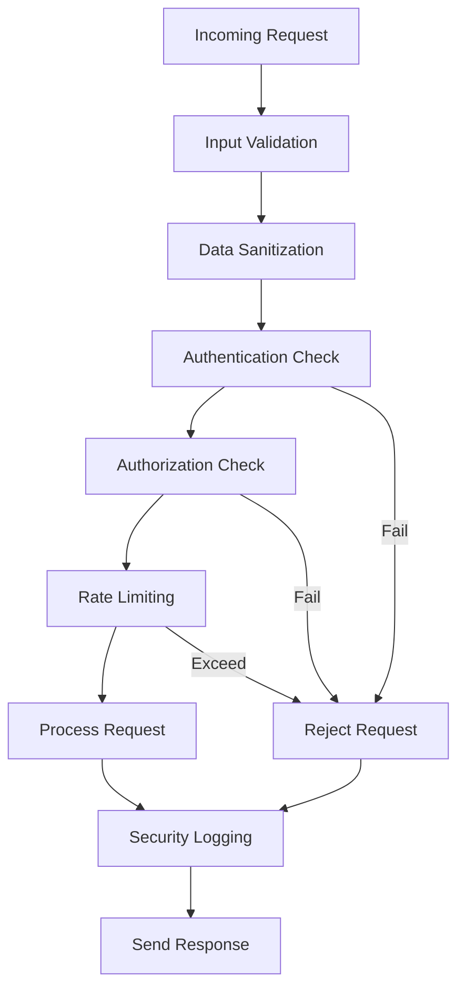

**Diagram sources**
- [logger.ts](file://supabase/functions/_shared/logger.ts#L1-L173)

### PII Protection and Data Sanitization

The logging system implements comprehensive PII protection:

| Data Type | Sanitization Method | Example |
|-----------|-------------------|---------|
| Email | First 3 chars + *** | `joh***@example.com` |
| Phone | Prefix + **** + Suffix | `+880****90` |
| Order ID | First 8 chars + **** | `550e8400-****` |
| Password/Token | Full redaction | `[REDACTED]` |

**Section sources**
- [logger.ts](file://supabase/functions/_shared/logger.ts#L1-L173)

## Performance and Scalability

### Connection Pooling and Resource Management

The system implements efficient resource management for optimal performance:

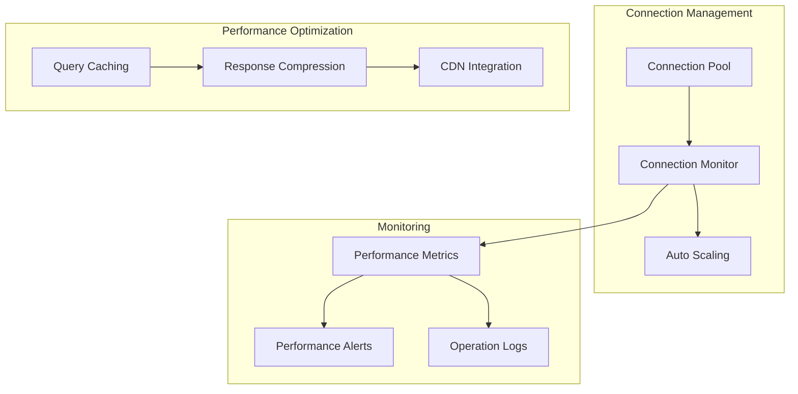

### Rate Limiting and Throttling

The system implements comprehensive rate limiting across multiple dimensions:

| Function Category | Rate Limit | Window | Action |
|------------------|------------|--------|--------|
| Wishlist Operations | 100 per hour | 1 hour | Block after limit |
| Resource Downloads | 3 per day | 24 hours | Block after limit |
| API Calls | 1000 per minute | 1 minute | Queue requests |
| Authentication | 5 attempts | 5 minutes | Account lockout |

## Deployment Configuration

### Environment-Specific Settings

The deployment configuration supports multiple environments with environment-specific optimizations:

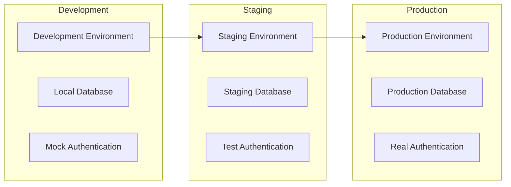

### CI/CD Pipeline Integration

The Supabase configuration integrates seamlessly with modern CI/CD pipelines:

| Stage | Supabase Action | Trigger |
|-------|----------------|---------|
| Migration | Apply schema changes | Pull request merge |
| Function Deploy | Deploy Edge Functions | Tag creation |
| Storage Sync | Update bucket policies | Configuration change |
| Environment Sync | Update secrets | Manual trigger |

## Infrastructure Requirements

### Hardware and Network Specifications

The infrastructure requirements scale with application growth:

| Component | Development | Staging | Production |
|-----------|-------------|---------|------------|
| Database CPU | 2 vCPU | 4 vCPU | 8 vCPU+ |
| Database Memory | 4 GB | 8 GB | 16 GB+ |
| Edge Functions | 128 MB | 256 MB | 512 MB+ |
| Storage | 10 GB | 50 GB | 200 GB+ |
| CDN Bandwidth | 1 TB | 5 TB | 20 TB+ |

### High Availability and Disaster Recovery

The architecture implements comprehensive high availability measures:

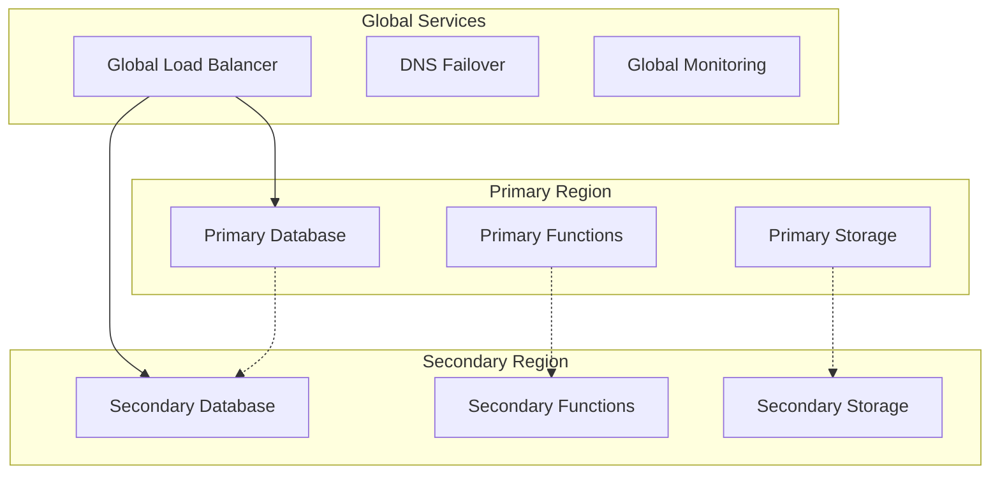

## Troubleshooting Guide

### Common Issues and Solutions

#### Authentication Problems
- **Issue**: JWT verification failures
- **Solution**: Check environment variables and token expiration
- **Prevention**: Implement proper token refresh logic

#### Database Connection Issues
- **Issue**: Connection timeouts or pool exhaustion
- **Solution**: Review connection limits and optimize queries
- **Prevention**: Implement connection pooling and query optimization

#### Edge Function Timeouts
- **Issue**: Functions exceeding execution limits
- **Solution**: Optimize function logic and implement async processing
- **Prevention**: Monitor function performance and set appropriate timeouts

#### Real-time Connection Drops
- **Issue**: WebSocket disconnections
- **Solution**: Implement automatic reconnection with exponential backoff
- **Prevention**: Monitor network stability and connection health

### Monitoring and Alerting

The system implements comprehensive monitoring:

| Metric | Threshold | Action |
|--------|-----------|--------|
| Database connections | 80% | Scale up |
| Function execution time | 5 seconds | Investigate |
| Authentication failures | 5% | Security review |
| Real-time connection drops | 10% | Network investigation |

## Conclusion

The Supabase configuration provides a robust, scalable, and secure foundation for the Sleek Apparels marketplace platform. The architecture successfully balances ease of development with enterprise-grade security and performance requirements.

Key strengths of the implementation include:

- **Granular Security Control**: Function-level JWT verification allows precise access control
- **Comprehensive Real-time Features**: WebSocket connections enable live updates and notifications
- **Scalable Architecture**: Proper connection pooling and rate limiting ensure performance under load
- **Developer Experience**: Well-structured codebase with clear separation of concerns
- **Security First**: Comprehensive PII protection and authentication mechanisms

The configuration demonstrates best practices for modern web applications using Supabase as a Backend-as-a-Service, providing a solid foundation for future feature additions and scaling requirements.